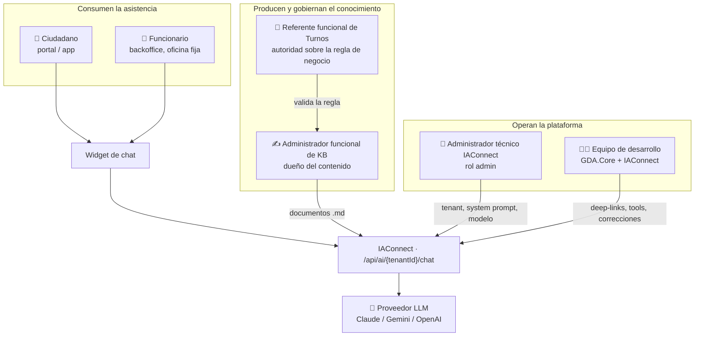

# 00 · Marco de referencia

Toda la guía se apoya en tres ejes que se definen una sola vez acá y que el resto de los documentos referencia sin volver a explicarlos: **escenarios** (en qué situación está el usuario), **contextos** (qué variante del entorno cambia la respuesta) y **actores** (quién interviene y qué le toca decidir). Un tema que no se cruza con ningún escenario ni contexto sobra o está mal delimitado.

**Convención de marcas** (heredada de [`Analisis-Asistencia-IA-ChatBotIA.md`](../../Antecedentes/Analisis-Asistencia-IA-ChatBotIA.md) §0):

| Marca | Significado |
|---|---|
| 🟩 | Hecho verificado en fuente; se cita ruta |
| 🟦 | Práctica de industria establecida |
| 🟨 | Interpretación, inferencia o propuesta propia de este estudio |
| **No verificado** | Afirmación que no pudo respaldarse; se declara como tal |

---

## 1. Escenarios

Un escenario es una situación típica de uso, definida por lo que el usuario quiere lograr —no por la pantalla en la que está ni por la tecnología que lo resuelve. Los seis que siguen cubren las cinco consultas de ejemplo del planteo y los casos que el relevamiento previo encontró en el sistema.

| ID | Escenario | Pregunta arquetípica | Naturaleza del conocimiento que exige |
|---|---|---|---|
| **ESC-1** | **Descubrimiento de trámite** — el usuario sabe qué necesita pero no cómo se llama en el sistema | «quiero turno para castración», «turno para el veterinario» | Catálogo + vocabulario coloquial (estable) |
| **ESC-2** | **Preparación del trámite** — ya identificó el trámite y necesita requisitos, lugares, condiciones | «qué papeles llevo», «dónde se atiende» | Requisitos y parametría (semi-estable) |
| **ESC-3** | **Disponibilidad y reserva** — quiere saber cuándo hay lugar y tomarlo | «¿cuándo podría ser?», «en qué días y horarios trabajan» | Agenda en vivo (volátil) |
| **ESC-4** | **Estado propio** — consulta o gestiona lo que ya tiene | «qué turnos tengo», «lo quiero cancelar» | Datos del titular (volátil + personal) |
| **ESC-5** | **Operación del sistema** — un funcionario necesita ejecutar o entender una función del backoffice | «cómo agrego turnos en la agenda de zoonosis» | Procedimiento de UI + reglas de negocio (estable) |
| **ESC-6** | **Borde y fuera de alcance** — el pedido no existe, no corresponde al dominio o es un intento de escalar | «quiero reprogramar», «pagar una multa», prompt injection | Límites explícitos del sistema (estable) |

🟨 ESC-6 es el que más define la calidad percibida y el que casi nadie documenta. Un asistente se juzga por cómo se comporta cuando **no sabe**, no por el camino feliz. El relevamiento previo dejó evidencia dura de por qué importa: no existe reprogramación de turnos en GDA (🟩 grep global por `reprogram` sobre `*.cs`/`*.razor` = 0 hits, [`02-HLD.md` §5 D3](../../GDA-Turnos/02-HLD.md)), y sin un documento que lo diga, el modelo llena el hueco inventando un botón que el vecino nunca va a encontrar.

### 1.1 Las cinco consultas del planteo, ubicadas

| Consulta del planteo | Escenarios que activa | Comentario |
|---|---|---|
| Ciudadano 1 — castración, perro macho, 5 años, Paraná | ESC-1 → ESC-3 | Trae datos que el sistema **no usa** (raza, edad); el asistente debe descartarlos sin descortesía |
| Ciudadano 2 — «vengo a sacar turno para castrar al perro, ¿cuándo podría ser?» | ESC-1 → ESC-3 | Pregunta directa por disponibilidad: el corazón del problema de datos volátiles |
| Ciudadano 3 — «en qué días y horarios trabajan» | ESC-2 → ESC-3 | Ambigua entre parametría de la oficina y agenda en vivo |
| Ciudadano 4 — «turno con el veterinario» | ESC-1 | Sinonimia pura: «veterinario» es rol, el sistema nombra motivos y oficinas |
| Funcionario 1 — «cómo agregar turnos en la agenda de zoonosis» | ESC-5 | Único caso cubierto —parcialmente— por la KB actual |

El desarrollo turno a turno de cada una está en [`06-Flujos-Conversacionales.md`](06-Flujos-Conversacionales.md).

---

## 2. Contextos

El mismo escenario se resuelve distinto según tres variantes del entorno. Confundirlas es la causa habitual de que un diseño conversacional «funcione en la demo» y falle en producción.

### 2.1 Contexto por canal

| ID | Canal | Identidad disponible | Consecuencia |
|---|---|---|---|
| **CTX-C1** | `GDA.Core.BackOffice.Turnos` (funcionario) | 🟩 Sesión con `IdOficina` obligatoria; sin roles ni policies, el único discriminador es `IsOficina` + oficina elegida ([`01-SAD.md` §3.2 C3](../../GDA-Turnos/01-SAD.md)) | Público chico, capacitado y trazable: el mejor lugar para empezar |
| **CTX-C2** | `GDA.Core.Ciudadano` (portal) | Sesión de vecino por DNI, o anónimo | `PathBase` `/ciudadano`: 🟩 los deep-links **no** son intercambiables con la app ([`01-SAD.md` §3.2 C6](../../GDA-Turnos/01-SAD.md)) |
| **CTX-C3** | `GDA.Core.CiudadanoApp` | Ídem portal, cookie `SameSite=Strict` 🟩 | El widget debe ser componente in-process, no iframe cross-site |

### 2.2 Contexto por fase de capacidad

Esta es la variante que más cambia las respuestas, y la que hay que declarar en cada afirmación de esta guía.

| ID | Fase | Qué puede el asistente | Estado hoy |
|---|---|---|---|
| **CTX-F1** | **Informativo (RAG-only)** | Explicar, desambiguar, derivar con deep-link. No consulta datos en vivo | 🟩 Única fase construible sin desarrollo nuevo |
| **CTX-F2** | **Informativo + datos en vivo (tools de lectura)** | Además: disponibilidad, mis turnos, agenda del día | 🟩 **No disponible**: no existe function-calling en IAConnect (grep `tool_use`/`tool_choice`/`function_call` = 0 hits) ni API REST de consulta de turnos en GDA ([`01-SAD.md` §3.3 I1, §3.2 C1](../../GDA-Turnos/01-SAD.md)) |
| **CTX-F3** | **Transaccional (tools de escritura)** | Cancelar, reservar | 🟨 Fuera de alcance del caso; decidido como «informa y deriva» |

### 2.3 Contexto por naturaleza del dato

| ID | Naturaleza | Ejemplo en Turnos | Mecanismo correcto |
|---|---|---|---|
| **CTX-D1** | **Estable** — igual para todos, cambia por decisión editorial | Qué es un tipo de turno; que no existe reprogramación | KB / RAG |
| **CTX-D2** | **Semi-estable** — igual para todos, cambia por ABM | Catálogo de motivos, requisitos, horarios de atención de una oficina | KB con recarga disciplinada, o tool si el daño de un dato vencido es alto |
| **CTX-D3** | **Volátil** — cambia por operación, minuto a minuto | Huecos libres en la agenda | Tool. **Nunca** KB |
| **CTX-D4** | **Personal** — es de un titular | Mis turnos, mi historial de ausencias | Tool con identidad del claim. **Nunca** KB |

🟦 La regla de corte es volatilidad + titularidad. Indexar CTX-D4 en el RAG es el error de diseño más caro de revertir: convierte el índice en un repositorio de datos personales que hay que particionar y proteger por usuario ([antecedente §A·ii](../../Antecedentes/Analisis-Asistencia-IA-ChatBotIA.md)).

---

## 3. Actores

| Actor | Responsabilidad | Qué decide | Qué **no** decide |
|---|---|---|---|
| **Ciudadano** | Plantea la consulta en su propio vocabulario | Si el asistente le sirvió | Nada del sistema |
| **Funcionario** | Consulta procedimientos y reglas mientras atiende | Cuándo escalar a mesa de ayuda | No puede saltear las validaciones: 🟩 el backoffice corre las mismas reglas de tope y ausentismo que el portal (`TurnosService.ValidarUsuario`, [`02-HLD.md` §5 D6](../../GDA-Turnos/02-HLD.md)) |
| **Administrador funcional de KB** | Redacta, versiona y recarga el corpus; releva el vocabulario real | Qué entra a la KB y cómo se redacta | Parametría del tenant y modelo |
| **Referente funcional de Turnos** | Autoridad sobre qué es cierto del negocio | Aprueba el contenido antes de publicarlo | Redacción y formato |
| **Administrador técnico de IAConnect** | Alta de tenants, `System_Prompt`, `Max_Tokens`, proveedor y modelo; 🟩 la carga de documentos exige rol `admin` ([`03_api-endpoints.md`](../../../../ia-db/indexes/03_api-endpoints.md)) | Configuración de plataforma | Contenido del corpus |
| **Equipo de desarrollo** | Widget, deep-links, API de lectura, function-calling | Cómo se implementa | Qué responde el asistente |
| **Proveedor LLM** | Genera la respuesta | — | 🟨 No es fuente de verdad: todo lo que afirme sin fragmento que lo sostenga es riesgo |

🟨 El actor que este marco agrega respecto de un proyecto de software común es el **administrador funcional de KB**. Sin ese rol nombrado y con nombre y apellido, el corpus envejece en silencio: nadie recibe un error, el asistente sigue respondiendo con tono seguro sobre un trámite que se dio de baja hace tres meses.

---

## 4. Cómo se cruzan los tres ejes

La combinación escenario × fase determina si una pregunta tiene respuesta hoy. Esta tabla es el resumen operativo de toda la guía.

| Escenario | En CTX-F1 (hoy) | En CTX-F2 (con tools) |
|---|---|---|
| ESC-1 Descubrimiento | ✅ Resuelto por KB + diccionario de sinónimos | ✅ Igual, con tool de catálogo para 39+ motivos |
| ESC-2 Preparación | ✅ Resuelto por KB de requisitos | ✅ Igual |
| ESC-3 Disponibilidad | ⚠️ **Solo disclosure + deep-link**: el asistente declara que no ve la agenda y lleva a la pantalla | ✅ Responde con huecos reales |
| ESC-4 Estado propio | ❌ **No se responde**: sin identidad propagada ni tool | ✅ Con identidad del claim |
| ESC-5 Operación | ✅ Resuelto por KB de procedimientos | ✅ Igual, + agenda del día |
| ESC-6 Bordes | ✅ Resuelto por KB de límites + system prompt | ✅ Igual |

🟨 Lectura de esta tabla: **cuatro de los seis escenarios ya son atendibles sin escribir una línea de código**. Lo que falta no es tecnología, es corpus. Los dos que faltan son exactamente los que las consultas 1, 2 y 3 del planteo piden —de ahí que el documento sobre información dinámica ([`07-Informacion-Dinamica.md`](07-Informacion-Dinamica.md)) sea el que decide el alcance real del MVP.

---

## 5. Preguntas guía

Las que hay que poder responder antes de diseñar cualquier pieza de la asistencia:

1. ¿En qué escenario está el usuario cuando escribe esto? Si la consulta activa dos, ¿cuál se atiende primero?
2. ¿La respuesta cambia según el canal? Si cambia el deep-link, ¿el corpus está segmentado por canal o hay un solo texto que miente en uno de ellos?
3. ¿El dato que hace falta es CTX-D1/D2 (va a la KB) o CTX-D3/D4 (exige tool)? Si es semi-estable, ¿cuánto daño hace responder con la versión anterior?
4. ¿Qué actor es dueño de este contenido y con qué frecuencia lo revisa? Si no hay nombre propio, el contenido no tiene dueño.
5. ¿Qué pasa en este escenario cuando el asistente **no sabe**? ¿Está escrita esa respuesta?

---

## Documentos relacionados

| Necesitás… | Documento |
|---|---|
| Ubicarte y saber qué leer | [`01-Mapa-Conceptual.md`](01-Mapa-Conceptual.md) |
| Saber si la KB actual sirve | [`02-Base-Conocimiento-Diagnostico.md`](02-Base-Conocimiento-Diagnostico.md) |
| Estructurar una KB nueva | [`03-Estructura-y-Plantilla-KB.md`](03-Estructura-y-Plantilla-KB.md) |
| Metodologías y catalogación de preguntas | [`04-Metodologias-y-Catalogacion.md`](04-Metodologias-y-Catalogacion.md) |
| Integrar IAConnect en los sistemas GDA | [`05-Integracion-IAConnect.md`](05-Integracion-IAConnect.md) |
| Los flujos conversacionales de las consultas del planteo | [`06-Flujos-Conversacionales.md`](06-Flujos-Conversacionales.md) |
| Resolver la información cambiante | [`07-Informacion-Dinamica.md`](07-Informacion-Dinamica.md) |
| Definiciones | [`08-Glosario.md`](08-Glosario.md) |
