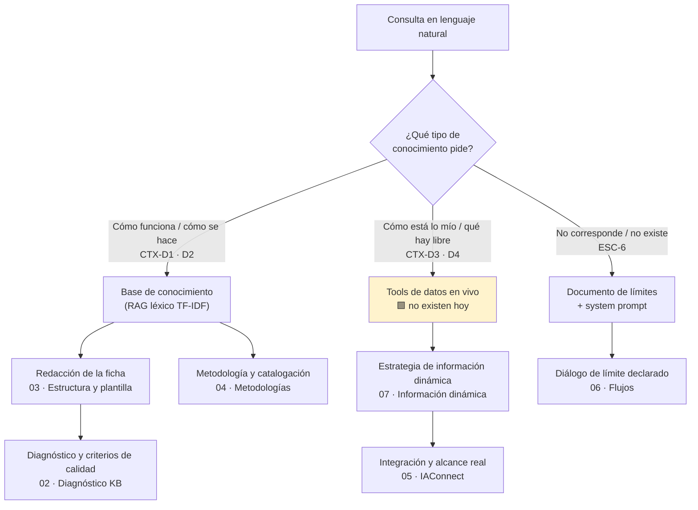
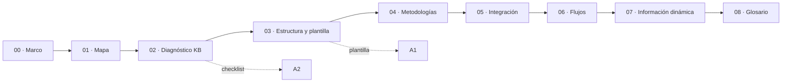

# 01 · Mapa conceptual

Tres tablas de entrada al cuerpo documental: por escenario, por artefacto y por pregunta concreta. Cada fila responde a «estoy acá → qué leo y qué produzco». Los identificadores `ESC-*`, `CTX-*` son los del [marco de referencia](00-Marco-Referencia.md).

---

## 1. Mapa del dominio

---

## 2. Entrada por escenario

| Estoy en… | Lo que necesito decidir | Documento | Artefacto que produzco |
|---|---|---|---|
| **ESC-1** Descubrimiento de trámite | Cómo lograr que «castración» encuentre el motivo correcto con un RAG léxico | [`03`](03-Estructura-y-Plantilla-KB.md) §2, §4 · [`04`](04-Metodologias-y-Catalogacion.md) §3 | Ficha de catálogo + diccionario de sinónimos |
| **ESC-2** Preparación | Qué requisitos publico y de dónde salen | [`03`](03-Estructura-y-Plantilla-KB.md) §3 | Ficha de requisitos (des-HTMLizada) |
| **ESC-3** Disponibilidad | Si respondo, derivo o declaro el límite | [`07`](07-Informacion-Dinamica.md) §3 · [`06`](06-Flujos-Conversacionales.md) §3 | Texto de disclosure + deep-link a la agenda |
| **ESC-4** Estado propio | Cómo propago identidad sin exponer datos ajenos | [`05`](05-Integracion-IAConnect.md) §5 · [`07`](07-Informacion-Dinamica.md) §5 | Precondiciones de seguridad |
| **ESC-5** Operación (funcionario) | Cómo se redacta un procedimiento de UI que sobreviva al chunking | [`02`](02-Base-Conocimiento-Diagnostico.md) §4 · [`03`](03-Estructura-y-Plantilla-KB.md) §3 | Ficha de procedimiento, un tema por documento |
| **ESC-6** Borde / fuera de alcance | Qué digo cuando la función no existe | [`03`](03-Estructura-y-Plantilla-KB.md) §3.6 · [`06`](06-Flujos-Conversacionales.md) §4 | Documento de límites |

---

## 3. Entrada por artefacto

| Quiero producir… | Leé | Plantilla / checklist |
|---|---|---|
| Una ficha nueva de la KB | [`03-Estructura-y-Plantilla-KB.md`](03-Estructura-y-Plantilla-KB.md) | [`Anexos/A1-Plantilla-KB.md`](Anexos/A1-Plantilla-KB.md) |
| La evaluación de una KB existente | [`02-Base-Conocimiento-Diagnostico.md`](02-Base-Conocimiento-Diagnostico.md) | [`Anexos/A2-Checklist-Evaluacion-KB.md`](Anexos/A2-Checklist-Evaluacion-KB.md) |
| El árbol completo de un corpus nuevo | [`03-Estructura-y-Plantilla-KB.md`](03-Estructura-y-Plantilla-KB.md) §5 | — |
| La taxonomía de preguntas de un dominio | [`04-Metodologias-y-Catalogacion.md`](04-Metodologias-y-Catalogacion.md) §4 | — |
| El plan de integración en un sistema GDA | [`05-Integracion-IAConnect.md`](05-Integracion-IAConnect.md) | — |
| El diseño conversacional de un caso | [`06-Flujos-Conversacionales.md`](06-Flujos-Conversacionales.md) | — |
| La clasificación estático/dinámico de las fuentes | [`07-Informacion-Dinamica.md`](07-Informacion-Dinamica.md) §2 | — |

---

## 4. Entrada por pregunta del planteo

Trazabilidad directa entre lo solicitado y dónde se responde.

| # | Solicitud del planteo | Documento que la resuelve |
|---|---|---|
| 1a | ¿La base de conocimiento actual está bien redactada? | [`02`](02-Base-Conocimiento-Diagnostico.md) §3–§4 |
| 1b | ¿Cuál sería la estructura correcta y la forma del relato? | [`03`](03-Estructura-y-Plantilla-KB.md) §2–§3 |
| 1c | Preguntas guía para saber si es adecuada | [`02`](02-Base-Conocimiento-Diagnostico.md) §6 · [`Anexos/A2`](Anexos/A2-Checklist-Evaluacion-KB.md) |
| 1d | Plantilla genérica para estructurar la KB | [`Anexos/A1`](Anexos/A1-Plantilla-KB.md) |
| 1e | ¿Qué se presume que usa Mercado Pago? ¿Qué metodologías existen? ¿Se catalogan las preguntas? | [`04`](04-Metodologias-y-Catalogacion.md) §2–§4 |
| 2 | Qué tener en cuenta en IAConnect para integrarlo en backoffice y en apps ciudadanas; alcance actual; qué falta respecto de Mercado Pago | [`05`](05-Integracion-IAConnect.md) |
| 3 | Flujo conversacional de cada consulta de ejemplo; ¿puede reservar un turno? | [`06`](06-Flujos-Conversacionales.md) |
| 4 | Información cambiante y propia del usuario: cómo se resuelve y cómo se actualiza hoy | [`07`](07-Informacion-Dinamica.md) |
| 5 | Glosario con definiciones (contenido curado, deep-link, corpus) | [`08`](08-Glosario.md) |

---

## 5. Ruta de lectura sugerida

🟨 Quien solo dispone de una hora: `00` → `02` → `07`. Es el recorrido mínimo que deja claro qué se puede prometer hoy y qué no.

---

## 6. Relación con el análisis previo

Este cuerpo documental es **formativo**: enseña a decidir. El diseño ya decidido para el caso Turnos vive en el bloque hermano [`../../GDA-Turnos/`](../../GDA-Turnos/01-SAD.md) y **no se repite acá**; se referencia.

| Si buscás… | Está en |
|---|---|
| La arquitectura de contenedores y componentes del caso | [`../../GDA-Turnos/01-SAD.md`](../../GDA-Turnos/01-SAD.md) |
| Intents, entities, máquina de estados, 10 diálogos anotados | [`../../GDA-Turnos/02-HLD.md`](../../GDA-Turnos/02-HLD.md) |
| Contratos, esquemas y código propuesto | [`../../GDA-Turnos/03-LLD.md`](../../GDA-Turnos/03-LLD.md) |
| Las decisiones y sus alternativas descartadas | [`../../GDA-Turnos/04-ADR.md`](../../GDA-Turnos/04-ADR.md) |
| Procedimientos de operación y de administración de la KB | [`../../GDA-Turnos/05-Operations-Guide.md`](../../GDA-Turnos/05-Operations-Guide.md) · [`06-Administrator-Guide.md`](../../GDA-Turnos/06-Administrator-Guide.md) |
| El marco general de criterio sobre chatbots IA (bloques A–G) | [`../../Antecedentes/Analisis-Asistencia-IA-ChatBotIA.md`](../../Antecedentes/Analisis-Asistencia-IA-ChatBotIA.md) |
