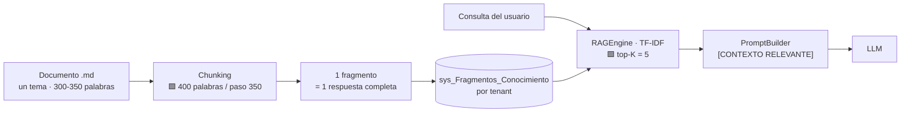
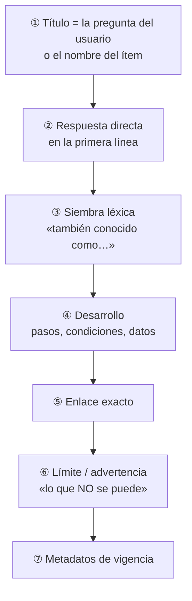

# 03 · Estructura de la base de conocimiento y forma del relato

Una KB bien estructurada se reconoce por una propiedad simple: **cualquiera de sus fragmentos, leído aislado y sin contexto, responde una pregunta completa**. Todo lo demás —la taxonomía de documentos, la plantilla, las reglas de redacción— existe para sostener esa propiedad frente a un motor que va a partir el texto en ventanas de 400 palabras y a entregarle al modelo solo cinco de ellas.

Este documento fija esa estructura. El diagnóstico de por qué el corpus actual no la cumple está en [`02`](02-Base-Conocimiento-Diagnostico.md); la plantilla lista para usar, en [`Anexos/A1-Plantilla-KB.md`](Anexos/A1-Plantilla-KB.md).

---

## 1. La unidad de diseño es el fragmento, no el documento



De ese diagrama salen tres restricciones de diseño que no son negociables mientras el motor sea el actual:

| Restricción real | Regla de redacción que impone | Marca |
|---|---|---|
| Ventana de 400 **palabras** (no tokens) con paso 350 | Ficha de 300–350 palabras: nunca se parte | 🟩 `KnowledgeService.cs:16-17,103-121` |
| top-K = 5 fijo | Cinco fichas deben bastar para responder: cada una autocontenida | 🟩 `RAGEngine` |
| Recuperación léxica sin embeddings | El texto debe contener las palabras del usuario, no sus sinónimos conceptuales | 🟩 `Vector_Embedding` siempre `null` |
| Todo el corpus se carga en memoria por request | Corpus chico: ~50–70 fragmentos por tenant | 🟩 `RAGEngine.cs:34-120` (O(N·M) sin caché) |

🟨 La consecuencia contraintuitiva: **una KB más grande puede responder peor**. Más fragmentos diluyen la señal del TF-IDF, agregan latencia y aumentan la chance de que los cinco recuperados sean los equivocados. El objetivo no es cubrir todo, es cubrir lo que se pregunta.

---

## 2. Las siete reglas de redacción

Adaptadas del método ya validado en el caso Turnos ([`06-Administrator-Guide.md` §4.1](../../GDA-Turnos/06-Administrator-Guide.md)) y generalizadas a cualquier dominio.

| # | Regla | Por qué |
|---|---|---|
| **R1** | **Sembrá el vocabulario del usuario dentro del propio texto.** Si el vecino dice «castrar», «capar», «esterilizar» y «operar al perro», las cuatro van escritas | 🟩 Con RAG léxico, sin la palabra no hay match |
| **R2** | **Un tema por documento, 300–350 palabras.** Si no entra, son dos temas | 🟩 Ventana de 400/350 |
| **R3** | **Escribí acentuado y sin acentuar** cuando el dato real del sistema va sin tilde | 🟩 Los datos de catálogo de GDA vienen sin tildes («Clinica Medica») y el tokenizador no normaliza |
| **R4** | **Copiá literalmente los mensajes que el usuario ve en pantalla**, entre comillas | El usuario los pega en el chat; si el corpus los parafrasea, no matchean |
| **R5** | **Poné la URL completa y exacta**, con el casing tal como lo emite el código | 🟩 Las rutas no son intercambiables entre portal y app; el asistente no debe «corregir» ni siquiera los typos de ruta |
| **R6** | **Decí explícitamente lo que NO se puede.** El silencio se llena con alucinación | 🟩 No existe reprogramación: si el corpus calla, el modelo la ofrece |
| **R7** | **Nunca incluyas datos personales, credenciales ni datos que cambian solos** | Un dato volátil indexado envejece en silencio; un dato personal indexado es un incidente |

---

## 3. Taxonomía de documentos del corpus

No todos los documentos de una KB tienen la misma forma. Estos ocho tipos cubren cualquier dominio de gestión; el corpus concreto de un caso es una instancia de esta taxonomía.

| Tipo | Qué contiene | Origen típico | Vida útil |
|---|---|---|---|
| **T1 · Catálogo** | Una ficha por ítem del dominio: nombre exacto, alias, dónde se hace, enlace | Generado desde la base (ETL) | Regenerar ante ABM |
| **T2 · Sinónimos** | Puente entre el vocabulario del usuario y el del sistema | Curado a mano | Mensual |
| **T3 · Requisitos** | Qué necesita el usuario antes de empezar | Generado desde la base, des-HTMLizado | Ante ABM |
| **T4 · Procedimiento** | Cómo se ejecuta una acción en la UI, paso a paso | Curado sobre la UI real | Ante cambio de pantalla |
| **T5 · Reglas de negocio** | Topes, penalizaciones, plazos, validaciones | Curado sobre el código | Ante cambio de código |
| **T6 · Mensajes y errores** | Un fragmento por mensaje literal del sistema, con qué hacer | Copiado del código | Ante cambio de mensaje |
| **T7 · Límites** | Lo que el sistema **no** hace | Curado sobre evidencia (greps, relevamiento) | Ante nueva funcionalidad |
| **T8 · Rutas / deep-links** | Mapa de URLs por canal | Generado desde las rutas del código | Ante nueva ruta |

🟨 **T7 es el tipo más subestimado y el más valioso.** Un corpus que solo dice lo que el sistema hace deja al modelo improvisando ante todo lo demás. En el caso Turnos, el fragmento de límites es el que evita el fallo más caro relevado.

### 3.1 Cuál de los ocho falta en la KB actual

De los ocho tipos, los dos archivos de [`../INPUTs/`](../INPUTs/) cubren parcialmente **T4** (procedimiento de configuración de agendas) y **T5** (validaciones por presentismo, mencionadas sin detalle). Los seis restantes no existen. Eso explica aritméticamente la cobertura de 1 sobre 5 medida en [`02` §3](02-Base-Conocimiento-Diagnostico.md).

---

## 4. La forma del relato

### 4.1 Anatomía de una ficha



Siete bloques, en ese orden, por una razón: **el usuario y el modelo leen de arriba hacia abajo, y ninguno de los dos llega al final**. La respuesta va primero; el desarrollo, después; la advertencia, antes de que el usuario actúe.

### 4.2 Reglas de estilo del texto

- **Segunda persona para el ciudadano, tercera para el funcionario.** El mismo hecho —«no podés sacar más de N turnos»— se convierte en «el vecino no puede sacar más de N turnos» en el corpus del backoffice. 🟩 En GDA la distinción existe en el propio código (`ValidarUsuario` vs. `ValidarUsuario_Funcionario`).
- **Frases cortas y un concepto por párrafo.** El destino es un chat, a menudo en un celular.
- **Nada de referencias internas.** «Ver la sección anterior» es texto muerto: el fragmento viaja solo.
- **El título es la pregunta.** `## ¿Puedo cambiar la fecha de mi turno?` recupera mejor que `## Modificación de turnos`, porque el usuario escribe la primera forma.

### 4.3 Ejemplo aplicado — el caso del planteo

> ⚠️ 🟨 **Ilustrativo.** El motivo «castración» **no está verificado** en el catálogo de GDA relevado; la ficha muestra la *forma*, no el dato. Antes de publicarla hay que confirmar contra `lut_MotivosTurnos` el nombre exacto, el `IdMotivo` y las oficinas.

#### ❌ Versión pobre

```markdown
## Castración

Trámite de zoonosis. Consultar disponibilidad en el portal.
```

Por qué falla: 18 palabras que desperdician un fragmento de 400; ninguna de las palabras que el vecino usó («castrar», «perro», «turno», «veterinario»); sin enlace, sin requisitos, sin límites. Un vecino que escribe *«vengo a sacar turno para castrar al perro»* aporta términos que no están —el fragmento puntúa cerca de cero y ni siquiera entra al top-5.

#### ✅ Versión adecuada

```markdown
## Trámite: Castración de mascotas

**Nombre exacto en el sistema:** <Nombre tal como figura en el catálogo>
**Categoría (tipo de turno):** <Tipo>
**También conocido como:** castración, castracion, castrar al perro, castrar
a la perra, capar, esterilizar, esterilización, operar al perro, operación
del perro, castración de gatos, turno con el veterinario, veterinaria,
zoonosis, sanidad animal.

**Para qué sirve:** turno para la cirugía de castración de perros y gatos en
el servicio municipal de zoonosis.

**Dónde se atiende:** <Oficina exacta del sistema, escrita como figura ahí y
también con tildes si el dato va sin ellas>.

**Enlace para sacar turno:**
https://<host>/ciudadano/TurnosLugar?m=<IdMotivo>
Ahí ves los lugares disponibles y, arriba, los requisitos del trámite.

**Qué se te va a pedir:** nombre, apellido, DNI, celular y correo electrónico.
Esos cinco datos son obligatorios para confirmar el turno.

**Qué NO define el turno:** la raza, la edad y el sexo del animal no se cargan
al sacar el turno. Si el caso tiene alguna particularidad, la evalúa el
profesional en el momento de la atención.

**Ojo:** una vez que elegís el horario tenés 5 minutos para completar tus
datos. Si tardás más, el horario vuelve a quedar libre para otra persona.
```

Por qué funciona: la línea *«También conocido como»* es un **campo de siembra léxica** —le entrega al TF-IDF las palabras que el vecino escribe realmente, incluida la variante sin tilde (R3)—; el bloque *«Qué NO define el turno»* responde por anticipado a los datos que la consulta 1 del planteo aporta y que el sistema no usa; el enlace es accionable; la advertencia de los 5 minutos es 🟩 real (`EntregaTurnosComponent.razor.cs:284-285`) y evita una consulta posterior. Unas 200 palabras: entra holgada en un fragmento.

### 4.4 Reescritura del corpus actual

Cómo se convierte lo que hoy existe en corpus utilizable, sin perder el contenido:

| Fuente actual | Se convierte en | Tipo |
|---|---|---|
| `Concepto-Turnos.md` párrafos 1–2 | *«¿Qué es un turno y quién los configura?»* — ficha de contexto, perfil funcionario | T5 |
| `Concepto-Turnos.md` §Preguntas (2 preguntas) | Dos fichas independientes, título = la pregunta | T4 |
| `Usuarios-Turnos.md` §Edificios y oficinas | *«Cómo dar de alta un edificio y una oficina»* | T4 |
| `Usuarios-Turnos.md` §Tipos y motivos | *«Diferencia entre tipo de turno y motivo de turno»* | T5 |
| `Usuarios-Turnos.md` §Agregar nuevos turnos | *«Cómo agregar turnos a la agenda de una oficina»* + ficha aparte de *«Qué significan Hora min, Hora Max, Intervalo y Turnos por intervalo»* | T4 |
| `Usuarios-Turnos.md` §Validaciones | *«Bloqueo por ausencias y tope de turnos»* | T5 |
| `Usuarios-Turnos.md` §Turnos internos | *«Cómo hacer que una oficina entregue turnos solo desde el backoffice»* | T4 |

Siete fichas donde había dos documentos. 🟨 Y una octava que no existe en el material de origen y hay que escribir: el documento de **límites** (T7) del perfil funcionario, empezando por que no se pueden saltear las validaciones desde el backoffice.

---

## 5. Árbol de contenidos de referencia

Estructura genérica; los nombres de archivo llevan número para que el orden de lectura humano coincida con el de carga.

```text
kb/
├── <perfil-a>/                  # p. ej. ciudadano
│   ├── 01-catalogo.md           # T1 · generado (ETL)
│   ├── 02-sinonimos.md          # T2 · curado ← la fuente del valor
│   ├── 03-requisitos.md         # T3 · generado
│   ├── 04-faq.md                # T4/T5 · curado
│   ├── 05-reglas-negocio.md     # T5 · curado (2ª persona)
│   ├── 06-rutas.md              # T8 · generado por canal
│   ├── 07-mensajes-error.md     # T6 · copiado del código
│   └── 08-limites.md            # T7 · curado ← el más importante
├── <perfil-b>/                  # p. ej. funcionario
│   ├── …                        # el común se reutiliza; lo propio cambia de voz
│   └── 09-procedimientos.md     # T4
└── tools/
    ├── generar-catalogo.sql     # extracción desde la base
    └── ingesta.ps1              # purga + carga idempotente
```

🟨 El directorio `tools/` no es opcional. Sin un script de ingesta que purgue antes de cargar, cada corrección duplica fragmentos ([`02` §4.8](02-Base-Conocimiento-Diagnostico.md)) y la KB se degrada con cada mejora.

---

## 6. Preguntas guía

1. ¿Cuál es la unidad de tu KB: el documento o el fragmento? Si respondés «el documento», todavía estás escribiendo para personas.
2. ¿Tu ficha más larga entra en un fragmento? ¿Lo verificaste contando palabras o lo suponés?
3. ¿Qué palabras usaría un usuario que no conoce el sistema? ¿Están escritas, con y sin acento?
4. ¿Qué tipos de la taxonomía (T1–T8) tenés y cuáles faltan? El que falta casi siempre es T7.
5. ¿El contenido común entre perfiles se genera desde una sola fuente, o se está manteniendo dos veces a mano?
6. ¿Cómo purgás antes de recargar? Si la respuesta es «no purgo», la KB tiene fecha de vencimiento.

---

## 7. Anexo

La plantilla comentada campo por campo, con las preguntas que guían cada uno y las variantes por tipo de documento, está en [`Anexos/A1-Plantilla-KB.md`](Anexos/A1-Plantilla-KB.md).

---

## Documentos relacionados

[`02-Base-Conocimiento-Diagnostico.md`](02-Base-Conocimiento-Diagnostico.md) · [`04-Metodologias-y-Catalogacion.md`](04-Metodologias-y-Catalogacion.md) · [`07-Informacion-Dinamica.md`](07-Informacion-Dinamica.md) · [`Anexos/A1-Plantilla-KB.md`](Anexos/A1-Plantilla-KB.md)
