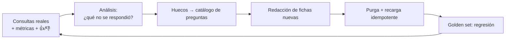

# 04 · Metodologías de construcción de KB y catalogación de preguntas

Hay una diferencia de fondo entre *tener contenido* y *tener corpus*: el contenido se acumula, el corpus se diseña contra una demanda conocida. Las metodologías que siguen —todas anteriores a los LLM, varias por décadas— existen para resolver ese mismo problema: escribir para alguien que llega con una pregunta y no va a leer el manual.

---

## 1. Marco: de dónde sale el contenido de una KB

```mermaid
flowchart LR
    subgraph Demanda["① Qué se pregunta"]
        T["Tickets de mesa de ayuda"]
        C["Llamadas / mostrador"]
        B["Buscador interno<br/>y consultas sin resultado"]
        L["Logs del propio asistente"]
    end
    subgraph Oferta["② Qué se sabe"]
        M["Manuales y procedimientos"]
        BD["Catálogos de la base"]
        CO["El código<br/>(mensajes, validaciones, rutas)"]
        P["Conocimiento tácito<br/>del referente funcional"]
    end
    Demanda --> X["③ Cruce demanda × oferta"]
    Oferta --> X
    X --> KB["④ Corpus redactado<br/>por tipo (T1-T8)"]
    KB --> E["⑤ Evaluación<br/>golden set + consultas sin respuesta"]
    E --> Demanda
```



🟨 El paso que casi siempre se saltea es ①. Una KB construida solo desde la oferta —volcando el manual— responde las preguntas que la organización sabe contestar, no las que la gente hace. El desajuste no se nota hasta producción, porque el asistente responde *algo* siempre.

🟩 Evidencia de que el paso ① es barato en este caso: el propio planteo aporta cinco consultas reales, y el relevamiento previo aportó los mensajes literales del sistema. Esa es materia prima de corpus de primera calidad.

---

## 2. Metodologías conocidas

Ninguna es específica de IA. Todas son marcos de escritura técnica o de gestión del conocimiento que se aplican bien a un corpus RAG, con la advertencia de que 🟨 su encaje con RAG es interpretación de esta guía, no una recomendación de sus autores.

| Metodología | En qué consiste | Qué aporta a una KB para RAG | Límite |
|---|---|---|---|
| **Topic-based authoring / DITA** 🟦 | Escribir «temas» independientes y reusables en lugar de libros; cada tema es concept, task o reference | Es literalmente la regla «un tema por documento»; la tripleta concepto/tarea/referencia mapea a los tipos T5/T4/T1 | Su maquinaria de publicación (mapas, transclusión) es sobredimensionada para un corpus de 60 fichas |
| **Information Mapping** 🟦 | Método de los años 60: descomponer en bloques de información etiquetados por tipo (procedimiento, principio, hecho, estructura), con un límite de 7±2 ítems por bloque | Da la disciplina de bloque autocontenido y etiquetado, que es exactamente lo que necesita un fragmento | Es propietario y su formalismo puede endurecer el tono |
| **Minimalismo (Carroll)** 🟦 | Escribir solo lo que el usuario necesita para actuar; empezar por la tarea, no por la explicación; anticipar el error | Produce fichas cortas, accionables y con la advertencia adelantada — el formato que un chat necesita | Puede dejar afuera el «por qué», que en gestión pública a veces es la respuesta |
| **Every Page is Page One** 🟦 | Asumir que el lector entra por cualquier página; cada una debe ubicarlo sola | Es la premisa operativa del RAG: el fragmento **siempre** es página uno | Obliga a repetir contexto, lo que tensiona con el presupuesto de 350 palabras |
| **FAQ mining / question-based authoring** 🟦 | Derivar el contenido de las preguntas reales, con la pregunta como título | Máxima recuperabilidad léxica: el título comparte términos con la consulta | Fragmenta el conocimiento; sin una taxonomía encima, la FAQ crece sin orden |
| **Query expansion por tesauro curado** 🟦 | Diccionario de sinónimos que traduce el vocabulario del usuario al del sistema | La única compensación viable de un RAG léxico sin embeddings | Se desincroniza en silencio del catálogo si nadie lo verifica |
| **Golden set / evals** 🟦 | Conjunto fijo de preguntas con la respuesta esperada, que se corre ante cada cambio | Convierte «mejoré la KB» en una afirmación verificable | Requiere disciplina de mantenimiento del propio set |

### 2.1 Cuáles aplican a este caso y en qué orden

🟨 Recomendación, ordenada por relación valor/esfuerzo para un corpus de ~60 fichas:

1. **FAQ mining** para decidir *qué* escribir (paso ① del marco).
2. **Minimalismo + Every Page is Page One** para decidir *cómo* redactar cada ficha.
3. **Tesauro curado** para cerrar la brecha de vocabulario que deja el RAG léxico. 🟩 Es la decisión ya tomada en el caso Turnos: diccionario de sinónimos versionado en la KB, no en la base de GDA ([ADR-005](../../GDA-Turnos/04-ADR.md)) — y 🟨 el activo más reusable, porque el molde vale igual para Multas, Habilitaciones o cualquier catálogo municipal.
4. **Golden set** desde el primer día, aunque tenga diez preguntas.

DITA e Information Mapping quedan como **fuente de criterio**, no como maquinaria a implantar: aportan el principio de bloque autocontenido sin justificar su costo de herramienta a esta escala.

---

## 3. ¿Qué se presume que usa Mercado Pago?

> ⚠️ **Alcance de lo afirmable.** El único material verificable son las capturas analizadas en [`IA-Mercado-Libre.md`](../../Antecedentes/IA-Mercado-Libre.md). De ahí se observa **comportamiento**, no implementación. Nada de esta sección debe presentarse como dato interno de la empresa: todo lo que sigue está marcado 🟨 salvo lo que se ve en pantalla.

### 3.1 Qué se observa (🟩, en las capturas)

| Observación | Qué implica sobre su contenido |
|---|---|
| Responde con información vigente y **corrige un supuesto del usuario** («no es así, funciona de esta otra manera») | Hay contenido escrito con intención pedagógica, no un volcado de FAQ |
| Entrega un **deep-link** a la pantalla nativa en vez de describir los pasos | El contenido está pensado para derivar, no para reemplazar la UI |
| **Declara explícitamente su alcance**: «puedo ver recargas, no el consumo real de la operadora» | Existe contenido que describe los **límites**, no solo las capacidades |
| Combina en una sola respuesta el instructivo (estático) y los datos del usuario (dinámico) | Dos fuentes distintas, orquestadas en el mismo turno |
| Dominio acotado, chips de intención al inicio, disclaimer de IA, feedback 👍/👎 | Alcance definido y ciclo de mejora instrumentado |

### 3.2 Qué se infiere de eso (🟨)

A eso apunta la expresión «**Mercado Pago apunta a contenido curado**»: no parece que el asistente esté leyendo el sitio de ayuda tal como está publicado, sino un corpus **escrito o reescrito a propósito** para ser consumido por el asistente. Los indicios son de forma, no de acceso: la respuesta declara límites (algo que un artículo de ayuda no suele hacer), corrige supuestos frecuentes (lo que implica que alguien conocía el supuesto antes de escribir) y viene con la acción asociada (el deep-link), que es un dato de producto, no de documentación.

🟨 Lo que razonablemente se deduce, entonces, es una práctica de **curaduría**: alguien decide qué entra, lo reescribe con la voz del asistente, lo asocia a acciones y lo mantiene. Lo que **no** se puede afirmar: qué herramienta usan, si el índice es semántico o híbrido, cómo se reindexa, ni si hay function-calling detrás de los datos de cuenta.

🟦 Que la práctica exista no es sorprendente: es el estándar de la industria para asistentes de dominio acotado. El contraste útil no es «ellos tienen mejor tecnología», es **ellos tienen un dueño del contenido**.

---

## 4. ¿Se catalogan las preguntas? Sí, y en tres ejes

Catalogar preguntas es lo que convierte una FAQ que crece sin orden en un corpus gobernable. Se hace en tres ejes independientes, y confundirlos es el error habitual.

### 4.1 Eje 1 — Intención (¿qué quiere lograr?)

🟦 La taxonomía clásica del diseño conversacional: **intent** (la intención) + **entities/slots** (los datos que hay que capturar). Se cataloga con un identificador estable por perfil.

```text
C01  sacar_turno            → slots: motivo, oficina, fecha
C02  desambiguar_tramite    → slots: texto libre del usuario
C03  requisitos_tramite     → slots: motivo
C07  mis_turnos             → slots: (ninguno; el DNI viene de la sesión)
C10  reprogramar            → intent NEGATIVO: existe para responder que no existe
F01  agenda_del_dia         → slots: (oficina del claim)
F05  explicar_bloqueo       → slots: dni consultado
```

🟨 Los **intents negativos** son el aporte menos obvio de este eje: catalogar explícitamente lo que el usuario va a pedir y el sistema no hace convierte una alucinación en una respuesta diseñada. El catálogo completo del caso Turnos está en [`02-HLD.md` §3](../../GDA-Turnos/02-HLD.md).

### 4.2 Eje 2 — Naturaleza del conocimiento (¿de dónde sale la respuesta?)

| Categoría | Mecanismo | Consecuencia si se cataloga mal |
|---|---|---|
| Estable (CTX-D1) | KB | — |
| Semi-estable (CTX-D2) | KB con recarga disciplinada, o tool | Se responde con un dato vencido y nadie lo nota |
| Volátil (CTX-D3) | Tool | Se promete disponibilidad inexistente |
| Personal (CTX-D4) | Tool con identidad del claim | Fuga de datos personales al índice |

Este eje es el que decide arquitectura, no redacción. Se desarrolla en [`07-Informacion-Dinamica.md`](07-Informacion-Dinamica.md).

### 4.3 Eje 3 — Perfil y nivel (¿quién pregunta?)

La misma pregunta admite dos respuestas correctas distintas. *«¿Se puede sacar un turno si el vecino tiene ausencias?»* se responde en segunda persona y con tono de servicio al ciudadano, y en tercera persona y con el detalle del parámetro al funcionario.

🟩 En IAConnect la segmentación disponible es **por tenant**: la recuperación filtra por `Id_Tenant`, y no hay filtro por rol dentro de un tenant. Catalogar por perfil, entonces, tiene una consecuencia directa de infraestructura: **un tenant por perfil**, que es la decisión ya tomada para el caso Turnos ([ADR-002](../../GDA-Turnos/04-ADR.md)).

### 4.4 La ficha de catalogación

Una entrada del catálogo de preguntas, con los tres ejes:

| Campo | Ejemplo |
|---|---|
| `id` | `C03` |
| `pregunta canónica` | ¿Qué papeles tengo que llevar? |
| `variantes relevadas` | «qué documentación piden», «qué necesito llevar», «requisitos» |
| `intent` | `requisitos_tramite` |
| `slots` | `motivo` |
| `naturaleza` | Semi-estable (CTX-D2) |
| `perfil` | Ciudadano |
| `resuelto por` | Ficha T3 `03-requisitos.md` |
| `respuesta esperada (golden)` | Lista de requisitos del motivo + enlace a la pantalla |
| `estado` | Cubierto / Hueco / Fuera de alcance |

🟨 La columna `estado` es la que convierte el catálogo en herramienta de gestión: el listado de huecos **es** el backlog de contenido, escrito por los usuarios.

---

## 5. El ciclo de mejora



🟩 Lo que hoy se puede medir en IAConnect: `sys_Metricas_Uso` registra tokens, duración, proveedor y modelo por invocación. 🟩 Lo que **no** existe: captura de feedback explícito (👍/👎), y `sys_Metricas_Uso` no tiene columna de usuario ni de costo ([`02-HLD.md` §12.4 T5](../../GDA-Turnos/02-HLD.md)).

🟨 Consecuencia práctica: hoy se puede responder *cuánto cuesta y cuánto tarda*, no *si sirvió*. El insumo más valioso del ciclo —el listado de consultas cuya respuesta no estaba en el corpus— hay que construirlo leyendo conversaciones, hasta que exista instrumentación. Vale registrarlo igual desde el primer día: son datos que no se reconstruyen retroactivamente.

---

## 6. Preguntas guía

1. ¿De dónde salió el contenido de tu KB: de lo que la gente pregunta o de lo que la organización ya tenía escrito?
2. ¿Tenés un catálogo de preguntas con identificadores estables, o una lista de FAQ que crece por acumulación?
3. ¿Están catalogados los intents **negativos** —lo que el usuario va a pedir y el sistema no hace?
4. Para cada pregunta del catálogo, ¿está declarada la naturaleza del dato que la responde?
5. ¿Existe un golden set? ¿Se corre antes de publicar un cambio del corpus, o después del incidente?
6. Cuando alguien afirma «el asistente mejoró», ¿contra qué se mide esa afirmación?

---

## Documentos relacionados

[`02-Base-Conocimiento-Diagnostico.md`](02-Base-Conocimiento-Diagnostico.md) · [`03-Estructura-y-Plantilla-KB.md`](03-Estructura-y-Plantilla-KB.md) · [`07-Informacion-Dinamica.md`](07-Informacion-Dinamica.md) · [`08-Glosario.md`](08-Glosario.md)
