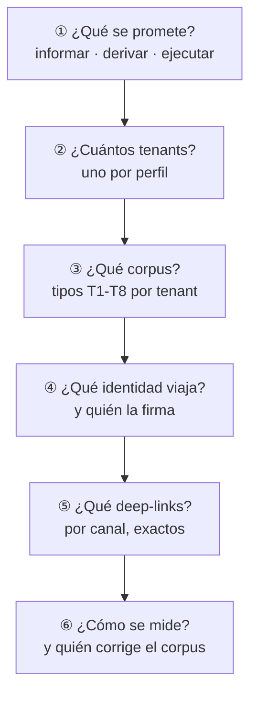

# 05 · Integración de IAConnect en los sistemas GDA

IAConnect es 🟩 una pasarela multi-tenant de IA conversacional en .NET 8: expone `POST /api/ai/{tenantId}/chat` por tenant, enruta al proveedor configurado (Claude, Gemini u OpenAI), inyecta contexto por RAG y persiste métricas, todo aislado por tenant ([`ia-db/README.md`](../../../../ia-db/README.md)). Integrarlo no es «poner un chat»: es decidir qué tenant, qué corpus, qué identidad viaja y qué se promete al usuario.

Este documento responde a la solicitud 2 del planteo: qué hay que tener en cuenta, qué alcance tiene el desarrollo actual —principalmente para funcionarios— y qué falta para llegar al nivel funcional del asistente de Mercado Pago. El detalle arquitectónico de la propuesta vive en [`../../GDA-Turnos/01-SAD.md`](../../GDA-Turnos/01-SAD.md) y no se repite acá.

---

## 1. Qué existe hoy, verificado

| Capacidad                                                                                      | Estado | Evidencia                                                                                                 |
| ---------------------------------------------------------------------------------------------- | ------ | --------------------------------------------------------------------------------------------------------- |
| API REST de chat multi-turno con historial de sesión                                           | ✅      | 🟩 `POST /api/ai/{tenantId}/chat`, `ChatService`                                                          |
| Widget Blazor embebible (`IAConnectChatWidget`)                                                | ✅      | 🟩 `AddIAConnectChatWidget(...)`; montado como PoC en `GDA.Core.Ciudadano`                                |
| Multi-tenancy con aislamiento por tenant                                                       | ✅      | 🟩 `TenantAccessFilter` devuelve 403 si el `id_tenant` del token ≠ el de la ruta                          |
| Configuración por tenant: system prompt, modelo, `Max_Tokens`, mensaje de bienvenida, imágenes | ✅      | 🟩 `lut_Tenants`                                                                                          |
| Base de conocimiento por tenant con carga de documentos                                        | ✅      | 🟩 `POST/GET /api/tenants/{tenantId}/knowledge`, rol `admin`                                              |
| RAG léxico TF-IDF, top-K = 5                                                                   | ✅      | 🟩 `RAGEngine`                                                                                            |
| Entrada multimodal (imagen) validada por tenant                                                | ✅      | 🟩 `ImageValidator`, `PermiteImagenes`, `Max_Tamano_Imagen_KB`                                            |
| Métricas por invocación (tokens, duración, proveedor, modelo)                                  | ✅      | 🟩 `sys_Metricas_Uso`                                                                                     |
| Abstracción multi-proveedor con factory                                                        | ✅      | 🟩 `AIProviderFactory`                                                                                    |
| **Function-calling / tools**                                                                   | ❌      | 🟩 grep `tool_use`/`tool_choice`/`function_call` = 0 hits                                                 |
| **RAG semántico (embeddings)**                                                                 | ❌      | 🟩 `Vector_Embedding` siempre `null`; `SerializeEmbedding` es código muerto                               |
| **Borrado de fragmentos por API**                                                              | ❌      | 🟩 El catálogo de endpoints expone solo POST y GET de knowledge                                           |
| **Captura de feedback (👍/👎)**                                                                | ❌      | 🟩 No hay tabla ni endpoint; `sys_Metricas_Uso` no tiene columna de usuario                               |
| **API REST de consulta de turnos en GDA**                                                      | ❌      | 🟩 El único endpoint de turnos es `POST Turnos/ProcesarRecordatorios`, sin `api/` y **sin autenticación** |

🟨 Leído en conjunto: **la plataforma conversacional está construida; lo que falta es todo lo que conecta esa plataforma con los datos del negocio.** Esa frontera define exactamente qué se puede prometer hoy.

---

## 2. Estado del widget: una PoC, no una integración

🟩 El widget ya está montado en `GDA.Core.Ciudadano`, pero con seis condiciones que lo dejan fuera de producción:

| Hallazgo | Severidad | Evidencia |
|---|---|---|
| Gateado por **un DNI hardcodeado**: no llega a ningún vecino | Bloquea el valor | `Index.razor:126` |
| **Credenciales de administrador versionadas en el repositorio** | ⚠️ **Alta** — rotar y sacar del código | `Index.razor.cs:71-76` |
| Esas credenciales son de rol `admin`, y 🟩 `TenantAccessFilter` deja pasar a un admin a **cualquier tenant** | ⚠️ **Alta** | `TenantAccessFilter.cs:30-44` |
| Montado en `Index.razor` (`/Index`), pero la home real del portal es `Index2.razor` (`/`) | Media | Mapa de rutas de la pieza |
| Apunta a un tenant genérico de demo, en entorno Sandbox | Media | `Index.razor:128-134` |
| **No está en `BackOffice.Turnos` ni en `CiudadanoApp`**, y en `Ciudadano.v2` figura como «perdido por ahora» | Media | `.csproj:45`; estado de migración v2 |

🟨 Ninguno es difícil de resolver, pero los dos primeros son bloqueantes de seguridad: un widget nunca debe portar credenciales, y menos de rol `admin`. La credencial correcta es de rol **operador**, atada al tenant, obtenida del servidor.

---

## 3. Por qué empezar por el funcionario

El planteo propone integrar primero en el panel de control de turnos. Es la decisión correcta, y conviene entender por qué —el argumento se reusa en cualquier otro dominio de GDA.

| Razón | Detalle |
|---|---|
| **Público acotado y capacitado** | Un error del asistente frente a un funcionario se detecta y se reporta; frente a un vecino, se convierte en un viaje al municipio |
| **El conocimiento ya existe escrito** | 🟩 `Usuarios-Turnos.md` es material de corpus del perfil funcionario; para el ciudadano hay que escribirlo desde cero |
| **La identidad es más simple** | 🟩 El funcionario tiene sesión con `IdOficina` en el claim; el vecino puede ser anónimo |
| **La superficie de datos personales es menor en F1** | Un asistente informativo de procedimientos no toca datos de ningún vecino |
| **Sirve de banco de pruebas del corpus** | Las consultas reales del mostrador son la materia prima del corpus ciudadano |

⚠️ 🟩 Contrapeso a considerar: el `BackOffice.Turnos` **no tiene roles ni policies**; el único discriminador es la oficina elegida. Toda autorización futura de tools debe apoyarse en `IdOficina`, no en un rol que no existe.

---

## 4. Qué hay que decidir antes de integrar

Seis decisiones, en orden de dependencia. Ninguna es técnica en su origen: todas son de alcance.

**① Qué se promete.** 🟦 La opción de menor riesgo con la mayor parte del beneficio es *informar y derivar*: el asistente arma el contexto y entrega el enlace al flujo nativo, que ya tiene sus propios controles. Es lo que hace Mercado Pago con «cargar dinero» y lo decidido para Turnos ([ADR-003, ADR-009](../../GDA-Turnos/04-ADR.md)).

**② Cuántos tenants.** Uno por perfil. 🟩 La recuperación filtra por `Id_Tenant` y no hay filtro por rol dentro de un tenant: es el único mecanismo de segmentación disponible. El costo es duplicar el corpus común, que se resuelve generando ambos tenants desde una sola fuente versionada.

**③ Qué corpus.** La taxonomía T1–T8 de [`03`](03-Estructura-y-Plantilla-KB.md), con el documento de límites (T7) como no negociable.

**④ Qué identidad viaja.** ⚠️ 🟩 El JWT de GDA usa clave simétrica hardcodeada, compartida entre backoffices, y en `GDA.Core.API` la validación de issuer y audience está desactivada: **no debe reusarse como credencial de tool**. La propuesta relevada es service account + `userId` firmado por el anfitrión ([ADR-007](../../GDA-Turnos/04-ADR.md)).

**⑤ Qué deep-links.** 🟩 Las rutas no son intercambiables entre portal (`PathBase` `/ciudadano`) y app (`/`), y hay typos en rutas públicas que **no** deben corregirse porque romperían enlaces del wrapper nativo. El corpus debe llevar la ruta exacta por canal; en F2, el enlace lo devuelve la tool y nunca lo construye el modelo ([ADR-008](../../GDA-Turnos/04-ADR.md)).

**⑥ Cómo se mide.** Hoy: tokens, latencia, proveedor y modelo. Falta todo lo que indica si sirvió. Ver §7.

---

## 5. Precondiciones bloqueantes antes de exponer el widget

Tres hallazgos verificados que hay que corregir en IAConnect, en este orden:

| #      | Hallazgo                                                                                                                                                                         | Impacto                                                                                                                                               | Marca                                                     |
| ------ | -------------------------------------------------------------------------------------------------------------------------------------------------------------------------------- | ----------------------------------------------------------------------------------------------------------------------------------------------------- | --------------------------------------------------------- |
| **P1** | **La sesión no se valida contra el tenant**: si un GUID de sesión de otro tenant parsea correctamente, se reutiliza                                                              | Fuga cross-tenant del historial. Con dos tenants (ciudadano/funcionario) es crítico; en F2 sería fuga de datos personales                             | 🟩 `ChatService.cs:46-189`                                |
| **P2** | **Credenciales de admin en el widget** (§2)                                                                                                                                      | Un cliente con credencial admin alcanza cualquier tenant                                                                                              | 🟩 `Index.razor.cs:71-76` + `TenantAccessFilter.cs:30-44` |
| **P3** | **Delimitadores del prompt sin escapado**: el contenido recuperado se cita entre comillas dobles sin escapar dentro de bloques `[CONTEXTO RELEVANTE]` / `[CONSULTA DEL USUARIO]` | Prompt injection **indirecta** vía documento subido. Realista acá: el corpus se genera desde campos editables del backoffice que contienen HTML crudo | 🟩 `PromptBuilder.cs:10-55`                               |

🟨 P3 no se resuelve solo en el gateway: la mitigación práctica es **sanitizar en la ingesta** —quitar HTML, neutralizar las secuencias de delimitador, normalizar comillas— antes de subir cualquier fragmento ([`02-HLD.md` §11.5](../../GDA-Turnos/02-HLD.md)).

Deudas menores relevadas, no bloqueantes pero con costo: 🟩 el historial viaja **dos veces** (en el system prompt y como `ConversationHistory`), duplicando el costo de tokens; 🟩 el `Modelo` de la métrica se toma del tenant y no de la respuesta, con lo que ante un fallback la métrica miente; 🟩 el cuerpo de error crudo del proveedor se devuelve al cliente en el 502; 🟩 Swagger está habilitado en todos los entornos.

---

## 6. Brecha respecto del asistente de Mercado Pago

> Alcance: se compara contra lo **observable** en las capturas analizadas ([`IA-Mercado-Libre.md`](../../Antecedentes/IA-Mercado-Libre.md)); no se infieren detalles internos de esa implementación.

| Capacidad observada en Mercado Pago            | IAConnect hoy                                         | Qué falta                                                                                                            |
| ---------------------------------------------- | ----------------------------------------------------- | -------------------------------------------------------------------------------------------------------------------- |
| Comprensión de intención en lenguaje libre     | ✅                                                     | —                                                                                                                    |
| Respuesta fundamentada en contenido propio     | ✅ RAG léxico                                          | 🟨 Con vocabulario coloquial, el léxico falla donde el semántico acertaría: se compensa con diccionario de sinónimos |
| **Corrección de supuesto** («no se llama así») | ⚠️ Depende del corpus                                 | Fichas T1+T2 con siembra léxica                                                                                      |
| **Datos del usuario en vivo**                  | ❌                                                     | Function-calling en IAConnect **+** API REST de lectura en GDA: dos desarrollos, no una configuración                |
| **Deep-link a la pantalla nativa**             | ⚠️ El modelo lo emite desde el corpus                 | Que lo devuelva la tool, con lista blanca de rutas por canal                                                         |
| **Disclosure explícito de alcance**            | ⚠️ Depende del system prompt y del corpus             | Documento de límites + reglas negativas en el system prompt                                                          |
| Entrada multimodal (imagen)                    | ✅ Configurable por tenant                             | Voz: no existe                                                                                                       |
| **Feedback 👍/👎 por respuesta**               | ❌                                                     | Tabla, endpoint y control en el widget                                                                               |
| Enmascarado de datos sensibles en la respuesta | ❌                                                     | Regla de salida; hoy no hay guardrail de salida                                                                      |
| Disclaimer permanente de IA                    | **No verificado** en el widget                        | Verificar y, si falta, agregar                                                                                       |
| Chips de intención al inicio                   | 🟩 Hay `Mensaje_Bienvenida` por tenant, pero no chips | Componente en el widget                                                                                              |
| Hand-off a humano                              | ❌                                                     | Definir el canal de escalamiento del municipio                                                                       |

🟨 La brecha se agrupa en tres frentes, y solo uno es grande:

1. **Corpus** (T1–T8, sinónimos, límites): sin desarrollo, es trabajo de contenido. Es el que más resuelve.
2. **UX del widget** (chips, feedback, disclaimer): desarrollo acotado, alto impacto en el ciclo de mejora.
3. **Datos en vivo** (function-calling + API de lectura + identidad firmada): es el proyecto real, y el único que habilita ESC-3 y ESC-4.

---

## 7. Alcance realista, por fase

| Fase | Qué puede prometer el asistente | Desarrollo necesario |
|---|---|---|
| **F1 · Informativo** | Descubrir el trámite pese al sinónimo; explicar requisitos, reglas y procedimientos; declarar límites; derivar con deep-link; explicar mensajes de error | Corpus + higiene del widget + P1/P2/P3 |
| **F2 · Datos en vivo (lectura)** | Además: próximos huecos, mis turnos, agenda del día de la oficina | Function-calling en IAConnect, API REST de lectura en GDA, identidad firmada, auditoría de invocaciones |
| **F3 · Transaccional** | Cancelar con confirmación | 🟨 Se recomienda **no** hacerlo: la confirmación de acciones irreversibles se deriva a la pantalla |

🟨 Recomendación: **cerrar F1 completo para el perfil funcionario antes de tocar una línea de código de tools.** F1 responde cuatro de los seis escenarios del marco, produce el corpus que F2 va a necesitar igual, y genera el registro de consultas reales que es el único insumo honesto para decidir qué tools construir.

---

## 8. Preguntas guía

1. ¿Qué se le promete al usuario en la primera pantalla? Si el widget dice «te ayudo con tus turnos» y no puede ver ninguno, la brecha entre promesa y capacidad la paga el municipio.
2. ¿La credencial que porta el widget es de operador y está atada al tenant, o es de admin?
3. ¿Existe un tenant por perfil, o un corpus único al que llegan dos públicos distintos?
4. Antes de exponer el widget: ¿la sesión se valida contra el tenant? Si no, cualquier separación entre perfiles es nominal.
5. ¿Los deep-links del corpus son los del canal donde está montado el widget?
6. Cuando el asistente no pueda responder algo, ¿qué dice exactamente? ¿Está escrito ese texto?
7. ¿Cómo vas a enterarte de que el asistente respondió mal? Si la respuesta es «cuando alguien se queje», falta el frente 2 de §6.

---

## Documentos relacionados

[`00-Marco-Referencia.md`](00-Marco-Referencia.md) · [`06-Flujos-Conversacionales.md`](06-Flujos-Conversacionales.md) · [`07-Informacion-Dinamica.md`](07-Informacion-Dinamica.md) · [`../../GDA-Turnos/01-SAD.md`](../../GDA-Turnos/01-SAD.md) · [`../../GDA-Turnos/04-ADR.md`](../../GDA-Turnos/04-ADR.md)
