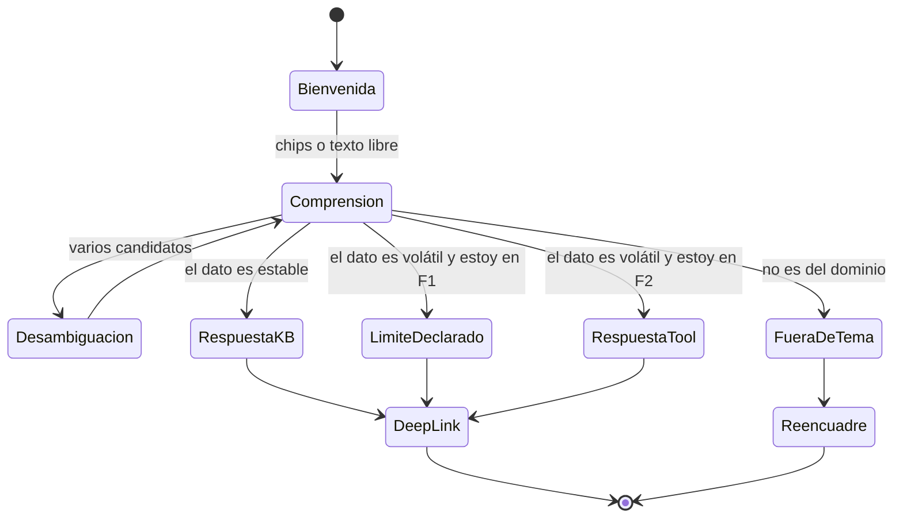

# 06 · Flujos conversacionales de las consultas del planteo

Las cinco consultas del planteo tienen algo en común que no salta a la vista: **ninguna se resuelve con una sola fuente de conocimiento**. Todas empiezan en el catálogo (estable) y terminan pidiendo la agenda (volátil), y esa transición —del «cómo se llama» al «cuándo hay»— es exactamente donde el asistente debe cambiar de mecanismo o declarar su límite.

Los diálogos que siguen son **normativos en su forma, ilustrativos en sus datos**. Los diálogos ya validados contra el código de GDA están en [`../../GDA-Turnos/02-HLD.md` §5](../../GDA-Turnos/02-HLD.md); acá se aplican al material nuevo del planteo.

> ⚠️ 🟨 **Advertencia de datos.** El trámite «castración» y la oficina «zoonosis» **no están verificados** en el catálogo de GDA relevado. Los nombres, identificadores y horarios que aparecen abajo son **sintéticos**: muestran la forma de la respuesta, no el dato. Antes de publicar cualquier corpus hay que confirmar contra `lut_MotivosTurnos` / `lut_Oficinas_Turnos`.

**Patrones citados** (de [`IA-Mercado-Libre.md`](../../Antecedentes/IA-Mercado-Libre.md) §4): P1 preámbulo · P2 grounding · P3 corrección de supuesto · P4 desambiguación · P5 datos dinámicos · P6 disclosure de alcance · P7 hand-off con deep-link · P8 enmascarado · P10 disclaimer.

---

## 1. Cómo leer cada caso

Cada consulta se desarrolla en cuatro partes: qué pide realmente, qué sabe el sistema, el diálogo en **F1** (lo construible hoy) y qué cambia en **F2** (con tools de lectura). La diferencia entre ambos no es cosmética: en F1 el asistente **nunca afirma disponibilidad**, porque no puede verla, y prometerla sería alucinar.

---

## 2. Consulta 1 — «Hola, ¿cómo estás? Me gustaría saber si hay turno para castración. Es para mi perrito, macho, raza salchicha, tiene 5 años. Soy de Paraná»

**Escenarios:** ESC-1 → ESC-3 · **Dificultad:** el vecino aporta cinco datos, de los cuales el sistema usa cero.

### Qué pide realmente

Dos cosas encadenadas: identificar el trámite («castración») y saber si hay disponibilidad. Los datos del animal son **contexto humano**, no parámetros: 🟨 el alta de turno pide nombre, apellido, DNI, celular y correo del titular, no características de la mascota. Descartarlos sin hacer sentir tonto al vecino es diseño conversacional, no cortesía.

### Diálogo F1 (hoy)

> **Vecino:** Hola, ¿cómo estás? Me gustaría saber si hay turno para castración. Es para mi perrito, macho, raza salchicha, tiene 5 años. Soy de Paraná.
>
> **Asistente:** Buscando en el listado de trámites… *(P1)*
>
> El trámite figura como **«Castración de mascotas»**, en la oficina **Zoonosis**. *(P2 — nombre exacto del sistema)*
>
> Un par de cosas para que no pierdas tiempo:
>
> - **La raza, la edad y el sexo no se cargan al sacar el turno.** El profesional los evalúa en la atención. *(P3 — corrige el supuesto sin descalificarlo)*
> - Para confirmar el turno te van a pedir **nombre, apellido, DNI, celular y correo**.
>
> **La disponibilidad no la puedo consultar desde acá**: veo el listado de trámites, no la agenda en vivo. *(P6 — el límite se declara, no se rodea)*
>
> 👉 [Sacar turno para Castración de mascotas](https://<host>/ciudadano/TurnosLugar?m=<IdMotivo>) — ahí ves los lugares, los horarios libres y los requisitos. *(P7)*
>
> **Vecino:** ¿y qué tengo que llevar?
>
> **Asistente:** Para **Castración de mascotas**: *(divulgación progresiva — los requisitos recién cuando los pide)*
>
> - <requisito 1>
> - <requisito 2>
>
> Está todo también en la pantalla del trámite, arriba de la lista de lugares.

**Anotaciones**

- 🟨 El asistente **no dijo «hay turnos»** ni «no hay turnos». Dijo dónde verlo. Esa es la diferencia entre un asistente honesto y uno que suena confiable.
- 🟨 «Soy de Paraná» se ignoró deliberadamente: si el municipio tiene una sola sede, mencionarlo agrega ruido; si tiene varias, el deep-link lleva a la lista de lugares, que es donde esa información importa.
- 🟩 La instrucción anti-saludo del `PromptBuilder` evita que cada turno empiece con «¡Hola! Soy tu asistente…», que en un chat es ruido y tokens.

### Qué cambia en F2

El bloque de disclosure se reemplaza por datos reales: *«Los próximos horarios en Zoonosis son jueves 7/8 a las 9:30, jueves 7/8 a las 10:00 y viernes 8/8 a las 9:00»* (P5), y el deep-link pasa a la agenda concreta en vez del listado de lugares. **El diálogo cambia con la fase, y eso es honestidad de diseño, no inconsistencia.**

---

## 3. Consulta 2 — «Vengo a sacar turno para castrar al perro, ¿cuándo podría ser?»

**Escenarios:** ESC-1 → ESC-3 · **Dificultad:** la pregunta es *solo* por disponibilidad.

Es el caso que más presiona el límite de F1, porque el vecino no pregunta por el trámite: pregunta por el cuándo. Un asistente mal diseñado responde con generalidades («los turnos se otorgan según disponibilidad de la oficina»), que es la forma elegante de no responder.

> **Vecino:** vengo a sacar turno para castrar al perro, ¿cuándo podría ser?
>
> **Asistente:** El trámite es **«Castración de mascotas»** (Zoonosis).
>
> **Los horarios libres no los veo desde acá** — se cargan y se toman todo el tiempo, así que cualquier fecha que te diga podría estar vencida en cinco minutos. *(P6, con el motivo del límite: explica por qué, no solo que no puede)*
>
> 👉 [Ver horarios disponibles](https://<host>/ciudadano/TurnosAgenda?m=<IdMotivo>&o=<IdOficina>) — la lista se actualiza en vivo.
>
> Lo que sí te puedo adelantar para que llegues preparado: *(compensa el «no» con algo útil)*
>
> - Cuando elegís un horario, **tenés 5 minutos** para completar tus datos. Si tardás más, vuelve a quedar libre.
> - Vas a necesitar DNI, celular y correo a mano.

**Anotaciones**

- 🟨 La regla de redacción detrás de esto: **un «no» sin alternativa se lee como una falla; un «no» con el enlace y una advertencia útil se lee como asistencia.**
- 🟩 La reserva blanda de 5 minutos es real (`EntregaTurnosComponent.razor.cs:284-285`), y es el dato que más consultas de mesa de ayuda evita.
- 🟨 En F2 este diálogo se vuelve trivial: la tool de disponibilidad responde y el disclosure desaparece. Es la consulta que más justifica construir F2.

---

## 4. Consulta 3 — «Quería solicitar un turno para castración, ¿en qué días y horarios trabajan?»

**Escenarios:** ESC-2 → ESC-3 · **Dificultad:** la pregunta es ambigua entre dos cosas distintas.

«¿En qué días y horarios trabajan?» puede significar dos cosas que se resuelven con mecanismos diferentes: el **horario de atención parametrizado** de la oficina (semi-estable, CTX-D2, va a la KB) o los **huecos libres** de la agenda (volátil, CTX-D3, exige tool). Responder la segunda cuando preguntaron la primera —o al revés— es el error más frecuente en este escenario.

> **Vecina:** Buenas! Quería solicitar un turno para castración, ¿en qué días y horarios trabajan? Gracias
>
> **Asistente:** **Zoonosis** atiende **castraciones los martes y jueves de 8:00 a 12:00**, con turnos cada 20 minutos. *(dato de parametría, no de agenda)*
>
> Eso es el **horario de atención**. Cuáles de esos horarios están libres ahora **no lo veo desde acá**: lo ves en la agenda. *(P6 — distingue explícitamente las dos cosas, que es lo que resuelve la ambigüedad)*
>
> 👉 [Ver días y horarios disponibles](https://<host>/ciudadano/TurnosAgenda?m=<IdMotivo>&o=<IdOficina>)

**Anotaciones**

- 🟨 El asistente **no preguntó cuál de las dos cosas quería**: respondió la que puede y señaló la que no. Desambiguar preguntando cuesta un turno de conversación; acá el costo de responder ambas es una línea.
- ⚠️ 🟨 Riesgo de contenido: el horario de atención es CTX-D2. Si se carga en la KB y alguien lo cambia en el ABM, el asistente lo va a seguir afirmando con la misma seguridad. Este dato necesita **dueño y cadencia de revisión** declarados, o directamente pasa a ser tool en F2. Es el caso de manual de la categoría semi-estable.

---

## 5. Consulta 4 — «¿Quiero sacar un turno con el veterinario?»

**Escenario:** ESC-1 puro · **Dificultad:** sinonimia por rol.

«Veterinario» no es un trámite: es la persona que atiende. El sistema nombra **motivos** y **oficinas**. 🟩 Con RAG léxico y sin diccionario de sinónimos, la consulta puntúa cerca de cero y no recupera nada. Este es el caso que justifica por sí solo el documento T2.

> **Vecino:** ¿quiero sacar un turno con el veterinario?
>
> **Asistente:** «Veterinario» me da más de una opción. ¿Cuál buscás? *(P4 — máximo 4 opciones, una línea de contexto cada una)*
>
> 1. **Castración de mascotas** — cirugía de castración de perros y gatos
> 2. **Vacunación antirrábica** — vacuna anual
> 3. **Consulta veterinaria general** — control y atención clínica
>
> **Vecino:** la primera
>
> **Asistente:** 👉 [Sacar turno para Castración de mascotas](https://<host>/ciudadano/TurnosLugar?m=<IdMotivo>)
>
> Ahí elegís el lugar y después el horario. ¿Te digo qué requisitos piden?

**Anotaciones**

- 🟨 La desambiguación **no reinicia el contexto**: cuando el vecino responde «la primera», el asistente ya sabe que se trata de sacar un turno. Perder eso obliga al usuario a reescribir todo, y es el momento en que abandona.
- 🟨 Tres o cuatro opciones como máximo. Una lista de diez es peor que una pregunta abierta.
- 🟩 Que esto funcione depende del corpus, no del modelo: la palabra «veterinario» tiene que estar **escrita** en las fichas de esos tres motivos.

---

## 6. Consulta 5 — Funcionario: «¿Cómo agregar turnos en la agenda en la oficina de zoonosis?»

**Escenario:** ESC-5 · **Dificultad:** ninguna especial — es el caso que la KB actual ya cubre.

> **Funcionaria:** ¿cómo agrego turnos en la agenda de zoonosis?
>
> **Asistente:** Entrá a **Agendas Turnos** y elegí la oficina. Vas a ver el resumen de su configuración: desde y hasta qué fecha hay turnos cargados y cuál fue el último turno tomado.
>
> Después, botón **«Agregar turnos»** y completás:
>
> | Campo | Qué significa |
> |---|---|
> | **Hora min** | El primer horario que el sistema va a entregar (no es el horario de apertura del lugar) |
> | **Hora Max** | El horario máximo de atención. Con intervalo de 30 min y hora máxima 13:00, el último turno sale 12:30 |
> | **Intervalo** | Cada cuántos minutos se atiende un turno |
> | **Turnos por intervalo** | Cuántas personas por horario |
>
> Dos cosas que suelen confundir:
>
> - **Podés cargar sobre un período que ya tiene agenda**, incluso en el mismo horario: sirve para generar sobreturnos.
> - **Podés tener horarios distintos por día**: cargás el mismo período eligiendo días y horarios diferentes, y el sistema agrega la nueva configuración sin reemplazar la anterior.
>
> 👉 [Agendas Turnos](https://<host>/AgendasTurnos)

**Anotaciones**

- 🟩 Todo el contenido sale de `Usuarios-Turnos.md` y `Concepto-Turnos.md`, que **ya existen**. Lo único que hace falta es reescribirlos como fichas atómicas ([`03` §4.4](03-Estructura-y-Plantilla-KB.md)).
- 🟨 El asistente no confirmó que la oficina «zoonosis» exista: en F1 no tiene el catálogo de oficinas cargado. Si el corpus incluye la ficha T1 de oficinas, sí puede.
- 🟨 El límite que hay que agregar al corpus del funcionario: **no se pueden saltear las validaciones desde el backoffice**. 🟩 El sistema corre las mismas reglas de tope y ausentismo cuando el turno lo otorga un funcionario. Sin esa ficha, el asistente puede sugerir un workaround que no existe.

---

## 7. ¿Puede el chatbot reservar un turno?

La respuesta corta es **no, y no solo por una limitación técnica**. Conviene separar los tres niveles, porque se confunden permanentemente.

| Nivel | ¿Puede hoy? | ¿Podría? | Recomendación |
|---|---|---|---|
| **Informar** el trámite, requisitos, reglas, límites | ✅ Sí, con corpus | — | Hacerlo ya |
| **Consultar** disponibilidad y turnos propios | ❌ No | Sí, con function-calling + API de lectura | Construirlo en F2 |
| **Reservar / cancelar** (cambiar estado) | ❌ No | Técnicamente sí | 🟨 **No hacerlo**: derivar a la pantalla |

### Por qué hoy no puede

🟩 Tres hechos verificados, independientes entre sí: no existe function-calling en IAConnect; no existe API REST de consulta ni de alta de turnos en GDA —el único endpoint de turnos no tiene autenticación—; y no hay propagación de identidad del usuario al asistente. Reservar exige los tres.

### Por qué, aun pudiendo, conviene no hacerlo

🟦 La diferencia entre informar y actuar no es de capacidad del modelo: es de **reversibilidad del error**. Una respuesta equivocada se corrige con otra respuesta; una reserva equivocada ocupó un cupo, disparó un recordatorio y —si el vecino no se presenta— 🟩 puede contarle una ausencia que lo bloquea para sacar turnos futuros. El daño no es del asistente: es del vecino.

A eso se suma el flujo real de alta: 🟩 la reserva blanda de 5 minutos, los cinco campos obligatorios y las validaciones de tope y ausentismo son un proceso con estados que el asistente tendría que reimplementar en la conversación. 🟦 El patrón de industria es el opuesto: el asistente **orquesta** e **deriva** a los flujos nativos, que ya tienen sus propios controles. Es lo que hace Mercado Pago con «cargar dinero» —no ejecuta la carga, entrega el deep-link— y captura la mayor parte del beneficio con una fracción del riesgo.

### El alcance recomendado, en una frase

🟨 **El asistente lleva al vecino hasta el botón, con todo lo que necesita saber para apretarlo, y el vecino aprieta.** Ese alcance resuelve las cuatro consultas ciudadanas del planteo sin asumir ninguna responsabilidad que hoy el sistema no pueda auditar.

Si en algún momento se decide transaccionalizar, las condiciones mínimas son: confirmación en un turno separado que **repita los parámetros entendidos** —«voy a reservar castración el jueves 7/8 a las 9:30, ¿confirmás?»—, clave de idempotencia, auditoría de cada invocación y un camino de reversión. Sin las cuatro, no se hace.

---

## 8. Qué hace falta para que estos diálogos existan

| Consulta | Necesita | ¿Disponible hoy? |
|---|---|---|
| 1, 2, 3, 4 | Ficha T1 del motivo con siembra léxica | ❌ Hay que escribirla |
| 4 | Diccionario de sinónimos (T2) | ❌ Hay que escribirlo |
| 1, 3 | Requisitos y horarios de atención (T3) | ❌ Hay que extraerlos del sistema |
| 2, 3 | Texto de disclosure de disponibilidad | ❌ Parte del documento de límites (T7) |
| 1, 2, 4 | Deep-links exactos por canal (T8) | ⚠️ Existen las rutas; falta el mapa en el corpus |
| 5 | Procedimiento de agenda (T4) | ✅ Existe, hay que reescribirlo como fichas |
| Todas | Widget montado y sin credenciales en el código | ❌ Ver [`05` §2](05-Integracion-IAConnect.md) |

🟨 Cinco de las siete filas son **trabajo de contenido**, no de desarrollo.

---

## 9. Preguntas guía

1. Ante una consulta que mezcla dato estable y dato volátil, ¿el asistente responde la parte que puede y declara la que no, o responde todo con el mismo tono de seguridad?
2. ¿Cómo suena tu «no»? Escribilo literalmente y leelo en voz alta: ¿deja al usuario con un camino?
3. Cuando el usuario aporta datos que el sistema no usa, ¿el asistente los descarta explicando, los ignora o —peor— finge que los tomó?
4. ¿La desambiguación conserva el contexto previo o obliga a reescribir el pedido?
5. Si el asistente ejecutara la acción, ¿quién responde por un error? ¿Y cómo se revierte?
6. ¿Cuál de tus diálogos es el test de regresión que bloquea un despliegue si falla?

---

## Documentos relacionados

[`00-Marco-Referencia.md`](00-Marco-Referencia.md) · [`03-Estructura-y-Plantilla-KB.md`](03-Estructura-y-Plantilla-KB.md) · [`05-Integracion-IAConnect.md`](05-Integracion-IAConnect.md) · [`07-Informacion-Dinamica.md`](07-Informacion-Dinamica.md) · [`../../GDA-Turnos/02-HLD.md`](../../GDA-Turnos/02-HLD.md)
