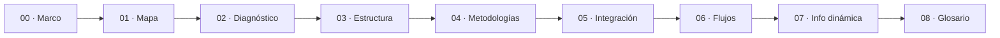

# Guía de estudio — Chatbot IA sobre el sistema de turnos

Este conjunto documental responde al planteo de [`../01-Planteo-Analisis-Contexto.md`](../01-Planteo-Analisis-Contexto.md): formar criterio sobre qué es un chatbot por IA, qué implica implantarlo y cómo integrarlo en el sistema de turnos de GDA, con el gateway **IAConnect** como plataforma.

Es una **guía formativa**, no un diseño: enseña a decidir. El diseño ya decidido para el caso Turnos vive en [`../../GDA-Turnos/`](../../GDA-Turnos/01-SAD.md) y acá se referencia sin repetirlo.

**Convención de marcas** — 🟩 hecho verificado en fuente (se cita ruta) · 🟦 práctica de industria establecida · 🟨 interpretación o propuesta de esta guía · **No verificado** cuando no hay evidencia.

---

## Tabla de contenido

| # | Documento | De qué trata |
|---|---|---|
| 00 | [`00-Marco-Referencia.md`](00-Marco-Referencia.md) | Escenarios, contextos y actores del dominio: el vocabulario común que usa el resto |
| 01 | [`01-Mapa-Conceptual.md`](01-Mapa-Conceptual.md) | Tablas de entrada «estoy acá → qué aplico» y trazabilidad con el planteo |
| 02 | [`02-Base-Conocimiento-Diagnostico.md`](02-Base-Conocimiento-Diagnostico.md) | Diagnóstico medido de la KB actual, sus ocho defectos y los criterios para evaluar cualquier otra |
| 03 | [`03-Estructura-y-Plantilla-KB.md`](03-Estructura-y-Plantilla-KB.md) | Estructura correcta, forma del relato, taxonomía de documentos y reescritura del corpus actual |
| 04 | [`04-Metodologias-y-Catalogacion.md`](04-Metodologias-y-Catalogacion.md) | Metodologías de construcción de KB, qué se infiere de Mercado Pago y cómo se catalogan las preguntas |
| 05 | [`05-Integracion-IAConnect.md`](05-Integracion-IAConnect.md) | Qué existe hoy, qué decidir antes de integrar, precondiciones bloqueantes y brecha respecto de Mercado Pago |
| 06 | [`06-Flujos-Conversacionales.md`](06-Flujos-Conversacionales.md) | Las cinco consultas del planteo, turno a turno, y hasta dónde llega el alcance de la reserva |
| 07 | [`07-Informacion-Dinamica.md`](07-Informacion-Dinamica.md) | La información cambiante y la del usuario: cómo se resuelve hoy y cómo se actualiza |
| 08 | [`08-Glosario.md`](08-Glosario.md) | Definiciones, incluidos contenido curado, deep-link y corpus |
| A1 | [`Anexos/A1-Plantilla-KB.md`](Anexos/A1-Plantilla-KB.md) | Plantilla genérica comentada, campo por campo, con variantes por tipo |
| A2 | [`Anexos/A2-Checklist-Evaluacion-KB.md`](Anexos/A2-Checklist-Evaluacion-KB.md) | Lista de verificación para evaluar un corpus antes de publicarlo |

---

## Ruta de lectura sugerida

| Si sos… | Leé, en este orden |
|---|---|
| **Referente funcional / administrador de KB** | 00 → 02 → 03 → A1 → A2 |
| **Arquitecto o desarrollador** | 00 → 05 → 07 → 06 |
| **Product owner** | 00 → 06 → 05 §6-§7 |
| **Con una hora disponible** | 00 → 02 → 07 |

---

## Las cinco conclusiones que sostiene esta guía

1. **La base de conocimiento actual no está mal escrita: está escrita para otro destino.** 963 palabras en dos documentos, que responden 1 de las 5 consultas del planteo, porque son documentación interna del funcionario evaluada contra preguntas de ciudadano. Convertirla en corpus es reescritura, no copia. → [`02`](02-Base-Conocimiento-Diagnostico.md)

2. **El motor condiciona la redacción.** 🟩 Con RAG léxico sin embeddings, un fragmento que no contiene las palabras del usuario no se recupera nunca, por correcto que sea. De ahí la siembra léxica y el diccionario de sinónimos. → [`03`](03-Estructura-y-Plantilla-KB.md)

3. **Cuatro de los seis escenarios ya son atendibles sin escribir una línea de código.** Lo que falta no es tecnología, es corpus. Los dos que faltan —disponibilidad y datos propios— son exactamente los que piden tres de las cinco consultas. → [`00 §4`](00-Marco-Referencia.md), [`05 §7`](05-Integracion-IAConnect.md)

4. **El chatbot no puede reservar un turno, y aunque pudiera, conviene que no lo haga.** 🟩 No hay function-calling en IAConnect ni API de turnos en GDA; y una reserva equivocada ocupa un cupo y puede terminar en una ausencia que bloquea al vecino. El alcance correcto es llevarlo hasta el botón con todo lo que necesita saber. → [`06 §7`](06-Flujos-Conversacionales.md)

5. **El ciclo de actualización del corpus tiene un defecto que hay que resolver primero.** 🟩 No existe endpoint de borrado y recargar duplica fragmentos: hoy, cada corrección degrada la KB salvo que alguien purgue contra la base. → [`07 §4`](07-Informacion-Dinamica.md)

---

## Alcance y limitaciones declaradas

- **Nada se implementó.** Esta guía es análisis y criterio; no modifica código ni carga contenido.
- **Los datos de los ejemplos son sintéticos.** 🟨 El trámite «castración» y la oficina «zoonosis» **no están verificados** en el catálogo de GDA relevado: los diálogos y fichas muestran la forma, no el dato. Antes de publicar cualquier corpus hay que confirmar nombres e identificadores contra las tablas.
- **Sobre Mercado Pago solo se afirma lo observable** en las capturas analizadas. Todo lo relativo a su implementación interna está marcado como inferencia.
- **El estado de IAConnect y GDA proviene del relevamiento previo** de [`../../GDA-Turnos/`](../../GDA-Turnos/01-SAD.md) y de la ia-db de ambas soluciones; cada afirmación 🟩 cita su fuente. Ante conflicto índice ↔ código, prevalece el código.

---

## Documentos de referencia externos a esta guía

| Necesitás… | Documento |
|---|---|
| Marco general de criterio sobre chatbots IA (bloques A–G) | [`../../Antecedentes/Analisis-Asistencia-IA-ChatBotIA.md`](../../Antecedentes/Analisis-Asistencia-IA-ChatBotIA.md) |
| Patrones de UX observados en Mercado Pago | [`../../Antecedentes/IA-Mercado-Libre.md`](../../Antecedentes/IA-Mercado-Libre.md) |
| Arquitectura del caso Turnos | [`../../GDA-Turnos/01-SAD.md`](../../GDA-Turnos/01-SAD.md) |
| Diseño conversacional completo (intents, entities, 10 diálogos) | [`../../GDA-Turnos/02-HLD.md`](../../GDA-Turnos/02-HLD.md) |
| Contratos y esquemas propuestos | [`../../GDA-Turnos/03-LLD.md`](../../GDA-Turnos/03-LLD.md) |
| Decisiones y alternativas descartadas | [`../../GDA-Turnos/04-ADR.md`](../../GDA-Turnos/04-ADR.md) |
| Operación y administración funcional del asistente | [`../../GDA-Turnos/05-Operations-Guide.md`](../../GDA-Turnos/05-Operations-Guide.md) · [`06-Administrator-Guide.md`](../../GDA-Turnos/06-Administrator-Guide.md) |
| Plan de sprints y capacitación | [`../../GDA-Turnos/07-Plan-Sprints-Capacitacion.md`](../../GDA-Turnos/07-Plan-Sprints-Capacitacion.md) |
| Base de conocimiento técnica de IAConnect | [`../../../../ia-db/README.md`](../../../../ia-db/README.md) |

---

## Manifiesto de generación

- Generado por : [`../01-Planteo-Analisis-Contexto.md`](../01-Planteo-Analisis-Contexto.md) (Profile `Study-Guide-Documentation`)
- Fuentes      : `INPUTs/` · `Antecedentes/` · `GDA-Turnos/` · `Ng-IAServices.Documentacion/ia-db/` · `GDA.Core.Documentacion/ia-db/`
- Generado     : 2026-07-31 · Versión 1.0 · Status: draft
