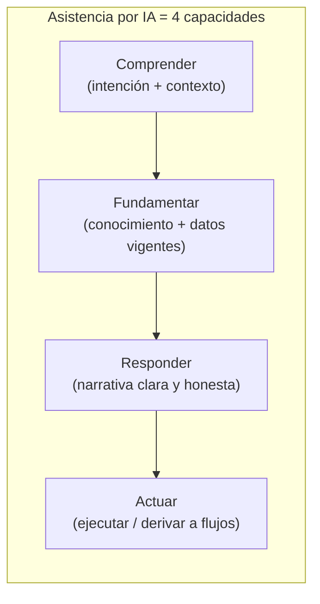

**Referencias**
- [Análisis ChatIA](NG/Ng-IAServices.Documentacion/Analisis/Implementacion/Antecedentes/Analisis-Asistencia-IA-ChatBotIA)

**Chatbot**: es cualquier sistema que conversa en lenguaje natural.

**Asistente por IA es un chatbot**

 - capacidad de  conversar, **comprende la intención**, 

 - se apoya en conocimiento y datos (no solo en reglas) y 

 - puede ejecutar acciones sobre el sistema anfitrión.

** Recuperación**

¿La respuesta debe apoyarse en **contenido propio** (→ RAG) o en **datos del usuario en vivo** (→ tools)? ¿Ambos?

| Respuesta                  | Cuándo se justifica                                                                                      | Consecuencia de diseño                                                                              |
| -------------------------- | -------------------------------------------------------------------------------------------------------- | --------------------------------------------------------------------------------------------------- |
| **Contenido propio (RAG)** | La pregunta es la misma para todos los usuarios: "¿cómo funciona X?", "¿qué requisitos pide el trámite?" | Pipeline de ingesta, chunking, índice y **reindexado**. El costo está en mantener la KB fresca      |
| **Datos en vivo (tools)**  | La respuesta cambia por usuario y por minuto: saldo, estado de expediente, stock                         | AuthZ por identidad en cada llamada, manejo de latencia y de fallo del backend                      |
| **Ambos** (lo habitual)    | La pregunta mezcla *cómo funciona* con *cómo está lo mío*                                                | El orquestador debe recuperar y llamar en el mismo turno, y el prompt debe distinguir ambas fuentes |

Meter datos personales en el RAG es el error de diseño más caro de revertir.

**Información dinámica vs. estática: cómo se inyecta** 

Son dos mecanismos distintos:

|              | **Estática** (ayudas, cómo funciona X)               | **Dinámica** (datos del usuario, saldo, trámite)      |
| ------------ | ---------------------------------------------------- | ----------------------------------------------------- |
| Fuente       | Documentos, FAQs, manuales                           | APIs/backends transaccionales en vivo                 |
| Mecanismo    | **RAG** (recuperar fragmentos y añadirlos al prompt) | **Function-calling / tools** (el LLM invoca una API)  |
| Frescura     | Se reindexa periódicamente                           | En tiempo real, por request                           |
| Autorización | Filtrado por rol/tenant sobre el índice              | AuthZ por operación y por identidad del usuario       |
| Ejemplo      | "¿Cómo cargo saldo?" → fragmento del instructivo     | "¿Cuáles son mis líneas?" → API de líneas del usuario |
