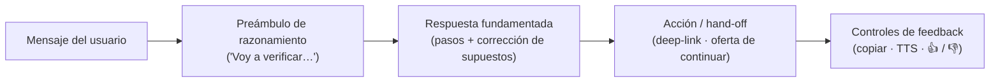
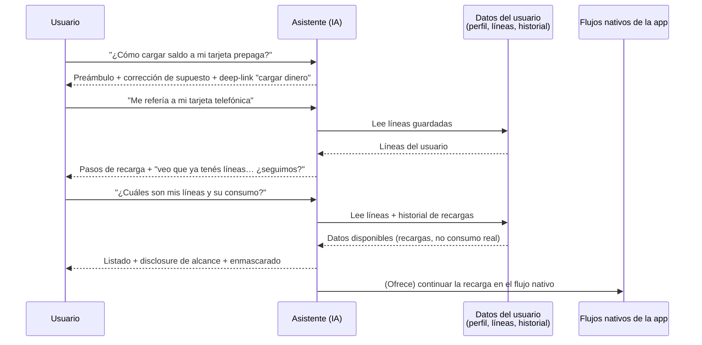
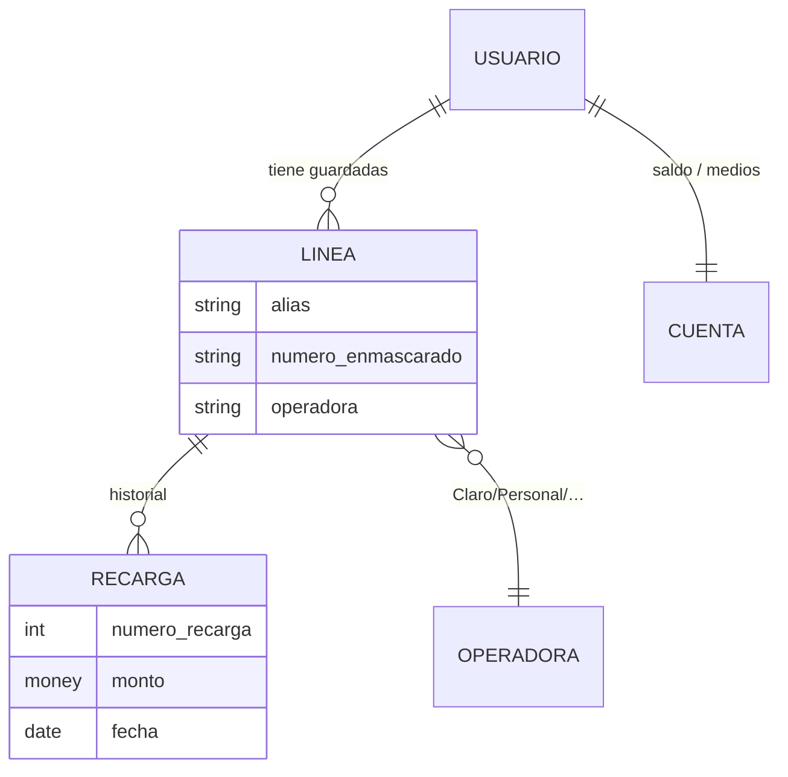

> **Análisis de referencia.** Caracterización del asistente por IA de la app **Mercado Pago / Mercado Libre**
> a partir de 5 capturas de un flujo conversacional real, con el objetivo de destilar **patrones reutilizables**
> para componer asistentes similares. Fuente: `/IA.Prompting.Templates/PromptFramework/Examples/Notions/Ng-IAServices/Docs/01..05.jpg`.
> Documento hermano: [`Analisis-Asistencia-IA-ChatBotIA.md`](Analisis-Asistencia-IA-ChatBotIA.md).

# IA — Mercado Libre / Mercado Pago · Caracterización del asistente

| Campo | Valor |
|---|---|
| Objeto | Asistente conversacional embebido en app móvil (Mercado Pago) |
| Fuente | 5 capturas de pantalla (`Docs/01..05.jpg`) de un flujo usuario ↔ asistente |
| Fecha de análisis | 2026-07-15 |
| Estado | `draft` — reconstruido por observación directa de las capturas |
| Método | Observación de UI + inferencia de comportamiento; se distingue **hecho observado** de **interpretación** |

> **Política de datos (Marco §5.4 / README de la Documentación).** Las capturas originales contienen datos
> personales reales (nombre, líneas telefónicas, montos). En este documento **se anonimizan**: el nombre se
> reemplaza por `[Usuario]`, los números se enmascaran (`34XX-XXX-427`) y los montos se generalizan. Los
> patrones son el valor reutilizable; el dato personal no se reproduce.

---

## 1. Qué es (caracterización general)

Asistente **in-app, de dominio acotado, informacional-transaccional**, con **acceso a los datos del propio
usuario** y capacidad de **derivar (hand-off) a los flujos nativos** de la aplicación.

| Dimensión | Caracterización observada |
|---|---|
| Ubicación | Embebido dentro de la app (no es un canal externo tipo WhatsApp) |
| Dominio | Acotado a servicios financieros y de la plataforma (cuenta, tarjetas, recargas, préstamos, cobros) |
| Naturaleza | Híbrido: responde con **información** (cómo funciona X) y **orquesta acciones** (deep-link a "cargar dinero", ofrece continuar una recarga) |
| Personalización | Alta: saluda por nombre, lee líneas guardadas e historial de recargas del usuario |
| Modelo subyacente | LLM (declarado en UI: *"Este asistente usa inteligencia artificial para responderte"*) |
| Multimodalidad | Entrada por texto, **cámara** (📷) y **voz** (🎙️) |

**Interpretación:** el patrón general es el de un *"copiloto de producto"* — no un bot de FAQ aislado, sino una
capa conversacional montada sobre los datos y las acciones que la app ya expone.

---

## 2. Puntos de entrada (entry points)

Observado en la pantalla de inicio (`01.jpg`): el asistente se ofrece desde **varios lugares**, no solo desde un
ícono único.

| # | Punto de entrada | Evidencia | Patrón |
|---|---|---|---|
| 1 | Tarjeta *hero* "Asistente personal — Consultá cuánto rindió tu dinero" con ícono ✨ | `01.jpg` | Sugerencia contextual proactiva en el home |
| 2 | Afordancia inline ✨ sobre una acción concreta ("Cargar transporte") | `01.jpg` | Asistencia contextual junto a la tarea |
| 3 | Pestaña / sección de Servicios (con indicador de novedad ●) | `01.jpg` | Acceso persistente desde navegación |
| 4 | Pantalla dedicada "Asistente" con historial y "nuevo chat" | `02.jpg` | Canal conversacional de primera clase |

> **Criterio replicable:** ofrecer **múltiples puntos de entrada** — proactivo (home), contextual (junto a la
> acción) y persistente (nav) — en lugar de un único botón escondido.

---

## 3. Anatomía de la conversación

### 3.1 Arranque en frío (`02.jpg`)

- **Saludo personalizado:** *"¡Hola, [Usuario]! ¿Cómo puedo ayudarte?"*.
- **Intents sugeridos** (chips) que resuelven el *blank-page problem* y **encauzan al dominio soportado**:
  - Solicitar tarjeta de crédito
  - Pedir un préstamo o crédito
  - Consultar mi cobro de ANSES
  - Tengo un cargo que no reconozco
- **Caja de entrada** "Preguntame" con 📷 (imagen) y 🎙️ (voz).
- **Disclaimer** permanente: *"Este asistente usa inteligencia artificial para responderte"*.
- **Controles de sesión:** volver, componer (nuevo chat), historial (reloj).

**Interpretación:** los chips no son decorativos; son **guardarraíl de alcance** — muestran qué sabe hacer el
asistente y desalientan salir del dominio.

### 3.2 Turno pregunta → respuesta (`03.jpg`, `04.jpg`, `05.jpg`)

Estructura observada de cada respuesta del asistente:

---

## 4. Patrones de comportamiento del asistente

Cada patrón se ancla a la captura que lo evidencia.

| # | Patrón | Evidencia | Qué resuelve |
|---|---|---|---|
| P1 | **Preámbulo de razonamiento** ("Voy a verificar la información vigente…") | `03`,`04`,`05` | Fija expectativas y comunica que va a *fundamentar*, no improvisar |
| P2 | **Grounding / verificación de vigencia** ("la información vigente") | `03` | Señal anti-alucinación: se apoya en fuente actual, no en memoria |
| P3 | **Corrección de supuesto del usuario** (la prepaga *usa el saldo de la cuenta*, no se carga aparte) | `03` | Evita ejecutar un pedido mal planteado; educa |
| P4 | **Desambiguación con retención de contexto** ("Ah, perfecto: … saldo telefónico") | `04` | Recupera el hilo cuando el usuario aclara, sin reiniciar |
| P5 | **Acceso a datos dinámicos del usuario** ("Veo que ya tenés líneas guardadas") | `04`,`05` | Personaliza y habilita acción concreta |
| P6 | **Disclosure explícito de alcance de datos** ("puedo ver recargas realizadas, **no** el consumo real de datos/minutos de la operadora") | `05` | Honestidad sobre límites → confianza y menos falsas expectativas |
| P7 | **Hand-off accionable** (deep-link "cargar dinero"; oferta "decime cuál número y monto y te ayudo a continuar") | `03`,`04` | Convierte la conversación en tarea completada en el flujo nativo |
| P8 | **Enmascarado / minimización de datos** (números parcialmente ocultos en el listado) | `05` | Minimiza exposición de PII en pantalla |
| P9 | **Bucle de feedback** (copiar, leer en voz alta, 👍/👎) | `03`,`04`,`05` | Señal de calidad para mejora continua |
| P10 | **Disclaimer de IA** persistente | `02`–`05` | Transparencia / cumplimiento |

### Ejemplo anotado (P5 + P6, `05.jpg`)

> **Usuario:** "¿Cuáles son mis líneas y cuál es mi consumo por cada una?"
>
> **Asistente:** "Voy a revisar tus líneas guardadas y el historial de recargas… **desde Mercado Pago puedo ver
> recargas realizadas, no el consumo real** de datos/minutos de la operadora."
>
> - `[Usuario]` — 34XX-XXX-427 — Claro — recargas vistas: 12 — total: $XX.000
> - 34XX-XXX-484 — Personal — recargas vistas: 6 — total: $X.000
> - Alarma — 34XX-XXX-872 — Claro — recargas vistas: 2 — total: $X.000

Muestra los tres patrones juntos: recupera dato dinámico (P5), **declara el borde de lo que sabe** (P6) y
enmascara el dato (P8).

---

## 5. Modelo conversacional (flujo observado)

---

## 6. Modelo de datos implícito

Lo que el asistente demuestra **poder leer** vs. lo que **declara no poder** (fuente: `04`,`05`).

| Entidad de datos | ¿Accede? | Evidencia | Campos observados |
|---|---|---|---|
| Perfil del usuario | Sí | `02` (saludo por nombre) | Nombre |
| Líneas telefónicas guardadas | Sí | `04`,`05` | Alias, número, operadora |
| Historial de recargas | Sí | `05` | # recargas, monto total por línea |
| Medios de pago / saldo de cuenta | Sí (referencia) | `03` | Débito, crédito, transferencia |
| **Consumo real de la operadora** (datos/minutos) | **No** | `05` | — (declarado fuera de alcance) |

> **Límite explícito:** el asistente **no** modela el "consumo real" porque su fuente son los movimientos de la
> billetera, no la operadora. Este borde de datos es un patrón de diseño (P6), no una carencia accidental.

---

## 7. Tabla de patrones reutilizables (núcleo del ejemplo)

Para componer una app similar, cada patrón se traduce en una decisión de implementación.

| Patrón observado | Qué resuelve | Cómo replicarlo |
|---|---|---|
| Múltiples entry points (§2) | Descubribilidad | Card proactiva + afordancia contextual + entrada persistente |
| Chips de intents (§3.1) | Blank-page + alcance | Curar 3–5 intents frecuentes que **definan el dominio** |
| Entrada multimodal (§3.1) | Accesibilidad / fricción | Soportar texto + imagen + voz según casos de uso |
| Preámbulo de razonamiento (P1) | Confianza / latencia percibida | Emitir estado ("estoy verificando…") antes de la respuesta |
| Grounding (P2) | Anti-alucinación | RAG + tools sobre fuente vigente, no memoria del modelo |
| Corrección de supuestos (P3) | Precisión | Permitir al asistente **refutar** premisas erróneas |
| Desambiguación (P4) | Robustez conversacional | Retener contexto de sesión entre turnos |
| Datos dinámicos con disclosure (P5,P6) | Personalización honesta | Function-calling a APIs propias + **declarar** qué se puede/no se puede ver |
| Hand-off accionable (P7) | Conversión | Deep-links a flujos nativos + confirmación antes de ejecutar |
| Enmascarado (P8) | Privacidad | Minimizar PII en la salida |
| Feedback loop (P9) | Mejora continua | Capturar 👍/👎 + copiar/TTS como señal de calidad |
| Disclaimer (P10) | Transparencia / cumplimiento | Rótulo permanente de "respuesta generada por IA" |

---

## 8. Riesgos observables y mitigaciones

| Riesgo | Por qué aplica aquí | Mitigación observada / recomendada |
|---|---|---|
| **Fuga de datos entre usuarios** | El asistente lee datos personales | Aislar el contexto por usuario/sesión; nunca cruzar identidades (ver seguridad en el doc hermano) |
| **Sobre-alcance** (pedir lo que no corresponde) | Acceso a cuenta financiera | Disclosure de alcance (P6) + autorización por operación |
| **Alucinación de "consumo"** | Tentación de inventar datos que no tiene | El asistente **declara** el límite en vez de inventar (P6) |
| **Ejecución de acción no deseada** | Ofrece continuar recargas | Confirmación explícita antes de mover dinero (P7 con *human-in-the-loop*) |
| **Exposición de PII en pantalla** | Lista números y montos | Enmascarado (P8) |

---

## 9. Checklist para componer una app similar

- [ ] Definir el **dominio acotado** y expresarlo en los intents sugeridos.
- [ ] Diseñar **≥3 puntos de entrada** (proactivo, contextual, persistente).
- [ ] Habilitar **entrada multimodal** según casos de uso reales.
- [ ] Emitir **preámbulo de estado** en respuestas que requieran consulta/verificación.
- [ ] Conectar **datos dinámicos del usuario** vía tools/APIs propias, con **aislamiento por identidad**.
- [ ] **Declarar explícitamente** qué datos puede y no puede ver el asistente.
- [ ] Proveer **hand-off accionable** a los flujos nativos, con confirmación en operaciones sensibles.
- [ ] **Enmascarar PII** en la salida.
- [ ] Instrumentar **feedback** (👍/👎, copiar, TTS) y **métricas** de calidad.
- [ ] Mostrar **disclaimer de IA** permanente.

---

## 10. Trazabilidad evidencia → hallazgo

| Captura | Contenido | Hallazgos que sustenta |
|---|---|---|
| `01.jpg` | Home de la app con tarjeta "Asistente personal" y afordancias ✨ | §2 entry points |
| `02.jpg` | Pantalla del asistente: saludo, chips de intents, entrada multimodal, disclaimer | §3.1, P10 |
| `03.jpg` | "¿Cómo cargar saldo a mi tarjeta prepaga?" → corrección + deep-link | P1,P2,P3,P7,P9 |
| `04.jpg` | Aclaración "tarjeta telefónica" → desambiguación + acceso a líneas | P4,P5,P7 |
| `05.jpg` | "¿Cuáles son mis líneas y consumo?" → listado + límite de alcance + enmascarado | P5,P6,P8 |

> **Notas de transparencia.** (1) Los datos personales de las capturas fueron anonimizados. (2) Las etiquetas
> "Mercado Pago / Mercado Libre" y las operadoras se citan como aparecen en las capturas; no se infieren detalles
> internos de su implementación no visibles. (3) Todo lo marcado como *Interpretación* es análisis, no dato
> confirmado por la fuente.
