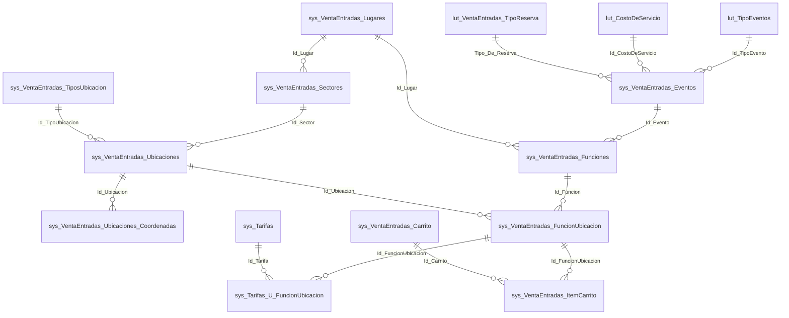

# BoleteriaCore — Verdad de referencia (relevamiento de verificación independiente)

> **Antecedente del estudio.** Relevamiento independiente del modelo de datos y las reglas de publicación de
> `BD/BoleteriaCore`, hecho directamente sobre el código fuente con citas `archivo:línea`.
>
> **Por qué existe.** Se produjo como *control cruzado* del bloque [`../Boleteria-Eventos/`](../Boleteria-Eventos/):
> un segundo relevamiento, ciego respecto del primero, para detectar invenciones y corregir hipótesis. Cumplió su
> función: **refutó** la hipótesis de que existiera una relación directa `Evento 1—N Tarifa` (sección 1) y estableció
> que «Publicado» no existe en la base (sección 2). Ambos hallazgos fueron **confirmados de forma independiente** por
> la base de conocimiento [`BD/Boleteria.Core.Documentacion/ia-db/`](../../../../../BD/Boleteria.Core.Documentacion/ia-db/README.md),
> generada por otra vía, que declara que `FuncionUbicacion` es «la tabla más importante del modelo».
>
> **Estado.** 🟨 Fuente auditable, no normativa. Ante conflicto con el código, **gana el código**. Los límites de lo
> que este relevamiento *no* pudo verificar están declarados en la sección final — leerla antes de apoyarse en él.
>
> **Audiencia.** Quien necesite auditar una afirmación 🟩 de los documentos de `Boleteria-Eventos/` que cite este relevamiento.
>
> Convención: 🟩 verificado con cita · 🟨 inferencia propia.

## HALLAZGOS QUE CORRIGEN HIPÓTESIS PREVIAS

### 1. Cardinalidad Evento↔Tarifa (CRÍTICO)
🟩 **NO existe `Evento 1—N Tarifa` ni `Función 1—N Tarifa`.** `sys_Tarifas` **no tiene FK alguna**
(`SysTarifasModel.cs:11-33`). Cadena real:

```
Evento 1—N Función 1—N FuncionUbicacion N—N Tarifa
                             └─ sys_Tarifas_U_FuncionUbicacion (lleva el Precio)
```

🟨 El wizard crea una tarifa nueva por cada precio cargado (`ParametrosEventosAlta.razor.cs:2903-2924`),
por lo que la N—N degenera en 1—1 y `sys_Tarifas` acumula duplicados por evento.
El flag `Es_Referencia` sugiere catálogo de tarifas plantilla, pero **esa lógica está comentada**
(`ParametrosEventosAlta.razor.cs:3260-3342`: "COMENTADAS PARA DEFINIR MAS ADELANTE ... 9/4").

### 2. "Publicado" no existe en la base
🟩 Hay **dos flags independientes** en `sys_VentaEntradas_Eventos`: `Activo` (mapeado,
`SysVentaEntradasEventosModel.cs:57`) y `Pausado` (**NO mapeado en el Model**; se escribe con
`UpdateByPausado`, `SysVentaEntradasEventosDataManager.cs:32-42`; se lee como columna cruda en
`ParametrosEventosEdit.razor.cs:174` → `Publicado = !Pausado`).
🟩 `Publicado` es propiedad de ViewModel de UI. **No hay estado enum, ni borrador, ni
`Fecha_Publicacion` a nivel evento.** Las fechas de publicación son **por función**
(`Fecha_Inicio_Publicacion`/`Fecha_Fin_Publicacion`, `SysVentaEntradasFuncionesModel.cs:27-29`).
🟩 Coherencia mantenida por UI: publicar = `Pausado=false, Activo=true`; pausar = `Pausado=true, Activo=false`.

### 3. `lut_Parametros` es clave-valor GLOBAL
🟩 Solo `Codigo`, `Valor`, `Observaciones` (`LutParametrosModel.cs:11-15`). **Sin `Id_Evento`, sin tenant,
sin scope.** No participa del grafo relacional.
🟩 **Ningún parámetro se valida como obligatorio antes de publicar.**
🟩 `ParametrosService` (`Services/ParametrosService.cs:11-65`) cachea en `IConfiguration`.
🟩 `LutParametrosDataManager.GetByCodigos:42-60` arma `WHERE Codigo IN (...)` por concatenación de strings
(inyección SQL potencial; hoy los códigos son literales).
🟨 **Ambigüedad de nombres**: en el Backoffice, "Parámetros" (`Components/Pages/Parametros/*`) es el módulo
de administración completo (eventos, cajeros, puntos de venta, usuarios), NO la tabla `lut_Parametros`.

## REGLAS DE PUBLICACIÓN REALES

🟩 **Toda la validación vive en el Backoffice (Blazor code-behind). No hay Service ni excepción de dominio
que la cubra.** Las excepciones de `BoleteriaCore.Exceptions` son todas de compra/carrito/gateway.

| # | Condición | Validada en | Efecto |
|---|---|---|---|
| 1 | Publicar evento pausado **sin tarifa con `Precio > 0` en función activa** | `ParametrosEventos.razor.cs:390-405` → modal `:422-436` | **BLOQUEO**. "No se puede publicar el evento" / "Debe existir al menos una tarifa con precio en una función activa." |
| 2 | Despausar desde edición sin tarifa con precio | `ParametrosEventosEdit.razor.cs:1090-1105` → `:1165+` | BLOQUEO, mismo modal |
| 3 | Desactivar la última función con precios estando publicado | `ParametrosEventosEdit.razor.cs:1019-1034` → `:1149-1163` | **Despublicación automática**: "El evento dejará de estar publicado ya que no existen funciones activas con precios en sus tarifas." |
| 4 | Alta: finalizar sin tarifa con precio | `ParametrosEventosAlta.razor.cs:3233-3247` | ADVERTENCIA (no bloqueo): "El evento se guardará como PAUSADO!" |
| 5 | Alta: usuario marcó no publicado | `ParametrosEventosAlta.razor.cs:3249-3258` | Advertencia + opciones |
| 6 | Ubicaciones con mapa habilitado sin coordenadas | `ParametrosEventosAlta.razor.cs:3217-3231` | ADVERTENCIA: "no se verán publicadas" |
| 7 | `Fecha_Inicio_Publicacion >= Fecha` de la función | `ParametrosEventosAlta.razor.cs:2965-2970, 2791-2796`; `ParametrosEventosEditFunciones.razor.cs:817, 1098` | BLOQUEO |
| 8 | Función sin fecha | `ParametrosEventosAlta.razor.cs:2980-2986` | BLOQUEO |
| 9 | Función sin descripción | `:2991-2996` | BLOQUEO |
| 10 | Función sin imagen | `:3013-3018` | flag (con `//DESCOMENTAR`) |
| 11 | Evento sin nombre | `:1210-1216, 1397-1403` | BLOQUEO wizard |
| 12 | Evento sin botón de pago (`BotonPago <= 0`) | `:1217-1223, 1404-1410` | BLOQUEO wizard |
| 13 | Evento sin costo de servicio | `:1224-1230, 1411-1417` | BLOQUEO wizard |
| 14 | Evento sin email de aviso de compra | `:1231-1237, 1418-1424` | BLOQUEO wizard |
| 15 | Evento sin imagen | `:1238-1243, 1425-1431` | flag (`//DESCOMENTAR`) |
| 16 | Confirmación antes de publicar | `ParametrosEventosAlta.razor:5064-5086` → `.cs:3367-3374` | "Estás a punto de publicar el evento ¿Desea continuar?" |

🟨 **Inconsistencia real (load-bearing)**: las validaciones 1/2/3 son client-side only. `UpdateByPausado`
es invocable sin chequeo, y en la MISMA pantalla `AccionPausar` (`ParametrosEventos.razor.cs:441-461`)
despausa **sin** verificar tarifas mientras `AccionCambiarEstado` (`:386-420`) sí verifica.

## ENTIDADES REALES (tabla → clase → archivo)

| Entidad | Clase | Tabla | Model | Abstract |
|---|---|---|---|---|
| Evento | `SysVentaEntradasEventosModel` | `sys_VentaEntradas_Eventos` | `Models/SysVentaEntradasEventosModel.cs:6` | `Abstracts/SysVentaEntradasEventosAbstract.cs:11` |
| Función | `SysVentaEntradasFuncionesModel` | `sys_VentaEntradas_Funciones` | `Models/SysVentaEntradasFuncionesModel.cs:8` | `...FuncionesAbstract.cs:15` |
| Tarifa | `SysTarifasModel` | `sys_Tarifas` | `Models/SysTarifasModel.cs:8` | `Abstracts/SysTarifasAbstract.cs:15` |
| **Tarifa×Ubicación (PRECIO)** | `SysTarifasUFuncionUbicacionModel` | `sys_Tarifas_U_FuncionUbicacion` | `Models/SysTarifasUFuncionUbicacionModel.cs:8` | `...Abstract.cs:15` |
| Función×Ubicación | `SysVentaEntradasFuncionUbicacionModel` | `sys_VentaEntradas_FuncionUbicacion` | `Models/...cs:8` | `...Abstract.cs:15` |
| Parámetro | `LutParametrosModel` | `lut_Parametros` | `Models/LutParametrosModel.cs:8` | `Abstracts/LutParametrosAbstract.cs:13` |
| Lugar (sala) | `SysVentaEntradasLugaresModel` | `sys_VentaEntradas_Lugares` | — | `...LugaresAbstract.cs:11` |
| Sector | `SysVentaEntradasSectoresModel` | `sys_VentaEntradas_Sectores` | `Models/...cs:25` | `...SectoresAbstract.cs:11` |
| Ubicación | `SysVentaEntradasUbicacionesModel` | `sys_VentaEntradas_Ubicaciones` | `Models/...cs:10-26` | `...Abstract.cs:11` |
| Butaca (coordenada) | `SysVentaEntradasUbicacionesCoordenadasModel` | `sys_VentaEntradas_Ubicaciones_Coordenadas` | — | `...Abstract.cs:12` |
| Carrito | `SysVentaEntradasCarritoModel` | `sys_VentaEntradas_Carrito` | — | `...CarritoAbstract.cs:14` |
| Ítem carrito | `SysVentaEntradasItemCarritoModel` | `sys_VentaEntradas_ItemCarrito` | — | `...Abstract.cs:14` |
| Entrada | `SysVentaEntradasEntradasModel` | `sys_VentaEntradas_Entradas` | — | `...EntradasAbstract.cs:11` |
| Tipo de evento | `LutTipoEventosModel` | `lut_TipoEventos` | `Models/...cs:9` | `...Abstract.cs:11` |
| Tipo de reserva | `LutVentaEntradasTipoReservaModel` | `lut_VentaEntradas_TipoReserva` | `Models/...cs:9` | `...Abstract.cs:11` |
| Botón de pago | `LutBotonesPagoModel` | `lut_BotonesPago` | — | `...Abstract.cs:13` |
| Descuento | `SysDescuentosModel` | `sys_Descuentos` | — | `...Abstract.cs:11` |
| Combo | `SysCombosModel` | `sys_Combos` | — | `...Abstract.cs:13` |

## ER REAL


%% lut_Parametros NO tiene FK a Evento ni tenant: es clave-valor global, fuera del grafo.

## PATRÓN DE DATOS
🟩 No hay EF Core ni propiedades de navegación. Cada entidad tiene un `*Abstract` que instancia
`DataEntityCore("<tabla>")` de `Notions.Core.Utils.DataManager`; los DAOs invocan SPs por convención
(`GetByAsync("Vigentes", ...)` → `sp_<tabla>_GetBy_Vigentes`). Las relaciones son campos `Id_*` planos
y JOINs dentro de los SPs.

## TARIFAS
🟩 `sys_Tarifas`: `Descripcion`, `Cantidad_Entradas`, `Minimo_Entradas`, `Activo`, `Es_Default`, `Interna`,
`Es_Referencia`. **Sin vigencias, sin fechas, sin porcentaje de descuento, sin precio.**
🟩 Precio en `sys_Tarifas_U_FuncionUbicacion`: `Precio`, `Precio_Menores` (`:17-19`). Es lo que evalúa
`t.Precio > 0` en todas las reglas de publicación.
🟩 Alta: `MinimoEntradas = 1` y `UsuarioAlta = "admin"` hardcodeados (`ParametrosEventosAlta.razor.cs:2903-2925`).
Precio `<= 0` ⇒ se borra el vínculo (`:2894-2901`).
🟩 `Es_Referencia` está declarado (`SysTarifasModel.cs:33`) pero **no se mapea** en `SysTarifasModel(DataRow)`
(`:44-59`) — inconsistencia real.
🟩 Descuentos son otro subsistema (`sys_Descuentos*`, `sys_DescuentoFuncionUbicacion`) + campos de precio en
`FuncionUbicacion` (`Precio_Descuento`, `Fecha_Antcipado` [sic]). **No participan de la publicación.**

## FUNCIONES
🟩 `Fecha`, `Fecha_Inicio_Publicacion`, `Fecha_Fin_Publicacion`, `Valida_Fecha`, `Ingreso`, `Ingreso_Maximo`.
🟩 Cupo: `Maximo_Entradas` (función); `Cantidad`/`Ilimitado` (ubicación); `Porcentaje_Web` (FuncionUbicacion).
🟩 `Id_Lugar` **duplicado** en función y en evento (col. escrita por `UpdateByIdLugarAsync` pero no leída por
el Model) → 🟨 riesgo de divergencia.
🟩 `Interno`/`Entrada_Libre`/`Solo_Cajero` marcan funciones no vendibles al público.
🟩 `Tipo_De_Reserva` se **deriva** del tipo de evento y de si hay mapa (`ParametrosEventosAlta.razor.cs:1433-1459`):
tipo 2→reserva 4 "con formulario"; tipo 4→reserva 2 "Ilimitada"; tipos 1/3 → 3 "con Butacas" si hay mapa, si no 1 "Normal".

## NO VERIFICADO — LÍMITES DE ESTA VERDAD DE REFERENCIA
- 🟩 **Cuerpos de los SPs**: el repo solo tiene `DataManager/Migraciones/issue-505.sql` (ALTERs) e
  `issue-506.sql` (1 SP). **Cualquier regla de publicación embebida en SQL es invisible.** Sin verificar:
  `..._GetBy_Vigentes`, `..._GetBy_VigentesPV`, `..._GetBy_Id_EsFechaVigente`, `..._GetBy_Id_Evento_Vigentes`,
  `..._UpdateBy_Pausado`, `..._UpdateBy_AltaEventoCore`.
- 🟩 **DDL/constraints/FKs reales**: no hay script de esquema. Las FKs del ER están inferidas de campos `Id_*`
  y de JOINs del único SP disponible. **Cardinalidades exactas y existencia física de FOREIGN KEY no verificadas.**
- 🟩 Columna `Pausado`: existe (se escribe/lee) pero no está en el Model ni en ningún DDL del repo. Tipo/default no verificado.
- 🟩 Columnas `Id_Lugar`, `Boton_Pago`, `Limite_Comision_Exclusiva`, `Horas_Previas_Validacion`,
  `Mostrar_Cantidades`, `Campo_Adicional` de `sys_VentaEntradas_Eventos`: se usan vía `UpdateBy*`/`GetBy*`
  pero **no están mapeadas en el Model**.
- 🟩 **Multi-tenant**: no hay discriminador de tenant. Lo más cercano: `GP_IdMunicipio`
  (`SysVentaEntradasEventosModel.cs:23`) y el parámetro `CONFIG_codMunicipio`. 🟨 La segmentación parece ser
  por municipio, pero no hay código que lo confirme como aislamiento.
- 🟩 **Sin campo borrador/draft/Estado/Visible/Habilitado**. `Visible` solo existe como propiedad de UI
  (`EventoVigenteCardModel.cs:13`, hardcodeada a `true`).
- 🟩 **Sin validación de publicación en Services ni Exceptions** (grep exhaustivo).
- 🟩 **Sin proyecto de tests** en la solución.
- 🟨 `ParametrosEventosAlta.razor.cs` tiene **6212 líneas**; se leyeron 1-1507, 2720-3020, 3180-3439.
  **No se leyeron** 1508-2719 y 3440-6212 (wizard de lugares/sectores/mapas y bloques comentados):
  podría haber validaciones adicionales.
- 🟨 **Funciones ilimitadas**: flujo paralelo (`ParametrosEventosAltaFuncionesIlimitadas`,
  `ParametrosEventosEditFuncionesIlimitadas`, `FechaIlimitadaModel`) **no analizado en profundidad**;
  puede tener reglas de publicación propias.
