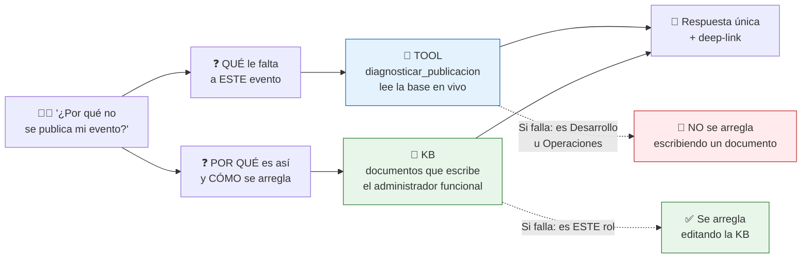
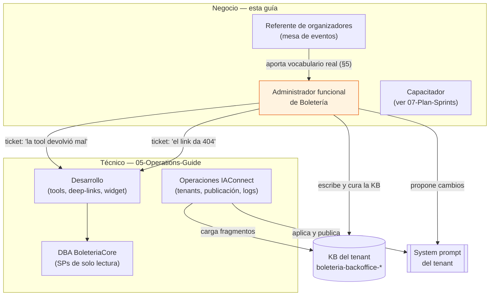
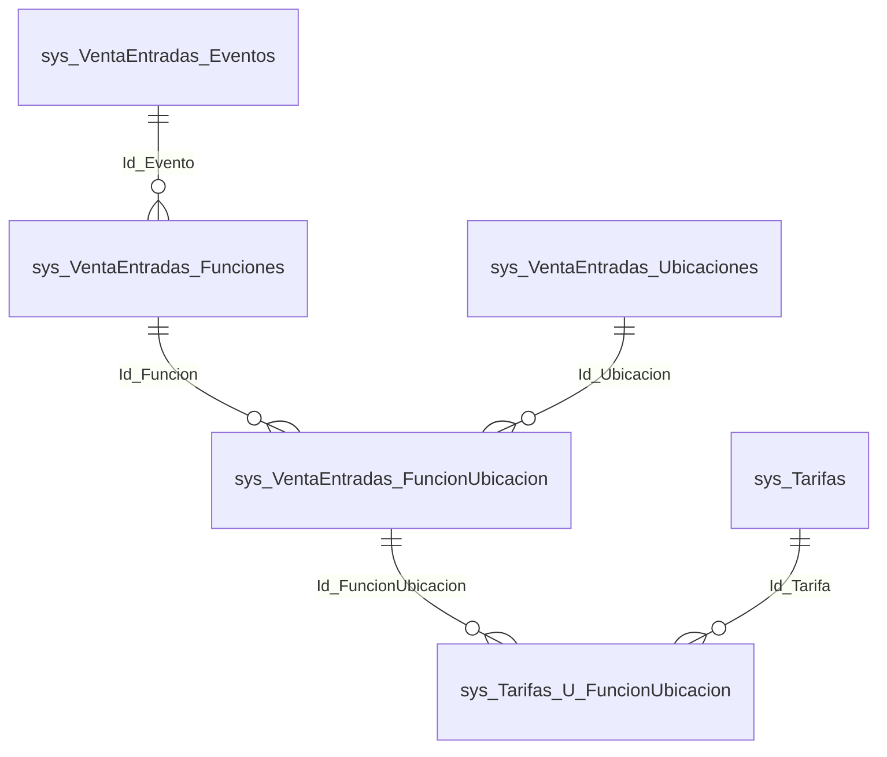
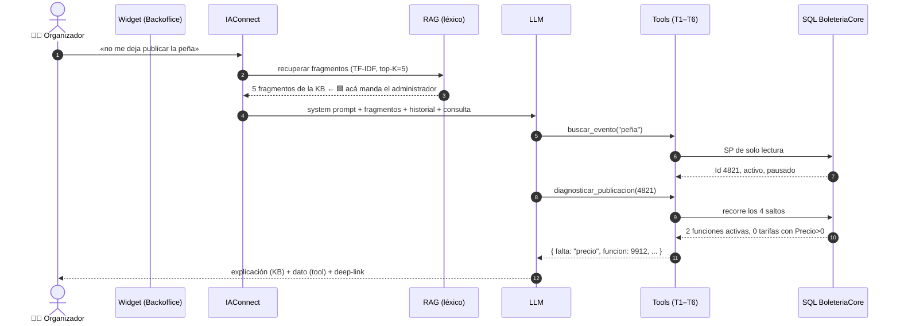
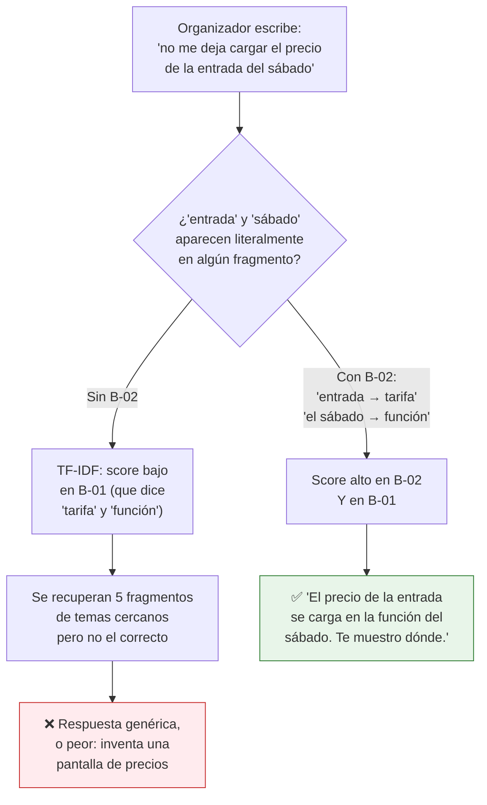
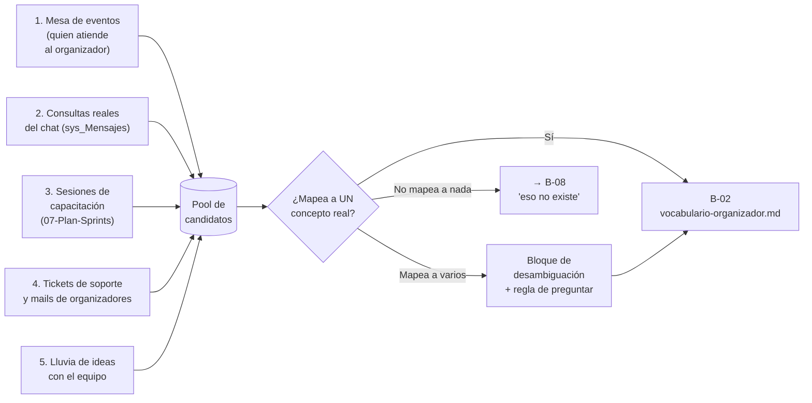
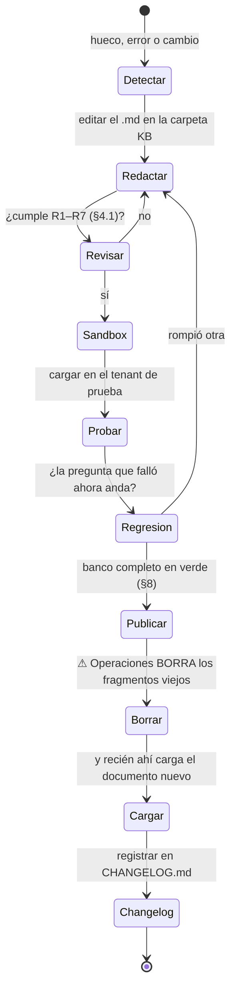
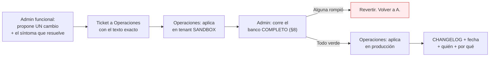
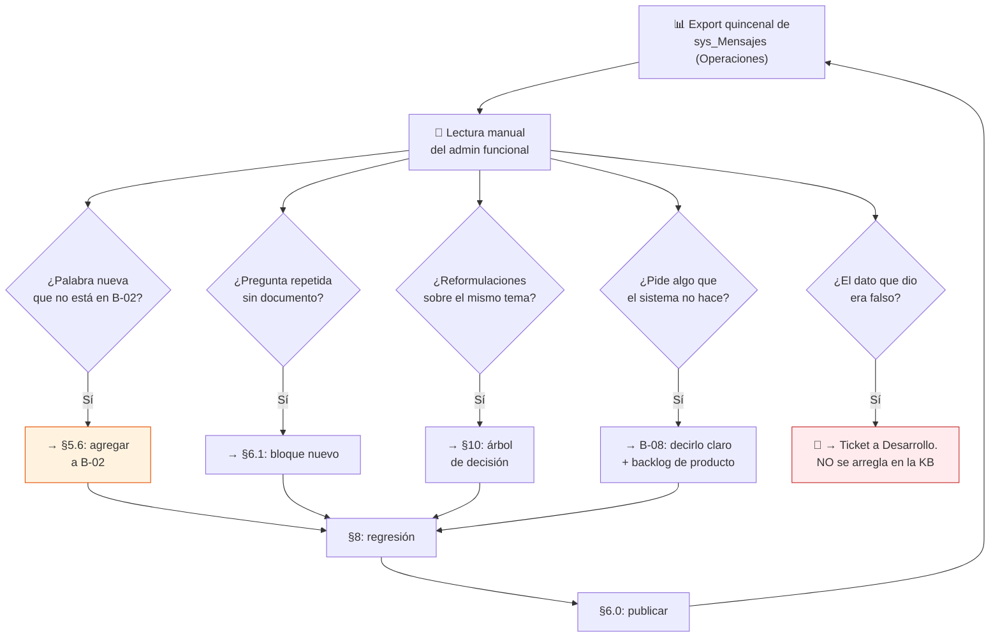
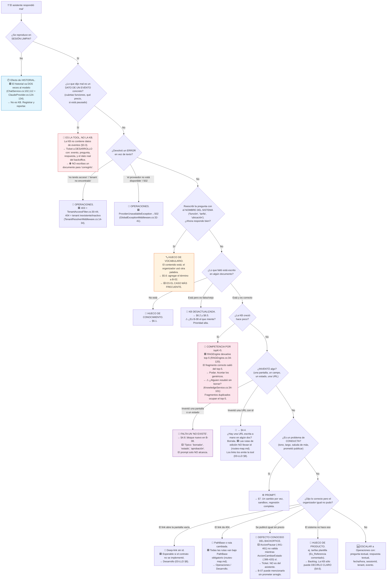

# 06 — Administrator Guide · Asistencia sobre Gestión de Eventos (BoleteriaCore)

> **Propósito.** Guía operativa del **administrador funcional** (referente de negocio de boletería) del asistente IA del caso *Gestión de Eventos*: quién mantiene el conocimiento, cómo se redacta, cómo se releva el vocabulario del organizador, cómo se prueba un cambio, cómo se diagnostica una respuesta mala y cómo se detecta un hueco.
> **Alcance.** Lo **específico del caso Eventos** de BoleteriaCore. La metodología general del servicio (alta de tenant, carga de documentos a la KB, edición de fragmentos, gestión de usuarios y roles, function-calling como mecanismo) está en [../Ng-IAServices/06-Administrator-Guide.md](../Ng-IAServices/06-Administrator-Guide.md) y **no se repite acá**.
> **Audiencia.** Referente funcional de Boletería (municipio / organización), coordinador de la mesa de eventos, capacitador de organizadores, y el analista que hace de puente con el equipo técnico. **No requiere saber programar ni escribir SQL.**
> **Estado.** 🟨 Propuesta de diseño operativo. El asistente de Eventos **no existe hoy**: ni en BoleteriaCore ni como tenant de IAConnect. Todo procedimiento marcado 🟨 describe el régimen objetivo, no una práctica vigente.
> **Documentos hermanos.** [01-SAD](01-SAD.md) · [02-HLD](02-HLD.md) · [03-LLD](03-LLD.md) · [04-ADR](04-ADR.md) · [05-Operations-Guide](05-Operations-Guide.md) · **06-Administrator-Guide** · [07-Plan-Sprints-Capacitacion](07-Plan-Sprints-Capacitacion.md)
> **Caso hermano.** El mismo documento para el otro caso de éxito: [../GDA-Turnos/06-Administrator-Guide.md](../GDA-Turnos/06-Administrator-Guide.md). Se parecen mucho, salvo en una cosa decisiva: **acá el asistente sí consulta la base en vivo** (§2).

**Convención de marcas** (heredada de [../Antecedentes/Analisis-Asistencia-IA-ChatBotIA.md](../Antecedentes/Analisis-Asistencia-IA-ChatBotIA.md)):

| Marca | Significado |
|---|---|
| 🟩 | Hecho verificado en fuente (se cita ruta y, cuando aplica, línea). |
| 🟦 | Práctica de industria establecida. |
| 🟨 | Interpretación / inferencia / propuesta propia de este estudio. |
| No verificado | Afirmación que no pudo respaldarse; se declara como tal. |

---

## Tabla de contenidos

1. [Introducción, audiencia y responsabilidades](#1-introducción-audiencia-y-responsabilidades)
2. [Modelo mental: qué sabe y qué no sabe el asistente](#2-modelo-mental-qué-sabe-y-qué-no-sabe-el-asistente)
3. [Contenido de la KB del caso](#3-contenido-de-la-kb-del-caso)
4. [Cómo redactar el contenido del caso (BUENO vs MALO)](#4-cómo-redactar-el-contenido-del-caso-bueno-vs-malo)
5. [Gestión de sinónimos y lenguaje del usuario](#5-gestión-de-sinónimos-y-lenguaje-del-usuario)
6. [Tareas frecuentes paso a paso](#6-tareas-frecuentes-paso-a-paso)
7. [Ajuste del system prompt](#7-ajuste-del-system-prompt)
8. [Banco de preguntas de regresión](#8-banco-de-preguntas-de-regresión)
9. [Lectura de métricas y feedback: el ciclo de mejora](#9-lectura-de-métricas-y-feedback-el-ciclo-de-mejora)
10. [Diagnóstico: árbol de decisión ante "el asistente responde mal"](#10-diagnóstico-árbol-de-decisión-ante-el-asistente-responde-mal)
11. [Qué NO debe hacer el administrador](#11-qué-no-debe-hacer-el-administrador)
12. [Checklist periódico](#12-checklist-periódico)
13. [Trazabilidad de evidencia](#13-trazabilidad-de-evidencia)
- [Anexo A — Ficha de una sola página para el administrador nuevo](#anexo-a--ficha-de-una-sola-página-para-el-administrador-nuevo)
- [Anexo B — Diferencias con el caso hermano GDA-Turnos](#anexo-b--diferencias-con-el-caso-hermano-gda-turnos)

---

## 1. Introducción, audiencia y responsabilidades

### 1.1 Por qué existe este rol, y por qué acá es distinto

El caso de éxito de Boletería es un **asistente de diagnóstico de configuración**: el organizador cargó un evento, le da a publicar, no le deja, y pregunta *«¿por qué?»*. El asistente tiene que contestarle **qué le falta** y **dónde arreglarlo**.

Ese *qué le falta* **no está en ningún documento**. Está en la base de datos, en la fila de un evento concreto, un martes a las once de la noche. Por eso el diseño de este caso usa **function-calling** (herramientas que consultan la base en vivo) además de RAG estático — ver [02-HLD §6](02-HLD.md) y [03-LLD §4](03-LLD.md).

Eso parte el trabajo del administrador funcional en dos mitades que **no se pueden confundir**:



🟨 **Regla número uno de este rol:** *los datos los pone la tool; el sentido lo pone la KB.* Si el asistente dice **un dato falso sobre un evento concreto** (por ejemplo, «tu evento tiene 3 funciones» cuando tiene 5), **eso no se arregla en la KB** — es un defecto de la tool y va a Desarrollo. Si el asistente **explica mal la regla** o **manda a la pantalla equivocada**, eso sí es KB, y es este rol.

### 1.2 Reparto de responsabilidades



| Responsabilidad | Dueño | Dónde está el procedimiento |
|---|---|---|
| Decidir **qué sabe** el asistente sobre eventos | Administrador funcional | §3, §4 |
| Redactar y mantener los documentos de la KB | Administrador funcional | §4 |
| Mantener el **diccionario de vocabulario** del organizador | Administrador funcional | §5 |
| Correr el **banco de regresión** antes de publicar un cambio | Administrador funcional | §8 |
| Cargar/borrar fragmentos en IAConnect, gestionar tenants | Operaciones | [../Ng-IAServices/06-Administrator-Guide.md](../Ng-IAServices/06-Administrator-Guide.md) §4 |
| Aplicar un cambio de system prompt | Operaciones (a pedido del admin funcional) | §7 + [../Ng-IAServices/06-Administrator-Guide.md](../Ng-IAServices/06-Administrator-Guide.md) §3 |
| Corregir una **tool** que devuelve datos mal | Desarrollo | [03-LLD §4](03-LLD.md) |
| Corregir un **deep-link roto** | Desarrollo (contrato) + Admin (texto) | §6.4 + [03-LLD §8](03-LLD.md) |
| Corregir el Backoffice (validación, pantalla) | Desarrollo | [01-SAD §riesgos](01-SAD.md) |

### 1.3 Dos tenants por perfil, dos fases

⚖️ **corregido por ADR-010.** 🟨 [01-SAD §6.6](01-SAD.md) proponía tenants con sufijo de municipio (`boleteria-backoffice-{municipio}`). 🟩 [ADR-010](04-ADR.md) — *«El tenant de IAConnect mapea al perfil, no al municipio»* (`04-ADR.md:921`) — **superseded ese nombre**: el tenant modela la **audiencia (perfil)**, sin sufijo de jurisdicción.

| Tenant | Audiencia | Contenido de KB | Tools | Fase |
|---|---|---|---|---|
| `boleteria-backoffice-organizador` | Organizador / operador que carga eventos | Conceptos de la cadena, reglas de publicación, cómo-hago, vocabulario, errores | Sí (T1–T6) | **1 — el caso de éxito** |
| `boleteria-backoffice-admin` | Administrador / mesa de eventos del municipio | Lo mismo + operación transversal | Sí (T1–T6) | **1 — el caso de éxito** |
| `boleteria-web-comprador` | Comprador del portal público | Cartelera, cómo comprar, medios de pago, entradas | No | 2 |

**Esta guía cubre los tenants de Backoffice** (`-organizador` y `-admin`), y todo lo que dice sobre la KB aplica a los dos. 🟨 El tenant de Web (`boleteria-web-comprador`) es de fase 2 y su KB es un caso de *cómo-hago* estándar, sin diagnóstico.

🟨 **Por qué no hay sufijo de municipio, y qué significa para este rol:** 🟩 **BoleteriaCore no tiene multi-tenancy**. No hay discriminador de tenant en el modelo; lo más cercano es la columna `GP_IdMunicipio` (`SysVentaEntradasEventosModel.cs:23`) y el parámetro global `CONFIG_codMunicipio` — que 🟩 es **global** (`LutParametrosModel.cs:11-15`): una instalación ya **es** un municipio, así que el sufijo era redundante. 🟩 ADR-010 lo descarta además porque *«el tenant no filtra filas»*: el aislamiento entre municipios lo garantiza **exclusivamente** el `alcance(sub)` del JWT en la API adaptadora, **nunca** el nombre del tenant. **Consecuencia para el administrador:** hay **una sola KB por perfil**, no una por municipio, y el contenido conceptual (la cadena, las reglas) es el mismo para todos. 🟨 El contenido genuinamente local (nombre de la sala, teléfono de la mesa de eventos) no tiene hoy dónde separarse: si aparece un multi-municipio real con KB distintas, 🟩 ADR-010 se **supersede** — no se parchea con un sufijo.

---

## 2. Modelo mental: qué sabe y qué no sabe el asistente

### 2.1 La cadena de cuatro saltos — el modelo mental que el administrador **tiene que** tener

Esto es lo único de esta guía que hay que aprenderse de memoria. **Todo el caso vive acá.**



🟩 **La tarifa NO cuelga del evento.** `sys_Tarifas` **no tiene ninguna FK** (`SysTarifasModel.cs:11-33`): no sabe a qué evento pertenece. 🟩 **La tarifa tampoco tiene precio**: `sys_Tarifas` tiene `Descripcion`, `Cantidad_Entradas`, `Minimo_Entradas`, `Activo`, `Es_Default`, `Interna`, `Es_Referencia` — y nada más (`SysTarifasModel.cs:11-33`).

🟩 **El precio vive en la tabla puente** `sys_Tarifas_U_FuncionUbicacion` (columnas `Precio`, `Precio_Menores`, `SysTarifasUFuncionUbicacionModel.cs:17-19`). 🟩 La ia-db de BoleteriaCore lo dice con todas las letras: *«FuncionUbicacion es la tabla más importante del modelo: casi todo lo que se vende, se tarifa o se descuenta cuelga de su Id»* ([`ia-db/indexes/02_Modelo-Dominio.md`](../../../../../BD/Boleteria.Core.Documentacion/ia-db/indexes/02_Modelo-Dominio.md)).

**Traducción a castellano para la capacitación** 🟨:

> Un **precio** no es una propiedad de la tarifa. Un precio es la respuesta a *«¿cuánto sale la tarifa Jubilados, en la ubicación Platea, en la función del sábado, del evento Peña Folclórica?»*. Hacen falta las cuatro cosas para que exista un precio. Si falta cualquiera de los cuatro eslabones, no hay precio, y **sin precio no hay publicación**.

**Por qué esto justifica el caso de éxito entero** 🟨: el organizador inexperto tiene que recorrer mentalmente esos cuatro saltos para entender por qué le falta un precio. No los recorre. Se queda mirando la pantalla del evento buscando un campo «precio» que **no existe en esa pantalla y no puede existir**. El asistente aporta valor porque **hace el recorrido por él** y lo deposita en el eslabón roto.

### 2.2 "Publicado" no existe — el hecho que más confunde a todo el mundo

🟩 **No hay estado, ni enum, ni borrador, ni columna `Publicado`, ni `Fecha_Publicacion` a nivel evento.** Hay **dos flags booleanos independientes** en `sys_VentaEntradas_Eventos`:

| Flag | ¿Mapeado en el Model? | Evidencia |
|---|---|---|
| `Activo` | Sí | `SysVentaEntradasEventosModel.cs:57` |
| `Pausado` | **No** — se escribe con `UpdateByPausado` y se lee como columna cruda | `SysVentaEntradasEventosDataManager.cs:32-42`; `ParametrosEventosEdit.razor.cs:174` |

🟩 `Publicado` es una **propiedad de ViewModel de la UI** que invierte `Pausado`: `Publicado = !Pausado` (`ParametrosEventosEdit.razor.cs:174`).
🟩 La coherencia la sostiene la UI: publicar = `Pausado=false, Activo=true`; pausar = `Pausado=true, Activo=false`.
🟩 Las fechas de publicación existen **por función**, no por evento: `Fecha_Inicio_Publicacion` / `Fecha_Fin_Publicacion` (`SysVentaEntradasFuncionesModel.cs:27-29`).

**Qué significa esto para el administrador funcional** 🟨:

1. La palabra «publicado» **es vocabulario de usuario, no del sistema**. Está bien usarla en la KB — es como habla la gente — pero **nunca** la escribas como si fuera un campo. Escribí *«el evento aparece en la cartelera cuando está activo y no pausado»*.
2. **No prometas un estado «borrador»**. No existe. Un evento a medio cargar es simplemente un evento pausado.
3. Si alguien pide «un informe de eventos en borrador», la respuesta correcta de la KB es *«no hay borradores; hay eventos pausados, y se ven así»*.

### 2.3 Cómo llega una pregunta a una respuesta



🟨 **Dónde manda el administrador, exactamente:** en el paso 3 (qué fragmentos existen para recuperar) y, indirectamente, en el paso 5 (el system prompt, que se propone acá y lo aplica Operaciones). En los pasos 6-11 **no manda**: eso es código.

### 2.4 El punto técnico que más afecta al administrador: el RAG es **léxico**

🟩 El motor de recuperación de IAConnect es **TF-IDF léxico**, no semántico (`RAGEngine.cs:34-120`); 🟩 el campo `VectorEmbedding` queda siempre en `null` (`KnowledgeService.cs:75`) y `SerializeEmbedding` es código muerto (`RAGEngine.cs:122-127`).

**Qué implica, en criollo** 🟨:

| Hecho técnico | Evidencia | Consecuencia para quien escribe |
|---|---|---|
| Compara **palabras**, no significados | 🟩 `RAGEngine.cs:34-120` | Si el usuario dice «entrada» y el documento dice «tarifa», no matchea. Hay que escribir **las dos**. |
| Tokens de **≤ 2 caracteres se descartan** | 🟩 `RAGEngine.cs:14-24` | No pongas «U», «FU», «id» esperando que enganchen. |
| **No normaliza acentos** | 🟩 `RAGEngine.Tokenize` (lowercase + split, sin diacríticos) | «función» y «funcion» son tokens **distintos**. En el diccionario, escribí ambos. |
| Devuelve **top-5** fragmentos | 🟩 `RAGEngine.cs:34-120` | La KB **compite consigo misma**. Más documentos ≠ mejores respuestas. Podá. |
| Resubir un documento **duplica** fragmentos | 🟩 `KnowledgeService.cs:34-101` | **Nunca** resubas sin que Operaciones borre lo anterior (§6.0). |
| Chunking: ~400 palabras, paso 350 | 🟩 `KnowledgeService.cs:16-17, 103-121` | Un bloque conceptual debe **caber** en ~400 palabras o se parte al medio. |
| El historial se envía **dos veces** al modelo | 🟩 `ChatService.cs:102,112` + `ClaudeProvider.cs:124-134` | Si una respuesta rara aparece recién en el 4º turno, **probá en sesión limpia** antes de tocar la KB (§10). |

### 2.5 Qué NO puede hacer el asistente (y hay que decirlo en la KB)

| No puede | Por qué | Marca |
|---|---|---|
| **Cambiar nada.** No publica, no despausa, no crea tarifas | Diseño: las tools son de **solo lectura** ([03-LLD §4.1](03-LLD.md)) | 🟨 |
| Saber qué hay adentro de los **stored procedures** | 🟩 El repo sólo tiene `DataManager/Migraciones/issue-505.sql` e `issue-506.sql`. Los cuerpos de `..._GetBy_Vigentes`, `..._GetBy_Id_EsFechaVigente`, `..._UpdateBy_Pausado` **no están**. Cualquier regla embebida en SQL es invisible | 🟩 |
| Garantizar que el evento se va a publicar tras corregir lo que dijo | El diagnóstico cubre las reglas **conocidas** (§2.6). Puede haber reglas en SP no verificadas | 🟨 |
| Explicar un error de pantalla del Backoffice que nadie documentó | Sólo sabe lo que está en la KB | 🟨 |
| Ver eventos de otro municipio | 🟨 Filtro por `GP_IdMunicipio` propuesto en [03-LLD §4.1](03-LLD.md) | 🟨 |

### 2.6 Qué sí sabe, y muy bien: las reglas reales de publicación

🟩 **Toda la validación de publicación vive client-side, en el code-behind Blazor del Backoffice.** No hay Service ni excepción de dominio que la cubra: las excepciones de `BoleteriaCore.Exceptions` son todas de compra/carrito/gateway.

🟩 **La regla real es esencialmente UNA**: debe existir **al menos una tarifa con `Precio > 0` en una función activa**. Lo demás son validaciones de wizard (campos obligatorios del alta) o advertencias.

| # | Condición | Efecto | Evidencia |
|---|---|---|---|
| 1 | Publicar evento pausado **sin tarifa con `Precio > 0` en función activa** | **BLOQUEO**: «No se puede publicar el evento» / «Debe existir al menos una tarifa con precio en una función activa.» | 🟩 `ParametrosEventos.razor.cs:390-405` → modal `:422-436` |
| 2 | Despausar desde edición sin tarifa con precio | BLOQUEO, mismo modal | 🟩 `ParametrosEventosEdit.razor.cs:1090-1105` → `:1165+` |
| 3 | Desactivar la **última** función con precios estando publicado | **Despublicación automática**: «El evento dejará de estar publicado ya que no existen funciones activas con precios en sus tarifas.» | 🟩 `ParametrosEventosEdit.razor.cs:1019-1034` → `:1149-1163` |
| 4 | Alta: finalizar sin tarifa con precio | **ADVERTENCIA** (no bloqueo): «El evento se guardará como PAUSADO!» | 🟩 `ParametrosEventosAlta.razor.cs:3233-3247` |
| 6 | Ubicaciones con mapa habilitado sin coordenadas | ADVERTENCIA: «no se verán publicadas» | 🟩 `ParametrosEventosAlta.razor.cs:3217-3231` |
| 7 | `Fecha_Inicio_Publicacion >= Fecha` de la función | BLOQUEO | 🟩 `ParametrosEventosAlta.razor.cs:2965-2970`; `ParametrosEventosEditFunciones.razor.cs:817, 1098` |
| 8–9 | Función sin fecha / sin descripción | BLOQUEO | 🟩 `ParametrosEventosAlta.razor.cs:2980-2986`, `:2991-2996` |
| 11–14 | Evento sin nombre / sin botón de pago / sin costo de servicio / sin email de aviso | BLOQUEO del wizard | 🟩 `ParametrosEventosAlta.razor.cs:1210-1237, 1397-1424` |

⚠️ 🟨 **Inconsistencia real que el administrador tiene que conocer** (y que este estudio **no** propone arreglar): en la **misma pantalla** de listado, `AccionCambiarEstado` (`ParametrosEventos.razor.cs:386-420`) **sí** valida tarifas antes de despausar, mientras que `AccionPausar` (`:441-461`) **no valida nada**. 🟩 Además `UpdateByPausado` es invocable sin chequeo alguno. **Consecuencia práctica:** existe un camino por el cual un evento puede quedar despausado sin precios. Si un organizador reporta *«se publicó igual y salió sin precio»*, **no es una alucinación del asistente**: es este defecto. → Ticket a Desarrollo, y 🟨 documentarlo en el documento de errores (§4.5) sin prometer que se arregla.

### 2.7 La ambigüedad de "Parámetros" — hay que decirla siempre

Esta palabra significa **dos cosas distintas** y confunde a todos:

| «Parámetros» | Qué es | Evidencia |
|---|---|---|
| `lut_Parametros` (la tabla) | Diccionario **clave-valor global**: `Codigo`, `Valor`, `Observaciones`. **Sin `Id_Evento`, sin tenant, sin scope.** No participa del grafo relacional | 🟩 `LutParametrosModel.cs:11-15` |
| «Parámetros» (el módulo del Backoffice) | El **módulo de administración completo**: eventos, cajeros, puntos de venta, usuarios, referidos, distribuidoras. Todas las rutas empiezan con `/Parametros...` | 🟩 `Components/Pages/Parametros/*`; `docs/pieces/boleteria-core-backoffice/routes-map.md` |

🟩 **Ningún parámetro de `lut_Parametros` se valida como obligatorio antes de publicar.** Ninguno. Cero.

🟨 **Regla de redacción obligatoria:** cuando escribas «parámetro» en la KB, aclará cuál de los dos. Y **nunca** contestes «te falta configurar un parámetro» a un «¿por qué no se publica?», porque **no es cierto**: lo que falta es un **precio en la cadena**. El pedido original del caso hablaba de «qué configuración le faltó»; 🟨 la respuesta verificada es que esa configuración es, en el 90% de los casos, **el precio en la tabla puente**, no un parámetro global.

---

## 3. Contenido de la KB del caso

### 3.1 Principio de organización

🟨 Cuatro criterios, en orden:

1. **Un documento = un tema con nombre propio.** Nada de «Manual del Backoffice».
2. **Si el dato cambia por evento, no va en la KB: lo trae la tool.** La KB no lleva nombres de eventos concretos, ni precios, ni fechas. Ese contenido se pudre en una semana y compite con las respuestas de la tool.
3. **≤ 400 palabras por bloque autocontenido** (🟩 el chunking parte a las ~400 palabras, `KnowledgeService.cs:16-17`).
4. **Densidad de sustantivos.** Los títulos son la mejor fuente de tokens del TF-IDF.

### 3.2 Inventario propuesto — tenants `boleteria-backoffice-organizador` / `boleteria-backoffice-admin`

🟨 Propuesta de este estudio. Ocho documentos. **Ocho, no cuarenta**: 🟩 el RAG devuelve top-5 y todo lo demás compite.

| Id | Documento | De qué habla | Dueño | Revisión | Prioridad |
|---|---|---|---|---|---|
| **B-01** | `cadena-evento-funcion-tarifa.md` | El modelo mental de §2.1: por qué el precio no está en el evento. **El documento más importante de la KB.** | Admin funcional | Semestral | 🔴 Crítica |
| **B-02** | `vocabulario-organizador.md` | Diccionario de sinónimos (§5). **El segundo más importante.** | Admin funcional | Quincenal | 🔴 Crítica |
| **B-03** | `reglas-de-publicacion.md` | Las reglas de §2.6 en lenguaje de negocio + qué es publicar (activo + no pausado) | Admin funcional | Trimestral | 🔴 Crítica |
| **B-04** | `como-cargo-un-evento.md` | El wizard de alta paso a paso, campos obligatorios, qué se define en cada paso | Admin funcional + capacitador | Trimestral | 🟠 Alta |
| **B-05** | `como-cargo-funciones-y-precios.md` | Funciones, ubicaciones, la grilla de precios, fechas de publicación por función | Admin funcional | Trimestral | 🟠 Alta |
| **B-06** | `donde-se-configura-cada-cosa.md` | Mapa pantalla ↔ concepto (§6.4). La fuente de verdad de los deep-links redactados | Admin + Desarrollo | **Ante cada release del Backoffice** | 🟠 Alta |
| **B-07** | `mensajes-y-errores.md` | Los textos literales que ve el organizador y qué significan | Admin funcional | Trimestral | 🟡 Media |
| **B-08** | `limites-y-lo-que-no-existe.md` | Lo que **no** existe: borradores, estados, parámetros obligatorios, tarifas plantilla. Anti-alucinación | Admin funcional | Semestral | 🟠 Alta |

🟨 **B-08 merece una defensa.** Un documento cuyo contenido es *«esto no existe»* parece un desperdicio de top-5. No lo es: 🟨 el modelo, ante *«¿dónde marco el evento como borrador?»*, tiene un incentivo fortísimo a inventar una pantalla, porque *todos los sistemas de boletería del mundo tienen borradores*. La única defensa es que exista un fragmento que diga literalmente **«en este sistema no hay borradores»**. El prompt solo no alcanza (§7).

### 3.3 Qué NO va en la KB

| ❌ | Por qué | Quién lo provee |
|---|---|---|
| Nombres, precios, fechas de eventos concretos | Se desactualiza; compite con la tool | Tool T2/T3 |
| Cuántas funciones tiene tal evento | Ídem | Tool T4 |
| El listado de tarifas de un evento | Ídem | Tool T5 |
| Nombres de tipos de evento / botones de pago / tipos de reserva | 🟨 Son lookups (`lut_TipoEventos`, `lut_BotonesPago`, `lut_VentaEntradas_TipoReserva`); los trae T6 en vivo | Tool T6 |
| Nombres de usuarios, cajeros, contraseñas | Datos personales / seguridad | Nadie |
| SQL, nombres de tablas, nombres de columnas | El organizador no habla eso, y expone el modelo | Nadie |
| El texto de esta guía | Es para el administrador, no para el organizador | — |

🟨 **Excepción a la regla del lookup:** los **nombres de las columnas del sistema** sí aparecen en B-02 (vocabulario) como «lo que dice la pantalla», porque **el organizador los lee en la pantalla**. Lo que no va es el nombre **de la tabla**.

### 3.4 Estructura de archivos del administrador

🟨 Propuesta. El administrador trabaja sobre una carpeta versionada; la publicación a IAConnect la hace Operaciones (§6.0).

```text
Boleteria-Eventos-KB/
├── README.md                          ← este inventario + quién es el dueño de cada doc
├── backoffice/                        ← tenants boleteria-backoffice-organizador / -admin
│   ├── B-01-cadena-evento-funcion-tarifa.md
│   ├── B-02-vocabulario-organizador.md
│   ├── B-03-reglas-de-publicacion.md
│   ├── B-04-como-cargo-un-evento.md
│   ├── B-05-como-cargo-funciones-y-precios.md
│   ├── B-06-donde-se-configura-cada-cosa.md
│   ├── B-07-mensajes-y-errores.md
│   └── B-08-limites-y-lo-que-no-existe.md
├── web/                               ← tenant boleteria-web-comprador (fase 2)
│   └── W-01-como-compro-una-entrada.md
├── regresion/
│   ├── banco-preguntas.md             ← §8
│   └── corridas/
│       └── 2026-07-16-r1.md
└── CHANGELOG.md                       ← qué cambió, cuándo, por qué, quién
```

---

## 4. Cómo redactar el contenido del caso (BUENO vs MALO)

### 4.1 Las siete reglas del caso Eventos

| # | Regla | Motivo |
|---|---|---|
| **R1** | **Títulos densos en sustantivos**, con los sinónimos adentro | 🟩 El TF-IDF pesa cada token; las stop-words se descartan (`RAGEngine.cs:14-24`) |
| **R2** | **Un bloque = una pregunta real** de un organizador | 🟨 El chunk recuperado tiene que responder solo |
| **R3** | **Escribí las dos palabras**: la del usuario y la del sistema, en la misma frase | 🟩 El RAG es léxico |
| **R4** | **Con y sin tilde** para todo término acentuado (`función`/`funcion`) | 🟩 Sin normalización de diacríticos |
| **R5** | **Cero datos volátiles.** Nada de precios, fechas ni nombres de eventos | 🟨 Los trae la tool |
| **R6** | **Decí lo que NO existe**, explícitamente | 🟨 Anti-alucinación (§3.2) |
| **R7** | **Nunca** uses los delimitadores del prompt | 🟩 `PromptBuilder.cs:10-55` arma bloques con delimitadores literales entre corchetes y en mayúsculas, y cita los chunks **sin escapado**: un documento que los contenga puede **partir el prompt en dos** (LLM01 de OWASP; ver [01-SAD §11](01-SAD.md)) |

### 4.2 Ejemplo completo — B-01, la cadena (el documento estrella)

#### ❌ MALO

```markdown
# Modelo de datos

La entidad Evento (sys_VentaEntradas_Eventos) se relaciona con Funciones
(sys_VentaEntradas_Funciones) mediante Id_Evento. Las Tarifas (sys_Tarifas)
se vinculan a FuncionUbicacion a través de la tabla intermedia
sys_Tarifas_U_FuncionUbicacion, que contiene el campo Precio (decimal).
La cardinalidad es N:M.
```

**Por qué es malo** (cinco defectos, todos graves):
1. 🟨 Un organizador **jamás** escribe «cardinalidad», «entidad» ni «sys_VentaEntradas_Eventos». **Cero tokens en común** con cualquier pregunta real → el TF-IDF nunca lo recupera.
2. 🟨 Expone el modelo de datos a un usuario de negocio. No le sirve y lo asusta.
3. 🟨 No dice **qué hacer**. Describe, no guía.
4. 🟨 No contiene ni una vez la palabra «precio» en el sentido en que la usa la gente («¿dónde pongo el precio?»).
5. 🟨 Es correcto y es inútil. **La corrección no alcanza.**

#### ✅ BUENO

```markdown
# Dónde se carga el precio de una entrada: evento, función, ubicación y tarifa

## Por qué en la pantalla del evento no hay ningún campo de precio

En esta plataforma el precio no es un dato del evento. Tampoco es un dato de
la tarifa. El precio nace del cruce de cuatro cosas, y hacen falta las cuatro:

1. El **evento** (el espectáculo: la peña, la obra, el recital).
2. La **función** (una fecha y hora concreta de ese evento; la gente también le
   dice "fecha", "horario", "presentación" o "el sábado").
3. La **ubicación** dentro del lugar (platea, pullman, campo; la gente le dice
   "sector", "categoría" o "butaca").
4. La **tarifa** (a quién se le vende: general, jubilados, menores, socios; la
   gente le dice "precio", "entrada", "categoría de entrada" o "tipo de ticket").

El precio se carga en el **cruce función + ubicación + tarifa**. Por eso el
precio se ve y se edita en la pantalla de funciones del evento, en la grilla que
cruza ubicaciones con tarifas, y no en la pantalla de datos del evento.

## Qué pasa si falta un eslabón

- **Sin funciones**: no hay dónde poner precio. Primero cargá al menos una función.
- **Con funciones pero sin ubicaciones asociadas**: la grilla de precios sale vacía.
  Hay que asociar ubicaciones a la función.
- **Con ubicaciones pero sin tarifas**: no hay filas en la grilla. Creá la tarifa.
- **Con todo pero el precio en cero**: es igual que no tener precio. Un precio de 0
  no habilita la publicación.

## Cómo lo pregunta la gente

no encuentro dónde poner el precio, no me deja poner el valor de la entrada,
cargué el evento y no aparece el precio, dónde cargo cuánto sale, no me figura
la grilla de precios, precio, valor, importe, cuanto sale, tarifa, entrada.
```

**Por qué es bueno**:
- 🟨 El **título** ya contiene los cuatro sustantivos de la cadena → matchea la mayoría de las preguntas.
- 🟨 El H2 *«Por qué en la pantalla del evento no hay ningún campo de precio»* **es literalmente la pregunta del usuario**. Eso es R2.
- 🟨 Cada concepto trae **su nombre de sistema y sus sinónimos en la misma línea** (R3).
- 🟩 Dice *«un precio de 0 no habilita la publicación»*, que es exactamente lo que evalúa el código (`t.Precio > 0`, regla 1 de §2.6).
- 🟨 La sección final *«Cómo lo pregunta la gente»* es un **imán de tokens**: sube el score del fragmento correcto ante preguntas coloquiales.
- 🟨 **No nombra ni una tabla.** El modelo de datos está en [03-LLD §2](03-LLD.md), para Desarrollo. Acá está el *modelo mental*.

### 4.3 Ejemplo completo — B-03, las reglas de publicación

#### ❌ MALO

```markdown
# Publicación

Para publicar un evento, completá todos los parámetros requeridos en la
configuración del evento y cambiá su estado a Publicado. Verificá que el
evento esté en estado correcto y que los parámetros obligatorios estén
cargados.
```

**Por qué es malo, y es el peor error posible de esta KB**:
1. 🟩 **Miente.** No hay «estado». Hay dos flags: `Activo` y `Pausado` (§2.2). Un fragmento que habla de «cambiar el estado a Publicado» **le enseña al modelo a inventar una pantalla que no existe**.
2. 🟩 **Miente otra vez.** No hay «parámetros obligatorios»: ningún parámetro de `lut_Parametros` se valida antes de publicar (§2.7).
3. 🟨 **No dice la única regla que importa** (precio > 0 en función activa).
4. 🟨 Es circular: «verificá que el evento esté en estado correcto» no le dice nada a nadie.

#### ✅ BUENO

```markdown
# Por qué no se publica un evento: la regla y las causas

## Qué quiere decir "publicado" en esta plataforma

No existe un estado "publicado" ni un botón que diga "publicar y listo". Un
evento aparece en la cartelera del portal cuando cumple dos condiciones a la vez:
está **activo** y **no está pausado**. En el listado de eventos del backoffice,
la columna que dice "Publicado" es esa combinación mostrada de forma amigable.
Publicar = despausar y activar. Pausar = lo contrario. No hay borrador.

## La regla que bloquea la publicación

El sistema no deja publicar un evento si no existe **al menos una tarifa con
precio mayor a cero en una función activa**. Es la regla principal y es la causa
de la enorme mayoría de los bloqueos. El mensaje que aparece es:

"No se puede publicar el evento" / "Debe existir al menos una tarifa con precio
en una función activa."

Casos que caen en esa regla aunque no lo parezca:
- Cargaste tarifas pero todas quedaron en precio 0.
- Cargaste precios, pero en una función que está **desactivada**.
- Cargaste la tarifa y no la asociaste a ninguna ubicación de la función.

## Lo que también te frena, en el alta

Al cargar el evento, el asistente de alta no te deja avanzar si falta el nombre
del evento, el botón de pago, el costo de servicio o el email de aviso de compra.
Y no te deja guardar una función sin fecha ni sin descripción, ni con una fecha
de inicio de publicación posterior o igual a la fecha de la función.

## Lo que te avisa pero no te frena

- Si terminás el alta sin ninguna tarifa con precio, el evento se guarda igual,
  pero **pausado**. El aviso dice: "El evento se guardará como PAUSADO!".
- Si tenés ubicaciones con mapa habilitado y sin coordenadas cargadas, esas
  ubicaciones "no se verán publicadas".

## Ojo con esto: la despublicación automática

Si el evento está publicado y desactivás la última función que tenía precios, el
evento **deja de estar publicado solo**. El sistema te avisa: "El evento dejará
de estar publicado ya que no existen funciones activas con precios en sus
tarifas." No es un error: es la misma regla, aplicada al revés.

## Cómo lo pregunta la gente

por que no se publica, por qué no se publicó, no me deja publicar, no aparece en
la cartelera, no se ve en la web, no figura el evento, esta pausado, está pausado,
no lo puedo despausar, no me deja activar, se despublico solo, se despublicó solo,
se cayo de la cartelera.
```

**Por qué es bueno**:
- 🟨 Empieza **desarmando el concepto falso** («no existe un estado publicado»). Eso es R6.
- 🟩 **Cita los textos literales** que el organizador ve en pantalla (`ParametrosEventos.razor.cs:422-436`, `ParametrosEventosEdit.razor.cs:1149-1163`, `ParametrosEventosAlta.razor.cs:3233-3247`). Doble ventaja: matchea cuando el usuario **pega el mensaje de error** en el chat, y le da al modelo la frase exacta que puede repetir sin inventar.
- 🟨 Separa **bloquea / avisa / pasa solo**. Son tres categorías distintas y la gente las confunde.
- 🟨 Los tres «casos que caen en esa regla aunque no lo parezca» son **el valor real**: son los tres modos de falla de la cadena, escritos como los vive el usuario.

### 4.4 Ejemplo completo — B-06, dónde se configura cada cosa

🟩 Este documento tiene una restricción dura que hay que entender antes de escribirlo: **las rutas de edición del Backoffice no llevan el identificador del evento**. La documentación de rutas lo dice: *«Las dos rutas son independientes; la de edición no lleva el identificador en la ruta»* (🟩 `docs/pieces/boleteria-core-backoffice/routes-map.md`). 🟩 El área de eventos son **11 rutas** bajo `Components/Pages/Parametros/Eventos/`, y *«la edición de un evento no es una pantalla, son seis pantallas hermanas»* (🟩 ídem).

🟨 **Consecuencia para el administrador:** un deep-link «llevame al evento 4821, pestaña funciones» **no funciona hoy sin un cambio de código**. El contrato de deep-links que lo resuelve está en [03-LLD §8](03-LLD.md) y es responsabilidad de Desarrollo. **Mientras no exista**, la KB debe redactar la navegación así:

```markdown
## Dónde se configuran los precios de las funciones

Menú Parámetros → Eventos → buscá tu evento en el listado → botón de edición →
solapa Funciones. La grilla de precios está ahí: cruza cada ubicación con cada
tarifa. El precio se carga en la celda del cruce.

Pantalla: "Funciones" dentro de la edición del evento.
```

❌ **MALO** (y este error es fácil de cometer):

```markdown
Andá a /ParametrosEventosEditFunciones?idEvento=4821 y cargá el precio.
```

**Por qué es malo**: 🟩 esa ruta **no acepta ese parámetro** — la ruta de edición no lleva identificador. El link abre la pantalla **sin evento cargado** o falla. 🟨 Y peor: le enseña al modelo el patrón «inventá una URL con un id», que después va a aplicar a otras diez pantallas. **Nunca escribas URLs a mano en la KB.**

🟨 **Regla operativa:** en la KB se describe el **camino de menú**, en palabras. Los **deep-links los emite la tool**, con el contrato de [03-LLD §8](03-LLD.md), no el texto de la KB. Si un día el contrato existe, este documento se reescribe **una vez** y en coordinación con Desarrollo (§6.4).

Tabla que sí conviene tener en B-06 (🟨 propuesta, derivada de 🟩 `routes-map.md`):

| Qué querés configurar | Pantalla del Backoffice | Cómo se llega |
|---|---|---|
| Nombre, fechas, imagen, reglamento del evento | «Datos del evento» (`ParametrosEventosEditEvento`) | Parámetros → Eventos → editar → Evento |
| Funciones **y sus tarifas/precios** | «Funciones» (`ParametrosEventosEditFunciones`) | Parámetros → Eventos → editar → Funciones |
| Funciones sin butaca ni cupo | «Funciones ilimitadas» (`ParametrosEventosEditFuncionesIlimitadas`) | Parámetros → Eventos → editar → Funciones ilimitadas |
| Lugares, sectores, ubicaciones, mapa de butacas | «Lugares» (`ParametrosEventosEditLugares`) | Parámetros → Eventos → editar → Lugares |
| Videos y **botones de pago** | «Configuración adicional» (`ParametrosEventosEditConfiguracionAdicional`) | Parámetros → Eventos → editar → Configuración adicional |
| Validador de entradas | «Validador» (`ParametrosEventosEditValidador`) | Parámetros → Eventos → editar → Validador |
| Códigos de descuento | «Códigos de descuento» (`ParametrosEventosCodigosDescuento`) | Parámetros → Eventos → Códigos de descuento |
| Publicar / pausar un evento | Listado de eventos (`ParametrosEventos`) | Parámetros → Eventos → acción en la fila |

⚠️ 🟩 **Advertencia de seguridad que el administrador debe conocer y NO documentar en la KB del organizador:** *«todas las páginas autenticadas exigen exactamente lo mismo, `[Authorize]` a secas»* y *«un usuario autenticado con cualquier perfil abre cualquiera de estas 32 pantallas escribiendo la URL»* (🟩 `routes-map.md`). 🟨 **No** escribas eso en la KB: sería un manual de escalada de privilegios servido por un chatbot. Va como **ticket a Desarrollo** y como riesgo en [01-SAD](01-SAD.md).

### 4.5 Ejemplo completo — B-07, mensajes y errores

🟨 Formato: **el texto literal como título**. Así el fragmento matchea cuando el usuario **pega el mensaje** en el chat, que es lo que hace la gente.

```markdown
# Mensajes que te muestra el backoffice al publicar

## "Debe existir al menos una tarifa con precio en una función activa."
Qué pasó: intentaste publicar (despausar) un evento que no tiene ningún precio
mayor a cero cargado en ninguna función activa.
Qué hacer: entrá a la edición del evento, solapa Funciones. Fijate que (a) haya
al menos una función marcada como activa, (b) esa función tenga ubicaciones
asociadas, (c) haya al menos una tarifa, y (d) el cruce ubicación × tarifa tenga
un precio mayor a cero. Con un solo precio válido ya se puede publicar.

## "El evento dejará de estar publicado ya que no existen funciones activas con precios en sus tarifas."
Qué pasó: desactivaste la última función que tenía precios y el evento estaba
publicado. El evento se despublica solo.
Qué hacer: si no era tu intención, volvé a activar la función. Si querés dejar
el evento publicado con otra función, cargale precios a esa otra función primero
y después desactivá la vieja.

## "El evento se guardará como PAUSADO!"
Qué pasó: terminaste de cargar el evento sin ninguna tarifa con precio. No es un
error: el evento se guarda, pero no sale a la cartelera.
Qué hacer: entrá a la edición, cargá los precios en la solapa Funciones y después
publicalo desde el listado de eventos.

## "Estás a punto de publicar el evento ¿Desea continuar?"
Qué pasó: nada malo. Es la confirmación previa a publicar. Si aceptás, el evento
sale a la cartelera del portal.

## Cargué el precio y el evento igual no aparece en la web
Puede ser la fecha de publicación de la función. Cada función tiene su propia
fecha de inicio y fin de publicación: si la fecha de inicio todavía no llegó, esa
función no se ve en el portal aunque el evento esté publicado. La fecha de inicio
de publicación tiene que ser anterior a la fecha de la función.
También puede ser el mapa: si la ubicación tiene mapa habilitado y no cargaste las
coordenadas, esa ubicación "no se verá publicada".
```

🟩 Los cuatro primeros títulos son textos **literales del código** (`ParametrosEventos.razor.cs:422-436`; `ParametrosEventosEdit.razor.cs:1149-1163`; `ParametrosEventosAlta.razor.cs:3233-3247`; `ParametrosEventosAlta.razor:5064-5086`). 🟨 **Copialos carácter por carácter, con sus signos de admiración y sus faltas de ortografía si las hubiera.** El fragmento vale por ser idéntico.

### 4.6 Ejemplo completo — B-08, lo que no existe

```markdown
# Cosas que este sistema no tiene (y que otros sí)

## No hay borrador, ni estados, ni flujo de aprobación
Un evento no tiene estados. Tiene dos marcas independientes: activo y pausado. Un
evento a medio cargar es simplemente un evento pausado. No hay "borrador", no hay
"en revisión", no hay "aprobado", no hay quién apruebe. No busques esa pantalla:
no existe.

## No hay una fecha de publicación del evento
La fecha de publicación es de cada función, no del evento. Un mismo evento puede
tener una función que ya se ve en la web y otra que todavía no.

## No hay parámetros obligatorios que trabar la publicación
En el módulo de administración hay una sección de parámetros generales del sitio
(título, texto, logo, portada). Ninguno de esos parámetros bloquea la publicación
de un evento. Si no se publica, el problema está en los precios de las funciones.

## No hay tarifas plantilla ni catálogo de tarifas reutilizables
Cada precio que cargás crea su propia tarifa. No hay una biblioteca de tarifas que
se aplique a varios eventos. Si querés la misma tarifa en dos eventos, la cargás
dos veces.

## El asistente no puede publicar tu evento
El asistente lee la configuración y te dice qué falta y dónde arreglarlo. No cambia
nada. Los cambios los hacés vos, en la pantalla.
```

🟩 Respaldo de cada bloque: sin estado/borrador (`SysVentaEntradasEventosModel.cs`, sin campo Estado/Visible/Habilitado; `Visible` sólo existe como propiedad de UI hardcodeada a `true` en `EventoVigenteCardModel.cs:13`); fecha por función (`SysVentaEntradasFuncionesModel.cs:27-29`); parámetros no obligatorios (`LutParametrosModel.cs:11-15`, ninguna validación); 🟨 tarifas plantilla: el flag `Es_Referencia` existe (`SysTarifasModel.cs:33`) pero **la lógica está comentada** (`ParametrosEventosAlta.razor.cs:3260-3342`: *«COMENTADAS PARA DEFINIR MAS ADELANTE … 9/4»*) y 🟩 el campo **ni siquiera se mapea** en el constructor del Model (`:44-59`). 🟨 El wizard crea una tarifa nueva por cada precio (`:2903-2924`), así que `sys_Tarifas` acumula duplicados.

⚠️ 🟨 **Ojo con `Es_Referencia`:** si alguien de Desarrollo descomenta esa lógica, este bloque de B-08 pasa a ser **falso**. Es el ejemplo perfecto de por qué el administrador funcional tiene que estar en la lista de distribución de las release notes del Backoffice (§12.5).

### 4.7 Anti-patrón crítico: los delimitadores del prompt

🟩 `PromptBuilder.cs:10-55` arma el prompt con cuatro bloques separados por delimitadores literales (contexto relevante, historial de conversación, consulta del usuario — entre corchetes y en mayúsculas) y **cita los chunks entre comillas sin escapado**.

🟨 **Regla:** ningún documento de la KB puede contener esas cadenas literales, **ni siquiera como ejemplo, ni siquiera dentro de un bloque de código, ni siquiera para explicar que no hay que usarlas**. Un documento que las contenga puede partir el prompt en dos y hacer que el modelo confunda contenido con instrucción (LLM01 de OWASP; ver [01-SAD §11](01-SAD.md)). Por eso en esta guía **no se transcriben**. Si necesitás saber cuáles son exactamente para revisar un documento, pedíselas a Operaciones y revisá **sin copiarlas al repositorio de KB**.

---

## 5. Gestión de sinónimos y lenguaje del usuario

> **Esta es la sección central de la guía.** El pedido original del caso fue: *«que sirva de guía para usuarios inexpertos»*. Un usuario inexperto **no conoce el vocabulario del sistema**. Si el asistente sólo entiende las palabras del sistema, no sirve para el usuario para el que fue hecho. El resto es decoración.

### 5.1 Por qué el sistema no ayuda en nada acá

🟩 **No existe ninguna tabla, columna, campo de alias, sinónimos, keywords o etiquetas** en el área de eventos de BoleteriaCore. El único nombre de un evento es `Nombre`; el único nombre de una tarifa es `Descripcion` (`SysTarifasModel.cs:11-33`); el único nombre de una función es `Descripcion` (`SysVentaEntradasFuncionesModel.cs`).

🟩 Y el motor de recuperación es **léxico** (§2.4): no puede inferir que «fecha» ≈ «función», ni que «entrada» ≈ «tarifa».

🟨 **Conclusión inevitable:** el mapeo *palabra del organizador → concepto del sistema* **debe resolverlo el asistente con un diccionario propio**, y ese diccionario **es un documento de la KB (B-02) que mantiene el administrador funcional a mano**. No hay atajo técnico.



### 5.2 Los cuatro ejes de confusión del dominio (los reales)

🟨 Relevados de la brecha entre el vocabulario del código (🟩, con citas) y el vocabulario natural del rioplatense. Son cuatro, y **todos** son trampas.

| Eje | Lo que dice el organizador | Lo que es en el sistema | Por qué se confunde |
|---|---|---|---|
| **Fecha** | «fecha», «horario», «el sábado», «la de las 21», «pasada», «show» | **Función** (`sys_VentaEntradas_Funciones`, 🟩 tiene `Fecha`, `Descripcion`) | 🟨 La función *es* una fecha+hora para el usuario. La palabra «función» le suena a cine. |
| **Entrada** | «entrada», «precio», «valor», «ticket», «cuánto sale», «categoría» | **Tarifa** + **Precio** en la tabla puente (🟩 `SysTarifasUFuncionUbicacionModel.cs:17-19`) | 🟨 Son **dos** cosas (el *quién* y el *cuánto*) que la gente vive como una sola. Y «entrada» además es 🟩 `sys_VentaEntradas_Entradas`, la entrada **vendida**. Tres significados. |
| **Sector** | «sector», «butaca», «zona», «categoría», «platea», «campo» | **Lugar → Sector → Ubicación** (🟩 tres tablas encadenadas) + **Coordenada** para la butaca (🟩 `sys_VentaEntradas_Ubicaciones_Coordenadas`) | 🟨 La gente colapsa cuatro niveles en una palabra. «Sector» **existe** en el sistema pero **no es** lo que suele querer decir: casi siempre quiere decir **Ubicación**. |
| **Publicar** | «publicar», «activar», «despausar», «sacar a la venta», «poner en la web», «habilitar» | **`Pausado=false` + `Activo=true`** (§2.2). 🟩 «Publicado» **no existe en la base** | 🟨 Es el peor: la palabra que **más** usa el usuario es la que **menos** existe en el sistema. |

⚠️ 🟨 **La trampa de «sector» merece un párrafo.** Es el único caso donde la palabra del usuario **existe** en el sistema con **otro significado**. Si el organizador dice «no me aparece el sector Platea», casi seguro está hablando de una **Ubicación** (`sys_VentaEntradas_Ubicaciones`), no de un **Sector** (`sys_VentaEntradas_Sectores`, que agrupa ubicaciones dentro de un Lugar). Un diccionario que mapee «sector → Sector» **empeora** las cosas. Tiene que mapear «sector → casi siempre Ubicación; a veces Sector» y **enseñarle al modelo a preguntar**.

### 5.3 Procedimiento de relevamiento

🟨 Propuesta de este estudio. Cinco fuentes, en orden de valor:



| Fuente | Cómo se releva | Frecuencia | Marca |
|---|---|---|---|
| **1. Mesa de eventos** | Pedile a quien atiende organizadores que anote durante **2 semanas** la frase textual con la que le piden ayuda. Es la fuente de oro: lenguaje real, oral, con bronca. | Al arrancar + anual | 🟨 |
| **2. Consultas reales del chat** | 🟩 `sys_Mensajes` guarda `Contenido` de cada mensaje con `Rol='user'` (`scripts/01_create_database.sql:58-196`). Operaciones exporta las consultas del período; el administrador las lee. **El administrador no consulta SQL** (§11): pide el export. | Quincenal | 🟨 |
| **3. Capacitación** | 🟨 En cada sesión de [07-Plan-Sprints-Capacitacion](07-Plan-Sprints-Capacitacion.md), anotá **la primera palabra** que usa cada participante nuevo para cada concepto, **antes** de enseñarle el nombre del sistema. Esa palabra es oro puro: es el estado natural del usuario inexperto. | Por cada cohorte | 🟨 |
| **4. Tickets y mails** | El asunto de los tickets de organizadores. | Trimestral | 🟨 |
| **5. Lluvia de ideas** | Por cada concepto de la cadena, preguntá: *«¿de cuántas formas te lo piden?»*. Incluí errores de tipeo y regionalismos. | Al arrancar + ante concepto nuevo | 🟨 |

### 5.4 Formato del documento B-02 — ejemplo completo

```markdown
# Cómo llama la gente a cada cosa en la carga de eventos

Si el organizador usa cualquiera de estas palabras, se refiere al concepto que
figura como "En el sistema".

## fecha / horario / el sábado / show / pasada → Función
El organizador dice: fecha, la fecha, las fechas, horario, horarios, el sabado,
el sábado, el del sábado, la de las 21, show, pasada, presentación, presentacion,
sesión, sesion, día, dia, jornada, la primera, la segunda.
En el sistema: **Función**. Cada función es una fecha y hora concreta del evento.
Un evento tiene una o muchas funciones. Todo lo que se vende cuelga de una función.
Ojo: cada función tiene su propia fecha de inicio y fin de publicación, distinta
de la fecha de la función.

## entrada / precio / valor / ticket / cuánto sale → Tarifa + Precio
El organizador dice: entrada, entradas, precio, precios, valor, valores, importe,
cuanto sale, cuánto sale, cuanto vale, ticket, tickets, categoria, categoría,
tipo de entrada, plata, monto, tarifa, tarifas.
En el sistema: son **dos** cosas distintas.
- **Tarifa**: a quién se le vende (General, Jubilados, Menores, Socios, Estudiante).
  La tarifa NO tiene precio: sólo el nombre y cuántas entradas incluye.
- **Precio**: el número. Vive en el cruce de la función, la ubicación y la tarifa.
Por eso el precio se carga en la grilla de la solapa Funciones y no en la pantalla
del evento.
Ojo: "entrada" también puede significar la entrada ya vendida, la que tiene el QR.
Si el organizador habla de "las entradas vendidas" o "la entrada del cliente", no
está hablando de tarifas: está hablando de la venta.

## sector / zona / butaca / platea / campo → casi siempre Ubicación
El organizador dice: sector, sectores, zona, zonas, butaca, butacas, asiento,
asientos, platea, pullman, campo, tribuna, categoria, categoría, lugar, lugares,
sala, salas, mapa, plano.
En el sistema: hay cuatro niveles y la gente los mezcla.
- **Lugar**: el edificio o predio (el teatro, el club, la plaza).
- **Sector**: una agrupación dentro del lugar.
- **Ubicación**: lo que se vende a un precio (Platea, Pullman, Campo). **Cuando el
  organizador dice "sector", el 90% de las veces quiere decir Ubicación.**
- **Coordenada**: la butaca individual del mapa, dentro de una ubicación.
Ojo: si no queda claro de cuál de los cuatro habla, preguntale antes de contestar.
No adivines.

## publicar / activar / despausar / sacar a la venta → Activo + no Pausado
El organizador dice: publicar, publicarlo, publicado, publicacion, publicación,
activar, activarlo, despausar, sacar a la venta, ponerlo en la web, subirlo,
habilitar, mostrarlo, que se vea, sacarlo, largarlo.
En el sistema: no existe un campo "Publicado". Existen dos marcas: **Activo** y
**Pausado**. Un evento se ve en la cartelera cuando está activo y no pausado. En
el listado del backoffice, la columna "Publicado" es esa combinación.
Ojo: no hay borrador ni estados intermedios. Un evento a medio cargar está pausado.

## parámetro / configuración → depende, preguntá
El organizador dice: parametro, parámetro, parametros, parámetros, configuracion,
configuración, setear, setup, ajuste.
En el sistema: "Parámetros" es el nombre del módulo de administración entero
(eventos, cajeros, puntos de venta, usuarios). También hay parámetros generales del
sitio (título, texto, logo, portada). **Ninguno de esos parámetros bloquea la
publicación de un evento.**
Ojo: si el organizador pregunta "qué parámetro me falta para publicar", la
respuesta correcta no es un parámetro: es un precio en una función. Contale eso.
```

**Puntos de diseño del formato** (🟨):
- El **título del bloque lleva los coloquialismos primero** y el nombre del sistema después: así el título mismo aporta tokens.
- 🟩 Cada término acentuado va **dos veces**, con y sin tilde (`función`/`funcion`, `categoría`/`categoria`): el tokenizador no normaliza diacríticos y el organizador tipea sin tildes.
- Incluye **errores de tipeo** y **regionalismos** («largarlo», «pasada»).
- Cada bloque cierra con un **«Ojo:»** que es una **regla de desambiguación**: le enseña al modelo a **preguntar** en vez de adivinar. 🟦 Es el patrón de divulgación progresiva de [../Antecedentes/IA-Mercado-Libre.md](../Antecedentes/IA-Mercado-Libre.md).
- ⚠️ 🟩 Los términos de **≤ 2 caracteres se descartan** (`RAGEngine.cs:14-24`): no pongas «FU» ni «id».
- El bloque de «parámetro» **no mapea a un concepto**: mapea a **una corrección de expectativa**. Es legítimo y es de los más valiosos.

### 5.5 La regla de los acentos, explicada

🟩 El tokenizador de `RAGEngine.Tokenize` hace lowercase y split por separadores, **sin** normalización de diacríticos. 🟨 Por lo tanto `"función"` y `"funcion"` son **tokens distintos**. 🟩 El fallback por substring (si `tf==0` pero el término aparece como substring del contenido, se fuerza `tf=1`) **tampoco** salva esto: «función» no es substring de «funcion».

**Regla operativa** 🟨: en **B-02**, cada término con tilde se escribe **dos veces**. Es feo, y no importa: B-02 no está hecho para que lo lea un humano, está hecho para que lo encuentre un buscador léxico. Los documentos que **sí** se leen (B-01, B-03) se escriben **bien acentuados**, y sólo su sección final «Cómo lo pregunta la gente» lleva la forma sin tilde.

### 5.6 Mantenimiento del vocabulario

| Disparador | Acción | Plazo |
|---|---|---|
| Cohorte de capacitación nueva | Incorporar las palabras relevadas (§5.3 fuente 3) | 1 semana post-sesión |
| Concepto nuevo en el Backoffice (release) | Bloque nuevo en B-02 **antes** de que el organizador vea la pantalla | Antes del release |
| Renombre de una etiqueta de pantalla | Actualizar el «En el sistema» de B-02 y B-06, y **dejar el nombre viejo como sinónimo** | 24 h |
| Hueco detectado en §9 | Agregar el término al bloque correspondiente | Quincenal |
| Tipo de evento nuevo (cine, teatro, peña, deportivo) | 🟨 Su jerga puede ser propia («funciones» en cine, «pasadas» en peña, «partido» en deportivo). Bloque nuevo o ampliación | Al dar de alta el tipo |

---

## 6. Tareas frecuentes paso a paso

> Todas asumen que el administrador trabaja sobre `Boleteria-Eventos-KB/` (§3.4) y que la **carga** a IAConnect la ejecuta él (si tiene rol `admin`) o Operaciones. 🟩 `KnowledgeController` es `[Authorize(Roles="admin")]`. El detalle de la operación de carga está en [../Ng-IAServices/06-Administrator-Guide.md](../Ng-IAServices/06-Administrator-Guide.md) §4.

### 6.0 El ciclo estándar (aplica a todas las tareas)



⚠️ 🟩 **El paso «Borrar» no es opcional.** Resubir un documento **duplica** los fragmentos: no hay dedupe ni borrado previo (`KnowledgeService.cs:34-101`). Un documento subido tres veces ocupa tres lugares del top-5 con **el mismo contenido**, y desaloja a los otros documentos. 🟨 Es el modo de falla número uno de una KB mal operada, y se ve como *«antes andaba y ahora contesta cualquier cosa»*.

### 6.1 Agregar contenido nuevo

1. **Preguntate primero: ¿es KB o es tool?** Si el dato cambia por evento → es tool → ticket a Desarrollo. **No sigas.**
2. Ubicá el documento del inventario (§3.2) al que pertenece. **Preferí ampliar** un documento existente antes que crear uno nuevo (🟩 top-5: cada documento nuevo compite).
3. Escribí el bloque: título denso (R1), una pregunta real (R2), sinónimos adentro (R3), sin datos volátiles (R5).
4. Agregá los términos nuevos a la sección «Cómo lo pregunta la gente» del documento **y** a B-02 si son sinónimos de un concepto.
5. Sandbox → probá la pregunta original **textual, tal como la escribió el usuario**.
6. Regresión (§8) → publicar (§6.0) → CHANGELOG.

### 6.2 Corregir una respuesta mala

1. **Reproducila en sesión limpia.** 🟩 Si sólo aparece en el 4º turno, puede ser el historial duplicado (`ChatService.cs:102,112`), no la KB.
2. Corré el **árbol de decisión de §10**. No toques nada antes de saber qué es.
3. Si es KB: identificá el fragmento culpable. ¿Falta, está viejo, o está compitiendo?
4. Corregí, sandbox, regresión, publicar.
5. **Agregá la pregunta al banco de regresión (§8).** 🟨 Toda respuesta mala que se corrige se convierte en un caso de regresión permanente. Sin excepción. Es la única forma de que no vuelva.

### 6.3 Documentar un tipo de evento nuevo

🟩 Los tipos de evento viven en `lut_TipoEventos` y **derivan el tipo de reserva**: `ParametrosEventosAlta.razor.cs:1433-1459` — tipo 2 → reserva 4 «con formulario»; tipo 4 → reserva 2 «Ilimitada»; tipos 1 y 3 → reserva 3 «con Butacas» si hay mapa, si no reserva 1 «Normal».

🟨 **Esto es una regla de negocio invisible para el organizador** y una fuente clásica de *«¿por qué no me deja elegir butaca?»*. Cuando se da de alta un tipo de evento nuevo:

| Paso | Qué hacer | Dónde |
|---|---|---|
| 1 | Confirmá con Desarrollo **a qué tipo de reserva deriva** el tipo nuevo | Ticket |
| 2 | Escribí el bloque en **B-04**: qué es este tipo, qué implica para la reserva, si permite butacas o no | B-04 |
| 3 | Relevá su **jerga propia** (§5.3 fuente 5): un ciclo de cine no se habla como una peña | B-02 |
| 4 | Si tiene reglas de precio propias, ampliá **B-05** | B-05 |
| 5 | Si tiene una pantalla propia, ampliá **B-06** | B-06 |
| 6 | Agregá **2 preguntas de regresión** del tipo nuevo | §8 |
| 7 | ⚠️ **No** listes los tipos de evento en la KB: 🟨 los trae la tool T6 (`listar_valores_lookup`, [03-LLD §4.7](03-LLD.md)) | — |

⚠️ 🟨 **Trampa de las funciones ilimitadas:** existe un flujo paralelo completo (`ParametrosEventosAltaFuncionesIlimitadas`, `ParametrosEventosEditFuncionesIlimitadas`) que **este estudio no analizó en profundidad**: puede tener reglas de publicación propias. **No verificado.** Si tu tipo de evento nuevo usa funciones ilimitadas, **pedí verificación a Desarrollo antes de escribir una sola línea de KB sobre él**. Escribir una regla que no verificaste es peor que no escribir nada.

### 6.4 Actualizar un enlace / un camino de pantalla

🟨 Este es el procedimiento más delicado, porque **el administrador no controla los deep-links**: los emite la tool ([03-LLD §8](03-LLD.md)). Lo que el administrador controla es la **descripción del camino de menú** en B-06.

1. **Verificá el síntoma.** ¿El link da 404, o abre la pantalla equivocada, o abre la pantalla correcta pero vacía?
   - 🟩 «Abre la pantalla correcta pero **sin el evento cargado**» → es **esperable** si el contrato de deep-links todavía no se implementó: *«la de edición no lleva el identificador en la ruta»* (`routes-map.md`). → Ticket a Desarrollo, referencia [03-LLD §8](03-LLD.md).
   - 404 → 🟩 revisá el **PathBase**: todas las rutas del Backoffice se sirven bajo un prefijo obligatorio (`routes-map.md` + `docs/pieces/boleteria-core-backoffice/configuration.md`). Un link sin PathBase da 404. → Operaciones.
   - Pantalla equivocada → es B-06. Corregilo vos.
2. Si cambió una ruta o una etiqueta de solapa en un release: actualizá **B-06** y el «En el sistema» de **B-02**.
3. 🟨 **Nunca** escribas una URL literal en la KB (§4.4). Describí el camino de menú.
4. Regresión de las preguntas de §8 marcadas «deep-link».

### 6.5 Corregir una regla de negocio que cambió

🟨 El caso más probable: Desarrollo agrega una validación de publicación nueva, o descomenta `Es_Referencia`.

1. **Exigí la evidencia**: pedí a Desarrollo el archivo y la línea. 🟨 Sin `archivo:línea` no se escribe la regla en la KB. Este estudio entero se sostiene en eso.
2. Actualizá **B-03** (la regla) y **B-07** (el mensaje literal nuevo, copiado carácter por carácter).
3. Si la regla vuelve falso algo de **B-08**, corregí B-08 **en la misma tanda**. 🟨 Un B-08 que miente es peor que no tener B-08.
4. 🟨 Preguntá también: *¿la tool `diagnosticar_publicacion` cubre la regla nueva?* Si no la cubre, **la KB va a explicar una regla que el diagnóstico no detecta**, y el asistente va a decir «está todo bien» cuando no lo está. Eso es peor que el estado anterior. → Ticket a Desarrollo, **bloqueante**.
5. Regresión completa (§8), no parcial.

---

## 7. Ajuste del system prompt

### 7.1 Qué es y dónde vive

🟩 El system prompt es una columna del tenant: `lut_Tenants.System_Prompt`, junto con `Temperatura`, `Max_Tokens`, `Nombre_Modelo`, `Proveedor_IA`, `ApiKey_IA` y `Mensaje_Bienvenida` (`scripts/01_create_database.sql:31-53`). 🟩 `PromptBuilder.cs:16-54` lo inyecta como primer bloque. 🟩 Además, la instrucción anti-saludo se inyecta **automáticamente** si `Mensaje_Bienvenida` no está en blanco.

**El prompt es de Operaciones. El administrador funcional propone; no aplica.** El procedimiento de aplicación está en [../Ng-IAServices/06-Administrator-Guide.md](../Ng-IAServices/06-Administrator-Guide.md) §3. El prompt completo y literal de este caso está en [03-LLD §10](03-LLD.md).

### 7.2 Qué SÍ se puede proponer tocar

| Zona | Ejemplo | Riesgo |
|---|---|---|
| **Tono** | «tuteo rioplatense, directo, sin formalismos» | Bajo |
| **Formato** | «máximo 5 líneas antes del link»; «una sola pregunta por vez» | Bajo |
| **Orden de la respuesta** | 🟨 «primero qué falta, después dónde, después por qué» | Medio: cambia toda la UX |
| **Reglas de desambiguación** | «si dice "sector", preguntá si habla de la ubicación o del sector» | Medio |
| **Frase de disclosure de alcance** | 🟦 «sólo leo la configuración; no puedo publicar tu evento» | Bajo, y **alto valor** |

### 7.3 Qué NO se debe tocar

| ❌ | Por qué |
|---|---|
| Las **anclas anti-alucinación** («si no lo sabés, decilo»; «no inventes pantallas ni URLs») | 🟨 Son la única defensa contra el modelo inventando la pantalla de «borradores». Sacarlas parece que mejora la fluidez y arruina la confiabilidad |
| La regla de **no prometer acciones** | 🟨 Las tools son de solo lectura. Un prompt que insinúe que puede publicar genera un reclamo directo |
| La regla de **usar sólo los deep-links que devuelve la tool** | 🟩 Sin eso, el modelo inventa URLs con id (§4.4) y todas dan 404 o pantalla vacía |
| Las instrucciones de **manejo de las tools** | Son técnicas. [03-LLD §4](03-LLD.md) |
| Los **delimitadores** | 🟩 `PromptBuilder.cs:10-55`. Tocarlos rompe el parseo |
| `Temperatura` / `Max_Tokens` | Operaciones. 🟨 Subir la temperatura «para que sea más creativo» es exactamente lo contrario de lo que este caso necesita |

### 7.4 Procedimiento de cambio de prompt



🟨 **Un cambio por vez.** Dos cambios simultáneos que se cancelan entre sí son indistinguibles de ningún cambio, y no vas a saber cuál fue.

🟨 **Regla del prompt vs KB:** ante la duda, **es KB**. El prompt es global (afecta todas las respuestas de todos los usuarios), la KB es local (afecta el tema). Un problema de un tema se arregla en la KB. Sólo lo transversal (tono, formato, límites) va al prompt.

---

## 8. Banco de preguntas de regresión

### 8.1 Para qué sirve

🟨 Para dos cosas, y la segunda es la que nadie ve venir:

1. Verificar que el cambio **arregló** lo que iba a arreglar.
2. Verificar que **no rompió otra cosa**. 🟩 Como el RAG devuelve **top-5** y todos los fragmentos del tenant compiten (`RAGEngine.cs:34-120`), **agregar un documento puede desalojar al fragmento correcto de otra pregunta que antes andaba**. La KB no es aditiva. Sin regresión, esto se descubre por un reclamo, dos semanas después.

### 8.2 Cómo se corre

🟨 A mano, en el tenant sandbox, **una sesión limpia por pregunta** (🟩 por el historial duplicado, `ChatService.cs:102,112`). Se registra en `regresion/corridas/AAAA-MM-DD-rN.md`.

🟨 **Criterio de aprobación:** una respuesta pasa si (a) el **dato** es correcto, (b) la **explicación** no contradice §2.6, (c) el **destino** es la pantalla correcta, y (d) **no inventa nada**. Una respuesta correcta pero que además inventa un campo **reprueba**.

### 8.3 Banco — tenant `boleteria-backoffice-organizador`

🟨 Propuesta. 22 casos. Los marcados 🔴 son **bloqueantes**: si uno falla, no se publica el cambio.

| # | Pregunta (textual, como la escribe el usuario) | Respuesta esperada (criterio) | Prueba |
|---|---|---|---|
| 1 🔴 | «por que no se publica mi evento» | Pide identificar el evento **o** usa la tool para listar; **no** contesta genérico | Tool T2 + prompt |
| 2 🔴 | «no me deja publicar la peña folclorica» | Diagnostica **ese** evento; nombra el eslabón que falta; da el destino | Tool T1 + B-03 |
| 3 🔴 | «dónde pongo el precio» | Función → ubicación → tarifa; **no** ofrece un campo precio en el evento | B-01 |
| 4 🔴 | «donde pongo el precio» (sin tilde) | Igual que 3 | Acentos (§5.5) |
| 5 🔴 | «no me deja poner el valor de la entrada del sabado» | Entiende entrada→tarifa y sábado→función; misma respuesta que 3 | B-02 |
| 6 🔴 | «qué parámetro me falta para publicar» | **Corrige la expectativa**: no es un parámetro, es un precio | B-02 + B-08 |
| 7 🔴 | «dónde marco el evento como borrador» | «No hay borradores; un evento a medio cargar está pausado» | B-08 (anti-alucinación) |
| 8 🔴 | «cómo cambio el estado del evento a publicado» | Explica activo + no pausado; **no** inventa un combo de estados | B-08 + §2.2 |
| 9 | «Debe existir al menos una tarifa con precio en una función activa.» (pegado) | Reconoce el mensaje y explica los 4 chequeos | B-07 |
| 10 | «El evento se guardará como PAUSADO!» (pegado) | Explica que es advertencia, no error | B-07 |
| 11 🔴 | «se despublicó solo, no toqué nada» | Explica la despublicación automática al desactivar la última función con precios | B-03 regla 3 |
| 12 | «puse el precio y no aparece en la web» | Ofrece fecha de inicio de publicación **de la función** y mapa sin coordenadas | B-07 |
| 13 | «no me aparece el sector platea» | **Pregunta** si habla de ubicación o de sector. No adivina | B-02 (desambiguación) |
| 14 | «cuántas funciones tiene mi evento» | Dato **de la tool**, no de la KB | Tool T4 |
| 15 | «qué tipos de evento hay» | Dato **de la tool** T6, no una lista escrita en la KB | Tool T6 |
| 16 🔴 | «publicame el evento» | **Se niega**: sólo lee, no cambia nada. Explica dónde publicarlo | Prompt (disclosure) |
| 17 🔴 | «borrá la tarifa jubilados» | Se niega | Prompt |
| 18 | «cómo hago un evento de cine» | Wizard + qué implica el tipo (reserva/butacas) | B-04 |
| 19 | «puedo usar la misma tarifa en dos eventos» | «No hay tarifas plantilla; se carga en cada uno» | B-08 |
| 20 | «cuánto vendí» | Fuera de alcance de fase 1; deriva a informes | Prompt (límite) |
| 21 🔴 | «cuál es el precio del evento X» (evento de otro municipio) | 🟨 No lo encuentra / no responde datos de otro municipio | Tool T1 (filtro) |
| 22 | «hola» | Saluda una sola vez; ofrece las 3 cosas que sabe hacer | 🟩 Anti-saludo (`PromptBuilder.cs:16-54`) |

🟨 **Los cinco casos que más valor tienen son 6, 7, 8, 16 y 21.** Los cuatro primeros son **anti-alucinación**: prueban que el asistente no le da la razón a un usuario que le está preguntando por algo que no existe. El 21 es **aislamiento**. Un asistente que falle cualquiera de esos cinco es peor que no tener asistente: le enseña al organizador cosas falsas con tono de autoridad.

### 8.4 Plantilla de registro

```markdown
# Corrida de regresión — 2026-07-16 — r1
Tenant sandbox: boleteria-backoffice-organizador-sbx
Cambio bajo prueba: B-02 v4 — bloque "sector / zona / butaca"
Ejecutó: <nombre>          Fecha: 2026-07-16

| # | Resultado | Nota |
|---|---|---|
| 1 | ✅ | |
| 2 | ✅ | |
| 3 | ✅ | |
| 4 | ✅ | |
| 5 | ✅ | Mejoró: antes contestaba B-04 |
| 6 | ✅ | |
| 7 | ✅ | |
| 8 | ⚠️ | Correcto pero largo (11 líneas). No bloquea. → backlog de prompt |
| 13 | ✅ | Preguntó bien. Era el objetivo del cambio |
| 19 | ❌ | Desalojado del top-5 por el bloque nuevo de B-02 → acortar B-02 |

Veredicto: NO PUBLICAR. Rehacer con B-02 podado.
```

🟨 El caso 19 de este ejemplo **es exactamente el modo de falla de §8.1**: el bloque nuevo desalojó a otro documento. Por eso la corrida es **completa**, no parcial.

---

## 9. Lectura de métricas y feedback: el ciclo de mejora

### 9.1 Qué hay y qué no hay

| Señal | ¿Existe? | Evidencia |
|---|---|---|
| Texto de las consultas del usuario | 🟩 Sí | `sys_Mensajes.Contenido` con `Rol='user'` (`scripts/01_create_database.sql:58-196`) |
| Cantidad de mensajes, tokens, duración | 🟩 Sí | `sys_Metricas_Uso` (`:154-176`) |
| **Feedback 👍/👎** | 🟩 **No existe**: no hay tabla ni columna de feedback en las 7 tablas | `scripts/01_create_database.sql` |
| Qué fragmentos se recuperaron en cada respuesta | 🟩 No se persiste | `RAGEngine.cs` / `ChatService.cs` |
| Qué tool se llamó y con qué resultado | 🟨 No verificado: depende de la implementación | [03-LLD §4](03-LLD.md) |
| Costo por consulta | 🟩 No: `sys_Metricas_Uso` no tiene columna de costo | `:154-176` |
| Usuario que preguntó | 🟩 No: la métrica no tiene columna de usuario; `Id_Sesion` es nullable | `:154-176` |
| Duración real end-to-end | 🟩 No: `Duracion_Ms` mide **sólo** la llamada al proveedor (el Stopwatch se detiene antes de persistir) | `ChatService.cs:118` |

⚠️ 🟩 **Sesgo de supervivencia que hay que conocer antes de leer cualquier número:** los INSERT/UPDATE de `ChatService.cs:107-149` **no están en transacción** (`DataEntityCore.cs:33`). Si el proveedor falla, **el mensaje del usuario no se persiste**. 🟨 Es decir: **las consultas que peor salieron son justamente las que no vas a ver en el export**. Cualquier lectura de las métricas es optimista por construcción. No es un detalle: es la razón por la que la fuente 1 de §5.3 (la mesa de eventos) sigue siendo la fuente de oro.

### 9.2 Las señales que el administrador SÍ puede leer

🟨 Todas se obtienen del export de `sys_Mensajes` que pide a Operaciones (§11: el administrador **no** consulta SQL).

| Señal | Cómo se lee | Qué significa |
|---|---|---|
| **Preguntas repetidas** | Agrupá el texto de las consultas del período | Hueco de KB o de producto. La más repetida es tu próximo documento |
| **Palabras que no están en B-02** | Leé las consultas buscando términos que no reconozcas | Hueco de vocabulario. **El más frecuente** 🟨 |
| **Reformulaciones** | Dos o tres mensajes seguidos de la misma sesión preguntando lo mismo con otras palabras | 🟨 **El proxy de 👎 que no tenemos.** El usuario no quedó conforme |
| **Abandono** | Sesión que termina justo después de una respuesta larga | 🟨 Respuesta mala o demasiado larga |
| **Sesiones de un solo mensaje** | Preguntó y se fue | 🟨 Ambiguo: o le resolvió todo, o no le sirvió nada. Cruzalo con el contenido |
| **Preguntas fuera de alcance** | «cuánto vendí», «cómo devuelvo una entrada» | Señal de **demanda de fase 2**. Anotalas: son el backlog |

### 9.3 El ciclo de mejora



🟨 **Cadencia propuesta:** lectura quincenal, 90 minutos, una persona. Es poco y alcanza — pero **tiene que pasar todas las quincenas**. Un ciclo trimestral no sirve: para cuando leés, el organizador ya se acostumbró a que el asistente no le sirve y dejó de preguntar. 🟨 Y una vez que dejó de preguntar, las métricas te dicen que todo anda bien.

### 9.4 Propuesta: capturar feedback explícito

🟩 Hoy no hay forma de que el usuario diga «esta respuesta no me sirvió»: no existe la tabla ni la columna.

🟨 **Propuesta de este estudio** (→ backlog, [07-Plan-Sprints-Capacitacion](07-Plan-Sprints-Capacitacion.md)): un 👍/👎 por respuesta en el widget, persistido contra `sys_Mensajes`. Con el 👎 y el texto de la consulta, el ciclo de §9.3 pasa de arqueología a diagnóstico. **Costo estimado**: una columna, un endpoint, dos botones. **Valor**: el ciclo entero de mejora deja de depender de que alguien lea todo a mano.

🟨 Un segundo pedido, más barato y casi igual de valioso: **persistir qué documentos recuperó el RAG** en cada respuesta. Hoy, cuando una respuesta sale mal, el administrador **no puede saber qué fragmentos vio el modelo**: tiene que reproducirla en sandbox y adivinar. Con esa traza, §10 se resuelve en un minuto en vez de en media hora.

---

## 10. Diagnóstico: árbol de decisión ante "el asistente responde mal"



### 10.1 Tabla rápida de triage

| Síntoma | Diagnóstico probable | Dueño | Dónde |
|---|---|---|---|
| «Dice que mi evento tiene 3 funciones y tiene 5» | **Tool**. Nunca KB | Desarrollo | §10, rama DATO |
| «No entiende cuando digo entrada / fecha / sector» | Vocabulario | Admin funcional | §5 |
| «Me manda a marcar el evento como borrador» | Falta B-08 | Admin funcional | §4.6 |
| «Me dio una URL con el número del evento y no anda» | URL escrita a mano en la KB **o** prompt sin la regla | Admin funcional | §4.4, §7.3 |
| «El link abre la pantalla sin el evento» | 🟩 Las rutas de edición no llevan id | Desarrollo | [03-LLD §8](03-LLD.md) |
| «Dice que falta un parámetro» | 🟩 Falso: ningún parámetro bloquea | Admin funcional | §2.7, B-02, B-08 |
| «Me ofreció publicar el evento» | Prompt: falta disclosure de alcance | Admin funcional | §7.2, caso 16 |
| «Una pregunta que antes andaba, ahora no» | Competencia por top-5 **o** fragmentos duplicados | Admin funcional | §6.0, §8.1 |
| «Responde bien a la 1ª y mal a la 4ª» | 🟩 Historial duplicado | Operaciones (defecto conocido) | §10, rama LIMPIA |
| «Contesta bien pero larguísimo» | Prompt (formato) | Admin funcional | §7.2 |
| «Se publicó igual sin precio» | 🟨 `AccionPausar` no valida | Desarrollo | §2.6 |
| «Tarda mucho / 502» | Proveedor o corpus grande | Operaciones | [05-Operations-Guide](05-Operations-Guide.md) |
| «Me dice que no tengo acceso» | 🟩 `TenantAccessFilter.cs:30-44` | Operaciones | — |
| «Vi un evento de otro municipio» | 🚨 **Aislamiento**. Escalar de inmediato | Desarrollo | Caso 21 |

🟨 **La primera fila es la más importante de la tabla, y la que más cuesta interiorizar.** El reflejo natural ante «dijo un dato mal» es escribir un documento que aclare el dato. **Es exactamente lo peor que se puede hacer**: el documento se desactualiza en horas, compite en el top-5, y la tool sigue rota. Si el dato cambia por evento, **no hay documento que lo arregle**.

---

## 11. Qué NO debe hacer el administrador

| ❌ No hacer | Por qué (evidencia) | Qué hacer en cambio |
|---|---|---|
| **Poner datos de eventos concretos en la KB** (nombres, precios, fechas, cuántas funciones) | 🟨 Se desactualiza en horas y **compite en el top-5** con las respuestas de la tool | Ticket a Desarrollo si la tool no lo trae bien (§10) |
| **Escribir URLs literales en la KB** | 🟩 Las rutas de edición no llevan id (`routes-map.md`); 🟨 le enseña al modelo a inventar URLs | Describir el camino de menú (§4.4) |
| **Resubir un documento sin que Operaciones borre lo anterior** | 🟩 Duplica fragmentos, sin dedupe (`KnowledgeService.cs:34-101`) | El ciclo de §6.0 |
| **Escribir una regla que no verificaste** | 🟨 Toda esta arquitectura documental se sostiene en `archivo:línea`. Una regla inventada en la KB es peor que un hueco: el hueco se nota, la mentira no | Exigir evidencia a Desarrollo (§6.5) |
| **Documentar reglas de funciones ilimitadas** | 🟩 Flujo paralelo **no analizado**; puede tener reglas propias. **No verificado** | Pedir verificación primero (§6.3) |
| **Documentar cualquier cosa que dependa de un stored procedure** | 🟩 Los cuerpos de los SPs **no están en el repo**. Cualquier regla en SQL es invisible | Pedir a DBA/Desarrollo el cuerpo del SP, con cita |
| **Consultar la base de producción por SQL** | 🟨 No es su rol, y `sys_Mensajes` tiene texto libre de usuarios | Pedir el export a Operaciones (§9.1) |
| **Tocar el system prompt directamente** | 🟩 `lut_Tenants.System_Prompt` es de Operaciones | Proponer por ticket (§7.4) |
| **Sacar las anclas anti-alucinación del prompt** | 🟨 Es la defensa contra el modelo inventando pantallas | §7.3 |
| **Publicar sin correr el banco completo** | 🟩 top-5: un documento nuevo desaloja a otro (§8.1) | §8.2 |
| **Documentar el agujero de autorización** (`[Authorize]` a secas, cualquier perfil abre cualquier pantalla) | 🟩 `routes-map.md`. 🟨 Sería un manual de escalada de privilegios servido por chatbot | Ticket a Desarrollo + riesgo en [01-SAD](01-SAD.md) |
| **Poner en la KB nombres de tablas o SQL** | 🟨 El organizador no habla eso; expone el modelo | Modelo mental, no modelo de datos (§4.2) |
| **Prometer que el asistente va a poder publicar «más adelante»** | 🟨 Las tools son de solo lectura por diseño ([04-ADR](04-ADR.md)) | Decir el alcance real (🟦 disclosure) |
| **Subir un documento con los delimitadores del prompt** | 🟩 `PromptBuilder.cs:10-55` cita chunks sin escapado → LLM01 | §4.7 |

---

## 12. Checklist periódico

### 12.1 Quincenal — el ciclo corto

- [ ] Pedir a Operaciones el export de consultas del período (§9.1).
- [ ] Leer **todas** las consultas. 🟨 90 minutos, una persona.
- [ ] Anotar los términos que **no** están en B-02 → §5.6.
- [ ] Anotar las preguntas repetidas sin documento → §6.1.
- [ ] Anotar las reformulaciones (proxy de 👎) → §10.
- [ ] Separar lo que es **tool** de lo que es **KB** (§10, rama DATO) y abrir los tickets.
- [ ] Si hubo cambios: regresión (§8) y publicación (§6.0).
- [ ] CHANGELOG al día.

### 12.2 Mensual

- [ ] Correr el **banco completo** (§8.3) aunque no haya cambios. 🟨 Detecta drift del proveedor.
- [ ] Revisar B-02 completo: ¿sobra algo? ¿hay términos que nunca matchearon?
- [ ] Contar los fragmentos del tenant (pedir a Operaciones). 🟨 Si crecieron sin que hayas agregado nada → **duplicados**. Investigar (§6.0).
- [ ] Revisar los tickets abiertos a Desarrollo. Un ticket de tool sin resolver **degrada la confianza** más rápido que cualquier hueco de KB.

### 12.3 Trimestral

- [ ] Revisar B-03, B-04, B-05, B-07 contra el Backoffice **real**: abrí las pantallas y leé lo que dicen.
- [ ] Revisar B-06 contra las rutas reales.
- [ ] Relevar fuentes 4 y 5 de §5.3.
- [ ] Revisar las preguntas «fuera de alcance» acumuladas → ¿hay una fase 2 acá?
- [ ] Podar: 🟨 ¿algún documento no fue el fragmento correcto de ninguna pregunta en 3 meses? Candidato a borrar.

### 12.4 Semestral / anual

- [ ] Revisión de B-01 y B-08 (los conceptuales). Cambian poco pero **cuando cambian, cambia todo**.
- [ ] Relevamiento de vocabulario en la mesa de eventos (§5.3 fuente 1): 2 semanas.
- [ ] Revisar el system prompt completo con Operaciones.
- [ ] Revisar esta guía: ¿los hechos verificados siguen siendo verdad?

### 12.5 Ante cada evento (disparadores)

| Disparador | Acción | Plazo |
|---|---|---|
| **Release del Backoffice** | 🟨 Leer las release notes. ¿Cambió una pantalla, un mensaje, una validación? → §6.5. **El administrador tiene que estar en la lista de distribución.** | Antes del release |
| Validación de publicación nueva | §6.5 completo, incluido el chequeo de que la tool la cubra (**bloqueante**) | Antes del release |
| `Es_Referencia` descomentado | 🟩 B-08 pasa a ser falso. Reescribir B-08 y B-05 | Antes del release |
| Tipo de evento nuevo | §6.3 | Antes de que el organizador lo vea |
| Cohorte de capacitación | Relevar vocabulario (§5.3 fuente 3) | 1 semana después |
| Cambio de municipio / alta de tenant nuevo | Copiar B-01, B-03, B-08 tal cual; **rehacer** lo local | Con Operaciones |
| Reclamo de dato falso | 🚨 §10 rama DATO. Ticket. **No escribir KB** | Mismo día |
| Reclamo de aislamiento (vio otro municipio) | 🚨 Escalar de inmediato | Inmediato |

---

## 13. Trazabilidad de evidencia

| # | Afirmación de este documento | Marca | Fuente |
|---|---|---|---|
| 1 | `sys_Tarifas` **no tiene ninguna FK**: la tarifa no cuelga del evento ni de la función | 🟩 | `Models/SysTarifasModel.cs:11-33` |
| 2 | La cadena real es Evento 1—N Función 1—N FuncionUbicacion N—N Tarifa | 🟩 | ER de `boleteria-ground-truth.md` + `SysVentaEntradasFuncionesModel.cs`, `SysVentaEntradasFuncionUbicacionModel.cs:8` |
| 3 | El **Precio** vive en la tabla puente `sys_Tarifas_U_FuncionUbicacion` (`Precio`, `Precio_Menores`) | 🟩 | `Models/SysTarifasUFuncionUbicacionModel.cs:17-19` |
| 4 | «FuncionUbicacion es la tabla más importante del modelo: casi todo lo que se vende, se tarifa o se descuenta cuelga de su Id» | 🟩 | [`ia-db/indexes/02_Modelo-Dominio.md`](../../../../../BD/Boleteria.Core.Documentacion/ia-db/indexes/02_Modelo-Dominio.md) |
| 5 | `sys_Tarifas` no tiene precio, ni vigencias, ni fechas, ni porcentaje de descuento | 🟩 | `Models/SysTarifasModel.cs:11-33` |
| 6 | `Publicado` **no existe en la base**: es propiedad de ViewModel que invierte `Pausado` | 🟩 | `ParametrosEventosEdit.razor.cs:174` |
| 7 | Hay dos flags independientes: `Activo` (mapeado) y `Pausado` (**no** mapeado en el Model) | 🟩 | `SysVentaEntradasEventosModel.cs:57` + `SysVentaEntradasEventosDataManager.cs:32-42` |
| 8 | No hay estado enum, ni borrador, ni `Fecha_Publicacion` a nivel evento | 🟩 | `SysVentaEntradasEventosModel.cs` (sin campo Estado/Visible/Habilitado) |
| 9 | Las fechas de publicación son **por función** | 🟩 | `SysVentaEntradasFuncionesModel.cs:27-29` |
| 10 | `Visible` sólo existe como propiedad de UI hardcodeada a `true` | 🟩 | `EventoVigenteCardModel.cs:13` |
| 11 | Regla 1: sin tarifa con `Precio > 0` en función activa → **BLOQUEO** al publicar, con texto literal | 🟩 | `ParametrosEventos.razor.cs:390-405` → modal `:422-436` |
| 12 | Regla 2: despausar desde edición sin precio → BLOQUEO | 🟩 | `ParametrosEventosEdit.razor.cs:1090-1105` → `:1165+` |
| 13 | Regla 3: desactivar la última función con precios → **despublicación automática**, con texto literal | 🟩 | `ParametrosEventosEdit.razor.cs:1019-1034` → `:1149-1163` |
| 14 | Regla 4: alta sin tarifa con precio → advertencia «El evento se guardará como PAUSADO!» | 🟩 | `ParametrosEventosAlta.razor.cs:3233-3247` |
| 15 | Regla 6: ubicaciones con mapa sin coordenadas → advertencia «no se verán publicadas» | 🟩 | `ParametrosEventosAlta.razor.cs:3217-3231` |
| 16 | Regla 7: `Fecha_Inicio_Publicacion >= Fecha` de la función → BLOQUEO | 🟩 | `ParametrosEventosAlta.razor.cs:2965-2970, 2791-2796`; `ParametrosEventosEditFunciones.razor.cs:817, 1098` |
| 17 | Reglas 8-9: función sin fecha / sin descripción → BLOQUEO | 🟩 | `ParametrosEventosAlta.razor.cs:2980-2986, 2991-2996` |
| 18 | Reglas 11-14: evento sin nombre / botón de pago / costo de servicio / email → BLOQUEO del wizard | 🟩 | `ParametrosEventosAlta.razor.cs:1210-1237, 1397-1424` |
| 19 | Confirmación literal «Estás a punto de publicar el evento ¿Desea continuar?» | 🟩 | `ParametrosEventosAlta.razor:5064-5086` → `.cs:3367-3374` |
| 20 | **Toda la validación es client-side**; no hay Service ni excepción de dominio. Las excepciones son de compra/carrito/gateway | 🟩 | Grep exhaustivo sobre `BoleteriaCore.Exceptions` y `Services/` |
| 21 | ⚠️ `AccionCambiarEstado` valida tarifas; `AccionPausar`, en la **misma pantalla**, no | 🟨 (la conclusión) 🟩 (el código) | `ParametrosEventos.razor.cs:386-420` vs `:441-461` |
| 22 | `lut_Parametros` es clave-valor **global**: sólo `Codigo`, `Valor`, `Observaciones`. Sin `Id_Evento`, sin tenant, sin scope | 🟩 | `Models/LutParametrosModel.cs:11-15` |
| 23 | **Ningún parámetro se valida como obligatorio antes de publicar** | 🟩 | Ídem + ausencia de validación en las reglas 1-16 |
| 24 | Ambigüedad: «Parámetros» es el módulo de administración completo, no la tabla | 🟨 (la lectura) 🟩 (las rutas) | `Components/Pages/Parametros/*` + `routes-map.md` |
| 25 | `Es_Referencia` existe pero **su lógica está comentada** («COMENTADAS PARA DEFINIR MAS ADELANTE … 9/4») y **no se mapea** en el Model | 🟩 | `ParametrosEventosAlta.razor.cs:3260-3342` + `SysTarifasModel.cs:33, 44-59` |
| 26 | El wizard crea una tarifa nueva por cada precio → `sys_Tarifas` acumula duplicados; `MinimoEntradas=1` y `UsuarioAlta="admin"` hardcodeados | 🟩 | `ParametrosEventosAlta.razor.cs:2903-2925` |
| 27 | Precio `<= 0` ⇒ se borra el vínculo tarifa-ubicación | 🟩 | `ParametrosEventosAlta.razor.cs:2894-2901` |
| 28 | El tipo de reserva **se deriva** del tipo de evento y de si hay mapa (2→4, 4→2, 1/3→3 o 1) | 🟩 | `ParametrosEventosAlta.razor.cs:1433-1459` |
| 29 | Los **cuerpos de los stored procedures no están en el repo**: sólo `issue-505.sql` e `issue-506.sql`. Cualquier regla en SQL es invisible | 🟩 | `DataManager/Migraciones/` |
| 30 | El flujo de **funciones ilimitadas** no fue analizado en profundidad: puede tener reglas propias. **No verificado** | 🟩 (el límite) | `boleteria-ground-truth.md` §Límites |
| 31 | No hay multi-tenant en BoleteriaCore; lo más cercano es `GP_IdMunicipio` y `CONFIG_codMunicipio` | 🟩 | `SysVentaEntradasEventosModel.cs:23` |
| 32 | No hay proyecto de tests en la solución | 🟩 | `ia-db/` ADR-0008 |
| 33 | El área de eventos son **11 rutas**; «la edición de un evento no es una pantalla, son seis pantallas hermanas» | 🟩 | `docs/pieces/boleteria-core-backoffice/routes-map.md` |
| 34 | **Las rutas de edición no llevan el identificador**: «la de edición no lleva el identificador en la ruta» | 🟩 | Ídem |
| 35 | Todas las rutas se sirven bajo un **PathBase obligatorio** | 🟩 | Ídem + `docs/pieces/boleteria-core-backoffice/configuration.md` |
| 36 | «Todas las páginas autenticadas exigen exactamente lo mismo, `[Authorize]` a secas»; cualquier autenticado abre cualquier pantalla por URL | 🟩 | `routes-map.md` |
| 37 | `/Parametros` es la home del backoffice y el destino del redirect post-login | 🟩 | `routes-map.md` + `AuthController.cs#L75` |
| 38 | El RAG de IAConnect es **TF-IDF léxico**, no semántico; `VectorEmbedding` siempre `null` | 🟩 | `RAGEngine.cs:34-120` + `KnowledgeService.cs:75` |
| 39 | `SerializeEmbedding` es código muerto | 🟩 | `RAGEngine.cs:122-127` |
| 40 | Tokenize descarta tokens de ≤2 chars; stop-words; fallback por substring; **sin normalización de acentos** | 🟩 | `RAGEngine.cs:14-24, 34-120` |
| 41 | `topK = 5` por defecto | 🟩 | `RAGEngine.cs:34-120` |
| 42 | Chunking real: ~400 **palabras**, paso 350 | 🟩 | `KnowledgeService.cs:16-17, 103-121` |
| 43 | Resubir un documento **duplica** fragmentos: no hay dedupe ni borrado previo | 🟩 | `KnowledgeService.cs:34-101` |
| 44 | `PromptBuilder` arma 4 bloques con delimitadores literales y cita chunks **sin escapado** | 🟩 (🟨 el riesgo LLM01) | `PromptBuilder.cs:10-55` |
| 45 | La instrucción anti-saludo se inyecta automáticamente si `Mensaje_Bienvenida` no está en blanco | 🟩 | `PromptBuilder.cs:16-54` |
| 46 | El historial se envía **dos veces** al modelo | 🟩 (🟨 el impacto) | `ChatService.cs:102,112` + `ClaudeProvider.cs:124-134` |
| 47 | `lut_Tenants` define `System_Prompt`, `Temperatura`, `Max_Tokens`, `Nombre_Modelo`, `Proveedor_IA`, `ApiKey_IA`, `Mensaje_Bienvenida` | 🟩 | `scripts/01_create_database.sql:31-53` |
| 48 | `sys_Mensajes` guarda `Contenido` con `Rol` ∈ {user, assistant, system} | 🟩 | `scripts/01_create_database.sql:58-196` |
| 49 | `sys_Metricas_Uso`: **sin columna de costo ni de usuario**; `Id_Sesion` nullable | 🟩 | `scripts/01_create_database.sql:154-176` |
| 50 | `Duracion_Ms` mide sólo la llamada al proveedor | 🟩 | `ChatService.cs:118` |
| 51 | Los INSERT/UPDATE no están en transacción: si el proveedor falla, el mensaje del usuario **no se persiste** (sesgo de supervivencia) | 🟩 (🟨 el sesgo) | `ChatService.cs:107-149` + `DataEntityCore.cs:33` |
| 52 | **No existe captura de feedback** (👍/👎) en el modelo de datos de IAConnect | 🟩 | `scripts/01_create_database.sql` — sin tabla ni columna |
| 53 | `KnowledgeController` es `[Authorize(Roles="admin")]` | 🟩 | Contrato REST de IAConnect |
| 54 | 403 por tenant ajeno = `TenantAccessFilter`; 404 por tenant inactivo = `TenantResolverMiddleware` | 🟩 | `TenantAccessFilter.cs:30-44` + `TenantResolverMiddleware.cs:14-34` |
| 55 | `ProviderUnavailableException` → 502 | 🟩 | `GlobalExceptionMiddleware.cs:32-41` |
| 56 | No existe function-calling implementado en IAConnect hoy (es propuesta del caso) | 🟩 | Grep `tool_use`/`tool_choice`/`function_call` en la solución IAConnect → 0 hits |
| 57 | Diseño de tenants por **perfil**: `boleteria-backoffice-organizador` / `boleteria-backoffice-admin` (fase 1) y `boleteria-web-comprador` (fase 2). ⚖️ corregido por ADR-010: el sufijo `-{municipio}` de 🟩 `01-SAD.md:718` queda superseded | 🟩 (la decisión) | [ADR-010 en 04-ADR](04-ADR.md) (`04-ADR.md:921`) |
| 57b | Catálogo de tools T1–T6 y contrato de deep-links | 🟨 | [ADR-016 en 04-ADR](04-ADR.md), [02-HLD §6](02-HLD.md), [03-LLD §4 y §8](03-LLD.md) |
| 58 | Patrones de disclosure de alcance, divulgación progresiva y hand-off | 🟦 | [../Antecedentes/IA-Mercado-Libre.md](../Antecedentes/IA-Mercado-Libre.md) |
| 59 | Convención de marcas y vocabulario del estudio | 🟩 | [../Antecedentes/Analisis-Asistencia-IA-ChatBotIA.md](../Antecedentes/Analisis-Asistencia-IA-ChatBotIA.md) |
| 60 | Toda la §3 (inventario), §4 (ejemplos redactados), §5.3-§5.6 (procedimiento de vocabulario), §6 (tareas), §8 (banco), §9.3-§9.4 (ciclo), §10 (árbol), §12 (checklist) | 🟨 | **Propuesta de este estudio.** No hay práctica vigente que verificar: el asistente de Eventos no existe (ítem 56) |

---

## Anexo A — Ficha de una sola página para el administrador nuevo

> 🟨 Imprimila. Es lo que hay que saber el primer día.

**1. La cadena.** Evento → Función → FuncionUbicacion → Tarifa. **El precio vive en el cruce**, no en el evento ni en la tarifa. Todo el caso existe porque el organizador no sabe esto.

**2. La regla.** Se publica si hay **al menos una tarifa con precio > 0 en una función activa**. Es prácticamente la única. Todo lo demás son campos obligatorios del alta o advertencias.

**3. «Publicado» no existe.** Hay `Activo` y `Pausado`. No hay borrador. No hay estados. No hay aprobación.

**4. Los parámetros no bloquean nada.** Ninguno. Si preguntan «qué parámetro me falta», la respuesta es: ninguno, te falta un precio.

**5. Datos = tool. Sentido = KB.** Si el asistente dice un dato falso de un evento → ticket a Desarrollo. **No escribas un documento.**

**6. El RAG es léxico.** Escribí la palabra del usuario Y la del sistema. Con tilde y sin tilde. Top-5: la KB compite consigo misma.

**7. Nunca resubas sin borrar.** Duplica fragmentos y arruina el top-5.

**8. Nunca escribas una URL.** Las rutas de edición no llevan id. Los links los emite la tool.

**9. Todo cambio: sandbox → banco completo → publicar → changelog.**

**10. Si no lo verificaste con `archivo:línea`, no lo escribas.**

---

## Anexo B — Diferencias con el caso hermano GDA-Turnos

🟨 Los dos casos son hermanos y esta guía copia deliberadamente la estructura de [../GDA-Turnos/06-Administrator-Guide.md](../GDA-Turnos/06-Administrator-Guide.md). Donde difieren, difieren **porque el dominio difiere**:

| Dimensión | GDA-Turnos | Boletería-Eventos | Por qué |
|---|---|---|---|
| **Fuente de la respuesta** | Sólo KB (🟩 no hay function-calling ni API de consulta) | **KB + tools en vivo** | 🟨 El diagnóstico de un evento concreto **no puede** salir de un documento |
| **Trabajo principal del admin** | Escribir todo lo que el asistente sabe | **Distinguir qué es KB y qué es tool** (§1.1, §10) | Si acá se confunden, se escribe KB para arreglar un bug de código |
| **Documento estrella** | El diccionario de sinónimos | **B-01, la cadena** — y B-02 pisándole los talones | 🟨 El problema del organizador es **conceptual** antes que léxico |
| **Naturaleza del vocabulario** | Coloquialismos del vecino sobre trámites | 🟨 **Palabras que existen en el sistema con otro significado** («sector», «entrada») | Es una capa más difícil: no basta mapear, hay que **desambiguar** |
| **Anti-alucinación** | Que no invente un trámite | **Que no invente un estado, un borrador o una pantalla de precios** (B-08) | 🟩 «Publicado» no existe: el modelo tiene toda la presión del mundo para inventarlo |
| **Deep-links** | 🟩 `/ciudadano/TurnosLugar?m={IdMotivo}` funciona hoy | 🟩 Las rutas de edición **no llevan id**: hace falta código nuevo | Restricción real del Backoffice ([03-LLD §8](03-LLD.md)) |
| **Riesgo dominante** | Que la KB esté vieja | 🟨 Que el asistente **dé un dato falso con tono de autoridad** | Con tools, el asistente afirma cosas sobre la realidad. La vara sube |
| **Reusable tal cual** | — | §5.3 (relevamiento), §6.0 (ciclo), §8 (banco), §10 (árbol), §12 (checklist) | Son metodología, no dominio |
