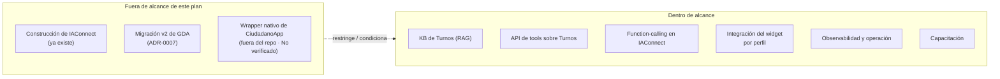
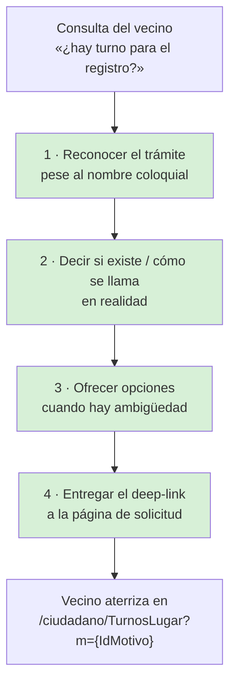
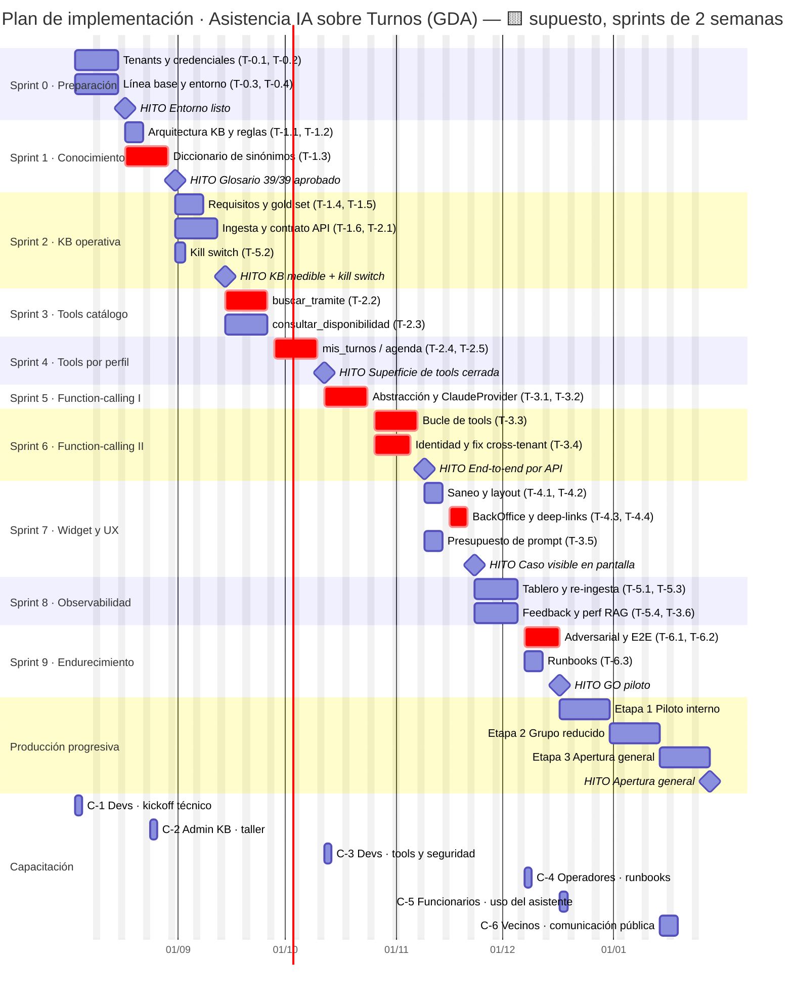
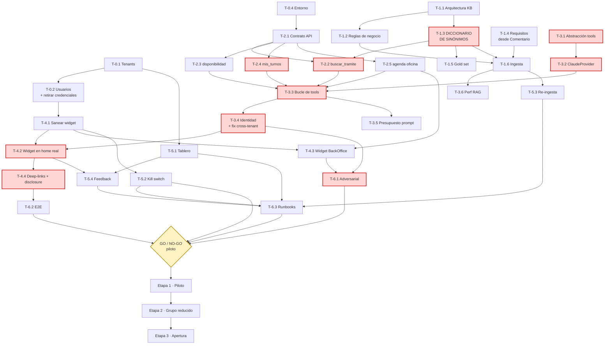
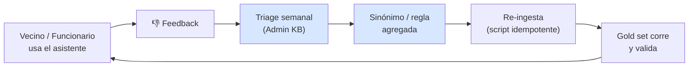
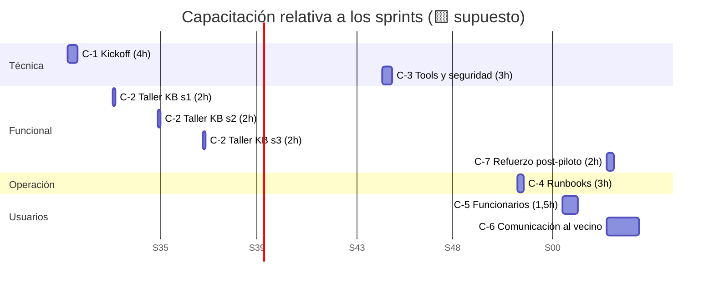
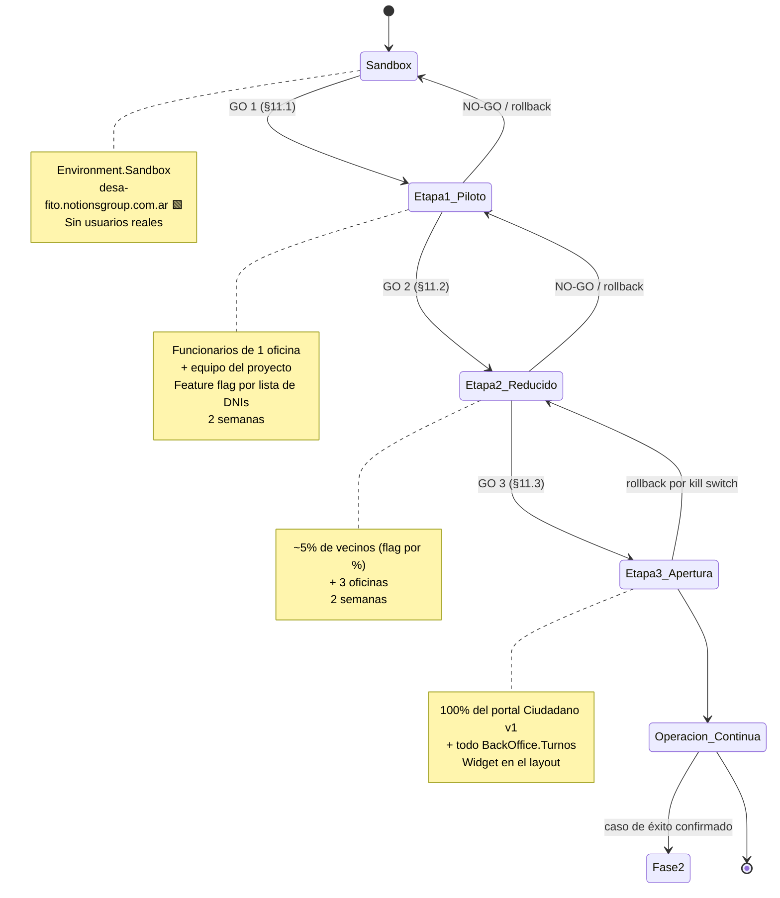
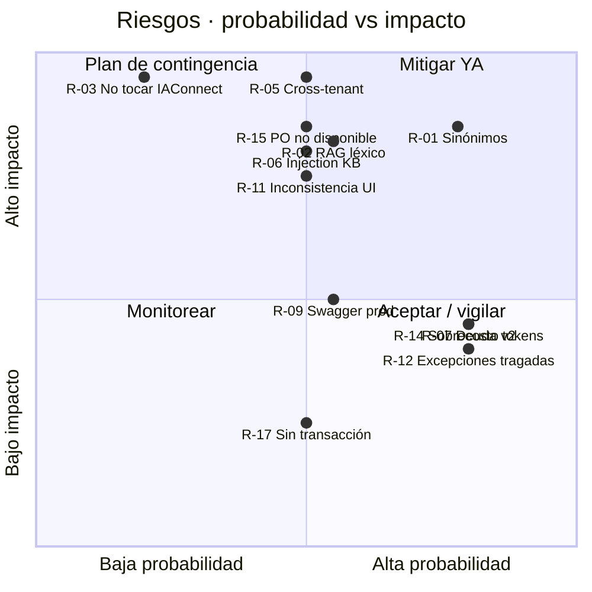

# 07 · Plan de tareas, sprints y capacitación — Asistencia IA sobre Turnos (GDA)

> **Propósito.** Convertir el diseño de los documentos hermanos de este bloque ([01-SAD](./01-SAD.md), [02-HLD](./02-HLD.md), [03-LLD](./03-LLD.md), [04-ADR](./04-ADR.md), [05-Operations-Guide](./05-Operations-Guide.md), [06-Administrator-Guide](./06-Administrator-Guide.md)) en un plan de ejecución accionable: backlog con descripciones de trabajo concreto, sprints con entregables demostrables, capacitación por audiencia, criterios de éxito medibles y puesta en producción progresiva.
>
> **Alcance.** El **primer caso de éxito**: asistencia conversacional sobre el dominio Turnos de GDA, para dos perfiles (ciudadano y funcionario), sobre el gateway ya existente Ng-IAServices/IAConnect. NO cubre la construcción de IAConnect (ver [../Ng-IAServices/01-SAD.md](../Ng-IAServices/01-SAD.md)) ni la migración v2 de GDA (ver `ADR-0007-migracion-v2.md` del repo GDA).
>
> **Audiencia.** Líder técnico, PO/responsable funcional de Turnos, equipo de desarrollo, administrador funcional de la KB, operaciones, responsable de capacitación.
>
> **Estado.** 🟨 **Propuesta de planificación** — no verificada contra ningún plan, contrato ni calendario existente en el repo. Todas las fechas, duraciones, estimaciones y composiciones de equipo de este documento son **supuestos declarados** (§1.3), no compromisos relevados. Lo que sí está verificado (🟩) es el **estado del código y de los datos** sobre el que el plan se apoya, citado en cada tarea y consolidado en §13.
>
> **Convención de marcas** (heredada de [Analisis-Asistencia-IA-ChatBotIA.md](../Antecedentes/Analisis-Asistencia-IA-ChatBotIA.md)):
> · 🟩 **hecho verificado en fuente** (con ruta `archivo:línea`)
> · 🟦 **práctica de industria establecida**
> · 🟨 **interpretación / inferencia / propuesta propia**

---

## Tabla de contenidos

1. [Introducción, alcance y supuestos de planificación](#1-introducción-alcance-y-supuestos-de-planificación)
2. [Estrategia de entrega y definición del MVP](#2-estrategia-de-entrega-y-definición-del-mvp)
3. [Backlog completo](#3-backlog-completo)
4. [Sprints](#4-sprints)
5. [Diagrama Gantt](#5-diagrama-gantt)
6. [Dependencias críticas y camino crítico](#6-dependencias-críticas-y-camino-crítico)
7. [Matriz RACI](#7-matriz-raci)
8. [Plan de capacitación](#8-plan-de-capacitación)
9. [Cronograma de capacitación relativo a los sprints](#9-cronograma-de-capacitación-relativo-a-los-sprints)
10. [Criterios de éxito del caso y su medición](#10-criterios-de-éxito-del-caso-y-su-medición)
11. [Plan de puesta en producción progresiva](#11-plan-de-puesta-en-producción-progresiva)
12. [Riesgos del plan y mitigaciones](#12-riesgos-del-plan-y-mitigaciones)
13. [Trazabilidad de evidencia](#13-trazabilidad-de-evidencia)

---

## 1. Introducción, alcance y supuestos de planificación

### 1.1 Por qué Turnos es el primer caso

🟩 El dominio Turnos reúne las cuatro condiciones que hacen viable un primer caso de éxito acotado:

| Condición | Evidencia |
|---|---|
| **Corpus finito y estable** | 14 tipos + 39 motivos + 37 oficinas; los requisitos ya están redactados en `lut_MotivosTurnos.Comentario` (varchar 3000) 🟩 `data-dictionary/turnos.md` |
| **Deep-links limpios ya existentes** | Todo el estado viaja por querystring: `/ciudadano/TurnosLugar?m={IdMotivo}` aterriza en el trámite con sus requisitos 🟩 `GDA.Core.Ciudadano/Components/Pages/Turnos/*.razor` (líneas `@page`) |
| **Widget ya integrado (PoC)** | `Fito.ChatWidget` 1.0.1 ya referenciado y montado en el portal 🟩 `GDA.Core.Ciudadano.csproj:45`, `Program.cs:26`, `Index.razor:128-134` |
| **Dolor real y verificable** | No existe reprogramación (grep "reprogram" = 0 hits 🟩); topes y penalizaciones con mensajes literales reutilizables 🟩 `TurnosService.cs:197-360` |

🟨 Y reúne la condición que lo hace **modélico**: dos audiencias con permisos radicalmente distintos (público vs. backoffice) sobre el **mismo** dominio. Resolver eso acá deja el patrón resuelto para las demás áreas.

### 1.2 Alcance de la planificación

### 1.3 Supuestos de planificación (🟨 TODOS — declarados, no relevados)

> ⚠️ **Ninguno de los siguientes valores está verificado en el repo.** Son los parámetros que hacen aritméticamente cerrado el plan. Si el equipo real difiere, **recalcular §4 y §5** antes de comprometer nada.

| # | Supuesto | Valor asumido | Impacto si cambia |
|---|---|---|---|
| S-01 | Duración de sprint | **2 semanas** (10 días hábiles) | Escala lineal el Gantt §5 |
| S-02 | Capacidad del equipo por sprint | **20 puntos de historia** | Reordena el corte MVP §2.3 |
| S-03 | Composición del equipo | 1 Líder técnico (50%), 2 Devs backend .NET (100%), 1 Dev frontend Blazor (50%), 1 Admin funcional de KB (30%), 1 QA (50%), 1 PO Turnos (20%) | Altera la RACI §7 |
| S-04 | Escala de estimación | Fibonacci relativo (1,2,3,5,8,13); **13 = obligación de partir** | — |
| S-05 | Ambientes disponibles | Existe `Environment.Sandbox` de IAConnect apuntando a `https://desa-fito.notionsgroup.com.ar` 🟩 `Index.razor.cs:59-77`; se asume 🟨 que existe además un ambiente productivo equivalente | Bloquea Sprint 0 |
| S-06 | Proveedor de IA del tenant | Claude (único provider con HttpClient nombrado, retry exponencial y multimodal completo 🟩 `AIProviderFactory.cs:17-31`, `ClaudeProvider.cs:187-216`) | Cambia T-3.4 y el costeo |
| S-07 | Se puede modificar IAConnect | Sí: el caso requiere agregar function-calling, que **hoy no existe en ninguna forma** 🟩 (grep `tool_use`/`tool_choice`/`function_call` = 0 hits) | Si NO → el MVP colapsa a solo-RAG (§2.4) |
| S-08 | Se puede agregar endpoints a `GDA.Core.API` | Sí. Hoy el único endpoint de turnos es `POST Turnos/ProcesarRecordatorios` **sin autenticación** 🟩 `ia-db/indexes/02_apis-servicios.md §1`; no hay API de consulta que sirva de tool | Si NO → tools irían por DataManager en proceso, cambiando E-2 entero |
| S-09 | El caso se despliega sobre **Ciudadano v1**, no v2 | v2 declara el widget como "Perdido por ahora" 🟩 `pieces/ciudadano-v2/README.md` | Agrega deuda de re-port (R-07) |
| S-10 | Disponibilidad del PO para validar el diccionario de sinónimos | 4 h/sprint | Bloquea T-1.3, la tarea de mayor riesgo funcional |

### 1.4 Los dos perfiles como eje transversal del plan

🟨 Toda épica del backlog se planifica **dos veces o explícitamente una sola vez con justificación**. La tabla siguiente fija el criterio:

| Dimensión | Ciudadano | Funcionario |
|---|---|---|
| App anfitriona | `GDA.Core.Ciudadano` (PathBase `/ciudadano`) + `GDA.Core.CiudadanoApp` (PathBase `/`) 🟩 | `GDA.Core.BackOffice.Turnos` 🟩 |
| Identidad | Cookie Vecino Digital; el identificador **es el DNI** (`decimal.Parse(_auth.Usuario)`) 🟩 `Turnos.razor.cs:33` | Cookie + JWT; claims SessionToken/Usuario/IsOficina/IdOficina 🟩 `AuthManagerTurnos.cs:120-135` |
| Roles | No hay | **No hay roles ni policies**; único discriminador `IsOficina` + oficina elegida en `/Oficina` 🟩 |
| Alcance de datos del asistente | **Solo sus propios turnos** (filtro duro por DNI de la sesión) 🟨 | Turnos **de su oficina** 🟨 |
| Rol en IAConnect | `operador` (corte por `TenantAccessFilter`) 🟨 | `operador` (tenant distinto) 🟨 |
| Tenant IAConnect | `gda-turnos-ciudadano` 🟨 propuesto | `gda-turnos-funcionario` 🟨 propuesto |

> 🟩 **Fundamento del tenant separado:** `lut_Tenants` define `System_Prompt` NOT NULL, `Nombre_Modelo`, `Temperatura`, `Max_Tokens` y `Mensaje_Bienvenida` **por tenant** (`scripts/01_create_database.sql:31-53`), y los fragmentos de KB se particionan por `Id_Tenant` (`IX_sys_Fragmentos_Conocimiento_Id_Tenant`). Dos tenants = dos prompts, dos KB y dos cortes de acceso, sin código condicional. Ver [01-SAD.md §9](./01-SAD.md#9-estrategia-de-identidad-y-autorización).

---

## 2. Estrategia de entrega y definición del MVP

### 2.1 Principio rector

🟨 **El MVP debe demostrar el caso textual del usuario y nada más:**

> *"Un ciudadano podría consultar si hay turno para un trámite específico y el chatbot le podría indicar que existe ese trámite o en realidad se llama diferente e indicarle opciones y posibles enlaces hacia la página de solicitud de turno."*

Descompuesto, eso son **exactamente cuatro capacidades**:

🟨 Nótese que **ninguna de las cuatro requiere escribir en la base de GDA**. El MVP es de **lectura y orientación**. Esto es deliberado: reduce el riesgo del primer caso a casi cero en términos de integridad de datos.

### 2.2 El corte: qué entra y qué no

| # | Capacidad | ¿MVP? | Criterio de la decisión |
|---|---|---|---|
| 1 | Responder "¿existe turno para X?" con desambiguación de nombre | ✅ **SÍ** | Es literalmente el caso pedido. |
| 2 | Entregar requisitos del trámite | ✅ **SÍ** | 🟩 Ya están en `lut_MotivosTurnos.Comentario`, renderizados con `MarkupString` en `TurnosLugar.razor.cs:33-34`. Coste marginal: es el mismo dato. |
| 3 | Deep-link a la página de solicitud | ✅ **SÍ** | 🟩 Las rutas existen y son estables por querystring. Cero desarrollo en GDA. |
| 4 | Responder reglas de negocio (topes, ausentismo, reserva de 5 min, no-reprogramación) | ✅ **SÍ** | 🟩 Los mensajes ya están redactados y son literales reutilizables (`TurnosService.cs:148-190, 197-360`). Es KB estática pura. |
| 5 | Tool `buscar_tramite` (catálogo dinámico) | ✅ **SÍ** | 🟨 Sin esto, el catálogo se congela en la KB y desincroniza en cuanto el PO da de alta un motivo. Es la diferencia entre demo y producto. |
| 6 | Tool `consultar_mis_turnos` (ciudadano) | ✅ **SÍ** | 🟨 🟩 El SP ya existe (`Dni_Vigente` en `SysTurnosDataManager.cs:14-140`). Alto valor, bajo costo. |
| 7 | Tool `consultar_agenda` (funcionario) | ✅ **SÍ** | 🟩 SP `Id_Oficina_Proximos` ya existe. Es la paridad mínima del segundo perfil. |
| 8 | **Sacar turno desde el chat** | ❌ **NO** | 🟨 Requiere replicar los 7 pasos de `EntregaTurnosComponent` + reserva de 5 min + `ValidarUsuario` + `Id_Incidente` NOT NULL. Riesgo de escritura alto, valor incremental bajo frente al deep-link. **Fase 2.** |
| 9 | **Cancelar turno desde el chat** | ❌ **NO** | 🟨 Acción destructiva e irreversible. Se deriva a `/TurnoDetalle?Id=`. **Fase 2**, y solo con doble confirmación. |
| 10 | **Marcar presente / anular (funcionario)** | ❌ **NO** | 🟩 `update_Atender` es **irreversible** por diseño («Una vez realizado no podrás anular el presentismo» `Agenda.razor:114,279,329`). No se pone una acción irreversible detrás de un LLM en el primer caso. |
| 11 | RAG semántico (embeddings) | ❌ **NO** | 🟩 El RAG hoy es **léxico TF-IDF puro**: `VectorEmbedding = null` siempre (`KnowledgeService.cs:75`) y `SerializeEmbedding` es código muerto (`RAGEngine.cs:122-127`). Migrar a embeddings es un proyecto de IAConnect, no de este caso. **Se mitiga con el diccionario de sinónimos (T-1.3), que es más barato y más auditable.** |
| 12 | Imágenes / multimodal | ❌ **NO** | 🟨 Sin caso de uso en Turnos. `PermiteImagenes=0` (default 🟩 `Tenant.cs:3-24`). |
| 13 | Widget en `CiudadanoApp` | ❌ **NO** (Fase 2) | 🟩 Cookie **SameSite=Strict** (vs Lax en portal) + wrapper nativo fuera del repo (No verificado). Demasiada incógnita para el MVP. |
| 14 | Widget en Ciudadano **v2** | ❌ **NO** (deuda declarada) | 🟩 v2 declara `Fito.ChatWidget` como "Perdido por ahora". |

### 2.3 Balance de puntos del corte

| Épica | Puntos | ¿MVP? |
|---|---:|:---:|
| E-0 · Preparación | 13 | ✅ |
| E-1 · Conocimiento (KB + sinónimos) | 29 | ✅ |
| E-2 · API de tools sobre GDA | 34 | ✅ |
| E-3 · Function-calling en IAConnect | 31 | ✅ |
| E-4 · Integración del widget por perfil | 26 | ✅ |
| E-5 · Observabilidad y operación | 21 | ✅ |
| E-6 · Endurecimiento y piloto | 18 | ✅ |
| **Total MVP** | **172** | |
| E-7 · Fase 2 (acciones transaccionales, app, v2) | ~55 | ❌ |

🟨 Con S-02 (20 pts/sprint) → **172 / 20 ≈ 8,6 → 9 sprints** incluyendo Sprint 0. Con S-01 (2 semanas) → **~18 semanas ≈ 4,5 meses** hasta apertura general. Ver §5.

### 2.4 Plan de contingencia si S-07 cae (no se puede tocar IAConnect)

🟨 Si la organización no habilita modificar IAConnect para agregar function-calling, el caso **no se cancela**: degrada a un MVP **solo-RAG** que aún cumple las 4 capacidades de §2.1, con estas consecuencias:

- E-2 y E-3 salen del alcance (−65 pts → **~107 pts ≈ 6 sprints**).
- El catálogo de 39 motivos se **congela en la KB** y requiere re-ingesta manual ante cada alta (procedimiento en [05-Operations-Guide.md §8](./05-Operations-Guide.md#8-actualización-de-la-kb-en-producción)).
- Se pierden "mis turnos" y "agenda del día": el asistente pasa a ser **puramente informativo**.
- ⚠️ La re-ingesta **duplica fragmentos**: 🟩 `UploadDocumentAsync` no borra lo previo, no hay dedupe por `Documento_Origen` (`KnowledgeService.cs:34-101`). El procedimiento DELETE→POST de T-5.3 pasa de deseable a **obligatorio**.

---

## 3. Backlog completo

> **Cómo leer esta tabla.** `Est.` = puntos Fibonacci (S-04). `Dep.` = IDs predecesores. La columna **Fundamento** apunta al documento y sección que justifica la tarea — si una tarea no tiene fundamento, no debería estar en el backlog.
> Roles: **LT** líder técnico · **BE** dev backend · **FE** dev frontend · **KB** admin funcional de KB · **QA** · **PO** product owner Turnos · **OPS**.

### 3.1 Épica E-0 · Preparación y línea base (13 pts)

| ID | Título | Descripción del trabajo concreto | Rol | Est. | Dep. | Criterios de aceptación verificables | Fundamento |
|---|---|---|---|---:|---|---|---|
| **T-0.1** | Alta de los dos tenants en IAConnect | Insertar dos filas en `lut_Tenants` vía `POST /api/tenants`: `gda-turnos-ciudadano` y `gda-turnos-funcionario`. Definir para cada uno `Proveedor_IA='claude'`, `Nombre_Modelo`, `Temperatura` (baja, 0.2–0.3, para reducir alucinación en dominio factual), `Max_Tokens`, `Permite_Imagenes=0`, `Mensaje_Bienvenida` distinto por perfil, y `System_Prompt` inicial. La `ApiKey_IA` se carga cifrada, **nunca en el repo**. Registrar los `Access_Token_Expiracion_Minutos` / `Refresh_Token_Expiracion_Dias` acordados. | LT+OPS | 3 | — | (a) `GET /api/tenants/gda-turnos-ciudadano` → 200 con `Activo=1`; (b) ídem funcionario; (c) `POST /api/ai/gda-turnos-ciudadano/chat` responde 200 con KB vacía; (d) `grep` del repo por la ApiKey → 0 hits. | [../Ng-IAServices/06-Administrator-Guide.md](../Ng-IAServices/06-Administrator-Guide.md) · 🟩 DDL `lut_Tenants` `scripts/01_create_database.sql:31-53` |
| **T-0.2** | Crear los usuarios `operador` por tenant y retirar las credenciales hardcodeadas | Crear en `sys_Usuarios` un usuario `operador` por tenant con `Id_Tenant` seteado (el `TenantAccessFilter` exige `claim id_tenant == route tenantId` para no-admin). **Eliminar** de `Index.razor.cs:71-76` el par `admin_iaconnect` / `Admin.Demo.2026!` y moverlo a configuración protegida. Documentar el incidente de credenciales versionadas y rotar la clave del usuario admin expuesto. | LT+OPS | 5 | T-0.1 | (a) `grep -rn "Admin.Demo.2026" GDA.Core/` → **0 hits**; (b) la clave anterior de `admin_iaconnect` ya no autentica (rotada); (c) un JWT de `gda-turnos-ciudadano` contra `/api/ai/gda-turnos-funcionario/chat` → **403**; (d) issue de seguridad registrado y cerrado. | 🟩 **Riesgo verificado**: credenciales versionadas en `GDA.Core.Ciudadano/Components/Pages/Index.razor.cs:71-76` · [01-SAD.md §10](./01-SAD.md#10-seguridad--owasp-llm-aplicado-a-este-caso) |
| **T-0.3** | Línea base de métricas pre-asistente | Extraer de `sys_Turnos` la línea base contra la que se medirá el éxito: turnos/día por motivo, tasa de ausentismo (`Fecha_Atendido` nula sobre `Tomado=1` con `Fecha` pasada), distribución por `Id_Canal`. Sin esto, §10 no es medible. | QA+PO | 3 | — | (a) Planilla con 3 meses de histórico por motivo; (b) tasa de ausentismo basal publicada con su consulta SQL; (c) PO firma la línea base. | 🟩 `sys_Turnos.Fecha_Atendido`, `Id_Canal` (`data-dictionary/turnos.md`) · §10 |
| **T-0.4** | Entorno de desarrollo reproducible | Levantar IAConnect local (`DataEntityCore.Configure(GetConnectionString("IAConnect"))` 🟩 `Program.cs:22`) + GDA.Core.Ciudadano apuntando a un IAConnect de desarrollo. Documentar el `appsettings` mínimo. Swagger ya está habilitado en todos los entornos 🟩 (`Program.cs:133`), lo que facilita la exploración — **anotar como riesgo de exposición para producción (R-09)**. | BE | 2 | — | (a) Un dev nuevo levanta ambos en < 1 h siguiendo el README; (b) `/health` responde 200; (c) chat end-to-end local OK. | [../Ng-IAServices/05-Operations-Guide.md](../Ng-IAServices/05-Operations-Guide.md) |

### 3.2 Épica E-1 · Conocimiento: KB y vocabulario (29 pts)

| ID | Título | Descripción del trabajo concreto | Rol | Est. | Dep. | Criterios de aceptación verificables | Fundamento |
|---|---|---|---|---:|---|---|---|
| **T-1.1** | Definir la arquitectura de documentos de la KB | Decidir la granularidad y el `Documento_Origen` de cada archivo. 🟨 Propuesta: `reglas-negocio-turnos.md`, `faq-ciudadano.md`, `faq-funcionario.md`, `glosario-tramites.md`, `procedimientos-funcionario.md`. Regla dura de granularidad: **un documento = un `Documento_Origen` = una unidad de re-ingesta**, porque el borrado y la recarga operan a ese nivel. Dimensionar contra el chunking real: `ChunkSizeTokens=400` / `OverlapTokens=50` **son palabras, no tokens** (`text.Split(' ','\n','\r','\t')`), paso de 350 palabras. | LT+KB | 3 | — | (a) Manifiesto de documentos aprobado con `Documento_Origen` de cada uno; (b) para cada doc, estimación de fragmentos = `ceil((palabras−400)/350)+1`; (c) suma total de fragmentos del tenant documentada (entra en el presupuesto de §T-3.5). | 🟩 `KnowledgeService.cs:16-17,103-121` · [02-HLD.md §11](./02-HLD.md#11-arquitectura-de-conocimiento-del-caso) |
| **T-1.2** | Redactar `reglas-negocio-turnos.md` | Documento de reglas duras, con los **textos literales del sistema** para que la respuesta del asistente coincida con lo que el vecino verá en pantalla: reserva blanda de 5 minutos («Otro usuario esta reservando este turno. Volvé mas tarde o elegí otro.»), turno pasado, turno tomado, tope por período («No podes sacar mas de {n} turnos en el período de {d} días.»), penalización por ausentismo, y **la no-existencia de reprogramación** como respuesta canónica. Incluir que el funcionario **tampoco** puede saltear los topes. | KB+PO | 5 | T-1.1 | (a) Cada regla del doc cita su origen `archivo:línea`; (b) los 4 mensajes de `ValidarTurnoDisponible` transcritos literalmente; (c) revisión del PO con acta; (d) 0 afirmaciones sin fuente. | 🟩 `TurnosService.cs:148-190` (mensajes), `:197-278` (ciudadano), `:280-360` (funcionario) · 🟩 grep "reprogram" = 0 hits |
| **T-1.3** | **Construir el diccionario de sinónimos de trámites** ⚠️ *tarea de mayor riesgo funcional* | 🟩 **No existe ninguna tabla ni columna de alias, sinónimos, keywords o etiquetas en el área turnos** — verificado por grep sobre los 27 archivos del diccionario de datos; el único nombre es `Descripcion`. Por lo tanto: (1) exportar los 39 `lut_MotivosTurnos.Descripcion` + 14 tipos; (2) para cada motivo, redactar con el PO y con personal de mesa de entradas **el listado de nombres coloquiales reales** («el registro», «la libreta», «carnet de conducir» → «Licencia de Conducir»); (3) generar `glosario-tramites.md` con un bloque por motivo que incluya `Id_Motivo`, `Descripcion` exacta, sinónimos, y el deep-link; (4) **normalizar acentos**: los datos van sin tildes («Clinica Medica», no «Clínica Médica») y el recuperador TF-IDF **descarta tokens de longitud ≤ 2 y ~57 stop-words es / 11 en**, por lo que sinónimos de una o dos letras no se recuperan nunca. | KB+PO | 13 | T-1.1 | (a) Los **39** motivos cubiertos, sin excepción; (b) ≥ 3 sinónimos por motivo; (c) toda entrada con y sin tildes; (d) ningún sinónimo con tokens útiles de ≤ 2 chars ni compuesto solo de stop-words; (e) **banco de 60 consultas coloquiales** (§T-1.5) resuelto al motivo correcto ≥ 90 %. | 🟩 grep alias/sinonim/keyword/etiqueta/tag en `docs/03-data/data-dictionary/` → 0 hits en `turnos.md` · 🟩 nombres sin tildes en `01-sacar-turno-licencia-conducir-restaurando-usuario.spec.ts:11,55` · 🟩 stop-words y filtro ≤2 en `RAGEngine.cs:14-24` · [02-HLD.md §7](./02-HLD.md#7-diseño-de-la-desambiguación) |
| **T-1.4** | Extraer y sanear los requisitos desde `Comentario` | 🟩 `lut_MotivosTurnos.Comentario` es **HTML crudo** renderizado con `new MarkupString(...)` y visible solo si `MostrarComentario=1`. Escribir un extractor que convierta ese HTML a texto plano/markdown apto para la KB, **preservando listas** (son los papeles a llevar). Decidir y documentar el tratamiento de los motivos con `MostrarComentario=0`. ⚠️ El HTML sin sanear que entra al prompt es superficie de **prompt-injection**: 🟩 `PromptBuilder` no escapa nada — emite `Fragmento N: "{Contenido}"` entre comillas dobles sin escapado, de modo que un contenido con `[CONSULTA DEL USUARIO]` o comillas puede romper los límites del prompt. | BE+KB | 5 | T-1.1 | (a) Los 39 `Comentario` convertidos, con listas intactas; (b) test unitario del sanitizador que **neutraliza** las cadenas `[CONTEXTO RELEVANTE]`, `[HISTORIAL DE CONVERSACIÓN]`, `[CONSULTA DEL USUARIO]` y comillas dobles; (c) los motivos con `MostrarComentario=0` marcados y con política escrita. | 🟩 `TurnosLugar.razor.cs:33-34`, `EntregaTurnosComponent.razor:943` · 🟩 `PromptBuilder.cs:10-55` · [01-SAD.md §10](./01-SAD.md#10-seguridad--owasp-llm-aplicado-a-este-caso) |
| **T-1.5** | Banco de evaluación de recuperación (gold set) | Construir el set de verdad contra el que se mide la KB: 60 consultas coloquiales de ciudadano + 25 de funcionario, cada una con su respuesta esperada (motivo, deep-link, fragmentos que deberían recuperarse). Automatizar la ejecución contra `/api/ai/{tenant}/chat` y reportar acierto top-1 y top-5. Es el **quality gate** de toda la épica. | QA+KB | 3 | T-1.3 | (a) 85 casos versionados; (b) runner ejecutable en CI con un comando; (c) reporte con acierto top-1/top-5 por perfil. | [05-Operations-Guide.md §5](./05-Operations-Guide.md#5-verificación-funcional-banco-de-smoke-test) |
| **T-1.6** | Ingesta inicial y verificación de fragmentos | Subir cada `.md` por `POST /api/tenants/{tenantId}/knowledge` (rol **admin** requerido) para ambos tenants. ⚠️ Verificar el conteo resultante contra el manifiesto de T-1.1: **no hay borrado previo ni dedupe**, y recargar duplica fragmentos. Formatos aceptados: `.pdf` (PdfPig), `.txt`, `.md`, `.html/.htm`, `.csv`; cualquier otro → `ArgumentException` → 400. | KB | 3 | T-1.2, T-1.3, T-1.4 | (a) Conteo real de fragmentos por `Documento_Origen` == estimado ±10 %; (b) el gold set T-1.5 corre y reporta; (c) **cero duplicados**: `SELECT Documento_Origen, Indice_Fragmento, COUNT(*) ... HAVING COUNT(*)>1` → 0 filas. | 🟩 `KnowledgeService.cs:34-101` · 🟩 `KnowledgeController` `[Authorize(Roles="admin")]` · [05-Operations-Guide.md §8](./05-Operations-Guide.md#8-actualización-de-la-kb-en-producción) |

### 3.3 Épica E-2 · API de tools sobre GDA.Core (34 pts)

> 🟩 **Premisa de la épica.** El único endpoint REST de turnos hoy es `POST Turnos/ProcesarRecordatorios`, **sin autenticación**, que solo dispara notificaciones. **No existe API de consulta/alta/cancelación** que sirva de tool: hay que construirla. Y `GDA.Core.API.Client` no es un cliente REST real. Fundamento: `ia-db/indexes/02_apis-servicios.md §1`.

| ID | Título | Descripción del trabajo concreto | Rol | Est. | Dep. | Criterios de aceptación verificables | Fundamento |
|---|---|---|---|---:|---|---|---|
| **T-2.1** | Diseñar el contrato de la API de asistencia | Definir un controlador nuevo (🟨 propuesta: `AsistenteTurnosController`) con contrato **estable, versionado y pensado para consumo por LLM**: respuestas planas, campos autoexplicativos, sin HTML, sin nulls ambiguos, y con el deep-link ya armado del lado servidor (nunca lo construye el modelo). Definir la política de auth: 🟩 la API usa JWT Bearer con clave derivada de `"secret".Sha256()` hardcodeada, `ValidateIssuer=false`, `ValidateAudience=false`, claim `guid` obligatorio, `[ScopeAuthorize("gda"\|"gdi")]` y `[RateLimit(60,60)]`. ⚠️ **`ScopeAuthorize` responde HTTP 200 con el código de error en el body** — el cliente de tools no puede confiar en el status code: hay que inspeccionar el body. Documentarlo como restricción dura. | LT+BE | 5 | T-0.4 | (a) OpenAPI del controlador revisado y aprobado; (b) ADR que fija la política de auth y **reconoce explícitamente** la anomalía de `ScopeAuthorize`; (c) ningún endpoint sin `[Authorize]`. | 🟩 `ia-db/indexes/02_apis-servicios.md §1 (Seguridad) y §3` · [04-ADR.md](./04-ADR.md) |
| **T-2.2** | Tool `buscar_tramite` | Endpoint de búsqueda de motivos: entrada texto libre + opcional `idTipoTurno`; salida lista de `{ idMotivo, descripcion, idTipoTurno, tieneRequisitos, deepLinkCiudadano }`. Debe respetar la **visibilidad real**: solo tipos con turnos cargados (`GetListBy_TiposConTurnos()`) y solo motivos activos del tipo (`GetListBy_Id_TipoTurno_ActivoAsync(id, true)`), y excluir oficinas con `Interno=1`. Matching servidor: normalización de acentos + `LIKE` sobre `Descripcion` + cruce contra el diccionario de sinónimos de T-1.3. | BE | 8 | T-2.1, T-1.3 | (a) Un motivo `Activo=0` **nunca** aparece; (b) un tipo sin turnos cargados nunca aparece; (c) «clínica médica» **con** tildes matchea «Clinica Medica»; (d) tests unitarios de normalización; (e) p95 < 300 ms. | 🟩 `TurnosTipo.razor.cs:11`, `TurnosMotivo.razor.cs:26` · 🟩 `lut_Oficinas_Turnos.Interno` (`data-dictionary/turnos.md`) · [03-LLD.md §2.4](./03-LLD.md#24-el-catálogo-de-trámites-y-el-problema-del-vocabulario) |
| **T-2.3** | Tool `consultar_disponibilidad` | Endpoint que responde "¿hay turnos para el motivo M?": dado `idMotivo` (+ opcional `idOficina`), devolver por oficina el próximo día con cupo y la cantidad de slots libres dentro del horizonte visible. Debe respetar los parámetros de política de la oficina: `Cantidad_Dias_Proximos` (horizonte), `Web_Inicio`/`Web_Fin` (ventana del canal web), `MaximoPublico`, `Turnos_Por_dia_Persona`. Reusar `Id_Oficina_Proximos`. ⚠️ 🟨 `lut_Oficinas_Turnos_Disponibilidad` está **vacía (0 filas)**: el mecanismo existe pero no se usa hoy — **no implementar sobre ella**. | BE | 8 | T-2.1 | (a) La respuesta nunca excede `Cantidad_Dias_Proximos`; (b) fuera de `Web_Inicio`/`Web_Fin` responde el motivo del cierre, no una lista vacía muda; (c) las oficinas `Interno=1` no se listan; (d) test contra el fixture `turnos.seed.yaml`. | 🟩 `lut_Oficinas_Turnos` (`data-dictionary/turnos.md`) · 🟩 `SysTurnosDataManager.cs:14-140` · 🟩 fixture `docs/03-data/fixtures/turnos.seed.yaml` |
| **T-2.4** | Tool `consultar_mis_turnos` (ciudadano) | Endpoint que devuelve los turnos vigentes del **DNI de la sesión**: `{ idTurno, fecha, motivo, oficina, estadoDerivado, deepLinkDetalle }`. 🟩 El estado **no es una columna**: se deriva (`Tomado=0`+`Fecha_Reserva` nula → LIBRE; `Tomado=1` → TOMADO; `Fecha_Atendido` no nula → ATENDIDO; `Fecha < now` → PASADO). Implementar el derivador **una sola vez** y compartirlo. ⚠️ **El DNI se toma del claim de la sesión, jamás de un parámetro** que el LLM pueda inventar. Reusar el SP `Dni_Vigente`. | BE | 8 | T-2.1 | (a) El endpoint **ignora** cualquier DNI enviado en el body/query y usa solo el claim; (b) test negativo: pedir turnos de otro DNI → devuelve los propios o 403, nunca los ajenos; (c) los 5 estados derivados cubiertos por tests; (d) `deepLinkDetalle` emitido exactamente como `TurnoDetalle?Id={id}`. | 🟩 `TurnosService.cs:137-195`, `SysTurnosDataManager.cs:35-88` · 🟩 identificador = DNI: `Turnos.razor.cs:33` · 🟩 casing de query params: `TurnoDetalle.razor.cs:38-41` |
| **T-2.5** | Tool `consultar_agenda_oficina` (funcionario) | Endpoint que devuelve la agenda del día de **la oficina de la sesión**: turnos del día con estado derivado y contadores (total / atendidos / ausentes). 🟩 El corte de alcance es `IdOficina` del claim de `AuthManagerTurnos` — **no hay roles ni policies**, el único discriminador es `IsOficina` + la oficina elegida en `/Oficina`. Solo lectura: sin `Anular`, sin `Atender`. | BE | 5 | T-2.1 | (a) El `idOficina` proviene **solo** del claim; (b) test negativo: pedir agenda de otra oficina → 403; (c) los contadores coinciden con lo que muestra `/Agenda` para la misma fecha; (d) `grep` del controlador por `Anular`/`Atender` → 0 hits. | 🟩 `AuthManagerTurnos.cs:120-135` · 🟩 `Agenda.razor.cs:146-250` · [01-SAD.md §9](./01-SAD.md#9-estrategia-de-identidad-y-autorización) |

### 3.4 Épica E-3 · Function-calling en IAConnect (31 pts)

> 🟩 **Premisa de la épica.** **No existe function-calling/tools en ninguna forma** en IAConnect — verificado por grep sobre `tool_use` / `tool_choice` / `function_call` en todo el código. Es el principal punto de extensión y **el mayor aporte reusable de este caso al producto**: lo que se construya acá lo hereda toda área futura.

| ID | Título | Descripción del trabajo concreto | Rol | Est. | Dep. | Criterios de aceptación verificables | Fundamento |
|---|---|---|---|---:|---|---|---|
| **T-3.1** | Abstracción de tools en `IAConnect.Domain` | Extender `IAIProvider` y sus DTOs para transportar herramientas. 🟩 Hoy `IAIProvider` declara 5 métodos (`ChatAsync`/`CompleteAsync`/`AnalyzeAsync`/`SummarizeAsync`/`ImproveAsync` → `Task<AIResponse>`) y define los 6 DTOs en el mismo archivo. Agregar `ToolDefinition{Name, Description, JsonSchema}`, `ToolCall{Id, Name, ArgumentsJson}` y `ToolResult{CallId, ResultJson, IsError}`; sumar `Tools` a `ChatRequest` y `ToolCalls` a `AIResponse`. ⚠️ Aprovechar para cerrar un hueco verificado: **`AIResponse` no expone el modelo usado ni la latencia**. | LT+BE | 5 | — | (a) La solución compila sin tocar los 3 providers existentes (default vacío); (b) tests de contrato del Domain verdes; (c) `AIResponse.ModelUsed` agregado y poblado; (d) **la regla de dependencia se mantiene**: Domain no referencia a nadie. | 🟩 `IAConnect.Domain/Interfaces/IAIProvider.cs:5-71` · 🟩 Clean Architecture `Program.cs:1-17` · [../Ng-IAServices/03-LLD.md](../Ng-IAServices/03-LLD.md) |
| **T-3.2** | Implementar tools en `ClaudeProvider` | Serializar `Tools` al campo `tools` del payload de `v1/messages` y parsear los bloques `tool_use` de la respuesta. 🟩 Contexto verificado: POST relativo `v1/messages` sobre BaseAddress `https://api.anthropic.com/`, headers `x-api-key` + `anthropic-version: 2023-06-01`, `JsonSerializerOptions` con SnakeCaseLower + IgnoreWhenWritingNull, retry propio de 3 intentos con backoff `2^(n-1)` s sobre {429, 502, 503, 504}. `ParseResponse` hoy extrae `content[0].text` — **debe pasar a recorrer el array `content` completo**, porque con tools el primer bloque puede no ser texto. | BE | 8 | T-3.1 | (a) `content` recorrido entero: un `tool_use` en posición 0 se parsea bien; (b) `stop_reason == "tool_use"` detectado; (c) test con `HttpMessageHandler` fake cubriendo respuesta mixta texto+tool; (d) el retry sigue funcionando sobre los 4 status transitorios; (e) los otros 2 providers siguen compilando y pasando sus tests. | 🟩 `ClaudeProvider.cs:175-243`, `:124-134,183` · 🟩 `AIProviderFactory.cs:17-31` |
| **T-3.3** | Bucle de orquestación de tools en `ChatService` | Insertar el ciclo tool_use → ejecutar → tool_result → re-llamar dentro de la secuencia de 10 pasos hoy verificada de `ChatService` (Stopwatch → tenant → sesión → historial → validar imagen → RAG → PromptBuilder → provider → stop → persistir). Requisitos duros: **límite de iteraciones** (🟨 máx. 3) para cortar bucles; **timeout por tool**; y si la tool falla, degradar a respuesta textual con hand-off, nunca romper. ⚠️ Reubicar el `Stopwatch`: hoy se detiene **antes** de persistir y por lo tanto mide solo la latencia del proveedor, no la del request; con tools mediría aún menos. | BE | 13 | T-3.2, T-2.2..T-2.5 | (a) Test: 2 tool-calls encadenadas resueltas en una respuesta; (b) test: 4ª iteración → corta con mensaje de hand-off; (c) test: tool que devuelve 500 → respuesta degradada, sin excepción al cliente; (d) `Duracion_Ms` incluye el tiempo de tools; (e) la métrica registra la cantidad de tool-calls. | 🟩 `ChatService.cs:46-189`, `:118,152-168` · [03-LLD.md](./03-LLD.md) |
| **T-3.4** | Propagación de identidad del usuario final hacia las tools | 🟩 **Riesgo verificado y bloqueante:** `ChatService` **no valida la sesión contra el tenant** — si un GUID de sesión de otro tenant parsea OK, se reutiliza (posible fuga cross-tenant del historial). Trabajo: (1) **corregir** eso validando `sesion.IdTenant == tenantId`; (2) transportar la identidad del usuario final (DNI del vecino / oficina del funcionario) desde el widget hasta el ejecutor de tools, **fuera del prompt** (el modelo nunca la ve ni la puede alterar); (3) el ejecutor arma el JWT de `GDA.Core.API` con esa identidad. 🟩 `sys_Sesiones.Id_Usuario_Externo` ya existe y `ChatService` lo puebla con `userId.ToString()` — es el canal natural. | LT+BE | 8 | T-3.3 | (a) Test: sesión de tenant A usada desde tenant B → **rechazada**; (b) test: prompt que pide «consultá los turnos del DNI 12345678» → la tool se ejecuta con el DNI de la sesión, no con el inyectado; (c) el DNI no aparece en `sys_Mensajes.Contenido` salvo que el usuario lo haya escrito; (d) revisión de seguridad firmada. | 🟩 `ChatService.cs:46-189` (sesión no validada contra tenant) · 🟩 `sys_Sesiones.Id_Usuario_Externo` (`scripts/01_create_database.sql:58-196`) · [01-SAD.md §9-10](./01-SAD.md#9-estrategia-de-identidad-y-autorización) |
| **T-3.5** | Optimización del presupuesto de prompt | 🟩 **Defecto verificado:** `ChatService.cs:102` pasa `history` a `BuildSystemPromptAsync` (que lo embebe como texto bajo `[HISTORIAL DE CONVERSACIÓN]`) **y** `ChatService.cs:112` vuelve a pasar el **mismo** `history` como `ConversationHistory`, que `ClaudeProvider.BuildMessages` emite como mensajes reales (`:124-134`) mientras el system prompt viaja en `system` (`:183`). **Cada turno previo se envía dos veces**: duplica el costo de tokens del historial y puede degradar la coherencia. Trabajo: eliminar una de las dos vías (🟨 conservar `ConversationHistory`, que es el canal nativo del proveedor) y medir el ahorro. Complementar con el sizing de contexto: 400 palabras/chunk × topK=5 ≈ 2.600–3.000 tokens solo de RAG. | BE | 5 | T-3.3 | (a) Test que verifica que el historial aparece **una sola vez** en el payload; (b) medición antes/después de `Tokens_Prompt` sobre el gold set: **reducción ≥ 25 %** en conversaciones de ≥ 4 turnos; (c) el gold set T-1.5 no se degrada. | 🟩 `ChatService.cs:102,112` + `ClaudeProvider.cs:124-134,183` · 🟩 `KnowledgeService.cs:16-17,103-121`, `RAGEngine.cs:34-120` |
| **T-3.6** | Rendimiento del recuperador para el tenant de Turnos | 🟩 **Riesgo verificado:** `SearchRelevantChunksAsync` hace `GetListByIdTenantAsync(tenantId)` — trae **todos** los fragmentos del tenant a memoria y los re-tokeniza **en cada request** (O(N·M), sin paginación ni caché). Trabajo: medir con el corpus real de T-1.6 y, si p95 > umbral, introducir una caché en memoria del corpus tokenizado por tenant con invalidación al re-ingestar. **No** migrar a embeddings (fuera de MVP, §2.2 #11). | BE | 5 | T-1.6, T-0.4 | (a) Benchmark publicado con el corpus real (N fragmentos reales, no sintético); (b) p95 de recuperación < 200 ms; (c) si hay caché, test de invalidación tras `POST /knowledge`; (d) el gold set no se degrada. | 🟩 `RAGEngine.cs:34-120` · [../Ng-IAServices/04-ADR.md](../Ng-IAServices/04-ADR.md) |

### 3.5 Épica E-4 · Integración del widget por perfil (26 pts)

| ID | Título | Descripción del trabajo concreto | Rol | Est. | Dep. | Criterios de aceptación verificables | Fundamento |
|---|---|---|---|---:|---|---|---|
| **T-4.1** | Sanear la integración actual del widget en Ciudadano | 🟩 Estado verificado: `Fito.ChatWidget` 1.0.1 (`IAConnect.ChatWidget`) referenciado **solo** en `GDA.Core.Ciudadano.csproj:45`, registrado con `AddIAConnectChatWidget()` en `Program.cs:26`, renderizado en `Index.razor:128-134` con `TenantId="demo-asistente-general"`, `Environment=Sandbox`, credenciales hardcodeadas y **gateado por `@if (_auth.Usuario == "30886698")`** (un solo DNI). Trabajo: reemplazar el gate por DNI por un **feature flag configurable** (parámetro LUT o `appsettings`) que habilite por lista de DNIs o por porcentaje; cambiar `TenantId` a `gda-turnos-ciudadano`; mover credenciales a configuración; y elegir `Environment` por entorno. | FE+BE | 5 | T-0.1, T-0.2 | (a) `grep "30886698"` → 0 hits; (b) `grep "demo-asistente-general"` → 0 hits; (c) el flag apagado ⇒ el widget no renderiza **ni emite requests**; (d) el flag prende para un DNI de prueba sin redeploy. | 🟩 `Index.razor:126,128-134`, `Index.razor.cs:59-77`, `Program.cs:9,26`, `.csproj:45` |
| **T-4.2** | Mover el widget a la home real del portal | 🟩 **Hallazgo de integración:** el widget está en `Index.razor` (que sirve `/Index`), pero **la home real es `Index2.razor` (`@page "/"`)**, que no lo renderiza. Es decir: hoy el widget está en una página que casi nadie visita. Trabajo: montar el widget en el **layout** (no en una página) para que acompañe toda la navegación de turnos, y verificar que no rompe el layout móvil ni las páginas de turnos. | FE | 5 | T-4.1 | (a) El widget aparece en `/`, `/Turnos`, `/TurnosLugar` y `/Turno`; (b) no se re-monta al navegar (la sesión de chat sobrevive); (c) sin regresiones visuales en las 8 rutas de turnos del portal; (d) probado en viewport móvil. | 🟩 `pieces/ciudadano/README.md §Mapa de rutas` («`/` (`Index2.razor`), `/Index`») |
| **T-4.3** | Integrar el widget en `BackOffice.Turnos` | 🟩 El paquete **no está referenciado en ninguna otra app** de la solución: hay que agregar la `PackageReference`, el `AddIAConnectChatWidget()` y el render con `TenantId="gda-turnos-funcionario"`. La sesión se arma con los claims de `AuthManagerTurnos` (SessionToken, Usuario, IsOficina, IdOficina). ⚠️ El widget **no debe renderizar antes de que la oficina esté elegida**, porque el alcance de las tools depende de `IdOficina` — y elegir oficina en `/Oficina` es obligatorio tras el login. | FE+BE | 8 | T-4.1, T-2.5 | (a) El widget no aparece en `/Login` ni en `/Oficina`; (b) sí aparece en `/Agenda`, `/Turno`, `/BuscarCiudadano`; (c) cambiar de oficina en `/Oficina` **reinicia** la sesión de chat; (d) las `data-testid` existentes no se alteran. | 🟩 `AuthManagerTurnos.cs:120-135` · 🟩 `pieces/backoffice-turnos/README.md` · 🟩 testids en `constants/testids.ts:25` |
| **T-4.4** | Renderizado de deep-links y disclosure de alcance | Implementar en el widget: (1) render de los links que devuelve el asistente como **botones de acción** clicables, no como URL cruda; (2) **disclosure de alcance** al abrir el chat — declarar qué puede y qué no puede hacer el asistente antes de que el usuario pregunte (patrón observado en el antecedente de Mercado Libre); (3) **divulgación progresiva**: primero la respuesta corta, el detalle bajo demanda. ⚠️ Los links deben emitirse **exactamente** con el casing que usa el código: `TurnoDetalle?Id=`, `turno?id=&m=&o=`, `TurnoAsignado?id=`. Y el **PathBase difiere**: `/ciudadano` en el portal vs `/` en la app — las rutas no son intercambiables. | FE | 8 | T-4.2 | (a) Un deep-link renderiza como botón y navega sin recargar; (b) el disclosure aparece en el primer turno de cada sesión; (c) tests de casing para las 3 rutas; (d) el widget conoce su PathBase por configuración, no hardcodeado. | 🟦 disclosure de alcance / divulgación progresiva / hand-off: [IA-Mercado-Libre.md](../Antecedentes/IA-Mercado-Libre.md) · 🟩 casing: `Turno.razor.cs:52-57`, `TurnoAsignado.razor.cs:36-39`, `TurnoDetalle.razor.cs:38-41` · 🟩 divergencia de PathBase: `pieces/ciudadano/README.md §Observaciones 6` |

### 3.6 Épica E-5 · Observabilidad y operación (21 pts)

| ID | Título | Descripción del trabajo concreto | Rol | Est. | Dep. | Criterios de aceptación verificables | Fundamento |
|---|---|---|---|---:|---|---|---|
| **T-5.1** | Tablero de métricas del caso | Construir el tablero sobre `sys_Metricas_Uso`, cuyo DDL es 🟩: `Id_Tenant`, `Id_Sesion` (nullable), `Proveedor`, `Modelo`, `Tokens_Prompt`, `Tokens_Respuesta`, `Total_Tokens`, `Tiene_Imagen`, `Fecha_Solicitud`, `Duracion_Ms`. ⚠️ **No hay columna de costo ni de usuario**: el costo se calcula fuera, cruzando `Modelo`+tokens contra el tarifario; el usuario se obtiene uniendo por `Id_Sesion` → `sys_Sesiones.Id_Usuario_Externo`. ⚠️ `Modelo` se toma del **tenant**, no de la respuesta real: si el proveedor hace fallback, la métrica miente — mitigado por `AIResponse.ModelUsed` (T-3.1). Los índices `IX_sys_Metricas_Uso_{Id_Tenant, Fecha_Solicitud, Id_Tenant_Proveedor}` ya soportan las consultas. | BE+OPS | 8 | T-0.1 | (a) Panel con volumen/día, p50-p95 de `Duracion_Ms`, tokens y costo estimado, **segmentado por tenant**; (b) el costo estimado difiere < 5 % de la factura real del primer mes; (c) las consultas usan los índices existentes (plan verificado). | 🟩 `scripts/01_create_database.sql:154-176`, `:203-1440` · 🟩 `ChatService.cs:118,152-168` · [05-Operations-Guide.md §6](./05-Operations-Guide.md#6-monitoreo-del-caso) |
| **T-5.2** | Kill switch | Implementar el apagado del asistente **sin tocar GDA**: 🟩 `lut_Tenants.Activo` + el `TenantResolverMiddleware`, que ante `tenant == null \|\| !tenant.Activo` escribe **404** `{error="Tenant no encontrado o inactivo"}` y corta el pipeline. El widget debe degradar **silenciosamente** ante ese 404 (ocultarse), no mostrar un error al vecino. Complementar con el feature flag de T-4.1 como segundo interruptor del lado GDA. | BE+OPS | 3 | T-4.1 | (a) `Activo=0` ⇒ el widget desaparece en < 1 min sin deploy; (b) ninguna página de turnos se rompe con el asistente apagado; (c) procedimiento ensayado en sandbox y cronometrado. | 🟩 `TenantResolverMiddleware.cs:14-34` · [05-Operations-Guide.md §11](./05-Operations-Guide.md#11-kill-switch-apagar-el-asistente-sin-tocar-gda) |
| **T-5.3** | Script idempotente de re-ingesta de KB | Automatizar el ciclo login → **DELETE de los fragmentos del `Documento_Origen`** → POST del archivo → verificación del conteo → smoke test. ⚠️ El DELETE previo es **obligatorio, no opcional**: 🟩 `UploadDocumentAsync` no borra nada y recargar duplica. Credenciales desde bóveda, nunca en el repo. | OPS+KB | 5 | T-1.6 | (a) Ejecutar el script 3 veces seguidas deja **el mismo** conteo de fragmentos; (b) `grep` de credenciales en el script → 0 hits; (c) el smoke test corre al final y falla el script si no pasa. | 🟩 `KnowledgeService.cs:34-101` · [05-Operations-Guide.md §8](./05-Operations-Guide.md#8-actualización-de-la-kb-en-producción) |
| **T-5.4** | Canal de feedback y triage | Agregar 👍/👎 + comentario opcional por respuesta en el widget, persistir con referencia a `Id_Sesion`, y definir el ciclo de triage: 🟨 revisión semanal del admin de KB, clasificación (falta de KB / sinónimo faltante / tool errónea / alucinación / fuera de alcance) y ruteo. Es el **motor de mejora continua** de T-1.3. | FE+KB | 5 | T-4.2, T-5.1 | (a) El 👎 abre un campo de texto opcional; (b) el feedback se consulta por sesión y trae la conversación completa; (c) primera reunión de triage realizada con acta; (d) ≥ 1 sinónimo agregado a partir de feedback real. | [05-Operations-Guide.md §10](./05-Operations-Guide.md#10-gestión-del-feedback-de-usuarios-y-su-triage) |

### 3.7 Épica E-6 · Endurecimiento y piloto (18 pts)

| ID | Título | Descripción del trabajo concreto | Rol | Est. | Dep. | Criterios de aceptación verificables | Fundamento |
|---|---|---|---|---:|---|---|---|
| **T-6.1** | Pruebas adversariales (OWASP LLM) | Batería de ataques con evidencia: (1) **prompt-injection vía documento**: subir a la KB un fragmento con `[CONSULTA DEL USUARIO]` y comillas y verificar que no rompe los límites del prompt 🟩 (`PromptBuilder.cs:10-55` no escapa nada); (2) **fuga cross-tenant**: reusar un `Id_Sesion` de otro tenant 🟩 (`ChatService` no valida sesión↔tenant); (3) **enumeración de tenants**: 🟩 el 404 por tenant inactivo se emite **antes** de comprobar autorización, permitiendo distinguir 404 vs 403 con cualquier JWT válido; (4) **fuga de detalle del proveedor**: 🟩 el `errorBody` crudo de la API se incrusta en la excepción que el middleware devuelve al cliente en el 502; (5) escalada de alcance: pedir turnos de otro DNI / agenda de otra oficina. | QA+LT | 8 | T-3.4, T-4.3 | (a) Los 5 vectores probados con evidencia adjunta; (b) 1 y 2 **cerrados** (bloqueantes); (c) 3 y 4 cerrados o con excepción de riesgo firmada; (d) reporte de seguridad aprobado. | 🟩 `PromptBuilder.cs:10-55` · 🟩 `ChatService.cs:46-189` · 🟩 `TenantResolverMiddleware.cs:14-34` · 🟩 `ClaudeProvider.cs:175-243` · 🟩 `GlobalExceptionMiddleware.cs:32-41` · [01-SAD.md §10](./01-SAD.md#10-seguridad--owasp-llm-aplicado-a-este-caso) |
| **T-6.2** | E2E del caso en la suite existente | Sumar specs Playwright a la suite existente cubriendo: abrir el chat, preguntar por un trámite con nombre coloquial, recibir el motivo correcto, clickear el deep-link y aterrizar en `TurnosLugar` con los requisitos visibles. 🟩 Reusar los `data-testid` centralizados en `constants/testids.ts` y **mantenerlos estables** (el README lo advierte). Reusar los datos reales de los specs existentes («Licencia de Conducir», «Clinica Medica»). | QA | 5 | T-4.2 | (a) ≥ 5 specs nuevas verdes en CI; (b) testids nuevos agregados a `constants/testids.ts`, no inline; (c) las specs preexistentes de `SacarTurnos/` siguen verdes. | 🟩 `constants/testids.ts:25` · 🟩 `tests/SacarTurnos/01-...spec.ts:11,55` · 🟩 `pieces/turnos-e2e/README.md` |
| **T-6.3** | Runbooks y guía de administración del caso | Redactar los runbooks operativos: proveedor caído (🟩 `ProviderUnavailableException` → 502), tenant inactivo (404), latencia degradada, KB desactualizada tras un alta de motivo, pico de costo. Y la guía del administrador funcional: cómo agregar un sinónimo, cómo re-ingestar, cómo leer el feedback. | OPS+KB+LT | 5 | T-5.1..T-5.4 | (a) Cada runbook ensayado al menos una vez en sandbox; (b) el admin de KB ejecuta una re-ingesta **sin asistencia de un dev**; (c) documentos publicados y linkeados desde [05](./05-Operations-Guide.md) y [06](./06-Administrator-Guide.md). | 🟩 `GlobalExceptionMiddleware.cs:32-41` · [05-Operations-Guide.md §7](./05-Operations-Guide.md#7-runbooks-de-incidentes-específicos-del-caso) · [06-Administrator-Guide.md](./06-Administrator-Guide.md) |

### 3.8 Épica E-7 · Fase 2 (fuera del MVP, ~55 pts) 🟨

| ID | Título | Descripción resumida | Est. | Precondición |
|---|---|---|---:|---|
| T-7.1 | Tool `sacar_turno` transaccional | Replicar el wizard de 7 pasos (`PasosEntregaTurnos`) como tool: reserva blanda de 5 min (`update_FechaReserva` + `update_Usuario_Reserva`), `ValidarUsuario`, `Asignar` con sus 18 parámetros, `Id_Incidente` NOT NULL. ⚠️ 🟩 `ChatService` **no usa transacción**: los 3 INSERT + UPDATE son autónomos, y si el provider lanza, el mensaje del usuario nunca se persiste. Precondición dura. | 21 | MVP estable + T-7.4 |
| T-7.2 | Tool `cancelar_turno` | `Anular` con doble confirmación explícita y trazabilidad. | 8 | T-7.1 |
| T-7.3 | Widget en `CiudadanoApp` | ⚠️ Cookie **SameSite=Strict** (vs Lax), entrada por `/Auth?tokenLogin=<cifrado>&fromApp=true`, wrapper nativo fuera del repo. Rutas propias: `/TurnoAsignado`, `/TurnosMiAgenda`. Y 🟩 **no corregir los typos de rutas** (`/MisGetiosnesTipo`, `/TramitesTIpo`): romperían deep-links del wrapper. | 13 | MVP + spike de viabilidad |
| T-7.4 | Transaccionalidad en `ChatService` | Usar el `SqlTransaction` opcional que `DataEntityCore` ya soporta (`DataEntityCore.cs:33`) pero `ChatService` no usa. | 8 | — |
| T-7.5 | Re-port del widget a Ciudadano v2 | 🟩 v2 declara `Fito.ChatWidget` como "Perdido por ahora"; además en v2 solo migraron 3 páginas de turnos. | 5 | Paridad de v2 |

---

## 4. Sprints

### 4.1 Sprint 0 · Preparación (13 pts)

| Campo | Contenido |
|---|---|
| **Objetivo** | Tener ambiente, tenants, credenciales saneadas y línea base de medición. Ningún desarrollo de producto. |
| **Tareas** | T-0.1, T-0.2, T-0.3, T-0.4 |
| **Entregable demostrable** | Demo en vivo: un chat vacío responde por `/api/ai/gda-turnos-ciudadano/chat`; se muestra el `grep` que prueba que las credenciales ya no están en el repo; se presenta la planilla de línea base. |
| **Riesgos** | Demora en el aprovisionamiento de la ApiKey del proveedor (bloquea todo). Resistencia a rotar la credencial expuesta. |
| **DoD** | (1) Los dos tenants responden 200. (2) `grep "Admin.Demo.2026"` → 0 hits y clave rotada. (3) Línea base firmada por el PO. (4) Un dev nuevo levanta el entorno en < 1 h. |

### 4.2 Sprint 1 · Conocimiento — el trabajo más difícil primero (21 pts)

| Campo | Contenido |
|---|---|
| **Objetivo** | Resolver el problema **central** del caso: que el asistente entienda cómo llama el vecino a los trámites cuando el sistema no aporta ningún sinónimo. |
| **Tareas** | T-1.1 (3), T-1.2 (5), T-1.3 (13) |
| **Entregable demostrable** | El `glosario-tramites.md` con los 39 motivos y sus sinónimos, revisado por el PO; y el `reglas-negocio-turnos.md` con cada regla citada a `archivo:línea`. |
| **Riesgos** | 🔴 **El más alto del plan.** T-1.3 depende de conocimiento tácito que no está en ningún sistema (🟩 0 tablas de alias). Si el PO no da las 4 h/sprint (S-10), la tarea se estanca y arrastra E-2 y E-6. |
| **Mitigación** | Sesión de trabajo presencial con personal de mesa de entradas en la primera semana; el diccionario nace incompleto y se completa con feedback (T-5.4) — se acepta 90 % de acierto, no 100 %. |
| **DoD** | (1) 39/39 motivos con ≥ 3 sinónimos. (2) Variantes con y sin tildes. (3) Ningún sinónimo inutilizable por el filtro de ≤2 chars / stop-words. (4) Acta de revisión del PO. |

### 4.3 Sprint 2 · KB operativa y medible (18 pts)

| Campo | Contenido |
|---|---|
| **Objetivo** | KB ingerida en los dos tenants y **medible**: el gold set corriendo. |
| **Tareas** | T-1.4 (5), T-1.5 (3), T-1.6 (3), T-2.1 (5), T-5.2 (3) — *nota: T-5.2 se adelanta porque el kill switch debe existir antes que cualquier exposición.* |
| **Entregable demostrable** | Demo: se pregunta «¿qué necesito para el registro?» en sandbox y el asistente responde con los requisitos reales extraídos de `Comentario`. Se apaga el tenant (`Activo=0`) y el widget desaparece sin deploy. |
| **Riesgos** | Duplicación de fragmentos por re-ingesta sin DELETE. HTML de `Comentario` sucio o inconsistente entre motivos. Latencia del recuperador con el corpus completo. |
| **DoD** | (1) 0 fragmentos duplicados (consulta SQL adjunta). (2) Gold set corre en CI. (3) Acierto top-1 ≥ 70 % (línea base, aún sin tools). (4) Kill switch ensayado y cronometrado. |

### 4.4 Sprint 3 · Tools de catálogo sobre GDA (16 pts)

| Campo | Contenido |
|---|---|
| **Objetivo** | Que el catálogo deje de estar congelado en la KB: `buscar_tramite` y `consultar_disponibilidad` vivos, consultables por Swagger. |
| **Tareas** | T-2.2 (8), T-2.3 (8) |
| **Entregable demostrable** | Demo por Swagger: `buscar_tramite("el registro")` → «Licencia de Conducir» + deep-link; `consultar_disponibilidad(idMotivo)` → próximas fechas por oficina, respetando `Cantidad_Dias_Proximos`. |
| **Riesgos** | La anomalía de `ScopeAuthorize` (200 con error en el body) confunde el manejo de errores del futuro cliente. Reglas de visibilidad mal replicadas ⇒ el asistente ofrece un trámite que la UI no muestra (**inconsistencia visible para el vecino**). |
| **DoD** | (1) Ningún motivo `Activo=0` ni tipo sin turnos aparece jamás. (2) Normalización de acentos con tests. (3) p95 < 300 ms. (4) OpenAPI publicado. |

### 4.5 Sprint 4 · Tools por perfil (13 pts)

| Campo | Contenido |
|---|---|
| **Objetivo** | Cerrar la superficie de tools del MVP con las dos consultas personales, con el alcance cortado por identidad. |
| **Tareas** | T-2.4 (8), T-2.5 (5) |
| **Entregable demostrable** | Demo con dos sesiones simultáneas: un vecino ve **solo** sus turnos; un funcionario ve **solo** la agenda de su oficina; ambos intentos cruzados fallan con 403. |
| **Riesgos** | 🔴 El corte de alcance es donde se juega la confianza del caso. Si el DNI o la oficina pueden venir por parámetro, el LLM puede ser inducido a pedir datos ajenos. |
| **Mitigación** | Regla de diseño no negociable: **identidad solo desde el claim**; test negativo obligatorio por endpoint. |
| **DoD** | (1) Tests negativos de alcance cruzado verdes. (2) Los 5 estados derivados cubiertos. (3) Ningún endpoint sin `[Authorize]`. (4) Solo lectura verificada por grep. |

### 4.6 Sprint 5 · Function-calling en IAConnect (I) (13 pts)

| Campo | Contenido |
|---|---|
| **Objetivo** | Dotar a IAConnect de la capacidad que hoy **no tiene en ninguna forma**: tools. Es el hito reusable del producto. |
| **Tareas** | T-3.1 (5), T-3.2 (8) |
| **Entregable demostrable** | Test de integración: `ChatRequest` con una `ToolDefinition` → Claude responde `stop_reason="tool_use"` y el provider lo parsea. Demo del diff que muestra que Gemini y OpenAI no se rompieron. |
| **Riesgos** | Regresión en los 3 providers existentes. `ParseResponse` hoy asume `content[0].text`: si no se generaliza, toda respuesta con tool primero se pierde silenciosamente. |
| **DoD** | (1) Regla de dependencia intacta (Domain sin referencias salientes). (2) Suite de IAConnect verde. (3) `content` recorrido completo, con test de respuesta mixta. (4) `AIResponse.ModelUsed` poblado. |

### 4.7 Sprint 6 · Function-calling en IAConnect (II) + identidad (21 pts)

| Campo | Contenido |
|---|---|
| **Objetivo** | Cerrar el bucle: el asistente ejecuta tools reales con la identidad correcta, y se corrigen los dos defectos verificados que lo bloquean. |
| **Tareas** | T-3.3 (13), T-3.4 (8) |
| **Entregable demostrable** | Demo end-to-end **sin widget**, por API: «¿tengo algún turno?» → tool-call → SP `Dni_Vigente` → respuesta en lenguaje natural con el deep-link al detalle. Y la prueba de que una sesión de otro tenant es rechazada. |
| **Riesgos** | 🔴 T-3.3 es de 13 pts (S-04 obliga a evaluar partirla). Bucles de tools sin límite. La corrección de la validación sesión↔tenant puede romper sesiones existentes en sandbox. |
| **DoD** | (1) Límite de 3 iteraciones probado. (2) Tool caída ⇒ degradación con hand-off, nunca excepción al cliente. (3) Sesión cross-tenant rechazada (test). (4) La identidad no viaja por el prompt (test de inyección). |

### 4.8 Sprint 7 · Widget, UX y eficiencia (23 pts)

| Campo | Contenido |
|---|---|
| **Objetivo** | Que el caso **llegue a una pantalla**, en los dos perfiles, con la UX del antecedente y sin desperdiciar tokens. |
| **Tareas** | T-4.1 (5), T-4.2 (5), T-4.3 (8), T-3.5 (5) |
| **Entregable demostrable** | Demo en sandbox: el vecino abre el chat desde la home real (`/`), ve el disclosure de alcance, pregunta por «el registro» y clickea el botón que lo lleva a `TurnosLugar?m=`. Y el funcionario hace lo propio desde `/Agenda`. Se muestra la medición de reducción de tokens. |
| **Riesgos** | El widget en el layout rompe el móvil. El BackOffice no tenía el paquete: fricción de build. |
| **DoD** | (1) `grep "30886698"` y `grep "demo-asistente-general"` → 0 hits. (2) Widget en `/` y en las 8 rutas de turnos. (3) Widget ausente en `/Login` y `/Oficina` del BackOffice. (4) Reducción de `Tokens_Prompt` ≥ 25 % en conversaciones de ≥ 4 turnos. |

### 4.9 Sprint 8 · Observabilidad y mejora continua (23 pts)

| Campo | Contenido |
|---|---|
| **Objetivo** | Poder **operar y mejorar** el caso sin el equipo de desarrollo. Es la condición para el piloto. |
| **Tareas** | T-4.4 (8), T-5.1 (8), T-5.3 (5), T-3.6 (5) — *reordenable según capacidad real* |
| **Entregable demostrable** | Tablero en vivo con volumen, latencia p95, tokens y costo estimado por tenant; el admin de KB agrega un sinónimo y re-ingesta **sin ayuda**; el benchmark del recuperador con el corpus real. |
| **Riesgos** | El costo no está en la BD (no hay columna): el cálculo externo puede desviarse. `Modelo` tomado del tenant puede mentir. |
| **DoD** | (1) Costo estimado vs. factura < 5 % de desvío. (2) Script de re-ingesta idempotente (3 corridas, mismo conteo). (3) p95 de recuperación < 200 ms. (4) Feedback 👍/👎 persistiendo. |

### 4.10 Sprint 9 · Endurecimiento y piloto (18 pts)

| Campo | Contenido |
|---|---|
| **Objetivo** | Pasar la revisión de seguridad y abrir el piloto controlado (§11 Etapa 1). |
| **Tareas** | T-5.4 (5), T-6.1 (8), T-6.2 (5), T-6.3 (5) — *sobrecarga leve sobre S-02: candidato a spillover* |
| **Entregable demostrable** | Reporte adversarial con los 5 vectores; suite E2E verde; runbooks ensayados; **piloto abierto a los primeros usuarios reales**. |
| **Riesgos** | 🔴 Si T-6.1 encuentra la fuga cross-tenant aún abierta, el piloto **no abre** (criterio go/no-go §11). |
| **DoD** | (1) Vectores 1 y 2 cerrados (bloqueantes). (2) ≥ 5 specs E2E verdes. (3) El admin de KB ejecutó un runbook sin devs. (4) Go firmado por LT + PO + seguridad. |

---

## 5. Diagrama Gantt

> 🟨 Fechas relativas, calculadas con S-01 (sprint = 2 semanas). El origen `2026-08-03` es un marcador de inicio, **no una fecha comprometida**.

---

## 6. Dependencias críticas y camino crítico

### 6.1 El camino crítico, explicado

**T-1.3 → T-2.2 → T-2.4 → T-3.1 → T-3.2 → T-3.3 → T-3.4 → T-4.2 → T-4.4 → T-6.1 → GO**

| # | Por qué está en el camino crítico |
|---|---|
| **T-1.3** | 🟩 No hay ninguna fuente de sinónimos en el sistema (0 tablas de alias). Sin diccionario, el asistente no reconoce el trámite y **el caso de éxito, tal como lo definió el usuario, no se cumple**. Es además la única tarea del plan cuyo insumo es conocimiento tácito de personas, no código: **no se puede acelerar con más devs**. |
| **T-2.2** | Sin catálogo dinámico, la KB se desincroniza en el primer alta de motivo. |
| **T-2.4** | Fija el patrón de corte de alcance por identidad que reusan todas las tools. |
| **T-3.1→T-3.4** | 🟩 Function-calling **no existe**: es construcción desde cero sobre IAConnect, y T-3.4 arrastra la corrección de la fuga cross-tenant, que es bloqueante del go. |
| **T-4.2** | 🟩 El widget está hoy en `/Index` cuando la home real es `/` (`Index2.razor`): sin esto, nadie lo ve. |
| **T-4.4** | El deep-link **es** el entregable del caso de éxito. |
| **T-6.1** | Puerta de seguridad del piloto. |

### 6.2 Dependencias externas al equipo (🟨 riesgo de bloqueo)

| Dependencia | Bloquea | Dueño |
|---|---|---|
| ApiKey del proveedor de IA | T-0.1 → **todo** | Compras / Dirección |
| Disponibilidad del PO y de mesa de entradas para T-1.3 | Camino crítico entero | PO |
| Autorización para modificar IAConnect (S-07) | E-3 completa | Dueño del producto IAConnect |
| Autorización para agregar endpoints a `GDA.Core.API` (S-08) | E-2 completa | Arquitectura GDA |
| Ambiente productivo de IAConnect (S-05) | Etapa 2 de §11 | OPS |

---

## 7. Matriz RACI

**R** = Responsable ejecuta · **A** = Accountable (uno solo) · **C** = Consultado · **I** = Informado

| Actividad | LT | BE | FE | KB | QA | PO | OPS | Seguridad |
|---|:--:|:--:|:--:|:--:|:--:|:--:|:--:|:--:|
| Alta y configuración de tenants (T-0.1) | **A/R** | C | I | C | I | I | R | C |
| Retiro de credenciales hardcodeadas (T-0.2) | **A** | R | R | I | C | I | R | C |
| Línea base de métricas (T-0.3) | C | I | I | I | R | **A** | I | I |
| Arquitectura de la KB (T-1.1) | **A** | C | I | R | I | C | I | I |
| Redacción de reglas de negocio (T-1.2) | C | I | I | R | C | **A** | I | I |
| **Diccionario de sinónimos (T-1.3)** | C | I | I | **R** | C | **A** | I | I |
| Extracción de requisitos (T-1.4) | C | R | I | **A/R** | C | C | I | C |
| Gold set (T-1.5) | C | I | I | R | **A/R** | C | I | I |
| Ingesta de KB (T-1.6) | I | I | I | **A/R** | C | I | C | I |
| Contrato de la API de tools (T-2.1) | **A/R** | R | I | I | C | C | I | C |
| Implementación de tools (T-2.2..T-2.5) | **A** | R | I | C | C | C | I | C |
| Function-calling en IAConnect (T-3.1..T-3.3) | **A** | R | I | I | C | I | I | C |
| Identidad y fix cross-tenant (T-3.4) | **A/R** | R | I | I | C | I | I | **C** |
| Presupuesto de prompt (T-3.5) | C | **A/R** | I | I | C | I | I | I |
| Perf del recuperador (T-3.6) | C | **A/R** | I | C | C | I | C | I |
| Integración del widget (T-4.1..T-4.4) | C | C | **A/R** | I | C | C | I | I |
| Tablero de métricas (T-5.1) | C | R | I | I | C | **A** | R | I |
| Kill switch (T-5.2) | **A** | R | I | I | C | I | R | C |
| Script de re-ingesta (T-5.3) | C | C | I | R | I | I | **A/R** | I |
| Feedback y triage (T-5.4) | I | C | R | **A/R** | C | C | I | I |
| Pruebas adversariales (T-6.1) | **A** | C | I | I | R | I | I | **R** |
| E2E (T-6.2) | C | C | C | I | **A/R** | C | I | I |
| Runbooks y guía de admin (T-6.3) | C | I | I | R | C | I | **A/R** | I |
| Decisión **GO/NO-GO** por etapa (§11) | **R** | I | I | C | R | **A** | R | **R** |
| Capacitación (§8) | C | C | C | R | C | **A** | C | I |

---

## 8. Plan de capacitación

### 8.1 Principio

🟨 La capacitación de este caso tiene una particularidad: **el asistente no es un sistema cerrado que se aprende una vez**. Su calidad depende de un ciclo humano continuo (feedback → sinónimo nuevo → re-ingesta). Por eso el peso mayor no está en los desarrolladores sino en el **administrador funcional de la KB**: es el rol que sostiene el producto después de que el equipo se va.

### 8.2 C-1 · Desarrolladores — kickoff técnico

| Campo | Contenido |
|---|---|
| **Audiencia** | LT, BE ×2, FE |
| **Objetivos de aprendizaje** | (1) Explicar la Clean Architecture de IAConnect y la regla de dependencia hacia Domain. (2) Operar el patrón **DataEntity-DataManager** (no EF Core) y su convención `SP_{Tabla}_{Operacion}`. (3) Describir el pipeline HTTP real y dónde corta el multi-tenant. (4) Enunciar los defectos verificados con los que van a convivir. |
| **Contenidos** | Capas y DI (`Program.cs:22-110`); `DataEntityCore` y `SqlCommandBuilder.DeriveParameters` (round-trip extra por llamada); las 7 tablas / 17 índices / 72 SPs (espejo 1:1 índices↔SPs); orden real del pipeline y **Swagger habilitado en todos los entornos**; `GlobalExceptionMiddleware` y su mapeo (TenantNotFound→404, InvalidCredentials→401, AccountLocked→423, ImageNotAllowed→400, ProviderUnavailable→502, ArgumentException→400, resto→500); `TenantAccessFilter` vs `TenantResolverMiddleware` y el hecho de que `context.Items["Tenant"]` **no lo consume nadie** (2-4 lecturas redundantes de `lut_Tenants` por request). |
| **Duración** | 4 h (2 bloques de 2 h) |
| **Formato** | Taller con código en pantalla + entorno local levantado por cada asistente |
| **Material** | [../Ng-IAServices/01-SAD.md](../Ng-IAServices/01-SAD.md) · [../Ng-IAServices/03-LLD.md](../Ng-IAServices/03-LLD.md) · [../Ng-IAServices/04-ADR.md](../Ng-IAServices/04-ADR.md) · [01-SAD.md](./01-SAD.md) |
| **Evaluación** | Ejercicio práctico: agregar un DataManager nuevo y su SP, y hacerlo consumir por un servicio Scoped. **Aprobado = compila, corre y respeta la regla de dependencia.** |

### 8.3 C-2 · Administrador funcional de la KB — taller (el rol clave)

| Campo | Contenido |
|---|---|
| **Audiencia** | Admin KB, PO, referente de mesa de entradas |
| **Objetivos de aprendizaje** | (1) Explicar **por qué** el asistente no encuentra un trámite: el recuperador es **léxico**, no semántico. (2) Escribir un fragmento de KB recuperable. (3) Ejecutar la re-ingesta sin ayuda de un dev. (4) Hacer el triage del feedback. |
| **Contenidos** | **Cómo funciona realmente el RAG del producto** (la clase central del plan): el recuperador es TF-IDF léxico — 🟩 `VectorEmbedding` es **siempre null** y `SerializeEmbedding` es código muerto; la columna es infraestructura de una fase 2 nunca implementada. Consecuencias prácticas y contraintuitivas que el admin **debe** internalizar: *si la palabra no está escrita en el fragmento, el fragmento no se encuentra*; **los tokens de ≤ 2 caracteres y las ~57 stop-words es / 11 en se descartan**; los datos van **sin tildes**; los chunks son de **400 palabras** (no tokens) con solape de 50 y paso de 350; el top-K es **5** — más de 5 fragmentos que compiten por el mismo tema se estorban entre sí. Además: la re-ingesta **duplica** si no se borra antes; los formatos aceptados; y `[CONTEXTO RELEVANTE]` / `[CONSULTA DEL USUARIO]` son delimitadores reservados que no deben aparecer en el texto. |
| **Duración** | 6 h (3 sesiones de 2 h a lo largo de 2 sprints) |
| **Formato** | Taller práctico con sandbox propio: cada asistente escribe un fragmento, lo ingesta y **verifica si el asistente lo recupera** — el bucle de aprendizaje es la propia herramienta |
| **Material** | [../Ng-IAServices/06-Administrator-Guide.md](../Ng-IAServices/06-Administrator-Guide.md) · [06-Administrator-Guide.md](./06-Administrator-Guide.md) · [02-HLD.md §11](./02-HLD.md#11-arquitectura-de-conocimiento-del-caso) · [05-Operations-Guide.md §8](./05-Operations-Guide.md#8-actualización-de-la-kb-en-producción) |
| **Evaluación** | **Práctica certificante:** dado un motivo nuevo ficticio, el asistente-alumno redacta el fragmento con sinónimos, lo ingesta, verifica que 3 consultas coloquiales lo recuperan y ejecuta el gold set. **Aprobado = las 3 consultas recuperan y el conteo de fragmentos no se duplicó.** |

### 8.4 C-3 · Desarrolladores — tools, identidad y seguridad LLM

| Campo | Contenido |
|---|---|
| **Audiencia** | LT, BE ×2, QA, Seguridad |
| **Objetivos de aprendizaje** | (1) Diseñar una tool segura. (2) Enunciar y reconocer los vectores OWASP LLM aplicables a este caso. (3) Aplicar la regla dura: **la identidad nunca viaja por el prompt**. |
| **Contenidos** | Function-calling: por qué **no existía** y cómo se agregó (T-3.1..T-3.3). Prompt-injection vía documento subido: `PromptBuilder` no escapa nada y emite `Fragmento N: "..."` entre comillas sin escapado. Fuga cross-tenant por sesión no validada. Enumeración de tenants (404 antes de autorizar). Fuga de detalle del proveedor (errorBody crudo en el 502). Excesiva agencia: por qué `Atender` (irreversible) y `Anular` **no** son tools del MVP. |
| **Duración** | 3 h |
| **Formato** | Taller adversarial: cada asistente intenta romper el sandbox y documenta su intento |
| **Material** | [01-SAD.md §10](./01-SAD.md#10-seguridad--owasp-llm-aplicado-a-este-caso) · [03-LLD.md](./03-LLD.md) · [Analisis-Asistencia-IA-ChatBotIA.md](../Antecedentes/Analisis-Asistencia-IA-ChatBotIA.md) (bloque D · seguridad) |
| **Evaluación** | Cada asistente entrega **un** vector de ataque nuevo, reproducible, no contemplado en T-6.1. Aprobado = reproducible por otro. |

### 8.5 C-4 · Operadores / OPS — runbooks

| Campo | Contenido |
|---|---|
| **Audiencia** | OPS, guardia, LT |
| **Objetivos de aprendizaje** | (1) Apagar el asistente en < 5 min sin tocar GDA. (2) Diagnosticar por el código HTTP. (3) Leer el tablero y detectar una anomalía de costo. |
| **Contenidos** | Kill switch por `lut_Tenants.Activo` + el 404 del `TenantResolverMiddleware`, y el feature flag de GDA como segundo interruptor. Diccionario de códigos: 404 tenant / 401 credenciales / 423 cuenta bloqueada (5 intentos, 15 min) / 502 proveedor caído / 400 formato. Tablero: qué es normal y qué no. ⚠️ Advertencia operativa: **`sys_Metricas_Uso` no tiene columna de costo ni de usuario**, y `Modelo` sale del tenant — saber qué mide y qué no mide cada número. Además, `Duracion_Ms` mide el proveedor, no el request completo. |
| **Duración** | 3 h |
| **Formato** | Simulacro: se provocan las fallas en sandbox y cada operador ejecuta el runbook cronometrado |
| **Material** | [05-Operations-Guide.md §6, §7, §11](./05-Operations-Guide.md#6-monitoreo-del-caso) · [../Ng-IAServices/05-Operations-Guide.md](../Ng-IAServices/05-Operations-Guide.md) |
| **Evaluación** | Simulacro cronometrado: apagar el asistente en < 5 min e identificar 3 fallas por su código. Aprobado = 3/3 y tiempo cumplido. |

### 8.6 C-5 · Funcionarios de turnos — uso del asistente

| Campo | Contenido |
|---|---|
| **Audiencia** | Funcionarios de BackOffice.Turnos (🟩 base: 56 filas en `sys_Usuarios_Turnos`) |
| **Objetivos de aprendizaje** | (1) Usar el asistente para consultar su agenda. (2) Saber **qué no hace** y no perder tiempo intentándolo. (3) Reportar un error con 👎. |
| **Contenidos** | Qué hace: consultar la agenda de **su** oficina, buscar trámites, consultar reglas. Qué **no** hace y por qué (mensaje clave, para evitar frustración): no marca presente, no anula, no saca turnos, **no reprograma — porque el sistema no tiene reprogramación** 🟩. Por qué solo ve su oficina. Por qué cambiar de oficina reinicia el chat. Cómo reportar. |
| **Duración** | 1,5 h |
| **Formato** | Demo en vivo + práctica guiada en sandbox, por oficina |
| **Material** | Guía de bolsillo de 1 página (🟨 derivada de [02-HLD.md §3](./02-HLD.md#3-catálogo-de-intents-por-perfil)) |
| **Evaluación** | Práctica: 5 consultas resueltas por el funcionario sin ayuda + identificar cuál de 5 pedidos está fuera de alcance. Aprobado = 4/5 y 1/1. |

### 8.7 C-6 · Vecinos / usuarios finales — comunicación, no capacitación

| Campo | Contenido |
|---|---|
| **Audiencia** | Público general |
| **Objetivos de aprendizaje** | 🟦 **A un vecino no se lo capacita: se le diseña una interfaz que no necesita capacitación.** El objetivo es una expectativa correcta, no una habilidad. |
| **Contenidos** | Todo se entrega **dentro del producto**: (1) `Mensaje_Bienvenida` del tenant (columna dedicada en `lut_Tenants` 🟩); (2) **disclosure de alcance** al abrir el chat (T-4.4, patrón del antecedente de Mercado Libre 🟦); (3) chips de ejemplo con las 3 consultas más frecuentes; (4) hand-off visible; (5) una nota en la home. |
| **Duración** | N/A |
| **Formato** | In-product + pieza gráfica en el portal |
| **Material** | [IA-Mercado-Libre.md](../Antecedentes/IA-Mercado-Libre.md) (disclosure de alcance, divulgación progresiva, hand-off) · [02-HLD.md §9](./02-HLD.md#9-narrativa-y-ux-de-respuesta) |
| **Evaluación** | 🟨 Test de usabilidad con 5 vecinos antes de la Etapa 3: **≥ 4/5 completan «averiguar qué papeles llevar para un trámite» sin ayuda.** |

### 8.8 Tabla resumen de sesiones

| ID | Sesión | Audiencia | Dur. | Formato | Sprint | Evaluación | Aprobación |
|---|---|---|---:|---|---|---|---|
| C-1 | Kickoff técnico IAConnect | LT, BE×2, FE | 4 h | Taller con código | S0 | Ejercicio DataManager | Compila y respeta capas |
| C-2 | **Taller de KB y RAG léxico** | KB, PO, mesa de entradas | 6 h | Taller práctico ×3 | S1–S2 | Práctica certificante | 3/3 consultas recuperan, sin duplicados |
| C-3 | Tools, identidad y seguridad LLM | LT, BE×2, QA, Seg. | 3 h | Taller adversarial | S4–S5 | 1 vector nuevo | Reproducible por otro |
| C-4 | Runbooks y operación | OPS, guardia | 3 h | Simulacro | S8 | Simulacro cronometrado | Apagado < 5 min, 3/3 fallas |
| C-5 | Uso del asistente | Funcionarios (56) | 1,5 h | Demo + práctica | S9 | 5 consultas + 1 fuera de alcance | 4/5 y 1/1 |
| C-6 | Comunicación al vecino | Público | — | In-product | Etapa 2 | Test de usabilidad | 4/5 sin ayuda |
| C-7 | 🟨 Refuerzo de KB post-piloto | KB, PO | 2 h | Retro sobre datos reales | Post Etapa 1 | Plan de mejora del glosario | Aprobado por PO |

---

## 9. Cronograma de capacitación relativo a los sprints

### 9.1 Reglas de secuenciación (🟨)

| Regla | Fundamento |
|---|---|
| **C-1 antes de la primera línea de código** | Nadie debe descubrir el patrón DataEntity-DataManager leyendo un stack trace. |
| **C-2 empieza *durante* T-1.3, no después** | El admin de KB **es** quien ejecuta T-1.3. Capacitarlo después sería capacitarlo sobre un trabajo ya hecho mal. Ésta es la regla más importante del cronograma. |
| **C-3 antes de T-3.3, no después** | El bucle de tools se diseña con la amenaza en la cabeza; auditarlo después cuesta 3× más. |
| **C-4 antes del go/no-go del piloto** | 🟦 No se abre a usuarios lo que la guardia no sabe apagar. |
| **C-5 antes de la Etapa 1 (piloto interno con funcionarios)** | Los funcionarios son los **primeros usuarios reales** del piloto. |
| **C-6 solo tras la Etapa 2** | 🟦 No se comunica al público hasta tener métricas reales que respalden la promesa. |

---

## 10. Criterios de éxito del caso y su medición

### 10.1 El criterio maestro

🟨 El caso es exitoso si **un vecino que no sabe cómo se llama el trámite termina en la página correcta**. Todo lo demás es instrumental.

### 10.2 Métricas, umbrales y fuente

| # | Métrica | Umbral MVP | Umbral objetivo | Cómo se mide | Fuente del dato |
|---|---|---|---|---|---|
| M-01 | **Acierto de desambiguación top-1** (¿identifica el motivo correcto desde el nombre coloquial?) | **≥ 85 %** | ≥ 92 % | Gold set T-1.5 en CI, por corrida | 🟩 automatizado · [05-Operations-Guide.md §5](./05-Operations-Guide.md#5-verificación-funcional-banco-de-smoke-test) |
| M-02 | **Tasa de deep-link entregado** (respuestas de intención "quiero sacar turno" que incluyen link) | **≥ 90 %** | ≥ 95 % | Muestreo semanal de 50 conversaciones | 🟩 `sys_Mensajes.Contenido` |
| M-03 | **Click-through del deep-link** | **≥ 40 %** | ≥ 60 % | Evento del widget (T-4.4) | 🟨 requiere instrumentación |
| M-04 | **Conversión asistida**: sesión de chat → turno tomado en ≤ 24 h | 🟨 sin umbral en MVP (**se mide para fijar la línea base**) | +10 % vs. basal | Cruce `sys_Sesiones.Id_Usuario_Externo` (DNI) ↔ `sys_Turnos.Dni` + `Fecha_Asigado` | 🟩 el DNI es el identificador común: `Turnos.razor.cs:33` y `sys_Turnos.Dni`. ⚠️ **Este cruce es la métrica más valiosa del caso y solo es posible porque ambos sistemas usan el DNI.** |
| M-05 | **Latencia p95 del chat** | **< 6 s** | < 4 s | `sys_Metricas_Uso.Duracion_Ms` | 🟩 `scripts/01_create_database.sql:154-176`. ⚠️ Mide el proveedor, no el request completo (`ChatService.cs:118`) — corregido por T-3.3 |
| M-06 | **Latencia p95 del recuperador** | **< 200 ms** | < 100 ms | Benchmark T-3.6 | 🟩 riesgo O(N·M) en `RAGEngine.cs:34-120` |
| M-07 | **Costo por conversación resuelta** | 🟨 fijar techo en Etapa 1 | −25 % tras T-3.5 | `Total_Tokens` × tarifario, agrupado por `Id_Sesion` | 🟩 ⚠️ **no hay columna de costo**: cálculo externo |
| M-08 | **Tokens de prompt en conversaciones de ≥ 4 turnos** | **−25 %** post T-3.5 | −35 % | `sys_Metricas_Uso.Tokens_Prompt` antes/después | 🟩 duplicación verificada: `ChatService.cs:102,112` + `ClaudeProvider.cs:124-134,183` |
| M-09 | **Satisfacción (👍 / total con voto)** | **≥ 70 %** | ≥ 85 % | Feedback T-5.4 | 🟨 |
| M-10 | **Tasa de hand-off / fallback** | **≤ 20 %** | ≤ 10 % | Etiquetado de respuestas | 🟨 |
| M-11 | **Incidentes de seguridad** (fuga cross-tenant, injection exitosa) | **0** | 0 | T-6.1 + monitoreo | 🟩 vectores verificados |
| M-12 | **Autonomía del admin de KB**: cambios de KB ejecutados sin devs | **≥ 90 %** | 100 % | Registro de re-ingestas | 🟨 — 🟨 **es el mejor predictor de que el modelo es reusable en otras áreas** |
| M-13 | **Disponibilidad del asistente** | ≥ 99 % | ≥ 99,5 % | `/health` + tasa de 502 | 🟩 `MapHealthChecks("/health")` `Program.cs:128-157` |

### 10.3 Anti-métricas (🟨 lo que NO se va a usar para declarar éxito)

| Anti-métrica | Por qué |
|---|---|
| Cantidad de mensajes / volumen de chat | Más chat puede significar **peor** UI, no mejor asistente. |
| Duración de la conversación | Una conversación larga suele ser un fracaso de desambiguación. |
| "El modelo respondió algo" | El RAG es léxico: puede responder con confianza sobre un fragmento irrelevante. Sin el gold set (M-01), la sensación de que "anda bien" no es evidencia. |

---

## 11. Plan de puesta en producción progresiva

### 11.1 GO 1 — Sandbox → Piloto interno

| # | Criterio | Umbral | Verificación | Veto |
|---|---|---|---|---|
| 1 | Vectores adversariales 1 (injection vía documento) y 2 (fuga cross-tenant) **cerrados** | Obligatorio | Reporte T-6.1 | 🔴 Seguridad |
| 2 | Credenciales fuera del repo y clave rotada | `grep` = 0 hits | T-0.2 | 🔴 Seguridad |
| 3 | Kill switch ensayado | < 5 min | Simulacro C-4 | 🔴 OPS |
| 4 | Acierto top-1 en gold set | ≥ 85 % | CI | 🔴 PO |
| 5 | Tablero operativo | Publicado | T-5.1 | 🔴 OPS |
| 6 | C-4 y C-5 dictadas y aprobadas | 100 % de asistentes | Actas | 🔴 PO |
| **Alcance** | Funcionarios de **1 oficina** + equipo del proyecto (~10 personas) · flag por lista de DNIs · **2 semanas** | | | |
| **Salida** | Retro C-7 con datos reales: ¿qué preguntó la gente que no estaba en el diccionario? | | | |

### 11.2 GO 2 — Piloto → Grupo reducido

| # | Criterio | Umbral | Veto |
|---|---|---|---|
| 1 | Incidentes de seguridad en el piloto | **0** | 🔴 Seguridad |
| 2 | Satisfacción (M-09) | ≥ 70 % | 🔴 PO |
| 3 | Latencia p95 (M-05) | < 6 s | 🔴 LT |
| 4 | Costo por conversación dentro del techo (M-07) | Sí | 🔴 PO |
| 5 | El admin de KB ejecutó ≥ 1 ciclo completo de triage → sinónimo → re-ingesta **sin devs** | Sí | 🔴 PO |
| 6 | Ambiente **productivo** de IAConnect operativo (S-05) | Sí | 🔴 OPS |
| **Alcance** | ~**5 %** de vecinos (flag por porcentaje) + **3 oficinas** · **2 semanas** | | |
| **Nota** | 🟨 Antes de esta etapa se dicta C-6 / se publica el disclosure: es el primer contacto con público real. | | |

### 11.3 GO 3 — Grupo reducido → Apertura general

| # | Criterio | Umbral | Veto |
|---|---|---|---|
| 1 | Acierto top-1 sobre **consultas reales** (no gold set) | ≥ 85 % | 🔴 PO |
| 2 | Deep-link entregado (M-02) | ≥ 90 % | 🔴 PO |
| 3 | Click-through (M-03) | ≥ 40 % | 🟡 PO (observación, no veto) |
| 4 | Hand-off (M-10) | ≤ 20 % | 🟡 |
| 5 | Test de usabilidad C-6 | ≥ 4/5 | 🔴 PO |
| 6 | Autonomía del admin de KB (M-12) | ≥ 90 % | 🔴 PO |
| 7 | Costo proyectado a 100 % dentro del presupuesto anual | Sí | 🔴 Dirección |
| 8 | Sin degradación de las métricas de turnos de la línea base (T-0.3) | Sí | 🔴 PO |
| **Alcance** | 100 % del portal Ciudadano **v1** + todo BackOffice.Turnos | | |
| **Explícitamente fuera** | 🟩 `CiudadanoApp` (SameSite=Strict, wrapper fuera del repo) y Ciudadano **v2** (widget "Perdido por ahora") → Fase 2 | | |

### 11.4 Rollback

🟨 Cualquier etapa revierte a la anterior con **dos interruptores independientes**, y ésa es una propiedad de diseño deliberada:

| Interruptor | Efecto | Tiempo | Lado |
|---|---|---|---|
| `lut_Tenants.Activo = 0` | 🟩 El `TenantResolverMiddleware` devuelve 404 y corta el pipeline; el widget degrada silenciosamente | < 1 min | IAConnect |
| Feature flag de GDA (T-4.1) | El widget no renderiza ni emite requests | < 1 min | GDA |

🟩 **Ninguno de los dos requiere deploy, y ninguno toca el flujo de turnos.** El asistente es estrictamente aditivo sobre GDA: apagarlo devuelve el sistema al estado previo al proyecto.

---

## 12. Riesgos del plan y mitigaciones

| ID | Riesgo | P | I | Exp. | Mitigación | Disparador de contingencia | Dueño |
|---|---|:--:|:--:|:--:|---|---|---|
| **R-01** | **El diccionario de sinónimos (T-1.3) no alcanza calidad**: es conocimiento tácito, 🟩 no hay ninguna fuente en el sistema (0 tablas de alias) | Alta | Alto | 🔴 | Sesión presencial con mesa de entradas en S1; aceptar 90 % y completar con feedback (T-5.4); gold set como termómetro objetivo desde S2 | Acierto top-1 < 70 % al cierre de S2 → sumar 1 sprint de vocabulario | PO |
| **R-02** | **El RAG léxico no recupera** aunque el sinónimo esté (stop-words, ≤2 chars, tildes) | Media | Alto | 🔴 | Regla de redacción en C-2; validar cada sinónimo contra el tokenizador **antes** de ingestar (lint automatizable) | 3 fallos del gold set atribuibles al tokenizador → evaluar spike de embeddings (fuera de MVP) | KB |
| **R-03** | **No se autoriza modificar IAConnect** (S-07) | Baja | Muy alto | 🔴 | Confirmar por escrito **antes de S0**; plan B documentado en §2.4 (MVP solo-RAG, −65 pts) | Sin autorización al cierre de S0 → activar §2.4 | LT |
| **R-04** | **No se autoriza agregar endpoints a `GDA.Core.API`** (S-08) | Baja | Alto | 🟠 | Confirmar antes de S2; alternativa: tools por DataManager en proceso (rediseña E-2) | Sin autorización al cierre de S2 | LT |
| **R-05** | **Fuga cross-tenant** 🟩 verificada: `ChatService` no valida sesión↔tenant | Media | Muy alto | 🔴 | T-3.4 la corrige; T-6.1 la prueba; **es veto de GO 1** | Reproducible en T-6.1 → no abre piloto | LT + Seg. |
| **R-06** | **Prompt-injection vía `Comentario`** 🟩: HTML crudo + `PromptBuilder` sin escapado | Media | Alto | 🔴 | Sanitizador en T-1.4 con test de delimitadores; T-6.1 vector 1; **veto de GO 1** | Reproducible → no abre piloto | BE + Seg. |
| **R-07** | **Deuda de re-port a v2** 🟩: el widget está "Perdido por ahora" en Ciudadano.v2 | Alta | Medio | 🟠 | Aceptar conscientemente (S-09); T-7.5 en Fase 2; mantener el acoplamiento del widget al mínimo para abaratar el port | Se acelera la paridad de v2 | LT |
| **R-08** | **Escalabilidad del recuperador** 🟩: O(N·M), corpus completo re-tokenizado por request | Media | Medio | 🟡 | T-3.6 mide con corpus real; caché por tenant si p95 > 200 ms | p95 > 200 ms | BE |
| **R-09** | **Swagger habilitado en todos los entornos** 🟩 (`Program.cs:133`, con comentario explícito) | Media | Medio | 🟠 | Escalar al dueño de IAConnect; decidir antes de producción (Etapa 2) | Revisión de seguridad de GO 2 | Seg. |
| **R-10** | **Fuga de detalle del proveedor** 🟩: `errorBody` crudo incrustado en la excepción que el middleware devuelve en el 502 | Media | Bajo | 🟡 | T-6.1 vector 4; sanear el mensaje del 502 | Detectado en T-6.1 | BE |
| **R-11** | **Inconsistencia asistente ↔ UI**: el asistente ofrece un trámite que la UI no muestra | Media | Alto | 🟠 | T-2.2 replica exactamente `GetListBy_TiposConTurnos()` + `Activo=1` + `Interno=0`; test dedicado | 1 reporte en piloto | BE |
| **R-12** | **Excepciones tragadas en las páginas de turnos** 🟩: `catch (Exception ex) { }` vacío ⇒ pantalla en blanco | Alta | Medio | 🟠 | El asistente **no puede diagnosticarlo** (no ve el error): incluir en la KB la FAQ «no me carga la lista de trámites» con hand-off directo, sin intentar explicar | — | KB |
| **R-13** | **Deep-links rotos por refactor**: 🟩 hay typos en rutas públicas (`/MisGetiosnesTipo`, `/TramitesTIpo`) que **no deben corregirse** porque romperían deep-links del wrapper | Baja | Medio | 🟡 | Los links los emite **el servidor** (T-2.2), nunca el modelo; E2E T-6.2 los cubre; documentar la prohibición de "arreglar" los typos | E2E en rojo | FE |
| **R-14** | **Sobrecosto de tokens** 🟩: historial duplicado en cada turno | Alta | Medio | 🟠 | T-3.5 lo elimina; M-08 lo verifica | Costo > techo en Etapa 1 | BE |
| **R-15** | **Disponibilidad del PO por debajo de S-10** | Media | Alto | 🔴 | Escalar en la primera retro; sin PO, T-1.3 no avanza y el camino crítico se detiene | < 4 h en 2 sprints seguidos | LT |
| **R-16** | **Métricas engañosas** 🟩: `Modelo` sale del tenant, no de la respuesta real | Baja | Medio | 🟡 | T-3.1 agrega `AIResponse.ModelUsed`; T-5.1 lo usa | Desvío de costo > 5 % | BE |
| **R-17** | **Falta de transaccionalidad** 🟩: 3 INSERT + UPDATE autónomos; si el provider lanza, el mensaje del usuario nunca se persiste | Media | Bajo | 🟡 | Aceptado en MVP (solo afecta trazas del chat, no datos de turnos); T-7.4 en Fase 2 usando el `SqlTransaction` que `DataEntityCore` ya soporta | Pérdida de trazas en auditoría | LT |

### 12.1 Mapa de exposición

---

## 13. Trazabilidad de evidencia

### 13.1 Tarea → documento de referencia

| Tarea | Documento de referencia | Sección |
|---|---|---|
| T-0.1, T-0.2 | [../Ng-IAServices/06-Administrator-Guide.md](../Ng-IAServices/06-Administrator-Guide.md) · [01-SAD.md](./01-SAD.md) | Alta de tenants · §9 Identidad, §10 Seguridad |
| T-0.3 | Este documento | §10 Criterios de éxito |
| T-0.4 | [../Ng-IAServices/05-Operations-Guide.md](../Ng-IAServices/05-Operations-Guide.md) | Puesta en marcha |
| T-1.1 | [02-HLD.md](./02-HLD.md) | §11 Arquitectura de conocimiento del caso |
| T-1.2 | [02-HLD.md](./02-HLD.md) · [01-SAD.md](./01-SAD.md) | §3 Intents · §8 Estático vs. dinámico |
| T-1.3 | [02-HLD.md](./02-HLD.md) · [03-LLD.md](./03-LLD.md) | §7 Desambiguación · §2.4 Catálogo y vocabulario |
| T-1.4 | [01-SAD.md](./01-SAD.md) · [02-HLD.md](./02-HLD.md) | §10 Seguridad (injection) · §11 Conocimiento |
| T-1.5, T-1.6 | [05-Operations-Guide.md](./05-Operations-Guide.md) | §5 Smoke test · §8 Actualización de KB |
| T-2.1 | [04-ADR.md](./04-ADR.md) · [01-SAD.md](./01-SAD.md) | ADR de API de tools · §5 Contenedores |
| T-2.2, T-2.3 | [02-HLD.md](./02-HLD.md) · [03-LLD.md](./03-LLD.md) | §12 Tools de alto nivel · §2 Modelo de datos |
| T-2.4, T-2.5 | [01-SAD.md](./01-SAD.md) · [02-HLD.md](./02-HLD.md) | §9 Identidad y autorización · §2 Perfiles |
| T-3.1..T-3.3 | [../Ng-IAServices/03-LLD.md](../Ng-IAServices/03-LLD.md) · [03-LLD.md](./03-LLD.md) | Providers y ChatService · Diseño de tools |
| T-3.4 | [01-SAD.md](./01-SAD.md) | §9 Identidad · §10 Seguridad |
| T-3.5, T-3.6 | [../Ng-IAServices/04-ADR.md](../Ng-IAServices/04-ADR.md) · [01-SAD.md](./01-SAD.md) | ADR RAG · §11 Atributos de calidad |
| T-4.1..T-4.4 | [02-HLD.md](./02-HLD.md) · [IA-Mercado-Libre.md](../Antecedentes/IA-Mercado-Libre.md) | §9 Narrativa y UX · §10 Deep-links · Disclosure |
| T-5.1 | [05-Operations-Guide.md](./05-Operations-Guide.md) | §6 Monitoreo del caso |
| T-5.2 | [05-Operations-Guide.md](./05-Operations-Guide.md) | §11 Kill switch |
| T-5.3 | [05-Operations-Guide.md](./05-Operations-Guide.md) · [06-Administrator-Guide.md](./06-Administrator-Guide.md) | §8 Actualización de KB |
| T-5.4 | [05-Operations-Guide.md](./05-Operations-Guide.md) | §10 Feedback y triage |
| T-6.1 | [01-SAD.md](./01-SAD.md) · [Analisis-Asistencia-IA-ChatBotIA.md](../Antecedentes/Analisis-Asistencia-IA-ChatBotIA.md) | §10 OWASP LLM · Bloque D |
| T-6.2 | [05-Operations-Guide.md](./05-Operations-Guide.md) | §5 Smoke test |
| T-6.3 | [05-Operations-Guide.md](./05-Operations-Guide.md) · [06-Administrator-Guide.md](./06-Administrator-Guide.md) | §7 Runbooks |
| T-7.1..T-7.5 | [01-SAD.md](./01-SAD.md) · [04-ADR.md](./04-ADR.md) | §13 Riesgos · §14 Reusable |

### 13.2 Afirmación → fuente

| # | Afirmación de este plan | Marca | Fuente |
|---|---|:--:|---|
| 1 | No existe function-calling/tools en IAConnect en ninguna forma | 🟩 | grep `tool_use`/`tool_choice`/`function_call` en toda la solución → 0 hits |
| 2 | El RAG es léxico TF-IDF, no semántico; `VectorEmbedding` siempre null | 🟩 | `IAConnect.Application/Services/KnowledgeService.cs:75` |
| 3 | `SerializeEmbedding` es código muerto (nadie lo invoca) | 🟩 | `IAConnect.Application/Services/RAGEngine.cs:122-127` |
| 4 | Chunking de 400/50 **palabras**, no tokens; paso 350 | 🟩 | `KnowledgeService.cs:16-17,103-121` |
| 5 | Recuperación O(N·M): todo el corpus del tenant por request, top-K=5 | 🟩 | `RAGEngine.cs:34-120` |
| 6 | ~57 stop-words es + 11 en; se descartan tokens de ≤2 chars | 🟩 | `RAGEngine.cs:14-24` |
| 7 | Re-ingesta duplica fragmentos: sin borrado previo ni dedupe | 🟩 | `KnowledgeService.cs:34-101` |
| 8 | Formatos: `.pdf` (PdfPig), `.txt`, `.md`, `.html/.htm`, `.csv`; otro → 400 | 🟩 | `KnowledgeService.cs:34-101` |
| 9 | `PromptBuilder` arma 4 bloques y **no escapa** el contenido citado | 🟩 | `IAConnect.Application/Services/PromptBuilder.cs:10-55` |
| 10 | El historial se envía **dos veces** al modelo | 🟩 | `ChatService.cs:102,112` + `ClaudeProvider.cs:124-134,183` |
| 11 | `ChatService` no valida la sesión contra el tenant (fuga cross-tenant) | 🟩 | `ChatService.cs:46-189` |
| 12 | El Stopwatch se detiene antes de persistir: mide el proveedor, no el request | 🟩 | `ChatService.cs:118,152-168` |
| 13 | Sin transacción: 3 INSERT + UPDATE autónomos | 🟩 | `ChatService.cs:107-149`; `DataEntityCore.cs:33` soporta `SqlTransaction` |
| 14 | `sys_Metricas_Uso` no tiene columna de costo ni de usuario; `Id_Sesion` nullable | 🟩 | `scripts/01_create_database.sql:154-176` |
| 15 | `Modelo` de la métrica sale del tenant, no de la respuesta real | 🟩 | `ChatService.cs:152-168` |
| 16 | `AIResponse` no expone modelo ni latencia | 🟩 | `IAConnect.Domain/Interfaces/IAIProvider.cs:5-71` |
| 17 | `lut_Tenants` define prompt, modelo, temperatura, tokens y bienvenida por tenant | 🟩 | `scripts/01_create_database.sql:31-53` |
| 18 | `TenantResolverMiddleware` devuelve 404 ante tenant inactivo y corta el pipeline | 🟩 | `IAConnect.API/Middleware/TenantResolverMiddleware.cs:14-34` |
| 19 | 404 antes de autorizar ⇒ enumeración de tenants con cualquier JWT válido | 🟩 | `TenantResolverMiddleware.cs:14-34` |
| 20 | `TenantAccessFilter`: admin pasa a cualquier tenant; operador solo al suyo, si no 403 | 🟩 | `IAConnect.API/Middleware/TenantAccessFilter.cs:12-47` |
| 21 | Mapeo de excepciones a HTTP (404/401/423/400/502/500) | 🟩 | `GlobalExceptionMiddleware.cs:32-41` |
| 22 | Swagger habilitado en **todos** los entornos, con comentario explícito | 🟩 | `IAConnect.API/Program.cs:128-157` (:133) |
| 23 | `/health` mapeado | 🟩 | `Program.cs:128-157` |
| 24 | `ClaudeProvider`: `v1/messages`, `x-api-key`, `anthropic-version: 2023-06-01`, retry 3× sobre {429,502,503,504} | 🟩 | `ClaudeProvider.cs:175-243` |
| 25 | `ParseResponse` extrae `content[0].text` (asume texto primero) | 🟩 | `ClaudeProvider.cs:175-243` |
| 26 | El `errorBody` crudo se incrusta en la excepción devuelta en el 502 | 🟩 | `ClaudeProvider.cs:175-243` + `GlobalExceptionMiddleware.cs:32-41` |
| 27 | La factory selecciona por `switch(tenant.ProveedorIA.ToLower())`; solo Claude recibe HttpClient | 🟩 | `AIProviderFactory.cs:17-31` |
| 28 | Clean Architecture y composición DI verificadas | 🟩 | `IAConnect.API/Program.cs:22-110` |
| 29 | `DataEntityCore` resuelve SPs por convención `SP_{Tabla}_{Op}` con `DeriveParameters` | 🟩 | `IAConnect.Infrastructure/DataAccess/DataEntityCore.cs:33-256` |
| 30 | 7 tablas, 17 índices, 72 SPs; los SPs espejan 1:1 los índices | 🟩 | `scripts/01_create_database.sql:203-1440` |
| 31 | `sys_Sesiones.Id_Usuario_Externo` existe y `ChatService` lo puebla | 🟩 | `scripts/01_create_database.sql:58-196` + `ChatService.cs:46-189` |
| 32 | **No existe tabla ni columna de alias/sinónimos/keywords en turnos** | 🟩 | grep alias\|sinonim\|keyword\|etiqueta\|tag sobre `docs/03-data/data-dictionary/` → 0 hits en `turnos.md` |
| 33 | Catálogo de 3 niveles: 14 tipos → 39 motivos → 37 oficinas | 🟩 | `docs/03-data/data-dictionary/turnos.md` |
| 34 | Los datos van **sin tildes** («Clinica Medica», «Licencia de Conducir») | 🟩 | `GDA.Core.BackOffice.Turnos.E2E/tests/SacarTurnos/01-...spec.ts:11,55` |
| 35 | Los requisitos viven en `lut_MotivosTurnos.Comentario`, HTML crudo con `MarkupString`, visible si `MostrarComentario=1` | 🟩 | `TurnosLugar.razor.cs:33-34` + `EntregaTurnosComponent.razor:943` |
| 36 | Visibilidad: solo tipos con turnos y motivos activos | 🟩 | `TurnosTipo.razor.cs:11` + `TurnosMotivo.razor.cs:26` |
| 37 | El estado del turno es **derivado**, no hay `Id_Estado` | 🟩🟨 | `TurnosService.cs:137-195` + `SysTurnosDataManager.cs:35-88` |
| 38 | Reserva blanda de 5 minutos | 🟩 | `EntregaTurnosComponent.razor.cs:284-285,335-336` |
| 39 | Mensajes literales de concurrencia reutilizables | 🟩 | `TurnosService.cs:148-190` |
| 40 | Topes por período y penalización por ausentismo; el funcionario tampoco los saltea | 🟩 | `TurnosService.cs:197-278` y `:280-360` |
| 41 | **No existe reprogramación** | 🟩 | grep "reprogram" `--include=*.cs --include=*.razor` sobre GDA.Core → 0 hits |
| 42 | `sys_Turnos.Id_Incidente` es NOT NULL: todo turno nace ligado a un incidente | 🟩 | `docs/03-data/fixtures/turnos.seed.yaml` (TC-001, TC-011-negativo) |
| 43 | Wizard de 7 pasos (`PasosEntregaTurnos`), compartido portal/BackOffice | 🟩 | `EntregaTurnosComponent.razor.cs:759-769` |
| 44 | Deep-links por querystring; `/ciudadano/TurnosLugar?m={IdMotivo}` | 🟩 | `GDA.Core.Ciudadano/Components/Pages/Turnos/*.razor` (`@page`) |
| 45 | Casing de query params a respetar al emitir links | 🟩 | `Turno.razor.cs:52-57`, `TurnoAsignado.razor.cs:36-39`, `TurnoDetalle.razor.cs:38-41` |
| 46 | PathBase divergente `/ciudadano` vs `/`; rutas no intercambiables | 🟩 | `pieces/ciudadano/README.md §Observaciones 6` + `pieces/ciudadano-app/README.md §Observaciones 4` |
| 47 | El identificador del ciudadano **es el DNI** (`decimal.Parse(_auth.Usuario)`) | 🟩 | `Turnos.razor.cs:33` |
| 48 | BackOffice.Turnos: **sin roles ni policies**; discriminador `IsOficina` + oficina de `/Oficina` | 🟩 | `AuthManagerTurnos.cs:120-135` + `pieces/backoffice-turnos/README.md` |
| 49 | Acciones del funcionario en `/Agenda`: navegar, imprimir, presente (irreversible), anular | 🟩 | `Agenda.razor.cs:146-250` + `Agenda.razor:114,279,329` |
| 50 | Único endpoint REST de turnos: `POST Turnos/ProcesarRecordatorios`, **sin auth** | 🟩 | `ia-db/indexes/02_apis-servicios.md §1` |
| 51 | `GDA.Core.API`: JWT con clave de `"secret".Sha256()`, `ScopeAuthorize` responde **200** con error en el body, `[RateLimit(60,60)]` | 🟩 | `ia-db/indexes/02_apis-servicios.md §1 (Seguridad) y §3` |
| 52 | Widget `Fito.ChatWidget` 1.0.1 solo en `GDA.Core.Ciudadano` | 🟩 | `GDA.Core.Ciudadano.csproj:45` + `Program.cs:9,26` |
| 53 | Widget gateado por `@if (_auth.Usuario == "30886698")`, Sandbox, `TenantId="demo-asistente-general"` | 🟩 | `Index.razor:126,128-134` |
| 54 | **Credenciales hardcodeadas en el repo** (`admin_iaconnect` / `Admin.Demo.2026!`) | 🟩 | `Index.razor.cs:59-77` (71-76) |
| 55 | La home real es `Index2.razor` (`/`); el widget está en `Index.razor` (`/Index`) | 🟩 | `pieces/ciudadano/README.md §Mapa de rutas` |
| 56 | Ciudadano.v2 declara `Fito.ChatWidget` como «Perdido por ahora» | 🟩 | `pieces/ciudadano-v2/README.md §Estado de migración` |
| 57 | v2 = reescritura solo de presentación; misma capa de datos y BD | 🟩 | `docs/04-decisions/ADR-0007-migracion-v2.md` |
| 58 | CiudadanoApp **no es MAUI**: Blazor Server en WebView; wrapper fuera del repo (No verificado) | 🟩 | `pieces/ciudadano-app/README.md §Resumen ejecutivo` |
| 59 | CiudadanoApp: cookie SameSite=Strict; entrada por `/Auth?tokenLogin=<cifrado>&fromApp=true` | 🟩 | `pieces/ciudadano-app/README.md §Autenticación` |
| 60 | Typos de rutas que **no deben corregirse** (romperían deep-links del wrapper) | 🟩 | `pieces/ciudadano-app/README.md §Observaciones 2` |
| 61 | `lut_Oficinas_Turnos` gobierna `Cantidad_Dias_Proximos`, `Web_Inicio/Fin`, `MaximoPublico`, `Interno` | 🟩 | `data-dictionary/turnos.md` |
| 62 | `lut_Oficinas_Turnos_Disponibilidad` está **vacía** (0 filas) | 🟩 | `data-dictionary/turnos.md` |
| 63 | Excepciones tragadas: `catch (Exception ex) { }` en las páginas de turnos | 🟩 | `Turnos.razor.cs:40-43`, `TurnosTipo.razor.cs:14-17`, `TurnosMotivo.razor.cs:30-33`, `TurnosLugar.razor.cs:37-40` |
| 64 | `data-testid` centralizados y a mantener estables | 🟩 | `constants/testids.ts:25` + `pieces/backoffice-turnos/README.md §Observaciones` |
| 65 | SPs disponibles: `Id_Oficina_Proximos`, `Asignar`, `Anular`, `Dni_Vigente`, `Recordatorio`, … | 🟩 | `SysTurnosDataManager.cs:14-140` |
| 66 | 56 usuarios en `sys_Usuarios_Turnos` (base de la audiencia C-5) | 🟩 | `data-dictionary/turnos.md` |
| 67 | Patrones de disclosure de alcance, divulgación progresiva y hand-off | 🟦 | [IA-Mercado-Libre.md](../Antecedentes/IA-Mercado-Libre.md) |
| 68 | Marco de fundamentos, RAG, seguridad y métricas | 🟦 | [Analisis-Asistencia-IA-ChatBotIA.md](../Antecedentes/Analisis-Asistencia-IA-ChatBotIA.md) (bloques A-G) |
| 69 | **Todas** las duraciones, fechas, estimaciones, umbrales y composición de equipo | 🟨 | Propuesta de este documento (§1.3 supuestos S-01..S-10). **No verificado** contra ningún plan existente. |
| 70 | Nombres de tenants, arquitectura de documentos de KB y contratos de tools propuestos | 🟨 | Propuesta de este documento; sujeta a los ADR de [04-ADR.md](./04-ADR.md) |

---

## 14. Qué de este plan es reusable como modelo

🟨 Turnos es el **primer** caso; el plan está deliberadamente construido para que el segundo cueste la mitad. Lo reusable, y lo que no:

| Activo | ¿Reusable? | Detalle |
|---|:--:|---|
| **Function-calling en IAConnect (E-3)** | ✅ **Total** | Es infraestructura de producto: T-3.1..T-3.3 se pagan **una sola vez** para toda la organización. El segundo caso ya no tiene esta épica. |
| **Patrón de identidad hacia tools (T-3.4)** | ✅ Total | La regla «identidad solo desde el claim, nunca desde el prompt» es agnóstica del dominio. |
| **Patrón tenant-por-perfil** | ✅ Total | Dos audiencias → dos tenants → dos prompts, dos KB, dos cortes. Sin código condicional. |
| **Estructura de la KB y reglas de redacción** | ✅ Total | La disciplina de C-2 (léxico, sin tildes, sin tokens ≤2) vale para toda KB del producto. |
| **Gold set como quality gate (T-1.5)** | ✅ Total | El mecanismo se copia; el contenido no. |
| **Script idempotente de re-ingesta (T-5.3)** | ✅ Total | Parametrizable por tenant. |
| **Tablero de métricas (T-5.1)** | ✅ Total | `sys_Metricas_Uso` ya está segmentada por `Id_Tenant`: el tablero nace multi-caso. |
| **Kill switch de dos interruptores (T-5.2)** | ✅ Total | Patrón, no código. |
| **Batería adversarial (T-6.1)** | ✅ Total | Los 5 vectores son del gateway, no de turnos. |
| **Estructura del plan de capacitación (§8)** | ✅ Total | C-1/C-3/C-4 son idénticas por caso; solo C-2/C-5/C-6 se rehacen. |
| **Puesta en producción progresiva (§11)** | ✅ Total | Las 3 etapas y sus vetos son plantilla. |
| **Diccionario de sinónimos (T-1.3)** | ❌ **Nada** | Es conocimiento tácito del dominio. **Cada área paga sus 13 puntos.** Es la lección más importante del caso: lo caro no es la IA, es el vocabulario. |
| **Tools de GDA (E-2)** | ⚠️ Parcial | El **contrato** y la política de auth se reusan; los endpoints, no. |
| **Integración del widget (E-4)** | ⚠️ Parcial | El saneo y el layout se pagan una vez por app anfitriona, no por área. |

---

## Documentos relacionados

**Este bloque (GDA-Turnos):**
[01-SAD.md](./01-SAD.md) · [02-HLD.md](./02-HLD.md) · [03-LLD.md](./03-LLD.md) · [04-ADR.md](./04-ADR.md) · [05-Operations-Guide.md](./05-Operations-Guide.md) · [06-Administrator-Guide.md](./06-Administrator-Guide.md)

**Bloque hermano (metodología común del servicio IA):**
[../Ng-IAServices/01-SAD.md](../Ng-IAServices/01-SAD.md) · [../Ng-IAServices/02-HLD.md](../Ng-IAServices/02-HLD.md) · [../Ng-IAServices/03-LLD.md](../Ng-IAServices/03-LLD.md) · [../Ng-IAServices/04-ADR.md](../Ng-IAServices/04-ADR.md) · [../Ng-IAServices/05-Operations-Guide.md](../Ng-IAServices/05-Operations-Guide.md) · [../Ng-IAServices/06-Administrator-Guide.md](../Ng-IAServices/06-Administrator-Guide.md)

**Antecedentes (marco conceptual):**
[../Antecedentes/Analisis-Asistencia-IA-ChatBotIA.md](../Antecedentes/Analisis-Asistencia-IA-ChatBotIA.md) · [../Antecedentes/IA-Mercado-Libre.md](../Antecedentes/IA-Mercado-Libre.md)
