> **Software Architecture Document (SAD) — Ng-IAServices / IAConnect.**
>
> **Propósito.** Describir la arquitectura del servicio **IAConnect** (repositorio `/NG/Ng-IAServices`) entendido como
> **plataforma reusable de asistencia por IA multi-tenant**, común a los dos sistemas consumidores del estudio:
> **GDA.Core** (gobierno digital municipal — caso objetivo: asistencia sobre **turnos**) y **BoleteriaCore**
> (boletería digital — caso objetivo: asistencia sobre **gestión de eventos**). El eje del documento es la
> **arquitectura reusable**, no el caso particular: los ejemplos de GDA y Boletería se usan para ilustrar.
>
> **Alcance.** Vistas C4 (contexto, contenedores, componentes), vista de datos, despliegue, escenarios end-to-end,
> estrategia multi-tenant, seguridad arquitectónica (OWASP LLM Top 10 → controles reales), atributos de calidad y
> tácticas, deuda técnica y evolución (RAG léxico → híbrido/semántico; *function-calling*), riesgos y trazabilidad.
> **Fuera de alcance:** el detalle de clases y firmas (→ [`03-LLD.md`](03-LLD.md)), las decisiones formalizadas
> (→ [`04-ADR.md`](04-ADR.md)), la operación y el runbook (→ [`05-Operations-Guide.md`](05-Operations-Guide.md)) y
> la administración funcional de tenants/KB (→ [`06-Administrator-Guide.md`](06-Administrator-Guide.md)).
>
> **Audiencia.** Arquitectos y desarrolladores de la plataforma; equipos de GDA y Boletería que la consumen;
> responsables de seguridad y operaciones; **agentes IA** que deban razonar sobre el sistema (ver §0.2, tablas de
> navegación y contratos explícitos pensados para lectura por máquina).
>
> **Estado.** `draft` — arquitectura **relevada del código fuente**, no propuesta de escritorio. Fecha: 2026-07-16.
>
> **Marco conceptual.** [`../Antecedentes/Analisis-Asistencia-IA-ChatBotIA.md`](../Antecedentes/Analisis-Asistencia-IA-ChatBotIA.md)
> (bloques A–G) y [`../Antecedentes/IA-Mercado-Libre.md`](../Antecedentes/IA-Mercado-Libre.md) (patrones de UX).
> **Base de conocimiento del código:** [`../../../ia-db/README.md`](../../../ia-db/README.md).
>
> **Convención de marcas** (heredada del antecedente): 🟩 *hecho verificado en fuente* (se cita `archivo:línea`) ·
> 🟦 *práctica de industria establecida* · 🟨 *interpretación / inferencia propia*. Lo no verificado se marca
> explícitamente. **Regla de precedencia:** ante divergencia entre documentación de origen y código, **gana el código**.

# 01 · Software Architecture Document — Ng-IAServices (IAConnect)

## Tabla de contenidos

| § | Sección | Qué responde |
|---|---|---|
| [0](#0-cómo-leer-este-documento) | Cómo leer este documento | Convenciones, navegación para agentes IA |
| [1](#1-introducción) | Introducción | Propósito, alcance, audiencia, definiciones |
| [2](#2-drivers-arquitectónicos) | Drivers arquitectónicos | RF, atributos de calidad, restricciones |
| [3](#3-vista-de-contexto-c4-nivel-1) | Vista de contexto (C4-1) | Actores: GDA, Boletería, LLMs, admins de KB |
| [4](#4-vista-de-contenedores-c4-nivel-2) | Vista de contenedores (C4-2) | API, Application, Infrastructure, Domain, ChatWidget, SQL Server |
| [5](#5-vista-de-componentes-c4-nivel-3) | Vista de componentes (C4-3) | ChatService, RAGEngine, KnowledgeService, PromptBuilder, factory |
| [6](#6-vista-de-datos) | Vista de datos | Las 7 tablas, 17 índices, 72 SPs |
| [7](#7-vista-de-despliegue) | Vista de despliegue | Docker, compose, entornos |
| [8](#8-vistas-de-escenarios-end-to-end) | Escenarios end-to-end | Chat con RAG, ingesta de KB, login/refresh, error de proveedor |
| [9](#9-estrategia-multi-tenant-y-aislamiento) | Multi-tenant y aislamiento | Dónde corta el tenant y dónde **no** |
| [10](#10-seguridad-arquitectónica--owasp-llm-top-10) | Seguridad arquitectónica | OWASP LLM Top 10 → controles reales |
| [11](#11-atributos-de-calidad-y-tácticas) | Atributos de calidad | Tácticas aplicadas y ausentes |
| [12](#12-deuda-técnica-y-evolución) | Deuda técnica y evolución | RAG léxico→semántico, function-calling |
| [13](#13-riesgos) | Riesgos | Registro con severidad y mitigación |
| [14](#14-trazabilidad-de-evidencia) | Trazabilidad de evidencia | Afirmación → fuente |

---

## 0. Cómo leer este documento

### 0.1 Precedencia de la evidencia

Toda afirmación marcada 🟩 se sostiene en un archivo del repositorio `/NG/Ng-IAServices`, citado como
`ruta/archivo.cs:línea`. Toda afirmación 🟨 es inferencia del autor y **no debe tratarse como hecho**.
🟦 señala práctica de industria, útil como criterio comparativo pero **no** como descripción del sistema.

### 0.2 Tabla de navegación para agentes IA

🟨 Esta tabla existe para que un agente IA pueda saltar directo al artefacto de código relevante sin explorar.

| Si buscás… | Sección de este SAD | Artefacto de código (fuente de verdad) |
|---|---|---|
| Cómo arranca y se compone el sistema | §4.2 | `IAConnect.API/Program.cs:22-157` |
| Cómo se selecciona el proveedor LLM | §5.5 | `IAConnect.Infrastructure/Providers/AIProviderFactory.cs:17-31` |
| Cómo se recupera conocimiento (RAG) | §5.3 | `IAConnect.Application/Services/RAGEngine.cs:34-120` |
| Cómo se trocea un documento | §5.4 | `IAConnect.Application/Services/KnowledgeService.cs:34-121` |
| Cómo se arma el prompt | §5.6 | `IAConnect.Application/Services/PromptBuilder.cs:10-55` |
| La orquestación de un turno de chat | §5.2, §8.1 | `IAConnect.Application/Services/ChatService.cs:46-189` |
| El modelo de datos | §6 | `scripts/01_create_database.sql:31-196` |
| Dónde corta el aislamiento de tenant | §9 | `IAConnect.API/Middleware/TenantAccessFilter.cs:12-47` |
| El mapeo de errores a HTTP | §5.7 | `IAConnect.API/Middleware/GlobalExceptionMiddleware.cs:30-57` |
| El contrato de proveedor | §5.5 | `IAConnect.Domain/Interfaces/IAIProvider.cs:5-71` |

### 0.3 Definiciones (glosario mínimo)

| Término | Definición operativa en este SAD |
|---|---|
| **Tenant** | Unidad de aislamiento y configuración. Clave de negocio `varchar(50)`, **no** surrogate (🟩 `scripts/01_create_database.sql:31`). En el estudio: un tenant para GDA-Turnos, otro para Boletería-Eventos. |
| **Proveedor (provider)** | Adaptador a un LLM externo. Hoy: `gemini`, `claude`, `openai` (🟩 `AIProviderFactory.cs:17-31`). |
| **Fragmento (chunk)** | Unidad de conocimiento indexada; en IAConnect son **400 palabras** con solape de 50 (🟩 `KnowledgeService.cs:16-17,103-121`). |
| **RAG** | *Retrieval-Augmented Generation*. En IAConnect es **léxico TF-IDF**, no semántico (🟩 `RAGEngine.cs:34-120`). |
| **Sesión** | Hilo conversacional. Doble identidad: `Id int` interno (FK) y `Id_Sesion uniqueidentifier` público (🟩 `scripts/01_create_database.sql:58-196`). |
| **Tool / function-calling** | Capacidad del LLM de invocar funciones del sistema anfitrión. **No existe en IAConnect** (🟩 grep exhaustivo, §12.2). |
| **DataEntity-DataManager** | Patrón propietario de persistencia por convención `SP_{Tabla}_{Operación}` (🟩 `DataEntityCore.cs:33-256`). |

---

## 1. Introducción

### 1.1 Propósito

IAConnect es un **gateway conversacional multi-tenant**: un servicio propio que media entre los clientes
(portales GDA, Boletería), los proveedores de LLM y la base de conocimiento propia. 🟦 Según la taxonomía del
antecedente (§B1), este es el patrón **"API-gateway conversacional"**, indicado cuando se necesita *multi-canal,
control y gobierno* — exactamente el driver de este estudio: **un solo servicio de IA, dos sistemas consumidores**.

🟩 Según la taxonomía de asistentes del antecedente (§A2), IAConnect es hoy un asistente **de recuperación
(FAQ/RAG)** con historial multi-turno: combina *system prompt* por tenant + RAG sobre fragmentos propios +
historial (`PromptBuilder`, `RAGEngine`, `ChatService`). 🟨 **No** es todavía híbrido en el sentido pleno del
antecedente, porque le falta la pata transaccional (*tools*): no puede consultar "¿a qué hora es mi turno?" ni
"¿por qué no se publicó mi evento?" contra las APIs de GDA/Boletería. Esa brecha es el eje de §12.2.

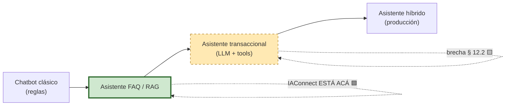

### 1.2 Alcance del sistema descripto

| Dentro del sistema | Fuera del sistema |
|---|---|
| API REST (4 controladores), autenticación JWT, resolución de tenant | Los portales GDA/Boletería (son **consumidores**) |
| Motor RAG léxico + ingesta de documentos | Los LLM de Anthropic/Google/OpenAI (son **externos**) |
| Factory + adaptadores de 3 proveedores | El sistema de turnos de GDA y el de eventos de Boletería |
| Base SQL Server (7 tablas, 72 SPs) | El pipeline CI/CD (no versionado en el repo relevado) |
| Widget Blazor embebible (RCL) | Canales de mensajería (WhatsApp, etc.) — no existen |

### 1.3 Los dos casos consumidores (contexto ilustrativo)

| Dimensión | GDA.Core — asistencia sobre **turnos** | BoleteriaCore — asistencia sobre **gestión de eventos** |
|---|---|---|
| Audiencia | Ciudadano + funcionario de backoffice | Organizador/productor de eventos |
| Pregunta típica | "¿Qué documentación llevo al turno de licencia?" | "¿Por qué no se publicó mi evento?" |
| Naturaleza de la respuesta | Estática (requisitos, horarios) → **RAG cubre** | Dinámica (estado del evento concreto) → **requiere tools** |
| Cobertura con IAConnect hoy | 🟨 Alta para lo estático; nula para "¿a qué hora es *mi* turno?" | 🟨 Baja: la pregunta central es sobre un registro vivo |

🟨 **Conclusión arquitectónica temprana:** el mismo servicio cubre bien el caso GDA-estático y mal el caso
Boletería-dinámico. Esto no es un defecto de configuración sino una **ausencia de capacidad** (§12.2), y es el
principal input de este SAD hacia el roadmap.

---

## 2. Drivers arquitectónicos

### 2.1 Requisitos funcionales (relevados del contrato REST)

🟩 Los RF se derivan de los endpoints efectivamente implementados, no de la documentación de origen.

| RF | Descripción | Endpoint | Evidencia |
|---|---|---|---|
| RF-01 | Chat multi-turno con memoria de sesión, RAG e imagen opcional | `POST /api/ai/{tenantId}/chat` | 🟩 `AIController.cs:12-134` |
| RF-02 | Completado libre de texto (sin sesión) | `POST /api/ai/{tenantId}/completion` | 🟩 idem |
| RF-03 | Análisis de texto (`Sentiment`, `Classification`, `Entities`) | `POST /api/ai/{tenantId}/analyze` | 🟩 `Domain/Enums/TipoAnalisis.cs` |
| RF-04 | Resumen de documento | `POST /api/ai/{tenantId}/summarize` | 🟩 `AIController.cs` |
| RF-05 | Mejora de texto (`Clarity`, `Formality`, `Brevity`, `Expand`) | `POST /api/ai/{tenantId}/improve` | 🟩 `Domain/Enums/ObjetivoMejora.cs` |
| RF-06 | Alta/consulta de base de conocimiento por tenant | `POST/GET /api/tenants/{tenantId}/knowledge` | 🟩 `KnowledgeController.cs:11-72` |
| RF-07 | Autenticación, refresh, logout, gestión de usuarios | `/api/auth/*` | 🟩 `AuthController.cs` |
| RF-08 | ABM de tenants (config de proveedor, modelo, prompt, límites) | `/api/tenants` | 🟩 `TenantsController.cs` |
| RF-09 | Multimodalidad: imagen base64 en el chat, validada por tenant | `POST .../chat` | 🟩 `ImageValidator.cs:16-48` |
| RF-10 | Métrica de uso por request (tokens, latencia, proveedor) | — (interno) | 🟩 `ChatService.cs:152-168` |

⚠ 🟩 **Divergencia verificada:** el XML-doc de `AIController.cs:112` documenta los objetivos de mejora como
«gramática, claridad, formal, conciso», pero el enum real es `{Clarity, Formality, Brevity, Expand}` — **existe
`Expand` y no existe `Grammar`**. La documentación del propio controlador miente sobre su contrato.

### 2.2 Atributos de calidad (con escenarios de calidad)

Formato: *estímulo → entorno → respuesta → medida*. 🟨 Las medidas objetivo son propuestas del autor salvo donde
se cita fuente; el sistema **no** declara SLOs.

| ID | Atributo | Escenario de calidad | Estado verificado |
|---|---|---|---|
| **QA-01** | **Multi-tenancy** | Un nuevo consumidor (p. ej. Boletería) debe poder incorporarse sin desplegar código: alta de fila en `lut_Tenants` + carga de KB. | 🟩 **Cumplido**: proveedor, modelo, temperatura, maxTokens, prompt, límites de imagen y expiraciones de token son **columnas del tenant** (`scripts/01_create_database.sql:31-53`). |
| **QA-02** | **Aislamiento** | El tenant A no puede leer historial ni KB del tenant B. | ⚠ 🟩 **Parcial**: corta en `TenantAccessFilter` para operadores (`:30-44`), pero (a) **cualquier admin accede a cualquier tenant**, (b) `KnowledgeController` **no lleva** el filtro, (c) la sesión **no se valida contra el tenant** en `ChatService`. Ver §9. |
| **QA-03** | **Latencia** | P95 del turno de chat ≤ 5 s. | 🟨 **No medible hoy con fidelidad**: el `Stopwatch` se detiene **antes** de persistir (`ChatService.cs:118`) → `Duracion_Ms` mide la latencia **del proveedor**, no del request. |
| **QA-04** | **Costo / token** | Costo por conversación acotado y atribuible. | ⚠ 🟩 **Comprometido**: (a) el historial se envía **dos veces** al modelo (§5.6.2) inflando tokens de prompt; (b) `sys_Metricas_Uso` **no tiene columna de costo ni de usuario** (`scripts/01_create_database.sql:154-176`). |
| **QA-05** | **Portabilidad de proveedor** | Cambiar de Claude a Gemini para un tenant = cambiar una columna. | 🟩 **Cumplido en diseño**: `IAIProvider` (5 métodos, 6 DTOs) + `AIProviderFactory` por `switch` sobre `tenant.ProveedorIA` (`AIProviderFactory.cs:17-31`). ⚠ 🟨 Asimétrico: solo Claude recibe `HttpClient` del factory con retry. |
| **QA-06** | **Seguridad** | Credenciales de proveedor nunca en claro; sesiones robadas acotadas. | ⚠ 🟩 **Parcial**: AES-256-CBC para la ApiKey, pero con **fallback silencioso a texto plano** al desencriptar (`AIProviderFactory.cs:35-39`). Ver §10. |
| **QA-07** | **Extensibilidad** | Agregar una capacidad nueva (tools, embeddings) sin reescribir. | 🟨 **Media**: `IAIProvider` es el punto de extensión natural, pero `ParseResponse` asume ciegamente `content[0].text` (`ClaudeProvider.cs:218-235`) — rompe con bloques `tool_use`. |
| **QA-08** | **Escalabilidad** | Corpus de KB creciente sin degradar el chat. | ⚠ 🟨 **Comprometido**: `RAGEngine` trae **todos** los fragmentos del tenant a memoria y los re-tokeniza **en cada request** — O(N·M) sin caché ni paginación (`RAGEngine.cs:39,54-85`). |
| **QA-09** | **Consistencia** | El historial y la métrica no divergen. | ⚠ 🟩 **No cumplido**: 3 INSERT + 1 UPDATE **sin transacción**, pese a que `DataEntityCore` la soporta (`DataEntityCore.cs:33`). |

### 2.3 Restricciones

| Tipo | Restricción | Evidencia |
|---|---|---|
| Técnica | .NET 8 / C# 12; Clean Architecture de 4 capas | 🟩 `00_MASTER-INDEX.md:111-132` |
| Técnica | **No EF Core**: persistencia por SPs y reflexión (`DataEntityCore`) | 🟩 `DataEntityCore.cs:33-256` |
| Técnica | SQL Server 2022 → **sin tipo `VECTOR` nativo** (llegó en 2025) | 🟨 restricción de plataforma; condiciona §12.1 |
| Organizacional | La solución fue **generada por IA por fases** (`docs/04_prompts_ai/fase-00..08`) | 🟩 `docs/` (49 archivos) |
| De contrato | El proveedor efectivo sale de `lut_Tenants.Nombre_Modelo`; los `DefaultModel` de `appsettings.json` **no se consumen** | 🟩 `appsettings.json:27-38` + `AIProviderFactory.cs:23-28` |

---

## 3. Vista de contexto (C4 nivel 1)

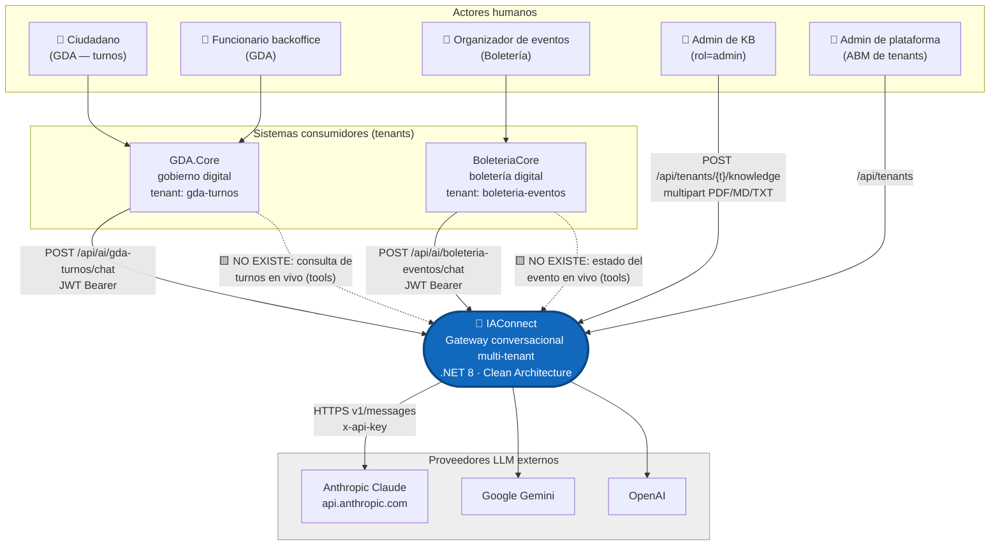

### 3.1 Tabla de actores y contratos

| Actor / sistema | Rol respecto de IAConnect | Interfaz | Autenticación | Evidencia |
|---|---|---|---|---|
| GDA.Core | Consumidor (tenant) | REST `/api/ai/{tenantId}/*` | JWT `rol=operador`, `id_tenant=gda-*` | 🟩 `AIController.cs:12` |
| BoleteriaCore | Consumidor (tenant) | idem | JWT `rol=operador` | 🟩 idem |
| Admin de KB | Curador de conocimiento | `/api/tenants/{t}/knowledge` | JWT `rol=admin` | 🟩 `KnowledgeController.cs:11` |
| Anthropic | Proveedor LLM | `POST v1/messages`, `anthropic-version: 2023-06-01` | `x-api-key` (desencriptada del tenant) | 🟩 `ClaudeProvider.cs:175-243` |
| Google / OpenAI | Proveedor LLM | SDK interno (sin `HttpClient` inyectado) | key desnuda al ctor | 🟩 `AIProviderFactory.cs:17-31` |

⚠ 🟩 **Observación de contexto:** las flechas punteadas del diagrama son **capacidad ausente**, no simplificación.
Verificado por grep sobre `tool_use|tool_choice|function_call|"tools"|toolChoice|FunctionCalling` en todo `*.cs`,
`*.json`, `*.razor` (excluyendo `obj/bin`): **cero coincidencias**; el único hit es
`IAConnect.API/dotnet-tools.json:4`, manifiesto del SDK .NET, irrelevante.

---

## 4. Vista de contenedores (C4 nivel 2)

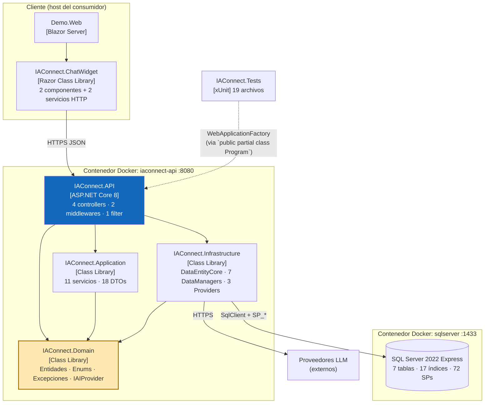

### 4.1 Regla de dependencia

🟩 Verificada contra `Program.cs:1-17`: **App→Domain, Infra→Domain, API→{App, Infra, Domain}**. Domain no
depende de nadie (`00_MASTER-INDEX.md:111-132`). 🟨 Nótese la excepción pragmática: `API→Infra` es directa
(no invertida por un módulo de composición), lo que acopla el host a la implementación de persistencia; es
aceptable en un monolito de un solo host, pero significa que **cambiar `DataEntityCore` toca `Program.cs`**.

### 4.2 Composición (DI) y pipeline HTTP

🟩 Snippet **real** citado — `IAConnect.API/Program.cs:22` (configuración global de persistencia al arranque):

```csharp
DataEntityCore.Configure(builder.Configuration.GetConnectionString("IAConnect"));
```

🟨 Este es el punto de mayor "olor" estructural del arranque: `DataEntityCore` es un **singleton estático**
configurado una vez, no un servicio inyectado. Consecuencia arquitectónica: la conexión no es sustituible por
test ni por tenant → **no hay camino a base-por-tenant** sin refactor (ver §9.4).

| Registro | Lifetime | Evidencia |
|---|---|---|
| `AIProviderFactory` | **Singleton** | 🟩 `Program.cs:88` |
| 7 DataManagers | Scoped | 🟩 `Program.cs:91-110` |
| 11 servicios de Application | Scoped | 🟩 `Program.cs:91-110` |
| `TenantAccessFilter` | Scoped (para `[ServiceFilter]`) | 🟩 `Program.cs:78` |
| `HttpClient` nombrado `"Claude"` | BaseAddress `https://api.anthropic.com/`, Timeout 60 s | 🟩 `Program.cs:81-85` |

🟩 **Orden exacto del pipeline** (`Program.cs:128-157`):

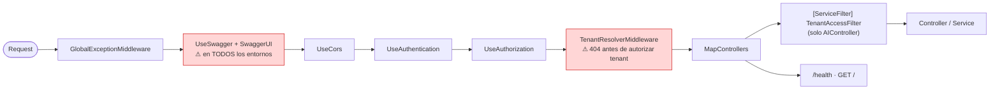

⚠ 🟩 Swagger queda habilitado en todos los entornos, con comentario explícito
*"Swagger habilitado en todos los entornos"* (`Program.cs:133`). 🟨 En producción esto publica el contrato
completo, incluidos los endpoints de `/api/tenants`, a cualquier anónimo que alcance el puerto.

🟩 `public partial class Program {}` al final (`Program.cs:157`) habilita `WebApplicationFactory` en tests — 🟦
patrón estándar de testing de integración en ASP.NET Core.

### 4.3 Estructura de proyectos

```text
Ng-IAServices/
├── IAConnect.API/                      # Host ASP.NET Core 8
│   ├── Controllers/
│   │   ├── AIController.cs             # /api/ai/{tenantId}  · 5 POST · [Authorize]+[ServiceFilter]
│   │   ├── AuthController.cs           # /api/auth
│   │   ├── KnowledgeController.cs      # /api/tenants/{tenantId}/knowledge · [Authorize(Roles="admin")]
│   │   └── TenantsController.cs        # /api/tenants
│   ├── Middleware/
│   │   ├── GlobalExceptionMiddleware.cs   # dominio -> HTTP (404/401/423/400/502/500)
│   │   ├── TenantResolverMiddleware.cs    # 404 si tenant inexistente/inactivo; Items["Tenant"] (no consumido)
│   │   └── TenantAccessFilter.cs          # corte de tenant para operadores
│   ├── Program.cs                      # composición + pipeline
│   ├── appsettings.json                # ⚠ Jwt:SecretKey literal commiteado (:13)
│   └── dotnet-tools.json
├── IAConnect.Application/
│   ├── DTOs/Requests/                  # 11 DTOs
│   ├── DTOs/Responses/                 # 7 DTOs
│   ├── Interfaces/
│   └── Services/
│       ├── AuthService.cs              # JWT, BCrypt, lockout 5/15min, refresh rotativo
│       ├── ChatService.cs              # orquestación de 10 pasos
│       ├── ImageValidator.cs           # magic-prefix + límites del tenant
│       ├── KnowledgeService.cs         # ingesta + chunking 400/50
│       ├── PromptBuilder.cs            # 4 bloques delimitados
│       ├── RAGEngine.cs                # TF-IDF en memoria · topK=5
│       └── TenantService.cs            # ABM + EncryptApiKey (AES-256-CBC)
├── IAConnect.Domain/
│   ├── Entities/                       # Tenant, Usuario, Sesion, Mensaje, FragmentoConocimiento, ...
│   ├── Enums/                          # TipoAnalisis, ObjetivoMejora, ProveedorIA, RolUsuario, RolMensaje
│   ├── Exceptions/                     # TenantNotFound, InvalidCredentials, AccountLocked, ImageNotAllowed, ProviderUnavailable
│   └── Interfaces/IAIProvider.cs       # ⭐ contrato de proveedor + 6 DTOs de transporte
├── IAConnect.Infrastructure/
│   ├── DataAccess/DataEntityCore.cs    # ⭐ patrón propietario, resolución SP por convención
│   ├── DataManagers/                   # 7 (uno por tabla), cada uno Abstract + concreto + Model
│   └── Providers/
│       ├── AIProviderFactory.cs        # switch por tenant.ProveedorIA + DecryptApiKey
│       ├── ClaudeProvider.cs           # ⭐ único con HttpClient + retry exponencial
│       ├── GeminiProvider.cs
│       └── OpenAIProvider.cs
├── IAConnect.ChatWidget/               # RCL embebible (2 componentes, 2 servicios, 4 modelos)
├── IAConnect.Tests/                    # xUnit · 19 archivos (10 unit services, 4 integration, 2 helpers)
├── scripts/01_create_database.sql      # 1752 líneas · 7 tablas · 17 índices · 72 SPs · seeds
├── docs/                               # 49 archivos · 10 secciones (⚠ sin 03_ ni openapi.yaml)
├── Dockerfile
└── docker-compose.yml
```

---

## 5. Vista de componentes (C4 nivel 3)

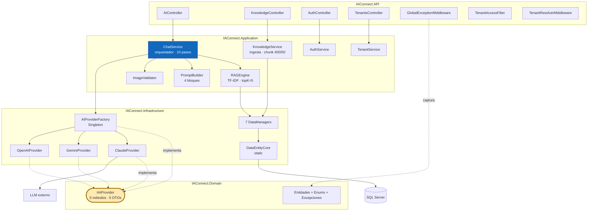

### 5.1 Tabla de responsabilidades

| Componente | Responsabilidad única | Colaboradores | ⚠ Anomalía arquitectónica |
|---|---|---|---|
| `ChatService` | Orquestar el turno completo | RAGEngine, PromptBuilder, ImageValidator, Factory, 4 DataManagers | 🟩 No valida sesión↔tenant; sin transacción; historial duplicado |
| `RAGEngine` | Recuperar top-K fragmentos | `ISysFragmentosConocimientoDataManager`, `ILutTenantsDataManager` | 🟩 Carga corpus completo por request; `SerializeEmbedding` muerto |
| `KnowledgeService` | Ingerir y trocear documentos | PdfPig, DataManager | 🟩 `ChunkSizeTokens` cuenta **palabras**; sin dedupe → duplica al recargar |
| `PromptBuilder` | Componer el system prompt | — (puro) | 🟩 Sin escapado de delimitadores → superficie de inyección |
| `ImageValidator` | Validar imagen contra política del tenant | `ILutTenantsDataManager` | 🟨 Detección por magic-prefix base64, no por decodificación real |
| `AIProviderFactory` | Seleccionar y construir el provider | `IHttpClientFactory` | 🟩 Fallback silencioso a key en texto plano |
| `GlobalExceptionMiddleware` | Traducir excepciones de dominio a HTTP | — | 🟩 `UnauthorizedAccessException` cae en default → **500**, no 401 |
| `TenantResolverMiddleware` | Resolver y validar el tenant activo | `ILutTenantsDataManager` | 🟩 `Items["Tenant"]` **no lo consume nadie** → 2-4 lecturas redundantes |
| `TenantAccessFilter` | Cortar acceso cross-tenant a operadores | — | 🟩 No-op si la ruta no lleva `{tenantId}`; admin pasa siempre |

### 5.2 ChatService — el orquestador (10 pasos)

🟩 Secuencia exacta verificada en `ChatService.cs:46-189`:

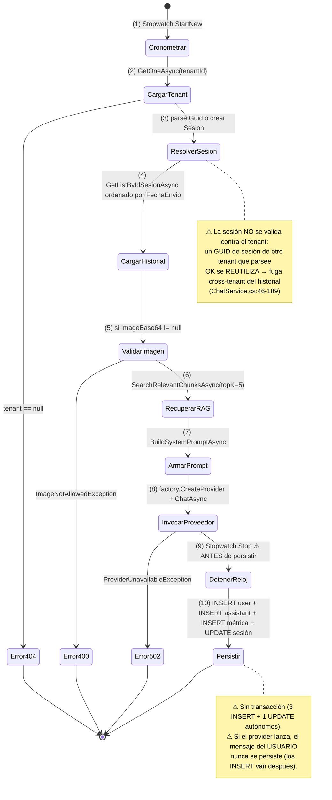

### 5.3 RAGEngine — recuperación **léxica**, no semántica

Este es 🟨 **el hallazgo más relevante de todo el SAD**: el esquema define
`Vector_Embedding varbinary(MAX)` y `docs/05_arquitectura_tecnica/rag-spec_v1.0.md` describe **similitud coseno
con threshold 0.75**, pero el código implementa **TF-IDF en memoria**. Conforme a la regla de precedencia
(🟩 `ia-db/indexes/04_proveedores-ia-y-rag.md:459-463`), **gana el código**: el RAG de producción **hoy es puramente
léxico**.

🟩 Snippet **real** — `IAConnect.Application/Services/RAGEngine.cs:110-117`:

```csharp
foreach (var term in queryTerms.Distinct())
{
    int docsWithTerm = fragmentos.Count(f =>
        f.Contenido.Contains(term, StringComparison.OrdinalIgnoreCase));

    // IDF: log(total / (1 + docs con el término)) — +1 para evitar division by zero
    idf[term] = Math.Log((double)totalDocs / (1 + docsWithTerm)) + 1;
}
```

🟩 Snippet **real** — el *fallback* por substring, `RAGEngine.cs:64-70`:

```csharp
int tf = fragmentTokens.Count(t => t == term);
if (tf == 0)
{
    // Fallback: coincidencia parcial (substring)
    if (contenidoLower.Contains(term, StringComparison.OrdinalIgnoreCase))
        tf = 1;
}
```

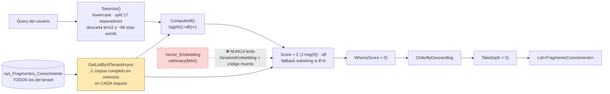

| Propiedad | Especificación de origen (`rag-spec_v1.0.md`) | **Implementación real** 🟩 | Impacto arquitectónico 🟨 |
|---|---|---|---|
| Método de recuperación | Similitud **coseno** sobre embeddings | **TF-IDF léxico** en memoria | No hay comprensión semántica: "sacar turno" no matchea "solicitar cita" |
| Umbral | threshold 0.75 | **ninguno** (`Score > 0`) | Cualquier coincidencia léxica mínima entra al prompt → ruido |
| Almacenamiento | `Vector_Embedding varbinary(MAX)` | **siempre `null`** (`KnowledgeService.cs:75`) | Columna pre-provisionada para una fase 2 nunca hecha |
| Top-K | — | 5 (default) | Fijo, no configurable por tenant |
| Escalabilidad | — | O(N·M) por request | QA-08 comprometido |

🟩 **Stop-words:** `HashSet` estático con `StringComparer.OrdinalIgnoreCase`: ~57 en español + 11 en inglés
(`RAGEngine.cs:14-24`). Nota menor: `"a"` está duplicado (líneas 16 y 23) — inofensivo por ser `HashSet`.

🟨 **Consecuencia para los casos del estudio.** Para GDA-Turnos, un corpus de requisitos con vocabulario
controlado funciona razonablemente con TF-IDF. Para Boletería-Eventos, donde el organizador pregunta con
lenguaje coloquial ("no me sale publicar"), el matching léxico contra documentación técnica ("estado de
publicación", "validación de aforo") **fallará sistemáticamente**. Este es un argumento fuerte a favor de §12.1.

### 5.4 KnowledgeService — ingesta y troceado

🟩 Snippet **real** — `KnowledgeService.cs:16-17` y `:103-121` (la constante y lo que realmente hace):

```csharp
private const int ChunkSizeTokens = 400;
private const int OverlapTokens = 50;
// ...
var words = text.Split(new[] { ' ', '\n', '\r', '\t' }, StringSplitOptions.RemoveEmptyEntries);
```

⚠ 🟩 **La constante está mal nombrada**: la unidad real es la **palabra**, no el token del modelo. Avanza con
`step = chunkSize - overlap = 350` palabras tomando 400 por chunk. 🟨 400 palabras ≈ 520-600 tokens en español:
**el presupuesto de contexto se subestima ~30-50%**. Con topK=5 esto significa que el bloque
`[CONTEXTO RELEVANTE]` puede rondar los 2.600-3.000 tokens reales cuando el diseño creía inyectar 2.000 —
sobre un `Max_Tokens` por defecto de 4000 (🟩 `scripts/01_create_database.sql:31-53`), es una fracción sustancial.

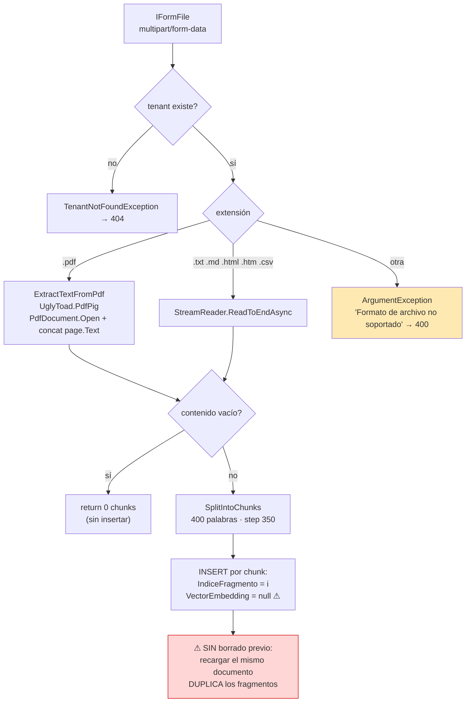

### 5.5 Factory de proveedores — la táctica de portabilidad

🟩 Snippet **real** — `IAConnect.Infrastructure/Providers/AIProviderFactory.cs:17-31`:

```csharp
var apiKey = DecryptApiKey(tenant.ApiKeyIA);

return tenant.ProveedorIA.ToLower() switch
{
    "gemini" => new GeminiProvider(apiKey, tenant.NombreModelo, tenant.Temperatura, tenant.MaxTokens),
    "claude" => new ClaudeProvider(_httpClientFactory.CreateClient("Claude"), apiKey, tenant.NombreModelo, tenant.Temperatura, tenant.MaxTokens),
    "openai" => new OpenAIProvider(apiKey, tenant.NombreModelo, tenant.Temperatura, tenant.MaxTokens),
    _ => throw new ArgumentException($"Proveedor no soportado: {tenant.ProveedorIA}")
};
```

| Aspecto | Claude | Gemini | OpenAI |
|---|---|---|---|
| `HttpClient` del factory (pooling) | 🟩 **Sí** (`"Claude"`, BaseAddress + 60 s) | 🟨 No (key desnuda al ctor) | 🟨 No |
| Retry con backoff | 🟩 3 reintentos, 1s/2s/4s, sobre {429, 502, 503, 504} | 🟨 No verificado | 🟨 No verificado |
| Multimodalidad implementada | 🟩 Sí (`BuildMessages` con bloque `image`) | 🟨 No verificado | 🟨 No verificado |

⚠ 🟩 **Divergencia de tipado:** existe `Domain.Enums.ProveedorIA{Gemini, Claude, OpenAI}` pero **no se usa acá** —
la selección es por `string`, igual que el `CHECK` de la base. Lo mismo `Usuario.Rol` y `Mensaje.Rol`
(🟩 `Domain/Entities/Tenant.cs:3-24`). Los enums de Domain solo se usan efectivamente en `TipoAnalisis` y
`ObjetivoMejora`. 🟨 El sistema tiene el tipo y elige no usarlo: la validación queda delegada al `CHECK` de SQL
y al `default` del `switch` → un typo en la columna se manifiesta como **400 en tiempo de request**, no como
error de configuración en el alta.

🟩 **Contrato `IAIProvider`** (`Domain/Interfaces/IAIProvider.cs:5-71`): 5 métodos (`ChatAsync`, `CompleteAsync`,
`AnalyzeAsync`, `SummarizeAsync`, `ImproveAsync`), todos `→ Task<AIResponse>`; el mismo archivo define los 6 DTOs
de transporte. ⚠ 🟩 `AIResponse` **no expone el modelo usado ni la latencia** — el modelo se toma del *tenant* al
persistir la métrica (§6.3).

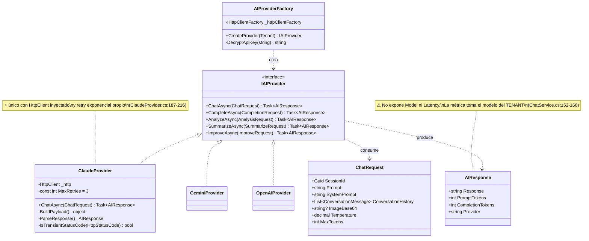

### 5.6 PromptBuilder — la superficie de contacto con el modelo

#### 5.6.1 Estructura de 4 bloques

🟩 `BuildSystemPromptAsync(tenant, userQuery, ragChunks?, history?)` arma un `StringBuilder`
(`PromptBuilder.cs:10-55`):

```text
{tenant.SystemPrompt}
[si MensajeBienvenida no es blank:]
IMPORTANTE: No te presentes ni incluyas saludos al inicio de tus respuestas. El mensaje de
bienvenida ya fue mostrado al usuario por el sistema. Responde directamente a la consulta.

[CONTEXTO RELEVANTE]
Fragmento 1: "…"
Fragmento 2: "…"

[HISTORIAL DE CONVERSACIÓN]
User: "…"
Assistant: "…"

[CONSULTA DEL USUARIO]
{userQuery}
```

⚠ 🟨 **Superficie de prompt-injection.** Los delimitadores son corchetes en mayúsculas y el contenido citado va
entre comillas dobles **sin escapado**. Un fragmento de KB (subido por un admin) o un mensaje de usuario que
contenga literalmente `[CONSULTA DEL USUARIO]` puede **confundir los límites del prompt**. Como cualquier admin
puede subir KB a **cualquier** tenant (§9.2), el vector es real y cruzado. Ver §10, LLM01.

#### 5.6.2 ⚠ El historial se envía **dos veces**

🟩 Verificado: `ChatService.cs:102` pasa `history` a `BuildSystemPromptAsync` (que lo embebe como texto bajo
`[HISTORIAL DE CONVERSACIÓN]` **dentro del system prompt**) y `ChatService.cs:112` vuelve a pasar el **mismo**
`history` como `ConversationHistory` del `ChatRequest`. `ClaudeProvider.BuildMessages` lo emite como **mensajes
reales** del array `messages` (`ClaudeProvider.cs:124-134`), mientras el system prompt viaja en el campo `system`
del payload (`:183`).

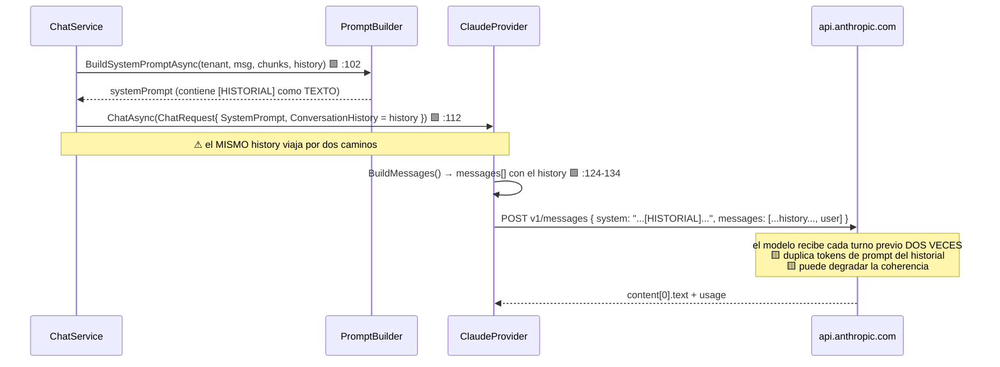

🟨 **Impacto en QA-04 (costo).** En una conversación de N turnos, los tokens del historial se pagan al doble.
Para el caso GDA-Turnos, donde una consulta de requisitos suele resolverse en 3-5 turnos, el sobrecosto es
tolerable; para conversaciones largas de soporte a organizadores en Boletería, crece linealmente y es el
**primer ítem de optimización de costo** del sistema. Es un defecto explotable para el LLD
(→ [`03-LLD.md`](03-LLD.md)).

### 5.7 Mapeo de errores (contrato explícito)

🟩 `GlobalExceptionMiddleware.HandleExceptionAsync` usa un `switch` expression (`:30-57`). Body:
`{ error, statusCode }`. Logging: `LogError` con stack si ≥500, `LogWarning` si no.

| Excepción de dominio | HTTP | Nota verificada |
|---|---|---|
| `TenantNotFoundException` | **404** | 🟩 |
| `InvalidCredentialsException` | **401** | 🟩 |
| `AccountLockedException` | **423** | 🟩 literal (no existe `HttpStatusCode.Locked`) |
| `ImageNotAllowedException` | **400** | 🟩 |
| `ProviderUnavailableException` | **502** | 🟩 exclusivamente (el índice `05_seguridad-y-multitenant.md` decía «502/503 (verificar)» — **corregido: es 502**) |
| `ArgumentException` | **400** | 🟩 (incluye "Proveedor no soportado" y "Formato de archivo no soportado") |
| *(default)* | **500** | 🟩 mensaje genérico "Error interno del servidor." |
| `UnauthorizedAccessException` | ⚠ **500** | 🟩 **No está en el switch**: `AIController.GetUserId()` la lanza con "Token inválido." y cae en el default → devuelve **500, no 401** |

⚠ 🟩 **Fuga de detalle del proveedor.** Los mensajes de excepciones <500 se devuelven **crudos** al cliente. Como
`ClaudeProvider` incrusta el `errorBody` crudo de la API de Anthropic en el mensaje de
`ProviderUnavailableException` (`:175-243`), ese cuerpo **llega al cliente en el 502**. Ver §10, LLM02.

---

## 6. Vista de datos

### 6.1 Modelo entidad-relación

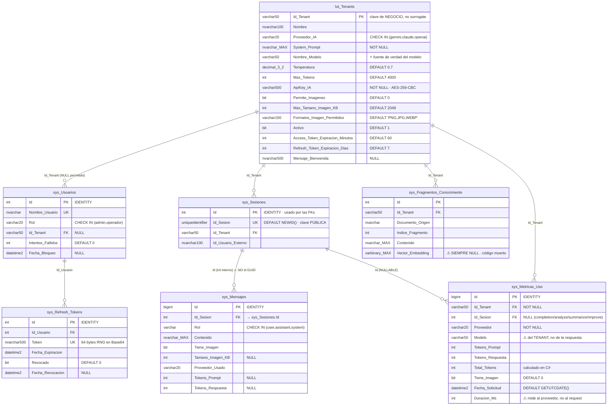

### 6.2 Decisiones de modelado y sus consecuencias

| Decisión 🟩 | Evidencia | Consecuencia arquitectónica 🟨 |
|---|---|---|
| `Id_Tenant` es **clave de negocio** `varchar(50)`, no surrogate | `scripts/01_create_database.sql:31` | Legible en rutas (`/api/ai/gda-turnos/chat`) y en el JWT; a cambio, **renombrar un tenant es una migración**. |
| **Doble identidad de sesión**: `Id` int interno (FKs) + `Id_Sesion` GUID público | `:58-196` | 🟦 Buena práctica (no expone IDs secuenciales). ⚠ Pero el GUID **no lleva el tenant embebido** → habilita el defecto de §5.2. |
| `sys_Metricas_Uso.Id_Sesion` es **nullable** | `:154-176` | Coherente: `completion/analyze/summarize/improve` no tienen sesión. Precio: no se puede reconstruir el costo *por conversación* para esos 4. |
| **No hay columna de costo ni de usuario** en métricas | `:154-176` | El costo debe derivarse ex-post (tokens × tarifa del modelo) fuera del sistema; **no hay atribución por usuario final**. |
| `Vector_Embedding varbinary(MAX) NULL` existe pero nunca se escribe | `KnowledgeService.cs:75` | Infraestructura **pre-provisionada** para una fase 2 nunca implementada. Ver §12.1. |
| 4 columnas de auditoría en todas las tablas (`Fecha_Alta/Modificacion`, `Usuario_Alta/Modificacion` DEFAULT `'SYSTEM'`) | `:31-53` | 🟦 Convención uniforme; el default `'SYSTEM'` sugiere que **rara vez se propaga el usuario real**. |
| `lut_Tenants` **sin FKs salientes** | `:31-53` | Es la **raíz del particionado multi-tenant**: todo cuelga de ella. |

### 6.3 ⚠ La métrica puede mentir

🟩 `ChatService` persiste `Modelo = tenant.NombreModelo` — **tomado del tenant, no de la respuesta real del
proveedor** (`ChatService.cs:152-168`), y `AIResponse` **no expone el modelo** (`IAIProvider.cs:65-71`).
🟨 Si el proveedor hace *fallback* de modelo (p. ej. Anthropic sirve un alias o degrada), la métrica registra el
modelo *configurado*, no el *usado*. Como el costo por token depende del modelo, **el cálculo de costo derivado
puede ser incorrecto sin ninguna señal de alarma**. Es un defecto de observabilidad, no de funcionalidad.

### 6.4 Índices y stored procedures — el espejo 1:1

🟩 **17 índices** no-clustered y **72 stored procedures**. El juego de SPs es un **espejo 1:1 de los índices**:
cada tabla tiene `Add/Update/Delete/GetAll/GetOne` + un par `GetBy_<idx>` / `GetBy_<idx>_Cantidad` por **cada
índice declarado** (`scripts/01_create_database.sql:203-1440`).

| Tabla | Índices no-clustered 🟩 |
|---|---|
| `lut_Tenants` | `Proveedor_IA`, `Activo` |
| `sys_Usuarios` | `Id_Tenant`, `Rol`, `Activo` |
| `sys_Sesiones` | `Id_Tenant`, `Activo`, `Id_Tenant_Activo` |
| `sys_Mensajes` | `Id_Sesion` |
| `sys_Fragmentos_Conocimiento` | `Id_Tenant`, `Id_Tenant_Documento_Origen` |
| `sys_Metricas_Uso` | `Id_Tenant`, `Id_Sesion`, `Fecha_Solicitud`, `Id_Tenant_Proveedor` |
| `sys_Refresh_Tokens` | `Id_Usuario`, `Revocado` |

🟨 **Lectura arquitectónica:** el índice **es** el contrato de consulta. No se puede consultar por un criterio que
no tenga índice+SP, y agregar un criterio implica DDL + SP + método en el `DataManager`. Esto explica el bug de
§6.5: el método existe pero el SP correcto no está expuesto en la interfaz.

🟩 Snippet **real** del patrón de acceso — `IAConnect.Infrastructure/DataAccess/DataEntityCore.cs` resuelve el
nombre del SP **por convención de string**: `SP_{_tableName}_{Op}` y `SP_{_tableName}_GetBy_{indexName}[_Cantidad]`.
`ExecuteAsync` centraliza conexión/transacción, invoca `SqlCommandBuilder.DeriveParameters(cmd)` (⚠ 🟨
**round-trip extra a la BD por llamada**) y asigna parámetros **posicionalmente** saltando `@RETURN_VALUE`. El
mapeo reader→POCO es por **reflexión** case-insensitive + `Convert.ChangeType` (`:33-256`).

⚠ 🟨 **Riesgo estructural del patrón:** al resolver por string y mapear por reflexión, **renombrar una columna o
un SP no rompe la compilación** — rompe en runtime. El compilador no protege el contrato de datos. Es el costo
consciente de no usar EF Core.

### 6.5 ⚠ Bug conocido en la vista de datos

🟩 `AuthService.GetUsuariosAsync` llama `GetListByIdTenantAsync(string.Empty)` y el propio código lleva **5 líneas
de comentarios admitiendo el defecto** (`AuthService.cs:188-196`): *«GetListByIdTenantAsync with empty might not
return all. Use a broader approach. […] the interface doesn't have GetAll. We'll return what's available. A proper
GetAll would be added to the DataManager»*. `GET /api/auth/usuarios` filtra por `Id_Tenant = ''` y devolverá
**lista vacía**. 🟩 `SP_sys_Usuarios_GetAll` **sí existe** en la base (`scripts/01_create_database.sql:520`):
falta exponerlo en `ISysUsuariosDataManager`.

---

## 7. Vista de despliegue

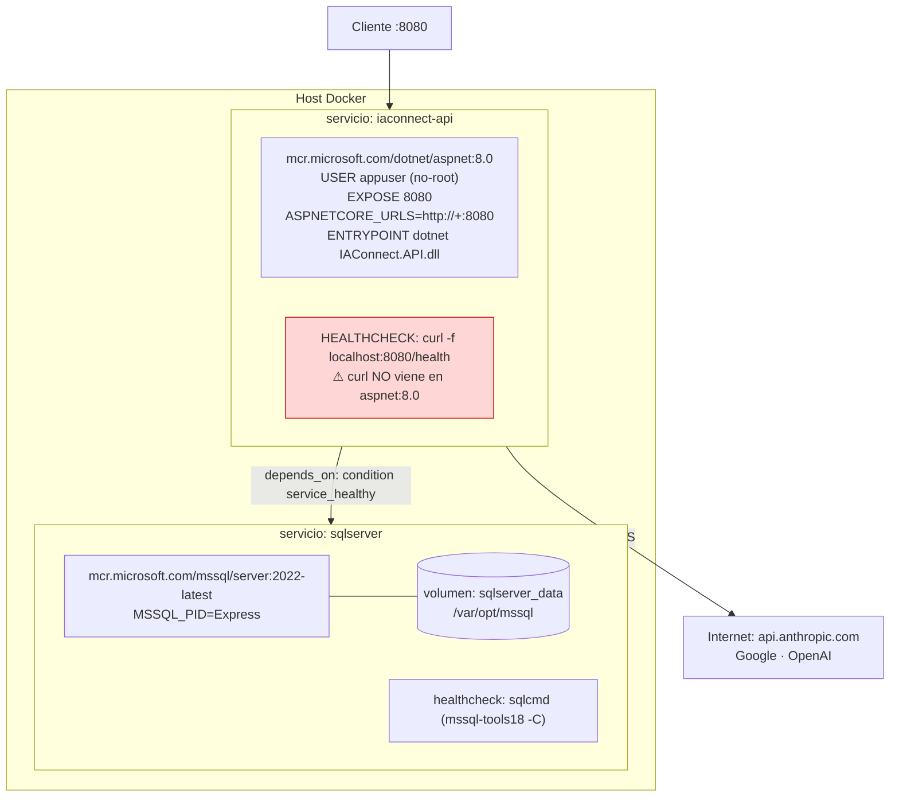

### 7.1 Dockerfile — build multi-stage

🟩 `Dockerfile:1-38`: stage **build** (`sdk:8.0`) copia los 4 `.csproj` de API/Application/Domain/Infrastructure,
`dotnet restore IAConnect.API.csproj`, `COPY . .`, `build -c Release`; stage **publish** con `/p:UseAppHost=false`;
stage **final** (`aspnet:8.0`) crea usuario no-root (`groupadd -r appuser && useradd -r -g appuser appuser`),
`USER appuser`, `COPY --from=publish`, `EXPOSE 8080`, `HEALTHCHECK --interval=30s --timeout=3s --start-period=5s
--retries=3 CMD curl -f http://localhost:8080/health`, `ENTRYPOINT ["dotnet","IAConnect.API.dll"]`.

| ⚠ Defecto 🟩 | Consecuencia 🟨 |
|---|---|
| `USER appuser` se declara **antes** del `COPY --from=publish` | Los archivos se copian con el usuario ya cambiado; según el contexto puede afectar permisos/propiedad. 🟦 La práctica estándar es copiar y luego bajar privilegios. |
| El `HEALTHCHECK` invoca `curl`, que `aspnet:8.0` **no incluye** por defecto | El healthcheck **fallaría siempre** salvo que se instale `curl` → el contenedor queda `unhealthy` → 🟩 `depends_on: condition: service_healthy` de compose y cualquier orquestador que respete el estado **nunca lo darían por listo**. Es un defecto de despliegue de primer orden. |

### 7.2 docker-compose — entornos y secretos

🟩 `docker-compose.yml:4-47`, 2 servicios. Tabla de variables:

| Variable | Valor / default 🟩 | ⚠ Observación |
|---|---|---|
| `ASPNETCORE_ENVIRONMENT` | `Development` | ⚠ **hardcodeado, no parametrizado** → no hay camino a producción con este compose |
| `Jwt__SecretKey` | `${JWT_SECRET_KEY:-dev-secret-key-must-be-at-least-32-characters-long}` | 🟩 el mismo literal está commiteado en `appsettings.json:13` |
| `Encryption__Key` | `${ENCRYPTION_KEY:-dev-encryption-key-32-chars-long}` | ⚠ 🟩 **variable MUERTA**: el código lee la env **`IACONNECT_ENCRYPTION_KEY`**, no `Encryption__Key` |
| `ConnectionStrings__IAConnect` | `sqlserver,1433`, `sa`/`${SA_PASSWORD:-...}`, `TrustServerCertificate=true` | 🟦 `TrustServerCertificate=true` es aceptable intra-compose, inaceptable en producción |
| `MSSQL_PID` | `Express` | Límites de Express (memoria/tamaño) aplican |

⚠ 🟩 **Todos los defaults `:-` son secretos de desarrollo commiteados.** 🟨 El patrón `${VAR:-default}` es
peligroso acá: si la variable no está seteada en producción, el sistema **no falla** — arranca con el secreto
público del repositorio. Un `${VAR:?error}` fallaría ruidosamente, que es lo correcto para un secreto.

### 7.3 ⚠ Matriz de configuración: claves vivas vs. muertas

🟩 **Corrección verificada** contra el índice `05_seguridad-y-multitenant.md`, que afirma «Jwt:SecretKey y
Encryption:AesKey en appsettings.json están vacíos»: **en realidad `Jwt:SecretKey` NO está vacío** —
`appsettings.json:13` contiene el literal `"dev-secret-key-must-be-at-least-32-characters-long"` **commiteado al
repo**.

| Clave | ¿Vacía? 🟩 | ¿La lee el código? 🟩 | Veredicto |
|---|---|---|---|
| `Jwt:SecretKey` | **No** — literal commiteado (`:13`) | Sí (`Program.cs:59-74`) | ⚠ **Viva y comprometida** |
| `ConnectionStrings:IAConnect` | Sí (`:10`) | Sí (`Program.cs:22`) | Viva; se inyecta por env |
| `Encryption:AesKey` | Sí (`:23`) | **No** | 💀 **MUERTA** |
| `Encryption__Key` (compose `:18`) | default dev | **No** | 💀 **MUERTA** |
| `IACONNECT_ENCRYPTION_KEY` (env) | — | **Sí** (`AIProviderFactory.cs:33-60`, `TenantService.cs:129-138`) | ⭐ **La única viva** |
| `AIProviders.*.ApiKey` (×3) | Sí (`:27,31,35`) | **No** | 💀 Muertas (la key sale de `lut_Tenants`) |
| `AIProviders.*.DefaultModel` (`gemini-2.5-flash`, `claude-3-sonnet-20240229`, `gpt-4`) | No | **No** | 💀 Muertas (el modelo sale de `lut_Tenants.Nombre_Modelo`, `AIProviderFactory.cs:23-28`) |
| `Cors:AllowedOrigins` | `[http://localhost:3000]` | Sí | Viva; dev-only |

🟨 **Lectura arquitectónica:** 6 de 9 entradas de configuración son **decorativas**. Un operador que configure
`Encryption:AesKey` creyendo que cifra las API keys estará operando un sistema que **ignora silenciosamente** su
configuración. Este es el input principal de [`06-Administrator-Guide.md`](06-Administrator-Guide.md).

### 7.4 Seed y credenciales

🟩 `scripts/01_create_database.sql` incluye en su encabezado (líneas 1-8) **servidor, usuario y contraseña de
ejemplo en claro** dentro del comentario de ejecución `sqlcmd` — **no se reproducen aquí** conforme al Marco
§5.4/§14. El script incluye seeds: 4+ `INSERT INTO lut_Tenants` (líneas 1456, 1486, 1593, 1624) y 6
`INSERT INTO sys_Usuarios` (1520, 1543, 1566, 1660, 1684, 1708) — tenants y usuarios de demo. La utilidad
`_hashgen/` genera los hashes BCrypt de ese seed. `run.bat` / `run-all.bat` orquestan la ejecución; `output.txt`
es salida de una corrida. (Los `INSERT` del rango 277-1440 son cuerpos de los `SP_*_Add`, no seeds.)

---

## 8. Vistas de escenarios end-to-end

### 8.1 Escenario 1 — Chat con RAG (caso GDA-Turnos)

Consulta ilustrativa: *"¿Qué papeles necesito para el turno de licencia de conducir?"*

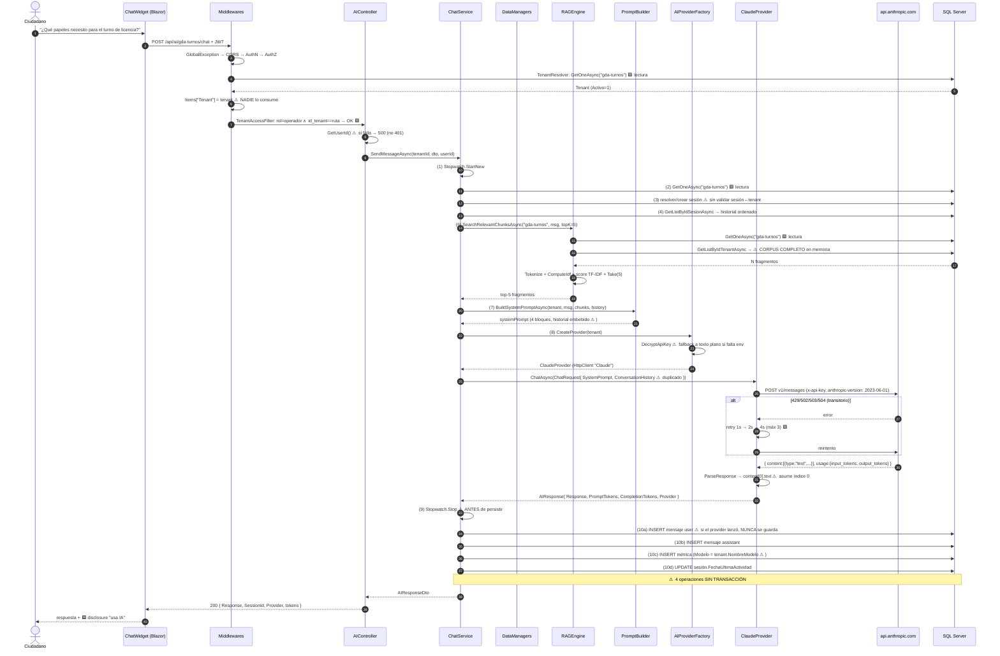

🟨 **Lectura del escenario:** 3 lecturas redundantes de `lut_Tenants` en un solo request (el middleware resuelve
el tenant y lo guarda en `Items["Tenant"]`, pero `ChatService`, `RAGEngine` e `ImageValidator` lo vuelven a leer
por su cuenta). Con imagen serían **4**. Es la optimización de latencia de menor costo y mayor rédito del sistema.

### 8.2 Escenario 2 — Ingesta de conocimiento (caso Boletería-Eventos)

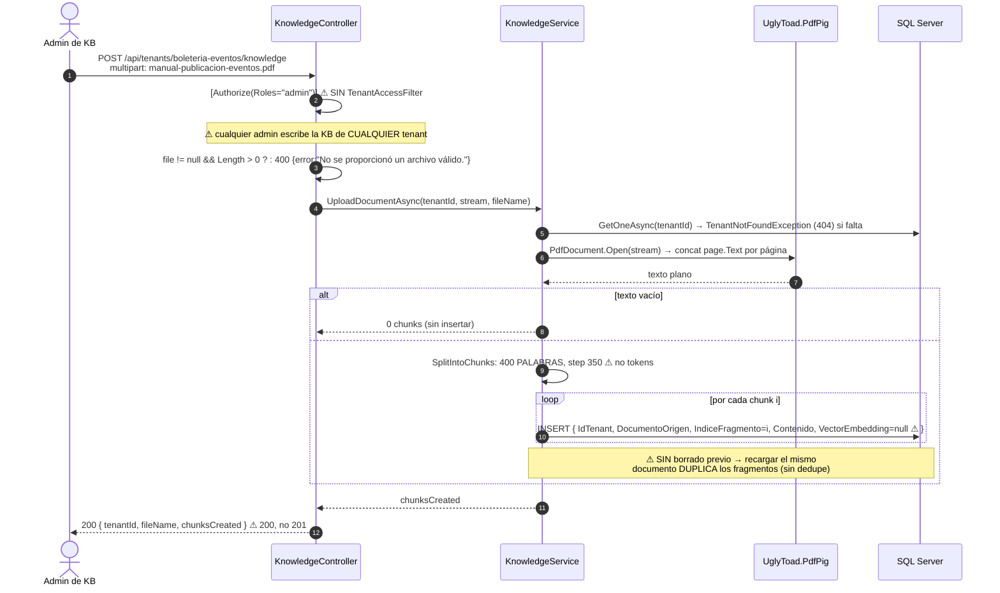

⚠ 🟩 **`GET /api/tenants/{t}/knowledge`** proyecta `{Id, DocumentoOrigen, IndiceFragmento, Contenido, FechaAlta}`
**sin paginación ni límite**: puede devolver el corpus entero en una sola respuesta (`KnowledgeController.cs:11-72`).

### 8.3 Escenario 3 — Login, lockout y refresh rotativo

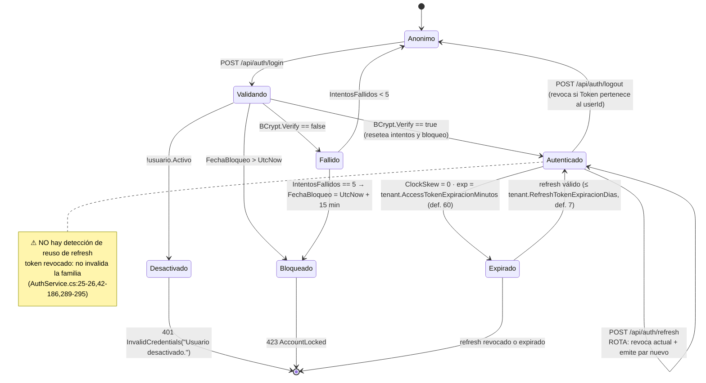

| Parámetro | Valor 🟩 | Fuente |
|---|---|---|
| `MaxLoginAttempts` | **5** (constante **hardcodeada**) | `AuthService.cs:25` |
| `LockoutMinutes` | **15** (constante **hardcodeada**) | `AuthService.cs:26` |
| Algoritmo de firma | HmacSha256 | `AuthService.cs:258-287` |
| `ClockSkew` | **Zero** 🟦 (endurecimiento correcto) | `Program.cs:59-74` |
| Claims emitidos | `sub`, `nombre_usuario`, `id_tenant` (`?? ""`), `ClaimTypes.Role`, `iat`, `jti` | `AuthService.cs:258-287` |
| Hash de contraseña | BCrypt (`BCrypt.Net.BCrypt.Verify`) 🟦 | `AuthService.cs:42-186` |
| Refresh token | 64 bytes de `RandomNumberGenerator`, Base64 🟦 | `AuthService.cs:289-295` |
| Expiraciones | **del tenant del usuario**; default 60 min / 7 días si el usuario no tiene tenant | `AuthService.cs:42-186` |

⚠ 🟩 **Divergencia issuer/audience.** El validador usa `Jwt:Audience` de config (`"IAConnect.API"` en
`appsettings.json`) pero el **emisor** cae en los fallbacks `"IAConnect"` / `"IAConnect.Clients"` si la config
falta. 🟨 Desalineación silenciosa: en un entorno donde `Jwt:Audience` no esté seteada en el emisor, **todos los
tokens emitidos fallarían la validación** con un 401 sin diagnóstico claro.

### 8.4 Escenario 4 — Degradación del proveedor

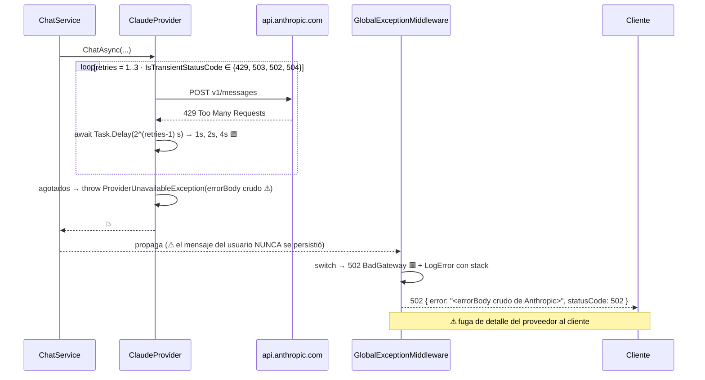

🟨 **Ausencia de táctica:** no hay *circuit breaker* ni *fallback de proveedor*. Con `Temperatura`, `MaxTokens`,
`ProveedorIA` y `NombreModelo` todos en `lut_Tenants`, un fallback a un proveedor secundario sería
arquitectónicamente barato (una columna `Proveedor_IA_Fallback` + un `catch` en `ChatService`), pero **no existe**.
El retry propio de Claude es la **única** táctica de resiliencia del sistema, y solo aplica a un proveedor de tres.

---

## 9. Estrategia multi-tenant y aislamiento

### 9.1 El modelo: pooled con discriminador de columna

🟦 De los tres modelos clásicos (silo / bridge / pooled), IAConnect implementa **pooled**: una base, una
aplicación, discriminador `Id_Tenant` en todas las tablas de negocio. 🟩 `lut_Tenants` es la raíz sin FKs
salientes (`scripts/01_create_database.sql:31-53`).

| Modelo | Aislamiento | Costo | ¿Es IAConnect? |
|---|---|---|---|
| Silo (base por tenant) | Máximo | Alto | ❌ 🟨 **Imposible sin refactor**: `DataEntityCore` es un singleton estático con **una** cadena de conexión (`Program.cs:22`) |
| Bridge (esquema por tenant) | Alto | Medio | ❌ |
| **Pooled (columna discriminadora)** | **Depende del código** | Bajo | ✅ 🟩 |

🟨 La consecuencia del modelo pooled es que **el aislamiento no lo garantiza la infraestructura sino el código**.
Por eso §9.2 importa tanto: cada punto donde el código olvida filtrar por tenant es una fuga real.

### 9.2 ⚠ Dónde corta el tenant — y dónde **no**

🟩 `TenantAccessFilter` (`IAsyncActionFilter`, `:12-47`), snippet **real**:

```csharp
if (string.IsNullOrEmpty(tenantId))
{
    await next();   // ⚠ no-op si la ruta no lleva {tenantId}
    return;
}
// ...
// Admins can access any tenant
if (string.Equals(userRole, "admin", StringComparison.OrdinalIgnoreCase))
{
    await next();   // ⚠ sin restricción de tenant
    return;
}
// Operators can only access their own tenant
if (!string.Equals(userTenant, tenantId, StringComparison.OrdinalIgnoreCase))
{
    context.Result = new ObjectResult(new { error = "No tiene acceso a este tenant." })
    { StatusCode = 403 };
    return;
}
```

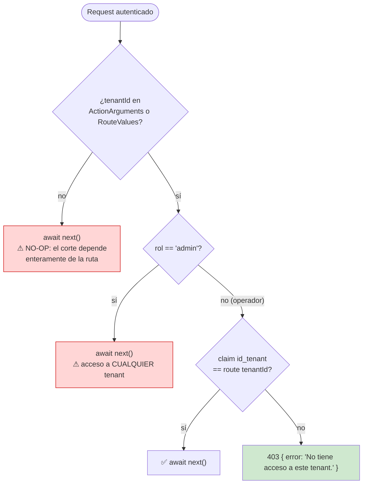

### 9.3 Matriz de fugas verificadas

| # | Fuga | Verificación 🟩 | Severidad 🟨 | Escenario concreto |
|---|---|---|---|---|
| **F-1** | **Admin cross-tenant** | `TenantAccessFilter.cs:30-34`: `rol=="admin"` → `await next()` sin restricción | **Alta** | Un admin de GDA lee el historial de conversaciones de Boletería |
| **F-2** | **`KnowledgeController` sin filtro** | `KnowledgeController.cs:11` lleva `[Authorize(Roles="admin")]` pero **no** `[ServiceFilter(TenantAccessFilter)]`, a diferencia de `AIController.cs:12` | **Alta** | Cualquier admin **escribe** la KB de cualquier tenant → vector de inyección cruzada (§10, LLM01/LLM03) |
| **F-3** | **Sesión no validada contra tenant** | `ChatService.cs:46-189`: si el GUID de sesión parsea OK, **se reutiliza** sin comprobar `sesion.IdTenant == tenantId` | **Alta** | Un operador de Boletería con un GUID de sesión de GDA obtiene el **historial de GDA** inyectado en su prompt |
| **F-4** | **Enumeración de tenants** | `TenantResolverMiddleware.cs:14-34`: el **404** por tenant inexistente/inactivo se emite **antes** de comprobar autorización de tenant | **Media** | Con cualquier JWT válido se distingue 404 (no existe) de 403 (existe, sin acceso) → se enumera el padrón de tenants activos |
| **F-5** | **`GET knowledge` sin paginación** | `KnowledgeController.cs:11-72` | **Media** | Exfiltración del corpus completo en una request (agravada por F-2) |

🟨 **Nota sobre F-2.** El efecto neto es el mismo con o sin el filtro (el controlador ya exige `admin`, y el
filtro deja pasar a los admin a cualquier tenant de todos modos). Pero la **inconsistencia** importa: si mañana
se corrige F-1 restringiendo a los admin a su tenant, `AIController` quedaría protegido y `KnowledgeController`
**seguiría abierto**. La corrección de F-1 **debe** ir acompañada de la de F-2.

### 9.4 Configuración por tenant — la táctica que sí funciona

🟩 `Domain/Entities/Tenant.cs:3-24` con defaults C#:

| Dimensión configurable por tenant | Default 🟩 | Ejemplo GDA-Turnos 🟨 | Ejemplo Boletería-Eventos 🟨 |
|---|---|---|---|
| `ProveedorIA` (string) | — | `claude` | `gemini` |
| `NombreModelo` | — | `claude-3-sonnet-20240229` | `gemini-2.5-flash` |
| `Temperatura` | `0.7m` | `0.2` (respuestas normativas) | `0.5` |
| `MaxTokens` | `4000` | `2000` | `4000` |
| `SystemPrompt` | — (NOT NULL) | rol, tono, alcance del municipio | rol, tono, alcance de la plataforma |
| `MensajeBienvenida` | `null` | activa la instrucción anti-saludo 🟩 | idem |
| `PermiteImagenes` | `false` | `true` (foto del DNI/comprobante) | `false` |
| `MaxTamanoImagenKB` | `2048` | `2048` | — |
| `FormatosImagenPermitidos` | `"PNG,JPG,WEBP"` | `"PNG,JPG"` | — |
| `AccessTokenExpiracionMinutos` | `60` | `30` | `60` |
| `RefreshTokenExpiracionDias` | `7` | `1` | `7` |
| `Activo` | `true` | — | — |

🟩 **Esta es la fortaleza real de la arquitectura**: incorporar un consumidor nuevo es **una fila + una carga de
KB**, sin desplegar código. Es exactamente lo que se necesita para que un mismo servicio sirva a GDA y Boletería.
🟨 Los límites de esa fortaleza: **no** son configurables por tenant el `topK` del RAG (fijo en 5), el tamaño de
chunk (constante de clase), `MaxLoginAttempts`/`LockoutMinutes` (constantes hardcodeadas), ni existe columna para
registrar *tools* (§12.2).

---

## 10. Seguridad arquitectónica — OWASP LLM Top 10

🟦 Marco de referencia: OWASP Top 10 for LLM Applications. La columna "Control real" es 🟩 verificada; el
veredicto es 🟨.

| # | Riesgo OWASP LLM | Control real en IAConnect | Evidencia | Veredicto 🟨 |
|---|---|---|---|---|
| **LLM01** | **Prompt Injection** | `PromptBuilder` delimita con `[BLOQUES]` en mayúsculas y comillas dobles — **sin escapado**. La instrucción anti-saludo es el único guardrail estructural. | 🟩 `PromptBuilder.cs:10-55` | ⚠ **Débil**. Injection directa (usuario) e **indirecta** (documento subido a la KB) son viables. Agravado por F-2: cualquier admin envenena la KB de cualquier tenant. |
| **LLM02** | **Insecure Output Handling** | Ninguno: la respuesta del modelo se devuelve tal cual al cliente y se persiste sin sanitizar. `errorBody` crudo del proveedor viaja al cliente en el 502. | 🟩 `ClaudeProvider.cs:175-243` + `GlobalExceptionMiddleware.cs:30-57` | ⚠ **Ausente**. El widget Blazor debe garantizar render seguro; el gateway no ayuda. |
| **LLM03** | **Training Data / KB Poisoning** | `[Authorize(Roles="admin")]` en `KnowledgeController`. **Sin** `TenantAccessFilter`, sin dedupe, sin borrado previo, sin revisión/aprobación. | 🟩 `KnowledgeController.cs:11-72` + `KnowledgeService.cs:34-101` | ⚠ **Débil**. Recargar un documento **duplica** los fragmentos → un mismo contenido escala su TF-IDF y **domina el top-5**: envenenamiento por repetición, sin siquiera malicia. |
| **LLM04** | **Model Denial of Service** | `MaxTokens` por tenant. `HttpClient` timeout 60 s. Retry sobre 429. | 🟩 `Program.cs:81-85` + `ClaudeProvider.cs:187-216` | ⚠ **Parcial**. **No hay rate-limiting** por tenant/usuario. `ChatRequestDto.Message` **sin DataAnnotations** → mensaje vacío o gigante llega al proveedor. `GET knowledge` sin paginación es un DoS de la propia API. |
| **LLM05** | **Supply Chain** | Imágenes base oficiales (`mcr.microsoft.com`), usuario no-root. Dependencia de PdfPig para parseo de PDF no confiable. | 🟩 `Dockerfile:1-38` | 🟨 **Medio**. El parseo de PDFs subidos por terceros es superficie de ataque en la librería. |
| **LLM06** | **Sensitive Information Disclosure** | ApiKey del tenant cifrada AES-256-CBC-PKCS7 con IV de 16 bytes prefijado. JWT con claims mínimos. | 🟩 `TenantService.cs:129-138` | ⚠ **Comprometido**, ver §10.1 (GAP-ENC-FALLBACK). Además: `Jwt:SecretKey` commiteado (`appsettings.json:13`); errorBody del proveedor en el 502; Swagger público (`Program.cs:133`). |
| **LLM07** | **Insecure Plugin Design** | — | 🟩 no aplica | ✅ **N/A hoy**: no hay plugins ni tools. 🟨 **Pasará a ser el riesgo #1** el día que se implemente §12.2. |
| **LLM08** | **Excessive Agency** | El asistente **no puede actuar**: solo responde texto. | 🟩 grep: cero `tool_use`/`function_call` | ✅ **Cumplido por ausencia de capacidad**, no por diseño. 🟨 Es una virtud accidental que desaparece con function-calling. |
| **LLM09** | **Overreliance** | `MensajeBienvenida` por tenant permite un disclaimer; 🟦 el patrón de Mercado Pago (*"Este asistente usa inteligencia artificial para responderte"*, `IA-Mercado-Libre.md` §3.1) es el estándar. | 🟩 `Tenant.cs:3-24` | ⚠ **Delegado al tenant**. No hay disclosure obligatorio ni citación de fuentes: el RAG inyecta fragmentos pero la respuesta **no dice de dónde salió**. |
| **LLM10** | **Model Theft** | ApiKey cifrada; nunca se expone en respuestas. | 🟩 `AIProviderFactory.cs:33-60` | ⚠ Ver §10.1. |

### 10.1 ⚠ GAP-ENC-FALLBACK — la asimetría crítica

🟩 **Escritura** (`TenantService.cs:129-138`): `EncryptApiKey` **lanza** `InvalidOperationException` si falta la
env `IACONNECT_ENCRYPTION_KEY` — **no permite guardar en claro**. Correcto.

🟩 **Lectura** (`AIProviderFactory.cs:33-60`): `DecryptApiKey` hace **lo contrario** — si la env está
vacía/ausente, `return encryptedKey` tal cual, asumiendo texto plano, con el comentario
*«En desarrollo: si no hay clave de encriptación, asumir key en texto plano»*.

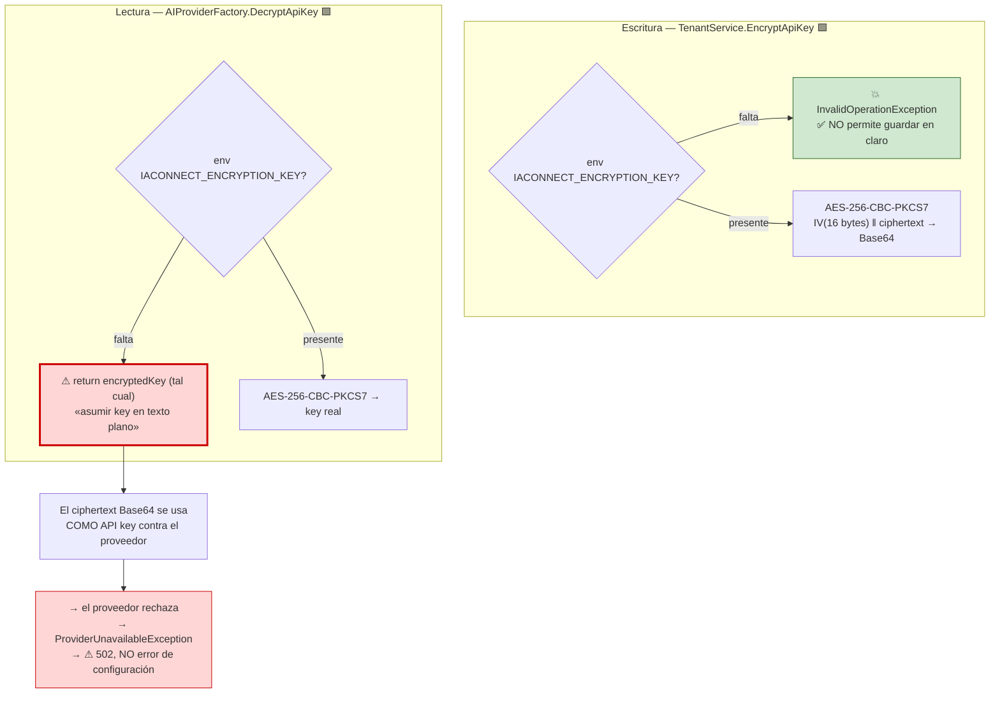

🟨 **Consecuencia arquitectónica (GAP-ENC-FALLBACK).** En un entorno donde la env **se pierda tras el alta**, el
sistema **no falla ruidosamente**: intenta usar el ciphertext Base64 como API key y el error emerge como un
**502 del proveedor**, no como un error de configuración. El operador ve "el proveedor está caído" cuando en
realidad "se perdió la clave de cifrado". Es un fallo de diagnosticabilidad tanto como de seguridad. Agravado
porque las claves `Encryption:AesKey` y `Encryption__Key` **son muertas** (§7.3): quien configure esas creerá
tener cifrado y no lo tendrá.

### 10.2 Control de alcance conversacional (bloque D3 del antecedente)

🟦 El antecedente (§D3) y el análisis de Mercado Pago (§3.1) coinciden: los **chips de intents sugeridos** no son
decoración, son **guardarraíl de alcance** — muestran qué sabe hacer el asistente y desalientan salir del dominio.

| Táctica de control de alcance 🟦 | ¿En IAConnect? |
|---|---|
| System prompt con alcance explícito | 🟩 Sí — `System_Prompt nvarchar(MAX) NOT NULL` por tenant. **Única línea de defensa.** |
| Chips de intents sugeridos | 🟨 No verificado en el widget; no hay soporte en el contrato REST |
| Clasificador de intención previo (fuera de alcance → respuesta canónica) | ❌ No existe |
| Validación de salida / guardrail post-respuesta | ❌ No existe |
| Hand-off a humano | ❌ No existe |
| Citación de fuentes | ❌ No existe (el RAG inyecta pero no atribuye) |

🟨 **Veredicto:** el control de alcance de IAConnect es **enteramente prompt-based**. Es la configuración mínima
viable, y significa que la calidad del `System_Prompt` de cada tenant es un **componente arquitectónico de facto**
— gobernarlo es responsabilidad de [`06-Administrator-Guide.md`](06-Administrator-Guide.md).

---

## 11. Atributos de calidad y tácticas

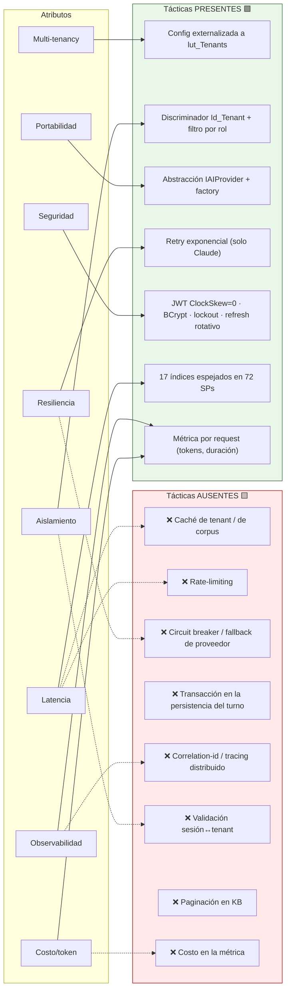

### 11.1 Tabla de tácticas

| Atributo | Táctica aplicada 🟩 | Evidencia | Táctica ausente 🟨 y su costo |
|---|---|---|---|
| **Multi-tenancy** | Externalizar toda la configuración al tenant | `scripts/01_create_database.sql:31-53` | — (el atributo mejor resuelto del sistema) |
| **Aislamiento** | Filtro por rol + claim `id_tenant` | `TenantAccessFilter.cs:30-44` | Validación sesión↔tenant (F-3); restricción del admin (F-1) |
| **Latencia** | Índices espejados; `HttpClient` con pooling (Claude) | `Program.cs:81-85` | **Caché de `lut_Tenants`** (3-4 lecturas/request); caché o índice invertido del corpus |
| **Costo/token** | Métrica por request | `ChatService.cs:152-168` | **Eliminar la duplicación del historial** (§5.6.2); columna de costo; `topK` por tenant |
| **Portabilidad** | `IAIProvider` + factory por `switch` | `AIProviderFactory.cs:17-31` | Paridad entre providers (retry/pooling/multimodal solo en Claude) |
| **Seguridad** | JWT endurecido, BCrypt, lockout, refresh rotativo, AES para la key | `AuthService.cs:25-186` | Cerrar GAP-ENC-FALLBACK; detección de reuso de refresh; rate-limiting; Swagger fuera de prod |
| **Resiliencia** | Retry exponencial 1s/2s/4s sobre {429,502,503,504} | `ClaudeProvider.cs:187-216` | Circuit breaker; fallback de proveedor; **transacción** en el turno |
| **Observabilidad** | Log Information con tenant/provider/tokens/duration; `/health` | `ChatService.cs:175-177` | Correlation-id; `Duracion_Ms` real; modelo real en la métrica |
| **Testabilidad** | `public partial class Program` + `WebApplicationFactory`; 19 archivos xUnit | `Program.cs:157` | Ver §11.2 |

### 11.2 Cobertura de pruebas — huecos relevantes

🟩 `IAConnect.Tests` (xUnit), **19 archivos**: 10 Unit/Services (Auth, Chat, Completion, Analyze, Summarize,
Improve, Tenant, RAGEngine, PromptBuilder, ImageValidator), 1 Unit/Providers (`AIProviderFactoryTests`), 1
Unit/Middleware (`TenantResolverMiddlewareTests`), 4 Integration (`AuthControllerIntegrationTests`,
`HealthCheckIntegrationTests`, `MultiTenantIsolationTests`, `TenantsControllerIntegrationTests`) +
`IAConnectWebApplicationFactory`, y 2 Helpers (`MockDataHelper`, `TestJwtHelper`).

| Hueco 🟨 | Por qué importa arquitectónicamente | Riesgo asociado |
|---|---|---|
| **Sin tests de `KnowledgeService`** | Ingesta/chunking/PdfPig no cubiertos — el chunking en palabras y la duplicación al recargar habrían aparecido | LLM03, §5.4 |
| **Sin tests de `TenantAccessFilter`** | ⭐ **Es el punto donde corta el aislamiento**. Solo se testea `TenantResolverMiddleware`, que **no** autoriza | F-1, F-2, F-3 |
| **Sin tests de `GlobalExceptionMiddleware`** | El mapeo a 423/502 y el `UnauthorizedAccessException`→500 no están verificados | §5.7 |
| **Sin tests de providers concretos** | El retry, el parsing de `content[0].text` y la construcción del payload no están cubiertos | §12.2 (romperán con `tool_use`) |

🟨 **Observación:** existe `MultiTenantIsolationTests.cs` (Integration), lo que indica intención de cubrir el
aislamiento; pero el componente que **efectivamente** lo implementa (`TenantAccessFilter`) no tiene test unitario.

---

## 12. Deuda técnica y evolución

### 12.1 Ruta 1 — RAG léxico → híbrido → semántico

🟨 Ruta de migración **propuesta**, con anclajes 🟩 verificados en el código.

```mermaid
flowchart LR
    subgraph F0["Hoy 🟩"]
        L["TF-IDF en memoria<br/>topK=5 · sin threshold<br/>VectorEmbedding = null"]
    end
    subgraph F1["Fase 1 — Higiene (bajo riesgo) 🟨"]
        H1["Dedupe por Documento_Origen<br/>(borrar antes de reinsertar)"]
        H2["Renombrar ChunkSizeWords<br/>+ chunking real por tokens"]
        H3["Umbral mínimo de score<br/>+ topK por tenant"]
        H4["Índice invertido en memoria<br/>con caché por tenant (QA-08)"]
    end
    subgraph F2["Fase 2 — Semántico 🟨"]
        S1["IEmbeddingProvider en Domain/Interfaces<br/>+ EmbeddingProviderFactory por tenant"]
        S2["KnowledgeService.cs:75<br/>VectorEmbedding = await EmbedAsync(chunk)"]
        S3["DeserializeEmbedding + coseno<br/>(el par de SerializeEmbedding)"]
        S4["RAGEngine.cs:51-85<br/>reemplazar ComputeIdf/scoring"]
    end
    subgraph F3["Fase 3 — Híbrido 🟦"]
        HY["score = α·coseno + (1-α)·TF-IDF<br/>+ re-ranking"]
    end
    L --> F1 --> F2 --> F3
    style F0 fill:#e9f1fb
    style F3 fill:#f0e9fb
```

| Paso | Anclaje verificado 🟩 | Estado |
|---|---|---|
| Escritura del vector **ya cableada** | La columna `Vector_Embedding varbinary(MAX) NULL` existe (`scripts/01_create_database.sql:~137`) y **viaja end-to-end** por el DataManager: `SysFragmentosConocimientoAbstract.cs:32,50` la pasan como parámetro al `SP_Add`/`SP_Update` | ✅ Solo falta **calcular** el vector |
| Mitad del par de serialización | `RAGEngine.SerializeEmbedding(float[])` (`:122-127`, `Buffer.BlockCopy` puro) — **nadie la invoca** | ⚠ Falta `Deserialize` + coseno |
| Punto de inyección de **ingesta** | `KnowledgeService.cs:75` (`VectorEmbedding = null` → `await embeddingProvider.EmbedAsync(chunks[i])`) | Identificado |
| Punto de inyección de **consulta** | `RAGEngine.cs:51-85` (reemplazar `ComputeIdf`/scoring por coseno) | Identificado |
| Abstracción faltante | `IEmbeddingProvider` en `Domain/Interfaces` + factory por tenant, **análoga a `AIProviderFactory`** | ❌ No existe |
| Restricción de store | 🟨 SQL Server **2022 no tiene tipo `VECTOR` nativo** (llegó en 2025) → el coseno seguiría siendo **en memoria** salvo migrar el store | Bloqueante para escala |

🟨 Snippet **PROPUESTO** (no existe en el código) — la abstracción faltante:

```csharp
// PROPUESTA — IAConnect.Domain/Interfaces/IEmbeddingProvider.cs (NO EXISTE HOY)
public interface IEmbeddingProvider
{
    Task<float[]> EmbedAsync(string text, CancellationToken ct = default);
    Task<IReadOnlyList<float[]>> EmbedBatchAsync(IReadOnlyList<string> texts, CancellationToken ct = default);
    int Dimensions { get; }
    string ModelId { get; }
}
```

🟨 Snippet **PROPUESTO** — el par que le falta a `SerializeEmbedding`:

```csharp
// PROPUESTA — completar RAGEngine.cs:122-127 (SerializeEmbedding ya existe y está muerto)
internal static float[] DeserializeEmbedding(byte[] bytes)
{
    var floats = new float[bytes.Length / sizeof(float)];
    Buffer.BlockCopy(bytes, 0, floats, 0, bytes.Length);
    return floats;
}

internal static double CosineSimilarity(float[] a, float[] b)
{
    double dot = 0, na = 0, nb = 0;
    for (int i = 0; i < a.Length; i++) { dot += a[i]*b[i]; na += a[i]*a[i]; nb += b[i]*b[i]; }
    return dot / (Math.Sqrt(na) * Math.Sqrt(nb) + 1e-10);
}
```

🟨 **Recomendación de secuencia:** la Fase 1 (higiene) entrega valor **sin** dependencia externa y sin costo por
token — el dedupe por `Documento_Origen` y el umbral de score corrigen dos defectos activos (LLM03 y el ruido del
`Score > 0`). La Fase 2 introduce un **costo por token de embedding en la ingesta** y una dependencia externa
nueva. Hacer la Fase 1 primero es lo prudente.

### 12.2 Ruta 2 — Function-calling / tools (el punto de extensión principal)

🟩 **Verificado por grep exhaustivo** sobre `*.cs` / `*.json` / `*.razor` (excluyendo `obj/bin`) de los patrones
`tool_use|tool_choice|function_call|"tools"|toolChoice|FunctionCalling`: **cero coincidencias en código**; el
único hit es `IAConnect.API/dotnet-tools.json:4` (manifiesto de herramientas del SDK .NET, irrelevante).
**HOY NO EXISTE function-calling ni tools.**

🟨 Esta es la brecha que separa a IAConnect de resolver el caso de éxito de Boletería ("¿por qué no se publicó mi
evento?") y la mitad dinámica del de GDA ("¿a qué hora es mi turno?"). 🟦 Es también, exactamente, lo que hace el
asistente de Mercado Pago (`IA-Mercado-Libre.md` §1: *"acceso a los datos del propio usuario"* + *"hand-off a los
flujos nativos"*).

#### 12.2.1 Los 4 enganches, con evidencia

```mermaid
flowchart TB
    subgraph E1["① Contrato — Domain/Interfaces/IAIProvider.cs:5-12"]
        C1["Extender ChatRequest con Tools<br/>(:14-23) y AIResponse con ToolCalls (:65-71)<br/>— o sobrecarga ChatAsync(req, tools)"]
    end
    subgraph E2["② Payload — ClaudeProvider.cs:175-185 / :218-235"]
        C2["BuildPayload: inyectar array 'tools'<br/>⚠ ParseResponse asume content[0].text →<br/>ROMPE con un bloque tool_use.<br/>Hay que ITERAR content por type"]
    end
    subgraph E3["③ Bucle agente — ChatService.cs:106-116"]
        C3["Entre paso 7 (prompt) y 8 (provider):<br/>while (response.StopReason == 'tool_use')<br/>{ ejecutar → tool_result → reinvocar }"]
    end
    subgraph E4["④ Registro — lut_Tenants"]
        C4["⚠ NO hay columna para tools:<br/>requiere TABLA NUEVA<br/>(sys_Tools o lut_Tenant_Tools)"]
    end
    E1 --> E2 --> E3 --> E4
    style C2 fill:#ffd6d6,stroke:#c00
    style C4 fill:#ffe9b3,stroke:#a06b00
```

| # | Enganche | Evidencia del anclaje 🟩 | Dificultad 🟨 |
|---|---|---|---|
| 1 | **Contrato** | `IAIProvider.cs:5-12` (5 métodos); `ChatRequest` en `:14-23`; `AIResponse` en `:65-71` | Media — toca los 3 providers |
| 2 | **Payload/parsing** | `ClaudeProvider.BuildPayload:175-185` es **el único lugar** donde inyectar el array `tools` de Anthropic; `ParseResponse:218-235` **asume ciegamente `content[0].text`** | **Alta** — el parsing hay que rehacerlo iterando `content` por `type` |
| 3 | **Bucle agente** | `ChatService.cs:106-116`, entre los pasos 7 y 8 | Alta — cambia el modelo de ejecución de "un round-trip" a "N round-trips"; impacta latencia, costo, `Stopwatch` y métrica |
| 4 | **Registro por tenant** | `lut_Tenants` **no tiene columna** para tools (`scripts/01_create_database.sql:31-53`) | Media — **tabla nueva** + índices + juego de SPs (§6.4: espejo 1:1) |

🟨 Snippet **PROPUESTO** (no existe en el código) — la extensión mínima del contrato:

```csharp
// PROPUESTA — extensión de IAConnect.Domain/Interfaces/IAIProvider.cs (NO EXISTE HOY)
public class ToolDefinition
{
    public string Name { get; set; } = "";          // p.ej. "gda_consultar_turno"
    public string Description { get; set; } = "";   // el LLM decide por esta descripción
    public string InputSchemaJson { get; set; } = "{}"; // JSON Schema de los parámetros
}

public class ToolCall
{
    public string Id { get; set; } = "";
    public string Name { get; set; } = "";
    public string ArgumentsJson { get; set; } = "{}";
}

// ChatRequest += public List<ToolDefinition> Tools { get; set; } = new();
// AIResponse  += public List<ToolCall> ToolCalls { get; set; } = new();
// AIResponse  += public string? StopReason { get; set; }   // "end_turn" | "tool_use"
```

🟨 Snippet **PROPUESTO** — el bucle agente en `ChatService`:

```csharp
// PROPUESTA — ChatService, entre los pasos 7 y 8 (hoy: ChatService.cs:106-116)
var tools = await _toolRegistry.GetToolsForTenantAsync(tenantId);   // tabla nueva
var aiResponse = await provider.ChatAsync(chatRequest with { Tools = tools });

int hops = 0;
while (aiResponse.StopReason == "tool_use" && hops++ < MaxToolHops)   // ⚠ cota obligatoria
{
    foreach (var call in aiResponse.ToolCalls)
    {
        var result = await _toolExecutor.ExecuteAsync(tenantId, userId, call);  // ⚠ autorizar acá
        chatRequest.ConversationHistory.Add(ToToolResultMessage(call.Id, result));
    }
    aiResponse = await provider.ChatAsync(chatRequest);
}
```

⚠ 🟨 **Advertencia de seguridad para esta ruta.** Hoy LLM07 (*Insecure Plugin Design*) y LLM08 (*Excessive
Agency*) están en ✅ **por ausencia de capacidad, no por diseño** (§10). El día que exista un `ToolExecutor`,
ambos pasan a ser los riesgos principales, y las fugas F-1/F-2/F-3 dejan de ser "lectura indebida de historial"
para convertirse en **ejecución indebida de acciones cross-tenant**. **§9 es prerrequisito de §12.2**, no un
trabajo paralelo.

#### 12.2.2 Ejemplo aplicado a los dos casos del estudio

🟨 Tools que resolverían los casos de éxito objetivo (**propuesta**, ninguno existe):

| Tenant | Tool propuesta | Pregunta que desbloquea |
|---|---|---|
| `gda-turnos` | `gda_consultar_turnos_del_ciudadano(documento)` | "¿A qué hora es mi turno?" |
| `gda-turnos` | `gda_disponibilidad(tramite, fecha_desde)` | "¿Hay lugar el martes?" |
| `gda-turnos` | `gda_reprogramar_turno(id_turno, nueva_fecha)` | "Reprogramame el turno" (⚠ acción con efecto) |
| `boleteria-eventos` | `bol_estado_publicacion(id_evento)` | ⭐ **"¿Por qué no se publicó mi evento?"** |
| `boleteria-eventos` | `bol_validaciones_pendientes(id_evento)` | ⭐ "¿Qué me faltó configurar?" |

### 12.3 Registro de deuda técnica

| ID | Deuda | Sección | Severidad 🟨 | Esfuerzo 🟨 | Prioridad 🟨 |
|---|---|---|---|---|---|
| **DT-01** | Historial enviado dos veces al modelo | §5.6.2 | Alta (costo) | **Trivial** (borrar un argumento) | **P0** |
| **DT-02** | Sesión no validada contra tenant (F-3) | §9.3 | **Crítica** (fuga) | Baja | **P0** |
| **DT-03** | GAP-ENC-FALLBACK (fallback a texto plano) | §10.1 | **Crítica** | Baja | **P0** |
| **DT-04** | `HEALTHCHECK` con `curl` inexistente | §7.1 | Alta (despliegue) | Trivial | **P0** |
| **DT-05** | `Jwt:SecretKey` commiteado | §7.3 | **Crítica** | Trivial | **P0** |
| **DT-06** | Sin transacción en la persistencia del turno | §5.2 | Media | Baja (`DataEntityCore` ya la soporta) | P1 |
| **DT-07** | Sin dedupe en la ingesta → envenenamiento por repetición | §5.4 | Alta | Baja | P1 |
| **DT-08** | `KnowledgeController` sin `TenantAccessFilter` (F-2) | §9.3 | Alta | Trivial | P1 |
| **DT-09** | 3-4 lecturas redundantes de `lut_Tenants` por request | §8.1 | Media (latencia) | Media | P1 |
| **DT-10** | `RAGEngine` carga el corpus completo por request | §5.3 | Media→Alta con escala | Media | P1 |
| **DT-11** | `UnauthorizedAccessException` → 500 en vez de 401 | §5.7 | Media | Trivial | P1 |
| **DT-12** | Swagger habilitado en todos los entornos | §4.2 | Media | Trivial | P1 |
| **DT-13** | Admin cross-tenant sin restricción (F-1) | §9.3 | Alta | Media (decisión de producto) | P2 |
| **DT-14** | `Duracion_Ms` mide al proveedor, no al request | §6.3 | Baja | Trivial | P2 |
| **DT-15** | `Modelo` de la métrica sale del tenant, no de la respuesta | §6.3 | Media (costo mal calculado) | Media (tocar `AIResponse`) | P2 |
| **DT-16** | `GetUsuariosAsync` roto (`GetListByIdTenantAsync("")`) | §6.5 | Media | Trivial (`SP_sys_Usuarios_GetAll` ya existe) | P2 |
| **DT-17** | 6 de 9 claves de configuración **muertas** | §7.3 | Media (diagnosticabilidad) | Trivial | P2 |
| **DT-18** | `ChunkSizeTokens` cuenta palabras | §5.4 | Media | Media | P2 |
| **DT-19** | Sin rate-limiting | §10 | Media | Media | P2 |
| **DT-20** | Sin tests de `TenantAccessFilter`/`KnowledgeService`/providers | §11.2 | Alta | Media | P2 |
| **DT-21** | `rag-spec_v1.0.md` desalineado con `RAGEngine.cs` | §5.3 | Baja | Trivial | P3 |
| **DT-22** | Sin detección de reuso de refresh token | §8.3 | Baja | Media | P3 |
| **DT-23** | Paridad de providers (retry/pooling solo en Claude) | §5.5 | Media | Media | P3 |
| **DT-24** | XML-doc de `AIController.cs:112` miente sobre `ObjetivoMejora` | §2.1 | Baja | Trivial | P3 |

---

## 13. Riesgos

| ID | Riesgo | Prob. 🟨 | Impacto 🟨 | Exposición | Mitigación propuesta 🟨 | Deuda |
|---|---|---|---|---|---|---|
| **R-01** | **Fuga cross-tenant de historial** por sesión no validada | Media | **Crítico** | 🔴 | Validar `sesion.IdTenant == tenantId` en el paso 3 de `ChatService` y tratar el mismatch como sesión nueva (nunca reutilizar) | DT-02 |
| **R-02** | **Compromiso de las API keys** de proveedor por GAP-ENC-FALLBACK | Media | **Crítico** | 🔴 | Simetrizar: `DecryptApiKey` debe **lanzar** si falta la env, igual que `EncryptApiKey`. Eliminar el fallback de "desarrollo" | DT-03 |
| **R-03** | **Suplantación de JWT** con el secreto commiteado | Alta | **Crítico** | 🔴 | Rotar el secreto; `${JWT_SECRET_KEY:?}` (fail-fast) en compose; sacarlo de `appsettings.json` | DT-05 |
| **R-04** | **Despliegue nunca `healthy`** por `curl` ausente | Alta | Alto | 🔴 | Instalar `curl` o usar un healthcheck en .NET (`HttpClient` en un endpoint interno) | DT-04 |
| **R-05** | **Sobrecosto de tokens** por historial duplicado | **Cierta** 🟩 | Medio | 🟠 | Enviar el historial por **un** solo camino (preferir `ConversationHistory`, que es el canal nativo del proveedor) | DT-01 |
| **R-06** | **Envenenamiento de KB** por recarga (duplicación → dominio del top-5) | Alta | Alto | 🟠 | Dedupe/borrado por `Documento_Origen` antes de reinsertar; el índice `IX_..._Id_Tenant_Documento_Origen` **ya existe** 🟩 | DT-07 |
| **R-07** | **Degradación de latencia** con corpus creciente (O(N·M)) | Media | Alto | 🟠 | Caché de corpus por tenant con invalidación en la ingesta; índice invertido | DT-10 |
| **R-08** | **Prompt injection indirecta** vía documento subido | Media | Alto | 🟠 | Escapar delimitadores en `PromptBuilder`; cerrar F-2; revisar el contenido en la ingesta | §10 LLM01 |
| **R-09** | **Inconsistencia de historial/métrica** por falta de transacción | Media | Medio | 🟠 | Envolver los 4 pasos en `SqlTransaction` (`DataEntityCore` ya lo soporta 🟩) | DT-06 |
| **R-10** | **Cálculo de costo incorrecto** por modelo tomado del tenant | Media | Medio | 🟡 | Agregar `Model` a `AIResponse` y persistir el real | DT-15 |
| **R-11** | **Enumeración de tenants** (404 vs 403) | Alta | Bajo | 🟡 | Homogeneizar la respuesta: 404 tanto para inexistente como para no autorizado | F-4 |
| **R-12** | **DoS** por ausencia de rate-limiting y de validación de `Message` | Media | Medio | 🟡 | `RateLimiter` de ASP.NET Core por tenant; `[Required][MaxLength]` en `ChatRequestDto` | DT-19 |
| **R-13** | **El caso de éxito de Boletería no es alcanzable** sin tools | **Cierta** 🟩 | Alto (producto) | 🟠 | Ruta §12.2, **precedida** de §9 | DT-— |
| **R-14** | **Regresión silenciosa** por resolución de SPs por string + reflexión | Media | Alto | 🟠 | Tests de integración por DataManager contra base real | §6.4 |

---

## 14. Trazabilidad de evidencia

| # | Afirmación de este SAD | § | Marca | Fuente |
|---|---|---|---|---|
| 1 | Clean Architecture 4 capas, regla de dependencia hacia Domain | §4.1 | 🟩 | `ia-db/indexes/00_MASTER-INDEX.md:111-132`, verificado contra `IAConnect.API/Program.cs:1-17` |
| 2 | `DataEntityCore.Configure` con la connection string al arranque | §4.2 | 🟩 | `IAConnect.API/Program.cs:22` |
| 3 | `AIProviderFactory` Singleton; 7 DataManagers y 11 servicios Scoped; `TenantAccessFilter` Scoped | §4.2 | 🟩 | `IAConnect.API/Program.cs:78,88,91-110` |
| 4 | `HttpClient` "Claude" con BaseAddress `https://api.anthropic.com/` y timeout 60 s | §4.2, §5.5 | 🟩 | `IAConnect.API/Program.cs:81-85` |
| 5 | Orden exacto del pipeline; Swagger en **todos** los entornos; `public partial class Program` | §4.2 | 🟩 | `IAConnect.API/Program.cs:128-157` (comentario en `:133`, partial en `:157`) |
| 6 | Patrón `SP_{Tabla}_{Op}`, `DeriveParameters`, mapeo por reflexión, `SqlTransaction` opcional | §6.4 | 🟩 | `IAConnect.Infrastructure/DataAccess/DataEntityCore.cs:33-256` |
| 7 | DDL de `lut_Tenants` (Id_Tenant PK varchar(50), CHECK de proveedor, defaults) | §6.1, §9.4 | 🟩 | `scripts/01_create_database.sql:31-53` |
| 8 | FKs de mensajes/métricas apuntan al `Id` int, no al GUID público | §6.1, §6.2 | 🟩 | `scripts/01_create_database.sql:58-196` |
| 9 | `sys_Metricas_Uso` sin columna de costo ni de usuario; `Id_Sesion` nullable | §6.1, §6.2 | 🟩 | `scripts/01_create_database.sql:154-176` |
| 10 | 17 índices y 72 SPs; espejo 1:1 índice↔par de SPs | §6.4 | 🟩 | `scripts/01_create_database.sql:203-1440` |
| 11 | `SP_sys_Usuarios_GetAll` existe pero no está expuesto en la interfaz | §6.5 | 🟩 | `scripts/01_create_database.sql:520` |
| 12 | Chunking real por **palabras** (`Split(' ','\n','\r','\t')`), step 350, chunk 400 | §5.4 | 🟩 | `IAConnect.Application/Services/KnowledgeService.cs:16-17,103-121` |
| 13 | Ingesta: PdfPig para `.pdf`; `{.txt,.md,.html,.htm,.csv}` por StreamReader; otra → `ArgumentException`; sin borrado previo | §5.4, §8.2 | 🟩 | `IAConnect.Application/Services/KnowledgeService.cs:34-101` |
| 14 | `VectorEmbedding = null` siempre en la ingesta | §5.3, §12.1 | 🟩 | `IAConnect.Application/Services/KnowledgeService.cs:75` |
| 15 | RAG TF-IDF: corpus completo en memoria, IDF `log(N/(1+df))+1`, TF log-normalizado, fallback substring, topK=5 | §5.3 | 🟩 | `IAConnect.Application/Services/RAGEngine.cs:34-120` |
| 16 | ~57 stop-words es + 11 en; `"a"` duplicado | §5.3 | 🟩 | `IAConnect.Application/Services/RAGEngine.cs:14-24` |
| 17 | `SerializeEmbedding` es **código muerto**; ningún consumo de embeddings en la solución | §5.3, §12.1 | 🟩 | `IAConnect.Application/Services/RAGEngine.cs:122-127` + grep exhaustivo |
| 18 | `Vector_Embedding` viaja end-to-end por el DataManager (`SP_Add`/`SP_Update`) | §12.1 | 🟩 | `IAConnect.Infrastructure/DataManagers/SysFragmentosConocimiento/SysFragmentosConocimientoAbstract.cs:32,50` |
| 19 | Divergencia doc↔código: `rag-spec_v1.0.md` (coseno 0.75) vs. `RAGEngine.cs` (TF-IDF); gana el código | §5.3 | 🟩 | `docs/05_arquitectura_tecnica/rag-spec_v1.0.md` + `ia-db/indexes/04_proveedores-ia-y-rag.md:459-463` |
| 20 | `PromptBuilder`: 4 bloques, instrucción anti-saludo condicional a `MensajeBienvenida`, sin escapado | §5.6.1 | 🟩 | `IAConnect.Application/Services/PromptBuilder.cs:10-55` |
| 21 | **Historial enviado dos veces** (system prompt + `ConversationHistory`) | §5.6.2 | 🟩 | `IAConnect.Application/Services/ChatService.cs:102,112` + `IAConnect.Infrastructure/Providers/ClaudeProvider.cs:124-134,183` |
| 22 | `ChatService`: 10 pasos; sesión no validada contra tenant | §5.2, §9.3 | 🟩 | `IAConnect.Application/Services/ChatService.cs:46-189` |
| 23 | `Stopwatch.Stop` **antes** de persistir → `Duracion_Ms` mide al proveedor | §6.3, §11.1 | 🟩 | `IAConnect.Application/Services/ChatService.cs:118` |
| 24 | Métrica: `Modelo = tenant.NombreModelo`, `TotalTokens` calculado en C#; log Information | §6.3 | 🟩 | `IAConnect.Application/Services/ChatService.cs:152-168,175-177` |
| 25 | 3 INSERT + 1 UPDATE **sin transacción**; el mensaje del usuario no se persiste si el provider lanza | §5.2, §11.1 | 🟩 | `IAConnect.Application/Services/ChatService.cs:107-149` |
| 26 | `IAIProvider`: 5 métodos + 6 DTOs; `AIResponse` sin modelo ni latencia | §5.5 | 🟩 | `IAConnect.Domain/Interfaces/IAIProvider.cs:5-71` |
| 27 | Factory: `switch(tenant.ProveedorIA.ToLower())` sobre {gemini, claude, openai}; default → `ArgumentException` → 400 | §5.5 | 🟩 | `IAConnect.Infrastructure/Providers/AIProviderFactory.cs:17-31` |
| 28 | Claude: `v1/messages`, `x-api-key`, `anthropic-version: 2023-06-01`, retry 3× exponencial sobre {429,503,502,504}, errorBody crudo en la excepción, `content[0].text` | §5.5, §8.4, §12.2 | 🟩 | `IAConnect.Infrastructure/Providers/ClaudeProvider.cs:175-243` (retry `:187-216`, parse `:218-235`) |
| 29 | Multimodalidad: bloque `image` + `text`; detección por magic-prefix; validación contra política del tenant | §2.1, §5.1 | 🟩 | `IAConnect.Application/Services/ImageValidator.cs:16-48` + `ClaudeProvider.cs:136-170,245-251` |
| 30 | `Tenant.cs`: `ProveedorIA` es **string** aunque exista el enum; defaults C# | §5.5, §9.4 | 🟩 | `IAConnect.Domain/Entities/Tenant.cs:3-24` |
| 31 | Enums reales en **inglés**: `TipoAnalisis{Sentiment,Classification,Entities}`, `ObjetivoMejora{Clarity,Formality,Brevity,Expand}` | §2.1 | 🟩 | `IAConnect.Domain/Enums/{TipoAnalisis,ObjetivoMejora,ProveedorIA,RolUsuario,RolMensaje}.cs` |
| 32 | El XML-doc de `AIController` documenta «gramática, claridad, formal, conciso» — falso | §2.1 | 🟩 | `IAConnect.API/Controllers/AIController.cs:112` |
| 33 | `AIController`: 5 POST, `[Authorize]` + `[ServiceFilter(TenantAccessFilter)]`; `GetUserId()` lanza `UnauthorizedAccessException` → **500** | §2.1, §5.7 | 🟩 | `IAConnect.API/Controllers/AIController.cs:12-134` |
| 34 | `ChatRequestDto` sin DataAnnotations; inventario de 11 request + 7 response DTOs | §10 | 🟩 | `IAConnect.Application/DTOs/Requests/ChatRequestDto.cs:3-8` + `DTOs/Responses/AIResponseDto.cs:3-11` |
| 35 | `KnowledgeController`: `[Authorize(Roles="admin")]` **sin** `TenantAccessFilter`; devuelve **200** no 201; `GET` sin paginación | §8.2, §9.3 | 🟩 | `IAConnect.API/Controllers/KnowledgeController.cs:11-72` |
| 36 | Mapeo de errores: 404/401/**423**/400/**502**/400/500; mensajes <500 crudos al cliente | §5.7 | 🟩 | `IAConnect.API/Middleware/GlobalExceptionMiddleware.cs:30-57` (switch en `:32-41`) |
| 37 | `TenantAccessFilter`: no-op sin `{tenantId}`; admin pasa siempre; operador exige `id_tenant == ruta` o 403 | §9.2 | 🟩 | `IAConnect.API/Middleware/TenantAccessFilter.cs:12-47` (corte en `:30-44`) |
| 38 | `TenantResolverMiddleware`: 404 si inexistente/inactivo; `Items["Tenant"]` **no lo consume nadie**; 404 antes de autorizar → enumeración | §5.1, §8.1, §9.3 | 🟩 | `IAConnect.API/Middleware/TenantResolverMiddleware.cs:14-34` |
| 39 | JWT: `ClockSkew=Zero`, `ValidateIssuer/Audience/Lifetime/SigningKey`; claims `sub`, `nombre_usuario`, `id_tenant`, role, `iat`, `jti`; divergencia issuer/audience | §8.3 | 🟩 | `IAConnect.API/Program.cs:59-74` + `IAConnect.Application/Services/AuthService.cs:258-287` |
| 40 | Lockout 5/15 min hardcodeado; BCrypt; refresh 64 bytes RNG con rotación; expiraciones del tenant; sin detección de reuso | §8.3 | 🟩 | `IAConnect.Application/Services/AuthService.cs:25-26,42-186,289-295` |
| 41 | `GetUsuariosAsync` llama `GetListByIdTenantAsync("")`, con 5 líneas de comentario admitiendo el defecto | §6.5 | 🟩 | `IAConnect.Application/Services/AuthService.cs:188-196` |
| 42 | **GAP-ENC-FALLBACK**: `EncryptApiKey` lanza si falta la env; `DecryptApiKey` devuelve el texto tal cual | §10.1 | 🟩 | `IAConnect.Infrastructure/Providers/AIProviderFactory.cs:33-60` (fallback en `:35-39`) + `IAConnect.Application/Services/TenantService.cs:129-138` (throw en `:131-132`) |
| 43 | `Jwt:SecretKey` **no está vacío** (literal commiteado); vacías: connection string, `Encryption:AesKey`, 3 `ApiKey`; `DefaultModel` no se consume | §7.3 | 🟩 | `IAConnect.API/appsettings.json:10-38` (secret en `:13`) + `AIProviderFactory.cs:23-28` |
| 44 | Dockerfile: multi-stage, no-root, `USER` antes del `COPY`, HEALTHCHECK con `curl` inexistente en `aspnet:8.0` | §7.1 | 🟩 | `Dockerfile:1-38` |
| 45 | compose: `ASPNETCORE_ENVIRONMENT=Development` hardcodeado; `Encryption__Key` **muerta**; defaults `:-` con secretos de dev | §7.2, §7.3 | 🟩 | `docker-compose.yml:4-47` (`Encryption__Key` en `:18`) |
| 46 | Widget: RCL con 2 componentes, 4 modelos, 2 servicios HTTP; `AddIAConnectChatWidget()`; opciones `ApiBaseUrl`/`CustomCssUrl` | §4 | 🟩 | `IAConnect.ChatWidget/Extensions/ServiceCollectionExtensions.cs:10-45` |
| 47 | Tests: 19 archivos xUnit; sin cobertura de `KnowledgeService`, `TenantAccessFilter`, `GlobalExceptionMiddleware`, providers | §11.2 | 🟩 | `IAConnect.Tests/` (19 archivos `.cs`), incl. `Integration/MultiTenantIsolationTests.cs` |
| 48 | `docs/`: 49 archivos, 10 secciones; `04_prompts_ai/fase-00..08` revela generación por IA; sin `03_` ni `openapi.yaml` | §2.3 | 🟩 | `docs/` (49 archivos) |
| 49 | Seed: credenciales de ejemplo en el encabezado (no reproducidas); 4+ tenants y 6 usuarios de demo; `_hashgen/` | §7.4 | 🟩 | `scripts/01_create_database.sql:1-8,1456-1708` + `_hashgen/` |
| 50 | **Function-calling/tools NO EXISTE**: cero coincidencias de `tool_use|tool_choice|function_call|"tools"|toolChoice|FunctionCalling`; único hit `dotnet-tools.json:4` | §3, §12.2 | 🟩 | grep exhaustivo sobre `*.cs`/`*.json`/`*.razor` (excl. `obj/bin`) |
| 51 | Enganches de function-calling: contrato, payload/parsing, bucle agente, registro por tenant (tabla nueva) | §12.2 | 🟨 | `IAConnect.Domain/Interfaces/IAIProvider.cs:5-12,14-23,65-71` + `ClaudeProvider.cs:175-185,218-235` + `ChatService.cs:106-116` + `scripts/01_create_database.sql:31-53` |
| 52 | SQL Server 2022 sin tipo `VECTOR` nativo (llegó en 2025) → coseno en memoria salvo migrar el store | §12.1 | 🟨 | Interpretación del autor sobre restricción de plataforma — **no verificado en el repo** |
| 53 | Taxonomía de asistentes (clásico → FAQ/RAG → transaccional → híbrido); IAConnect en FAQ/RAG | §1.1 | 🟩/🟨 | `../Antecedentes/Analisis-Asistencia-IA-ChatBotIA.md` §A2 (🟩 el marco; 🟨 la ubicación de IAConnect) |
| 54 | Patrón "API-gateway conversacional" para multi-canal con gobierno | §1.1 | 🟦 | `../Antecedentes/Analisis-Asistencia-IA-ChatBotIA.md` §B1 |
| 55 | Chips de intents como guardarraíl de alcance; disclosure "usa IA"; copiloto con datos del usuario + hand-off | §10.2, §12.2 | 🟩 | `../Antecedentes/IA-Mercado-Libre.md` §1, §3.1 |
| 56 | Todas las severidades, prioridades, esfuerzos, escenarios de calidad, propuestas de código y ejemplos GDA/Boletería | §2.2, §12, §13 | 🟨 | **Interpretación del autor. No verificado.** El sistema no declara SLOs ni prioridades. |

---

### Documentos hermanos del bloque

| Documento | Qué agrega sobre este SAD |
|---|---|
| [`02-HLD.md`](02-HLD.md) | Diseño de alto nivel: módulos, interfaces y flujos con más resolución que las vistas C4 |
| [`03-LLD.md`](03-LLD.md) | Diseño de bajo nivel: clases, firmas, algoritmos; detalle de los defectos DT-01..DT-24 |
| [`04-ADR.md`](04-ADR.md) | Decisiones formalizadas: no-EF Core, pooled multi-tenant, RAG léxico, string vs. enum |
| [`05-Operations-Guide.md`](05-Operations-Guide.md) | Runbook: despliegue, healthcheck, `IACONNECT_ENCRYPTION_KEY`, incidentes 502/423 |
| [`06-Administrator-Guide.md`](06-Administrator-Guide.md) | Alta de tenant, redacción del `System_Prompt`, curaduría de KB, claves vivas vs. muertas |

### Referencias externas

- [`../Antecedentes/Analisis-Asistencia-IA-ChatBotIA.md`](../Antecedentes/Analisis-Asistencia-IA-ChatBotIA.md) — marco conceptual (bloques A–G)
- [`../Antecedentes/IA-Mercado-Libre.md`](../Antecedentes/IA-Mercado-Libre.md) — patrones de UX de referencia
- [`../../../ia-db/README.md`](../../../ia-db/README.md) — base de conocimiento del código relevado
- [`../../../ia-db/indexes/00_MASTER-INDEX.md`](../../../ia-db/indexes/00_MASTER-INDEX.md) — índice maestro
- [`../../../ia-db/indexes/01_arquitectura.md`](../../../ia-db/indexes/01_arquitectura.md) · [`02_dominio-y-datos.md`](../../../ia-db/indexes/02_dominio-y-datos.md) · [`03_api-endpoints.md`](../../../ia-db/indexes/03_api-endpoints.md) · [`04_proveedores-ia-y-rag.md`](../../../ia-db/indexes/04_proveedores-ia-y-rag.md) · [`05_seguridad-y-multitenant.md`](../../../ia-db/indexes/05_seguridad-y-multitenant.md) · [`06_pruebas-y-devops.md`](../../../ia-db/indexes/06_pruebas-y-devops.md)
