# Ng-IAServices / IAConnect — Operations Guide

> **Propósito.** Guía operativa del servicio IAConnect (gateway multi-tenant de IA conversacional) para el equipo que lo despliega, monitorea y recupera ante incidentes. Cubre lo COMÚN a todos los consumidores (GDA.Core, BoleteriaCore y cualquier caso de éxito nuevo).
> **Alcance.** Despliegue, configuración, secretos, salud, base de datos, observabilidad, alertas, runbooks, backup, capacidad, costos, despliegue/rollback.
> **Fuera de alcance.** Diseño interno (ver [03-LLD.md](03-LLD.md)), decisiones de arquitectura (ver [04-ADR.md](04-ADR.md)), alta de tenants y edición de la base de conocimiento (ver [06-Administrator-Guide.md](06-Administrator-Guide.md)).
> **Audiencia.** SRE / DevOps / operadores de plataforma. Se asume Docker, SQL Server y lectura básica de C#.
> **Estado.** Borrador técnico basado en relevamiento de código verificado. Convención de marcas heredada del antecedente [Analisis-Asistencia-IA-ChatBotIA.md](../Antecedentes/Analisis-Asistencia-IA-ChatBotIA.md): 🟩 hecho verificado en fuente (con ruta) · 🟦 práctica de industria establecida · 🟨 interpretación/inferencia propia o recomendación NO implementada.
> **Regla de oro de este documento.** Ante divergencia doc↔código, **gana el código**. Todo lo que no lleve 🟩 con ruta no está verificado.

---

## Tabla de contenidos

| # | Sección | Para qué se lee |
|---|---------|-----------------|
| 1 | [Introducción y audiencia](#1-introducción-y-audiencia) | Encuadre, convenciones, tabla de navegación para agentes IA |
| 2 | [Arquitectura de despliegue](#2-arquitectura-de-despliegue) | Qué contenedores hay, qué entornos existen y cuáles faltan |
| 3 | [Requisitos previos e instalación](#3-requisitos-previos-e-instalación) | Levantar el servicio desde cero |
| 4 | [Configuración](#4-configuración-catálogo-completo-de-claves) | Catálogo completo de claves y variables (incluye claves MUERTAS) |
| 5 | [Gestión de secretos y API keys](#5-gestión-de-secretos-y-api-keys-de-proveedores) | Cifrado de ApiKey, rotación, el GAP-ENC-FALLBACK |
| 6 | [Puesta en marcha y verificación de salud](#6-puesta-en-marcha-y-verificación-de-salud) | Checklist de smoke test |
| 7 | [Base de datos](#7-base-de-datos-scripts-índices-mantenimiento-retención) | Scripts, índices, retención, mantenimiento |
| 8 | [Observabilidad](#8-observabilidad) | Qué loguea, qué mide `sys_Metricas_Uso`, qué monitorear |
| 9 | [Alertas sugeridas y umbrales](#9-alertas-sugeridas-y-umbrales) | Reglas concretas 🟨 |
| 10 | [Runbooks de incidentes](#10-runbooks-de-incidentes) | Síntoma → diagnóstico → acción → escalamiento |
| 11 | [Backup y recuperación](#11-backup-y-recuperación) | RPO/RTO, procedimiento |
| 12 | [Capacidad, escalado y límites](#12-capacidad-escalado-y-límites) | Cuellos de botella verificados |
| 13 | [Gestión de costos por tenant](#13-gestión-de-costos-por-tenant) | Qué se puede y qué no con el esquema actual |
| 14 | [Procedimiento de despliegue y rollback](#14-procedimiento-de-despliegue-y-rollback) | Pasos y criterios de reversa |
| 15 | [Trazabilidad de evidencia](#15-trazabilidad-de-evidencia) | Afirmación → fuente |

---

## 1. Introducción y audiencia

### 1.1 Qué es lo que estás operando

IAConnect es un **gateway multi-tenant de IA conversacional** en .NET 8 (C# 12). Un consumidor (GDA.Core, BoleteriaCore, o un caso de éxito nuevo) se autentica contra `/api/auth`, obtiene un JWT y llama `/api/ai/{tenantId}/chat`. IAConnect resuelve el tenant, recupera fragmentos de conocimiento (RAG léxico), arma el prompt, llama al proveedor LLM configurado **para ese tenant** (gemini | claude | openai) y persiste mensajes + métricas.

🟩 La regla de dependencia apunta a Domain: `App→Domain`, `Infra→Domain`, `API→{App, Infra, Domain}` (verificado contra `IAConnect.API/Program.cs:1-17`).

### 1.2 Modelo mental operativo en una figura

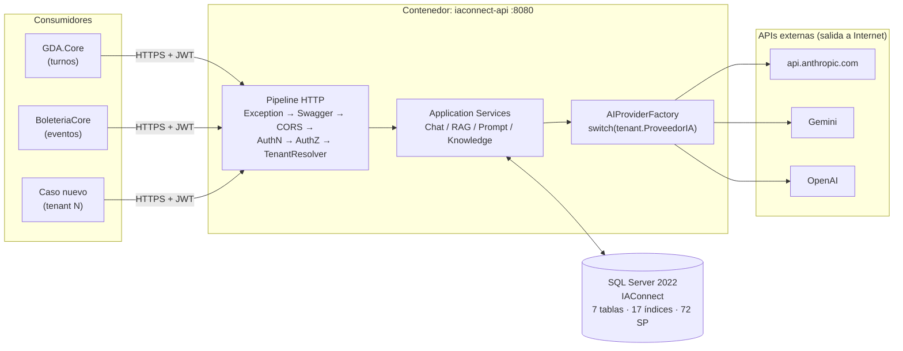

🟩 Orden real del pipeline: `UseMiddleware<GlobalExceptionMiddleware>` → `UseSwagger` → `UseSwaggerUI` → `UseCors` → `UseAuthentication` → `UseAuthorization` → `UseMiddleware<TenantResolverMiddleware>` → `MapControllers` → `MapHealthChecks("/health")` → `MapGet("/")` (`Program.cs:128-157`).

### 1.3 Tabla de navegación para agentes IA

> Sembrada deliberadamente para lectura por agentes: cada fila mapea una **intención operativa** al artefacto concreto.

| Si necesitás… | Andá a | Ruta de código/artefacto (🟩) |
|---|---|---|
| Saber si el servicio está vivo | §6 | `GET /health`, `GET /` |
| Cambiar el modelo de un tenant | §13, [06-Administrator-Guide.md](06-Administrator-Guide.md) | `lut_Tenants.Nombre_Modelo` |
| Hacer failover de proveedor | §10.1 | `IAConnect.Infrastructure/Providers/AIProviderFactory.cs:17-31` |
| Entender por qué el RAG no encuentra nada | §10.4 | `IAConnect.Application/Services/RAGEngine.cs:34-120` |
| Diagnosticar un 403 | §10.5 | `IAConnect.API/Middleware/TenantAccessFilter.cs:12-47` |
| Mapear un código HTTP a su causa | §8.4 | `IAConnect.API/Middleware/GlobalExceptionMiddleware.cs:30-57` |
| Consultar consumo de tokens | §8.3, §13 | tabla `sys_Metricas_Uso` |
| Recrear la base | §7.1 | `scripts/01_create_database.sql` |
| Ver qué variable de entorno lee realmente el código | §4.2 | `IACONNECT_ENCRYPTION_KEY` (¡solo esa!) |

### 1.4 Convención de severidad usada en runbooks

| Sev | Definición 🟨 | Ejemplo |
|-----|---------------|---------|
| **S1** | Servicio caído para todos los tenants | DB no responde; API no arranca |
| **S2** | Un tenant caído o degradación grave | Proveedor LLM del tenant caído (502 sostenido) |
| **S3** | Degradación parcial / calidad | RAG devuelve vacío; latencia alta |
| **S4** | Cosmético / deuda | Métrica con modelo desactualizado |

---

## 2. Arquitectura de despliegue

### 2.1 Contenedores (estado real)

🟩 `docker-compose.yml` define **2 servicios**: `iaconnect-api` y `sqlserver` (`docker-compose.yml:4-47`).

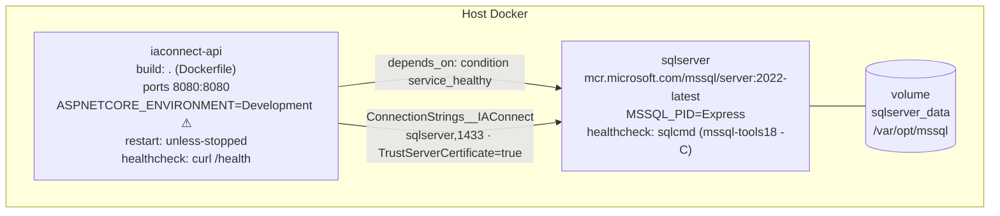

🟩 Hallazgos operativos críticos del compose:
- `ASPNETCORE_ENVIRONMENT=Development` está **hardcodeado**, no parametrizado (`docker-compose.yml`). Un `docker compose up` en un host productivo levanta la API en modo Development.
- `Encryption__Key=${ENCRYPTION_KEY:-...}` es una **variable muerta**: el código lee la env `IACONNECT_ENCRYPTION_KEY`, no `Encryption__Key` (`AIProviderFactory.cs:33-60`). Ver §5.
- Todos los defaults `:-` son **secretos de desarrollo commiteados** (JWT secret, SA password, encryption key). No se reproducen acá conforme al marco de seguridad del estudio.

### 2.2 Imagen (Dockerfile)

🟩 Multi-stage (`Dockerfile:1-38`):

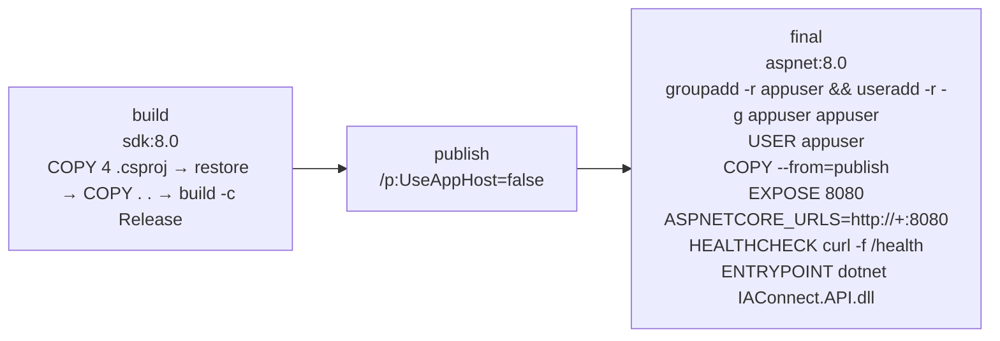

⚠ 🟩 Dos defectos de imagen que impactan operación:
1. `USER appuser` se declara **antes** del `COPY --from=publish` — los archivos copiados pueden quedar con propietario inesperado.
2. El `HEALTHCHECK` invoca `curl`, que **la imagen `aspnet:8.0` no incluye por defecto** → el healthcheck del contenedor falla siempre salvo que se instale curl. Consecuencia operativa directa: `depends_on: condition: service_healthy` y cualquier orquestador que confíe en el health de Docker considerarán la API como unhealthy aunque responda.

🟨 **Fix recomendado (propuesta, no implementada)** — instalar curl o usar el health de .NET:

```dockerfile
# PROPUESTA — no está en el Dockerfile actual
FROM mcr.microsoft.com/dotnet/aspnet:8.0 AS final
RUN apt-get update && apt-get install -y --no-install-recommends curl \
    && rm -rf /var/lib/apt/lists/*
WORKDIR /app
COPY --from=publish /app/publish .          # ← COPY ANTES de USER
RUN groupadd -r appuser && useradd -r -g appuser appuser && chown -R appuser:appuser /app
USER appuser
HEALTHCHECK --interval=30s --timeout=3s --start-period=15s --retries=3 \
  CMD curl -f http://localhost:8080/health || exit 1
ENTRYPOINT ["dotnet", "IAConnect.API.dll"]
```

### 2.3 Entornos

🟩 Verificado: **existe un solo perfil real de despliegue** (el compose de desarrollo). No hay `docker-compose.prod.yml`, ni manifiestos de Kubernetes, ni pipeline de CI/CD versionado en el repo relevado. 🟨 La matriz siguiente es la **recomendación** de este documento, no el estado actual.

| Aspecto | dev (🟩 existe) | homologación 🟨 | producción 🟨 |
|---|---|---|---|
| `ASPNETCORE_ENVIRONMENT` | `Development` (hardcodeado ⚠) | `Staging` | `Production` |
| Swagger | 🟩 **habilitado** (comentario explícito «Swagger habilitado en todos los entornos», `Program.cs:133`) | habilitado, tras auth | **deshabilitar** (ver §2.4) |
| SQL Server | contenedor `MSSQL_PID=Express` | instancia dedicada | instancia gestionada + backups |
| Secretos | defaults `:-` commiteados | vault / secret store | vault / secret store |
| `IACONNECT_ENCRYPTION_KEY` | ausente → **fallback a texto plano** ⚠ | presente | presente + rotación |
| CORS | 🟩 `["http://localhost:3000"]` (`appsettings.json`) | orígenes de homologación | orígenes reales de GDA/Boletería |
| TLS | ninguno (HTTP :8080) | terminación en proxy | terminación en proxy/ingress obligatoria |
| Réplicas | 1 | 1 | N (ver §12) |

### 2.4 Riesgo: Swagger en producción

🟩 `Program.cs:133` habilita Swagger en todos los entornos con comentario explícito. 🟦 Práctica de industria: la superficie OpenAPI pública facilita enumeración de endpoints y parámetros. 🟨 Recomendación operativa: bloquear `/swagger` en el reverse proxy para producción hasta que se condicione por entorno en código.

### 2.5 Topología de red mínima recomendada 🟨

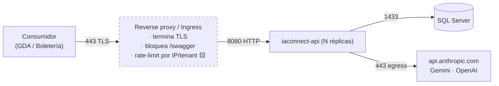

Nota 🟨: el rate-limiting **no existe** en el código (no hay middleware de throttling en el pipeline verificado en `Program.cs:128-157`); tiene que vivir en el proxy.

---

## 3. Requisitos previos e instalación

### 3.1 Prerrequisitos

| Componente | Versión | Verificación |
|---|---|---|
| Docker + Compose | v2+ | `docker --version && docker compose version` |
| .NET SDK (solo build local/tests) | 8.0 | `dotnet --version` |
| SQL Server | 2022 (🟩 imagen `2022-latest`) | ver §7 |
| `sqlcmd` (mssql-tools18) | — | 🟩 usado por el healthcheck del compose |
| Egress a Internet | 443 → endpoints de proveedores | `curl -I https://api.anthropic.com/` |

⚠ 🟩 SQL Server 2022 **no tiene tipo `VECTOR` nativo** (llegó en SQL Server 2025). Es irrelevante hoy porque el RAG es léxico (§7.5), pero condiciona cualquier plan de migración a embeddings.

### 3.2 Estructura del repositorio (lo que importa para operar)

```text
Ng-IAServices/
├── IAConnect.API/                 # Host web (Program.cs, Controllers, Middleware, appsettings.json)
│   ├── Program.cs                 # composición DI + pipeline HTTP  ← §2.1, §4
│   ├── appsettings.json           # catálogo de claves              ← §4.1
│   ├── Controllers/               # Auth, AI, Tenants, Knowledge
│   └── Middleware/                # GlobalException, TenantResolver, TenantAccessFilter
├── IAConnect.Application/         # Services (Chat, RAG, Knowledge, Prompt, Auth, Tenant), DTOs
├── IAConnect.Domain/              # Entities, Enums, Interfaces (IAIProvider)
├── IAConnect.Infrastructure/      # DataAccess/DataEntityCore.cs, DataManagers/, Providers/
├── IAConnect.ChatWidget/          # RCL Blazor embebible (consumido por GDA/Boletería)
├── IAConnect.Tests/               # 19 archivos xUnit (10 unit services, 4 integration…)
├── scripts/
│   ├── 01_create_database.sql     # 1752 líneas: 7 tablas, 17 índices, 72 SP, seeds
│   ├── run.bat / run-all.bat      # orquestación de ejecución
│   └── _hashgen/                  # utilidad que genera hashes BCrypt del seed
├── docs/                          # 49 archivos, 10 secciones (ver §15)
├── Dockerfile
└── docker-compose.yml
```

### 3.3 Instalación en 6 pasos (dev)

```bash
# 1. Clonar y ubicarse
cd Ng-IAServices

# 2. Crear el .env con secretos propios (NO usar los defaults ':-' del compose)
cat > .env <<'EOF'
SA_PASSWORD=<generar>
JWT_SECRET_KEY=<generar >=32 chars>
EOF

# 3. Levantar SQL Server primero y esperar health
docker compose up -d sqlserver
docker compose ps            # esperar 'healthy'

# 4. Crear el esquema (7 tablas, 17 índices, 72 SP, seeds)
docker compose exec -T sqlserver /opt/mssql-tools18/bin/sqlcmd \
  -S localhost -U sa -P "$SA_PASSWORD" -C -i /scripts/01_create_database.sql
#   (montar ./scripts como volumen, o usar sqlcmd desde el host)

# 5. Exportar la clave de cifrado REAL antes de arrancar la API  ← crítico, ver §5
export IACONNECT_ENCRYPTION_KEY=<32 chars>

# 6. Levantar la API
docker compose up -d iaconnect-api
docker compose logs -f iaconnect-api
```

⚠ 🟩 El paso 5 no es opcional en la práctica: sin `IACONNECT_ENCRYPTION_KEY` el alta de tenants **falla** (`TenantService.EncryptApiKey` lanza `InvalidOperationException`, `TenantService.cs:131-132`) pero la lectura **no falla** (devuelve la key tal cual, `AIProviderFactory.cs:35-39`). Asimetría explicada en §5.2.

---

## 4. Configuración: catálogo completo de claves

### 4.1 `appsettings.json` (🟩 verificado en `IAConnect.API/appsettings.json:10-38`)

| Clave | Propósito | Valor típico | ¿Secreto? | ¿La lee el código? | Estado verificado |
|---|---|---|---|---|---|
| `ConnectionStrings:IAConnect` | Cadena a SQL Server; se pasa a `DataEntityCore.Configure()` al arranque | `Server=...;Database=IAConnect;...` | **Sí** | 🟩 Sí (`Program.cs:22`) | 🟩 **vacío** en el repo |
| `Jwt:SecretKey` | Clave HMAC-SHA256 de firma/validación | ≥32 chars aleatorios | **Sí** | 🟩 Sí (`Program.cs:59-74`) | ⚠ 🟩 **NO está vacío**: contiene un literal de desarrollo commiteado (`appsettings.json:13`). Corrige al índice `05_seguridad-y-multitenant.md` |
| `Jwt:Issuer` | Emisor validado (`ValidateIssuer=true`) | `IAConnect` | No | 🟩 Sí | Fallback del emisor: `"IAConnect"` |
| `Jwt:Audience` | Audiencia validada (`ValidateAudience=true`) | `IAConnect.API` | No | 🟩 Sí | ⚠ **Divergencia**: el validador usa `IAConnect.API`, el emisor cae en `"IAConnect.Clients"` si la config falta → validación rota silenciosa (§4.4) |
| `Encryption:AesKey` | (pretendida) clave AES de la ApiKey | — | Sí | ❌ **NO** | 🟩 **CLAVE MUERTA**: nadie la lee. Vacía en el repo (`appsettings.json:23`) |
| `AIProviders.Gemini.ApiKey` | — | — | Sí | ❌ **NO** | 🟩 vacío y **no consumido** |
| `AIProviders.Claude.ApiKey` | — | — | Sí | ❌ **NO** | 🟩 vacío y **no consumido** |
| `AIProviders.OpenAI.ApiKey` | — | — | Sí | ❌ **NO** | 🟩 vacío y **no consumido** |
| `AIProviders.*.DefaultModel` | Modelo por defecto | `gemini-2.5-flash`, `claude-3-sonnet-20240229`, `gpt-4` | No | ❌ **NO** | 🟩 **ninguno se consume**: el modelo efectivo sale de `lut_Tenants.Nombre_Modelo` (`AIProviderFactory.cs:23-28`) |
| `Cors:AllowedOrigins` | Orígenes permitidos | `["http://localhost:3000"]` | No | 🟩 Sí (`UseCors`) | ⚠ hay que ampliarlo a los orígenes de GDA/Boletería en prod |

> **Regla operativa clave (🟩).** La configuración efectiva de IA **no vive en appsettings**: vive en `lut_Tenants` (proveedor, modelo, temperatura, max tokens, ApiKey cifrada, expiraciones de token, permisos de imagen, system prompt, mensaje de bienvenida). appsettings solo aporta connection string, JWT y CORS. Ver §13 y [06-Administrator-Guide.md](06-Administrator-Guide.md).

### 4.2 Variables de entorno

| Variable | Origen | ¿La lee el código? | Notas |
|---|---|---|---|
| `IACONNECT_ENCRYPTION_KEY` | env del proceso | 🟩 **SÍ — la única** | Cifra/descifra `lut_Tenants.ApiKey_IA` (AES-256-CBC-PKCS7). Ver §5 |
| `ASPNETCORE_ENVIRONMENT` | compose | 🟩 Sí (.NET) | ⚠ hardcodeado a `Development` en `docker-compose.yml` |
| `ASPNETCORE_URLS` | Dockerfile | 🟩 Sí | `http://+:8080` |
| `ConnectionStrings__IAConnect` | compose | 🟩 Sí (override de appsettings) | apunta a `sqlserver,1433`, `TrustServerCertificate=true` |
| `Jwt__SecretKey` / `Jwt__Issuer` / `Jwt__Audience` | compose | 🟩 Sí | default `:-` commiteado ⚠ |
| `Encryption__Key` | compose | ❌ **NO** | 🟩 **VARIABLE MUERTA** — trampa clásica: se setea y no hace nada |
| `SA_PASSWORD` | compose (servicio sqlserver) | 🟩 Sí (SQL Server) | default `:-` commiteado ⚠ |

### 4.3 Precedencia de configuración

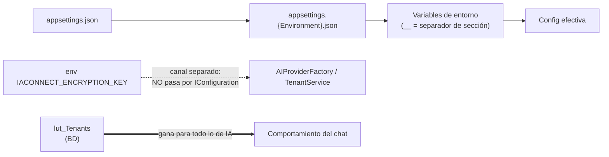

### 4.4 Checklist de configuración pre-producción 🟨

- [ ] `ConnectionStrings:IAConnect` provisto por env/vault, nunca en el archivo.
- [ ] `Jwt:SecretKey` **rotado** (el literal del repo está quemado públicamente).
- [ ] `Jwt:Issuer` y `Jwt:Audience` **explícitos** en config — no confiar en fallbacks: el emisor usa `IAConnect.Clients` y el validador `IAConnect.API`; si falta la config, ningún token valida.
- [ ] `IACONNECT_ENCRYPTION_KEY` presente **y verificada** (§5.3).
- [ ] `Encryption:AesKey` y `Encryption__Key` **eliminadas** de config/compose para evitar falsa sensación de seguridad.
- [ ] `ASPNETCORE_ENVIRONMENT=Production` (requiere parametrizar el compose).
- [ ] `Cors:AllowedOrigins` con los orígenes reales.
- [ ] `/swagger` bloqueado en el proxy.
- [ ] Nota 🟩: `ClockSkew = TimeSpan.Zero` → los relojes de API y consumidores **deben** estar sincronizados (NTP). Sin tolerancia, un skew de segundos produce 401 intermitentes.
- [ ] Nota 🟩: `IssuerSigningKey` se construye con null-forgiving (`!`) → si falta `Jwt:SecretKey`, la API muere con **NullReferenceException al arranque**, no con un mensaje claro. Síntoma de arranque conocido (§10.7).

---

## 5. Gestión de secretos y API keys de proveedores

### 5.1 Dónde vive cada secreto

| Secreto | Almacén | Protección | Riesgo operativo |
|---|---|---|---|
| API key del proveedor LLM | 🟩 `lut_Tenants.ApiKey_IA varchar(500) NOT NULL` (una por tenant) | AES-256-CBC-PKCS7, IV de 16 bytes prefijado al ciphertext, clave = env `IACONNECT_ENCRYPTION_KEY` | Fallback a texto plano en lectura (§5.2) |
| Clave de cifrado | env `IACONNECT_ENCRYPTION_KEY` | fuera de la BD | Si se pierde, **las ApiKey son irrecuperables** |
| `Jwt:SecretKey` | config/env | — | 🟩 literal de desarrollo commiteado en `appsettings.json:13` |
| Password de usuarios | 🟩 `sys_Usuarios` (BCrypt vía `AuthService`) | BCrypt | Hashes del seed generados por `scripts/_hashgen/` |
| Refresh tokens | 🟩 `sys_Refresh_Tokens.Token nvarchar(500) UNIQUE` | 64 bytes de `RandomNumberGenerator`, Base64 | Sin detección de reuso (§5.5) |
| Credenciales de ejemplo | 🟩 comentario `sqlcmd` en `scripts/01_create_database.sql:1-8` | ninguna | ⚠ en claro en el repo; **no se reproducen acá** conforme al marco §5.4/§14 |

### 5.2 GAP-ENC-FALLBACK — la asimetría crítica

🟩 Verificado en fuente: la escritura y la lectura de la ApiKey **no se comportan igual** ante la ausencia de la clave de cifrado.

| Operación | Código | Sin `IACONNECT_ENCRYPTION_KEY` |
|---|---|---|
| **Escribir** (alta/edición de tenant) | `TenantService.EncryptApiKey` (`TenantService.cs:129-138`) | 🟩 **lanza `InvalidOperationException`** — no permite guardar en claro |
| **Leer** (cada request de chat) | `AIProviderFactory.DecryptApiKey` (`AIProviderFactory.cs:33-60`) | 🟩 **`return encryptedKey` tal cual**, asumiendo texto plano — comentario en fuente: «En desarrollo: si no hay clave de encriptación, asumir key en texto plano» |

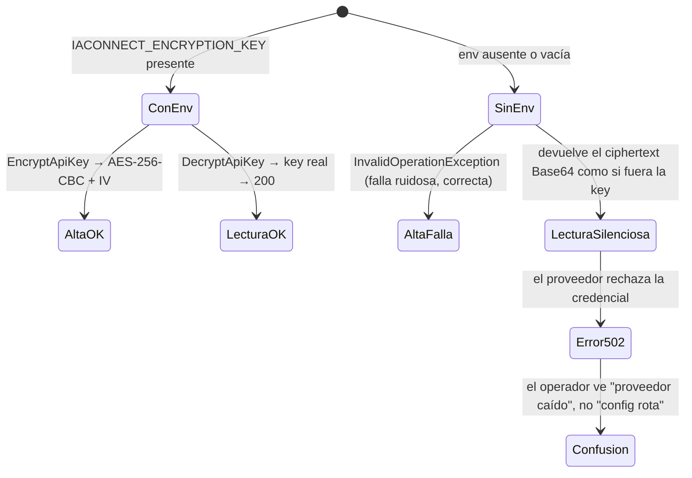

🟨 **Consecuencia operativa (GAP-ENC-FALLBACK).** Si la env se pierde tras el alta (redeploy que la omite, rotación mal hecha, nodo nuevo sin la variable), el sistema **no falla al arrancar**: usa el ciphertext Base64 como API key y el error emerge como **502**, no como error de configuración. Es el falso positivo más caro de este servicio: dispara el runbook equivocado (§10.1 «proveedor caído») cuando el problema es §10.6.

🟨 **Regla de oro:** antes de declarar «proveedor caído», ejecutá **siempre** el check de §5.3.

### 5.3 Check de 10 segundos: ¿está la clave de cifrado?

```bash
# ¿La variable existe DENTRO del contenedor? (no en tu shell)
docker compose exec iaconnect-api printenv IACONNECT_ENCRYPTION_KEY | wc -c
# 0  → GAP-ENC-FALLBACK ACTIVO: todo 502 de proveedor es sospechoso de config
# >1 → clave presente; el 502 sí puede ser del proveedor

# Trampa frecuente: esta NO sirve para nada
docker compose exec iaconnect-api printenv Encryption__Key   # ← variable MUERTA
```

🟨 **Recomendación no implementada:** *fail-fast* al arranque si falta la env fuera de Development.

```csharp
// PROPUESTA — no existe en Program.cs
var encKey = Environment.GetEnvironmentVariable("IACONNECT_ENCRYPTION_KEY");
if (string.IsNullOrWhiteSpace(encKey) && !builder.Environment.IsDevelopment())
    throw new InvalidOperationException(
        "IACONNECT_ENCRYPTION_KEY ausente fuera de Development: las ApiKey de tenant se " +
        "usarían como texto plano y fallarían con 502 en runtime (GAP-ENC-FALLBACK).");
```

### 5.4 Rotación de API key de proveedor

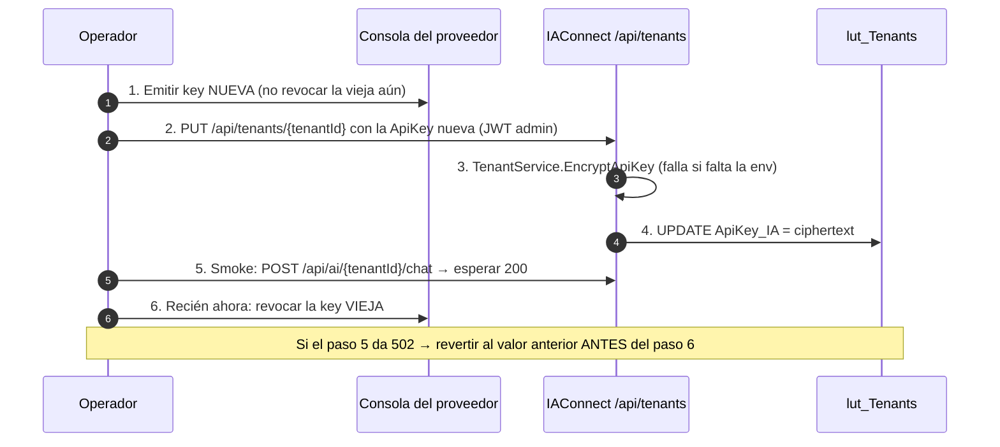

🟩 No hay caché de tenant en proceso: `TenantResolverMiddleware` y cada servicio releen `lut_Tenants` por request (§12.2). 🟨 Efecto positivo colateral: la rotación de key **toma efecto sin reiniciar** el servicio.

### 5.5 Rotación de la clave de cifrado 🟨

⚠ **No hay procedimiento implementado** (no existe versionado de clave ni re-cifrado masivo). Rotar la env sin más **rompe todos los tenants**: los ciphertext viejos no descifran con la clave nueva y el fallback **no** aplica (hay clave, solo que la equivocada) → 502 masivo.

Procedimiento manual mínimo propuesto:
1. Ventana de mantenimiento (§14).
2. Exportar las ApiKey descifradas con la clave **vieja** (script ad-hoc reusando la lógica de `AIProviderFactory.DecryptApiKey`).
3. Cambiar la env en **todas** las réplicas.
4. Re-alta de cada ApiKey vía `PUT /api/tenants/{tenantId}` (re-cifra con la nueva).
5. Smoke por tenant (§6.3).
6. Destruir el export intermedio.

### 5.6 Reglas de higiene 🟦

- Nunca loguear la ApiKey ni el ciphertext. 🟩 El código no las loguea en las rutas verificadas.
- ⚠ 🟩 **Sí se filtra detalle del proveedor**: `ClaudeProvider` incrusta el `errorBody` crudo de la API de Anthropic en el mensaje de `ProviderUnavailableException` (`ClaudeProvider.cs:175-243`) y `GlobalExceptionMiddleware` devuelve crudos los mensajes de las excepciones <500 y del 502 (`GlobalExceptionMiddleware.cs:30-57`). 🟨 Recomendación: sanitizar el 502 y dejar el body del proveedor solo en el log.
- Sacar del repo los secretos de desarrollo commiteados (literal JWT, defaults `:-`, credenciales del encabezado del script SQL).
- 🟩 Sobre refresh tokens: `RefreshAsync` **rota** (revoca el actual y emite par nuevo) y valida `Revocado` + `Fecha_Expiracion`; `LogoutAsync` revoca solo si el token pertenece al `userId` (`AuthService.cs:42-186`). ⚠ **No hay detección de reuso**: presentar un refresh token ya revocado no invalida la familia. 🟦 La práctica establecida (OAuth 2.0 BCP) es invalidar toda la familia ante reuso.

---

## 6. Puesta en marcha y verificación de salud

### 6.1 Endpoints de salud (🟩 `Program.cs:128-157`)

| Endpoint | Qué devuelve | Uso |
|---|---|---|
| `GET /health` | health check de ASP.NET (`MapHealthChecks("/health")`) | liveness/readiness del orquestador |
| `GET /` | 🟩 `{Status="Running", Service="IAConnect API", Version="1.0.0"}`, con `ExcludeFromDescription` | ping humano / verificar versión desplegada |
| `GET /swagger` | UI OpenAPI | ⚠ 🟩 habilitado en **todos** los entornos |

🟨 Limitación: no está verificado que `/health` compruebe la **base de datos** ni la conectividad al proveedor. Tratalo como *liveness del proceso*, no como *readiness del sistema*. Recomendación: agregar un check de SQL Server y un check *degraded* para `IACONNECT_ENCRYPTION_KEY` (§5.3).

### 6.2 Secuencia de arranque

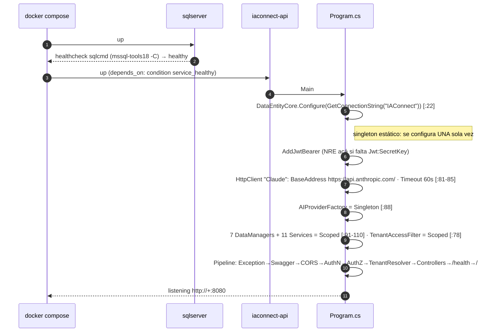

⚠ 🟩 `DataEntityCore` es un **singleton estático configurado una vez** (`Program.cs:22`). Operativamente: **la cadena de conexión no se puede cambiar en caliente**; todo cambio requiere reinicio del contenedor.

🟩 `public partial class Program {}` al final (`Program.cs:157`) existe para habilitar `WebApplicationFactory` en los tests de integración — no tocarlo.

### 6.3 Checklist de smoke test post-deploy

> Ejecutar **en orden**. Cortar y aplicar el runbook indicado ante el primer fallo.

| # | Paso | Comando | Aceptación | Si falla |
|---|---|---|---|---|
| 1 | Contenedores arriba | `docker compose ps` | ambos `Up`; ⚠ ignorar el health de `iaconnect-api` (curl faltante, §2.2) | §10.7 |
| 2 | Proceso vivo | `curl -fsS http://localhost:8080/` | `{"Status":"Running",...,"Version":"1.0.0"}` | §10.7 |
| 3 | Health | `curl -fsS http://localhost:8080/health` | 200 | §10.7 |
| 4 | Clave de cifrado | `docker compose exec iaconnect-api printenv IACONNECT_ENCRYPTION_KEY \| wc -c` | `>1` | §10.6 |
| 5 | BD + esquema | `sqlcmd ... -Q "SELECT COUNT(*) FROM lut_Tenants"` | ≥1 | §10.8 |
| 6 | Login | `POST /api/auth/login` | 200 + access y refresh token | §10.9 |
| 7 | Corte de tenant | `GET/POST /api/ai/{otroTenant}/chat` con JWT rol `operador` | **403** `{"error":"No tiene acceso a este tenant."}` | §10.5 |
| 8 | Tenant inexistente | ruta con `{tenantId}` falso | **404** `{"error":"Tenant no encontrado o inactivo"}` | §10.8 |
| 9 | **Chat end-to-end** | `POST /api/ai/{tenantId}/chat` | 200 + `Response` no vacío + `TotalTokens>0` | §10.1 / §10.6 |
| 10 | Métrica persistida | `SELECT TOP 1 * FROM sys_Metricas_Uso ORDER BY Fecha_Solicitud DESC` | fila del paso 9, `Duracion_Ms>0` | §10.8 |
| 11 | RAG con contenido | chat con pregunta cubierta por la KB | la respuesta usa el contexto | §10.4 |
| 12 | Historial | segundo turno con el mismo `SessionId` | continuidad + 2 filas nuevas en `sys_Mensajes` | §10.8 |

Plantilla de los pasos 6 y 9:

```bash
TOKEN=$(curl -fsS -X POST http://localhost:8080/api/auth/login \
  -H 'Content-Type: application/json' \
  -d '{"nombreUsuario":"<usuario>","password":"<password>"}' | jq -r '.accessToken')

curl -fsS -X POST "http://localhost:8080/api/ai/<tenantId>/chat" \
  -H "Authorization: Bearer $TOKEN" -H 'Content-Type: application/json' \
  -d '{"message":"¿Cómo saco un turno?"}' | jq
```

⚠ 🟩 `ChatRequestDto{SessionId string?, Message string = "", ImageBase64 string?}` **no tiene DataAnnotations**: un `message` vacío pasa la validación de `[ApiController]` y llega al proveedor (gasto de tokens sin sentido). No lo uses como "ping barato" — para eso está `/health`.

### 6.4 Smoke test de un caso de éxito nuevo

🟨 Al montar un tenant nuevo (ver [06-Administrator-Guide.md](06-Administrator-Guide.md)), el mínimo es: pasos 4, 7, 9, 10 y 11 de §6.3 contra el `tenantId` nuevo, con una pregunta cuya respuesta **solo** pueda salir de la KB cargada (Boletería: *«¿por qué no se publicó mi evento?»*; GDA: *«¿qué documentación piden para el turno de licencia?»*). Si contesta bien **sin** KB cargada, el modelo está alucinando y el RAG no aportó nada → §10.4.

---

## 7. Base de datos: scripts, índices, mantenimiento, retención

### 7.1 Script único de creación

🟩 `scripts/01_create_database.sql` (**1752 líneas**) crea 7 tablas, 17 índices, 72 stored procedures y siembra datos de demo.

| Rango | Contenido (🟩) |
|---|---|
| `1-8` | ⚠ encabezado con servidor/usuario/password de ejemplo **en claro** en el comentario de ejecución `sqlcmd` — no se reproducen acá |
| `31-53` | DDL `lut_Tenants` |
| `58-196` | DDL `sys_Usuarios`, `sys_Sesiones`, `sys_Mensajes`, `sys_Fragmentos_Conocimiento`, `sys_Metricas_Uso` (`154-176`), `sys_Refresh_Tokens` |
| `203-1440` | 17 índices + 72 SP (los `INSERT` de este rango son **cuerpos de los `SP_*_Add`**, no seeds) |
| `1456, 1486, 1593, 1624` | seeds `INSERT INTO lut_Tenants` (4+ tenants de demo) |
| `1520, 1543, 1566, 1660, 1684, 1708` | seeds `INSERT INTO sys_Usuarios` (6 usuarios de demo) |

⚠ **Operativo:** los seeds crean tenants y usuarios de demo con hashes BCrypt generados por `scripts/_hashgen/`. En producción, ejecutar el DDL **sin** el bloque de seeds, o dar de baja esos usuarios y rotar sus passwords de inmediato. `run.bat` / `run-all.bat` orquestan la ejecución; `output.txt` es la salida de una corrida previa (no es artefacto de despliegue).

🟨 **No hay sistema de migraciones.** 🟩 La persistencia **no usa EF Core** (patrón propietario DataEntity-DataManager), así que no existe `dotnet ef migrations`. Todo cambio de esquema es un script SQL manual, versionado a mano, y debe respetar §7.3.

### 7.2 Modelo de datos

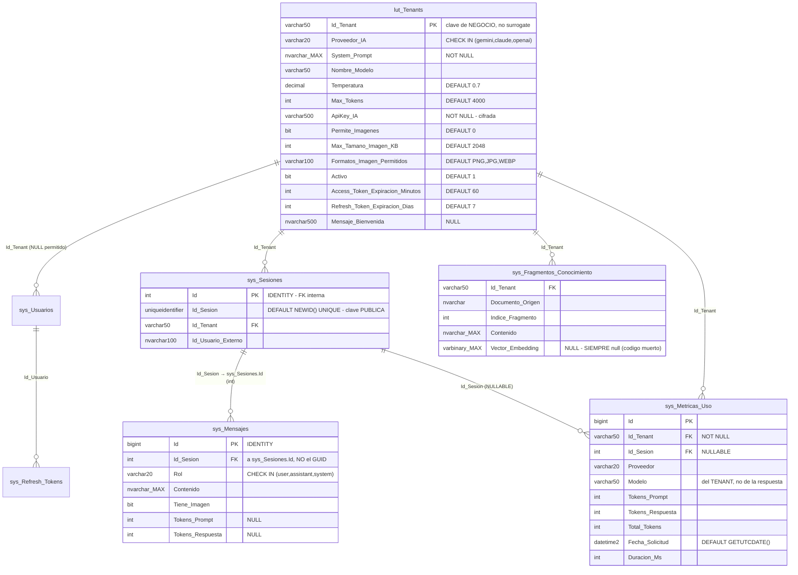

⚠ 🟩 **Trampa de consultas ad-hoc:** las FK de `sys_Mensajes` y `sys_Metricas_Uso` apuntan al **`Id` int interno** de `sys_Sesiones`, **no** al GUID público `Id_Sesion`. El GUID es solo la clave de cara al cliente. Todo join manual pasa por `sys_Sesiones`:

```sql
SELECT m.*
FROM   sys_Mensajes m
JOIN   sys_Sesiones s ON s.Id = m.Id_Sesion              -- int ↔ int
WHERE  s.Id_Sesion = '<GUID que reportó el usuario>'      -- GUID solo acá
ORDER BY m.Fecha_Envio;
```

### 7.3 Índices y stored procedures: el espejo 1:1

🟩 17 índices no-clustered:

| Tabla | Índices |
|---|---|
| `lut_Tenants` | `Proveedor_IA`, `Activo` |
| `sys_Usuarios` | `Id_Tenant`, `Rol`, `Activo` |
| `sys_Sesiones` | `Id_Tenant`, `Activo`, `Id_Tenant_Activo` |
| `sys_Mensajes` | `Id_Sesion` |
| `sys_Fragmentos_Conocimiento` | `Id_Tenant`, `Id_Tenant_Documento_Origen` |
| `sys_Metricas_Uso` | `Id_Tenant`, `Id_Sesion`, `Fecha_Solicitud`, `Id_Tenant_Proveedor` |
| `sys_Refresh_Tokens` | `Id_Usuario`, `Revocado` |

🟩 **Regla estructural (crítica para mantenimiento):** los 72 SP son un **espejo 1:1 de los índices**. Cada tabla tiene `Add/Update/Delete/GetAll/GetOne` + un par `GetBy_<idx>` / `GetBy_<idx>_Cantidad` **por cada índice declarado**. `DataEntityCore` resuelve el SP **por convención de string**: `SP_{Tabla}_{Op}` y `SP_{Tabla}_GetBy_{indexName}[_Cantidad]` (`DataEntityCore.cs:33-256`).

⚠ **Consecuencia operativa:** *dropear un índice sin dropear su par de SP —o al revés— rompe el acceso a datos en runtime, no en compilación*. El cliente verá un **500** genérico («Error interno del servidor.»). Índice y SP se tocan **siempre juntos**.

🟩 Además `DataEntityCore.ExecuteAsync` invoca `SqlCommandBuilder.DeriveParameters(cmd)` en **cada llamada** → **round-trip extra a la BD por operación**, y asigna los parámetros **posicionalmente** saltando `@RETURN_VALUE`. El mapeo reader→POCO es por **reflexión case-insensitive** con `Convert.ChangeType`. ⚠ Operativamente:
- el tráfico a la BD es ~2x el aparente (§12.2);
- **cambiar el ORDEN de los parámetros de un SP corrompe los datos silenciosamente** (los valores caen en la columna equivocada, sin error);
- **renombrar una columna** sin renombrar la propiedad deja el campo en su default, **sin error**.

🟩 `DataEntityCore` soporta un `SqlTransaction` externo opcional — relevante para §10.8 y para el defecto de atomicidad de `ChatService` (§8.5).

### 7.4 Mantenimiento rutinario 🟦/🟨

| Tarea | Frecuencia 🟨 | Comando |
|---|---|---|
| Rebuild/reorg de índices | semanal | `ALTER INDEX ALL ON sys_Mensajes REORGANIZE;` (>30% frag → `REBUILD`) |
| Actualizar estadísticas | semanal | `EXEC sp_updatestats;` |
| Verificar integridad | semanal | `DBCC CHECKDB('IAConnect') WITH NO_INFOMSGS;` |
| Purga de refresh tokens | diaria | §7.5 |
| Purga de sesiones/mensajes | mensual | §7.5 |
| Deduplicar fragmentos | ad-hoc | §7.6 |
| Verificar crecimiento | semanal | `sp_spaceused 'sys_Mensajes'` |

⚠ 🟩 `MSSQL_PID=Express` en el compose: Express tiene **límite de 10 GB por base**. `sys_Mensajes.Contenido nvarchar(MAX)` y `sys_Fragmentos_Conocimiento.Contenido nvarchar(MAX)` son las que lo van a consumir. Para producción, cambiar de edición (§12.4).

### 7.5 Retención de datos

⚠ 🟩 **No existe política de retención implementada**: no hay purga, ni TTL, ni job. Las 4 tablas de alto crecimiento (`sys_Mensajes`, `sys_Sesiones`, `sys_Metricas_Uso`, `sys_Refresh_Tokens`) crecen **sin límite**.

🟨 Política recomendada (no implementada; ajustar a la normativa del consumidor — GDA es gobierno digital y puede tener requisitos propios de conservación):

| Tabla | Retención sugerida 🟨 | Razón |
|---|---|---|
| `sys_Refresh_Tokens` | 30 días tras `Fecha_Expiracion` o `Revocado=1` | ya no sirven; solo son superficie de ataque |
| `sys_Mensajes` | 90 días | contiene **contenido del usuario** (posible dato personal) |
| `sys_Sesiones` | 90 días (con sus mensajes) | ídem |
| `sys_Metricas_Uso` | 24 meses (agregar a mensual antes de purgar) | costos y capacidad se analizan interanualmente |

```sql
-- PROPUESTA (no implementada). Ventana de baja carga, por lotes.
-- Orden obligatorio: hijos antes que padres.

-- 1) Refresh tokens vencidos/revocados (IX_sys_Refresh_Tokens_Revocado)
DELETE TOP (5000) FROM sys_Refresh_Tokens
WHERE (Revocado = 1 OR Fecha_Expiracion < DATEADD(DAY, -30, GETUTCDATE()));

-- 2) Métricas: DESREFERENCIAR antes de borrar sesiones (Id_Sesion es NULLABLE)
UPDATE sys_Metricas_Uso SET Id_Sesion = NULL
WHERE Id_Sesion IN (SELECT Id FROM sys_Sesiones
                    WHERE Fecha_Ultima_Actividad < DATEADD(DAY, -90, GETUTCDATE()));

-- 3) Mensajes de sesiones viejas (IX_sys_Mensajes_Id_Sesion)
DELETE TOP (5000) m FROM sys_Mensajes m
JOIN sys_Sesiones s ON s.Id = m.Id_Sesion
WHERE s.Fecha_Ultima_Actividad < DATEADD(DAY, -90, GETUTCDATE());

-- 4) Sesiones ya vacías
DELETE TOP (5000) FROM sys_Sesiones
WHERE Fecha_Ultima_Actividad < DATEADD(DAY, -90, GETUTCDATE())
  AND Id NOT IN (SELECT DISTINCT Id_Sesion FROM sys_Mensajes);

-- 5) Métricas fuera de ventana (IX_sys_Metricas_Uso_Fecha_Solicitud)
DELETE TOP (5000) FROM sys_Metricas_Uso
WHERE Fecha_Solicitud < DATEADD(MONTH, -24, GETUTCDATE());
```

🟩 Que `sys_Metricas_Uso.Id_Sesion` sea **nullable por diseño** (los endpoints `completion/analyze/summarize/improve` no tienen sesión) es lo que **habilita** el paso 2: se pueden purgar conversaciones **conservando** el histórico de costos. Es la propiedad más útil del esquema para retención.

### 7.6 Mantenimiento de la base de conocimiento

⚠ 🟩 **Recargar el mismo documento DUPLICA los fragmentos**: `KnowledgeService.UploadDocumentAsync` **no borra los fragmentos previos** ni deduplica por `Documento_Origen` (`KnowledgeService.cs:34-101`). Cada `POST /api/tenants/{tenantId}/knowledge` inserta un juego completo nuevo.

Impacto: el RAG recupera duplicados → el contexto se llena de repeticiones → **más tokens, peor calidad, más costo**. Es la causa #1 de degradación silenciosa tras varias cargas.

```sql
-- Detección de duplicados por documento
SELECT Id_Tenant, Documento_Origen, COUNT(*) AS Fragmentos,
       COUNT(DISTINCT Indice_Fragmento) AS IndicesDistintos
FROM   sys_Fragmentos_Conocimiento
GROUP BY Id_Tenant, Documento_Origen
HAVING COUNT(*) > COUNT(DISTINCT Indice_Fragmento);   -- hay recarga duplicada
```

🟨 Procedimiento de recarga limpia (workaround hasta que exista dedupe en código):
1. `SELECT` de control (query anterior) + backup lógico del documento.
2. `DELETE FROM sys_Fragmentos_Conocimiento WHERE Id_Tenant=@t AND Documento_Origen=@d;` (usa `IX_sys_Fragmentos_Conocimiento_Id_Tenant_Documento_Origen`).
3. `POST` del documento actualizado.
4. Verificar `chunksCreated` de la respuesta contra el conteo en tabla.
5. Smoke de RAG (§6.4).

🟩 Nota: `Vector_Embedding` está **siempre en NULL** y no lo consume nadie (`KnowledgeService.cs:75`). No lo incluyas en ningún plan de mantenimiento ni te alarmes por verlo vacío. Detalle en §8.6 y en [04-ADR.md](04-ADR.md).

---

## 8. Observabilidad

### 8.1 Panorama: qué señales existen realmente

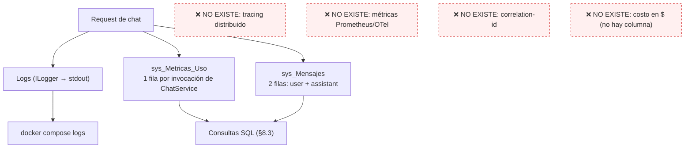

⚠ 🟨 **La observabilidad real de IAConnect es: logs a stdout + una tabla SQL.** No hay endpoint de métricas, ni OpenTelemetry, ni correlation-id verificados. Todo dashboard/alerta de §9 se construye sobre consultas a `sys_Metricas_Uso` + parsing de logs. Es una limitación de fondo a asumir en el diseño del monitoreo.

### 8.2 Qué loguea el código (🟩 verificado)

| Evento | Nivel | Contenido | Fuente |
|---|---|---|---|
| Chat completado | `Information` | tenant, provider, tokens, duration | `ChatService.cs:175-177` |
| Excepción ≥500 | `LogError` **con stack** | excepción completa | `GlobalExceptionMiddleware.cs:30-57` |
| Excepción <500 | `LogWarning` (sin stack) | mensaje | `GlobalExceptionMiddleware.cs:30-57` |

🟨 Consecuencias prácticas:
- Un **401/403/404/423/400** aparece como *Warning*, no como *Error*: si tu alerting solo mira `level=Error`, **no vas a ver** ni el lockout de cuentas ni los 403 de tenant. Alertá también sobre Warnings (§9).
- El **502** de proveedor **sí** es Error (≥500) y arrastra el `errorBody` crudo del proveedor al log **y al cliente** (§5.6).
- 🟨 No hay log del **inicio** del request ni del ID de sesión en el log de chat verificado → correlacionar un reclamo de usuario con un log exige pasar por `sys_Mensajes`/`sys_Sesiones`.

```bash
# Recolección básica
docker compose logs -f --since 15m iaconnect-api
docker compose logs --since 1h iaconnect-api | grep -i "ProviderUnavailable"
docker compose logs --since 1h iaconnect-api | grep -iE "warn|error" | sort | uniq -c | sort -rn
```

🟨 Recomendación: enviar stdout a un agregador (Loki/ELK/CloudWatch) con retención ≥30 días; sin eso, `docker compose logs` se pierde en cada redeploy.

### 8.3 `sys_Metricas_Uso`: la fuente de verdad operativa

🟩 `ChatService` inserta **una fila por invocación** (`ChatService.cs:118,152-168`) con: `Id_Tenant`, `Id_Sesion` (Id int interno), `Proveedor` = `aiResponse.Provider`, `Modelo` = **`tenant.NombreModelo`**, `Tokens_Prompt`/`Tokens_Respuesta` de la respuesta, `Total_Tokens` (suma calculada en C#), `Tiene_Imagen`, `Fecha_Solicitud=UtcNow`, `Duracion_Ms`.

⚠ **Tres advertencias que cambian cómo se leen estos números:**

| Advertencia | Detalle 🟩 | Impacto operativo |
|---|---|---|
| **`Modelo` puede mentir** | se toma del **TENANT**, no de la respuesta real del proveedor. 🟩 `AIResponse` **no expone** el modelo usado ni la latencia (`IAIProvider.cs:5-71`) | si el proveedor hace fallback de modelo, la métrica reporta el modelo configurado, no el facturado → **el cálculo de costo se desvía** (§13) |
| **`Duracion_Ms` NO es la latencia del request** | 🟩 el `Stopwatch` **se detiene en `:118`**, justo tras la llamada al proveedor y **antes** de las 3 inserciones | mide **latencia del proveedor**, no la del usuario. El p95 real percibido es mayor: falta RAG previo + 3 INSERT + 1 UPDATE |
| **Solo cubre `chat`** | 🟩 `Id_Sesion` es NULLABLE porque `completion/analyze/summarize/improve` no tienen sesión; y 🟩 solo `Chat` recibe `userId` (`AIController.cs:12-134`) | **no hay trazabilidad de usuario** en los otros 4 endpoints |

⚠ 🟩 **No hay columna de costo ni de usuario** en `sys_Metricas_Uso`. El costo se calcula fuera (§13).

Consultas de operación:

```sql
-- (1) Salud de las últimas 2h por tenant y proveedor
SELECT Id_Tenant, Proveedor, Modelo,
       COUNT(*)                       AS Requests,
       AVG(Duracion_Ms)               AS Prom_ms_proveedor,
       MAX(Duracion_Ms)               AS Max_ms,
       SUM(Total_Tokens)              AS Tokens,
       AVG(CAST(Tokens_Prompt AS float)) AS Prom_tokens_prompt
FROM   sys_Metricas_Uso
WHERE  Fecha_Solicitud >= DATEADD(HOUR, -2, GETUTCDATE())
GROUP BY Id_Tenant, Proveedor, Modelo
ORDER BY Requests DESC;

-- (2) p95 de latencia de proveedor por tenant (últimas 24h)
SELECT DISTINCT Id_Tenant,
       PERCENTILE_CONT(0.95) WITHIN GROUP (ORDER BY Duracion_Ms)
         OVER (PARTITION BY Id_Tenant) AS p95_ms
FROM   sys_Metricas_Uso
WHERE  Fecha_Solicitud >= DATEADD(DAY, -1, GETUTCDATE());

-- (3) Tokens por día y tenant (base del control de costos, §13)
SELECT CAST(Fecha_Solicitud AS date) AS Dia, Id_Tenant, Proveedor, Modelo,
       SUM(Tokens_Prompt) AS Prompt, SUM(Tokens_Respuesta) AS Respuesta,
       SUM(Total_Tokens)  AS Total,  COUNT(*) AS Requests
FROM   sys_Metricas_Uso
WHERE  Fecha_Solicitud >= DATEADD(DAY, -30, GETUTCDATE())
GROUP BY CAST(Fecha_Solicitud AS date), Id_Tenant, Proveedor, Modelo
ORDER BY Dia DESC, Total DESC;

-- (4) Señal de alarma de costo: ratio prompt/respuesta anómalo
--     (prompt inflado = KB duplicada §7.6, o historial duplicado §8.5)
SELECT Id_Tenant,
       AVG(CAST(Tokens_Prompt AS float)) AS Prom_prompt,
       AVG(CAST(Tokens_Respuesta AS float)) AS Prom_respuesta,
       AVG(CAST(Tokens_Prompt AS float)) / NULLIF(AVG(CAST(Tokens_Respuesta AS float)),0) AS Ratio
FROM   sys_Metricas_Uso
WHERE  Fecha_Solicitud >= DATEADD(DAY, -7, GETUTCDATE())
GROUP BY Id_Tenant
ORDER BY Ratio DESC;
```

### 8.4 Mapa de códigos HTTP → causa → runbook

🟩 `GlobalExceptionMiddleware.HandleExceptionAsync` usa un switch expression (`GlobalExceptionMiddleware.cs:30-57`); body = `{error, statusCode}`.

| HTTP | Excepción 🟩 | Causa típica | Runbook |
|---|---|---|---|
| **400** | `ImageNotAllowedException` | imagen no permitida / formato / tamaño (`ImageValidator.cs:16-48`) | §10.10 |
| **400** | `ArgumentException` | formato de archivo no soportado en KB; **proveedor no soportado** en el tenant | §10.4 / §10.6 |
| **401** | `InvalidCredentialsException` | credenciales o «Usuario desactivado.» | §10.9 |
| **403** | *(no es excepción)* `TenantAccessFilter` devuelve `ObjectResult` | operador pidiendo otro tenant | §10.5 |
| **404** | `TenantNotFoundException` / `TenantResolverMiddleware` | tenant inexistente **o inactivo** | §10.8 |
| **423** | `AccountLockedException` | 5 intentos fallidos → 15 min | §10.9 |
| **500** | *default* → «Error interno del servidor.» | BD caída, SP faltante, ⚠ **token inválido** (ver abajo) | §10.7/§10.8 |
| **502** | `ProviderUnavailableException` | proveedor caído **o GAP-ENC-FALLBACK** | §10.1 **y** §10.6 |

⚠ 🟩 **Bug de diagnóstico a memorizar:** `AIController.GetUserId()` lanza `UnauthorizedAccessException("Token inválido.")`, y esa excepción **no está en el switch** del middleware → cae en el default y devuelve **500, no 401** (`AIController.cs:12-134`). Un pico de 500 en `/api/ai/*` **no es necesariamente la BD**: puede ser un JWT sin claim `sub`/`NameIdentifier` parseable. Chequealo antes de escalar a DBA.

🟩 `AccountLocked` es **423** literal (no existe `HttpStatusCode.Locked` en el enum usado) y `ProviderUnavailable` es **502 exclusivamente** (el índice `05_seguridad-y-multitenant.md` decía «502/503 (verificar)» — queda corregido acá).

### 8.5 Defectos conocidos que se ven en las métricas

| Defecto 🟩 | Firma observable | Efecto |
|---|---|---|
| **Historial duplicado en el prompt** | `Tokens_Prompt` crece ~2x con la longitud de la conversación | 🟩 `ChatService.cs:102` pasa `history` a `BuildSystemPromptAsync` (lo embebe como texto bajo `[HISTORIAL DE CONVERSACIÓN]`) **y** `:112` lo pasa otra vez como `ConversationHistory`, que `ClaudeProvider.BuildMessages` vuelca como mensajes reales (`ClaudeProvider.cs:124-134`), mientras el system prompt viaja en el campo `system` (`:183`). **Cada turno previo se envía DOS veces** → duplica el costo del historial |
| **Sin transacción** | mensajes sin métrica, o `user` sin `assistant` | 🟩 los 3 INSERT + el UPDATE de sesión son autónomos (`ChatService.cs:107-149`). `DataEntityCore` **soporta** `SqlTransaction` opcional pero `ChatService` **no lo usa** |
| **Mensaje del usuario se pierde si el provider falla** | conversación con "huecos" tras un 502 | 🟩 los INSERT están **después** de la llamada al proveedor: si lanza, el mensaje del usuario **nunca se persiste** |
| **`ChunkSizeTokens` mal nombrado** | `Tokens_Prompt` mayor al presupuestado | 🟩 la unidad real es la **palabra**, no el token (`KnowledgeService.cs:16-17,103-121`). 🟨 400 palabras ≈ 520-600 tokens en español → el presupuesto de contexto se **subestima ~30-50%** |

```sql
-- Detección de inconsistencia por falta de transacción (§8.5)
SELECT s.Id_Sesion, s.Id_Tenant,
       SUM(CASE WHEN m.Rol='user' THEN 1 ELSE 0 END)      AS MsgUser,
       SUM(CASE WHEN m.Rol='assistant' THEN 1 ELSE 0 END)  AS MsgAssistant,
       (SELECT COUNT(*) FROM sys_Metricas_Uso mu WHERE mu.Id_Sesion = s.Id) AS Metricas
FROM   sys_Sesiones s
JOIN   sys_Mensajes m ON m.Id_Sesion = s.Id
WHERE  s.Fecha_Ultima_Actividad >= DATEADD(DAY, -1, GETUTCDATE())
GROUP BY s.Id, s.Id_Sesion, s.Id_Tenant
HAVING SUM(CASE WHEN m.Rol='user' THEN 1 ELSE 0 END)
    <> SUM(CASE WHEN m.Rol='assistant' THEN 1 ELSE 0 END);   -- desbalanceo = fallo intermedio
```

### 8.6 Lo que NO hay que monitorear (para no perder tiempo)

| Cosa | Por qué es ruido |
|---|---|
| `Vector_Embedding` vacío | 🟩 siempre NULL por diseño actual: `KnowledgeService.cs:75` escribe `null` y `RAGEngine.SerializeEmbedding` (`:122-127`) **no lo invoca nadie**. No existe cliente de embeddings ni coseno en la solución. El RAG **hoy** es puramente léxico |
| `Encryption:AesKey` / `Encryption__Key` | 🟩 claves **muertas**: ningún código las lee |
| `AIProviders.*.DefaultModel` en appsettings | 🟩 **no se consumen**: el modelo sale de `lut_Tenants.Nombre_Modelo` |
| Divergencia con `docs/05_arquitectura_tecnica/rag-spec_v1.0.md` | 🟩 el spec describe embeddings + coseno con threshold 0.75; el código implementa TF-IDF. **Gana el código**; el spec está desalineado |
| Health del contenedor `iaconnect-api` en Docker | 🟩 falla por falta de `curl` en la imagen (§2.2), no por el servicio |

### 8.7 Dashboard mínimo sugerido 🟨

| Panel | Query base | Por qué |
|---|---|---|
| Requests/min por tenant | §8.3 (1) | detección de picos y de tenants ruidosos |
| p95 `Duracion_Ms` por proveedor | §8.3 (2) | ⚠ recordar: es latencia **del proveedor** |
| Tokens/día por tenant y modelo | §8.3 (3) | insumo de §13 |
| Ratio prompt/respuesta | §8.3 (4) | detecta KB duplicada e historial duplicado |
| Tasa de 502 / total | logs | caída de proveedor o GAP-ENC |
| Warnings 401/403/423 | logs | ataque de credenciales, config de tenant mal |
| Tamaño de `sys_Mensajes` | `sp_spaceused` | límite de 10 GB de Express |
| Fragmentos por tenant | `sys_Fragmentos_Conocimiento` | costo del RAG (§12.1) |

---

## 9. Alertas sugeridas y umbrales

> 🟨 **Todo este capítulo es recomendación NO implementada.** No hay alerting configurado en el repo relevado. Los umbrales son puntos de partida a calibrar con 2 semanas de línea base de `sys_Metricas_Uso`.

| # | Alerta | Condición 🟨 | Sev | Runbook |
|---|---|---|---|---|
| A1 | API caída | `/health` no 200 por 2 checks (60s) | S1 | §10.7 |
| A2 | BD no responde | 500 en ráfaga + fallo de `SELECT 1` | S1 | §10.8 |
| A3 | Proveedor caído | tasa de 502 > 20% en 5 min para un tenant | S2 | §10.1 (**antes**: §5.3) |
| A4 | GAP-ENC-FALLBACK | 502 sostenido **y** `IACONNECT_ENCRYPTION_KEY` ausente | S2 | §10.6 |
| A5 | Latencia alta | p95 `Duracion_Ms` > 8000 ms por 10 min | S3 | §10.2 |
| A6 | Latencia crítica | p95 > 55000 ms (roza el `Timeout` de 60s del HttpClient "Claude") | S2 | §10.2 |
| A7 | Costo disparado | tokens/día de un tenant > 3x la mediana de 7 días | S3 | §10.3 |
| A8 | Prompt inflado | `AVG(Tokens_Prompt)` sube >50% semana contra semana | S3 | §10.3 / §7.6 |
| A9 | RAG vacío | tenant con `COUNT(*)=0` en `sys_Fragmentos_Conocimiento` **con** tráfico de chat | S3 | §10.4 |
| A10 | 403 en ráfaga | >20 en 5 min desde un mismo consumidor | S3 | §10.5 |
| A11 | Lockouts | >5 respuestas 423 en 10 min | S3 | §10.9 |
| A12 | Enumeración de tenants | ráfaga de 404 de `TenantResolverMiddleware` con JWT válido | S3 | §10.5 |
| A13 | Espacio en BD | base > 8 GB (80% del límite de Express) | S2 | §7.4, §12.4 |
| A14 | Inconsistencia | query de §8.5 devuelve filas | S4 | §10.8 |
| A15 | Sin métricas | 0 filas nuevas en `sys_Metricas_Uso` en 15 min de horario hábil | S2 | §10.7 |

🟨 Nota sobre A6: 🟩 el `HttpClient` nombrado "Claude" tiene `Timeout` de **60 s** (`Program.cs:81-85`) y el retry propio agrega hasta **1+2+4 = 7 s** de espera (`ClaudeProvider.cs:187-216`). Un request en el peor caso puede acercarse a varios minutos si cada intento agota timeout: es el techo de latencia a considerar en el proxy (el timeout del reverse proxy **debe ser mayor** que el del provider, o vas a ver 504 propios enmascarando el problema real).

---

## 10. Runbooks de incidentes

> Formato fijo: **Síntoma → Diagnóstico → Acción → Escalamiento**. Diseñado para lectura por humanos apurados y por agentes IA.

### 10.0 Triage: por dónde empezar

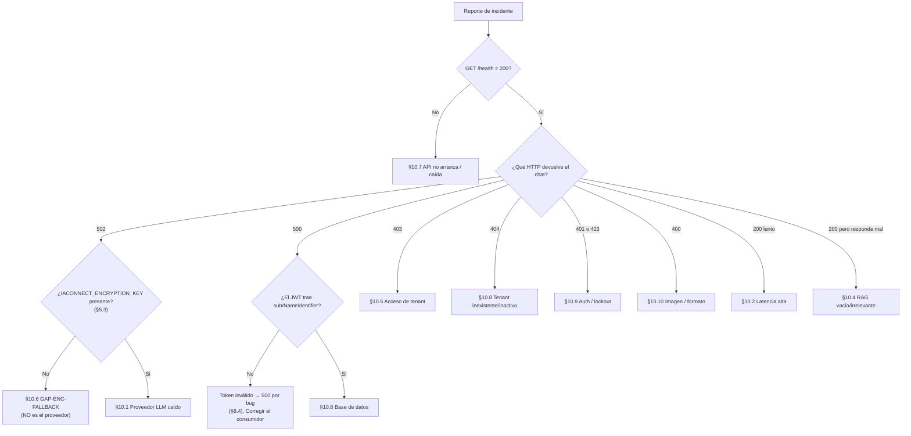

---

### 10.1 Proveedor LLM caído → failover vía factory

**Síntoma.** 🟩 HTTP **502** con body `{error, statusCode}` conteniendo el `errorBody` crudo del proveedor. Logs con `LogError` y `ProviderUnavailableException`. Afecta a **los tenants de ese proveedor**, no a todos (el proveedor es por tenant).

**Diagnóstico.**
```bash
# 0) OBLIGATORIO PRIMERO: descartar GAP-ENC-FALLBACK (§5.3)
docker compose exec iaconnect-api printenv IACONNECT_ENCRYPTION_KEY | wc -c   # 0 → ir a §10.6

# 1) ¿El 502 es de un proveedor o de todos?
docker compose logs --since 30m iaconnect-api | grep -i "ProviderUnavailable" | tail -30

# 2) ¿El proveedor está realmente caído? (status page + prueba directa)
curl -I https://api.anthropic.com/
```
```sql
-- 3) ¿Qué tenants están afectados y con qué proveedor?
SELECT Id_Tenant, Proveedor_IA, Nombre_Modelo, Activo FROM lut_Tenants WHERE Activo = 1;
```
🟩 Recordá que `ClaudeProvider` **ya reintenta solo**: 3 reintentos con backoff exponencial (1s, 2s, 4s) **únicamente** sobre `{429, 502, 503, 504}` (`ClaudeProvider.cs:187-216`). Si ves un 502 en el cliente, los 3 reintentos **ya se agotaron**. 🟨 Gemini y OpenAI **no tienen retry propio verificado** — su comportamiento ante 429 depende de su SDK.

**Acción — failover de proveedor.** 🟩 Es posible **sin redeploy** porque `AIProviderFactory.CreateProvider` hace `switch(tenant.ProveedorIA.ToLower())` **en cada request** sobre el valor leído de la BD (`AIProviderFactory.cs:17-31`), y no hay caché de tenant.

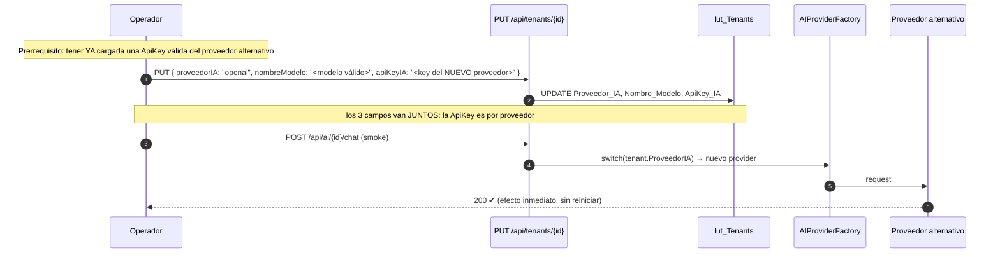

⚠ **Tres trampas del failover (🟩):**
1. **La ApiKey es por proveedor.** Cambiar solo `Proveedor_IA` deja la key del proveedor viejo → 502 igual. Hay que actualizar `ApiKey_IA` **en la misma operación**.
2. **El modelo es por proveedor.** `Nombre_Modelo` viaja al provider nuevo tal cual (`AIProviderFactory.cs:23-28`); `claude-3-sonnet-20240229` enviado a OpenAI = error. Cambiar los tres campos juntos.
3. **`Proveedor_IA` tiene `CHECK IN ('gemini','claude','openai')`** en la BD **y** un `switch` con `default → ArgumentException("Proveedor no soportado: {x}")` que el middleware traduce a **400**. Un valor fuera de esos tres da 400, no 502.

🟨 Failover **no implementado y recomendable**: no existe failover automático ni circuit-breaker. Hoy es **manual, por tenant**. Un failover automático requeriría un proveedor secundario por tenant (columna nueva en `lut_Tenants`, que no existe).

**Mitigación alternativa.** 🟩 Si no hay proveedor alternativo con key, poner `lut_Tenants.Activo = 0` degrada el tenant a **404 limpio** (`TenantResolverMiddleware`) en lugar de 502 con detalle del proveedor — mejor experiencia y menos fuga de información mientras dure la caída. Coordinar con el consumidor (GDA/Boletería) para que muestre el hand-off a canal humano (patrón de disclosure descrito en [IA-Mercado-Libre.md](../Antecedentes/IA-Mercado-Libre.md)).

**Escalamiento.** S2. Si la caída del proveedor supera los 30 min y no hay alternativa configurada → escalar a responsable de producto del consumidor para activar hand-off. Si el 502 persiste con proveedor sano y key correcta → escalar a desarrollo (revisar `ParseResponse`, `ClaudeProvider.cs:218-235`).

---

### 10.2 Latencia alta

**Síntoma.** p95 de `Duracion_Ms` elevado; usuarios reportan esperas; en el extremo, timeouts del proxy.

**Diagnóstico.** Ejecutar §8.3 (2) y descomponer. ⚠ 🟩 Recordá que `Duracion_Ms` **solo mide el proveedor** (el `Stopwatch` para en `ChatService.cs:118`, antes de las 3 inserciones). Si el usuario percibe lentitud pero `Duracion_Ms` está bien, el problema está **fuera** de esa ventana: RAG previo, BD, o red.

| Sospechoso | Cómo confirmarlo | 🟩 Evidencia |
|---|---|---|
| **Proveedor lento** | `Duracion_Ms` alto | latencia del LLM |
| **Reintentos silenciosos** | `Duracion_Ms` con saltos de ~1s/2s/4s + logs de 429 | `ClaudeProvider.cs:187-216` |
| **RAG pesado** | muchos fragmentos por tenant; `Duracion_Ms` **normal** pero request lento | `RAGEngine` carga **TODOS** los fragmentos del tenant **por request** y re-tokeniza el corpus completo: O(N·M) sin paginación ni caché (`RAGEngine.cs:34-120`) |
| **Prompt inflado** | `Tokens_Prompt` alto → más tiempo de generación | historial duplicado (§8.5) + KB duplicada (§7.6) |
| **BD lenta** | `Duracion_Ms` normal, request lento | `DeriveParameters` = round-trip extra **por operación** + 2-4 lecturas redundantes de `lut_Tenants` por request (§12.2) |
| **Imágenes** | `Tiene_Imagen=1` correlacionado | payload base64 grande |

```sql
-- ¿Qué tenant tiene el corpus más grande? (candidato a RAG lento)
SELECT Id_Tenant, COUNT(*) AS Fragmentos, SUM(LEN(Contenido)) AS Chars
FROM   sys_Fragmentos_Conocimiento
GROUP BY Id_Tenant ORDER BY Fragmentos DESC;
```

**Acción.**
1. Si es el proveedor → §10.1; considerar un modelo más rápido en `lut_Tenants.Nombre_Modelo`.
2. Si es el RAG → **deduplicar la KB** (§7.6). Es la acción de mayor retorno: baja fragmentos, tokens y latencia de una.
3. Si es prompt inflado → bajar `Max_Tokens` del tenant no reduce el prompt (limita la **salida**); el prompt se reduce podando la KB.
4. Subir el timeout del proxy por encima de 60s + 7s de backoff (§9, A6) para no enmascarar con 504 propios.
5. 🟨 No implementado: caché de fragmentos por tenant e índice invertido, en lugar de recomputar TF-IDF por request.

**Escalamiento.** S3; S2 si p95 > 55 s (§9 A6). Escalar a desarrollo si el diagnóstico apunta al RAG o a `DataEntityCore` (cambios de código, ver [03-LLD.md](03-LLD.md)).

---

### 10.3 Costo disparado

**Síntoma.** Factura del proveedor o tokens/día muy por encima de la línea base (§9 A7/A8).

**Diagnóstico.** Ejecutar §8.3 (3) y (4). La pregunta que ordena el triage es: **¿subieron los requests o subieron los tokens por request?**

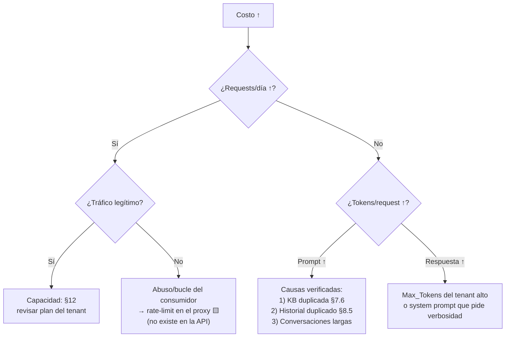

**Acción.**
1. **Deduplicar la KB** (§7.6) — la causa más común y la más barata de arreglar.
2. Revisar el **historial duplicado** (§8.5): 🟩 defecto real de código, ~2x el costo del historial. Escalar a desarrollo; no tiene workaround operativo salvo acortar sesiones.
3. Bajar `lut_Tenants.Max_Tokens` (default 4000) para acotar el costo de salida.
4. Revisar `System_Prompt` del tenant: prompts que piden respuestas exhaustivas multiplican tokens de salida.
5. 🟨 Rate-limit por tenant en el proxy (no existe en la API).
6. 🟨 No implementado: **cuota por tenant**. No hay columna de límite en `lut_Tenants` ni enforcement. El único freno de emergencia disponible es `Activo=0` (corta todo el tenant, 404).

**Escalamiento.** S3. Si el gasto supera el umbral presupuestario acordado → decisión de negocio (apagar tenant vs. absorber). Ver §13.

---

### 10.4 El RAG devuelve vacío (o irrelevante)

**Síntoma.** El asistente responde genéricamente, ignora la documentación cargada, o alucina. HTTP **200** — no hay error.

⚠ **Clave:** 🟩 `RAGEngine` **filtra `Score>0` y devuelve top-K=5**; si nada matchea, devuelve **lista vacía** y `PromptBuilder` simplemente **omite el bloque `[CONTEXTO RELEVANTE]`** (`PromptBuilder.cs:10-55`). **No hay error, no hay log, no hay señal.** El modelo contesta con conocimiento paramétrico → alucina con total confianza. Es un fallo **silencioso** por diseño.

**Diagnóstico.**
```sql
-- 1) ¿Hay corpus para este tenant?
SELECT COUNT(*) AS Fragmentos, COUNT(DISTINCT Documento_Origen) AS Documentos
FROM   sys_Fragmentos_Conocimiento WHERE Id_Tenant = '<tenantId>';
-- 0 → causa encontrada: la carga nunca ocurrió o fue a otro tenant

-- 2) ¿El término de la consulta existe en el corpus? (simula el matching léxico)
SELECT TOP 10 Documento_Origen, Indice_Fragmento, LEFT(Contenido, 200) AS Muestra
FROM   sys_Fragmentos_Conocimiento
WHERE  Id_Tenant = '<tenantId>' AND Contenido LIKE '%<palabra clave>%';
-- 0 filas → el RAG léxico NO puede encontrarlo. No es un bug: es la limitación de fondo.
```

**Causas verificadas y su acción:**

| Causa 🟩 | Evidencia | Acción |
|---|---|---|
| **El RAG es léxico, no semántico** | `RAGEngine.cs:34-120` implementa TF-IDF. `Vector_Embedding` siempre NULL; `SerializeEmbedding` es código muerto; no hay coseno ni cliente de embeddings en la solución | 🟨 **Educar al administrador**: si el usuario pregunta *«¿por qué no salió publicado mi show?»* y la KB dice *«el evento requiere estado APROBADO para publicarse»*, el solapamiento léxico es casi nulo → no recupera. **Solución operativa: enriquecer la KB con sinónimos y con las palabras que usa el usuario real**, no las del manual |
| **Stop-words comen la consulta** | 🟩 HashSet de ~57 stop-words es + 11 en; se descartan **tokens de ≤2 caracteres** | consultas cortas o de palabras funcionales quedan sin términos → Score 0 para todo. 🟨 Ejemplo: *«¿y el DNI?»* → `dni` sobrevive, pero *«¿y eso?»* queda vacío |
| **Documento vacío tras la extracción** | 🟩 `UploadDocumentAsync`: si el contenido queda vacío, **retorna 0 chunks sin insertar** — y el endpoint devuelve **200** con `chunksCreated: 0` | ⚠ **PDF escaneado (imagen) → PdfPig extrae 0 texto → 200 con 0 chunks**. Verificar SIEMPRE `chunksCreated` de la respuesta. No hay OCR |
| **Formato no soportado** | 🟩 solo `.pdf` (UglyToad.PdfPig) y `{.txt, .md, .html, .htm, .csv}`; el resto → `ArgumentException` → **400** | convertir el documento |
| **Corpus duplicado** | §7.6 | el top-5 se llena con 5 copias del mismo fragmento → **contexto desperdiciado**. Deduplicar |
| **Cargado en el tenant equivocado** | ⚠ 🟩 `KnowledgeController` **no lleva** `[ServiceFilter(TenantAccessFilter)]` (a diferencia de `AIController`) y exige `[Authorize(Roles="admin")]`: **cualquier admin escribe la KB de CUALQUIER tenant** | verificar `Id_Tenant` de los fragmentos; borrar los mal ubicados |

🟩 Cómo trocea (para entender qué se puede recuperar): `KnowledgeService` usa ventana deslizante de **400 "tokens" con 50 de solapamiento**, pero `SplitIntoChunks` **no tokeniza**: hace `text.Split(' ','\n','\r','\t')` y avanza `step = 400 - 50 = 350` **palabras** (`KnowledgeService.cs:16-17,103-121`). 🟨 La unidad real es la **palabra**.

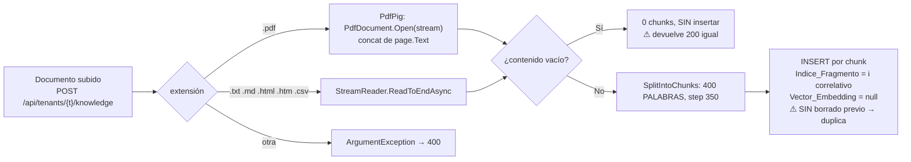

**Escalamiento.** S3. Si el corpus está bien y las consultas usan el vocabulario correcto pero igual no recupera → escalar a desarrollo (candidato al punto de extensión de embeddings, ver [04-ADR.md](04-ADR.md) y [02-HLD.md](02-HLD.md)).

---

### 10.5 Error 403 de tenant

**Síntoma.** 🟩 HTTP **403** con `{"error":"No tiene acceso a este tenant."}` y `StatusCode 403` (`ObjectResult`).

**Diagnóstico.** 🟩 El corte ocurre en `TenantAccessFilter` (`TenantAccessFilter.cs:12-47`):

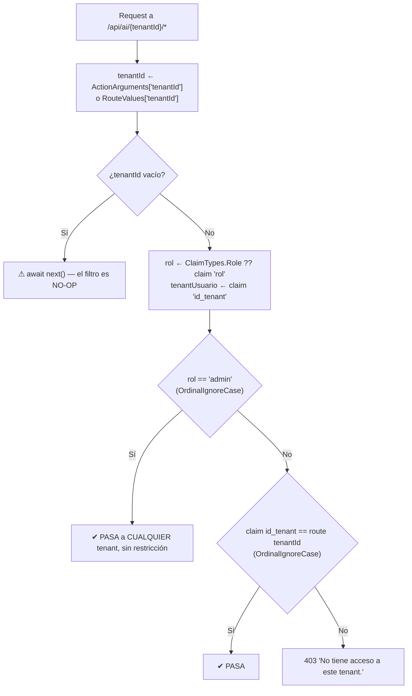

Decodificar el JWT (parte 2, sin verificar firma) y comparar:
```bash
echo "$TOKEN" | cut -d. -f2 | base64 -d 2>/dev/null | jq
# claims emitidos (🟩 AuthService.GenerateJwtToken): sub, nombre_usuario, id_tenant, role, iat, jti
```

| Causa | Verificación | Acción |
|---|---|---|
| El usuario pertenece a otro tenant | `id_tenant` del JWT ≠ `{tenantId}` de la ruta | corregir el tenant del consumidor, o el `Id_Tenant` del usuario |
| Usuario sin tenant | 🟩 `sys_Usuarios.Id_Tenant` es **NULL permitido**; el emisor pone `id_tenant = (?? "")` | asignarle tenant (salvo que sea admin) |
| Token viejo tras cambiar de tenant | los claims se congelan al emitir | re-login (o `POST /api/auth/refresh`) |
| Rol mal escrito | 🟩 `Rol` es `string` con `CHECK IN ('admin','operador')`; el enum `RolUsuario{Admin,Operador}` **no se usa** para esto | corregir a `admin`/`operador` exactos |

⚠ **403 vs 404 — para no perder el diagnóstico:** 🟩 `TenantResolverMiddleware` corre **antes** en el pipeline y devuelve **404** `{"error":"Tenant no encontrado o inactivo"}` si el tenant no existe **o está inactivo**. Entonces: **404 = el tenant no existe o está apagado; 403 = existe y activo, pero no es tuyo.** Esa diferencia es un canal de enumeración: 🟨 con cualquier JWT válido se puede distinguir qué tenants existen y están activos (404 vs 403), porque el 404 se emite **antes** de comprobar autorización.

**Escalamiento.** S3, generalmente config del consumidor. 🟨 Alertar por A12 si hay ráfaga de 404: puede ser reconocimiento.

⚠ **Nota de seguridad para el operador (no es un 403 — es lo contrario):** 🟩 dos huecos verificados que **no** generan 403 y conviene tener presentes al investigar fugas:
1. **Admin es global**: `rol == "admin"` pasa a **cualquier** tenant, en `AIController` y en `KnowledgeController`.
2. **El filtro es no-op sin `{tenantId}` en la ruta**: el corte depende **enteramente** de que la ruta lo lleve.
3. **La sesión no se valida contra el tenant**: 🟩 `ChatService` resuelve la sesión por GUID y, si parsea OK, **la reutiliza** sin comprobar que pertenezca al tenant de la ruta (`ChatService.cs:46-189`) → **posible fuga cross-tenant del historial**. Si alguien reporta ver conversaciones ajenas, **este es el vector**: escalar de inmediato a desarrollo/seguridad (S1), y como contención comprobar:
```sql
-- ¿Alguna sesión recibió mensajes bajo un tenant distinto al suyo? (evidencia indirecta)
SELECT s.Id_Sesion, s.Id_Tenant AS TenantSesion, mu.Id_Tenant AS TenantMetrica, COUNT(*) AS N
FROM   sys_Sesiones s JOIN sys_Metricas_Uso mu ON mu.Id_Sesion = s.Id
WHERE  s.Id_Tenant <> mu.Id_Tenant
GROUP BY s.Id_Sesion, s.Id_Tenant, mu.Id_Tenant;   -- cualquier fila = fuga cross-tenant
```

---

### 10.6 GAP-ENC-FALLBACK: 502 que en realidad es config

**Síntoma.** 🟩 **502** en todos los tenants (o en todos los del nodo nuevo) **inmediatamente después de un deploy**, con `errorBody` del proveedor indicando credencial inválida/no autorizada. Los status pages de los proveedores están **verdes**. Sospecha máxima si afecta a tenants de **proveedores distintos a la vez** (es raro que Claude, Gemini y OpenAI caigan juntos).

**Diagnóstico.**
```bash
docker compose exec iaconnect-api printenv IACONNECT_ENCRYPTION_KEY | wc -c   # 0 → confirmado
docker compose exec iaconnect-api printenv | grep -i encrypt                   # ver si solo está la MUERTA
```
🟩 Causa: `AIProviderFactory.DecryptApiKey` devuelve el ciphertext Base64 **tal cual** cuando la env falta (`AIProviderFactory.cs:33-39`) → el proveedor recibe basura como API key → rechaza → `ProviderUnavailableException` → 502.

**Acción.**
1. Restaurar la env `IACONNECT_ENCRYPTION_KEY` (¡**no** `Encryption__Key`, que es muerta) desde el vault.
2. Reiniciar el contenedor: `docker compose up -d --force-recreate iaconnect-api`.
3. Smoke §6.3 pasos 4 y 9.
4. Post-mortem: agregar la env al manifiesto de deploy y el fail-fast de §5.3.

⚠ Si la env **se perdió definitivamente** (no está en ningún vault ni backup): los ciphertext de `ApiKey_IA` son **irrecuperables**. Único camino: re-emitir las API keys en cada proveedor y re-cargarlas por tenant con una clave nueva (§5.4). Es un incidente **S1 con impacto de días** si hay muchos tenants — de ahí que el backup de la clave de cifrado (§11) sea tan crítico como el de la BD.

**Escalamiento.** S2 (S1 si la clave se perdió). Escalar a seguridad/infra.

---

### 10.7 API caída o no arranca

**Síntoma.** `/health` y `/` no responden; contenedor reiniciando; 0 filas nuevas en `sys_Metricas_Uso` (§9 A15).

**Diagnóstico.**
```bash
docker compose ps
docker compose logs --tail 100 iaconnect-api
```

| Firma en el log 🟩 | Causa | Acción |
|---|---|---|
| `NullReferenceException` durante `AddJwtBearer` | **falta `Jwt:SecretKey`** — se construye con null-forgiving (`!`) en `Program.cs:59-74` | proveer la clave |
| Error de conexión SQL al arrancar o en el primer request | `DataEntityCore.Configure()` recibió una connection string vacía/mala (`Program.cs:22`); 🟩 `ConnectionStrings:IAConnect` **está vacío** en `appsettings.json` | proveer por env `ConnectionStrings__IAConnect` |
| Contenedor `unhealthy` pero la API responde | 🟩 falso positivo: el `HEALTHCHECK` usa `curl`, ausente en `aspnet:8.0` (§2.2) | **ignorar** o arreglar la imagen |
| Puerto ocupado | otro proceso en 8080 | `docker compose down` y revisar |

**Acción.** Restaurar config → `docker compose up -d --force-recreate iaconnect-api` → smoke §6.3. Si no se resuelve en 10 min → rollback (§14.3).

**Escalamiento.** S1. Notificar a los consumidores (GDA/Boletería) para que activen el hand-off a canal humano.

---

### 10.8 Base de datos no responde / errores 500 y 404 raros

**Síntoma.** 500 «Error interno del servidor.» generalizado; o 404 «Tenant no encontrado o inactivo» inesperado.

**Diagnóstico.**
```bash
docker compose ps sqlserver
docker compose logs --tail 50 sqlserver
docker compose exec sqlserver /opt/mssql-tools18/bin/sqlcmd -S localhost -U sa -P "$SA_PASSWORD" -C -Q "SELECT 1"
```
```sql
-- Conexiones y bloqueos
SELECT COUNT(*) AS Conexiones FROM sys.dm_exec_sessions WHERE is_user_process = 1;
SELECT session_id, blocking_session_id, wait_type, wait_time
FROM   sys.dm_exec_requests WHERE blocking_session_id <> 0;
-- Espacio (límite 10 GB en Express)
EXEC sp_spaceused;
```

| Causa | Firma | Acción |
|---|---|---|
| SQL Server caído | `SELECT 1` falla | `docker compose up -d sqlserver`; esperar health; **reiniciar también la API** (§6.2: connection string congelada en el singleton) |
| **Base llena** (Express 10 GB) | error de crecimiento; `sp_spaceused` cerca del tope | purga §7.5; cambiar de edición §12.4 |
| **SP faltante o renombrado** | 500 en una operación puntual, el resto sano | ⚠ el SP se resuelve por **convención de string** en runtime (§7.3): comparar índices vs SP; restaurar el par |
| **Orden de parámetros de un SP cambiado** | datos corruptos **sin error** | §7.3: revertir el cambio de SP y auditar los datos escritos desde el deploy |
| Tenant inactivo | 404 «no encontrado o inactivo» | `SELECT Id_Tenant, Activo FROM lut_Tenants;` — ¿alguien lo apagó como mitigación (§10.1) y no lo volvió a prender? |
| Pool agotado | timeouts; conexiones altas | §12.2: `DeriveParameters` duplica los round-trips; reducir carga o escalar |
| **Token inválido** (falso positivo) | 500 solo en `/api/ai/*` | 🟩 §8.4: `UnauthorizedAccessException` no mapeada → 500. **No es la BD** |

**Acción de contención ante inconsistencia** (§8.5): 🟩 no hay transacción, así que tras un fallo intermedio puede haber mensajes sin métrica. No hay reparación automática; ejecutar la query de §8.5, documentar el desvío y —si afecta facturación— reconciliar contra la factura del proveedor.

**Escalamiento.** S1 si es caída total. DBA + desarrollo si es SP/parámetros.

---

### 10.9 401 / 423: autenticación y bloqueos

**Síntoma.** 🟩 **401** `InvalidCredentialsException` (incluye «Usuario desactivado.») o **423** `AccountLockedException`.

**Diagnóstico.** 🟩 `AuthService` (`AuthService.cs:25-26,42-186`): `MaxLoginAttempts=5`, `LockoutMinutes=15` — **constantes hardcodeadas, no configurables**.

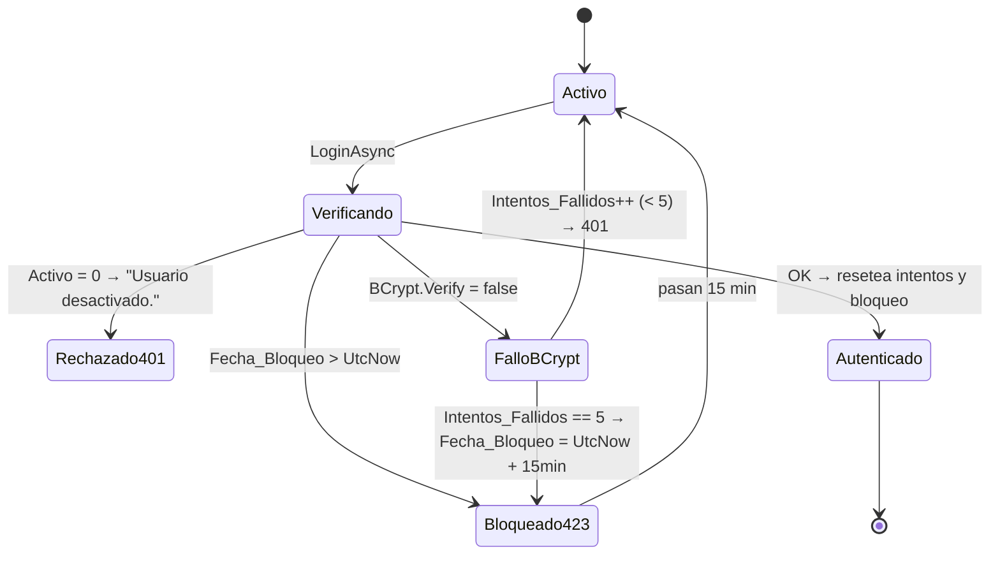

```sql
SELECT Nombre_Usuario, Rol, Id_Tenant, Activo, Intentos_Fallidos, Fecha_Bloqueo
FROM   sys_Usuarios WHERE Nombre_Usuario = '<usuario>';
```

**Acción.**
- **Desbloqueo manual** (🟨 no hay endpoint verificado para esto):
```sql
UPDATE sys_Usuarios SET Intentos_Fallidos = 0, Fecha_Bloqueo = NULL
WHERE  Nombre_Usuario = '<usuario>';
```
- **401 intermitente sin causa aparente** → 🟩 `ClockSkew = TimeSpan.Zero`: **verificar NTP** en API y consumidores. Sin tolerancia, unos segundos de desfase producen 401 aleatorios. Es la causa #1 de 401 "fantasma".
- **401 en todos, siempre** → 🟩 divergencia de audiencia: el validador usa `Jwt:Audience` (`IAConnect.API`) y el emisor cae en `"IAConnect.Clients"` si la config falta → **ningún token valida**. Setear ambos explícitamente (§4.4).
- **Ráfaga de 423 en varios usuarios** → posible ataque de credenciales. 🟨 Contención: rate-limit por IP en el proxy (no existe en la API).
- ⚠ 🟩 **`GET /api/auth/usuarios` está funcionalmente roto**: llama `GetListByIdTenantAsync(string.Empty)` y el propio código lo admite en comentarios («the interface doesn't have GetAll... A proper GetAll would be added to the DataManager», `AuthService.cs:188-196`). Filtra por `Id_Tenant=''` → devuelve **lista vacía**. **No lo uses para diagnosticar**: consultá `sys_Usuarios` por SQL. 🟩 El `SP_sys_Usuarios_GetAll` **sí existe** en la BD (`scripts/01_create_database.sql:520`); falta exponerlo en `ISysUsuariosDataManager`.

**Escalamiento.** S3; S2 si hay indicios de ataque → seguridad.

---

### 10.10 400 por imagen rechazada

**Síntoma.** 🟩 **400** con `ImageNotAllowedException`.

**Diagnóstico.** 🟩 `ImageValidator` (`ImageValidator.cs:16-48`) valida contra **tres campos del tenant**:

| Check | Campo de `lut_Tenants` | Detalle 🟩 |
|---|---|---|
| ¿Permite imágenes? | `Permite_Imagenes` (DEFAULT **0**) | ⚠ **el default es NO** — un tenant nuevo rechaza imágenes salvo que se habilite explícitamente |
| Tamaño | `Max_Tamano_Imagen_KB` (DEFAULT 2048) | estimado como `(len*3)/4/1024` desde el base64 |
| Formato | `Formatos_Imagen_Permitidos` (DEFAULT `PNG,JPG,WEBP`) | split por coma, uppercase |

🟩 La detección de formato es por **magic prefix del base64**: `/9j/`→JPG, `iVBOR`→PNG, `UklGR`→WEBP, `R0lGO`→GIF, else **UNKNOWN**. `ClaudeProvider.DetectImageMimeType` hace la misma detección (`ClaudeProvider.cs:245-251`) con **default `image/png`**.

**Acción.**
```sql
SELECT Id_Tenant, Permite_Imagenes, Max_Tamano_Imagen_KB, Formatos_Imagen_Permitidos
FROM   lut_Tenants WHERE Id_Tenant = '<tenantId>';
```
- Habilitar/ajustar vía `PUT /api/tenants/{tenantId}`.
- ⚠ GIF: `ImageValidator` **lo reconoce** (`R0lGO`) pero no está en el default de formatos permitidos, y `DetectImageMimeType` de Claude **no lo contempla** (caería en `image/png` → el proveedor puede rechazarlo). 🟨 No habilitar GIF sin probar end-to-end.
- 🟨 Si el usuario manda un base64 con prefijo data-URI (`data:image/png;base64,...`), el magic prefix **no matchea** → UNKNOWN → 400. El consumidor debe mandar el base64 **pelado**.

**Escalamiento.** S4, normalmente config de tenant o del consumidor.

---

## 11. Backup y recuperación

### 11.1 Qué hay que respaldar (y qué se olvida siempre)

| Activo | Dónde 🟩 | ¿Respaldado hoy? | Criticidad |
|---|---|---|---|
| Base `IAConnect` | volumen `sqlserver_data` → `/var/opt/mssql` | 🟨 **no hay job de backup en el repo** | **Crítica** |
| **`IACONNECT_ENCRYPTION_KEY`** | env del proceso | 🟨 depende del vault | **Crítica — sin ella, las `ApiKey_IA` del backup son basura** |
| `Jwt:SecretKey` | config/env | 🟨 depende del vault | Alta (perderla = invalidar todos los tokens vivos) |
| Documentos fuente de la KB | 🟩 **NO se almacenan**: solo quedan los chunks en `sys_Fragmentos_Conocimiento` | ❌ | Media — el original **no es recuperable** desde IAConnect |
| Imagen del contenedor | registry | según pipeline | Media |
| `scripts/01_create_database.sql` | repo git | ✔ | Media |

⚠ 🟨 **La lección operativa más importante de esta sección:** un backup de la BD **sin** la clave de cifrado es un backup **inútil para el chat**. Restaurás la base, arrancás, y todos los tenants dan 502 (§10.6). La clave y la base son **un solo activo** a efectos de recuperación: hay que versionarlos juntos (mismo vault, misma política, mismo test de restore).

⚠ 🟩 **Los documentos originales no se guardan**: `KnowledgeService` extrae el texto, trocea e inserta chunks; el archivo subido se descarta. `GET /api/tenants/{tenantId}/knowledge` devuelve `{Id, DocumentoOrigen, IndiceFragmento, Contenido, FechaAlta}` — se puede **reconstruir aproximadamente** el texto ordenando por `Indice_Fragmento`, pero con el solapamiento de 50 palabras repetido y sin el formato original. 🟨 **Recomendación:** el administrador debe conservar los documentos fuente **fuera** de IAConnect (repositorio documental del consumidor). Ver [06-Administrator-Guide.md](06-Administrator-Guide.md).

### 11.2 RPO/RTO sugeridos 🟨

| Escenario | RPO 🟨 | RTO 🟨 | Procedimiento |
|---|---|---|---|
| Pérdida del contenedor API | 0 (stateless) | < 5 min | recrear contenedor (§14) |
| Corrupción/pérdida de BD | 24 h (full diario) / 15 min (con log backups) | < 2 h | §11.4 |
| Pérdida de la clave de cifrado | — | **días** | §10.6: re-emitir todas las API keys |
| Pérdida del host completo | 24 h | < 4 h | recrear stack + restore |

### 11.3 Backup (propuesta, no implementada)

```bash
# PROPUESTA — no existe en el repo. Full diario + verificación.
STAMP=$(date -u +%Y%m%dT%H%M%SZ)
docker compose exec -T sqlserver /opt/mssql-tools18/bin/sqlcmd \
  -S localhost -U sa -P "$SA_PASSWORD" -C -Q \
  "BACKUP DATABASE IAConnect TO DISK='/var/opt/mssql/backup/IAConnect_${STAMP}.bak'
   WITH INIT, CHECKSUM, COMPRESSION;"

# Verificar SIEMPRE (un backup no verificado no es un backup)
docker compose exec -T sqlserver /opt/mssql-tools18/bin/sqlcmd \
  -S localhost -U sa -P "$SA_PASSWORD" -C -Q \
  "RESTORE VERIFYONLY FROM DISK='/var/opt/mssql/backup/IAConnect_${STAMP}.bak';"

# Copiar fuera del host + retención 30 días
```
⚠ El `.bak` contiene **las ApiKey cifradas y los hashes BCrypt**, y `sys_Mensajes` con **contenido de usuarios** (posible dato personal, relevante para GDA como sistema de gobierno). 🟦 Cifrar el backup en reposo y restringir el acceso.
⚠ 🟩 `MSSQL_PID=Express` **no soporta compresión de backup** en todas las versiones ni backups automatizados por Agent (Express no trae SQL Agent) → el scheduling debe ser externo (cron del host / orquestador). Otro argumento para §12.4.

### 11.4 Restauración

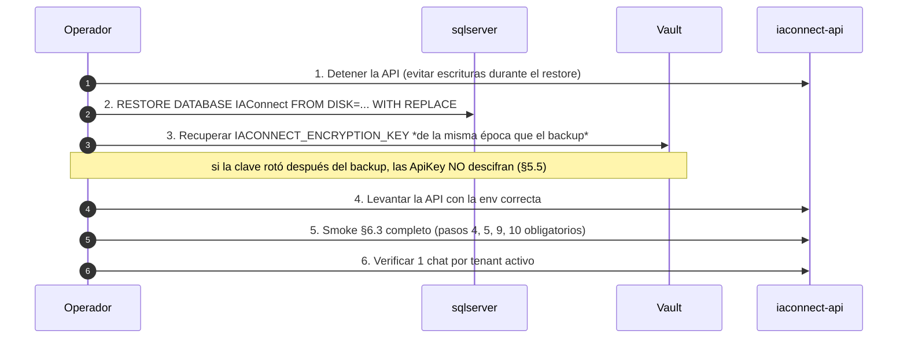

⚠ **Correspondencia clave↔backup.** 🟨 Si la clave de cifrado rotó **después** del backup que estás restaurando, las `ApiKey_IA` restauradas no descifran con la clave actual → 502 en todos los tenants. Por eso §5.5 exige ventana de mantenimiento y por eso el vault debe **versionar** la clave con fecha. Regla: *restaurar la base de la fecha X exige la clave vigente en la fecha X*.

### 11.5 Test de recuperación 🟦

🟨 Recomendación: ejercicio de restore **trimestral** en un entorno aparte, con criterio de aceptación = smoke §6.3 completo (incluyendo el paso 9, chat real). Un restore que solo verifica que la base monta **no prueba nada** sobre las ApiKey.

---

## 12. Capacidad, escalado y límites

### 12.1 Cuellos de botella verificados

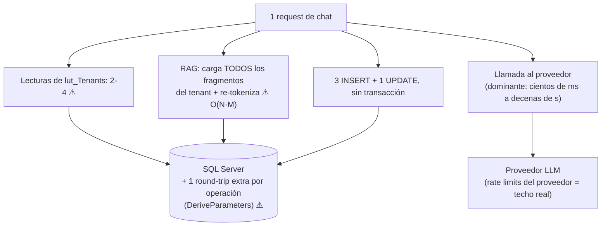

| # | Cuello | Evidencia 🟩 | Escala con | Mitigación |
|---|---|---|---|---|
| C1 | **RAG carga el corpus completo por request** | `RAGEngine.cs:34-120`: `GetListByIdTenantAsync(tenantId)` trae **todos** los fragmentos a memoria, tokeniza, computa IDF y scorea, en **cada** chat | tamaño de la KB × requests | 🟨 mantener la KB chica y **sin duplicados** (§7.6). 🟨 caché/índice invertido = cambio de código |
| C2 | **`DeriveParameters` por operación** | `DataEntityCore.cs:33-256` | operaciones/seg | 🟨 caché de parámetros (`SqlCommandBuilder` permite cachear) = cambio de código |
| C3 | **Lecturas redundantes de tenant** | 🟩 `TenantResolverMiddleware` guarda el tenant en `context.Items["Tenant"]` y **nadie lo consume**: `ChatService`, `RAGEngine`, `ImageValidator` y `KnowledgeService` hacen su propio `GetOneAsync` → **2-4 lecturas de `lut_Tenants` por request** | requests/seg | 🟨 consumir `context.Items["Tenant"]` = cambio de código de bajo riesgo y alto retorno |
| C4 | **Rate limits del proveedor** | 🟩 `ClaudeProvider` reintenta sobre **429** | tokens/min del plan contratado | subir plan; repartir tenants entre proveedores |
| C5 | **Prompt duplicado** | §8.5 | largo de conversación | corrección de código |
| C6 | **BD Express 10 GB** | 🟩 `MSSQL_PID=Express` | volumen de mensajes | §12.4 |

### 12.2 Aritmética de round-trips 🟨

Por request de chat, contra la BD (estimación derivada de los hallazgos 🟩 C2+C3):

| Operación | Round-trips lógicos | Con `DeriveParameters` (×2) |
|---|---|---|
| Resolver tenant (middleware) | 1 | 2 |
| Tenant en `ChatService` | 1 | 2 |
| Tenant en `RAGEngine` | 1 | 2 |
| Sesión (buscar/crear) | 1-2 | 2-4 |
| Historial | 1 | 2 |
| Fragmentos (corpus completo) | 1 | 2 |
| INSERT user + assistant + métrica | 3 | 6 |
| UPDATE sesión | 1 | 2 |
| **Total aproximado** | **~10-11** | **~20-22** |

🟨 Es una estimación propia, no medida. La conclusión accionable sí es sólida: **la BD ve ~20 round-trips por chat**, y ~6 de ellos son evitables (C3 + parte de C2) sin tocar la arquitectura. Es lo primero a optimizar si la latencia no viene del proveedor.

### 12.3 Escalado horizontal

🟩 La API es **stateless**: la sesión vive en la BD (`sys_Sesiones`), no en memoria. 🟨 Por lo tanto es horizontalmente escalable **con dos salvedades verificadas**:

| Salvedad | Detalle 🟩 | Implicancia |
|---|---|---|
| `DataEntityCore` es **singleton estático** configurado una vez (`Program.cs:22`) | por proceso, no compartido entre réplicas | ✔ no impide escalar; sí impide cambiar la conexión en caliente |
| `AIProviderFactory` es **Singleton** (`:88`) y el `HttpClient "Claude"` es **nombrado** (`:81-85`) | pooling correcto **solo para Claude** | 🟨 `Gemini` y `OpenAI` se instancian con la key desnuda **por request** (`AIProviderFactory.cs:17-31`), presumiblemente creando su cliente SDK internamente → riesgo de **socket exhaustion** bajo carga alta. Es una asimetría a vigilar al escalar |
| `IACONNECT_ENCRYPTION_KEY` debe estar en **todas** las réplicas | §10.6 | una réplica sin la env produce 502 **intermitentes** (según a qué réplica caiga el request): síntoma desconcertante — chequear réplica por réplica |

🟨 Con réplicas, agregar afinidad **no** es necesario. Sí lo es un balanceador con health check contra `/health` (no contra el health de Docker, §2.2).

### 12.4 Límites conocidos y recomendaciones

| Límite | Valor 🟩 | Recomendación 🟨 |
|---|---|---|
| Tamaño de base | 10 GB (Express) | migrar a Standard/Developer o instancia gestionada antes de producción real |
| Timeout de Claude | 60 s (`Program.cs:81-85`) | timeout del proxy **> 60 s + 7 s de backoff** |
| Reintentos de Claude | 3 (1s, 2s, 4s) sobre {429,502,503,504} | dejar como está; no reintentar también en el proxy (amplificación) |
| `Max_Tokens` por tenant | DEFAULT 4000 | ajustar por caso de uso (§13) |
| Tamaño de imagen | `Max_Tamano_Imagen_KB` DEFAULT 2048 | acorde al límite del proveedor |
| Rate limit propio | **no existe** | implementar en el proxy, por tenant |
| Paginación de `GET knowledge` | 🟩 **no existe**: puede devolver **el corpus entero** | ⚠ no lo llames en un tenant grande desde un browser; limitar en el proxy |
| Cuota por tenant | **no existe** | §13 |

---

## 13. Gestión de costos por tenant

### 13.1 Qué se puede hacer con el esquema actual

🟩 `sys_Metricas_Uso` tiene `Id_Tenant`, `Proveedor`, `Modelo`, `Tokens_Prompt`, `Tokens_Respuesta`, `Total_Tokens` y `Fecha_Solicitud` → **el costo por tenant es calculable fuera de la BD**, cruzando contra una tabla de precios propia.

⚠ 🟩 Pero **no hay columna de costo** y **no hay columna de usuario**. Y 🟩 `Modelo` sale del **tenant**, no de la respuesta real (§8.3) → si el proveedor hace fallback de modelo, **el costo calculado se desvía del facturado**. Por eso: la métrica sirve para **atribuir y tendenciar**, no para facturar con precisión. 🟨 Reconciliar siempre contra la factura del proveedor.

### 13.2 Modelo de cálculo 🟨

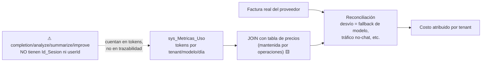

```sql
-- PROPUESTA: tabla de precios mantenida por operaciones (no existe en el esquema)
-- CREATE TABLE ops_Precios_Modelo (
--   Proveedor varchar(20), Modelo varchar(50),
--   Precio_Prompt_Por_1M decimal(10,4), Precio_Respuesta_Por_1M decimal(10,4),
--   Vigente_Desde date, Vigente_Hasta date NULL);

-- Costo mensual estimado por tenant
SELECT mu.Id_Tenant,
       mu.Proveedor, mu.Modelo,
       SUM(mu.Tokens_Prompt)    AS TokensPrompt,
       SUM(mu.Tokens_Respuesta) AS TokensRespuesta,
       SUM(mu.Tokens_Prompt)    / 1000000.0 * p.Precio_Prompt_Por_1M
     + SUM(mu.Tokens_Respuesta) / 1000000.0 * p.Precio_Respuesta_Por_1M AS Costo_Estimado
FROM   sys_Metricas_Uso mu
JOIN   ops_Precios_Modelo p
       ON p.Proveedor = mu.Proveedor AND p.Modelo = mu.Modelo
      AND mu.Fecha_Solicitud >= p.Vigente_Desde
      AND (p.Vigente_Hasta IS NULL OR mu.Fecha_Solicitud < p.Vigente_Hasta)
WHERE  mu.Fecha_Solicitud >= DATEADD(MONTH, -1, GETUTCDATE())
GROUP BY mu.Id_Tenant, mu.Proveedor, mu.Modelo, p.Precio_Prompt_Por_1M, p.Precio_Respuesta_Por_1M
ORDER BY Costo_Estimado DESC;
```

### 13.3 Palancas de costo disponibles

| Palanca | Dónde 🟩 | Efecto | Riesgo |
|---|---|---|---|
| **Modelo** | `lut_Tenants.Nombre_Modelo` | el de mayor impacto (órdenes de magnitud entre modelos) | calidad de respuesta |
| **Proveedor** | `lut_Tenants.Proveedor_IA` (+ key + modelo, §10.1) | arbitraje de precio | requiere re-testear el system prompt |
| **`Max_Tokens`** | `lut_Tenants.Max_Tokens` (DEFAULT 4000) | acota **la salida** | respuestas truncadas |
| **`Temperatura`** | `lut_Tenants.Temperatura` (DEFAULT 0.7) | ninguno sobre el costo | — (no es palanca de costo) |
| **KB sin duplicados** | §7.6 | baja `Tokens_Prompt` directamente | ninguno — es puro upside |
| **System prompt conciso** | `lut_Tenants.System_Prompt` | se paga **en cada request** | menos guía al modelo |
| **Historial duplicado** | §8.5 (defecto de código) | ~2x el costo del historial | requiere fix de desarrollo |
| **Apagar tenant** | `lut_Tenants.Activo = 0` | corta todo (404) | único freno de emergencia disponible |

🟨 **Lo que no hay:** no existe **cuota ni presupuesto por tenant** (no hay columna en `lut_Tenants` ni enforcement en código), no hay corte automático al superar un umbral, y no hay caché de respuestas. El control de costos hoy es **detectivo (alertas §9), no preventivo**.

🟨 **Propuesta de extensión mínima** (cambio de código; ver [02-HLD.md](02-HLD.md) y [04-ADR.md](04-ADR.md)):

```sql
-- PROPUESTA — no existe
ALTER TABLE lut_Tenants ADD Cuota_Tokens_Mensual int NULL;   -- NULL = sin límite
```
```csharp
// PROPUESTA — chequeo previo en ChatService, antes del paso 8 (llamada al proveedor)
var consumido = await _metricas.GetTotalTokensMesAsync(tenantId);
if (tenant.CuotaTokensMensual is int cuota && consumido >= cuota)
    throw new QuotaExceededException(tenantId);   // → mapear a 429 en GlobalExceptionMiddleware
```

### 13.4 Costos por caso de éxito 🟨

| Caso | Perfil de uso esperado | Palanca prioritaria |
|---|---|---|
| **GDA — turnos (ciudadano)** | muchas sesiones cortas, preguntas repetitivas | modelo económico + KB chica y precisa; 🟨 el caché de respuestas frecuentes sería el mayor ahorro (no existe) |
| **GDA — turnos (backoffice)** | menos sesiones, más largas | vigilar el historial duplicado (§8.5): pega más fuerte en conversaciones largas |
| **Boletería — gestión de eventos** | sesiones de diagnóstico ("¿por qué no se publicó?"), KB de reglas | KB sin duplicados; el RAG léxico exige vocabulario del usuario (§10.4) |

---

## 14. Procedimiento de despliegue y rollback

### 14.1 Pre-requisitos del despliegue

🟨 No hay pipeline de CI/CD versionado en el repo. El procedimiento siguiente es la **recomendación** de este documento.

- [ ] Tests verdes: `dotnet test` (🟩 19 archivos xUnit: 10 Unit/Services, 1 Unit/Providers, 1 Unit/Middleware, 4 Integration + factory + 2 Helpers).
- [ ] ⚠ Conocer los **huecos de cobertura** 🟨: **no hay tests** de `KnowledgeService` (ingesta/chunking/PdfPig), ni de `TenantAccessFilter` (el punto exacto donde corta el aislamiento — solo se testea `TenantResolverMiddleware`), ni de `GlobalExceptionMiddleware` (el mapeo a 423/502), ni de los providers concretos (retry/parsing de `ClaudeProvider`). **Todo cambio que toque esas áreas exige verificación manual** con §6.3 + §10.4/§10.5.
- [ ] Si el cambio toca esquema: script SQL revisado contra la regla del **espejo índice↔SP** (§7.3) y contra el **orden de parámetros** de los SP.
- [ ] `IACONNECT_ENCRYPTION_KEY` presente en el manifiesto del entorno destino (§5.3).
- [ ] Plan de rollback escrito (§14.3).

### 14.2 Despliegue

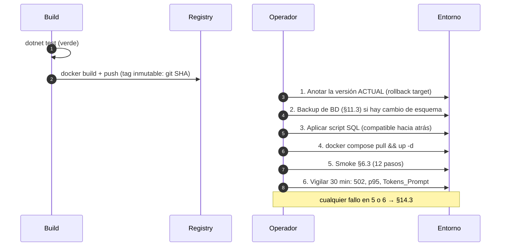

```bash
# Versión desplegada actualmente (🟩 el endpoint / la expone)
curl -fsS http://localhost:8080/ | jq -r '.Version'
# ⚠ 🟩 "1.0.0" está hardcodeado en Program.cs → NO identifica el build.
#   Usá el tag/digest de la imagen como identidad real:
docker compose images iaconnect-api
```

⚠ 🟨 **El endpoint `/` no sirve para verificar qué build está corriendo**: el `Version=1.0.0` es literal. Recomendación: inyectar el git SHA en la respuesta, o basar toda la trazabilidad de release en el **digest de la imagen**.

🟨 **Compatibilidad de esquema.** Como no hay migraciones (§7.1) y los SP se resuelven por convención en runtime (§7.3), la regla de oro es **expand/contract**: primero agregar (columna nullable, SP nuevo), desplegar código, y **recién en un release posterior** eliminar lo viejo. Un despliegue que borra un SP y el código nuevo falla al arrancar deja el sistema **sin rollback limpio**.

### 14.3 Rollback

| Escenario | Rollback | Tiempo 🟨 |
|---|---|---|
| Código, sin cambio de esquema | `docker compose up -d` con el tag anterior | < 5 min |
| Código + esquema **compatible** (expand) | rollback de imagen; el esquema nuevo no molesta | < 5 min |
| Código + esquema **incompatible** (contract) | ⚠ rollback de imagen **+ restore de BD** (§11.4) | ~2 h, con **pérdida de datos** desde el backup |
| Config (env) | corregir env + `--force-recreate` | < 5 min |
| Cambio de tenant (proveedor/modelo/key) | `PUT /api/tenants/{id}` con los valores previos — **efecto inmediato, sin reinicio** (§5.4) | < 2 min |

```bash
# Rollback de imagen
docker compose down iaconnect-api
# fijar el tag anterior en docker-compose.yml (o IMAGE_TAG en .env)
docker compose up -d iaconnect-api
curl -fsS http://localhost:8080/health && docker compose images iaconnect-api
# Smoke §6.3 completo
```

**Criterios de rollback automático 🟨** (si cualquiera se cumple en los 30 min de observación):
- tasa de 502 > 20% (y `IACONNECT_ENCRYPTION_KEY` presente — si no, es §10.6 y el fix es la env, no el rollback);
- tasa de 500 > 5%;
- p95 de `Duracion_Ms` > 2x la línea base;
- `AVG(Tokens_Prompt)` > 1.5x la línea base (regresión de prompt/KB);
- 0 filas nuevas en `sys_Metricas_Uso` con tráfico entrante.

### 14.4 Ventana de mantenimiento 🟨

Requieren ventana: rotación de `IACONNECT_ENCRYPTION_KEY` (§5.5), cambios de esquema incompatibles, restore (§11.4), purga masiva inicial (§7.5). **No** requieren ventana: cambios de tenant (proveedor, modelo, key, prompt), carga de KB, rollback de imagen.

---

## 15. Trazabilidad de evidencia

> Convención: 🟩 = verificado en la fuente citada · 🟦 = práctica de industria · 🟨 = interpretación propia o recomendación no implementada. Rutas relativas a `f:/repos/ng-sa/Workspace-GDA/NG/Ng-IAServices/`.

### 15.1 Afirmaciones verificadas en código (🟩)

| § | Afirmación | Fuente |
|---|---|---|
| 1.2, 2.1 | Clean Architecture 4 capas, 8 proyectos; regla de dependencia hacia Domain | `ia-db/indexes/00_MASTER-INDEX.md:111-132` verificado contra `IAConnect.API/Program.cs:1-17` |
| 2.1, 6.2 | `DataEntityCore.Configure(GetConnectionString("IAConnect"))` al arranque; singleton estático | `IAConnect.API/Program.cs:22` |
| 6.2, 12.3 | `AIProviderFactory` Singleton (:88); 7 DataManagers + 11 servicios Scoped (:91-110); `TenantAccessFilter` Scoped (:78) | `IAConnect.API/Program.cs:78-110` |
| 6.2, 12.4 | HttpClient nombrado "Claude": BaseAddress `https://api.anthropic.com/`, Timeout 60 s; único provider con HttpClient inyectado | `IAConnect.API/Program.cs:81-85` |
| 1.2, 6.1 | Orden del pipeline; `/health`; `GET /` → `{Status=Running, Service=IAConnect API, Version=1.0.0}`; `public partial class Program {}` | `IAConnect.API/Program.cs:128-157` |
| 2.4, 6.1 | Swagger habilitado en **todos** los entornos (comentario explícito) | `IAConnect.API/Program.cs:133` |
| 4.4, 10.7, 10.9 | JWT: `ValidateIssuer/Audience/Lifetime/IssuerSigningKey`, `ClockSkew=Zero`, `IssuerSigningKey` con null-forgiving | `IAConnect.API/Program.cs:59-74` |
| 10.5, 10.9 | Claims emitidos `sub/nombre_usuario/id_tenant/role/iat/jti`; HmacSha256; fallbacks `IAConnect`/`IAConnect.Clients` | `IAConnect.Application/Services/AuthService.cs:258-287` |
| 4.1 | `Jwt:SecretKey` **no** vacío (literal de dev); vacíos: ConnectionString (:10), `Encryption:AesKey` (:23), 3 ApiKey (:27,31,35); DefaultModel no consumidos; CORS `localhost:3000` | `IAConnect.API/appsettings.json:10-38` |
| 7.3, 10.8, 12.1 | `DataEntityCore`: SP por convención `SP_{Tabla}_{Op}`, `DeriveParameters` por llamada, parámetros posicionales, mapeo por reflexión case-insensitive, `SqlTransaction` opcional | `IAConnect.Infrastructure/DataAccess/DataEntityCore.cs:33-256` |
| 7.2 | DDL `lut_Tenants` completo (PK varchar(50), CHECK proveedor, defaults 0.7/4000/2048/PNG,JPG,WEBP/60/7) | `scripts/01_create_database.sql:31-53` |
| 7.2 | FKs y tipos; ⚠ `sys_Mensajes`/`sys_Metricas_Uso` referencian el `Id` int, no el GUID `Id_Sesion` | `scripts/01_create_database.sql:58-196` |
| 7.2, 8.3, 13.1 | `sys_Metricas_Uso`: sin columna de costo ni de usuario; `Id_Sesion` NULLABLE | `scripts/01_create_database.sql:154-176` |
| 7.3 | 17 índices + 72 SP; espejo 1:1 índices↔SP | `scripts/01_create_database.sql:203-1440` |
| 7.1, 5.1 | Encabezado con credenciales de ejemplo en claro (no reproducidas); seeds de 4+ tenants y 6 usuarios; `_hashgen/` | `scripts/01_create_database.sql:1-8,1456-1708` + `_hashgen/` |
| 10.9 | `SP_sys_Usuarios_GetAll` existe en la BD | `scripts/01_create_database.sql:520` |
| 10.4, 8.5 | Chunking: `ChunkSizeTokens=400`, `OverlapTokens=50`, pero `Split(' ','\n','\r','\t')` y `step=350` → unidad real = **palabra** | `IAConnect.Application/Services/KnowledgeService.cs:16-17,103-121` |
| 7.6, 10.4 | Ingesta: PdfPig para `.pdf`; StreamReader para txt/md/html/htm/csv; otra → ArgumentException; contenido vacío → 0 chunks sin insertar; **sin borrado previo → duplica** | `IAConnect.Application/Services/KnowledgeService.cs:34-101` |
| 8.6, 10.4 | `VectorEmbedding = null` siempre | `IAConnect.Application/Services/KnowledgeService.cs:75` |
| 10.2, 10.4, 12.1 | RAG: carga TODOS los fragmentos del tenant por request; IDF + TF log-normalizado con fallback por substring; filtra Score>0; topK=5 | `IAConnect.Application/Services/RAGEngine.cs:34-120` |
| 10.4 | ~57 stop-words es + 11 en; descarte de tokens ≤2 chars | `IAConnect.Application/Services/RAGEngine.cs:14-24` |
| 8.6 | `SerializeEmbedding` es **código muerto** (nadie lo invoca); no hay cliente de embeddings ni coseno | `IAConnect.Application/Services/RAGEngine.cs:122-127` |
| 10.4 | `PromptBuilder`: 4 bloques; omite `[CONTEXTO RELEVANTE]` si no hay chunks | `IAConnect.Application/Services/PromptBuilder.cs:10-55` |
| 8.5, 10.5 | `ChatService` 10 pasos; ⚠ la sesión **no** se valida contra el tenant | `IAConnect.Application/Services/ChatService.cs:46-189` |
| 8.5, 13.3 | Historial pasado **dos veces**: `:102` (system prompt) y `:112` (`ConversationHistory`) | `ChatService.cs:102,112` + `ClaudeProvider.cs:124-134,183` |
| 8.5 | 3 INSERT + 1 UPDATE **sin transacción**; el mensaje del usuario se persiste **después** de la llamada al proveedor | `IAConnect.Application/Services/ChatService.cs:107-149` |
| 8.3 | Stopwatch se detiene en `:118` (antes de las inserciones); `Modelo` de la métrica sale del **tenant**; log Information con tenant/provider/tokens/duration | `IAConnect.Application/Services/ChatService.cs:118,152-168,175-177` |
| 5.2 | `EncryptApiKey` lanza si falta la env (no guarda en claro) | `IAConnect.Application/Services/TenantService.cs:129-138` |
| 5.2, 10.6 | `DecryptApiKey` devuelve el ciphertext tal cual si falta la env (comentario «asumir key en texto plano»); AES-256-CBC-PKCS7 con IV prefijado | `IAConnect.Infrastructure/Providers/AIProviderFactory.cs:33-60` |
| 10.1, 12.3 | `switch(tenant.ProveedorIA.ToLower())` sobre {gemini, claude, openai}; default → `ArgumentException` → 400; modelo/temp/maxTokens del tenant; solo Claude recibe HttpClient | `IAConnect.Infrastructure/Providers/AIProviderFactory.cs:17-31` |
| 10.1, 12.4 | Retry: 3 reintentos, backoff 1s/2s/4s, solo sobre {429,503,502,504}; `errorBody` crudo en la excepción; `ParseResponse` toma `content[0].text` | `IAConnect.Infrastructure/Providers/ClaudeProvider.cs:175-243` |
| 10.10 | `DetectImageMimeType` por magic prefix, default `image/png`; bloques image+text | `IAConnect.Infrastructure/Providers/ClaudeProvider.cs:136-170,245-251` |
| 10.10 | `ImageValidator`: magic prefix; valida `PermiteImagenes`, `MaxTamanoImagenKB` (`(len*3)/4/1024`), `FormatosImagenPermitidos` | `IAConnect.Application/Services/ImageValidator.cs:16-48` |
| 8.3 | `IAIProvider`: 5 métodos + 6 DTOs; ⚠ `AIResponse` **no** expone modelo ni latencia | `IAConnect.Domain/Interfaces/IAIProvider.cs:5-71` |
| 4.1, 10.10 | Entidad `Tenant` con defaults C#; `ProveedorIA` es **string**, no el enum | `IAConnect.Domain/Entities/Tenant.cs:3-24` |
| 8.4 | Mapeo de errores: 404/401/**423**/400/**502**/400/500; LogError ≥500, LogWarning <500; body `{error, statusCode}` | `IAConnect.API/Middleware/GlobalExceptionMiddleware.cs:30-57` |
| 10.5 | `TenantAccessFilter`: no-op sin tenantId; admin pasa a cualquier tenant; operador exige match; 403 `{error}` | `IAConnect.API/Middleware/TenantAccessFilter.cs:12-47` |
| 10.5, 12.1 | `TenantResolverMiddleware`: 404 si no existe o inactivo; guarda `context.Items["Tenant"]` que **nadie consume** | `IAConnect.API/Middleware/TenantResolverMiddleware.cs:14-34` |
| 8.4, 6.3 | `AIController`: `[Authorize]` + `[ServiceFilter(TenantAccessFilter)]`, 5 POST; `GetUserId()` lanza `UnauthorizedAccessException` → **500** (no mapeada); solo Chat propaga userId | `IAConnect.API/Controllers/AIController.cs:12-134` |
| 6.3 | `ChatRequestDto` sin DataAnnotations | `IAConnect.Application/DTOs/Requests/ChatRequestDto.cs:3-8` |
| 10.4, 12.4 | `KnowledgeController`: `[Authorize(Roles="admin")]` **sin** `TenantAccessFilter`; POST devuelve **200**; GET **sin paginación** | `IAConnect.API/Controllers/KnowledgeController.cs:11-72` |
| 10.9 | `MaxLoginAttempts=5`, `LockoutMinutes=15` hardcodeados; BCrypt; expiraciones del tenant; refresh 64 bytes con rotación; sin detección de reuso | `IAConnect.Application/Services/AuthService.cs:25-26,42-186,289-295` |
| 10.9 | `GetUsuariosAsync` roto: `GetListByIdTenantAsync(string.Empty)` + comentarios que admiten el defecto | `IAConnect.Application/Services/AuthService.cs:188-196` |
| 2.2 | Dockerfile multi-stage; `USER appuser` **antes** del COPY; HEALTHCHECK con `curl` ausente en `aspnet:8.0` | `Dockerfile:1-38` |
| 2.1, 4.2, 7.4 | compose: `ASPNETCORE_ENVIRONMENT=Development` hardcodeado; `Encryption__Key` **muerta**; defaults `:-` commiteados; `MSSQL_PID=Express`; healthchecks | `docker-compose.yml:4-47` |
| 14.1 | 19 archivos de test; huecos: sin tests de KnowledgeService, TenantAccessFilter, GlobalExceptionMiddleware ni providers concretos | `IAConnect.Tests/` (19 `.cs`) |
| 8.6 | `docs/` con 49 archivos, 10 secciones; ante divergencia doc↔código **gana el código**; `rag-spec_v1.0.md` (embeddings + coseno 0.75) desalineado | `docs/` + `ia-db/indexes/04_proveedores-ia-y-rag.md:459-463` + `docs/05_arquitectura_tecnica/rag-spec_v1.0.md` |

### 15.2 Correcciones a los índices de `ia-db/`

| Índice | Decía | 🟩 Realidad verificada | § |
|---|---|---|---|
| `05_seguridad-y-multitenant.md` | «`Jwt:SecretKey` y `Encryption:AesKey` en appsettings están vacíos» | `Jwt:SecretKey` **NO** está vacío: contiene un literal de dev commiteado (`appsettings.json:13`). `Encryption:AesKey` sí está vacío — y además es **clave muerta** | 4.1 |
| `05_seguridad-y-multitenant.md` | `ProviderUnavailable` → «502/503 (verificar)» | Es **502 exclusivamente** (`GlobalExceptionMiddleware.cs:30-57`) | 8.4 |
| `04_proveedores-ia-y-rag.md` / `rag-spec_v1.0.md` | RAG con embeddings + coseno, threshold 0.75 | El código implementa **TF-IDF léxico en memoria**; `Vector_Embedding` siempre NULL; `SerializeEmbedding` es código muerto | 8.6, 10.4 |

### 15.3 Inferencias y recomendaciones (🟨) — inventario

| § | Ítem 🟨 | Naturaleza |
|---|---|---|
| 1.4 | Escala de severidad S1-S4 | convención propuesta |
| 2.2 | Fix de Dockerfile (curl + orden de COPY/USER) | propuesta de código |
| 2.3, 2.5 | Matriz de entornos dev/homologación/prod; topología con reverse proxy; rate-limit en el proxy | recomendación no implementada |
| 5.2, 10.6 | **GAP-ENC-FALLBACK** como modo de fallo (el 502 que en realidad es config) | inferencia propia sobre hechos 🟩 |
| 5.3 | Fail-fast de `IACONNECT_ENCRYPTION_KEY` al arranque | propuesta de código |
| 5.5 | Procedimiento de rotación de la clave de cifrado | procedimiento propuesto (no existe) |
| 6.1 | `/health` no verifica BD ni proveedor | inferencia (no verificado en fuente) |
| 7.5 | Política y scripts de retención | propuesta (no existe) |
| 7.6 | Procedimiento de recarga limpia de KB | workaround propuesto |
| 8.1 | «La observabilidad real es logs + una tabla SQL» | inferencia sobre ausencia de evidencia |
| 8.5 | 400 palabras ≈ 520-600 tokens en español; subestimación de contexto ~30-50% | estimación propia |
| 9 | Todas las alertas y umbrales | recomendación no implementada |
| 10.4 | Enriquecer la KB con el vocabulario del usuario (limitación del RAG léxico) | recomendación operativa |
| 11 | RPO/RTO, scripts de backup, correspondencia clave↔backup, test trimestral | propuesta (no existe) |
| 12.2 | Aritmética de ~20 round-trips por chat | estimación propia derivada de hechos 🟩 |
| 12.3 | Riesgo de socket exhaustion en Gemini/OpenAI (sin HttpClient del factory) | inferencia sobre hecho 🟩 |
| 13.2, 13.3 | Tabla `ops_Precios_Modelo`, `Cuota_Tokens_Mensual`, chequeo previo en `ChatService` | propuesta de código/esquema |
| 14 | Pipeline, criterios de rollback, expand/contract, ventana de mantenimiento | recomendación no implementada |

### 15.4 Documentos relacionados

| Documento | Qué aporta a esta guía |
|---|---|
| [01-SAD.md](01-SAD.md) | Arquitectura completa y atributos de calidad |
| [02-HLD.md](02-HLD.md) | Diseño de alto nivel; puntos de extensión (embeddings, function-calling) |
| [03-LLD.md](03-LLD.md) | Detalle de clases y defectos citados en §8.5 |
| [04-ADR.md](04-ADR.md) | Decisiones: TF-IDF vs embeddings, DataEntity vs EF Core, proveedor por tenant |
| [06-Administrator-Guide.md](06-Administrator-Guide.md) | Alta de tenants, system prompts, carga y curación de la KB |
| [Analisis-Asistencia-IA-ChatBotIA.md](../Antecedentes/Analisis-Asistencia-IA-ChatBotIA.md) | Marco conceptual (bloques A-G); convención 🟩🟦🟨 |
| [IA-Mercado-Libre.md](../Antecedentes/IA-Mercado-Libre.md) | Patrones de UX: disclosure de alcance, hand-off (§10.1) |
| `ia-db/indexes/00_MASTER-INDEX.md` | Índice maestro del relevamiento |
| `ia-db/indexes/04_proveedores-ia-y-rag.md` | Proveedores y RAG (ver correcciones §15.2) |
| `ia-db/indexes/05_seguridad-y-multitenant.md` | Seguridad (ver correcciones §15.2) |
| `ia-db/indexes/06_pruebas-y-devops.md` | Pruebas y DevOps |

---

**Fin del documento.** Todo hallazgo nuevo que contradiga lo aquí escrito debe verificarse contra el código y, de confirmarse, actualizarse en §15 con su ruta y número de línea. **Ante divergencia doc↔código, gana el código.**
