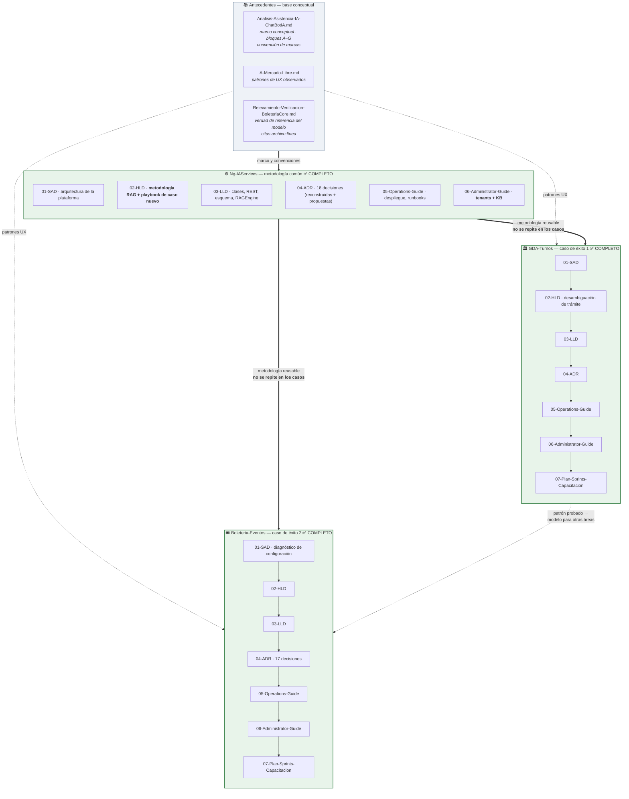

# Implementación — Asistencia por IA con chatbot · Índice maestro del conjunto documental

> **Qué es esto.** El índice maestro de un estudio de **tres bloques** sobre la integración de asistencia por IA
> conversacional en los sistemas de NG-SA. Un bloque describe la **metodología reusable** del gateway
> **Ng-IAServices / IAConnect** (cómo se crea un RAG, cómo se cura la base de conocimiento, cómo se resuelven
> consultas dinámicas, cómo se monta un caso de éxito nuevo). Los otros dos son **casos de éxito concretos** que
> aplican esa metodología sobre dominios reales: **turnos** en gobierno digital municipal (GDA.Core) y **gestión de
> eventos** en boletería digital (BoleteriaCore).
>
> **Cómo leerlo.** No leas el conjunto entero: son **veinte** documentos de 1000 a 5000 líneas cada uno. Usá la
> **tabla de navegación** (§2) para saltar al documento que responde tu pregunta, o la **ruta de lectura por rol**
> (§4) si estás entrando por primera vez. Regla estructural del conjunto: **la metodología transversal no se repite
> en los casos** — los bloques de caso referencian por enlace a `Ng-IAServices/` y sólo documentan lo específico
> de su dominio. Si algo te parece que falta en un caso, buscalo primero en el bloque común.
>
> **Para quién.** Arquitectos y desarrolladores que integren un sistema consumidor; administradores funcionales
> que curen la base de conocimiento; operadores/SRE; jefes de proyecto y product owners que deban aprobar o
> planificar un caso; y **agentes IA** que necesiten razonar sobre el conjunto — cada documento incluye una tabla
> de navegación intención→sección→artefacto pensada para lectura por máquina.
>
> **Regla de precedencia de todo el conjunto:** ante divergencia entre documentación y código, **gana el código**.

---

## 1. Objetivo del estudio

Textual del pedido original:

> «Estudio de integración de asistencia por IA con chatbot en sistemas de gestión digital y ventas de boletería
> digital. Diseño y puesta en práctica de casos de éxito que sirvan de modelo para otras áreas.»

De esa frase salen las dos mitades del conjunto:

| Mitad del objetivo | Cómo se materializa en el conjunto |
|---|---|
| «Integración de asistencia por IA con chatbot…» | El bloque **`Ng-IAServices/`**: arquitectura, diseño y operación del gateway IAConnect como **plataforma reusable multi-tenant**, con la metodología explícita para montar un asistente nuevo. |
| «…casos de éxito que sirvan de modelo para otras áreas» | Los bloques **`GDA-Turnos/`** y **`Boleteria-Eventos/`**: dos aplicaciones completas de la metodología sobre dominios distintos, cada una con una sección explícita de **qué es reusable** para las demás áreas. |

---

## 2. ¿Necesitás saber…? → Leé este documento

Tabla de entrada única. Buscá tu intención en la columna izquierda; cargá **sólo** ese documento.

### 2.1 Metodología reusable — bloque `Ng-IAServices/` (IAConnect)

| Necesitás saber… | Leé este documento |
|---|---|
| Qué es IAConnect como plataforma, sus vistas C4, dónde corta el multi-tenant y cómo se mapea OWASP LLM Top 10 a controles reales | [`Ng-IAServices/01-SAD.md`](Ng-IAServices/01-SAD.md) |
| **Cómo se crea un RAG paso a paso**, cómo se escribe el system prompt de un tenant y el **playbook de 12 pasos para montar un caso de éxito nuevo** | [`Ng-IAServices/02-HLD.md`](Ng-IAServices/02-HLD.md) |
| Clases, contratos REST, esquema físico (7 tablas · 17 índices · 72 SPs), el algoritmo real del `RAGEngine` y los diseños propuestos de function-calling y búsqueda híbrida | [`Ng-IAServices/03-LLD.md`](Ng-IAServices/03-LLD.md) |
| Por qué el sistema es como es: 9 ADR `RECONSTRUIDO` del código existente + 9 ADR `PROPUESTO` por este estudio (tools, RAG híbrido, guardrails, rate limiting) | [`Ng-IAServices/04-ADR.md`](Ng-IAServices/04-ADR.md) |
| Desplegar, configurar, monitorear y recuperar el servicio: catálogo de claves, gestión de secretos, runbooks, backup, capacidad y costos por tenant | [`Ng-IAServices/05-Operations-Guide.md`](Ng-IAServices/05-Operations-Guide.md) |
| **Dar de alta un tenant, cargar y curar la KB**, escribir contenido apto para RAG (reglas R1–R10) y diagnosticar por qué el bot responde mal — sin tocar infraestructura | [`Ng-IAServices/06-Administrator-Guide.md`](Ng-IAServices/06-Administrator-Guide.md) |

### 2.2 Caso de éxito 1 — bloque `GDA-Turnos/` (gobierno digital municipal)

| Necesitás saber… | Leé este documento |
|---|---|
| La arquitectura del caso Turnos para sus dos audiencias (ciudadano y funcionario), la estrategia RAG estático vs. tools dinámicas, y **qué es reusable para otras áreas de GDA** | [`GDA-Turnos/01-SAD.md`](GDA-Turnos/01-SAD.md) |
| El diseño conversacional: intents por perfil, entities/slots, diálogos, máquina de estados, y **la desambiguación del nombre del trámite** ("saco turno para el registro" → *Licencia de Conducir*) + hand-off por deep-link | [`GDA-Turnos/02-HLD.md`](GDA-Turnos/02-HLD.md) |
| El detalle de implementación del caso: modelo de datos de turnos que consume el asistente, diseño de cada tool, contrato de deep-links, construcción de la KB y **los system prompts literales** | [`GDA-Turnos/03-LLD.md`](GDA-Turnos/03-LLD.md) |
| Las 15 decisiones del caso: dos tenants (uno por perfil), alcance del MVP, conocimiento híbrido, propagación de identidad, y por qué **el asistente no ejecuta acciones de cambio de estado** | [`GDA-Turnos/04-ADR.md`](GDA-Turnos/04-ADR.md) |
| Poner en marcha, verificar y monitorear el asistente de Turnos: smoke tests, runbooks del caso, actualización de KB en producción y el **kill switch** para apagarlo sin tocar GDA | [`GDA-Turnos/05-Operations-Guide.md`](GDA-Turnos/05-Operations-Guide.md) |
| El trabajo del referente funcional de Turnos: qué contenido va en la KB, **cómo relevar el vocabulario del vecino** y gestionar sinónimos, banco de regresión y árbol de diagnóstico. No requiere saber programar | [`GDA-Turnos/06-Administrator-Guide.md`](GDA-Turnos/06-Administrator-Guide.md) |
| **Cuánto cuesta y cuándo estaría**: backlog, sprints, Gantt, camino crítico, matriz RACI, plan de capacitación por audiencia, criterios de go/no-go y puesta en producción progresiva | [`GDA-Turnos/07-Plan-Sprints-Capacitacion.md`](GDA-Turnos/07-Plan-Sprints-Capacitacion.md) |

### 2.3 Caso de éxito 2 — bloque `Boleteria-Eventos/` (boletería digital)

| Necesitás saber… | Leé este documento |
|---|---|
| La arquitectura del **asistente de diagnóstico de configuración**: dado un evento que no se publica, determinar qué falta y emitir un deep-link a la pantalla donde corregirlo. Incluye la **ambigüedad «Parámetros»** (§1.5, de lectura obligatoria), las vistas C4, la estrategia RAG estático vs. tools dinámicas y por qué este caso **exige tools y no sólo RAG** | [`Boleteria-Eventos/01-SAD.md`](Boleteria-Eventos/01-SAD.md) |
| El diseño conversacional del caso: intents por perfil (organizador inexperto / administrador experto), entities y slots, diálogos, máquina de estados, desambiguación, estrategia de deep-links y **qué de este caso es reusable como modelo** | [`Boleteria-Eventos/02-HLD.md`](Boleteria-Eventos/02-HLD.md) |
| El detalle de implementación: el modelo de datos real (**`Publicado` no existe**: son dos flags, y el `Precio` vive en la tabla puente `sys_Tarifas_U_FuncionUbicacion`), el diseño de cada tool, el contrato de deep-links, la construcción de la KB y **el system prompt completo y literal** | [`Boleteria-Eventos/03-LLD.md`](Boleteria-Eventos/03-LLD.md) |
| Las **17 decisiones** del caso: API adaptadora como capa de tools, token-exchange de la cookie del Backoffice, la regla de publicación reimplementada con test de equivalencia, el **catálogo canónico de tools T1…T6** (ADR-016), el enum `CausaNoPublicado` (ADR-017) y el tenant por perfil (ADR-010) | [`Boleteria-Eventos/04-ADR.md`](Boleteria-Eventos/04-ADR.md) |
| Poner en marcha, verificar y monitorear el asistente de Eventos: checklist de puesta en marcha, banco de smoke tests, runbooks del caso, **procedimiento ante cambio del sistema anfitrión** y el kill switch para apagarlo sin tocar el Backoffice | [`Boleteria-Eventos/05-Operations-Guide.md`](Boleteria-Eventos/05-Operations-Guide.md) |
| El trabajo del referente funcional de Boletería: qué va en la KB, **cómo redactar para un TF-IDF (BUENO vs MALO)**, vocabulario del organizador y sinónimos, banco de regresión y diagnóstico. Se parece al de Turnos salvo en algo decisivo: **acá el asistente sí consulta la base en vivo**. No requiere programar | [`Boleteria-Eventos/06-Administrator-Guide.md`](Boleteria-Eventos/06-Administrator-Guide.md) |
| **Cuánto cuesta y cuándo estaría** el caso Boletería: backlog, sprints, Gantt, camino crítico, matriz RACI, plan de capacitación por audiencia, criterios de éxito medibles y puesta en producción progresiva | [`Boleteria-Eventos/07-Plan-Sprints-Capacitacion.md`](Boleteria-Eventos/07-Plan-Sprints-Capacitacion.md) |

### 2.4 Antecedentes — base conceptual del estudio

| Necesitás saber… | Leé este documento |
|---|---|
| El marco conceptual completo de asistencia por IA y chatbots (bloques A–G) y **el origen de la convención de marcas** que usa todo el conjunto | [`Antecedentes/Analisis-Asistencia-IA-ChatBotIA.md`](Antecedentes/Analisis-Asistencia-IA-ChatBotIA.md) |
| Patrones de UX conversacional observados en un caso real de industria: disclosure de alcance, deep-links, divulgación progresiva, hand-off | [`Antecedentes/IA-Mercado-Libre.md`](Antecedentes/IA-Mercado-Libre.md) |
| **Cómo es realmente el modelo de BoleteriaCore**: relevamiento independiente con citas `archivo:línea` de la cadena `Evento→Función→FuncionUbicacion→Tarifa` y de la regla de publicación. Sirve para **auditar los 🟩 del bloque `Boleteria-Eventos/`** | [`Antecedentes/Relevamiento-Verificacion-BoleteriaCore.md`](Antecedentes/Relevamiento-Verificacion-BoleteriaCore.md) |

---

## 3. Mapa documental



**Cómo leer el diagrama.** Las flechas gruesas (`==>`) son **dependencias de contenido**: los bloques de caso
asumen leído lo que está en `Ng-IAServices/` y no lo repiten. Las flechas sólidas dentro de cada bloque de caso
son el **orden de lectura sugerido**: los siete documentos de cada caso están escritos.

---

## 4. Rutas de lectura por rol

| Rol | Orden de lectura | Por qué en ese orden |
|---|---|---|
| **Arquitecto** | `Antecedentes/Analisis-Asistencia-IA-ChatBotIA.md` → `Ng-IAServices/01-SAD` → `Ng-IAServices/04-ADR` → `Ng-IAServices/02-HLD` → `GDA-Turnos/01-SAD` → `GDA-Turnos/04-ADR` → `Boleteria-Eventos/01-SAD` | Marco conceptual, después la arquitectura de la plataforma y sus decisiones (incluidos los ADR propuestos que condicionan todo lo demás), y recién ahí cómo se aterriza en un caso. El SAD de Boletería cierra mostrando el contraste: un caso que **exige tools**, no sólo RAG. |
| **Desarrollador** | `Ng-IAServices/02-HLD` → `Ng-IAServices/03-LLD` → `GDA-Turnos/03-LLD` → `GDA-Turnos/02-HLD` → `Ng-IAServices/04-ADR` | El HLD común da el modelo mental y el playbook; el LLD común da los contratos reales. **Empezá por la tabla de invariantes de `03-LLD` §0** — desmonta seis creencias falsas (el RAG no es semántico, los chunks son palabras, no hay function-calling) que si no arruinan el diseño. Luego el LLD del caso como ejemplo trabajado. |
| **Administrador funcional de la KB** | `Ng-IAServices/06-Administrator-Guide` → `GDA-Turnos/06-Administrator-Guide` → `Ng-IAServices/02-HLD` §4 y §6 | La guía común trae el procedimiento (alta de tenant, carga de KB, reglas de estilo R1–R10) y **los cinco invariantes del §0.3 que cambian el procedimiento respecto de un RAG "de manual"**. La guía del caso trae el trabajo concreto: vocabulario del vecino, sinónimos, banco de regresión. No requiere saber programar. |
| **Operador / SRE** | `Ng-IAServices/05-Operations-Guide` → `GDA-Turnos/05-Operations-Guide` → `Ng-IAServices/01-SAD` §7 (despliegue) | La guía común es la plataforma (contenedores, BD, secretos, proveedores LLM, backup, escalado); la del caso asume IAConnect sano y cubre lo del asistente (smoke tests, KB en producción, kill switch). **La regla de triage está en `GDA-Turnos/05` §1.1**: la mayoría de los "el bot está roto" son "la KB está vieja". |
| **Jefe de proyecto / PO** | [`GDA-Turnos/07-Plan-Sprints-Capacitacion`](GDA-Turnos/07-Plan-Sprints-Capacitacion.md) → `GDA-Turnos/01-SAD` §2 y §14 → `Ng-IAServices/04-ADR` §8 (tabla resumen) → `Boleteria-Eventos/01-SAD` §2 → [`Boleteria-Eventos/07-Plan-Sprints-Capacitacion`](Boleteria-Eventos/07-Plan-Sprints-Capacitacion.md) | El plan primero: backlog, sprints, RACI, capacitación, criterios de go/no-go. Después el «por qué Turnos» y el «qué es reusable». La tabla resumen de ADR da el panorama de decisiones sin leer los 18. Seguí con la motivación del segundo caso y cerrá con **su** plan: el caso Boletería ya tiene backlog, sprints, Gantt y criterios de éxito propios — es presupuestable hoy. |

> **Atajo para cualquier rol con quince minutos:** `Ng-IAServices/02-HLD` §7 (playbook de caso nuevo en 12 pasos)
> + `GDA-Turnos/01-SAD` §14 (qué es reusable para otras áreas). Eso es el estudio comprimido.

---

## 5. Estructura del directorio

```text
Analisis/Implementacion/
├── README.md                          ← este archivo: índice maestro del conjunto
│
├── Antecedentes/                      ✅ base preexistente del estudio
│   ├── Analisis-Asistencia-IA-ChatBotIA.md   ← marco conceptual, bloques A–G, convención de marcas
│   ├── IA-Mercado-Libre.md                   ← patrones de UX conversacional observados
│   └── Relevamiento-Verificacion-BoleteriaCore.md ← verdad de referencia del modelo de BoleteriaCore (archivo:línea)
│
├── Ng-IAServices/                     ✅ COMPLETO — metodología común (IAConnect)
│   ├── 01-SAD.md                      ← arquitectura de la plataforma reusable multi-tenant
│   ├── 02-HLD.md                      ← metodología RAG · system prompt · playbook de caso nuevo
│   ├── 03-LLD.md                      ← clases · REST · esquema físico · RAGEngine · tools propuestas
│   ├── 04-ADR.md                      ← 18 decisiones: 9 RECONSTRUIDO + 9 PROPUESTO
│   ├── 05-Operations-Guide.md         ← despliegue · secretos · observabilidad · runbooks · costos
│   └── 06-Administrator-Guide.md      ← alta de tenant · carga y curado de KB · diagnóstico
│
├── GDA-Turnos/                        ✅ COMPLETO — caso de éxito 1 (gobierno digital municipal)
│   ├── 01-SAD.md                      ← arquitectura del caso · ciudadano + funcionario · qué es reusable
│   ├── 02-HLD.md                      ← intents · slots · máquina de estados · desambiguación · deep-links
│   ├── 03-LLD.md                      ← datos de turnos · tools · contrato de deep-links · system prompts
│   ├── 04-ADR.md                      ← 15 decisiones del caso (todas PROPUESTO)
│   ├── 05-Operations-Guide.md         ← puesta en marcha · smoke tests · runbooks · kill switch
│   ├── 06-Administrator-Guide.md      ← KB de Turnos · vocabulario del vecino · sinónimos · regresión
│   └── 07-Plan-Sprints-Capacitacion.md ← backlog · sprints · Gantt · RACI · capacitación · go/no-go
│
└── Boleteria-Eventos/                 ✅ COMPLETO — caso de éxito 2 (boletería digital)
    ├── 01-SAD.md                      ← arquitectura del caso · diagnóstico de configuración de eventos
    ├── 02-HLD.md                      ← intents · slots · diálogos · desambiguación · deep-links
    ├── 03-LLD.md                      ← modelo real · tools T1–T6 · deep-links · KB · system prompt literal
    ├── 04-ADR.md                      ← 17 decisiones del caso (todas PROPUESTO)
    ├── 05-Operations-Guide.md         ← puesta en marcha · smoke tests · runbooks · kill switch
    ├── 06-Administrator-Guide.md      ← KB de Eventos · vocabulario del organizador · sinónimos · regresión
    └── 07-Plan-Sprints-Capacitacion.md ← backlog · sprints · Gantt · RACI · capacitación · go/no-go
```

---

## 6. Fuentes y antecedentes

### 6.1 Antecedentes conceptuales (dentro de este conjunto)

| Documento | Aporta |
|---|---|
| [`Antecedentes/Analisis-Asistencia-IA-ChatBotIA.md`](Antecedentes/Analisis-Asistencia-IA-ChatBotIA.md) | Marco conceptual de asistencia por IA (bloques A–G). **Es el origen de la convención de marcas 🟩🟦🟨** que heredan los veinte documentos del estudio. |
| [`Antecedentes/IA-Mercado-Libre.md`](Antecedentes/IA-Mercado-Libre.md) | Patrones de UX conversacional observados en un producto real de industria: disclosure de alcance, deep-links, divulgación progresiva, hand-off a humano. |
| [`Antecedentes/Relevamiento-Verificacion-BoleteriaCore.md`](Antecedentes/Relevamiento-Verificacion-BoleteriaCore.md) | **Verdad de referencia del modelo de BoleteriaCore**: relevamiento independiente con citas `archivo:línea` de la cadena `Evento→Función→FuncionUbicacion→Tarifa` y de la regla de publicación real. Es la fuente contra la que se auditan los 🟩 del bloque `Boleteria-Eventos/`. 🟨 Fuente auditable, **no normativa**: ante conflicto, gana el código. |

### 6.2 Bases de conocimiento del código (fuente de verdad 🟩)

Todo hecho marcado 🟩 en el conjunto se sostiene, en última instancia, en el código de estos tres repositorios.
Los `ia-db/` son el **punto de entrada único** a cada uno: no recorras los repos completos, entrá por el índice.

| Sistema | Base de conocimiento | Alcance |
|---|---|---|
| **IAConnect** (`/NG/Ng-IAServices`) | [`../../ia-db/README.md`](../../ia-db/README.md) · [7 índices](../../ia-db/indexes/) — [`00_MASTER-INDEX`](../../ia-db/indexes/00_MASTER-INDEX.md) · [`01_arquitectura`](../../ia-db/indexes/01_arquitectura.md) · [`02_dominio-y-datos`](../../ia-db/indexes/02_dominio-y-datos.md) · [`03_api-endpoints`](../../ia-db/indexes/03_api-endpoints.md) · [`04_proveedores-ia-y-rag`](../../ia-db/indexes/04_proveedores-ia-y-rag.md) · [`05_seguridad-y-multitenant`](../../ia-db/indexes/05_seguridad-y-multitenant.md) · [`06_pruebas-y-devops`](../../ia-db/indexes/06_pruebas-y-devops.md) | El gateway. Sostiene todo el bloque `Ng-IAServices/`. |
| **GDA.Core** (`/GDA/GDA.Core`) | [`../../../../GDA/GDA.Core.Documentacion/ia-db/README.md`](../../../../GDA/GDA.Core.Documentacion/ia-db/README.md) · [8 índices](../../../../GDA/GDA.Core.Documentacion/ia-db/indexes/) — [`00_MASTER-INDEX`](../../../../GDA/GDA.Core.Documentacion/ia-db/indexes/00_MASTER-INDEX.md) · [`01_arquitectura-y-convenciones`](../../../../GDA/GDA.Core.Documentacion/ia-db/indexes/01_arquitectura-y-convenciones.md) · [`02_apis-servicios`](../../../../GDA/GDA.Core.Documentacion/ia-db/indexes/02_apis-servicios.md) · [`03_datos-y-servicios`](../../../../GDA/GDA.Core.Documentacion/ia-db/indexes/03_datos-y-servicios.md) · [`04_backoffices`](../../../../GDA/GDA.Core.Documentacion/ia-db/indexes/04_backoffices.md) · [`05_ciudadano-inspectores`](../../../../GDA/GDA.Core.Documentacion/ia-db/indexes/05_ciudadano-inspectores.md) · [`06_generacion-v2`](../../../../GDA/GDA.Core.Documentacion/ia-db/indexes/06_generacion-v2.md) · [`07_componentes-y-utils`](../../../../GDA/GDA.Core.Documentacion/ia-db/indexes/07_componentes-y-utils.md) | Gobierno digital municipal. Sostiene el bloque `GDA-Turnos/`. |
| **BoleteriaCore** (`/BD/BoleteriaCore`) | [`../../../../BD/Boleteria.Core.Documentacion/ia-db/README.md`](../../../../BD/Boleteria.Core.Documentacion/ia-db/README.md) · [13 índices](../../../../BD/Boleteria.Core.Documentacion/ia-db/indexes/) — [`00_MASTER-INDEX`](../../../../BD/Boleteria.Core.Documentacion/ia-db/indexes/00_MASTER-INDEX.md) · [`01_Arquitectura`](../../../../BD/Boleteria.Core.Documentacion/ia-db/indexes/01_Arquitectura.md) · [`02_Modelo-Dominio`](../../../../BD/Boleteria.Core.Documentacion/ia-db/indexes/02_Modelo-Dominio.md) · [`03_Acceso-Datos`](../../../../BD/Boleteria.Core.Documentacion/ia-db/indexes/03_Acceso-Datos.md) · [`04_Portal-Publico`](../../../../BD/Boleteria.Core.Documentacion/ia-db/indexes/04_Portal-Publico.md) · [`05_Backoffice`](../../../../BD/Boleteria.Core.Documentacion/ia-db/indexes/05_Backoffice.md) · [`06_Servicios-Dominio`](../../../../BD/Boleteria.Core.Documentacion/ia-db/indexes/06_Servicios-Dominio.md) · [`07_Integraciones`](../../../../BD/Boleteria.Core.Documentacion/ia-db/indexes/07_Integraciones.md) · [`08_Seguridad`](../../../../BD/Boleteria.Core.Documentacion/ia-db/indexes/08_Seguridad.md) · [`09_Configuracion-Despliegue`](../../../../BD/Boleteria.Core.Documentacion/ia-db/indexes/09_Configuracion-Despliegue.md) · [`10_Flujos-Clave`](../../../../BD/Boleteria.Core.Documentacion/ia-db/indexes/10_Flujos-Clave.md) · [`11_Riesgos-Deuda-Tecnica`](../../../../BD/Boleteria.Core.Documentacion/ia-db/indexes/11_Riesgos-Deuda-Tecnica.md) · [`12_Glosario`](../../../../BD/Boleteria.Core.Documentacion/ia-db/indexes/12_Glosario.md) | Boletería digital. Sostiene el bloque `Boleteria-Eventos/`. |

**Documentación extendida de BoleteriaCore** (diccionario de datos leído del motor, diagramas ER, verificación
del contrato C#↔SQL): [`../../../../BD/Boleteria.Core.Documentacion/boleteria-core-docs/`](../../../../BD/Boleteria.Core.Documentacion/boleteria-core-docs/)

---

## 7. Estado del conjunto

| Bloque | Documentos | Estado |
|---|---|---|
| **`Antecedentes/`** | 3 de 3 — `Analisis-Asistencia-IA-ChatBotIA.md` · `IA-Mercado-Libre.md` · `Relevamiento-Verificacion-BoleteriaCore.md` | ✅ **Completo** (base y fuentes del estudio, no entregables de él) |
| **`Ng-IAServices/`** | 6 de 6 — `01-SAD` · `02-HLD` · `03-LLD` · `04-ADR` · `05-Operations-Guide` · `06-Administrator-Guide` | ✅ **Completo** |
| **`GDA-Turnos/`** | 7 de 7 — `01-SAD` · `02-HLD` · `03-LLD` · `04-ADR` · `05-Operations-Guide` · `06-Administrator-Guide` · `07-Plan-Sprints-Capacitacion` | ✅ **Completo** |
| **`Boleteria-Eventos/`** | 7 de 7 — `01-SAD` · `02-HLD` · `03-LLD` · `04-ADR` · `05-Operations-Guide` · `06-Administrator-Guide` · `07-Plan-Sprints-Capacitacion` | ✅ **Completo** |
| **Conjunto** | **22 de 22** — 20 entregables (6 + 7 + 7) + 2 antecedentes conceptuales | ✅ **Completo** |

---

## 8. Convención de marcas

Heredada de [`Antecedentes/Analisis-Asistencia-IA-ChatBotIA.md`](Antecedentes/Analisis-Asistencia-IA-ChatBotIA.md)
y aplicada **sin excepción en los veinte documentos** del conjunto:

| Marca | Significado | Cómo tratarla |
|---|---|---|
| 🟩 | **Hecho verificado en la fuente citada.** Se cita `ruta/archivo:línea` del repositorio correspondiente. | Tratar como descripción del sistema tal cual es. Verificable. |
| 🟦 | **Práctica de industria establecida.** | Útil como criterio comparativo. **No** describe el sistema. |
| 🟨 | **Interpretación / inferencia / propuesta propia** de este estudio. | **No es un hecho.** Requiere evaluación, aceptación o rechazo explícito. |
| *No verificado* | Afirmación que no pudo respaldarse en ninguna fuente. Se declara como tal. | Tratar como hueco de conocimiento. |

**Reglas que gobiernan la convención:**

1. **Ninguna inferencia se presenta como hecho.** Lo no verificado se marca explícitamente 🟨 o *No verificado*.
2. **Sin evidencia no hay 🟩.** La marca verde obliga a citar ruta y, cuando aplica, línea.
3. **Ante divergencia doc↔código, gana el código.** Cuando la documentación de origen dice una cosa y la fuente
   hace otra, se documenta lo que hace la fuente y se señala la divergencia.
4. Cada documento cierra con una sección **Trazabilidad de evidencia** (afirmación → fuente) que permite auditar
   cualquier 🟩 sin releer el documento.

---

## 9. Manifiesto de generación

| Campo | Valor |
|---|---|
| **Generado por** | [`/IA.Prompting.Templates/PromptFramework/Examples/Notions/Ng-IAServices/04-Analisis-Ng-IAServices.md`](/IA.Prompting.Templates/PromptFramework/Examples/Notions/Ng-IAServices/04-Analisis-Ng-IAServices.md) |
| **RuleSet** | RuleSet-Lean |
| **Fecha de generación** | 2026-07-16 |
| **Versión** | 1.0 |
| **Estado** | `draft` |
| **Fecha de corte del relevamiento** | 2026-07-16 |
| **Repositorios relevados** | `/NG/Ng-IAServices` · `/GDA/GDA.Core` · `/BD/BoleteriaCore` |
| **Idioma** | Español rioplatense, registro técnico |
| **Alcance del manifiesto** | Este README y los veinte documentos que indexa |
