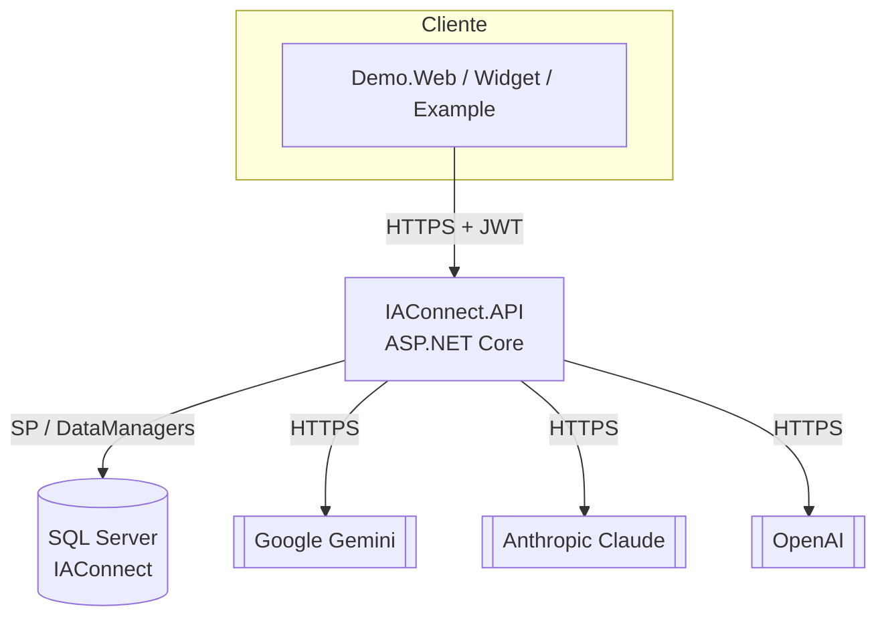

# Mapa del sistema — IAConnect

> **Resumen ejecutivo.** IAConnect es un *gateway* multi-tenant de IA conversacional construido en .NET 8
> siguiendo Clean Architecture. Este mapa inventaría cada pieza de la solución con su tipo, tecnología,
> criticidad y estado documental. Es la respuesta a *«¿qué contiene el origen?»* para humanos y agentes.

## Inventario de piezas

| Pieza | `type` (§7) | Tecnología | Criticidad | Owner | Doc de pieza |
|---|---|---|---|---|---|
| IAConnect.Domain | `library` | .NET 8 / C# | Alta | pendiente | [pieces/IAConnect.Domain](../pieces/IAConnect.Domain/README.md) |
| IAConnect.Application | `library` | .NET 8 / C# | Alta | pendiente | [pieces/IAConnect.Application](../pieces/IAConnect.Application/README.md) |
| IAConnect.Infrastructure | `library` | .NET 8 / ADO + SP, HttpClient | Alta | pendiente | [pieces/IAConnect.Infrastructure](../pieces/IAConnect.Infrastructure/README.md) |
| IAConnect.API | `service` | ASP.NET Core Web API | **Crítica** | pendiente | [pieces/IAConnect.API](../pieces/IAConnect.API/README.md) |
| IAConnect.ChatWidget | `component-library` | Blazor RCL | Media | pendiente | [pieces/IAConnect.ChatWidget](../pieces/IAConnect.ChatWidget/README.md) |
| IAConnect.Demo.Web | `web-portal` | Blazor Server | Baja (demo) | pendiente | [pieces/IAConnect.Demo.Web](../pieces/IAConnect.Demo.Web/README.md) |
| IAConnect.Example | `library` (sample) | .NET 8 consola | Baja | pendiente | [pieces/IAConnect.Example](../pieces/IAConnect.Example/README.md) |
| IAConnect.Tests | test-support | xUnit | Media | pendiente | [pieces/IAConnect.Tests](../pieces/IAConnect.Tests/README.md) |
| Base de datos `IAConnect` | `database` | SQL Server 2022 | **Crítica** | pendiente | [03-data](../03-data/data-dictionary.md) |

> Criticidad estimada por bus factor y por dependencia en el flujo principal (§9.2); **inferida**, sujeta a
> validación humana.

## Mapa de contenedores (C4-L2, resumen)

Detalle → [01-architecture/02-containers.md](../01-architecture/02-containers.md).

## Relaciones entre piezas

- `Demo.Web` → `ChatWidget` (referencia de proyecto) → `IAConnect.API` (HTTP).
- `IAConnect.API` → `Application` + `Infrastructure` + `Domain` (referencias de proyecto).
- `Application` y `Infrastructure` → `Domain`.
- `Infrastructure` → base de datos `IAConnect` (SP) y proveedores IA externos (HTTP).

## Estándares aplicables por pieza (Anexo A)

| Pieza | Estándares activados |
|---|---|
| IAConnect.API | OpenAPI 3.x (A.11), RFC 9457, OWASP ASVS (A.16), C4 (A.8) |
| IAConnect.ChatWidget | SemVer (A.12), WCAG 2.x (A.15, por UI) |
| IAConnect.Demo.Web | WCAG 2.x (A.15) |
| IAConnect.Application/Domain/Infrastructure | SemVer (A.12), Keep a Changelog (A.13) |
| Base de datos | dbml (A.18), ISO 29119 (A.19, casos derivados §15) |

`solution.regulated = false` → el perfil regulado A.17 **no** se activa (revisar si el dominio del cliente lo exige).
