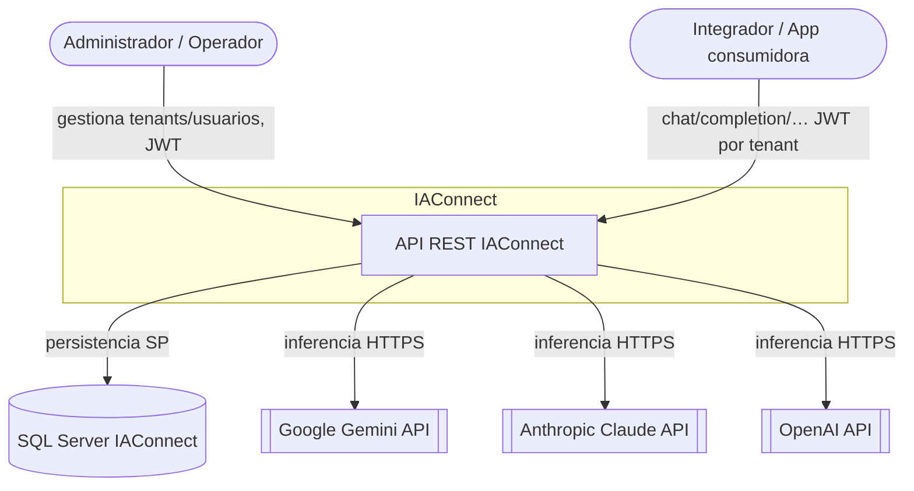

# Contexto del sistema (C4 — Nivel 1) — IAConnect

> **Resumen ejecutivo.** IAConnect se sitúa entre los productos consumidores (widget, portales, integraciones) y
> los proveedores externos de IA. Su frontera de sistema es la **API REST**; hacia afuera depende de tres
> proveedores IA y de una base de datos SQL Server.

## Diagrama de contexto

## Actores y sistemas externos

| Elemento | Tipo | Relación con IAConnect |
|---|---|---|
| Administrador / Operador | Persona | Autentica (JWT) y administra tenants, usuarios y conocimiento |
| Integrador / App consumidora | Sistema/Persona | Consume la API IA por tenant (vía widget, portal o cliente propio) |
| Google Gemini | Sistema externo | Proveedor de inferencia (HTTPS) |
| Anthropic Claude | Sistema externo | Proveedor de inferencia (`https://api.anthropic.com/`) |
| OpenAI | Sistema externo | Proveedor de inferencia (HTTPS) |
| SQL Server `IAConnect` | Almacén | Configuración de tenants, usuarios, sesiones, mensajes, conocimiento, métricas |

## Fronteras y responsabilidades

- IAConnect **es responsable** de: autenticación/autorización, resolución y aislamiento de tenant, orquestación
  del proveedor IA, memoria de conversación, RAG y métricas.
- IAConnect **no es responsable** de: la calidad del modelo (delegada al proveedor), la UI final del integrador,
  la gestión de las claves del proveedor más allá de almacenarlas por tenant.

## Requisitos transversales de contexto

- Toda solicitud IA requiere JWT válido y un `tenantId` accesible por el usuario.
- La selección de proveedor es transparente al consumidor (ADR-0004).

Detalle de contenedores → [02-containers.md](02-containers.md).
