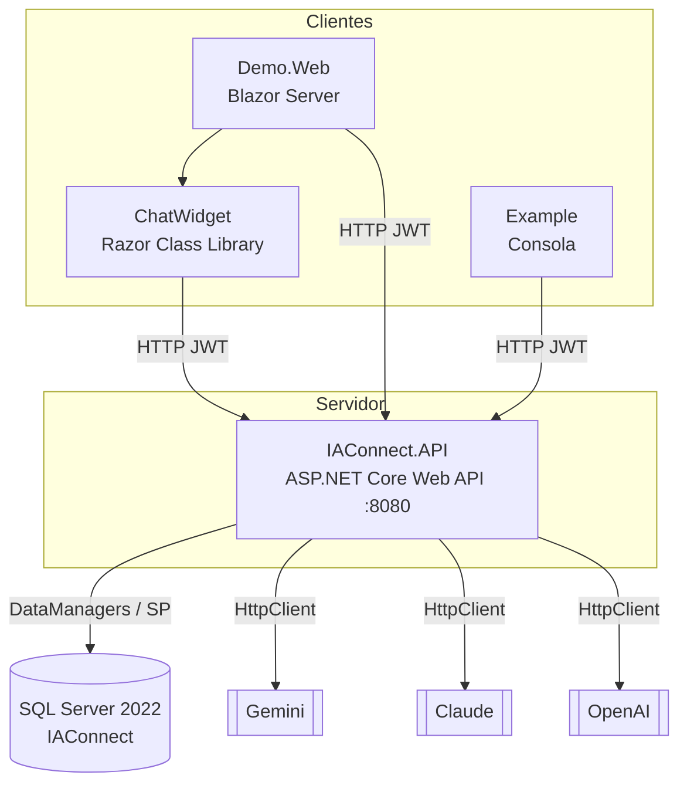

# Contenedores (C4 — Nivel 2) — IAConnect

> **Resumen ejecutivo.** La solución se despliega como una **API ASP.NET Core** (única unidad ejecutable de
> servidor) respaldada por **SQL Server**, más artefactos cliente (widget Blazor RCL, web demo Blazor Server,
> ejemplo de consola). La API concentra la lógica; los clientes la consumen por HTTP+JWT.

## Diagrama de contenedores

## Contenedores y responsabilidades

| Contenedor | Ejecutable | Tecnología | Responsabilidad |
|---|---|---|---|
| IAConnect.API | Sí (`dotnet IAConnect.API.dll`) | ASP.NET Core Web API | Autenticación, autorización, resolución de tenant, orquestación IA, RAG, métricas, Swagger |
| SQL Server `IAConnect` | Sí (contenedor `mssql/server:2022`) | SQL Server | Persistencia (7 tablas + SP CRUD) |
| IAConnect.Demo.Web | Sí | Blazor Server | Portal de demostración de las capacidades |
| IAConnect.ChatWidget | No (librería) | Blazor RCL | Componente de chat embebible |
| IAConnect.Example | Sí (consola) | .NET 8 | Ejemplo de integración |

## Módulos internos de la API (referencias de proyecto)

`IAConnect.API` compone en tiempo de ejecución (DI en `Program.cs`) tres librerías:

| Librería | Aporta |
|---|---|
| IAConnect.Domain | Entidades, enums, excepciones, contratos (interfaces) |
| IAConnect.Application | Servicios de casos de uso, DTOs |
| IAConnect.Infrastructure | DataManagers (SP), `DataEntityCore`, proveedores IA + factory |

Detalle de componentes internos → [03-components.md](03-components.md).

## Comunicación

| Origen → Destino | Protocolo | Auth |
|---|---|---|
| Clientes → API | HTTP/HTTPS REST | JWT Bearer |
| API → SQL Server | TDS (ADO.NET / SP) | Cadena `ConnectionStrings:IAConnect` |
| API → Proveedores IA | HTTPS | API key por tenant (`lut_Tenants.ApiKey_IA`) / config |

## Puertos (observados)

- API: `8080` (contenedor), `5051` http / `7167` https (dev, `launchSettings.json`).
- SQL Server: `1433` (docker-compose).

Despliegue e infraestructura → [05-deployment.md](05-deployment.md).
