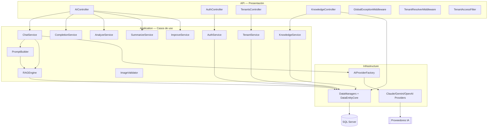

# Componentes de la API (C4 — Nivel 3) — IAConnect

> **Resumen ejecutivo.** Zoom sobre el contenedor `IAConnect.API`: controladores REST, pipeline de middleware,
> servicios de aplicación y su acceso a datos/proveedores. La regla de dependencia apunta a `Domain`.

## Diagrama de componentes



## Componentes clave

| Componente | Capa | Responsabilidad | Fuente |
|---|---|---|---|
| `AIController` | API | Endpoints IA por tenant; obtiene `userId` del JWT | `API/Controllers/AIController.cs` |
| `AuthController` | API | Login/refresh/logout + CRUD usuarios (admin) | `API/Controllers/AuthController.cs` |
| `TenantsController` | API | CRUD tenants (admin) | `API/Controllers/TenantsController.cs` |
| `KnowledgeController` | API | Carga/listado de fragmentos RAG (admin) | `API/Controllers/KnowledgeController.cs` |
| `GlobalExceptionMiddleware` | API | Mapea excepciones de dominio → HTTP | `API/Middleware/GlobalExceptionMiddleware.cs` |
| `TenantResolverMiddleware` | API | Resuelve el tenant de la ruta; 404 si inactivo/inexistente | `API/Middleware/TenantResolverMiddleware.cs` |
| `TenantAccessFilter` | API | Autoriza acceso al tenant (admin: cualquiera; operador: el propio) | `API/Middleware/TenantAccessFilter.cs` |
| `ChatService`/…/`ImproveService` | Application | Casos de uso IA | `Application/Services/*.cs` |
| `PromptBuilder` / `RAGEngine` | Application | Ensamblado de prompt + recuperación de contexto | `Application/Services/{PromptBuilder,RAGEngine}.cs` |
| `AIProviderFactory` + Providers | Infrastructure | Selección y llamada al proveedor IA | `Infrastructure/Providers/*.cs` |
| `DataEntityCore` + `*DataManager` | Infrastructure | Acceso a datos vía SP | `Infrastructure/DataAccess`, `Infrastructure/DataManagers/**` |

## Pipeline de la solicitud (orden real, `Program.cs`)

```text
GlobalExceptionMiddleware → Swagger → CORS → Authentication → Authorization
  → TenantResolverMiddleware → Endpoints (Controllers) → /health
```

> **Observación (a verificar).** `TenantResolverMiddleware` lee `Request.RouteValues["tenantId"]`; como se registra
> como middleware previo a `MapControllers`, conviene verificar que el enrutamiento ya haya poblado los route values
> en ese punto (si no, el resolver no cortaría por tenant inactivo y esa validación recaería en `TenantAccessFilter`
> + el servicio). Registrado como hecho para revisión, no como defecto confirmado.

Detalle por pieza → [pieces/IAConnect.API](../pieces/IAConnect.API/README.md),
[pieces/IAConnect.Application](../pieces/IAConnect.Application/README.md),
[pieces/IAConnect.Infrastructure](../pieces/IAConnect.Infrastructure/README.md).
