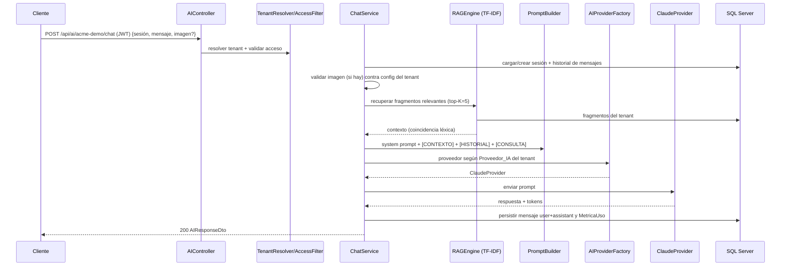
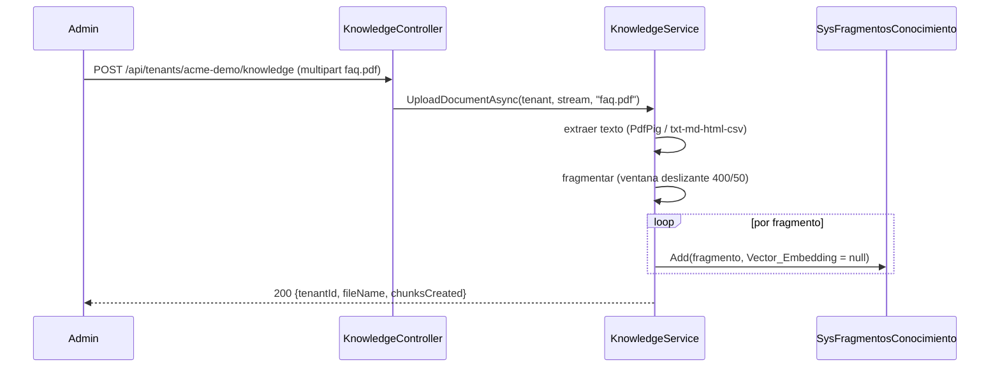

# Vistas de runtime — flujos clave — IAConnect

> **Resumen ejecutivo.** Narración de punta a punta de los tres flujos críticos con **datos sintéticos**:
> (1) login, (2) chat con memoria + RAG, (3) carga de conocimiento. Los datos de ejemplo son ficticios y
> coherentes con el modelo real; ninguno proviene de datos productivos.

## Flujo 1 — Login y emisión de tokens

Datos sintéticos: usuario `operador_demo`, tenant `acme-demo`.

```mermaid
sequenceDiagram
    participant Cli as Cliente
    participant AU as AuthController
    participant S as AuthService
    participant DB as SysUsuarios/SysRefreshTokens
    Cli->>AU: POST /api/auth/login {usuario, password}
    AU->>S: LoginAsync(request)
    S->>DB: GetByNombreUsuario(usuario)
    S->>S: verificar hash (BCrypt); ¿bloqueado?
    alt credenciales válidas
        S->>DB: reset intentos; guarda refresh token
        S-->>Cli: 200 {accessToken (JWT), refreshToken, expiración}
    else inválidas
        S->>DB: incrementa Intentos_Fallidos (bloqueo a los 5 por 15 min)
        S-->>Cli: 401 InvalidCredentials / 423 AccountLocked
    end
```

Detalles verificados: hash **BCrypt**; JWT **HmacSha256**; **bloqueo a los 5 intentos por 15 min**; refresh token
de 64 bytes aleatorios con rotación; expiraciones tomadas de la config del tenant. Fuente:
`Application/Services/AuthService.cs`. Mapeo de errores: `AccountLocked→423`, `InvalidCredentials→401`
(`GlobalExceptionMiddleware`).

## Flujo 2 — Chat con memoria de conversación + RAG

Datos sintéticos: tenant `acme-demo` (proveedor `claude`), sesión `11111111-1111-1111-1111-111111111111`,
mensaje "¿Cuál es el horario de atención?".



> **⚠ Divergencia relevante (reportada, no resuelta).** Aunque el modelo de datos tiene
> `sys_Fragmentos_Conocimiento.Vector_Embedding` y el documento de origen `rag-spec_v1.0.md` describe
> **embeddings + similitud coseno (threshold 0.75)**, el código real (`RAGEngine.cs`, `KnowledgeService.cs`)
> implementa **recuperación léxica TF-IDF en memoria** con *fallback* por substring; `Vector_Embedding` se guarda
> `null` y el helper `SerializeEmbedding` está muerto. **Gana el código:** el RAG hoy **no es semántico**.
> Ver [ADR-0006](../04-decisions/ADR-0006-rag-por-tenant.md) y el gap `GAP-RAG-SEMANTIC`.

Nota: `completion/analyze/summarize/improve` son **stateless** (sin historial); `completion` usa RAG + system
prompt; `analyze/summarize/improve` usan un system prompt especializado por enum, sin RAG.

## Flujo 3 — Carga de documento a la base de conocimiento (RAG)

Datos sintéticos: tenant `acme-demo`, archivo `faq.pdf`.



Detalles verificados: PDF vía **PdfPig**; también txt/md/html/csv; **fragmentación por ventana deslizante 400/50**;
el embedding **no se calcula** (se persiste `null`). Fuente: `Application/Services/KnowledgeService.cs`.

## Trazabilidad de flujos

| Flujo | Casos de uso | Requisitos | Tests |
|---|---|---|---|
| Login | — | RF-AUTH, RNF-SEC | `Integration/AuthControllerIntegrationTests` |
| Chat + RAG | CU-01, CU-07 | RF-CHAT, RF-KNOW | `Unit/Services/ChatServiceTests`, `RAGEngineTests` (solo fallback) |
| Carga conocimiento | CU-07 | RF-KNOW | *(sin test — gap)* |
