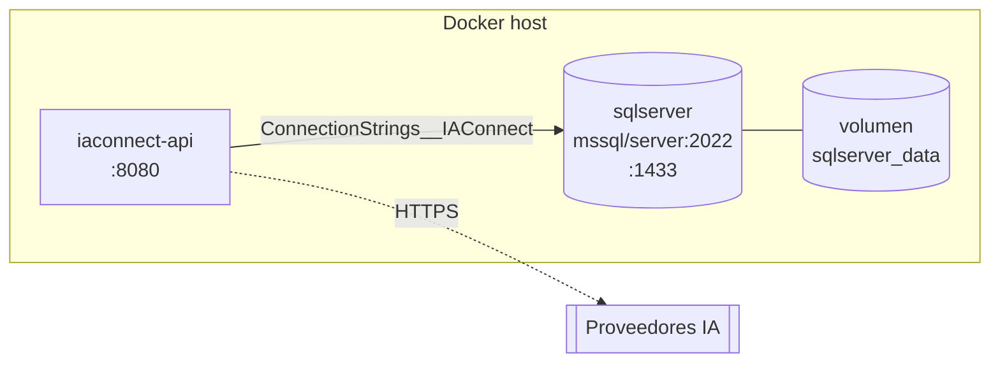

# Despliegue e infraestructura — IAConnect

> **Resumen ejecutivo.** La API se empaqueta en una imagen Docker multi-stage (.NET 8) y se orquesta con
> `docker-compose` junto a SQL Server 2022. La imagen corre como **usuario no-root** y expone un *health check*.

## Topología de despliegue (docker-compose)

## Artefactos

| Artefacto | Detalle | Fuente |
|---|---|---|
| `Dockerfile` | Multi-stage: `sdk:8.0` build/publish → `aspnet:8.0` runtime; usuario `appuser` no-root; `EXPOSE 8080`; `HEALTHCHECK /health`; `ENTRYPOINT dotnet IAConnect.API.dll` | `Dockerfile` |
| `docker-compose.yml` | Servicios `iaconnect-api` + `sqlserver`, healthchecks, volumen persistente, red bridge | `docker-compose.yml` |
| Script de BD | `scripts/01_create_database.sql` (BD, 7 tablas, índices, SP) ejecutado con `sqlcmd` | `scripts/` |

## Configuración por variables de entorno (compose)

La API recibe su configuración por variables (formato `Seccion__Clave`): `ConnectionStrings__IAConnect`,
`Jwt__SecretKey/Issuer/Audience/…`, `Encryption__Key`. La clave de cifrado de API keys de tenant se toma de la
variable **`IACONNECT_ENCRYPTION_KEY`** (usada por `TenantService`; ver [06-crosscutting](06-crosscutting.md)).

> **⚠ Seguridad.** `docker-compose.yml` y `appsettings.Development.json` contienen **valores por defecto de
> desarrollo** (`dev-secret-key…`, contraseña `sa` de ejemplo). **No deben usarse en producción**: deben provenir
> de un gestor de secretos. Esos valores **no se reproducen** en esta documentación.

## Ambientes

| Ambiente | URL API | Notas |
|---|---|---|
| Local (dotnet run) | `http://localhost:5051` · `https://localhost:7167` | `launchUrl: swagger` |
| Local (IIS Express) | `http://localhost:3283` · ssl `44330` | — |
| Contenedor | `http://+:8080` | `ASPNETCORE_URLS` |

## Salud y readiness

- Endpoint `GET /health` (`AddHealthChecks`); healthchecks de compose para API y SQL Server.
- SQL Server: healthcheck vía `sqlcmd SELECT 1`; `start_period` 10 s; API depende de `service_healthy`.

## Pendientes / gaps operativos

- No hay pipeline CI/CD versionado en el origen (verificar fuera del repo).
- No hay manifiestos de orquestación productiva (k8s/helm) — solo `docker-compose` de desarrollo.
- Estrategia de backup/retención de SQL Server no documentada en el origen → gap (ver [07-operations](../07-operations/runbook-api.md)).
