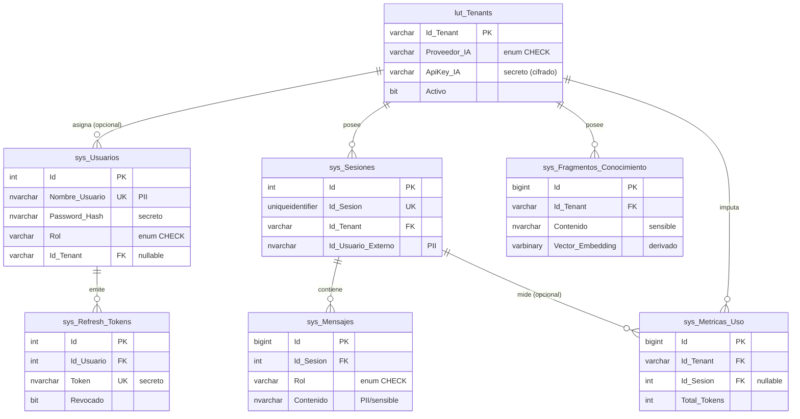

# Diccionario de datos — IAConnect

> **Origen:** ingeniería inversa del DDL `01_create_database.sql` y del código C#. Sin acceso en vivo a la base.
> **Confianza:** alta en estructura (columnas, tipos, claves, índices, FKs); media en semántica de negocio (inferida del código y de la documentación técnica; marcada donde corresponde).
> **Seguridad:** este documento NO contiene credenciales, API keys ni hashes reales.

## 1. Resumen ejecutivo

`IAConnect` (SQL Server) es la base de la plataforma **multi-tenant** IAConnect (.NET 8), que actúa como puente entre aplicaciones cliente y proveedores de IA (Gemini, Claude, OpenAI). Almacena:

- **Configuración por tenant** (`lut_Tenants`): proveedor, modelo, prompt de sistema, API key cifrada, parámetros de imagen y de expiración JWT.
- **Usuarios de gestión y seguridad** (`sys_Usuarios`, `sys_Refresh_Tokens`): backoffice con roles `admin`/`operador`, bloqueo por intentos y refresh tokens JWT.
- **Conversación** (`sys_Sesiones`, `sys_Mensajes`): sesiones e historial de chat.
- **Conocimiento y telemetría** (`sys_Fragmentos_Conocimiento`, `sys_Metricas_Uso`): base RAG y métricas de consumo de tokens.

| Métrica | Valor |
|---|---|
| Tablas | 7 |
| Claves foráneas | 7 |
| Índices no clúster explícitos (`IX_*`) | 17 |
| Índices únicos por constraint `UNIQUE` | 3 (`Nombre_Usuario`, `Id_Sesion`, `Token`) |
| CHECK constraints (enums) | 3 (`Proveedor_IA`, `Rol` usuario, `Rol` mensaje) |
| Stored procedures | 75 (patrón CRUD + `GetBy_`) |
| Columnas PII / secreto marcadas | 11 |

Convención de nombres: prefijo `lut_` = configuración (lookup); `sys_` = operativa. Todas las tablas tienen auditoría (`Fecha_Alta`, `Fecha_Modificacion`, `Usuario_Alta`, `Usuario_Modificacion`) con timestamps **UTC** (`GETUTCDATE()`).

## 2. Diagrama ER



Modelo ER como código: [`er-diagrams/iaconnect.dbml`](./er-diagrams/iaconnect.dbml).

## 3. Tablas

Leyenda de columnas: **Nulo** = admite NULL. **PII** = 🔴 secreto · 🟠 PII/sensible · — sin clasificar. **Traza** = origen (DDL línea / Model / Entity).

### 3.1 `lut_Tenants` — Configuración maestra por tenant

**Propósito:** parámetros de comportamiento de cada tenant: proveedor/modelo de IA, prompt de sistema, credencial cifrada, límites de imagen y expiración de tokens. Es la tabla raíz del modelo multi-tenant. **Retención:** permanente (dato maestro); baja lógica vía `Activo`.

| Columna | Tipo | Nulo | Default | PII | Descripción (semántica) | Traza |
|---|---|---|---|---|---|---|
| Id_Tenant | varchar(50) | No | — (PK) | — | Clave de negocio (slug) del tenant, ej. `boleteria-digital`. | DDL:33 / `LutTenantsModel.Id_Tenant` / `Tenant.IdTenant` |
| Nombre | nvarchar(100) | No | — | — | Nombre legible del tenant. | DDL:34 |
| Proveedor_IA | varchar(20) | No | — | — | Proveedor de IA. **Enum CHECK:** `gemini`\|`claude`\|`openai`. | DDL:35 |
| System_Prompt | nvarchar(MAX) | No | — | 🟠 | Config sensible: prompt que define la persona/rol del asistente. | DDL:36 |
| Nombre_Modelo | varchar(50) | No | — | — | Modelo concreto del proveedor (ej. `gemini-2.5-flash`, `claude-sonnet-4-5`). | DDL:37 |
| Temperatura | decimal(3,2) | No | 0.7 | — | Creatividad del LLM. Rango inferido 0.00–2.00 (**sin CHECK**). | DDL:38 |
| Max_Tokens | int | No | 4000 | — | Tope de tokens de la respuesta. | DDL:39 |
| ApiKey_IA | varchar(500) | No | — | 🔴 | **Secreto:** API key del proveedor, **cifrada at-rest** (AES; clave por env `IACONNECT_ENCRYPTION_KEY` — ver [06-crosscutting](../01-architecture/06-crosscutting.md); ⚠ fallback a texto plano si falta la clave). Nunca en claro. | DDL:40 |
| Permite_Imagenes | bit | No | 0 | — | Habilita entrada multimodal (imágenes). | DDL:41 |
| Max_Tamano_Imagen_KB | int | No | 2048 | — | Tamaño máximo de imagen aceptada (KB). | DDL:42 |
| Formatos_Imagen_Permitidos | varchar(100) | No | 'PNG,JPG,WEBP' | — | Lista CSV de extensiones permitidas. | DDL:43 |
| Activo | bit | No | 1 | — | Baja lógica del tenant. | DDL:44 |
| Access_Token_Expiracion_Minutos | int | No | 60 | — | Vida del access token JWT. Rango doc 5–1440 (**sin CHECK**). | DDL:45 |
| Refresh_Token_Expiracion_Dias | int | No | 7 | — | Vida del refresh token JWT. Rango doc 1–90 (**sin CHECK**). | DDL:46 |
| Mensaje_Bienvenida | nvarchar(500) | Sí | NULL | — | Saludo inicial mostrado al usuario. | DDL:47 |
| Fecha_Alta | datetime2 | No | GETUTCDATE() | — | Auditoría: alta (UTC). | DDL:48 |
| Fecha_Modificacion | datetime2 | No | GETUTCDATE() | — | Auditoría: última modificación (UTC). | DDL:49 |
| Usuario_Alta | nvarchar(100) | No | 'SYSTEM' | — | Auditoría: autor del alta. | DDL:50 |
| Usuario_Modificacion | nvarchar(100) | No | 'SYSTEM' | — | Auditoría: autor de la modificación. | DDL:51 |

Índices: `IX_lut_Tenants_Proveedor_IA` (Proveedor_IA), `IX_lut_Tenants_Activo` (Activo).

### 3.2 `sys_Usuarios` — Usuarios de gestión (backoffice)

**Propósito:** cuentas de gestión con rol (`admin`/`operador`) y control de bloqueo por intentos. Un usuario puede ser global (`Id_Tenant` NULL, típicamente admin) o estar acotado a un tenant. **Retención:** permanente; baja lógica vía `Activo`.

| Columna | Tipo | Nulo | Default | PII | Descripción (semántica) | Traza |
|---|---|---|---|---|---|---|
| Id | int IDENTITY | No | — (PK) | — | PK sustituta. | DDL:62 |
| Nombre_Usuario | nvarchar(100) | No | — (UNIQUE) | 🟠 | PII: login único del usuario. | DDL:63 |
| Password_Hash | nvarchar(200) | No | — | 🔴 | **Secreto:** hash de contraseña (bcrypt `$2a$12$…`). Nunca la contraseña en claro. | DDL:64 |
| Nombre_Completo | nvarchar(200) | No | — | 🟠 | PII: nombre y apellido. | DDL:65 |
| Email | nvarchar(200) | Sí | NULL | 🟠 | PII: correo electrónico. | DDL:66 |
| Rol | varchar(20) | No | — | — | Rol de autorización. **Enum CHECK:** `admin`\|`operador`. | DDL:67 |
| Id_Tenant | varchar(50) | Sí | NULL | — | FK a `lut_Tenants`; NULL = admin global. | DDL:68 |
| Activo | bit | No | 1 | — | Baja lógica del usuario. | DDL:69 |
| Intentos_Fallidos | int | No | 0 | — | Contador de logins fallidos; se resetea en login exitoso. | DDL:70 |
| Fecha_Bloqueo | datetime2 | Sí | NULL | — | Fecha/hora hasta la que la cuenta está bloqueada; NULL = no bloqueada. | DDL:71 |
| Fecha_Alta / Fecha_Modificacion / Usuario_Alta / Usuario_Modificacion | datetime2 / nvarchar(100) | No | GETUTCDATE() / 'SYSTEM' | — | Auditoría estándar. | DDL:72-75 |

Índices: `IX_sys_Usuarios_Id_Tenant`, `IX_sys_Usuarios_Rol`, `IX_sys_Usuarios_Activo`.
**Regla de negocio:** 5 intentos fallidos ⇒ bloqueo 15 min (`autenticacion_v1.0.md §9`, `decisiones-arquitectura_v1.0.md`). La lógica de conteo/bloqueo se ejecuta en la capa de aplicación vía `SP_sys_Usuarios_Update` (no hay trigger en BD).

### 3.3 `sys_Sesiones` — Sesiones de conversación

**Propósito:** sesión de chat por tenant. Presenta **doble identidad**: `Id` (int interno, referenciado por FKs) e `Id_Sesion` (GUID público expuesto por la API). **Retención:** inferida — candidata a purga por antigüedad (GAP: no definida en esquema).

| Columna | Tipo | Nulo | Default | PII | Descripción (semántica) | Traza |
|---|---|---|---|---|---|---|
| Id | int IDENTITY | No | — (PK) | — | PK interna; destino de FKs de mensajes y métricas. | DDL:87 |
| Id_Sesion | uniqueidentifier | No | NEWID() (UNIQUE) | — | Identificador público de sesión (GUID). | DDL:88 |
| Id_Tenant | varchar(50) | No | — | — | FK a `lut_Tenants`; tenant dueño. | DDL:89 |
| Id_Usuario_Externo | nvarchar(100) | Sí | NULL | 🟠 | PII: identificador del usuario final externo. | DDL:90 |
| Fecha_Inicio | datetime2 | No | GETUTCDATE() | — | Inicio de la sesión. | DDL:91 |
| Fecha_Ultima_Actividad | datetime2 | No | GETUTCDATE() | — | Última interacción; base de expiración de sesión. | DDL:92 |
| Activo | bit | No | 1 | — | Sesión abierta (1) / cerrada (0). | DDL:93 |
| Fecha_Alta / Fecha_Modificacion / Usuario_Alta / Usuario_Modificacion | datetime2 / nvarchar(100) | No | GETUTCDATE() / 'SYSTEM' | — | Auditoría estándar. | DDL:94-97 |

Índices: `IX_sys_Sesiones_Id_Tenant`, `IX_sys_Sesiones_Activo`, `IX_sys_Sesiones_Id_Tenant_Activo` (compuesto).

### 3.4 `sys_Mensajes` — Historial de chat

**Propósito:** cada turno de la conversación (usuario, asistente o sistema) con contadores de tokens y metadatos de imagen. **Retención:** inferida — sujeta a política de datos personales (GAP: no definida).

| Columna | Tipo | Nulo | Default | PII | Descripción (semántica) | Traza |
|---|---|---|---|---|---|---|
| Id | bigint IDENTITY | No | — (PK) | — | PK. | DDL:109 |
| Id_Sesion | int | No | — | — | FK a `sys_Sesiones.Id` (PK interna int, **no** el GUID). | DDL:110 |
| Rol | varchar(20) | No | — | — | Emisor del turno. **Enum CHECK:** `user`\|`assistant`\|`system`. | DDL:111 |
| Contenido | nvarchar(MAX) | No | — | 🟠 | PII/sensible: texto del mensaje; puede contener datos personales del usuario final. | DDL:112 |
| Tiene_Imagen | bit | No | 0 | — | Indica adjunto de imagen. | DDL:113 |
| Tamano_Imagen_KB | int | Sí | NULL | — | Tamaño de la imagen adjunta (KB). | DDL:114 |
| Proveedor_Usado | varchar(20) | Sí | NULL | — | Proveedor IA que generó la respuesta (**sin CHECK**; enum solo en app). | DDL:115 |
| Tokens_Prompt | int | Sí | NULL | — | Tokens consumidos por el prompt. | DDL:116 |
| Tokens_Respuesta | int | Sí | NULL | — | Tokens generados en la respuesta. | DDL:117 |
| Fecha_Envio | datetime2 | No | GETUTCDATE() | — | Momento del mensaje. | DDL:118 |
| Fecha_Alta / Fecha_Modificacion / Usuario_Alta / Usuario_Modificacion | datetime2 / nvarchar(100) | No | GETUTCDATE() / 'SYSTEM' | — | Auditoría estándar. | DDL:119-122 |

Índices: `IX_sys_Mensajes_Id_Sesion`.

### 3.5 `sys_Fragmentos_Conocimiento` — Base de conocimiento (RAG)

**Propósito:** fragmentos (chunks) de documentos por tenant, con embedding vectorial para recuperación semántica (RAG, `similarity_threshold` 0.75 en `rag-spec_v1.0.md`). **Retención:** ligada al ciclo de vida del documento origen (GAP: sin borrado en cascada por `Documento_Origen`).

| Columna | Tipo | Nulo | Default | PII | Descripción (semántica) | Traza |
|---|---|---|---|---|---|---|
| Id | bigint IDENTITY | No | — (PK) | — | PK. | DDL:134 |
| Id_Tenant | varchar(50) | No | — | — | FK a `lut_Tenants`; tenant dueño. | DDL:135 |
| Documento_Origen | nvarchar(255) | No | — | — | Nombre/identificador del documento fuente. | DDL:136 |
| Indice_Fragmento | int | No | — | — | Orden del fragmento (chunk) dentro del documento. | DDL:137 |
| Contenido | nvarchar(MAX) | No | — | 🟠 | Sensible: texto del fragmento indexado. | DDL:138 |
| Vector_Embedding | varbinary(MAX) | Sí | NULL | 🔴 | Secreto/derivado: embedding vectorial (binario) del contenido; no exponer. | DDL:139 |
| Fecha_Alta / Fecha_Modificacion / Usuario_Alta / Usuario_Modificacion | datetime2 / nvarchar(100) | No | GETUTCDATE() / 'SYSTEM' | — | Auditoría estándar. | DDL:140-143 |

Índices: `IX_sys_Fragmentos_Conocimiento_Id_Tenant`, `IX_sys_Fragmentos_Conocimiento_Id_Tenant_Documento_Origen` (compuesto).

### 3.6 `sys_Metricas_Uso` — Telemetría de consumo

**Propósito:** registro append-only de consumo de tokens y latencia por solicitud, para facturación/observabilidad. **Retención:** inferida — candidata a agregación/archivado por `Fecha_Solicitud` (GAP: sin política).

| Columna | Tipo | Nulo | Default | PII | Descripción (semántica) | Traza |
|---|---|---|---|---|---|---|
| Id | bigint IDENTITY | No | — (PK) | — | PK. | DDL:155 |
| Id_Tenant | varchar(50) | No | — | — | FK a `lut_Tenants`; tenant al que se imputa el consumo. | DDL:156 |
| Id_Sesion | int | Sí | NULL | — | FK opcional a `sys_Sesiones.Id`; NULL en operaciones sin sesión. | DDL:157 |
| Proveedor | varchar(20) | No | — | — | Proveedor IA usado (**sin CHECK**; enum solo en app). | DDL:158 |
| Modelo | varchar(50) | No | — | — | Modelo concreto usado. | DDL:159 |
| Tokens_Prompt | int | No | — | — | Tokens de entrada. | DDL:160 |
| Tokens_Respuesta | int | No | — | — | Tokens de salida. | DDL:161 |
| Total_Tokens | int | No | — | — | Suma; redundante (= Prompt + Respuesta; sin trigger que lo garantice). | DDL:162 |
| Tiene_Imagen | bit | No | 0 | — | Indica solicitud multimodal. | DDL:163 |
| Fecha_Solicitud | datetime2 | No | GETUTCDATE() | — | Momento de la solicitud. | DDL:164 |
| Duracion_Ms | int | No | — | — | Latencia de la llamada al proveedor (ms). | DDL:165 |
| Fecha_Alta / Fecha_Modificacion / Usuario_Alta / Usuario_Modificacion | datetime2 / nvarchar(100) | No | GETUTCDATE() / 'SYSTEM' | — | Auditoría estándar. | DDL:166-169 |

Índices: `IX_sys_Metricas_Uso_Id_Tenant`, `IX_sys_Metricas_Uso_Id_Sesion`, `IX_sys_Metricas_Uso_Fecha_Solicitud`, `IX_sys_Metricas_Uso_Id_Tenant_Proveedor` (compuesto).

### 3.7 `sys_Refresh_Tokens` — Refresh tokens JWT

**Propósito:** almacena refresh tokens por usuario para rotación de sesión JWT. **Retención:** inferida — purgables tras `Fecha_Expiracion` o `Revocado=1` (GAP: sin job de limpieza en esquema).

| Columna | Tipo | Nulo | Default | PII | Descripción (semántica) | Traza |
|---|---|---|---|---|---|---|
| Id | int IDENTITY | No | — (PK) | — | PK. | DDL:182 |
| Id_Usuario | int | No | — | — | FK a `sys_Usuarios.Id`. | DDL:183 |
| Token | nvarchar(500) | No | — (UNIQUE) | 🔴 | **Secreto:** refresh token JWT; único; nunca loguear ni exponer. | DDL:184 |
| Fecha_Expiracion | datetime2 | No | — | — | Vencimiento del refresh token. | DDL:185 |
| Revocado | bit | No | 0 | — | Marca de revocación (logout / rotación). | DDL:186 |
| Fecha_Revocacion | datetime2 | Sí | NULL | — | Momento de revocación, si aplica. | DDL:187 |
| Fecha_Alta / Fecha_Modificacion / Usuario_Alta / Usuario_Modificacion | datetime2 / nvarchar(100) | No | GETUTCDATE() / 'SYSTEM' | — | Auditoría estándar. | DDL:188-191 |

Índices: `IX_sys_Refresh_Tokens_Id_Usuario`, `IX_sys_Refresh_Tokens_Revocado`.

## 4. Columnas PII / secreto (resumen)

| Tabla | Columna | Clasificación | Manejo requerido |
|---|---|---|---|
| lut_Tenants | ApiKey_IA | 🔴 secreto | Cifrada at-rest (AES; clave por env `IACONNECT_ENCRYPTION_KEY`); nunca en logs/respuestas |
| lut_Tenants | System_Prompt | 🟠 sensible (config) | Config de negocio; no exponer públicamente |
| sys_Usuarios | Password_Hash | 🔴 secreto | Solo hash bcrypt; nunca contraseña en claro |
| sys_Usuarios | Nombre_Usuario | 🟠 PII | Identificador de login |
| sys_Usuarios | Nombre_Completo | 🟠 PII | Minimización/anonimización en no-prod |
| sys_Usuarios | Email | 🟠 PII | Minimización/anonimización en no-prod |
| sys_Sesiones | Id_Usuario_Externo | 🟠 PII | Identificador de usuario final |
| sys_Mensajes | Contenido | 🟠 PII/sensible | Puede contener datos personales del usuario final |
| sys_Fragmentos_Conocimiento | Contenido | 🟠 sensible | Contenido de la base de conocimiento |
| sys_Fragmentos_Conocimiento | Vector_Embedding | 🔴 derivado sensible | Embedding binario; no exponer |
| sys_Refresh_Tokens | Token | 🔴 secreto | Nunca loguear ni exponer |

## 5. Stored procedures

Toda la persistencia se realiza vía **stored procedures** (patrón DataManager; no EF direct-to-table). Nomenclatura:

```
SP_<tabla>_Add | Update | Delete | GetAll | GetOne
SP_<tabla>_GetBy_<col>[_<col2>]            -- consulta filtrada
SP_<tabla>_GetBy_<col>[_<col2>]_Cantidad   -- COUNT(*) de la misma condición
```

- **CRUD base** (5 por tabla × 7 tablas = **35 SP**): `Add`, `Update`, `Delete`, `GetAll`, `GetOne`.
- **Variantes `GetBy_` (+ gemelo `_Cantidad`) = 40 SP.** Por tabla:

| Tabla | Variantes `GetBy_` (cada una con `_Cantidad`) | Nº SP GetBy |
|---|---|---|
| lut_Tenants | `Proveedor_IA`, `Activo` | 4 |
| sys_Usuarios | `Nombre_Usuario`, `Id_Tenant`, `Rol`, `Activo` | 8 |
| sys_Sesiones | `Id_Sesion`, `Id_Tenant`, `Activo`, `Id_Tenant_Activo` | 8 |
| sys_Mensajes | `Id_Sesion` | 2 |
| sys_Fragmentos_Conocimiento | `Id_Tenant`, `Id_Tenant_Documento_Origen` | 4 |
| sys_Metricas_Uso | `Id_Tenant`, `Id_Sesion`, `Fecha_Solicitud`, `Id_Tenant_Proveedor` | 8 |
| sys_Refresh_Tokens | `Id_Usuario`, `Token`, `Revocado` | 6 |

**Total: 75 stored procedures** (35 CRUD + 40 GetBy/Cantidad). Observaciones:
- `SP_<tabla>_GetAll` / `GetOne` hacen `SELECT *`; el mapeo a `*Model` es posicional por nombre.
- No existen SP específicos de login/bloqueo: el conteo de intentos y el bloqueo se resuelven en la capa de servicio combinando `GetBy_Nombre_Usuario` + `Update`.
- Los `_Cantidad` devuelven `COUNT(*)` (paginación / validación de existencia).

## 6. Enumeraciones vs. CHECK constraints

| Dominio lógico | Columna(s) | Valores | ¿CHECK en BD? |
|---|---|---|---|
| Proveedor de IA | `lut_Tenants.Proveedor_IA` | `gemini`, `claude`, `openai` | ✅ Sí (`CHECK IN`) |
| Rol de usuario | `sys_Usuarios.Rol` | `admin`, `operador` | ✅ Sí (`CHECK IN`) |
| Rol de mensaje | `sys_Mensajes.Rol` | `user`, `assistant`, `system` | ✅ Sí (`CHECK IN`) |
| Proveedor (telemetría) | `sys_Metricas_Uso.Proveedor` | mismo dominio que Proveedor_IA | ❌ **No** — free varchar; enum solo en app |
| Proveedor (mensaje) | `sys_Mensajes.Proveedor_Usado` | mismo dominio que Proveedor_IA | ❌ **No** — free varchar; enum solo en app |

**Gap de integridad:** `sys_Metricas_Uso.Proveedor` y `sys_Mensajes.Proveedor_Usado` no tienen CHECK; pueden almacenar valores fuera del enum si la app falla en validarlos. En C# los enums no se modelan como `enum`: todas las columnas de dominio son `string` en `Model`/`Entity`.

## 7. Discrepancias esquema ↔ Models ↔ Entities

- **Nomenclatura:** `Model` usa snake_case idéntico al DDL (`Id_Tenant`); `Entity` usa PascalCase (`IdTenant`). Mapeo 1:1 en todas las columnas; sin diferencias de cardinalidad de campos.
- **Defaults:** las `Entity` replican los defaults del DDL en código (`Temperatura = 0.7m`, `MaxTokens = 4000`, `MaxTamanoImagenKB = 2048`, `FormatosImagenPermitidos = "PNG,JPG,WEBP"`, `AccessTokenExpiracionMinutos = 60`, `RefreshTokenExpiracionDias = 7`, `Activo = true`, `UsuarioAlta/Modificacion = "SYSTEM"`). Los `Model` no fijan defaults (POCO de mapeo).
- **Tipos coherentes:** `uniqueidentifier`→`Guid`, `bigint`→`long`, `int`→`int`, `varbinary(MAX)`→`byte[]?`, `bit`→`bool`, `decimal(3,2)`→`decimal`, `datetime2`→`DateTime`. Nulabilidad C# (`?`) coincide con las columnas NULL.
- **Sin discrepancias estructurales detectadas.** Punto de atención (no discrepancia): la FK `sys_Mensajes.Id_Sesion` y `sys_Metricas_Uso.Id_Sesion` referencian `sys_Sesiones.Id` (int interno), **no** el GUID público `Id_Sesion`; el mapeo lo respeta (`int`).

## Referencias cruzadas

- Modelo ER (código): [`er-diagrams/iaconnect.dbml`](./er-diagrams/iaconnect.dbml)
- Políticas de acceso: [`access-policies.md`](./access-policies.md)
- Matriz de datos de prueba: [`test-data-matrix.md`](./test-data-matrix.md)
- Fixtures sintéticos: [`fixtures/iaconnect.seed.yaml`](./fixtures/iaconnect.seed.yaml)
