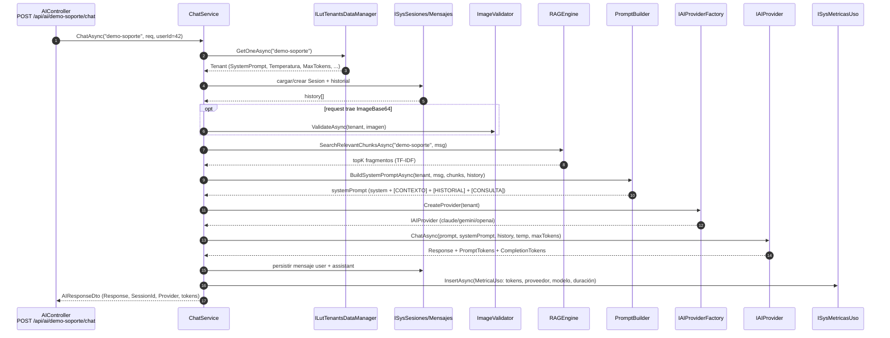

# IAConnect.Application — Servicios de aplicación

> Pieza `library` (.NET 8, `net8.0`, `Nullable` + `ImplicitUsings` habilitados). Capa de **casos de uso**
> de la solución IAConnect (gateway multi-tenant de IA, Clean Architecture).
> Fuente: `IAConnect.Application/IAConnect.Application.csproj#L1-L22`.

## 1. Resumen ejecutivo

`IAConnect.Application` es la **capa de orquestación** entre los controladores HTTP (`IAConnect.API`) y las
abstracciones de dominio (`IAConnect.Domain`). No contiene lógica de acceso a datos ni llamadas HTTP a los
proveedores de IA: **coordina** entidades de dominio, DataManagers (`IAConnect.Domain.Interfaces`) y la factory
de proveedores (`IAIProviderFactory`) para materializar cada caso de uso.

Responsabilidades que orquesta:

- **Autenticación y usuarios** — login con BCrypt, emisión/rotación de JWT y refresh tokens, bloqueo por intentos
  fallidos, ABM de usuarios (`AuthService`).
- **Casos de uso de IA** — chat multi-turno, completion, analyze, summarize, improve (`ChatService`,
  `CompletionService`, `AnalyzeService`, `SummarizeService`, `ImproveService`).
- **Multi-tenancy** — ABM de tenants y cifrado AES de su API key de IA (`TenantService`).
- **Base de conocimiento / RAG** — ingesta y fragmentación de documentos (`KnowledgeService`), recuperación
  de fragmentos (`RAGEngine`), ensamblado del prompt (`PromptBuilder`).
- **Validaciones transversales** — validación de imágenes por configuración de tenant (`ImageValidator`).

Cada invocación de IA registra una métrica de uso (`sys_Metricas_Uso`) con tokens, proveedor, modelo y duración.
Dependencias externas del `.csproj`: `BCrypt.Net-Next` (hash de contraseñas), `System.IdentityModel.Tokens.Jwt`
(JWT), `UglyToad.PdfPig` (extracción de texto de PDF) y las abstracciones de `Microsoft.Extensions.*`
(`Configuration`, `DependencyInjection`, `Logging`). Referencia de proyecto única: `IAConnect.Domain`.
`IAConnect.Application.csproj#L3-L14`.

Para el contexto de la abstracción de proveedores y RAG a nivel solución, ver
[ia-db · 04 Proveedores IA y RAG](../../../../ia-db/indexes/04_proveedores-ia-y-rag.md).

## 2. Catálogo de servicios

Los servicios se registran contra su interfaz (`IAConnect.Application.Interfaces`). Los **DataManagers** y
la **factory** provienen de `IAConnect.Domain.Interfaces`. La columna *Endpoint* referencia los controladores de
`IAConnect.API` (inferido por lectura de `Controllers/*.cs`).

| Servicio | Interfaz | Responsabilidad real | Dependencias (DataManagers / providers) | Endpoint que lo consume |
|---|---|---|---|---|
| `AuthService` | `IAuthService` | Login (BCrypt), JWT + refresh token, rotación/logout, bloqueo por intentos, ABM usuarios | `ISysUsuariosDataManager`, `ISysRefreshTokensDataManager`, `ILutTenantsDataManager`, `IConfiguration` | `POST /api/auth/{login,refresh,logout}`, `GET/POST/PUT/DELETE /api/auth/usuarios` |
| `ChatService` | `IChatService` | Chat multi-turno: sesión + historial + RAG + system prompt → proveedor; persiste mensajes y métrica | `ILutTenantsDataManager`, `ISysSesionesDataManager`, `ISysMensajesDataManager`, `ISysMetricasUsoDataManager`, `IAIProviderFactory`, `IPromptBuilder`, `IRAGEngine`, `IImageValidator` | `POST /api/ai/{tenantId}/chat` |
| `CompletionService` | `ICompletionService` | Generación de texto (stateless): RAG + system prompt → proveedor; solo métrica | `ILutTenantsDataManager`, `ISysMetricasUsoDataManager`, `IAIProviderFactory`, `IPromptBuilder`, `IRAGEngine` | `POST /api/ai/{tenantId}/completion` |
| `AnalyzeService` | `IAnalyzeService` | Análisis (`Sentiment`/`Classification`/`Entities`), system prompt especializado, parseo JSON de la respuesta | `ILutTenantsDataManager`, `ISysMetricasUsoDataManager`, `IAIProviderFactory` | `POST /api/ai/{tenantId}/analyze` |
| `SummarizeService` | `ISummarizeService` | Resumen de documento con system prompt fijo | `ILutTenantsDataManager`, `ISysMetricasUsoDataManager`, `IAIProviderFactory` | `POST /api/ai/{tenantId}/summarize` |
| `ImproveService` | `IImproveService` | Reescritura según `ObjetivoMejora` (`Clarity`/`Formality`/`Brevity`/`Expand`) | `ILutTenantsDataManager`, `ISysMetricasUsoDataManager`, `IAIProviderFactory` | `POST /api/ai/{tenantId}/improve` |
| `TenantService` | `ITenantService` | ABM de tenants, cifrado AES de API key, soft-delete | `ILutTenantsDataManager` | `GET/POST/PUT/DELETE /api/tenants` |
| `KnowledgeService` | `IKnowledgeService` | Ingesta de documento (PDF/TXT/MD/HTML/CSV), fragmentación por ventana deslizante | `ISysFragmentosConocimientoDataManager`, `ILutTenantsDataManager` | `POST /api/tenants/{tenantId}/knowledge` |
| `PromptBuilder` | `IPromptBuilder` | (Transversal) Ensambla system prompt: prompt del tenant + contexto RAG + historial + consulta | — (sin dependencias) | Usado por `ChatService`, `CompletionService` |
| `RAGEngine` | `IRAGEngine` | (Transversal) Recupera top-K fragmentos del tenant por **TF-IDF léxico** | `ISysFragmentosConocimientoDataManager`, `ILutTenantsDataManager` | Usado por `ChatService`, `CompletionService` |
| `ImageValidator` | `IImageValidator` | (Transversal) Valida imagen (permiso, tamaño, formato) contra la config del tenant | `ILutTenantsDataManager` | Usado por `ChatService` |

> Nota: `AnalyzeService`, `SummarizeService` e `ImproveService` **no** aplican RAG ni historial; construyen un
> system prompt fijo/especializado y llaman al proveedor directamente.
> `AnalyzeService.cs#L44-L60`, `SummarizeService.cs#L38-L47`, `ImproveService.cs#L43-L60`.

## 3. Detalle de los servicios clave

### 3.1 AuthService — login, JWT, refresh, bloqueo

Fuente: `Services/AuthService.cs`.

- **Bloqueo por intentos fallidos** — constantes `MaxLoginAttempts = 5` y `LockoutMinutes = 15`
  (`AuthService.cs#L25-L26`). En `LoginAsync`, si la contraseña no verifica (BCrypt), incrementa
  `IntentosFallidos`; al alcanzar 5, fija `FechaBloqueo = UtcNow + 15 min` y loguea un warning
  (`AuthService.cs#L55-L66`). Antes de validar la contraseña se comprueba el bloqueo vigente y se lanza
  `AccountLockedException` (`AuthService.cs#L51-L52`). Un login exitoso resetea `IntentosFallidos = 0` y
  `FechaBloqueo = null` (`AuthService.cs#L68-L72`). También se rechaza al usuario inactivo (`Activo == false`,
  `AuthService.cs#L47-L48`).
- **Expiraciones por tenant** — los minutos de access token y días de refresh se leen del tenant del usuario
  (`AccessTokenExpiracionMinutos`, `RefreshTokenExpiracionDias`); por defecto 60 min / 7 días si el usuario no
  tiene tenant (`AuthService.cs#L74-L85`).
- **JWT** — firmado con `HmacSha256` usando `Jwt:SecretKey` de configuración (obligatoria); claims: `sub` (Id),
  `nombre_usuario`, `id_tenant`, rol, `iat`, `jti`. Issuer/audience por defecto `IAConnect` / `IAConnect.Clients`
  (`AuthService.cs#L258-L287`).
- **Refresh token** — 64 bytes aleatorios (`RandomNumberGenerator`) en Base64 (`AuthService.cs#L289-L295`),
  persistido en `sys_RefreshTokens`. `RefreshAsync` valida no-revocado/no-expirado, **revoca el token actual**
  (rotación) y emite par nuevo (`AuthService.cs#L116-L174`). `LogoutAsync` revoca el refresh token si pertenece
  al usuario (`AuthService.cs#L176-L186`).
- **ABM usuarios** — creación con `BCrypt.HashPassword`; `DeleteUsuarioAsync` es soft-delete (`Activo = false`).
  `UsuarioAlta`/`UsuarioModificacion` se fijan a `"SYSTEM"` (`AuthService.cs#L205-L256`).

### 3.2 ChatService — historial + system prompt + provider

Fuente: `Services/ChatService.cs#L46-L189`. Flujo de `ChatAsync(tenantId, request, userId)`:

1. Carga el tenant o lanza `TenantNotFoundException` (`#L51-L52`).
2. Carga la sesión por `SessionId` (GUID) o **crea una nueva** `Sesion` asociada al tenant y al usuario externo
   (`#L55-L76`).
3. Recupera el historial de mensajes de la sesión, ordenado por `FechaEnvio`, mapeado a `ConversationMessage`
   (`#L79-L87`).
4. Si el request trae `ImageBase64`, delega en `IImageValidator.ValidateAsync` (`#L90-L94`).
5. **RAG**: `IRAGEngine.SearchRelevantChunksAsync(tenantId, message)` (`#L97`).
6. **PromptBuilder**: `BuildSystemPromptAsync(tenant, message, ragChunks, history)` (`#L102`).
7. Crea el proveedor vía `IAIProviderFactory.CreateProvider(tenant)` y llama `ChatAsync` con `Temperatura` y
   `MaxTokens` del tenant (`#L106-L116`).
8. Persiste el mensaje del usuario y la respuesta del asistente (`sys_Mensajes`), registra `MetricaUso` (tokens,
   proveedor, modelo, `DuracionMs`) y actualiza `FechaUltimaActividad` de la sesión (`#L121-L173`).

> El tamaño de imagen persistido se **estima** desde la longitud del Base64 (`Length * 3 / 4 / 1024`),
> aproximación que ignora el padding (`ChatService.cs#L127`).

### 3.3 PromptBuilder — ensamblado del prompt

Fuente: `Services/PromptBuilder.cs#L10-L55`. Es síncrono (`Task.FromResult`) y sin dependencias. Concatena en un
`StringBuilder`, en este orden:

1. `tenant.SystemPrompt`. Si el tenant define `MensajeBienvenida`, añade una instrucción para que el modelo
   **no** se presente ni salude (el sistema ya mostró la bienvenida) (`#L19-L23`).
2. Bloque `[CONTEXTO RELEVANTE]` con cada fragmento RAG numerado (`Fragmento {i+1}: "..."`) (`#L27-L35`).
3. Bloque `[HISTORIAL DE CONVERSACIÓN]` con cada turno etiquetado `User`/`Assistant` (`#L38-L48`).
4. Bloque `[CONSULTA DEL USUARIO]` con la query actual (`#L51-L52`).

Todo el contexto (RAG + historial + consulta) se coloca dentro del **system prompt**; el `Prompt` del proveedor
recibe además el mensaje del usuario por separado (ver `ChatService.cs#L107-L111`).

### 3.4 RAGEngine — recuperación de fragmentos (TF-IDF léxico)

Fuente: `Services/RAGEngine.cs#L34-L120`. **No usa embeddings ni similitud coseno**; implementa un scoring
**TF-IDF por palabras clave** en memoria:

1. Carga los fragmentos del tenant (`ISysFragmentosConocimientoDataManager.GetListByIdTenantAsync`); si no hay,
   devuelve lista vacía (`#L39-L43`).
2. **Tokeniza** la query: minúsculas, split por signos de puntuación/espacios, descarta tokens de longitud ≤ 2 y
   *stop words* ES/EN (lista embebida) (`#L93-L100`, `#L14-L24`).
3. Calcula **IDF** por término: `log(totalDocs / (1 + docsConTermino)) + 1` (`#L105-L120`).
4. Para cada fragmento calcula **TF log-normalizado** (`1 + log(tf)`); si el término no aparece como token exacto,
   aplica *fallback* de coincidencia por substring con `tf = 1`. Score = Σ (tfNorm × idf) (`#L54-L85`).
5. Ordena descendente por score, toma `topK` (default **5**, `IRAGEngine.cs#L7`) y devuelve solo los fragmentos
   con score > 0 (`#L81-L85`).

Existe un helper `internal static SerializeEmbedding(float[])` (`#L122-L127`) que **no se usa** en la recuperación
(vestigio de un diseño basado en embeddings).

### 3.5 KnowledgeService — ingesta y fragmentación

Fuente: `Services/KnowledgeService.cs#L34-L121`. `UploadDocumentAsync(tenantId, document, fileName)`:

- Valida el tenant y determina el tipo por extensión. **PDF** → extracción de texto página a página con
  `UglyToad.PdfPig` (`#L86-L101`); **`.txt/.md/.html/.htm/.csv`** → lectura directa del stream; cualquier otra
  extensión lanza `ArgumentException` (`#L43-L55`).
- **Fragmentación por ventana deslizante** sobre palabras separadas por espacios: tamaño `ChunkSizeTokens = 400`,
  solape `OverlapTokens = 50`, paso = 350 (`#L16-L17`, `#L103-L121`). Nota: "tokens" se aproxima como
  **palabras** delimitadas por whitespace.
- Persiste cada fragmento en `sys_Fragmentos_Conocimiento` con `IndiceFragmento` incremental y
  **`VectorEmbedding = null`** (`#L69-L80`). Devuelve el número de fragmentos creados.

### 3.6 ImageValidator — validación por tenant

Fuente: `Services/ImageValidator.cs#L16-L48`. `ValidateAsync(tenantId, imageBase64)` lanza
`ImageNotAllowedException` (o `TenantNotFoundException`) si:

1. El tenant no permite imágenes (`PermiteImagenes == false`) (`#L21-L22`).
2. El tamaño estimado (`Length * 3 / 4 / 1024` KB) supera `MaxTamanoImagenKB` (`#L25-L28`).
3. El formato detectado por **magic bytes** del Base64 (`/9j/`→JPG, `iVBOR`→PNG, `UklGR`→WEBP, `R0lGO`→GIF; si no,
   `UNKNOWN`) no está en `FormatosImagenPermitidos` del tenant (CSV, comparado en mayúsculas) (`#L30-L48`).

### 3.7 TenantService — ABM y cifrado de API key

Fuente: `Services/TenantService.cs`. ABM completo sobre `ILutTenantsDataManager`; `DeleteTenantAsync` es
soft-delete (`Activo = false`, `#L96-L107`). La API key del proveedor se cifra con **AES** (`EncryptApiKey`,
`#L129-L148`): clave desde la variable de entorno `IACONNECT_ENCRYPTION_KEY` (Base64), IV aleatorio por
operación prefijado al ciphertext, resultado en Base64. El `TenantDto` de salida **no** expone la API key
(`MapToDto`, `#L109-L127`).

## 4. DTOs

DTOs de `IAConnect.Application.DTOs`. Los tipos de request/response de los proveedores (`ChatRequest`,
`CompletionRequest`, etc.) pertenecen a `IAConnect.Domain` y no se listan aquí.

| Caso de uso | Request DTO | Campos clave | Response DTO | Campos clave |
|---|---|---|---|---|
| Login | `LoginRequestDto` | `NombreUsuario`, `Contraseña` | `LoginResponseDto` | `AccessToken`, `TokenType="Bearer"`, `ExpiresIn`, `RefreshToken`, `RefreshExpiresIn`, `Rol`, `IdTenant` |
| Refresh | `RefreshTokenRequestDto` | `RefreshToken` | `LoginResponseDto` | (igual que Login) |
| Chat | `ChatRequestDto` | `SessionId?`, `Message`, `ImageBase64?` | `AIResponseDto` | `Response`, `SessionId?`, `Provider`, `PromptTokens`, `CompletionTokens`, `TotalTokens` |
| Completion | `CompletionRequestDto` | `Prompt` | `AIResponseDto` | (igual que Chat, sin `SessionId`) |
| Analyze | `AnalysisRequestDto` | `Text`, `AnalysisType` | `AnalysisResponseDto` | `AnalysisType`, `Results` (`object?`, JSON parseado), `Provider`, `PromptTokens`, `CompletionTokens` |
| Summarize | `SummarizeRequestDto` | `Document` | `SummarizeResponseDto` | `Summary`, `Provider`, `PromptTokens`, `CompletionTokens` |
| Improve | `ImproveRequestDto` | `Text`, `ImprovementGoal` | `ImproveResponseDto` | `ImprovedText`, `ImprovementGoal`, `Provider`, `PromptTokens`, `CompletionTokens` |
| Crear tenant | `CreateTenantRequestDto` | `TenantId`, `Name`, `AiProvider`, `SystemPrompt`, `ModelName`, `Temperature=0.7`, `MaxTokens=4000`, `AiApiKey`, `AllowImages`, `MaxImageSizeKB=2048`, `AllowedImageFormats="PNG,JPG,WEBP"`, `AccessTokenExpirationMinutes=60`, `RefreshTokenExpirationDays=7`, `WelcomeMessage?` | `TenantDto` | Todos los anteriores + `IsActive`, `CreatedAt`, `UpdatedAt` (sin API key) |
| Actualizar tenant | `UpdateTenantRequestDto` | Todos opcionales (`nullable`), incl. `IsActive?` | `TenantDto` | (igual) |
| Crear usuario | `CreateUsuarioRequestDto` | `NombreUsuario`, `Contraseña`, `NombreCompleto`, `Email?`, `IdTenant?`, `Rol` | `UsuarioDto` | `Id`, `NombreUsuario`, `NombreCompleto`, `Email?`, `Rol`, `IdTenant?`, `Activo`, `FechaAlta`, `FechaModificacion` |
| Actualizar usuario | `UpdateUsuarioRequestDto` | `NombreCompleto?`, `Email?`, `Rol?`, `Contraseña?`, `Activo?` | `UsuarioDto` | (igual) |

## 5. Flujo de un caso de uso de punta a punta (chat)

Datos sintéticos: `tenantId = "demo-soporte"`, `Message = "¿Cuál es la política de reembolso?"`.



## 6. Snippets representativos (§13)

**Ensamblado del prompt** — `PromptBuilder.BuildSystemPromptAsync` (`Services/PromptBuilder.cs#L16-L54`, recortado):

```csharp
var sb = new StringBuilder();
sb.AppendLine(tenant.SystemPrompt);                       // 1. system prompt del tenant
if (!string.IsNullOrWhiteSpace(tenant.MensajeBienvenida))
    sb.AppendLine("IMPORTANTE: No te presentes ni incluyas saludos ...");
// …
if (ragChunks != null && ragChunks.Count > 0) {           // 2. contexto RAG
    sb.AppendLine("[CONTEXTO RELEVANTE]");
    for (int i = 0; i < ragChunks.Count; i++)
        sb.AppendLine($"Fragmento {i + 1}: \"{ragChunks[i].Contenido}\"");
}
// … 3. [HISTORIAL DE CONVERSACIÓN] con role User/Assistant …
sb.AppendLine("[CONSULTA DEL USUARIO]");                  // 4. query actual
sb.AppendLine(userQuery);
return Task.FromResult(sb.ToString());
```

**Scoring TF-IDF** — `RAGEngine.SearchRelevantChunksAsync` (`Services/RAGEngine.cs#L54-L85`, recortado):

```csharp
var idf = ComputeIdf(fragmentosList, queryTerms);         // log(N / (1+df)) + 1
var scoredFragments = fragmentosList.Select(f => {
    var fragmentTokens = Tokenize(f.Contenido);
    double score = 0;
    foreach (var term in queryTerms) {
        int tf = fragmentTokens.Count(t => t == term);
        if (tf == 0 && f.Contenido.Contains(term, StringComparison.OrdinalIgnoreCase))
            tf = 1;                                        // fallback: substring
        if (tf > 0) score += (1 + Math.Log(tf)) * idf.GetValueOrDefault(term, 1.0);
    }
    return new { Fragment = f, Score = score };
})
.Where(x => x.Score > 0).OrderByDescending(x => x.Score).Take(topK)
.Select(x => x.Fragment).ToList();
```

## 7. Gaps, observaciones y divergencias código ↔ docs

- **RAG: divergencia mayor (léxico vs. semántico).** El código implementa recuperación **TF-IDF léxica en memoria**
  (`RAGEngine.cs#L34-L120`) y `KnowledgeService` guarda `VectorEmbedding = null` (`KnowledgeService.cs#L75`). En
  cambio, `docs/05_arquitectura_tecnica/rag-spec_v1.0.md` describe **embeddings + cosine similarity** con
  `similarity_threshold = 0.75` y `embedding_model` del tenant (rag-spec §4-§6). No hay generación de embeddings,
  ni cálculo de similitud coseno, ni umbral de similitud en el código. La ficha
  [ia-db · 04](../../../../ia-db/indexes/04_proveedores-ia-y-rag.md) representa la fase de embeddings como
  `Vector_Embedding` en el diagrama, pero remite explícitamente a esta pieza para "detalle de estrategia" — que
  es TF-IDF. **Gana el código:** la recuperación actual es lexical/keyword, no semántica. (`vision-general_v1.0.md`
  ya lo matiza como "embeddings in-memory para Fase 1", pero ni siquiera hay embeddings).
- **Parámetros RAG parcialmente alineados.** `chunk_size = 400` y `chunk_overlap = 50` coinciden con rag-spec §6
  (`KnowledgeService.cs#L16-L17`), y `top_k = 5` coincide (`IRAGEngine.cs#L7`). Pero "tokens" se implementa como
  **palabras separadas por whitespace**, no tokens del modelo; y `similarity_threshold` no existe.
- **Helper de embeddings muerto.** `RAGEngine.SerializeEmbedding(float[])` es `internal` y no se invoca
  (`RAGEngine.cs#L122-L127`) — residuo del diseño basado en vectores.
- **`AuthService.GetUsuariosAsync` limitado.** Llama `GetListByIdTenantAsync(string.Empty)` y el propio código
  comenta que **puede no devolver todos los usuarios** (falta un `GetAll` en el DataManager)
  (`AuthService.cs#L188-L196`). Riesgo funcional en el endpoint `GET /api/auth/usuarios`.
- **`CreateUsuarioAsync` sin unicidad multi-tenant.** La existencia se verifica solo por `NombreUsuario` global
  (`AuthService.cs#L207-L209`); no contempla colisiones/particiones por tenant.
- **Persistencia asimétrica.** Solo `ChatService` persiste sesión e historial de mensajes; `CompletionService`,
  `AnalyzeService`, `SummarizeService` e `ImproveService` son **stateless** (solo registran `MetricaUso`). El
  `CompletionRequestDto` no admite `SessionId`.
- **Auditoría hardcodeada.** Inserciones/updates fijan `UsuarioAlta`/`UsuarioModificacion = "SYSTEM"` en todos los
  servicios (p.ej. `ChatService.cs#L73-L74`, `AuthService.cs#L223-L224`); no se propaga el usuario autenticado.
- **Estimación de tamaño de imagen.** Tanto `ImageValidator` como `ChatService` estiman KB con `Length * 3 / 4`,
  ignorando el padding Base64 (`ImageValidator.cs#L25-L26`, `ChatService.cs#L127`); ligera sobreestimación.
- **Cifrado de API key sin utilidad de descifrado en esta capa.** `TenantService.EncryptApiKey` cifra con AES
  (IV prefijado) pero el descifrado ocurre fuera de `Application` (presumiblemente en `Infrastructure`/providers);
  depende de `IACONNECT_ENCRYPTION_KEY` en entorno (`TenantService.cs#L129-L148`). *(Inferido — no verificado en
  esta pieza.)*
- **Dependencia de config JWT.** `Jwt:SecretKey` es obligatoria (lanza si falta); `Jwt:Issuer`/`Jwt:Audience`
  tienen defaults (`AuthService.cs#L258-L287`).

---

> **Procedencia y confianza.** Documento `reverse-engineered` de confianza *high*: todas las afirmaciones son
> trazables a `IAConnect.Application/**` (rutas#Lx citadas). El mapeo servicio→endpoint se infirió de
> `IAConnect.API/Controllers/*.cs`. Las divergencias de la §7 contrastan el código con
> `NG/Ng-IAServices/docs/**` y `ia-db/indexes/04_proveedores-ia-y-rag.md`; ante conflicto, prevalece el código.
