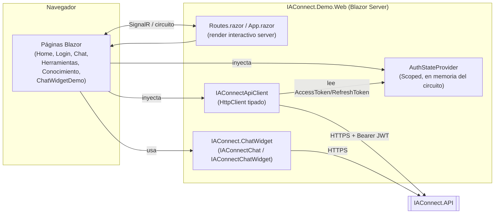
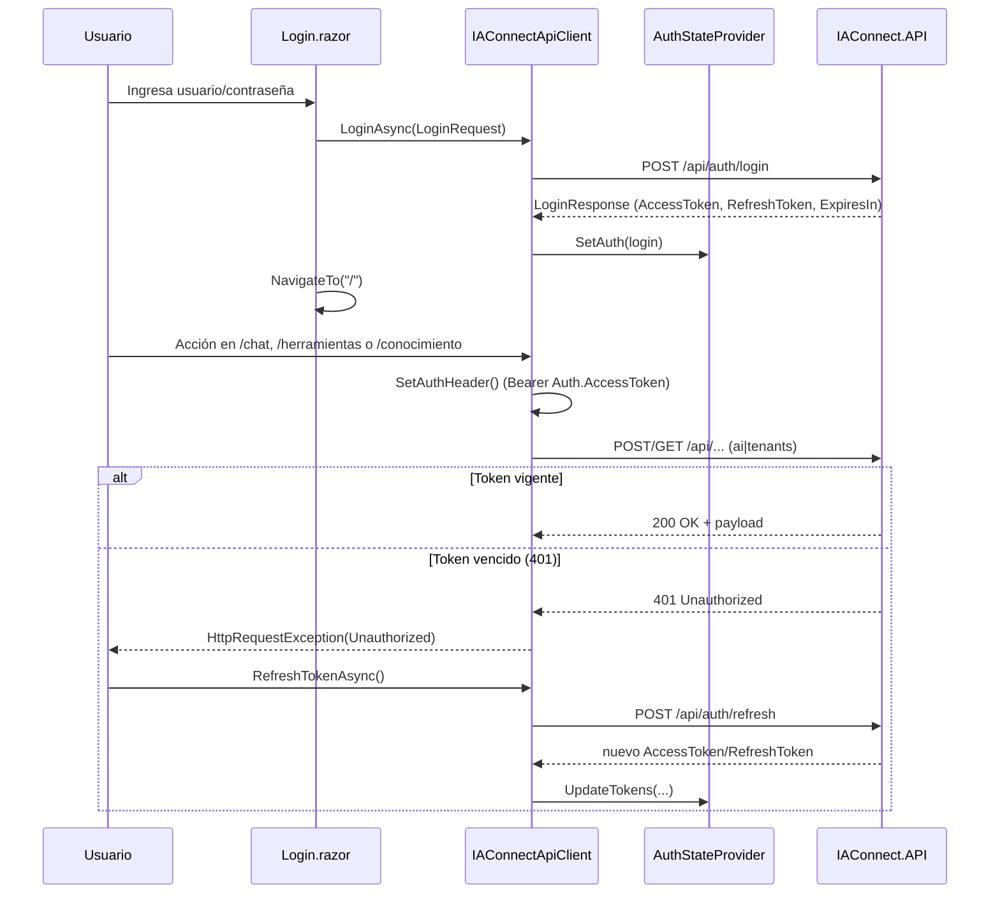

# IAConnect.Demo.Web — Web de demostración

> Fuente: `NG/Ng-IAServices/IAConnect.Demo.Web/` (solo lectura). Todas las referencias `archivo:línea` apuntan
> a esa ruta relativa al origen.

## 1. Resumen ejecutivo

`IAConnect.Demo.Web` es una aplicación **Blazor Server** (.NET 8, `Microsoft.NET.Sdk.Web`) que sirve como
**demo interactiva** de la API IAConnect: permite iniciar sesión contra `IAConnect.API`, probar el chat
multi-turn, las herramientas de IA (completion / análisis / resumen / mejora de texto), la carga de
documentos para RAG ("Conocimiento") y los dos componentes reutilizables del paquete
`IAConnect.ChatWidget` (`IAConnectChat` embebido y `IAConnectChatWidget` flotante)
(`IAConnect.Demo.Web.csproj:14`).

No es un producto de cara al cliente final: es una pieza de **criticidad baja** cuyo único propósito es
demostrar/validar el consumo de la API y del ChatWidget (`docs-manifest.yaml` → pieza `IAConnect.Demo.Web`,
`type: web-portal`, `criticality: low`).

La app no implementa lógica de negocio propia: toda la funcionalidad de IA vive en `IAConnect.API`. El rol
de `Demo.Web` es exclusivamente de **cliente HTTP + UI**, a través de un servicio propio
(`IAConnectApiClient`, ver §3) y del componente `IAConnectChatWidget` referenciado como proyecto
(`IAConnect.Demo.Web.csproj:13-15`).

## 2. Cómo correrla local

**Puertos (perfil `IAConnect.Demo.Web`, `commandName: Project`):**

| Endpoint | URL |
|---|---|
| HTTPS | `https://localhost:7200` |
| HTTP | `http://localhost:7201` |

Fuente: `Properties/launchSettings.json:7`. El perfil fija `ASPNETCORE_ENVIRONMENT=Development`
(`Properties/launchSettings.json:9`) y abre el navegador automáticamente (`launchBrowser: true`,
`Properties/launchSettings.json:6`).

**Configuración de la URL de la API consumida** (clave `IAConnectApi:BaseUrl`, leída en `Program.cs:14` y
`Program.cs:25`):

| Archivo | `IAConnectApi:BaseUrl` |
|---|---|
| `appsettings.json:2-4` | `https://localhost:7167` |
| `appsettings.Development.json:2-4` | `https://desa-fito.notionsgroup.com.ar/` |
| Fallback en código si la clave falta | `https://localhost:7100` (`Program.cs:15`, `Program.cs:26`) |

En entorno `Development` (perfil por defecto de `launchSettings.json`), `appsettings.Development.json`
sobrescribe `appsettings.json`, por lo que la app apunta por defecto a la instancia compartida
`desa-fito.notionsgroup.com.ar` y no a una `IAConnect.API` local en `:7167`. Para correr contra una API
local hay que ajustar `IAConnectApi:BaseUrl` en `appsettings.Development.json` o vía variable de entorno
(`IAConnectApi__BaseUrl`).

**Pasos:**

1. Tener disponible una instancia de `IAConnect.API` alcanzable en la URL configurada (local o
   `desa-fito.notionsgroup.com.ar`).
2. `dotnet run --project IAConnect.Demo.Web` (o F5 en el IDE con el perfil `IAConnect.Demo.Web`).
3. Abrir `https://localhost:7200/login` e ingresar con un usuario demo. La propia página de login expone
   una tabla de **usuarios demo disponibles** (`Components/Pages/Login.razor:44-68`); esta documentación no
   reproduce esas contraseñas (ver gap de credenciales en §5).

No hay `Dockerfile` ni script de build propio en el origen (`IAConnect.Demo.Web.csproj` es un proyecto Web
SDK estándar sin `<ItemGroup>` de contenedores) — el despliegue no está documentado en el código de esta
pieza.

## 3. Arquitectura local

### 3.1 Piezas clave

| Componente | Rol | Fuente |
|---|---|---|
| `Program.cs` | Bootstrap: registra Razor Components + render interactivo server, `HttpClient` tipado para la API, `AuthStateProvider`, y el ChatWidget (DI) | `Program.cs:7-27` |
| `AuthStateProvider` | Servicio **`Scoped`** (por circuito Blazor Server) que guarda el estado de sesión en memoria del servidor: `AccessToken`, `RefreshToken`, `NombreUsuario`, `Password`, `Rol`, `IdTenant`, `TokenExpiration` | `Services/AuthStateProvider.cs:5-44`, registro en `Program.cs:20` |
| `IAConnectApiClient` (`IIAConnectApiClient`) | Cliente HTTP tipado (`HttpClient` con `BaseAddress` = `IAConnectApi:BaseUrl`, timeout 120 s) que llama a los endpoints de `IAConnect.API` y setea el header `Authorization: Bearer` antes de cada llamada autenticada | `Services/IAConnectApiClient.cs:1-154`, registro en `Program.cs:11-17` |
| `IAConnect.ChatWidget` (referencia de proyecto) | Provee los componentes `IAConnectChat` e `IAConnectChatWidget`, registrados vía `AddIAConnectChatWidget(...)` con la misma `IAConnectApi:BaseUrl` | `Program.cs:23-27`, `IAConnect.Demo.Web.csproj:13-15`, uso en `Components/Pages/ChatWidgetDemo.razor:37-44,93-98` |
| `Markdig` | Renderiza el Markdown de las respuestas del asistente en el chat | `IAConnect.Demo.Web.csproj:10`, uso en `Components/Pages/Chat.razor:97,167-169` |

### 3.2 Gestión de autenticación/JWT

`AuthStateProvider` **no** implementa `Microsoft.AspNetCore.Components.Authorization.AuthenticationStateProvider`
de ASP.NET Core: es una clase POCO propia registrada como servicio `Scoped` de DI
(`Services/AuthStateProvider.cs:5`, `Program.cs:20`). Al ser `Scoped` en Blazor **Server**, su ciclo de vida
está atado al **circuito** (la conexión SignalR) del usuario — vive en memoria del servidor, no en el
navegador (no hay `localStorage`/cookies de sesión propias). Un refresh de página (`forceLoad`) o la caída
del circuito reinician el estado de autenticación.

- `IsAuthenticated` se calcula como `AccessToken` no vacío **y** `TokenExpiration > DateTime.UtcNow`
  (`Services/AuthStateProvider.cs:14-15`); `TokenExpiration` se deriva de `ExpiresIn` devuelto por el login
  (`Services/AuthStateProvider.cs:24`), no se decodifica el JWT en el cliente.
- `SetAuth(LoginResponse)` (`Services/AuthStateProvider.cs:17-25`) puebla el estado tras un login exitoso.
- `UpdateTokens(...)` (`Services/AuthStateProvider.cs:27-32`) actualiza `AccessToken`/`RefreshToken` tras un
  refresh.
- `Clear()` (`Services/AuthStateProvider.cs:34-43`) limpia el estado en logout.
- El campo `Password` (`Services/AuthStateProvider.cs:10`) queda en memoria del servidor tras el login
  (`Components/Pages/Login.razor:93`) y se reutiliza para construir `IAConnectCredentials` que se pasan al
  `IAConnectChatWidget` embebido en `/chatwidget` (`Components/Pages/ChatWidgetDemo.razor:114-118`) — ver
  gap en §5.

**El guardado de ruta (auth requerida) no usa `[Authorize]`/`<AuthorizeView>` ni un `IAuthorizationPolicy`
de ASP.NET Core.** Cada página verifica `Auth.IsAuthenticated` por su cuenta y redirige a `/login` con
patrones distintos entre páginas (detalle en `routes-map.md`). `Demo.Web` no valida la firma/expiración
real del JWT: confía en el `ExpiresIn` devuelto por `IAConnect.API` en el login/refresh; la validación
efectiva del token ocurre del lado de `IAConnect.API` en cada request.

### 3.3 Cómo `IAConnectApiClient` invoca la API

`IAConnectApiClient` implementa `IIAConnectApiClient` (`Services/IIAConnectApiClient.cs:5-28`) y agrupa las
llamadas por área:

| Área | Métodos | Endpoints HTTP | Auth |
|---|---|---|---|
| Auth | `LoginAsync`, `RefreshTokenAsync`, `LogoutAsync` | `POST /api/auth/login`, `POST /api/auth/refresh`, `POST /api/auth/logout` | Login/refresh sin header; logout con `Bearer` (`Services/IAConnectApiClient.cs:20-58`) |
| IA | `ChatAsync`, `CompletionAsync`, `AnalyzeAsync`, `SummarizeAsync`, `ImproveAsync` | `POST /api/ai/{tenantId}/chat`, `.../completion`, `.../analyze`, `.../summarize`, `.../improve` | `Bearer` vía `SetAuthHeader()` (`Services/IAConnectApiClient.cs:62-104,149-153`) |
| Conocimiento (RAG) | `UploadKnowledgeAsync`, `GetKnowledgeAsync` | `POST /api/tenants/{tenantId}/knowledge` (multipart), `GET /api/tenants/{tenantId}/knowledge` | `Bearer` (`Services/IAConnectApiClient.cs:108-126`) |
| Salud | `HealthCheckAsync` | `GET /` | Sin auth (`Services/IAConnectApiClient.cs:130-135`) |
| Config de tenant | `GetTenantConfigAsync` | `GET /api/tenants/{tenantId}` | `Bearer` (`Services/IAConnectApiClient.cs:139-145`) |

`SetAuthHeader()` (`Services/IAConnectApiClient.cs:149-153`) fija
`Authorization: Bearer {AuthStateProvider.AccessToken}` en el `HttpClient` compartido **antes de cada
llamada** que lo requiere; no hay un `DelegatingHandler`/`HttpMessageHandler` centralizado, el llamado se
repite explícitamente en cada método (`Services/IAConnectApiClient.cs:64,73,82,91,100,111,122,141`).

El manejo de expiración del token (`401 Unauthorized`) **no está centralizado** en `IAConnectApiClient`:
cada página que consume un endpoint autenticado atrapa `HttpRequestException` con
`StatusCode == Unauthorized`, llama a `Api.RefreshTokenAsync()` y, si falla, navega a `/login`. Este
patrón está duplicado en `Components/Pages/Chat.razor:260-269` y
`Components/Pages/Conocimiento.razor:146-161,175-186`; `Herramientas.razor` no implementa ese manejo
específico de 401 (solo captura `Exception` genérica, `Components/Pages/Herramientas.razor:202,214,226,238`).

### 3.4 Diagramas

**Componentes y DI:**

**Flujo login → llamada autenticada → refresh (401):**

## 4. Páginas / funcionalidades

Resumen (detalle completo de rutas, guardas de auth y árbol de navegación en
[`routes-map.md`](./routes-map.md)):

| Página | Ruta | Qué demuestra | Endpoints de `IAConnectApiClient` usados |
|---|---|---|---|
| Home | `/` | Dashboard: estado del servicio (health check) y datos de la sesión activa | `HealthCheckAsync` (`Components/Pages/Home.razor:99`) |
| Login | `/login` | Autenticación contra `IAConnect.API` | `LoginAsync` (`Components/Pages/Login.razor:90`) |
| Chat IA | `/chat` | Chat multi-turn con memoria de sesión (`SessionId` por conversación), adjuntar imagen (≤2 MB), render Markdown, contador de tokens/proveedor | `GetTenantConfigAsync`, `ChatAsync`, `RefreshTokenAsync` (`Components/Pages/Chat.razor:192,243,262`) |
| Herramientas IA | `/herramientas` | Tabs de Completion / Análisis (sentimiento, clasificación, entidades) / Resumen / Mejora de texto | `CompletionAsync`, `AnalyzeAsync`, `SummarizeAsync`, `ImproveAsync` (`Components/Pages/Herramientas.razor:199,211,223,235`) |
| Cargar Conocimiento | `/conocimiento` | Carga de documentos (`.txt`,`.pdf`,`.docx`,`.md`,`.html`, ≤10 MB) para RAG y listado de fragmentos generados | `UploadKnowledgeAsync`, `GetKnowledgeAsync`, `RefreshTokenAsync` (`Components/Pages/Conocimiento.razor:142,173,148,177`) |
| Chat Widget Demo | `/chatwidget` | Los 2 componentes reutilizables del paquete `IAConnect.ChatWidget`: `IAConnectChat` embebido y `IAConnectChatWidget` flotante | No usa `IAConnectApiClient` directamente — los componentes del widget resuelven su propia auth (`Components/Pages/ChatWidgetDemo.razor:37-44,93-98`) |
| Error | `/Error` | Página de error estándar de ASP.NET Core (fallback de `UseExceptionHandler`) | Ninguno (`Components/Pages/Error.razor:1-36`) |

## 5. Gestión de contenidos y estados; gaps

- **Selección de tenant por `<select>` estático**: `/chat`, `/herramientas` y `/conocimiento` ofrecen un
  combo fijo con dos tenants demo hardcodeados (`demo-asistente-general`, `demo-soporte-tecnico`) en el
  markup de cada página (p. ej. `Components/Pages/Chat.razor:26-27`); no se obtiene la lista de tenants
  desde la API.
- **Estado de sesión de chat en memoria del componente**: `_mensajes`, `_sessionId`, `_totalTokens`, etc.
  viven en campos privados de `Chat.razor` (`Components/Pages/Chat.razor:154-171`) — se pierden al navegar
  fuera de la página o al recargar.
- **Manejo de errores por página, sin patrón único**: cada página captura excepciones y las muestra en un
  `
` local (`Components/Pages/Chat.razor:270-273`,
  `Herramientas.razor:202,214,226,238`, `Conocimiento.razor:162,187`); no hay un manejador de errores
  global de UI ni `ErrorBoundary`.
- **Credenciales demo embebidas en el código fuente (no reproducidas en esta documentación)**: la página
  `/login` muestra en su UI una tabla de usuarios/contraseñas demo
  (`Components/Pages/Login.razor:44-68`), y `ChatWidgetDemo.razor` tiene un **valor de contraseña por
  defecto hardcodeado** como fallback si `Auth.Password` es nulo
  (`Components/Pages/ChatWidgetDemo.razor:114-118`). Por política de esta documentación no se copian esos
  valores; se señala como hallazgo para evaluar si corresponde moverlos a configuración/seed de datos en
  vez de código fuente.
- **Gap de accesibilidad (WCAG)**: no hay evidencia en el código de atributos ARIA, gestión de foco más
  allá de `<FocusOnNavigate Selector="h1">` (`Components/Routes.razor:4`), ni verificación de contraste.
  Falta la auditoría de accesibilidad formal — registrado como gap `GAP-A11Y` a nivel de manifiesto de
  documentación (`docs-manifest.yaml` → `known_gaps`, y `required_docs: [readme, routes-map, a11y-statement]`
  con `gap: [a11y-statement]` para esta pieza). El documento `a11y-statement` de `IAConnect.Demo.Web`
  **queda pendiente** de una auditoría WCAG 2.x real y no se genera en esta pasada.
- **Sin `CHANGELOG.md` en el origen**: no se reconstruye historial de versiones (gap `GAP-CHANGELOG` del
  manifiesto de documentación, aplica a esta pieza igual que al resto de la solución).
