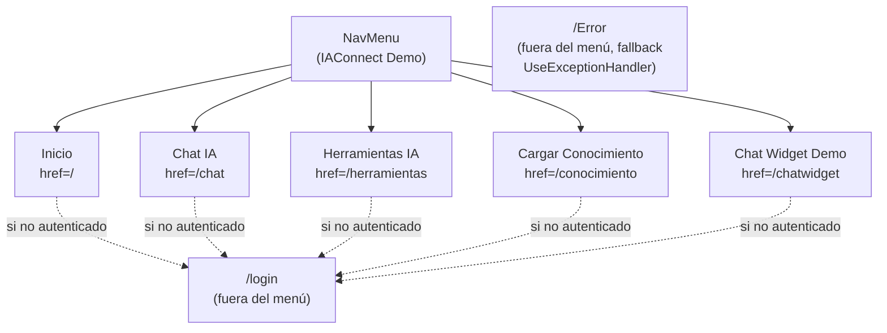

# IAConnect.Demo.Web — Mapa de rutas

> Fuente: `NG/Ng-IAServices/IAConnect.Demo.Web/Components/` (solo lectura). Solo se listan rutas con
> directiva `@page` efectivamente presentes en el origen. Ver también
> [`README.md`](./README.md) de la pieza.

## Router y layout

- `Components/App.razor:13` monta `<Routes @rendermode="InteractiveServer" />` — toda la app corre en modo
  interactivo servidor (Blazor Server, no WebAssembly ni SSR estático).
- `Components/Routes.razor:1-6` define un único `<Router AppAssembly="typeof(Program).Assembly">` con
  `DefaultLayout="typeof(Layout.MainLayout)"` — no hay layouts alternativos por página.
- `Components/Layout/MainLayout.razor:6-12` renderiza el `<NavMenu />` **solo si**
  `Auth.IsAuthenticated == true`; si no, el usuario ve únicamente el `@Body` de la página (típicamente
  redirigida a `/login`).

## Tabla de rutas

| Ruta (`@page`) | Componente | Propósito | Auth requerida | Mecanismo de guardia (fuente) |
|---|---|---|---|---|
| `/` | `Home.razor` | Panel de pruebas: health check de la API (`HealthCheckAsync`) y resumen de la sesión activa (usuario, tenant, rol, expiración del token); accesos directos a `/chat`, `/herramientas`, `/chatwidget` | **Sí** | `OnInitializedAsync` navega a `/login` si `!Auth.IsAuthenticated` (`Components/Pages/Home.razor:91-95`) |
| `/login` | `Login.razor` | Formulario de login (`NombreUsuario` + `Contraseña`) contra `IAConnect.API`; muestra tabla de usuarios demo en la propia UI | **No** (pública). Si ya está autenticado, redirige a `/` | `OnInitialized` navega a `/` si `Auth.IsAuthenticated` (`Components/Pages/Login.razor:77-81`) |
| `/chat` | `Chat.razor` | Chat multi-turn con memoria de sesión (`SessionId`), selector de tenant, adjuntar imagen, render Markdown de respuestas, contador de tokens y proveedor IA usado | **Sí** | Chequeo inline en el árbol de renderizado (`@if (!Auth.IsAuthenticated) { Nav.NavigateTo("/login"); return; }`) — no en `OnInitialized(Async)` (`Components/Pages/Chat.razor:11-15`) |
| `/herramientas` | `Herramientas.razor` | 4 tabs: Completion (prompt simple), Análisis (sentimiento/clasificación/entidades), Resumen de documento, Mejora de texto (claridad/formalidad/brevedad/expandir) | **Sí** | Mismo patrón inline que `/chat` (`Components/Pages/Herramientas.razor:10-14`) |
| `/conocimiento` | `Conocimiento.razor` | Carga de documentos (`.txt`,`.pdf`,`.docx`,`.md`,`.html`, máx. 10 MB) para la base de conocimiento RAG del tenant, y listado/actualización de fragmentos ya indexados | **Sí** | Mismo patrón inline que `/chat` (`Components/Pages/Conocimiento.razor:10-14`) |
| `/chatwidget` | `ChatWidgetDemo.razor` | Demo de los 2 componentes reutilizables de `IAConnect.ChatWidget`: `IAConnectChat` (embebido en página) e `IAConnectChatWidget` (flotante, esquina inferior derecha) | **Sí** | `OnInitialized` navega a `/login` si `!Auth.IsAuthenticated` (`Components/Pages/ChatWidgetDemo.razor:105-111`) — patrón distinto al de `/chat`, `/herramientas`, `/conocimiento` |
| `/Error` | `Error.razor` | Página de error estándar generada por la plantilla ASP.NET Core; usada como `UseExceptionHandler("/Error")` fuera de `Development` | **No** | Sin chequeo de `Auth` — es la página de fallback de errores (`Components/Pages/Error.razor:1-36`, `Program.cs:33`) |

**Observación de consistencia:** la protección de rutas autenticadas usa **3 mecanismos distintos** entre
páginas (`OnInitializedAsync` en `Home.razor`, chequeo inline en el `@if` de markup en `Chat.razor` /
`Herramientas.razor` / `Conocimiento.razor`, y `OnInitialized` en `ChatWidgetDemo.razor`), ninguno basado en
`[Authorize]`/`<AuthorizeView>`/`AuthenticationStateProvider` de ASP.NET Core. No hay un único punto
(p. ej. un layout o `RouteView` envolvente) que centralice la guarda — ver detalle y riesgo asociado en
`README.md` §3.2 y §5.

## Árbol de navegación (`NavMenu`)

`Components/Layout/NavMenu.razor:1-23` — visible solo cuando `Auth.IsAuthenticated` (ver
`MainLayout.razor:6-12`). Contiene 5 enlaces; **no** incluye `/login` ni `/Error` (se llega a ellos por
redirección, no por navegación directa del menú):

Fuente de los 5 enlaces: `Components/Layout/NavMenu.razor:7-21` (`Inicio` → `Match="NavLinkMatch.All"` para
no quedar activo en subrutas; los otros 4 usan coincidencia por defecto de `NavLink`).
