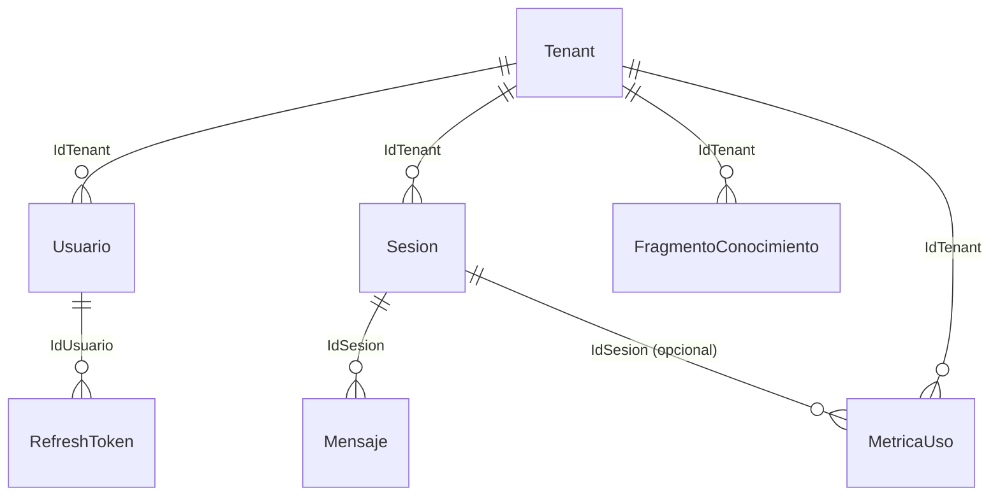

# IAConnect.Domain — Núcleo de dominio

## 1. Resumen ejecutivo

`IAConnect.Domain` es la capa de **dominio** (Clean Architecture) de IAConnect, un *gateway* multi-tenant de
IA conversacional. Es una librería .NET 8 (`type: library`) que declara **entidades, enums, excepciones de
negocio e interfaces (contratos)**, sin ninguna dependencia externa: su `.csproj` no referencia ningún paquete
NuGet ni otro proyecto de la solución — `IAConnect.Domain/IAConnect.Domain.csproj#L1-L9` (solo
`TargetFramework net8.0`, `ImplicitUsings` y `Nullable` habilitados).

No contiene lógica de acceso a datos, HTTP, ASP.NET ni SDKs de proveedores de IA: son **POCOs e interfaces
puras**. Es el centro de la regla de dependencias de Clean Architecture — todo apunta hacia adentro, hacia
Domain.

**Quién la usa** (inferido de `docs/00-overview/system-map.md` §"Relaciones entre piezas"; no verificado
contra los `.csproj` de esas piezas, fuera del alcance de lectura de esta pieza):

| Consumidor | Uso |
|---|---|
| `IAConnect.Application` | Orquesta casos de uso contra las interfaces (`I*DataManager`, `IAIProvider*`) y las entidades de Domain |
| `IAConnect.Infrastructure` | Implementa los contratos (`I*DataManager` con SP/ADO.NET, `IAIProvider`/`IAIProviderFactory` con SDKs de Gemini/Claude/OpenAI) |
| `IAConnect.API` | Referencia Domain transitivamente vía Application/Infrastructure; traduce las excepciones de dominio a respuestas HTTP |

## 2. Responsabilidad y regla de dependencia

- **Responsabilidad única:** modelar el vocabulario del negocio (tenants, usuarios, sesiones, mensajes,
  conocimiento RAG, métricas, tokens de refresco) y los **puertos** (interfaces) que la capa externa debe
  implementar.
- **Regla de dependencia (Clean Architecture / DIP):** Domain **no depende de nada** — ni de Infrastructure,
  ni de ASP.NET Core, ni de un ORM, ni de un cliente HTTP. Evidencia directa: `IAConnect.Domain.csproj` no
  tiene `<PackageReference>` ni `<ProjectReference>` (`IAConnect.Domain.csproj#L1-L9`). Son las capas externas
  (Infrastructure, API) las que dependen de Domain, nunca al revés.
- Las entidades son **POCOs mutables** (`get; set;`), sin anotaciones de EF Core, sin atributos de
  mapeo objeto-relacional y sin propiedades de navegación entre entidades: las relaciones se expresan como
  campos escalares tipo *foreign key* (`IdTenant string`, `IdSesion int`, `IdUsuario int`), consistente con
  un patrón de acceso a datos por **stored procedures + DataManager** (ver §6) y no por ORM.

## 3. Entidades

Fuente: `IAConnect.Domain/Entities/*.cs`. El mapeo a tabla física **no está declarado en el código de
Domain** (no hay atributos `[Table]` ni configuración — es esperable en una capa de dominio pura); la
columna "Tabla física" es **inferida por cruce** con `Ng-IAServices.Documentacion/ia-db/indexes/02_dominio-y-datos.md`
(a su vez derivado del DDL `scripts/01_create_database.sql`, fuera del alcance de lectura de esta pieza).
Diccionario completo → [`../../03-data/data-dictionary.md`](../../03-data/data-dictionary.md).

| Entidad | Propósito | Propiedades clave | Tabla física (inferida) |
|---|---|---|---|
| `Tenant` | Cliente/organización con su configuración de IA | `IdTenant` (PK negocio, string), `ProveedorIA` (string), `NombreModelo`, `Temperatura`, `MaxTokens`, `ApiKeyIA`, `PermiteImagenes`, `MaxTamanoImagenKB`, `Activo` | `lut_Tenants` |
| `Usuario` | Usuario interno (admin/operador) de la consola | `Id` (int), `NombreUsuario`, `PasswordHash`, `Rol` (string), `IdTenant?`, `IntentosFallidos`, `FechaBloqueo?` | `sys_Usuarios` |
| `Sesion` | Conversación de un usuario externo dentro de un tenant | `Id` (int), `IdSesion` (Guid, identificador público), `IdTenant`, `IdUsuarioExterno?`, `FechaInicio`, `FechaUltimaActividad`, `Activo` | `sys_Sesiones` |
| `Mensaje` | Turno de conversación (user/assistant/system) | `Id` (long), `IdSesion` (int), `Rol` (string), `Contenido`, `TieneImagen`, `TamanoImagenKB?`, `TokensPrompt?`, `TokensRespuesta?` | `sys_Mensajes` |
| `FragmentoConocimiento` | Fragmento (*chunk*) de documento con embedding, para RAG | `Id` (long), `IdTenant`, `DocumentoOrigen`, `IndiceFragmento`, `Contenido`, `VectorEmbedding` (`byte[]?`) | `sys_Fragmentos_Conocimiento` |
| `MetricaUso` | Registro de consumo de IA (tokens, duración, proveedor) | `Id` (long), `IdTenant`, `IdSesion?` (int), `Proveedor`, `Modelo`, `TotalTokens`, `DuracionMs` | `sys_Metricas_Uso` |
| `RefreshToken` | Token de refresco JWT con revocación | `Id` (int), `IdUsuario` (int), `Token`, `FechaExpiracion`, `Revocado`, `FechaRevocacion?` | `sys_Refresh_Tokens` |

Todas las entidades comparten columnas de auditoría (`FechaAlta`, `FechaModificacion`, `UsuarioAlta = "SYSTEM"`,
`UsuarioModificacion = "SYSTEM"` por defecto) — patrón uniforme en las 7 entidades.

### Relaciones entre entidades (inferido de tipos/nombres de campo, sin navegación de objetos)



> Estas relaciones **no existen como propiedades de navegación en el código** (no hay `List<Mensaje> Mensajes`
> en `Sesion`, por ejemplo): se infieren de la coincidencia de nombre/tipo entre `Entidad.Id` y
> `OtraEntidad.IdEntidad` en los DataManagers (§6). Márcalo como inferido, no como contrato verificado por el
> compilador.

## 4. Enums

Fuente: `IAConnect.Domain/Enums/*.cs`.

| Enum | Valores (literales de código) | Uso |
|---|---|---|
| `ProveedorIA` | `Gemini`, `Claude`, `OpenAI` | Selección de proveedor de IA; consumido por `IAIProviderFactory.CreateProvider` (§6) para elegir la implementación concreta |
| `RolUsuario` | `Admin`, `Operador` | Autorización de usuarios internos de la consola |
| `RolMensaje` | `User`, `Assistant`, `System` | Rol del turno de conversación en `Mensaje` |
| `TipoAnalisis` | `Sentiment`, `Classification`, `Entities` | Tipo de análisis en `IAIProvider.AnalyzeAsync` (`AnalysisRequest.AnalysisType`) |
| `ObjetivoMejora` | `Clarity`, `Formality`, `Brevity`, `Expand` | Objetivo de reescritura en `IAIProvider.ImproveAsync` (`ImproveRequest.ImprovementGoal`) |

**Divergencia observada (gana el código):** `Tenant.ProveedorIA`, `Usuario.Rol` y `Mensaje.Rol` están tipados
como `string` en las entidades, **no** como los enums `ProveedorIA`/`RolUsuario`/`RolMensaje` homónimos —
ver §9. Los enums sí se usan fuertemente tipados en los DTOs de `IAIProvider` (`TipoAnalisis`,
`ObjetivoMejora`).

## 5. Excepciones de dominio

Fuente: `IAConnect.Domain/Exceptions/*.cs`. Todas heredan de `System.Exception` (no de una excepción base de
dominio propia). El mapeo HTTP **no está definido en Domain** (correctamente: Domain no conoce HTTP) — se
infiere por semántica y se marca como no verificado; el mapeo real debe confirmarse en el *middleware* de
`IAConnect.API` (fuera del alcance de lectura de esta pieza).

| Excepción | Cuándo se dispara | Datos que porta | Mapeo HTTP esperado (inferido, no verificado) |
|---|---|---|---|
| `InvalidCredentialsException` | Usuario/contraseña incorrectos en login | mensaje fijo o custom | `401 Unauthorized` |
| `AccountLockedException` | Cuenta bloqueada por exceso de intentos fallidos | `LockoutEnd` (`DateTime?`) | `423 Locked` (o `403 Forbidden`) |
| `TenantNotFoundException` | Tenant inexistente o inactivo | `TenantId` | `404 Not Found` |
| `ProviderUnavailableException` | Error de comunicación con el proveedor de IA externo | `Provider`, `InnerException` opcional | `503 Service Unavailable` |
| `ImageNotAllowedException` | El tenant no tiene habilitado el procesamiento de imágenes | `TenantId` | `422 Unprocessable Entity` (o `400 Bad Request`) |

## 6. Interfaces (contratos)

Domain define los **puertos**; Infrastructure aporta los **adaptadores** (inversión de dependencias, DIP).
Ninguna interfaz tiene implementación en este proyecto.

### 6.1 Proveedores de IA

| Interfaz | Miembros | Rol |
|---|---|---|
| `IAIProvider` | `ChatAsync`, `CompleteAsync`, `AnalyzeAsync`, `SummarizeAsync`, `ImproveAsync` (todos `Task<AIResponse>`) | Contrato único para cualquier proveedor de IA (Gemini/Claude/OpenAI); Infrastructure implementa una clase por proveedor |
| `IAIProviderFactory` | `IAIProvider CreateProvider(Tenant tenant)` | Fábrica que resuelve la implementación de `IAIProvider` según `Tenant.ProveedorIA`; el `Tenant` (entidad de Domain) es el único dato de entrada, sin acoplar la factory a un SDK concreto |

Tipos de soporte (DTOs de request/response) declarados junto a `IAIProvider`:
`ChatRequest`, `CompletionRequest`, `AnalysisRequest`, `SummarizeRequest`, `ImproveRequest`,
`ConversationMessage`, `AIResponse` — `IAConnect.Domain/Interfaces/IAIProvider.cs#L14-L71`.

### 6.2 Acceso a datos — un `I*DataManager` por tabla

| Interfaz | Entidad | Métodos | Nota |
|---|---|---|---|
| `ILutTenantsDataManager` | `Tenant` | `GetOneAsync(string)`, `GetListAllAsync`, `GetListByProveedorIAAsync(string)`, `GetListByActivoAsync(bool)`, `InsertAsync`, `UpdateAsync`, `DeleteAsync(string)` | PK de negocio `string` |
| `ISysUsuariosDataManager` | `Usuario` | `GetOneAsync(int)`, `GetListByNombreUsuarioAsync(string)`, `GetListByIdTenantAsync(string)`, `InsertAsync`, `UpdateAsync`, `DeleteAsync(int)` | — |
| `ISysSesionesDataManager` | `Sesion` | `GetOneAsync(int)`, `GetListByIdTenantAsync(string)`, `GetListByIdSesionAsync(Guid)`, `InsertAsync`, `UpdateAsync`, `DeleteAsync(int)` | `GetListByIdSesionAsync` devuelve `Task<Sesion?>` (singular pese al nombre "List…" — ver §9) |
| `ISysMensajesDataManager` | `Mensaje` | `GetOneAsync(long)`, `GetListByIdSesionAsync(int)`, `InsertAsync`, `UpdateAsync`, `DeleteAsync(long)` | — |
| `ISysFragmentosConocimientoDataManager` | `FragmentoConocimiento` | `GetOneAsync(long)`, `GetListByIdTenantAsync(string)`, `InsertAsync`, `UpdateAsync`, `DeleteAsync(long)` | — |
| `ISysMetricasUsoDataManager` | `MetricaUso` | `GetOneAsync(long)`, `GetListByIdTenantAsync(string)`, `GetListByIdSesionAsync(int)`, `InsertAsync`, `UpdateAsync`, `DeleteAsync(long)` | — |
| `ISysRefreshTokensDataManager` | `RefreshToken` | `GetOneAsync(int)`, `GetListByIdUsuarioAsync(int)`, `GetByTokenAsync(string)`, `InsertAsync`, `UpdateAsync`, `DeleteAsync(int)` | — |

7 entidades ↔ 7 interfaces `I*DataManager`: cobertura 1:1 completa, sin huecos. Infrastructure implementa cada
una contra su tabla y su juego de *stored procedures* (patrón documentado en
`ia-db/indexes/02_dominio-y-datos.md`, fuera de esta pieza).

## 7. API pública (tipos exportados)

```text
IAConnect.Domain
├── Entities/          Tenant · Usuario · Sesion · Mensaje · FragmentoConocimiento · MetricaUso · RefreshToken
├── Enums/              ProveedorIA · RolUsuario · RolMensaje · TipoAnalisis · ObjetivoMejora
├── Exceptions/         AccountLockedException · InvalidCredentialsException · TenantNotFoundException ·
│                        ProviderUnavailableException · ImageNotAllowedException
└── Interfaces/
    ├── IAIProvider · IAIProviderFactory
    ├── ChatRequest · CompletionRequest · AnalysisRequest · SummarizeRequest · ImproveRequest ·
    │    ConversationMessage · AIResponse   (DTOs de IAIProvider)
    └── ILutTenantsDataManager · ISysUsuariosDataManager · ISysSesionesDataManager ·
         ISysMensajesDataManager · ISysFragmentosConocimientoDataManager ·
         ISysMetricasUsoDataManager · ISysRefreshTokensDataManager
```

Todos los tipos son `public`; no hay tipos `internal` en el proyecto (confirmado por inspección de los 21
archivos `.cs` leídos).

## 8. Snippet representativo

> Ejemplo — contrato `IAIProvider` (puerto que Infrastructure implementa por proveedor de IA)
> Fuente: `IAConnect.Domain/Interfaces/IAIProvider.cs#L5-L12` · Demuestra: inversión de dependencias — Domain
> declara el contrato, sin saber nada de Gemini/Claude/OpenAI ni de HTTP.

```csharp
public interface IAIProvider
{
    Task<AIResponse> ChatAsync(ChatRequest request);
    Task<AIResponse> CompleteAsync(CompletionRequest request);
    Task<AIResponse> AnalyzeAsync(AnalysisRequest request);
    Task<AIResponse> SummarizeAsync(SummarizeRequest request);
    Task<AIResponse> ImproveAsync(ImproveRequest request);
}
```

Precondición: ninguna sobre este archivo (es una interfaz pura). Los tipos `ChatRequest`/`AIResponse`/etc. se
definen en el mismo archivo (`L14-L71`). Infrastructure implementa esta interfaz una vez por proveedor
(Gemini/Claude/OpenAI, según `ProveedorIA`) y `IAIProviderFactory.CreateProvider(Tenant)` resuelve cuál usar.

## 9. Gap / observaciones

- **Sin CHANGELOG en el origen.** El proyecto no tiene `CHANGELOG.md`; no se puede reconstruir historial de
  versiones sin analizar git. Consistente con `docs-manifest.yaml` (`gap: [changelog, api-reference]` para
  `IAConnect.Domain`).
- **Sin docstrings → sin referencia de API generada.** Ninguno de los 21 archivos `.cs` tiene comentarios
  XML (`///`); no hay una fuente para generar referencia automática (DocFX u similar). Este README cubre la
  API pública manualmente, pero no reemplaza esa referencia generada exigida por el perfil `library` (§7.1
  del Marco).
- **Enums declarados pero no usados como tipo en las entidades persistidas.** `Tenant.ProveedorIA`,
  `Usuario.Rol` y `Mensaje.Rol` son `string`, no los enums homónimos `ProveedorIA`/`RolUsuario`/`RolMensaje`.
  No es necesariamente un defecto (puede ser deliberado para simplificar el mapeo con `varchar` + `CHECK` en
  SQL Server vía stored procedures), pero es una inconsistencia de tipado que vale la pena confirmar con el
  equipo — ver `IAConnect.Domain/Entities/Tenant.cs#L7`, `Entities/Usuario.cs#L10`, `Entities/Mensaje.cs#L7`.
- **Naming inconsistente en un método de interfaz.** `ISysSesionesDataManager.GetListByIdSesionAsync(Guid)`
  devuelve `Task<Sesion?>` (un único elemento nullable), pese a que el nombre sugiere una colección — difiere
  del patrón `GetListBy*` usado en el resto de la interfaz y de las demás `I*DataManager`
  (`IAConnect.Domain/Interfaces/ISysSesionesDataManager.cs#L9`).
- **Mapeo entidad↔tabla no verificable solo con Domain.** Al ser POCOs sin atributos de persistencia, la
  tabla física de cada entidad (§3) se tomó por cruce con `ia-db/indexes/02_dominio-y-datos.md`, documento
  fuera del árbol de esta pieza; queda pendiente de confirmación cuando se audite
  `03-data/data-dictionary.md`.
- **Mapeo HTTP de excepciones (§5) inferido, no verificado.** Domain no conoce HTTP por diseño; el mapeo real
  vive en el middleware de `IAConnect.API` (fuera del alcance de lectura de esta pieza) y debe contrastarse
  ahí antes de promover este documento a `status: approved`.
- **`Tenant.ApiKeyIA` es una propiedad de dominio sensible.** No es un secreto de *esta* documentación (no se
  reproduce ningún valor), pero se deja constancia de que la entidad `Tenant` transporta la API key del
  proveedor de IA en texto — su cifrado en reposo es responsabilidad de Infrastructure/config, no de Domain.
