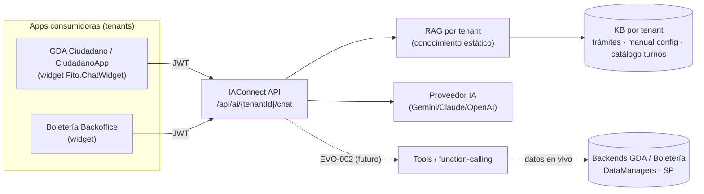
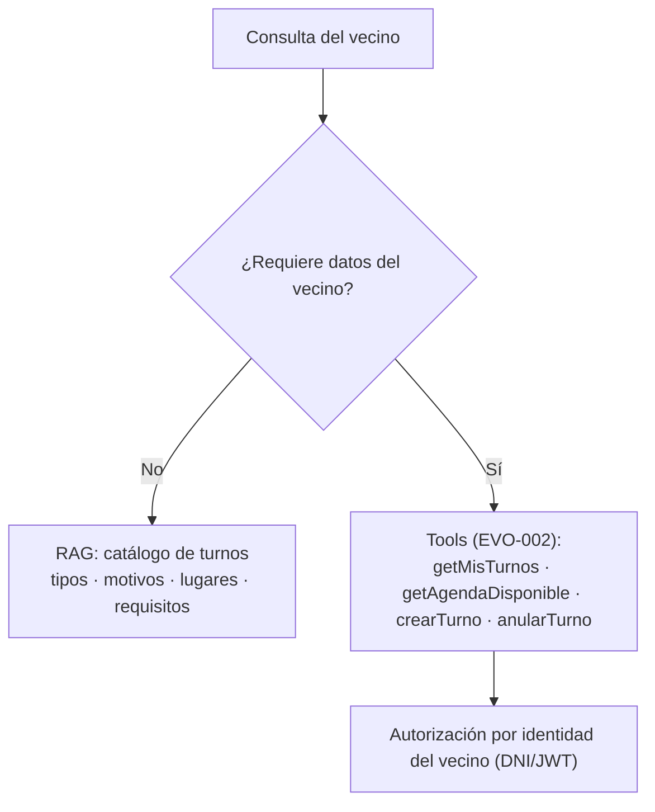
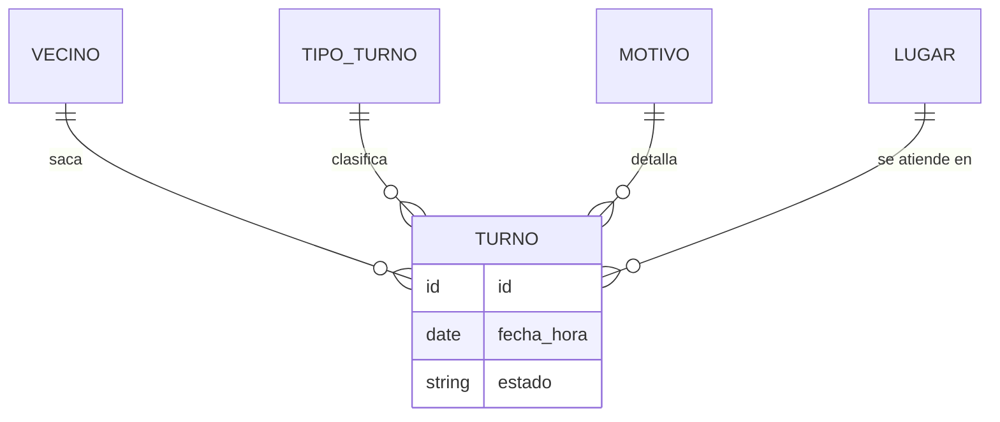
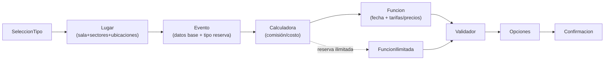
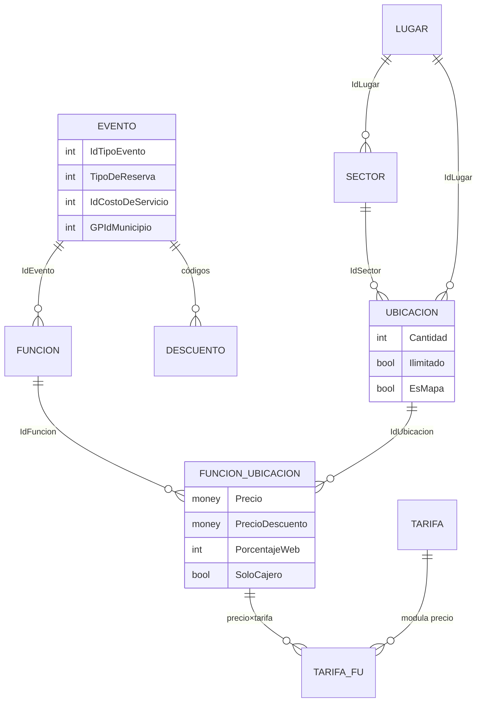
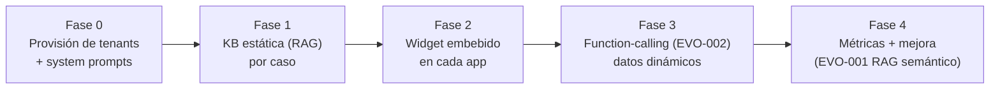

# Backlog — Asistencia por IA en GDA y Boletería (integración vía IAConnect)

> **Qué es este documento.** Estudio de integración y **propuesta de backlog** para incorporar asistencia por IA
> en tres frentes: (A) **turnos** de la app/portal del ciudadano de GDA.Core, (B) **configuración de eventos** en
> el backoffice de Boletería, y (C) una **guía de trámites** municipal. Es una **propuesta, no trabajo ejecutado**:
> ningún código de origen fue modificado. Se apoya en **IAConnect** (el gateway multi-tenant de IA conversacional)
> como plataforma común.
>
> **Fuentes:** estudio [`Analisis-Asistencia-IA-ChatBotIA.md`](../../../NG/Ng-IAServices.Documentacion/Analisis/Analisis-Asistencia-IA-ChatBotIA.md)
> y su caso de referencia [`IA-Mercado-Libre.md`](../../../NG/Ng-IAServices.Documentacion/Analisis/IA-Mercado-Libre.md);
> KB de IAConnect, GDA.Core y el código de Boletería (ver §1 y §9).
>
> **Política de datos.** Ejemplos **sintéticos**; no se reproducen credenciales ni cadenas de conexión de los
> orígenes (los índices señalan que existen en claro en `appsettings.json`, fuera del alcance de esta propuesta).
> Convención: 🟩 hecho verificado en fuente · 🟦 práctica de industria · 🟨 interpretación/propuesta.

---

## 0. Resumen ejecutivo

- **Plataforma común:** los tres asistentes se montan sobre **IAConnect** (API `/api/ai/{tenantId}/chat`, RAG por
  tenant, JWT, widget Blazor **`Fito.ChatWidget`**). 🟩 El portal `GDA.Core.Ciudadano` **ya referencia**
  `Fito.ChatWidget` / `AddIAConnectChatWidget` — la integración base ya está iniciada.
- **Dos tipos de asistencia** (estudio §B2): **estática** (cómo funciona un trámite/config → **RAG**) y **dinámica**
  (mis turnos, agenda disponible, estado de un evento → **function-calling / tools**).
- **Dependencia clave:** los casos con datos en vivo requieren **function-calling**, hoy **no disponible** en
  IAConnect (backlog [`EVO-002`](../../../NG/Ng-IAServices.Documentacion/IAConnect-docs/docs/10-evolution/backlog-tecnico.md)).
  Por eso se propone un **camino en fases**: primero valor con RAG estático, luego datos dinámicos.
- **Faltantes detectados** (§8): la **KB de Boletería no existe** (relevado desde código); `EVO-002` y `EVO-001`
  (RAG semántico) son habilitadores; el destino `Repos-Hosts/Host.Infra/Backlog` se **creó** con este documento.

| Caso | Asistente | Actor | Datos | Habilitador |
|---|---|---|---|---|
| A | Turnos (GDA Ciudadano/CiudadanoApp) | Vecino | Estático + dinámico | RAG (ya) + tools (EVO-002) |
| B | Configuración de eventos (Boletería Backoffice) | Operador | Estático + dinámico | RAG + tools (EVO-002) |
| C | Guía de trámites (GDA) | Vecino / público | Estático | RAG (ya) |

---

## 1. Contexto y fuentes

| Fuente | Qué aporta | Estado |
|---|---|---|
| `Analisis-Asistencia-IA-ChatBotIA.md` | Marco: fundamentos, integración, KB, seguridad, diseño conversacional | 🟩 leído |
| `IA-Mercado-Libre.md` | Patrones reutilizables (entry points, disclosure de alcance, hand-off) | 🟩 leído |
| IAConnect `ia-db` + `guia-integracion-tenants_v1.0.md` | Cómo se provisiona un tenant, RAG, widget `Fito.ChatWidget` | 🟩 leído |
| GDA.Core `ia-db` (índices 04, 05) | Flujo de turnos, módulos de trámites, apps ciudadano | 🟩 leído |
| Boletería `BD/BoleteriaCore/` (código) | Superficie de configuración de eventos | 🟩 relevado (código; **sin KB**) |
| `BD/Boleteria.Core.Documentacion/ia-db/` | — | ✗ **no existe** |
| `Repos-Hosts/Host.Infra/Backlog/` (destino) | — | 🟩 **creado** con este doc |

---

## 2. Enfoque común de integración

### 2.1 Arquitectura de referencia

### 2.2 Provisión de un tenant (procedimiento IAConnect)

🟩 Según `guia-integracion-tenants_v1.0.md`:

1. **Login admin** → `POST /api/auth/login`.
2. **Registrar tenant** → `POST /api/tenants` (`tenantId`, `name`, `aiProvider`, `systemPrompt`, `modelName`,
   `temperature`, `maxTokens`, `aiApiKey`, `allowImages`, expiraciones).
3. **Crear usuario operador** del tenant → `POST /api/auth/usuarios` (`rol: operador`).
4. **Cargar KB (RAG)** → `POST /api/tenants/{tenantId}/knowledge` (PDF/MD/HTML/TXT/CSV).
5. **Integrar** el widget `Fito.ChatWidget` (`AddIAConnectChatWidget(options => options.ApiBaseUrl = …)`) o
   consumir la API por HTTP.

### 2.3 Tenants propuestos

| tenantId (propuesto) | Asistente | Actor | Alcance del system prompt |
|---|---|---|---|
| `gda-turnos-ciudadano` | Caso A | Vecino | Turnos: tipos, motivos, lugares, agenda; nunca temas fuera de turnos |
| `gda-tramites-ciudadano` | Caso C | Vecino/público | Guía de trámites municipales (requisitos, pasos, documentación) |
| `boleteria-backoffice-eventos` | Caso B | Operador | Configuración de eventos, funciones, precios, validadores |

> 🟨 **Decisión abierta (multi-municipio):** GDA.Core es multi-municipio (Esperanza, Zárate, Ituzaingó, …). Se
> puede resolver con **un tenant por municipio** o **un tenant + metadata de municipio** en los fragmentos de KB.
> Ver §8.

### 2.4 Mapeo a los patrones del estudio

| Patrón (estudio) | Aplicación aquí |
|---|---|
| Múltiples entry points (§2 IA-ML) | Card en home + widget persistente en cada app |
| RAG estático vs. tools dinámico (§B2) | KB para "cómo"; function-calling para "lo mío" |
| Aislamiento por identidad (§D) | Vecino ve solo sus turnos; operador solo su backoffice |
| Disclosure de alcance (P6) | "Puedo informar sobre trámites; no accedo a datos de otras personas" |
| Hand-off accionable (P7) | Deep-link a `/Turnos`, `/Tramite`, o a la pantalla de config del evento |
| Feedback + métricas (§G) | 👍/👎 del widget + `sys_Metricas_Uso` de IAConnect |

---

## 3. Caso A — Asistente de turnos (GDA Ciudadano / CiudadanoApp)

### 3.1 Estado actual
🟩 El flujo de turnos es un **wizard**: `Tipo → Motivo → Lugar/Oficina → Agenda → Día/Hora → confirmación`
(rutas `/Turnos`, `/TurnosTipo`, `/TurnosMotivo`, `/TurnosLugar`, `/TurnosAgenda`, `/Turno`, `/TurnoDetalle`;
en app además `/TurnoAsignado`, `/TurnosMiAgenda`). El backoffice `GDA.Core.BackOffice.Turnos` administra
tipos/motivos/lugares y la agenda diaria. 🟩 El portal ya referencia el widget IAConnect.

### 3.2 Objetivo del asistente
Ayudar al vecino a **entender y completar** el trámite de turno: qué tipo/motivo elegir, qué documentación llevar,
dónde queda la oficina, y —con datos en vivo— **qué turnos tengo** y **qué horarios hay disponibles**.

### 3.3 Escenarios conversacionales

| # | Consulta del vecino | Tipo de dato | Mecanismo | Fase |
|---|---|---|---|---|
| A1 | "¿Qué necesito para sacar turno de licencia de conducir?" | Estático | RAG (requisitos por tipo) | 1 |
| A2 | "¿Dónde queda la oficina de rentas?" | Estático | RAG (lugares/edificios) | 1 |
| A3 | "¿Qué diferencia hay entre tipo y motivo?" | Estático | RAG (ayuda del wizard) | 1 |
| A4 | "¿Qué turnos tengo?" | Dinámico | Tool `getMisTurnos(vecinoId)` | 3 |
| A5 | "¿Hay lugar el próximo lunes a la mañana?" | Dinámico | Tool `getAgendaDisponible(tipo, lugar, fecha)` | 3 |
| A6 | "Sacame turno de clínica médica el martes" | Acción | Tool `crearTurno(...)` + confirmación + hand-off | 3 |
| A7 | "Cancelá mi turno del jueves" | Acción sensible | Tool `anularTurno(id)` + **confirmación explícita** | 3 |

### 3.4 Datos: estático vs. dinámico

### 3.5 Seguridad
- 🟩 Identidad del vecino = login **DNI + clave** (Vecino Digital); el asistente **solo** debe ver los turnos de
  ese vecino → la autorización se aplica **en la tool**, no en el prompt (estudio §D).
- Acciones que cambian estado (crear/anular) exigen **confirmación** (patrón P7) y hand-off al wizard nativo.

### 3.6 Modelo de datos (turno)

### 3.7 System prompt propuesto (esqueleto)
> *Identidad:* asistente de turnos del municipio. *Dominio:* tipos, motivos, lugares y agenda de turnos.
> *Fuente de verdad:* la base de conocimiento de turnos. *Límites:* no responde sobre multas, pagos u otros
> trámites; no revela datos de otras personas. *Anti-alucinación:* si no está en la KB, deriva al wizard `/Turnos`.

---

## 4. Caso B — Asistente de configuración de eventos (Boletería Backoffice)

> 🟩 Relevado desde `BD/BoleteriaCore/` (código; **sin KB indexada**). Campos, reglas de UI y modelo de datos salen
> de la lectura directa de las páginas y DataManagers citados.

### 4.1 Estado actual
🟩 Boletería es **Blazor Server** y usa el patrón **DataTier sobre `Notions.Core.Utils.DataManager`** (`XxxAbstract` +
`XxxDataManager` + `DataEntityCore("tabla")` → stored procedures por convención) contra SQL Server — **la misma
familia de patrón** que IAConnect y GDA.Core, lo que favorece futuras tools (EVO-002). La configuración del evento
vive en `Components/Pages/Parametros/Eventos/` (+ parámetros globales en `Parametros/`). **No** tiene KB indexada.

### 4.2 Superficie de configuración (observada)

| Área | Página (evidencia) | Qué configura |
|---|---|---|
| Evento (datos base) | `ParametrosEventosEditEvento` | Nombre, imagen, tipo de reserva, costo de servicio, botón de pago, email, reglamento, comisión |
| Funciones (con fecha) | `ParametrosEventosEditFunciones` | Fecha, publicación, tarifas y **precios por ubicación** |
| Funciones ilimitadas | `ParametrosEventosAltaFuncionesIlimitadas`, `...Edit...` | Reserva por rango de días/turnos sin fecha única |
| Lugares / salas | `ParametrosEventosEditLugares` | Sala, **sectores** y **ubicaciones** (aforo/cupos) |
| Validador (puerta) | `ParametrosEventosEditValidador` | Horas previas/extras, "valida fecha", "validar rápido" |
| Configuración adicional | `ParametrosEventosEditConfiguracionAdicional` | Entrada con nombre + campo adicional del comprador |
| Códigos de descuento | `ParametrosEventosCodigosDescuento` | Promociones (porcentaje, vigencia, topes) |
| Distribuidores de cine | `ParametrosDistribuidoresCine(Edit)` | Distribuidora: código INCAA, IVA, IIBB, CUIT |
| Control de acceso / cajeros / puntos de venta | `ParametrosControlAcceso`, `ParametrosCajeros`, `ParametrosPuntosVenta` | Validadores en puerta, cajas, venta presencial |
| Mapa de butacas | `ParametrosMapasCoordenadas` | Coordenadas por ubicación (butacas) |
| Branding landing | `ParametrosImagenPortada/Logo`, `ParametrosTituloPrincipal/TextoPrincipal` | Landing pública del evento |

### 4.3 Reglas duras que son fuente de fricción (alto valor para el asistente)
🟩 Evidencia en `ParametrosEventosAlta.razor.cs`, `ParametrosEventos.razor.cs`, `...EditEvento.razor.cs`:

- **Tipo de evento hardcodeado** (`1=Festival/Recital`, `2=Maratón/Carrera`, `3=Teatros/Cines`, `4=Complejos/Turismo`; existen 5–8) y **matriz tipo→tipos-de-reserva** dura (p. ej. 1/3→{1,3}, 2→{4}). Elegir mal el tipo **bloquea** reservas que el operador espera.
- **Reserva "Ilimitada" (2)** bifurca el wizard a *funciones sin fecha* (pantallas paralelas a las de funciones con fecha) → confusión frecuente.
- **No se puede publicar** un evento sin **al menos una tarifa con precio > 0 en una función activa** (error genérico "No se puede publicar el evento").
- **Comisión "exclusiva":** tope `LimiteComisionExclusiva` (default **15%**); se puede exceder y **fallar en silencio**.
- **Precios anidados:** el precio vive en la arista **Función × Ubicación**, la **tarifa** lo modula por cantidad/mínimo, y el **descuento** se materializa por Función × Ubicación → muchas celdas, fácil dejar alguna en 0.
- **Rangos rígidos:** `Horas_Previas`/`Horas_Extras` ∈ 1..24; búsqueda de eventos exige ≥4 caracteres.

### 4.4 Escenarios / situaciones que el bot debe responder (pedido explícito del objetivo)

| # | Situación del operador | Tipo | Mecanismo | Fase |
|---|---|---|---|---|
| B1 | "¿Qué tipo de evento elijo para un cine? ¿Qué reservas me habilita?" | Estático (regla dura) | RAG (matriz tipo→reserva) | 1 |
| B2 | "¿Cuándo uso funciones ilimitadas vs. funciones con fecha?" | Estático (decisión) | RAG | 1 |
| B3 | "¿En qué orden configuro el evento?" | Estático (flujo wizard) | RAG | 1 |
| B4 | "¿Por qué no me deja publicar el evento?" | Estático (checklist) | RAG (regla de publicación) | 1 |
| B5 | "¿Cómo cargo precio por sector/ubicación y una tarifa?" | Estático | RAG (precios Función×Ubicación×Tarifa) | 1 |
| B6 | "¿Cómo creo un código de descuento con tope y vigencia?" | Estático | RAG | 1 |
| B7 | "Me da error la comisión, ¿cuál es el tope?" | Estático (validación) | RAG (LimiteComisionExclusiva 15%) | 1 |
| B8 | "¿Cuántas funciones/tarifas tiene cargadas el evento X?" | Dinámico | Tool `getEvento`/`getFunciones` | 3 |
| B9 | "Duplicá la configuración del evento del mes pasado" | Acción | Tool + confirmación | 3 |

### 4.5 Flujo real de alta (wizard `PasosEvento`)
🟩 Enum `PasosEvento` (`ParametrosEventosAlta.razor.cs`):

> 🟩 La **edición** no es wizard: `ParametrosEventosEdit` es un *hub* que navega por `?idEvento=` a cada sub-pantalla,
> y cada bloque se guarda por separado (`UpdateBy*` granulares).

### 4.6 Modelo de datos (real, resumido)
🟩 Entidades `SysVentaEntradas*` (Model + DataManager + Abstract en `BoleteriaCore.DataManager/`):

> El **precio** es atributo de la arista Función–Ubicación; la **tarifa** lo modula (cantidad/mínimo de entradas);
> el **aforo** vive en Ubicación (`Cantidad`/`Ilimitado`/`EsMapa`, con mapa de butacas por coordenadas).

### 4.7 Seguridad
- Actor = **operador** del backoffice (cookie `BoleteriaBOAuth`). 🟩 El menú se **acota por `IdBotonPago`** del usuario
  (municipio/botón de pago) → el asistente debe respetar ese alcance y **no** ejecutar cambios destructivos sin
  confirmación; las tools de escritura (B9) requieren rol y confirmación.

### 4.8 System prompt propuesto (esqueleto)
> *Identidad:* asistente de configuración de eventos para operadores de boletería. *Dominio:* tipos de evento,
> reservas, funciones, lugares/sectores/ubicaciones, precios y tarifas, descuentos, validador, comisión. *Fuente de
> verdad:* manual de configuración (KB) + reglas duras (matriz tipo→reserva, regla de publicación, tope de comisión).
> *Límites:* no da información financiera consolidada ni de otros operadores/municipios; no ejecuta cambios sin
> confirmación.

---

## 5. Caso C — Guía de trámites (GDA)

### 5.1 Objetivo
Asistente **informacional** (RAG puro) sobre trámites municipales: requisitos, pasos, documentación, costos, dónde
y cómo. 🟩 GDA.Core.Ciudadano ya tiene los módulos `/Tramites`, `/TramitesTipo`, `/TramiteFormulario`,
`/TramitesDigitales` — la guía complementa esas pantallas con lenguaje natural.

### 5.2 Escenarios
| # | Consulta | Mecanismo |
|---|---|---|
| C1 | "¿Qué necesito para habilitar un comercio?" | RAG (requisitos de habilitación) |
| C2 | "¿Cómo presento un descargo de una multa?" | RAG + hand-off a `/Descargo` |
| C3 | "¿Qué trámites puedo hacer online?" | RAG (catálogo de trámites digitales) |
| C4 | "¿Cómo saco libre deuda?" | RAG + hand-off a `/MultasLibreDeuda` |

### 5.3 KB (fuentes candidatas)
Módulos de trámites/reclamos/comercios/obras del portal Ciudadano; requisitos por tipo de trámite; preguntas
frecuentes. 🟨 Requiere curar el contenido en documentos (PDF/MD) para cargar por `POST /knowledge`.

### 5.4 Seguridad / alcance
Mayormente **público** (información general, sin datos personales). Si se agregan consultas de estado de trámite
(dinámico), aplica identidad + tools (fase 3), igual que en el Caso A.

---

## 6. Plan por fases

| Fase | Entregable | Depende de | Prioridad |
|---|---|---|---|
| 0 | 3 tenants IAConnect con system prompt y proveedor | — | Alta |
| 1 | KB curada y cargada (trámites, manual config, catálogo turnos) | Fase 0; **KB Boletería inexistente** | Alta |
| 2 | Widget `Fito.ChatWidget` en Ciudadano/CiudadanoApp y Boletería Backoffice | Fase 1; Ciudadano ya lo referencia | Media |
| 3 | Tools de datos dinámicos (mis turnos, agenda, estado de evento) | **`EVO-002` (no implementado)** | Media |
| 4 | Métricas, 👍/👎, evals; evaluar `EVO-001` (RAG semántico) | Fases 1–3 | Media |

> **Camino de valor temprano:** Fases 0–2 entregan asistentes útiles **solo con RAG estático** (Casos A-informativo,
> B-informativo y C completo) **sin** depender de `EVO-002`. Los datos dinámicos (A4–A7, B6–B8) llegan en Fase 3.

---

## 7. Backlog consolidado

| ID | Ítem | Caso | Prerrequisito | Prioridad | Estado |
|---|---|---|---|---|---|
| INT-TUR-01 | Tenant + system prompt de turnos | A | — | Alta | `propuesto` |
| INT-TUR-02 | KB de turnos (tipos, motivos, lugares, requisitos) | A | INT-TUR-01 | Alta | `propuesto` |
| INT-TUR-03 | Tools `getMisTurnos`/`getAgendaDisponible`/`crearTurno`/`anularTurno` | A | EVO-002 | Media | `propuesto` |
| INT-BOL-01 | Formalizar ia-db/KB de Boletería (config de eventos ya relevada en §4) | B | §4 (relevado) | Alta | `en-progreso` |
| INT-BOL-02 | Tenant + system prompt de config de eventos | B | INT-BOL-01 | Alta | `propuesto` |
| INT-BOL-03 | Escenarios/manual de configuración como KB | B | INT-BOL-01 | Alta | `propuesto` |
| INT-BOL-04 | Tools de lectura de evento/funciones | B | EVO-002 | Media | `propuesto` |
| INT-TRA-01 | Tenant + system prompt de guía de trámites | C | — | Alta | `propuesto` |
| INT-TRA-02 | KB de trámites (requisitos, pasos, digitales) | C | INT-TRA-01 | Alta | `propuesto` |
| INT-COM-01 | Instrumentar métricas y feedback (👍/👎) | A,B,C | Fase 2 | Media | `propuesto` |

---

## 8. Riesgos, dependencias y faltantes

| # | Ítem | Impacto | Acción propuesta |
|---|---|---|---|
| 1 | **KB/ia-db de Boletería no existe** (`BD/Boleteria.Core.Documentacion/ia-db/`) | Antes bloqueaba el Caso B | **Mitigado parcialmente:** el dominio de configuración **ya fue relevado** en §4 de este documento; resta **formalizarlo** como KB cargable e ia-db (INT-BOL-01/03) |
| 2 | **`EVO-002` (function-calling) no implementado** | Bloquea todos los casos **dinámicos** (fase 3) | Priorizar EVO-002 si se necesitan datos en vivo; si no, entregar fases 0–2 |
| 3 | `EVO-001` (RAG semántico) pendiente | Calidad de recuperación (sinónimos) | Evaluar en fase 4 |
| 4 | **Multi-municipio** en GDA | Aislamiento/segmentación de KB | Decidir tenant-por-municipio vs. metadata de municipio |
| 5 | Credenciales en claro en orígenes (GDA/Boletería `appsettings`) | Seguridad del origen | Fuera de alcance; **no** se reproducen aquí; señalado para remediación |
| 6 | Ruta destino `Repos-Hosts/Host.Infra/Backlog` inexistente | — | **Resuelto:** creada con este documento |

---

## 9. Trazabilidad de fuentes

| Afirmación | Fuente |
|---|---|
| Flujo de turnos (wizard) y módulos de trámites | `GDA/GDA.Core.Documentacion/ia-db/indexes/05_ciudadano-inspectores.md` |
| Backoffice de turnos (agenda, ABM tipos/motivos/lugares) | `GDA/GDA.Core.Documentacion/ia-db/indexes/04_backoffices.md` |
| Widget IAConnect ya referenciado en Ciudadano (`Fito.ChatWidget`) | `.../ia-db/indexes/05_ciudadano-inspectores.md` (stack de `GDA.Core.Ciudadano`) |
| Superficie de configuración de eventos | `BD/BoleteriaCore/BoleteriaCore.Backoffice/Components/Pages/Parametros/**` |
| Provisión de tenant, system prompt, RAG, widget | `NG/Ng-IAServices/docs/09_developer_guide/guia-integracion-tenants_v1.0.md` |
| Function-calling pendiente | `NG/Ng-IAServices.Documentacion/IAConnect-docs/docs/10-evolution/backlog-tecnico.md` (EVO-002) |

## Notas de transparencia

- **Propuesta, no implementación.** No se modificó código de GDA, Boletería ni IAConnect.
- Caso B está **acotado a lo observable** en el código; su detalle fino queda pendiente del relevamiento (INT-BOL-01).
- Los `tenantId`, system prompts y nombres de tools son **propuestos** (🟨), a validar con los equipos.
- No se reproducen credenciales ni datos personales; los ejemplos son sintéticos.
