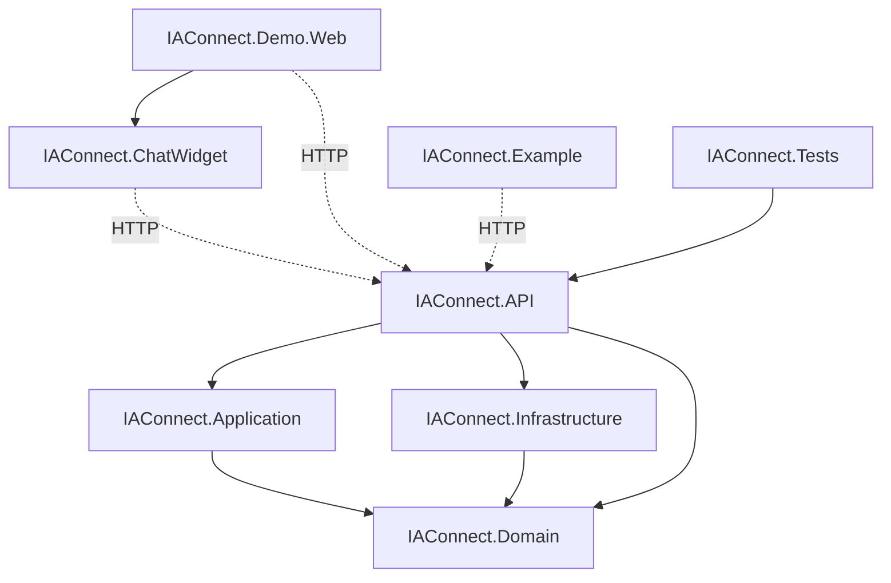

> **Índice maestro.** Visión general de IAConnect: qué es, con qué stack está construido, qué proyectos la
> componen y qué decisiones estructurales la definen. Fuente primaria: `/NG/Ng-IAServices` + `docs/`.

# 00 · Master Index — IAConnect

## Qué es

IAConnect es un **gateway multi-tenant de IA conversacional**: una API REST que recibe solicitudes de chat y
de procesamiento de texto (completion, analyze, summarize, improve), las enruta al **proveedor de IA configurado
por cada tenant** (Google Gemini, Anthropic Claude u OpenAI) y devuelve la respuesta, persistiendo la conversación,
las métricas de uso y una base de conocimiento por tenant para RAG. Un widget Blazor embebible y una web demo
consumen esa API.

## Stack tecnológico

| Capa | Tecnología |
|---|---|
| Lenguaje / runtime | C# 12 · .NET 8 (`net8.0`) |
| API | ASP.NET Core Web API + Swagger (Swashbuckle 6.9) |
| Autenticación | JWT Bearer (`Microsoft.AspNetCore.Authentication.JwtBearer`) + refresh tokens |
| UI | Blazor Server (Demo.Web) · Razor Class Library (ChatWidget) |
| Persistencia | SQL Server 2022 · patrón propietario **DataEntity-DataManager** sobre stored procedures |
| Proveedores IA | Google Gemini · Anthropic Claude (`api.anthropic.com`) · OpenAI — vía `HttpClient` |
| Contenedores | Docker (multi-stage) · docker-compose (API + SQL Server) |
| Pruebas | xUnit — unit + integration (`WebApplicationFactory`) |

## Proyectos (8) — inventario

| Proyecto | Tipo (Marco §7) | Rol | Doc de pieza |
|---|---|---|---|
| `IAConnect.Domain` | library | Entidades, enums, excepciones, interfaces (núcleo, sin dependencias) | `pieces/IAConnect.Domain/` |
| `IAConnect.Application` | library | Servicios de aplicación, DTOs, orquestación de casos de uso | `pieces/IAConnect.Application/` |
| `IAConnect.Infrastructure` | library | DataManagers (SP), `DataEntityCore`, providers IA, factory | `pieces/IAConnect.Infrastructure/` |
| `IAConnect.API` | service | Web API REST: controladores, middleware, JWT, Swagger | `pieces/IAConnect.API/` |
| `IAConnect.ChatWidget` | component-library | Widget de chat Blazor embebible (RCL) | `pieces/IAConnect.ChatWidget/` |
| `IAConnect.Demo.Web` | web-portal | App Blazor Server de demostración | `pieces/IAConnect.Demo.Web/` |
| `IAConnect.Example` | library (sample) | Consola de ejemplo de integración | `pieces/IAConnect.Example/` |
| `IAConnect.Tests` | test-support | xUnit unit + integration | `pieces/IAConnect.Tests/` |
| **Base de datos `IAConnect`** | database | SQL Server: 7 tablas + SP CRUD | `docs/03-data/` |

## Dependencias entre proyectos

## Decisiones estructurales clave (reconstruidas)

| # | Decisión | Dónde se ve | ADR |
|---|---|---|---|
| 1 | Clean Architecture con dependencias hacia el dominio | referencias de `.csproj` | ADR-0001 |
| 2 | Persistencia con patrón **DataEntity-DataManager** + stored procedures (no EF Core) | `IAConnect.Infrastructure/DataAccess`, `scripts/01_create_database.sql` | ADR-0002 |
| 3 | **Multi-tenancy** por `Id_Tenant` en ruta + filtro de acceso | `TenantResolverMiddleware`, `TenantAccessFilter` | ADR-0003 |
| 4 | **Abstracción de proveedor IA** vía `IAIProvider` + `AIProviderFactory` seleccionada por config del tenant | `Infrastructure/Providers` | ADR-0004 |
| 5 | Autenticación **JWT + refresh tokens** con bloqueo por intentos fallidos | `AuthService`, `sys_Refresh_Tokens` | ADR-0005 |
| 6 | **RAG** con fragmentos + `Vector_Embedding` por tenant | `RAGEngine`, `sys_Fragmentos_Conocimiento` | ADR-0006 |
| 7 | Configuración de modelo/temperatura/límites **por tenant** en `lut_Tenants` | `scripts/01_create_database.sql` | ADR-0003 |

## Casos de uso principales (fuente: `docs/02_especificacion_funcional/casos-de-uso/`)

CU-01 Chat multi-turno · CU-02 Completion · CU-03 Analyze · CU-04 Summarize · CU-05 Improve ·
CU-06 Gestionar tenant · CU-07 Cargar conocimiento (RAG).

## Documentación existente en el origen

El origen ya trae documentación en `/NG/Ng-IAServices/docs/` (contexto, casos de uso, arquitectura técnica,
prompts de generación, sprints, calidad, devops, developer guide, ejemplos). Esta ia-db y el conjunto
`IAConnect-docs/` **normalizan y verifican** ese material contra el código conforme al Marco; ante divergencia
código↔doc previa, **gana el código** y la divergencia se reporta.
