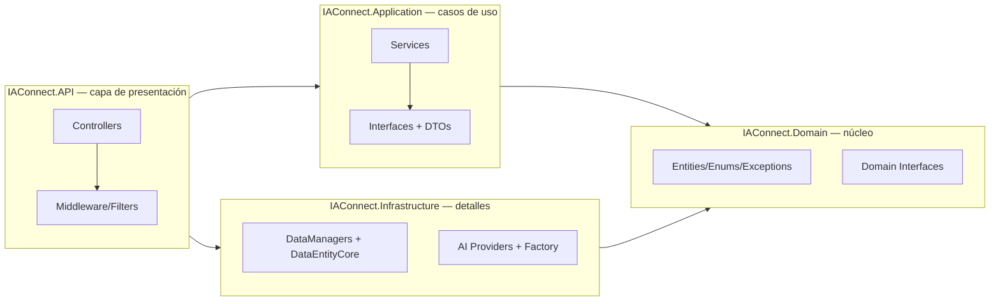
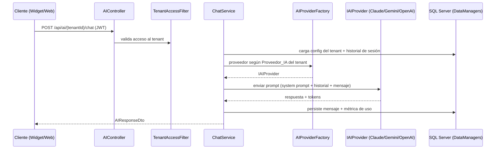

> **Índice de arquitectura.** Capas, dependencias, patrones y flujo de una solicitud IA de punta a punta.
> Fuente primaria: `IAConnect.API/Program.cs`, `IAConnect.Infrastructure/**`, `docs/05_arquitectura_tecnica/`.

# 01 · Arquitectura — IAConnect

## Estilo

**Clean Architecture** en 4 capas. La regla de dependencia apunta al centro (`Domain`); las capas externas
dependen de las internas, nunca al revés.

## Responsabilidad por capa

| Capa | Contiene | No contiene |
|---|---|---|
| Domain | `Entities/`, `Enums/`, `Exceptions/`, `Interfaces/` (contratos de DataManager y de proveedor IA) | Lógica de infraestructura, ASP.NET |
| Application | `Services/` (AuthService, ChatService, CompletionService, AnalyzeService, SummarizeService, ImproveService, TenantService, KnowledgeService, PromptBuilder, RAGEngine, ImageValidator), `DTOs/`, `Interfaces/` | Acceso directo a datos o HTTP a proveedores |
| Infrastructure | `DataAccess/DataEntityCore.cs`, `DataManagers/<Tabla>/`, `Models/`, `Providers/` (Claude/Gemini/OpenAI + `AIProviderFactory`) | Reglas de negocio |
| API | `Controllers/`, `Middleware/`, `Program.cs` (composición/DI, JWT, Swagger, CORS, health) | Lógica de negocio (delega en Application) |

## Patrones clave

| Patrón | Implementación | Fuente |
|---|---|---|
| DataEntity-DataManager | `DataEntityCore.Configure(connString)` en arranque; un `*DataManager` por tabla que invoca stored procedures | `Infrastructure/DataAccess/DataEntityCore.cs`, `Infrastructure/DataManagers/**` |
| Factory (proveedor IA) | `IAIProviderFactory` resuelve `IAIProvider` según `ProveedorIA` del tenant | `Infrastructure/Providers/AIProviderFactory.cs` |
| Strategy (proveedor IA) | `IAIProvider` con implementaciones Claude/Gemini/OpenAI intercambiables | `Infrastructure/Providers/*Provider.cs` |
| Middleware pipeline | `GlobalExceptionMiddleware` → auth → `TenantResolverMiddleware` → controllers | `API/Program.cs`, `API/Middleware/**` |
| Filter (autorización por tenant) | `TenantAccessFilter` (`ServiceFilter`) valida acceso al `{tenantId}` de la ruta | `API/Middleware/TenantAccessFilter.cs` |
| DI por constructor | Registro `Scoped`/`Singleton`/`HttpClient` en `Program.cs` | `API/Program.cs` |

## Composición del pipeline HTTP (orden real)

`UseMiddleware<GlobalExceptionMiddleware>` → `UseSwagger/UseSwaggerUI` → `UseCors` → `UseAuthentication` →
`UseAuthorization` → `UseMiddleware<TenantResolverMiddleware>` → `MapControllers` → `/health`.
Fuente: `IAConnect.API/Program.cs:128-154`.

## Flujo de una solicitud de chat (runtime, alto nivel)

Detalle de contrato → [`03_api-endpoints.md`](03_api-endpoints.md); detalle de proveedores/RAG →
[`04_proveedores-ia-y-rag.md`](04_proveedores-ia-y-rag.md).

## Documentación de detalle

- Arquitectura de solución: `docs/05_arquitectura_tecnica/arquitectura-solucion_v1.0.md`
- Decisiones: `docs/05_arquitectura_tecnica/decisiones-arquitectura_v1.0.md`
- Patrón de datos: `docs/05_arquitectura_tecnica/dataentity-datamanager-spec_v1.0.md`
- Doc generada (normalizada): `../IAConnect-docs/docs/01-architecture/`
