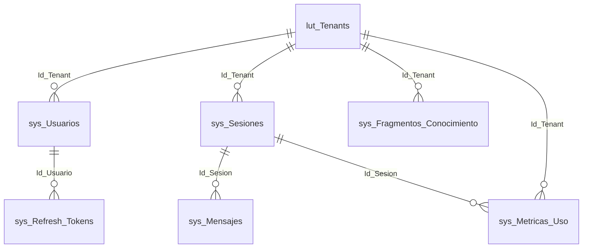

> **Índice de dominio y datos.** Entidades del dominio, enums y el modelo físico (7 tablas SQL Server con su
> patrón de stored procedures). Fuentes: `IAConnect.Domain/**`, `scripts/01_create_database.sql`.

# 02 · Dominio y Datos — IAConnect

## Entidades de dominio (`IAConnect.Domain/Entities/`)

| Entidad | Tabla física | Rol |
|---|---|---|
| `Tenant` | `lut_Tenants` | Cliente/organización con su configuración de IA (proveedor, modelo, prompt, límites, API key) |
| `Usuario` | `sys_Usuarios` | Usuario interno (admin/operador), con hash de contraseña y bloqueo por intentos |
| `Sesion` | `sys_Sesiones` | Conversación de un usuario externo dentro de un tenant |
| `Mensaje` | `sys_Mensajes` | Turno de conversación (user/assistant/system) con tokens e imagen opcional |
| `FragmentoConocimiento` | `sys_Fragmentos_Conocimiento` | Chunk de documento + `Vector_Embedding` para RAG |
| `MetricaUso` | `sys_Metricas_Uso` | Registro de consumo (tokens, proveedor, modelo, duración) |
| `RefreshToken` | `sys_Refresh_Tokens` | Token de refresco JWT con revocación |

## Enums (`IAConnect.Domain/Enums/`)

| Enum | Valores | Uso |
|---|---|---|
| `ProveedorIA` | `Gemini`, `Claude`, `OpenAI` | Selección de proveedor por tenant (factory) |
| `RolUsuario` | `admin`, `operador` (via check en BD) | Autorización |
| `RolMensaje` | `user`, `assistant`, `system` | Rol del turno de conversación |
| `TipoAnalisis` | (sentimiento/entidades/categorización) | Endpoint analyze |
| `ObjetivoMejora` | (gramática/claridad/formal/conciso) | Endpoint improve |

## Excepciones de dominio (`IAConnect.Domain/Exceptions/`)

`AccountLockedException` · `InvalidCredentialsException` · `TenantNotFoundException` ·
`ProviderUnavailableException` · `ImageNotAllowedException`. Traducidas a códigos HTTP por
`GlobalExceptionMiddleware`.

## Modelo físico — 7 tablas (SQL Server)

| Tabla | PK | FKs | Notas |
|---|---|---|---|
| `lut_Tenants` | `Id_Tenant varchar(50)` (clave de negocio) | — | `Proveedor_IA` ∈ {gemini,claude,openai}; `ApiKey_IA` (⚠ secreto en columna), `System_Prompt`, `Temperatura`, `Max_Tokens`, límites de imagen y de expiración de tokens |
| `sys_Usuarios` | `Id int IDENTITY` | `Id_Tenant`→lut_Tenants | `Rol` ∈ {admin,operador}; `Password_Hash`; `Intentos_Fallidos`, `Fecha_Bloqueo` |
| `sys_Sesiones` | `Id int IDENTITY` | `Id_Tenant`→lut_Tenants | `Id_Sesion uniqueidentifier UNIQUE`; `Id_Usuario_Externo` |
| `sys_Mensajes` | `Id bigint IDENTITY` | `Id_Sesion`→sys_Sesiones | `Rol` ∈ {user,assistant,system}; `Tokens_Prompt/Respuesta`, `Tiene_Imagen` |
| `sys_Fragmentos_Conocimiento` | `Id bigint IDENTITY` | `Id_Tenant`→lut_Tenants | `Vector_Embedding varbinary(MAX)` (RAG); `Documento_Origen`, `Indice_Fragmento` |
| `sys_Metricas_Uso` | `Id bigint IDENTITY` | `Id_Tenant`, `Id_Sesion` | `Total_Tokens`, `Duracion_Ms`, `Proveedor`, `Modelo` |
| `sys_Refresh_Tokens` | `Id int IDENTITY` | `Id_Usuario`→sys_Usuarios | `Token UNIQUE`, `Revocado`, `Fecha_Expiracion` |

**Columnas de auditoría** en todas las tablas: `Fecha_Alta`, `Fecha_Modificacion`, `Usuario_Alta`,
`Usuario_Modificacion` (default `'SYSTEM'`, `GETUTCDATE()`).

## Patrón de acceso a datos

Cada tabla tiene un juego de **stored procedures** `SP_<tabla>_Add|Update|Delete|GetAll|GetOne|GetBy_<col>[_Cantidad]`
y un `*DataManager` en `Infrastructure/DataManagers/<Tabla>/` (par Abstract + DataManager) más un `*Model` en
`Infrastructure/Models/`. `DataEntityCore` centraliza la conexión (configurada en `Program.cs` con
`GetConnectionString("IAConnect")`). Fuente: `scripts/01_create_database.sql` (7 tablas + índices + SP),
`Infrastructure/DataManagers/**`.

## ⚠ Observaciones de datos

- `lut_Tenants.ApiKey_IA` almacena la **API key del proveedor IA por tenant** en la BD (columna `varchar(500)`)
  **cifrada AES** por `TenantService` (clave por env `IACONNECT_ENCRYPTION_KEY`; ⚠ **fallback a texto plano** si la
  clave falta — `GAP-ENC-FALLBACK`). La config `Encryption:AesKey` de `appsettings.json` **no se usa**.
- Divergencia verificada: `Tenant.ProveedorIA`, `Usuario.Rol` y `Mensaje.Rol` son `string` en las entidades (no los
  enums homónimos). Las FKs de mensajes/métricas apuntan a `sys_Sesiones.Id` (int interno), no al GUID público `Id_Sesion`.
- `sys_Usuarios.Password_Hash`, `sys_Refresh_Tokens.Token`, `sys_Sesiones.Id_Usuario_Externo` y todo `Contenido`
  de mensajes son **candidatos a PII/secreto**; marcados para clasificación en el diccionario de datos.
- El script `scripts/01_create_database.sql` trae en su encabezado un servidor/usuario/clave de ejemplo:
  **no se reproducen** en la documentación (Marco §5.4/§14).

## Detalle

Diccionario de datos completo, ER en dbml y políticas de acceso → `../IAConnect-docs/docs/03-data/`.
Doc de origen: `docs/05_arquitectura_tecnica/modelo-datos_v1.0.md`.
