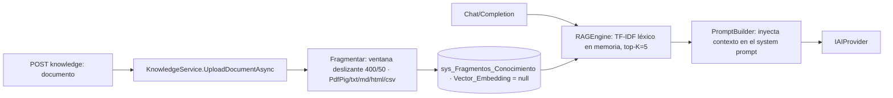

> **Índice de proveedores IA y RAG.** Abstracción multi-proveedor, factory, y la base de conocimiento
> por tenant. Fuentes: `Infrastructure/Providers/**`, `Application/Services/{RAGEngine,KnowledgeService,PromptBuilder}.cs`.

# 04 · Proveedores IA y RAG — IAConnect

## Abstracción de proveedor

| Elemento | Rol | Fuente |
|---|---|---|
| `IAIProvider` (Domain) | Contrato común de un proveedor IA | `Domain/Interfaces/IAIProvider.cs` |
| `IAIProviderFactory` (Domain) | Resuelve el `IAIProvider` según el proveedor del tenant | `Domain/Interfaces/IAIProviderFactory.cs` |
| `AIProviderFactory` (Infra) | Implementación de la factory | `Infrastructure/Providers/AIProviderFactory.cs` |
| `ClaudeProvider` | Anthropic Claude — `HttpClient` a `https://api.anthropic.com/` | `Infrastructure/Providers/ClaudeProvider.cs` |
| `GeminiProvider` | Google Gemini | `Infrastructure/Providers/GeminiProvider.cs` |
| `OpenAIProvider` | OpenAI | `Infrastructure/Providers/OpenAIProvider.cs` |

Selección: `lut_Tenants.Proveedor_IA` ∈ {`gemini`,`claude`,`openai`} → `ProveedorIA` enum → factory → provider.
El `HttpClient` "Claude" se registra en `Program.cs` con `BaseAddress = https://api.anthropic.com/` y timeout 60 s.

## Modelos por defecto (config, `appsettings.json` → `AIProviders`)

| Proveedor | `DefaultModel` (valor literal en config) |
|---|---|
| Gemini | `gemini-2.5-flash` |
| Claude | `claude-3-sonnet-20240229` |
| OpenAI | `gpt-4` |

> Valores tomados textualmente de `IAConnect.API/appsettings.json`. **⚠ Divergencia verificada:** estos
> `DefaultModel` de config **no se consumen** en `Infrastructure`; el modelo efectivo sale del tenant
> (`lut_Tenants.Nombre_Modelo`). Las API keys de config están **vacías** (placeholders); la real vive por tenant en
> `lut_Tenants.ApiKey_IA` **cifrada AES** (clave por env `IACONNECT_ENCRYPTION_KEY`; fallback a texto plano si falta)
> — nunca en la documentación. La factory selecciona con `switch(tenant.ProveedorIA.ToLower())`. Retry propio solo
> en Claude (`HttpClient` nombrado, `POST v1/messages`, headers `x-api-key`+`anthropic-version`); OpenAI/Gemini vía SDK.

## Servicios IA (Application)

| Servicio | Endpoint | Función |
|---|---|---|
| `ChatService` | chat | Conversación multi-turno con historial de sesión + system prompt del tenant |
| `CompletionService` | completion | Generación de texto desde un prompt |
| `AnalyzeService` | analyze | Análisis (sentimiento/entidades/categorización — `TipoAnalisis`) |
| `SummarizeService` | summarize | Resumen con longitud máxima |
| `ImproveService` | improve | Mejora de texto según `ObjetivoMejora` |
| `PromptBuilder` | (transversal) | Construye el prompt final (system prompt + contexto RAG + historial) |
| `ImageValidator` | (transversal) | Valida formato/tamaño de imagen contra la config del tenant |

## RAG (Retrieval-Augmented Generation)

- Carga: `KnowledgeController POST` → `KnowledgeService.UploadDocumentAsync(tenantId, stream, fileName)` extrae texto
  (PDF con PdfPig; txt/md/html/csv), **fragmenta por ventana deslizante 400/50** y devuelve `chunksCreated`.
- Almacenamiento: `sys_Fragmentos_Conocimiento` por tenant.
- **⚠ Divergencia verificada (código gana).** El esquema define `Vector_Embedding varbinary(MAX)` y el documento de
  origen `rag-spec_v1.0.md` describe **embeddings + similitud coseno (threshold 0.75)**, pero el código real
  (`RAGEngine.cs`, `KnowledgeService.cs`) implementa **recuperación léxica TF-IDF en memoria** (top-K=5, fallback por
  substring) y guarda `Vector_Embedding = null` (`SerializeEmbedding` es código muerto). Hoy el RAG **no es semántico**.
  Ver `../../IAConnect-docs/docs/04-decisions/ADR-0006-rag-por-tenant.md` (`GAP-RAG-SEMANTIC`).

## Métricas

Cada invocación registra `sys_Metricas_Uso` (tokens prompt/respuesta, total, proveedor, modelo, duración ms).

## Detalle

Doc de origen: `docs/05_arquitectura_tecnica/{proveedores-ia,rag-spec}_v1.0.md`.
Doc generada: `../IAConnect-docs/docs/pieces/IAConnect.Infrastructure/` y `.../IAConnect.Application/`.
